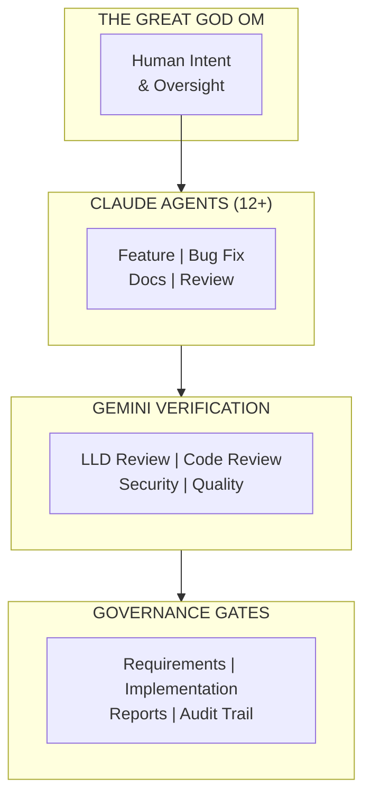

# AssemblyZero

[](https://github.com/martymcenroe/AssemblyZero/actions/workflows/ci.yml)

## Multi-Agent Orchestration Platform for Enterprise AI Development

> **Run 12+ AI agents concurrently. One identity. Full governance. Measurable ROI.**

---

## Production Evidence: 207 Issues in 27 Days

This isn't theoretical. AssemblyZero has processed **207 issues** (159 closed) in 27 days:

```
Issues closed per day (Central Time):
2026-01-21:  12 ############
2026-02-02:  23 #######################
2026-02-03:  55 #######################################################
2026-02-04:  31 ###############################
```

**Average velocity:** 5.9 issues/day | **Peak:** 55 issues in one day | **[Full Metrics →](https://github.com/martymcenroe/AssemblyZero/wiki/Metrics)**

---

## The Headline: Multi-Agent + Multi-Model



**What makes AssemblyZero different:**

| Capability | What It Means |
|------------|---------------|
| **12+ Concurrent Agents** | Multiple Claude agents work in parallel on features, bugs, docs - all under one user identity |
| **Gemini Reviews Claude** | Every design doc and code change is reviewed by Gemini 3 Pro before humans see it |
| **Enforced Gates** | LLD review, implementation review, report generation - gates that can't be skipped |
| **34 Governance Audits** | OWASP, GDPR, NIST AI Safety - adversarial audits that find violations |

---

## The Problem We Solve

AI coding assistants like Claude Code and GitHub Copilot are transforming development. **But enterprise adoption stalls** because:

| Challenge | Reality |
|-----------|---------|
| **No coordination** | Multiple agents conflict and duplicate work |
| **No governance** | Security teams can't approve ungoverned AI |
| **No verification** | AI-generated code goes unreviewed |
| **No metrics** | Leadership can't prove ROI |
| **Permission friction** | Constant approval prompts destroy flow state |

Organizations run pilots. Developers love the tools. Then adoption plateaus at 10-20% because **the infrastructure layer is missing**.

**AssemblyZero is that infrastructure layer.**

---

## Multi-Agent Orchestration

The headline feature: **run 12+ AI agents concurrently under single-user identity with full coordination**.

### How It Works

| Component | Function |
|-----------|----------|
| **Single-User Identity** | All agents share API credentials, git identity, permission patterns |
| **Worktree Isolation** | Each agent gets its own git worktree - no conflicts, clean PRs |
| **Credential Rotation** | Automatic rotation across API keys when quota exhausted |
| **Session Coordination** | Agents can see what others are working on via session logs |

### Agent Roles

| Role | Context | Tasks |
|------|---------|-------|
| **Feature Agent** | Full codebase | New functionality, refactors |
| **Bug Fix Agent** | Issue-focused | Specific bug investigation |
| **Documentation Agent** | Docs + code | README, wiki, API docs |
| **Review Agent** | PR diff | Code review assistance |
| **Audit Agent** | Compliance | Security, privacy audits |

**Result:** One engineer orchestrating 12+ agents can accomplish what previously required a team.

**[Full Architecture Documentation](https://github.com/martymcenroe/AssemblyZero/wiki/Multi-Agent-Orchestration)**

---

## Gemini Verification Layer

**The key differentiator: Claude builds, Gemini reviews.**

This isn't just "two models" - it's **adversarial verification** where one AI checks another's work before humans approve.

### Four Review Gates

| Gate | When | What Gemini Checks |
|------|------|-------------------|
| **Issue Review** | Before work starts | Requirements clarity, scope, risks |
| **LLD Review** | Before coding | Design completeness, security, testability |
| **Code Review** | Before PR | Quality, patterns, vulnerabilities |
| **Security Audit** | Before merge | OWASP Top 10, dependency risks |

### Why Multi-Model Matters

| Single Model | Multi-Model (AssemblyZero) |
|--------------|----------------------|
| Claude reviews Claude's work | Gemini reviews Claude's work |
| Same blind spots | Different model catches different mistakes |
| Trust the output | Verify the output |
| "It looks good to me" | Structured JSON verdicts: APPROVE/BLOCK |

### Model Verification

AssemblyZero detects **silent model downgrades**:
- Gemini CLI sometimes returns Flash when you request Pro
- Our tools verify the actual model used in the response
- If downgraded, the review is flagged as invalid

**[Gemini Architecture Details](https://github.com/martymcenroe/AssemblyZero/wiki/Gemini-Verification)**

---

## Governance Gates

Three mandatory checkpoints that **cannot be bypassed**:

```
Issue → LLD Review → Coding → Implementation Review → PR → Report Generation → Merge
         ↑                      ↑                           ↑
    Gemini Gate            Gemini Gate                 Auto-Generated
```

### LLD Review Gate

Before writing ANY code:
1. Design document submitted to Gemini
2. Gemini evaluates completeness, security, testability
3. **APPROVE** → Proceed to coding
4. **BLOCK** → Revise design first

**Cost of design fix:** 1 hour
**Cost of code fix:** 8 hours
**Cost of production fix:** 80 hours

### Implementation Review Gate

Before creating ANY PR:
1. Implementation report + test report submitted to Gemini
2. Gemini evaluates quality, coverage, security
3. **APPROVE** → Create PR
4. **BLOCK** → Fix issues first

### Report Generation Gate

Before merge, auto-generate:
- `implementation-report.md` - What changed and why
- `test-report.md` - Full test output, coverage metrics

**[Gate Implementation Details](https://github.com/martymcenroe/AssemblyZero/wiki/Governance-Gates)**

---

## Permission Friction Management

**Permission prompts are the #1 adoption killer.**

Every "Allow this command?" prompt breaks flow state. Developers either:
- Click "Allow" without reading (security risk)
- Get frustrated and stop using the tool (adoption failure)

### The Zugzwang Protocol

Real-time friction logging that captures every permission prompt:

```bash
# Run in separate terminal during development
poetry run python tools/zugzwang.py
```

### Pattern Detection

AssemblyZero identifies:
- Commands that always get approved → Add to allow list
- Commands that always get denied → Add to deny list
- Novel patterns → Flag for review

### Measurable Reduction

| Metric | Before | After |
|--------|--------|-------|
| Prompts per session | 15-20 | 2-3 |
| Time lost to prompts | 10+ min | < 1 min |
| Developer frustration | High | Low |

**[Permission Friction Deep Dive](https://github.com/martymcenroe/AssemblyZero/wiki/Permission-Friction)**

---

## 34 Governance Audits

Audits designed with an **adversarial philosophy**: they exist to find violations, not confirm compliance.

### Audit Categories

| Category | Count | Focus |
|----------|-------|-------|
| **Security & Privacy** | 3 | OWASP, GDPR, License compliance |
| **AI Governance** | 7 | Bias, Explainability, Safety, Agentic risks |
| **Code Quality** | 4 | Standards, Accessibility, Capabilities |
| **Permission Management** | 3 | Friction, Permissiveness, Self-audit |
| **Documentation Health** | 6 | Reports, LLD alignment, Terminology |
| **Extended** | 10 | Cost, Structure, References, Wiki |
| **Meta** | 1 | Audit system governance |

### Key Audits

| Audit | Standard | What It Checks |
|-------|----------|----------------|
| **0808** | OWASP LLM 2025 | AI-specific vulnerabilities |
| **0809** | OWASP Agentic 2026 | Agent autonomy risks |
| **0810** | ISO/IEC 42001 | AI management system |
| **0815** | Internal | Permission friction patterns |

**[Full Audit Catalog](https://github.com/martymcenroe/AssemblyZero/wiki/Audits-Catalog)**

---

## Metrics & KPIs

**"How do I prove ROI to leadership?"**

### Adoption Metrics

| Metric | What It Shows |
|--------|---------------|
| Active users / Total engineers | Adoption rate |
| Sessions per user per week | Engagement depth |
| Features shipped with AI assist | Productivity impact |

### Friction Metrics

| Metric | Target |
|--------|--------|
| Permission prompts per session | < 3 |
| Time to first productive action | < 30 seconds |
| Session abandonment rate | < 5% |

### Quality Metrics

| Metric | What It Shows |
|--------|---------------|
| Gemini first-pass approval rate | Design quality |
| PR revision count | Code quality |
| Post-merge defects | Overall quality |

### Cost Metrics

| Metric | Calculation |
|--------|-------------|
| Cost per feature | Total API spend / Features shipped |
| Cost per agent-hour | API spend / Active agent hours |
| ROI | (Time saved × Engineer cost) / Platform cost |

**[Full KPI Framework](https://github.com/martymcenroe/AssemblyZero/wiki/Measuring-Productivity)**

---

## Roadmap: LangGraph Evolution

AssemblyZero is **production-ready today** with prompt-based orchestration. The roadmap transforms it into enterprise-grade state machines:

| Phase | Timeline | Capability | Impact |
|-------|----------|------------|--------|
| **1** | Q1 2026 | LangGraph state machines | Gates structurally enforced |
| **2** | Q1 2026 | Checkpointing | Long tasks survive interruptions |
| **3** | Q2 2026 | Supervisor pattern | Autonomous task decomposition |
| **4** | Q2 2026 | LangSmith observability | Full dashboards, traces, cost attribution |
| **5** | Q3 2026 | Dynamic tool graphs | Context-aware tool selection |

### Why LangGraph?

| Current (Prompt-Based) | Future (LangGraph) |
|------------------------|-------------------|
| Gates enforced by instructions | Gates enforced by state machine |
| Context lost on compaction | Context checkpointed to database |
| Human routes tasks to agents | Supervisor auto-routes |
| Log parsing for metrics | LangSmith dashboards |

**[Full Roadmap and Vision](https://github.com/martymcenroe/AssemblyZero/wiki/LangGraph-Evolution)**

---

## Quick Start

### 1. Clone and Install

```bash
git clone https://github.com/martymcenroe/AssemblyZero.git
cd AssemblyZero
poetry install
```

### 2. Configure Your Project

```bash
mkdir -p YourProject/.claude
cp AssemblyZero/.claude/project.json.example YourProject/.claude/project.json
# Edit project.json with your project details
```

### 3. Generate Configs

```bash
poetry run python tools/assemblyzero-generate.py --project YourProject
```

### 4. Start Working

The generated configs include:
- Permission patterns that eliminate friction
- Slash commands for common operations
- Hooks for pre/post tool execution

**[Detailed Setup Guide](https://github.com/martymcenroe/AssemblyZero/wiki/Quick-Start)**

---

## Documentation

### Wiki

Full documentation at **[AssemblyZero Wiki](https://github.com/martymcenroe/AssemblyZero/wiki)** (32 pages):

| Page | Description |
|------|-------------|
| **[Metrics Dashboard](https://github.com/martymcenroe/AssemblyZero/wiki/Metrics)** | Velocity charts, Vetinari Index, production numbers |
| **[Multi-Agent Orchestration](https://github.com/martymcenroe/AssemblyZero/wiki/Multi-Agent-Orchestration)** | The headline feature - 12+ concurrent agents |
| **[Requirements Workflow](https://github.com/martymcenroe/AssemblyZero/wiki/Requirements-Workflow)** | LLD → Gemini → Approval flow |
| **[Implementation Workflow](https://github.com/martymcenroe/AssemblyZero/wiki/Implementation-Workflow)** | Worktree → Code → Reports → PR |
| **[Governance Gates](https://github.com/martymcenroe/AssemblyZero/wiki/Governance-Gates)** | LLD, implementation, report gates |
| **[How AssemblyZero Learns](https://github.com/martymcenroe/AssemblyZero/wiki/How-the-AssemblyZero-Learns)** | Self-improving governance from verdicts |
| **[Dramatis Personae](https://github.com/martymcenroe/AssemblyZero/wiki/Dramatis-Personae)** | The Discworld cast of workflows |
| **[LangGraph Evolution](https://github.com/martymcenroe/AssemblyZero/wiki/LangGraph-Evolution)** | Roadmap to enterprise state machines |
| **[Gemini Verification](https://github.com/martymcenroe/AssemblyZero/wiki/Gemini-Verification)** | Multi-model review architecture |
| **[Quick Start](https://github.com/martymcenroe/AssemblyZero/wiki/Quick-Start)** | 5-minute setup guide |

### For Different Audiences

| Audience | Start Here |
|----------|------------|
| **Engineering Leaders** | [Why AssemblyZero?](https://github.com/martymcenroe/AssemblyZero/wiki/For-Enterprise-Leaders-Why-AssemblyZero) |
| **Architects** | [Multi-Agent Orchestration](https://github.com/martymcenroe/AssemblyZero/wiki/Multi-Agent-Orchestration) |
| **Security Teams** | [Security & Compliance](https://github.com/martymcenroe/AssemblyZero/wiki/Security-Compliance) |
| **Developers** | [Quick Start](https://github.com/martymcenroe/AssemblyZero/wiki/Quick-Start) |

---

## About

AssemblyZero was built by **Martin McEnroe**, applying 29 years of enterprise technology leadership to the emerging challenge of **scaling AI coding assistants across engineering organizations**.

### Relevant Experience

| Role | Organization | Relevance |
|------|--------------|-----------|
| **Director, Data Science & AI** | AT&T | Led 45-person team, $10M+ annual savings from production AI |
| **VP Product** | Afiniti | AI-powered platform at scale |
| **AI Strategic Consultant** | TX DOT | 76-page enterprise AI strategy |

### Why This Project Exists

Having led enterprise AI adoption, I know the blockers:

| Blocker | AssemblyZero Solution |
|---------|------------------|
| "Security won't approve ungoverned AI" | 34 audits, Gemini gates, enforced checkpoints |
| "We can't measure productivity" | KPI framework, friction tracking, cost attribution |
| "Agents conflict with each other" | Worktree isolation, single-user identity model |
| "Developers hate the permission prompts" | Zugzwang protocol, pattern detection, auto-remediation |
| "It's just pilots, not real adoption" | Infrastructure that scales to organization-wide |

### Technical Foundation

- **LangChain, LangGraph, LangSmith** - Hands-on implementation experience
- **21 US Patents** - Innovation track record
- **CISSP, CCSP, AWS ML Specialty** - Security and ML credentials
- **GitHub Copilot, Claude Code** - Daily production use

### The Bottom Line

**This isn't theoretical. It's production infrastructure I use daily to orchestrate 12+ AI agents with full governance.**

The code in this repo is the same code that:
- Runs the Gemini verification gates
- Tracks permission friction patterns
- Generates the audit reports
- Manages credential rotation

**If you're scaling AI coding assistants across an engineering organization, this is the infrastructure layer you need.**

---

## Dramatis Personae

AssemblyZero workflows are named after **Terry Pratchett's Discworld** characters. This isn't whimsy—it's intuitive system design:

| Persona | Function | Philosophy |
|---------|----------|------------|
| **The Great God Om** | Human Orchestrator | Pure Intent—the agents serve the Will |
| **Moist von Lipwig** | Pipeline Orchestration | Keep the messages moving |
| **Lord Vetinari** | Work Visibility | Information is power |
| **Commander Vimes** | Regression Tests | Deep suspicion of everything |
| **Captain Angua** | External Intelligence | Track down solutions others miss |
| **Brutha** | RAG Memory | Perfect recall, never hallucinates |
| **Lu-Tze** | Maintenance | Constant sweeping prevents disasters |
| **DEATH** | Documentation Reconciliation | INEVITABLE. THOROUGH. PATIENT. |

**[Full Cast →](https://github.com/martymcenroe/AssemblyZero/wiki/Dramatis-Personae)**

*"A man is not dead while his name is still spoken."*
**GNU Terry Pratchett**

---

## License

PolyForm Noncommercial 1.0.0
