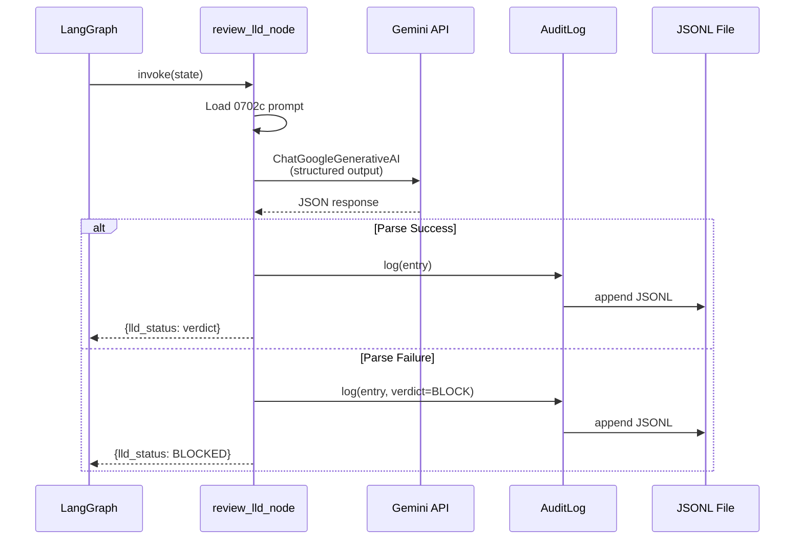

# 150 - Feature: Governance Node & Audit Logger

## 1. Context & Goal
* **Issue:** #50
* **Objective:** Build a LangGraph governance node with structured Gemini output and persistent audit logging with real-time viewer
* **Status:** Draft
* **Related Issues:** #48 (prerequisite, merged), #51 (future: log rotation), #52 (future: viewer filters)

### Open Questions
*None - requirements are well-defined from issue review.*

## 2. Proposed Changes

*This section is the **source of truth** for implementation. Describes exactly what will be built.*

### 2.1 Files Changed

| File | Change Type | Description |
|------|-------------|-------------|
| `agentos/nodes/__init__.py` | Modify | Export `review_lld_node` |
| `agentos/nodes/governance.py` | Add | Governance node implementation |
| `agentos/core/__init__.py` | Modify | Export `GovernanceAuditLog`, `GovernanceLogEntry` |
| `agentos/core/audit.py` | Add | Audit logging infrastructure |
| `tools/view_audit.py` | Add | Live audit viewer CLI |
| `logs/.gitkeep` | Add | Ensure logs directory exists in repo |
| `logs/.gitignore` | Add | Ignore `*.jsonl` files (production logs) |
| `pyproject.toml` | Modify | Add `watchdog` dependency |
| `tests/test_governance.py` | Add | Unit tests for governance node |
| `tests/test_audit.py` | Add | Unit tests for audit logger |

### 2.2 Dependencies

*New packages required.*

```toml
# pyproject.toml additions
watchdog = "^4.0.0"
```

Note: `tabulate` is optional - we'll use clean f-string formatting to avoid extra dependencies.

### 2.3 Data Structures

```python
# agentos/core/audit.py

from typing import TypedDict
from uuid import UUID

class GovernanceLogEntry(TypedDict):
    """Single entry in the governance audit log."""
    id: str                    # UUID as string
    sequence_id: int           # From state.iteration_count
    timestamp: str             # ISO8601 format
    node: str                  # Node name (e.g., "review_lld")
    model: str                 # Model used (e.g., "gemini-3-pro-preview")
    issue_id: int              # GitHub issue being reviewed
    verdict: str               # "APPROVED" or "BLOCK"
    critique: str              # Gemini's feedback
    tier_1_issues: list[str]   # Blocking issues found
    raw_response: str          # Full Gemini response
    duration_ms: int           # Call duration


class GeminiReviewResponse(TypedDict):
    """Structured output schema for Gemini LLD reviews."""
    verdict: str               # "APPROVED" or "BLOCK"
    critique: str              # Summary feedback
    tier_1_issues: list[str]   # Blocking issues (empty if approved)
```

### 2.4 Function Signatures

```python
# agentos/nodes/governance.py

from agentos.core.state import AgentState

def review_lld_node(state: AgentState) -> dict:
    """
    LangGraph node that gates LLDs through Gemini 3 Pro review.

    Loads system instruction from docs/skills/0702c-LLD-Review-Prompt.md,
    submits LLD content to Gemini with structured output, and updates state.

    Returns:
        dict with keys: lld_status, gemini_critique, iteration_count

    Fail-safe: Returns BLOCK if JSON parsing fails.
    """
    ...


def _load_system_instruction() -> str:
    """Load LLD review prompt from docs/skills/0702c-LLD-Review-Prompt.md."""
    ...


def _invoke_gemini_structured(
    system_instruction: str,
    lld_content: str,
    model: str = "gemini-3-pro-preview"
) -> tuple[GeminiReviewResponse, str, int]:
    """
    Invoke Gemini with structured JSON output.

    Returns:
        (parsed_response, raw_response, duration_ms)

    Raises:
        ValueError: If JSON parsing fails (caught by caller for fail-safe)
    """
    ...
```

```python
# agentos/core/audit.py

from pathlib import Path

class GovernanceAuditLog:
    """Persistent audit log for governance decisions."""

    def __init__(self, log_path: Path = Path("logs/governance_history.jsonl")):
        """Initialize with log file path. Creates parent dirs if needed."""
        ...

    def log(self, entry: GovernanceLogEntry) -> None:
        """Append entry to JSONL file with atomic write."""
        ...

    def tail(self, n: int = 10) -> list[GovernanceLogEntry]:
        """Return last N entries from log."""
        ...

    def __iter__(self) -> Iterator[GovernanceLogEntry]:
        """Iterate over all entries (for live viewer)."""
        ...
```

```python
# tools/view_audit.py

def main() -> None:
    """
    CLI entry point for audit viewer.

    Usage:
        python tools/view_audit.py [--tail N] [--live|--follow]
    """
    ...


def print_table(entries: list[GovernanceLogEntry]) -> None:
    """Print entries as formatted table."""
    ...


def watch_live(log_path: Path) -> None:
    """Watch log file and print new entries as they appear."""
    ...
```

### 2.5 Logic Flow (Pseudocode)

**Governance Node (`review_lld_node`):**
```
1. Increment state.iteration_count
2. Load system instruction from 0702c-LLD-Review-Prompt.md
3. Extract LLD content from state.lld_content
4. TRY:
   a. Invoke Gemini with structured output
   b. Parse JSON response
   c. Log to audit trail
   d. Return {lld_status: verdict, gemini_critique: critique}
5. CATCH JSON parse error:
   a. Log failure to audit trail (verdict=BLOCK, critique="Parse failure")
   b. Return {lld_status: "BLOCKED", gemini_critique: "JSON parse failure - fail-safe triggered"}
```

**Audit Logger (`log` method):**
```
1. Validate entry has all required fields
2. Serialize to JSON string
3. Open file in append mode
4. Write JSON + newline
5. Flush and close (atomic)
```

**Live Viewer (`watch_live`):**
```
1. Print existing entries (tail -N)
2. Get current file position
3. LOOP:
   a. Wait for file change event (watchdog) or 500ms poll
   b. Read new lines from last position
   c. Parse and print each new entry
   d. Update position
```

### 2.6 Technical Approach

* **Module:** `agentos/nodes/` for LangGraph nodes, `agentos/core/` for shared infrastructure
* **Pattern:** LangGraph state machine node with side effects (logging)
* **Key Decisions:**
  - Use `ChatGoogleGenerativeAI` with `response_format={"type": "json_object"}` for structured output
  - Fail-safe to BLOCK ensures security (fail closed)
  - JSONL format for append-only, line-by-line reading
  - `watchdog` for efficient file monitoring (event-driven vs polling)

## 3. Requirements

*What must be true when this is done.*

1. `review_lld_node` accepts `AgentState` and returns state updates
2. Node uses `ChatGoogleGenerativeAI` with JSON structured output
3. Node loads system instruction from `docs/skills/0702c-LLD-Review-Prompt.md`
4. Node defaults to BLOCK if JSON parsing fails (fail-safe)
5. Every governance call is logged to `logs/governance_history.jsonl`
6. Log entries contain all required fields (id, timestamp, model, verdict, etc.)
7. `view_audit.py` displays formatted table of entries
8. `view_audit.py --live` updates in real-time
9. All code passes mypy with no errors
10. Unit tests cover happy path, error cases, and fail-safe

## 4. Alternatives Considered

| Option | Pros | Cons | Decision |
|--------|------|------|----------|
| Pydantic for structured output | Built-in validation, LangChain support | Extra dependency complexity | **Rejected** |
| TypedDict + manual validation | Simple, no extra deps, sufficient | Less validation | **Selected** |
| SQLite for audit log | Query capability, ACID | Overkill for append-only, harder to inspect | **Rejected** |
| JSONL file | Simple, human-readable, tail-friendly | No queries (OK for now) | **Selected** |
| Polling for live viewer | Simple, no deps | CPU waste, latency | **Rejected** |
| watchdog for live viewer | Efficient, event-driven | Extra dependency | **Selected** |

**Rationale:** Simplicity wins. TypedDict + JSONL + watchdog is the minimum viable solution that meets all requirements without over-engineering.

## 5. Data & Fixtures

### 5.1 Data Sources

| Attribute | Value |
|-----------|-------|
| Source | Gemini API (via langchain-google-genai) |
| Format | JSON structured output |
| Size | ~1-5KB per response |
| Refresh | On-demand (per governance call) |
| Copyright/License | N/A - API responses |

### 5.2 Data Pipeline

```
LLD Content (state) ──invoke──► Gemini API ──parse──► GovernanceLogEntry ──append──► JSONL file
                                                              │
                                                              └──► State update
```

### 5.3 Test Fixtures

| Fixture | Source | Notes |
|---------|--------|-------|
| Valid LLD content | Hardcoded | Minimal LLD that passes review |
| Invalid LLD content | Hardcoded | LLD missing required sections |
| Mock Gemini response (approved) | Hardcoded | `{"verdict": "APPROVED", "critique": "...", "tier_1_issues": []}` |
| Mock Gemini response (blocked) | Hardcoded | `{"verdict": "BLOCK", "critique": "...", "tier_1_issues": ["..."]}` |
| Malformed response | Hardcoded | `{invalid json` for fail-safe test |

### 5.4 Deployment Pipeline

Development only - logs stay local. Production deployment is out of scope.

## 6. Diagram

### 6.1 Mermaid Quality Gate

- [x] **Simplicity:** Components collapsed appropriately
- [x] **No touching:** All elements have visual separation
- [x] **No hidden lines:** All arrows visible
- [x] **Readable:** Labels clear
- [ ] **Auto-inspected:** Will verify after rendering

**Auto-Inspection Results:**
```
- Touching elements: [ ] None / [ ] Found: ___
- Hidden lines: [ ] None / [ ] Found: ___
- Label readability: [ ] Pass / [ ] Issue: ___
- Flow clarity: [ ] Clear / [ ] Issue: ___
```

### 6.2 Diagram



## 7. Security Considerations

| Concern | Mitigation | Status |
|---------|------------|--------|
| API key exposure in logs | Only log model name, never credentials | Addressed |
| Prompt injection | System instruction from trusted file, not user input | Addressed |
| Log file tampering | Append-only, no delete API exposed | Addressed |
| Sensitive data in LLD | LLD content logged - acceptable for internal audit | Accepted |

**Fail Mode:** Fail Closed - If JSON parsing fails, verdict defaults to BLOCK. This ensures governance cannot be bypassed by malformed responses.

## 8. Performance Considerations

| Metric | Budget | Approach |
|--------|--------|----------|
| Gemini latency | < 30s | Single API call, no retries in node (handled upstream) |
| Log write | < 10ms | Append-only, no fsync per write |
| Viewer startup | < 1s | Read last N lines only, not full file |
| Live viewer latency | < 500ms | watchdog event-driven |

**Bottlenecks:** Gemini API latency dominates. Log operations are negligible.

## 9. Risks & Mitigations

| Risk | Impact | Likelihood | Mitigation |
|------|--------|------------|------------|
| Gemini returns non-JSON | Med | Low | Fail-safe to BLOCK |
| Log file corruption | Low | Low | JSONL is line-independent; one bad line doesn't affect others |
| watchdog not available | Low | Low | Fallback to polling if import fails |
| 0702c prompt file missing | High | Low | Fail with clear error at startup |

## 10. Verification & Testing

### 10.1 Test Scenarios

| ID | Scenario | Type | Input | Expected Output | Pass Criteria |
|----|----------|------|-------|-----------------|---------------|
| 010 | Valid LLD approved | Auto | Complete LLD content + mock APPROVED response | `lld_status: APPROVED` | State updated correctly |
| 020 | Invalid LLD blocked | Auto | Incomplete LLD + mock BLOCK response | `lld_status: BLOCKED` | State updated, tier_1_issues populated |
| 030 | JSON parse failure | Auto | Malformed Gemini response | `lld_status: BLOCKED` | Fail-safe triggered, logged |
| 040 | Audit entry written | Auto | Any governance call | Entry in JSONL | All 11 required fields present |
| 050 | Audit tail reads correctly | Auto | 5 entries written | `tail(3)` returns last 3 | Correct order, complete data |
| 060 | Viewer formats table | Auto | Sample entries | Formatted output | Columns aligned, data visible |
| 070 | Live viewer detects new entry | Auto | Write entry while watching | Entry printed | < 1s latency |
| 080 | Missing prompt file | Auto | Delete 0702c file | Clear error | Descriptive exception |

### 10.2 Test Commands

```bash
# Run all automated tests
poetry run pytest tests/test_governance.py tests/test_audit.py -v

# Run with coverage
poetry run pytest tests/test_governance.py tests/test_audit.py -v --cov=agentos

# Type check
poetry run mypy agentos/
```

### 10.3 Manual Tests (Only If Unavoidable)

| ID | Scenario | Why Not Automated | Steps |
|----|----------|-------------------|-------|
| 050 | Live viewer real-time update | Requires two terminals | 1. Run `python tools/view_audit.py --live` 2. In another terminal, trigger governance node 3. Verify entry appears in < 1s |

*Justification: Testing real-time file watching across processes is complex to automate reliably. Manual verification confirms the user experience.*

## 11. Definition of Done

### Code
- [ ] `agentos/nodes/governance.py` implemented with `review_lld_node`
- [ ] `agentos/core/audit.py` implemented with `GovernanceAuditLog`
- [ ] `tools/view_audit.py` implemented with `--live` support
- [ ] `watchdog` added to `pyproject.toml`
- [ ] `logs/.gitkeep` and `logs/.gitignore` created

### Tests
- [ ] All 8 test scenarios pass
- [ ] mypy passes with no errors
- [ ] Test coverage > 80% for new code

### Documentation
- [ ] LLD approved by Gemini review
- [ ] Implementation Report completed
- [ ] Test Report completed

### Review
- [ ] Implementation review passed (Gemini)
- [ ] PR approved and merged to main
- [ ] LLD and reports moved to `done/` directories

---

## Appendix: Review Log

*Track all review feedback with timestamps and implementation status.*

### Review Summary

| Review | Date | Verdict | Key Issue |
|--------|------|---------|-----------|
| (pending) | - | - | - |

**Final Status:** PENDING REVIEW
