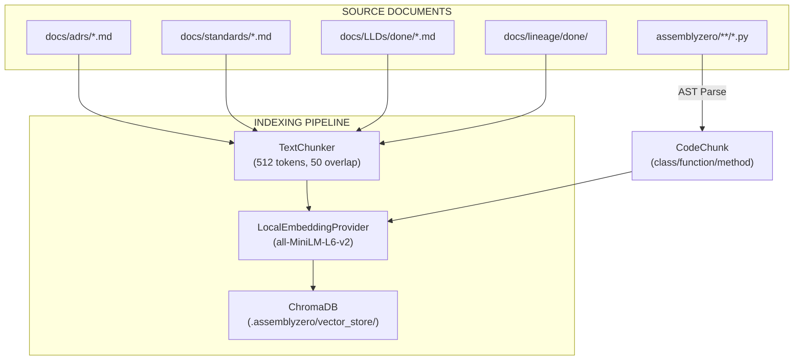
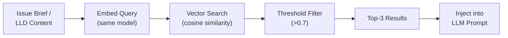
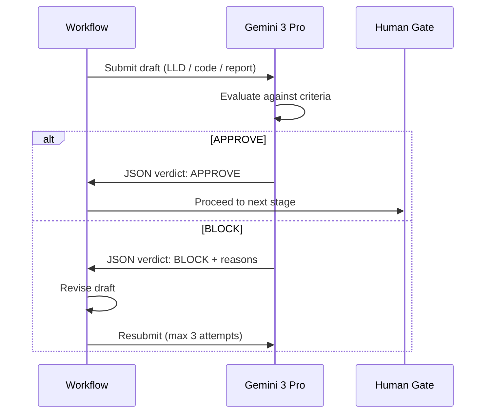

# Data Flow — How Work Moves Through AssemblyZero

## The Pipeline: Brief to Pull Request

Every piece of work follows the same governed path. Data transforms at each stage but the lineage is preserved.

```mermaid
graph LR
    subgraph Input["INPUT"]
        Brief["Brief<br/>(ideas/active/)"]
    end

    subgraph Issue["ISSUE WORKFLOW"]
        Draft["Draft Issue"]
        HistCheck["Historian Check<br/>(duplicate detection)"]
        IssueReview["Gemini Review"]
        GHIssue["GitHub Issue"]
    end

    subgraph LLD["REQUIREMENTS WORKFLOW"]
        LibQuery["Librarian Query<br/>(governance context)"]
        DesignDraft["Design Draft"]
        LLDReview["Gemini Review"]
        ApprovedLLD["Approved LLD"]
    end

    subgraph Spec["SPEC WORKFLOW"]
        HexQuery["Hex Query<br/>(codebase context)"]
        SpecDraft["Implementation Spec"]
        SpecReview["Human Review"]
    end

    subgraph Impl["TDD WORKFLOW"]
        HexImpl["Hex Query<br/>(codebase context)"]
        Code["Write Code + Tests"]
        ImplReview["Gemini Review"]
        PR["Pull Request"]
    end

    subgraph Post["POST-MERGE"]
        Merge["Merge"]
        Archive["Archive Lineage"]
        Wiki["Update Wiki"]
        Close["Close Issue"]
    end

    Brief --> Draft
    Draft --> HistCheck
    HistCheck --> IssueReview
    IssueReview --> GHIssue

    GHIssue --> LibQuery
    LibQuery --> DesignDraft
    DesignDraft --> LLDReview
    LLDReview -->|"APPROVE"| ApprovedLLD
    LLDReview -->|"BLOCK"| DesignDraft

    ApprovedLLD --> HexQuery
    HexQuery --> SpecDraft
    SpecDraft --> SpecReview

    SpecReview --> HexImpl
    HexImpl --> Code
    Code --> ImplReview
    ImplReview -->|"APPROVE"| PR
    ImplReview -->|"BLOCK"| Code

    PR --> Merge
    Merge --> Archive
    Merge --> Wiki
    Merge --> Close
```



## RAG Data Flow

The RAG subsystem has two distinct phases: **indexing** (batch, manual) and **retrieval** (per-query, automatic).

### Indexing Phase



**Trigger:** `poetry run python tools/rebuild_knowledge_base.py`

### Retrieval Phase



### RAG Consumer Map

| Consumer | What It Queries | What It Retrieves | Where Used |
|----------|----------------|-------------------|------------|
| **Librarian** | Issue brief | ADRs, standards, past LLDs | Requirements workflow (Designer node) |
| **Hex** | LLD/spec content | Python class/function signatures | Spec + TDD workflows |
| **Historian** | Issue brief | Past issues, closed lineage | Issue workflow (before drafting) |

## Artifact Lifecycle

Each work item generates artifacts that move through the filesystem:

```
ideas/active/my-feature.md          ← Brief (input)
    ↓
docs/lineage/active/123-feature/    ← Active lineage
    ├── issue-brief.md
    ├── lld.md
    ├── implementation-spec.md
    ├── implementation-report.md
    └── test-report.md
    ↓
docs/lineage/done/123-feature/      ← Archived on merge
docs/LLDs/done/123-lld.md           ← LLD preserved for RAG indexing
```

## Gemini Verification Flow



## References

- [End-to-End Orchestration (wiki)](https://github.com/martymcenroe/AssemblyZero/wiki/End-to-End-Orchestration)
- [ADR-0211: RAG Architecture](../adrs/0211-rag-architecture.md)
- [Requirements Workflow (wiki)](https://github.com/martymcenroe/AssemblyZero/wiki/Requirements-Workflow)
