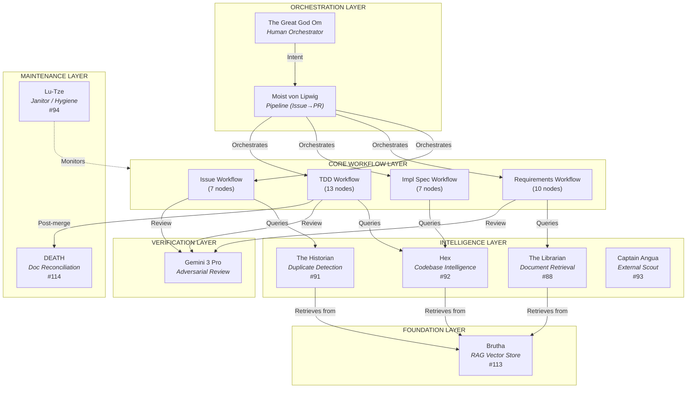

# System Overview — Persona Map

> *"A man is not dead while his name is still spoken."*

## The Discworld Agent Architecture

AssemblyZero's autonomous agents are organized into functional layers, each named after a Discworld character whose personality defines the agent's operational philosophy.

## Persona Implementation Status

| Persona | Layer | Status | Issue | Module |
|---------|-------|--------|-------|--------|
| The Great God Om | Orchestration | Active | — | Human-in-the-loop |
| Moist von Lipwig | Orchestration | Implemented | #305 | `tools/orchestrate.py` |
| Brutha | Foundation | Implemented | #113 | `assemblyzero/rag/` |
| The Librarian | Intelligence | Implemented | #88 | `assemblyzero/rag/librarian.py` |
| Hex | Intelligence | Implemented | #92 | `assemblyzero/rag/codebase_retrieval.py` |
| The Historian | Intelligence | Implemented | #91 | `assemblyzero/workflows/issue/nodes/historian.py` |
| Captain Angua | Intelligence | Implemented | #93 | `assemblyzero/workflows/scout/` |
| Lu-Tze | Maintenance | Implemented | #94 | `assemblyzero/workflows/janitor/` |
| DEATH | Maintenance | Manual | #114 | Documentation process |
| Lord Vetinari | Visibility | Planned | — | GitHub Projects automation |
| Commander Vimes | Security | Planned | — | Regression guardian |
| Lord Downey | Deletion | Planned | — | Safe code deletion |
| Ponder Stibbons | Quality | Planned | #307 | Auto-fix compositor |

## Layer Descriptions

### Orchestration Layer
**Om + Moist** — Human intent flows through the pipeline. Om provides the "what" and "why"; Moist ensures the message reaches its destination through all five stages.

### Core Workflow Layer
Four LangGraph state machines with SQLite checkpointing. Each workflow is retryable, resumable, and gated by Gemini verification.

### Intelligence Layer
**Librarian, Hex, Historian, Angua** — These personas provide context to the core workflows. The Librarian retrieves governance docs, Hex understands the codebase, the Historian checks for duplicates, and Angua scouts external repositories.

### Foundation Layer
**Brutha** — The shared RAG infrastructure (ChromaDB + local embeddings) that all intelligence personas build upon. Brutha remembers everything; he does not hallucinate.

### Maintenance Layer
**Lu-Tze + DEATH** — Post-execution care. Lu-Tze continuously sweeps (broken links, stale worktrees, drift). DEATH arrives after implementation to reconcile documentation.

### Verification Layer
**Gemini 3 Pro** — Adversarial review at three gates: issue review, LLD review, and implementation review. Claude builds; Gemini reviews.

## References

- [Dramatis Personae (wiki)](https://github.com/martymcenroe/AssemblyZero/wiki/Dramatis-Personae)
- [ADR-0210: Discworld Persona Convention](../adrs/0210-discworld-persona-convention.md)
- [ADR-0211: RAG Architecture](../adrs/0211-rag-architecture.md)
