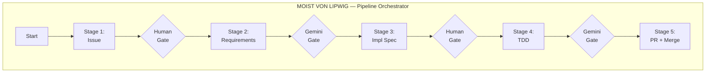
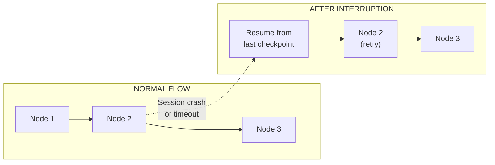
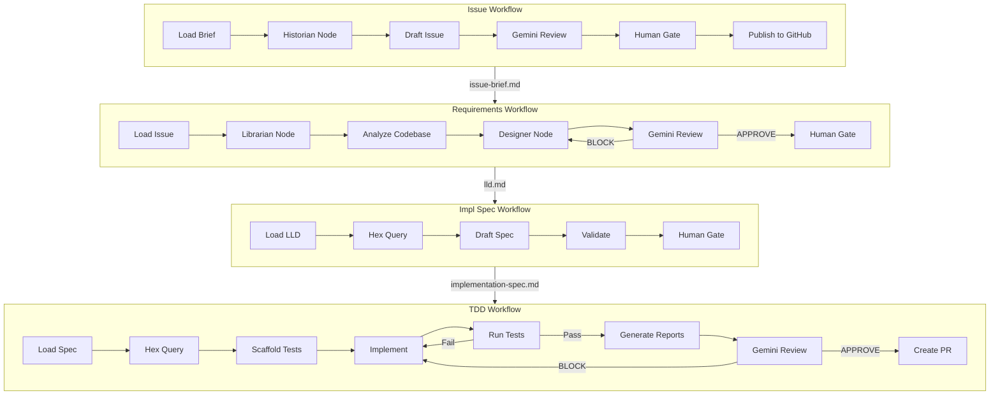
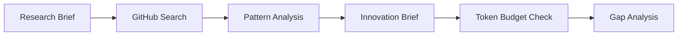
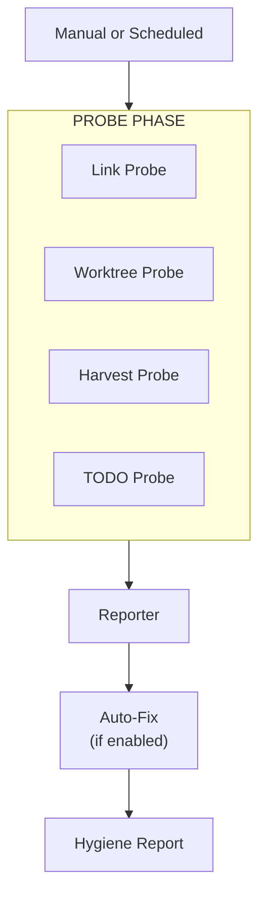

# Workflow Interactions — How Workflows Chain

## Pipeline Orchestration (Moist von Lipwig)

The five workflow stages are independent LangGraph state machines that chain together through shared filesystem artifacts. Moist (the orchestrator) drives the pipeline, ensuring each stage completes before the next begins.

### Stage Handoff Protocol

Each stage writes its output to the lineage directory. The next stage reads from there:

| Stage | Reads | Writes | Gate |
|-------|-------|--------|------|
| Issue | `ideas/active/*.md` | `lineage/active/N/issue-brief.md` | Human approval |
| Requirements | Issue brief + RAG context | `lineage/active/N/lld.md` | Gemini APPROVE |
| Impl Spec | LLD + codebase context | `lineage/active/N/implementation-spec.md` | Human approval |
| TDD | Impl spec + codebase context | Code + tests + reports | Gemini APPROVE |
| Merge | PR approved | `lineage/done/N/` (archived) | Human merge |

## Checkpoint / Resume

Every workflow uses SQLite checkpointing via LangGraph's `SqliteSaver`. This means:

- Checkpoints are stored in `.assemblyzero/checkpoints/`
- Each workflow invocation gets a unique thread ID
- On resume, the workflow picks up from the last completed node
- State includes: all node outputs, RAG results, Gemini verdicts, iteration counts

## Workflow-to-Persona Dependencies

## Supporting Workflows

### Scout Workflow (Angua)

The Scout runs independently — it is triggered on demand, not as part of the main pipeline.

### Janitor Workflow (Lu-Tze)

The Janitor runs on a schedule or on demand. It does not feed into the main pipeline but maintains the environment.

## Human Gates

Every workflow has at least one human gate. These are explicit pause points where the human orchestrator (Om) reviews and approves before the system proceeds.

| Workflow | Gate Location | What Human Reviews |
|----------|--------------|-------------------|
| Issue | After Gemini review | Draft issue quality |
| Requirements | After Gemini APPROVE | LLD design decisions |
| Impl Spec | After validation | Spec completeness |
| TDD | Before PR creation | Code + test quality |
| Merge | PR approval | Final review |

Gates cannot be bypassed. The `--yes` flag exists only on the LLD workflow for batch processing scenarios.

## References

- [End-to-End Orchestration (wiki)](https://github.com/martymcenroe/AssemblyZero/wiki/End-to-End-Orchestration)
- [LangGraph Evolution (wiki)](https://github.com/martymcenroe/AssemblyZero/wiki/LangGraph-Evolution)
- [Governance Gates (wiki)](https://github.com/martymcenroe/AssemblyZero/wiki/Governance-Gates)
