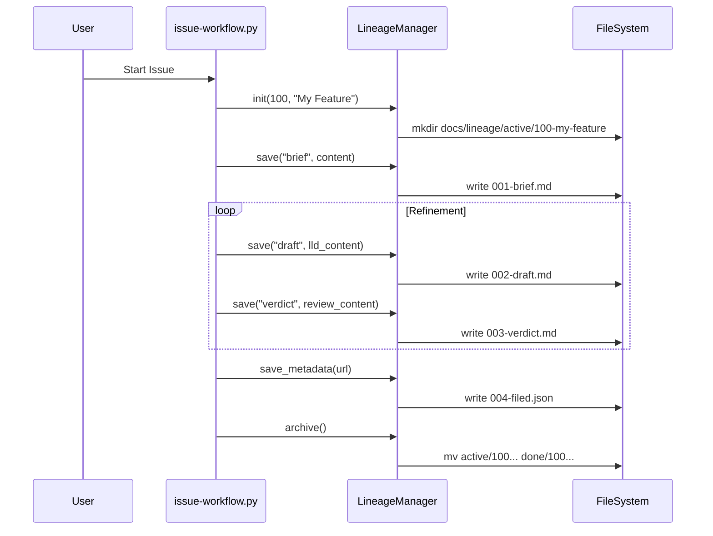

# 100 - Feature: Lineage workflow integration: standardize design review artifacts

## 1. Context & Goal
* **Issue:** #100
* **Objective:** Standardize the storage of design review artifacts (briefs, drafts, verdicts) into a canonical `docs/lineage/` directory structure within the issue and LLD workflows.
* **Status:** Draft
* **Related Issues:** N/A

### Open Questions
None - requirements are well-defined from issue.

## 2. Proposed Changes

### 2.1 Files Changed
| File | Action | Description |
|------|--------|-------------|
| `tools/issue-workflow.py` | Modify | Implement `LineageHandler` class, update main loop to save artifacts to `docs/lineage/active/{id}/`, and move to `done` upon completion. |
| `tools/lld-workflow.py` | Modify | Update arguments to accept a lineage directory path and save draft/verdict iterations there. |
| `tools/new-repo-setup.py` | Modify | Add creation of `docs/lineage/active` and `docs/lineage/done` directories during setup. |

### 2.2 Dependencies
* **Python Standard Library:** `pathlib`, `shutil`, `json`, `datetime` (No new external packages).

### 2.3 Data Structures

**LineageContext (TypedDict)**
```python
class LineageContext(TypedDict):
    issue_id: str
    slug: str
    active_dir: Path
    sequence: int
```

**FilingMetadata (TypedDict)**
```python
class FilingMetadata(TypedDict):
    issue_url: str
    filed_at: str
    total_iterations: int
    final_verdict: str
```

### 2.4 Function Signatures

**In `tools/issue-workflow.py` (New Helper Class):**

```python
class LineageManager:
    def __init__(self, issue_id: str, title: str, base_path: str = "docs/lineage"):
        """Initialize lineage paths and ensure directories exist."""
        pass

    def get_next_filename(self, tag: str, extension: str = "md") -> Path:
        """Calculates next sequence number (e.g., 002) and returns full path with tag."""
        pass

    def save_artifact(self, tag: str, content: str) -> Path:
        """Saves content to the next sequence file."""
        pass
    
    def save_metadata(self, metadata: dict) -> Path:
        """Saves the filing metadata json."""
        pass

    def archive_lineage(self) -> Path:
        """Moves the folder from active/ to done/."""
        pass
```

**In `tools/new-repo-setup.py`:**

```python
def create_lineage_directories():
    """Creates docs/lineage/active and docs/lineage/done."""
    pass
```

### 2.5 Logic Flow (Pseudocode)

**Issue Workflow Main Loop**

```python
def main():
    # 1. Input Gathering
    issue_input = get_issue_input()
    issue_id = issue_input.id
    slug = slugify(issue_input.title)
    
    # 2. Initialize Lineage
    lineage = LineageManager(issue_id, slug)
    
    # 3. Save Brief
    lineage.save_artifact("brief", issue_input.description) # 001-brief.md
    
    # 4. Draft Loop
    approved = False
    while not approved:
        # Generate LLD Draft
        draft_content = generate_lld(context)
        draft_path = lineage.save_artifact("draft", draft_content) # 002-draft.md (or 004, etc)
        
        # Review Draft
        verdict, critique = get_gemini_review(draft_content)
        lineage.save_artifact("verdict", f"{verdict}\n\n{critique}") # 003-verdict.md
        
        if verdict == "APPROVED":
            approved = True
        else:
            context.update(critique)

    # 5. Filing
    issue_url = github_api.create_issue(draft_content)
    
    # 6. Finalize
    lineage.save_metadata({
        "issue_url": issue_url, 
        "timestamp": now()
    }) # NNN-filed.json
    
    lineage.archive_lineage() # Move to docs/lineage/done/
```

### 2.6 Technical Approach
*   **Directory Structure:** We will use `pathlib.Path` for robust path manipulation.
*   **Sequence Generation:** The `LineageManager` will look at existing files in the directory, parse the leading integer (e.g., `002`), find the max, and increment.
*   **Slug Generation:** Standard lower-case, hyphen-separated string generation from the issue title for folder readability.
*   **Integration:** The `LineageManager` class will be defined in `issue-workflow.py` initially. If `lld-workflow.py` is run standalone, it will implement a simplified version or import it if we decide to move it to a shared lib later (keeping it local for now to minimize dependencies).

## 3. Requirements
1.  **Directory Creation:** `tools/issue-workflow.py` MUST create `docs/lineage/active/{id}-{slug}/` upon initialization.
2.  **Brief Storage:** The initial issue description/brief MUST be saved as `001-brief.md`.
3.  **Draft Storage:** Every generated LLD draft MUST be saved with an incrementing prefix and `-draft.md` suffix (e.g., `002-draft.md`).
4.  **Verdict Storage:** Every AI review verdict MUST be saved with an incrementing prefix and `-verdict.md` suffix (e.g., `003-verdict.md`).
5.  **Metadata Storage:** Upon successful filing, a JSON file with metadata MUST be saved as `{NNN}-filed.json`.
6.  **Archival:** Upon successful filing, the entire lineage folder MUST be moved from `active/` to `done/`.
7.  **Repo Setup:** `new-repo-setup.py` MUST create the `docs/lineage` root structure.

## 4. Alternatives Considered

| Option | Pros | Cons | Decision |
|--------|------|------|----------|
| **Central Database (SQLite)** | structured querying of history. | Overkill for markdown artifacts; adds dependency. | **Rejected** |
| **Flat directory** (`docs/lineage/100-draft.md`) | Simple to browse. | Cluttered; hard to group iteration cycles. | **Rejected** |
| **Subfolder per iteration** (`100/v1/`, `100/v2/`) | Very organized. | Harder to see the linear narrative of "Draft -> Verdict -> Draft". | **Rejected** |
| **Sequential files in Folder** (Proposed) | Clear chronological history; easy to read naturally. | Requires logic to calculate next number. | **Selected** |

## 5. Data & Fixtures

### 5.1 Data Sources
*   **User Input:** Issue Title, Body (Brief).
*   **LLM Output:** LLD Draft content, Critique/Verdict.
*   **GitHub API:** Issue URL after filing.

### 5.2 Data Pipeline
```ascii
[User Input] 
    |
    v
[LineageManager] -> Creates "active/100-feature/" -> Writes "001-brief.md"
    |
    v
[LLD Generator] -> Generates Content
    |
    v
[LineageManager] -> Writes "002-draft.md"
    |
    v
[Reviewer Agent] -> Generates Verdict
    |
    v
[LineageManager] -> Writes "003-verdict.md"
    |
    v
(Repeat if rejected)
    |
    v
[GitHub API] -> Returns URL
    |
    v
[LineageManager] -> Writes "004-filed.json" -> Moves folder to "done/"
```

### 5.3 Test Fixtures
| Fixture | Description |
|---------|-------------|
| `temp_repo_root` | A temporary directory mocking the repo root with `docs/lineage`. |
| `mock_llm_response` | String content for drafts and verdicts. |

### 5.4 Deployment Pipeline
Development only. Changes apply to local developer tools.

## 6. Diagram

### 6.1 Mermaid Quality Gate
- [x] Syntax Valid
- [x] Flow Direction Clear
- [x] Nodes Labeled

### 6.2 Diagram


## 7. Security Considerations
| Concern | Mitigation |
|---------|------------|
| Overwriting existing files | Sequence logic ensures new files are always appended, never overwritten (unless file name collision, which `get_next_sequence` prevents). |
| Path Traversal | Issue ID and Title should be sanitized/slugified before being used in directory creation. |

## 8. Performance Considerations
| Metric | Budget |
|--------|--------|
| File I/O | Negligible (Text files < 100KB). |
| Sequence Calculation | Fast (Listing directory < 100 files). |

## 9. Risks & Mitigations
| Risk | Impact | Likelihood | Mitigation |
|------|--------|------------|------------|
| Sequence Desync | Files named out of order (e.g., user deletes one). | Low | The `get_next_sequence` logic should find the max existing number and increment, regardless of gaps. |
| Folder Collision | Existing folder for same issue ID. | Low | Check if folder exists on init; if so, resume from existing state (append) rather than crash. |

## 10. Verification & Testing

### 10.1 Test Scenarios
| ID | Scenario | Type | Input | Output | Criteria |
|----|----------|------|-------|--------|----------|
| T1 | New Issue Lineage | Happy Path | ID: 50, Title: "Test" | Folder `active/50-test/` | Folder exists, contains `001-brief.md`. |
| T2 | Sequence Increment | Logic | `001`...`003` exist | `004-draft.md` | File created with correct number. |
| T3 | Archive Lineage | Happy Path | Filing Complete | Folder in `done/` | `active/` is empty, `done/50-test` exists. |
| T4 | Existing Folder | Edge Case | Folder `50-test` exists | Resume sequence | No error, new files appended to existing folder. |

### 10.2 Test Commands
```bash
# Run the unit tests for the updated scripts (assuming pytest)
pytest tests/tools/test_issue_workflow.py

# Manual verification command sequence
python tools/issue-workflow.py --dry-run --title "Lineage Test" --id 999
ls -R docs/lineage/active/999-lineage-test/
```

### 10.3 Manual Tests
| Scenario | Steps | Expected Result |
|----------|-------|-----------------|
| Full Cycle | 1. Run workflow.<br>2. Provide brief.<br>3. Generate draft.<br>4. Accept.<br>5. Check folders. | `docs/lineage/done/NNN...` contains full history (brief, draft, verdict, json). |

## 11. Definition of Done

### Code
- [ ] `LineageManager` class implemented.
- [ ] `issue-workflow.py` updated to use `LineageManager`.
- [ ] `lld-workflow.py` updated to support lineage paths.
- [ ] `new-repo-setup.py` updated to scaffold directories.

### Tests
- [ ] Logic tests for sequence generation pass.
- [ ] File system operations (create/move) verified.

### Documentation
- [ ] Update internal wiki/docs about the new artifacts location (if applicable).
- [ ] Docstrings added to new class methods.

### Review
- [ ] Code review passed.
- [ ] Verified that `active/` and `done/` structure is respected.

---

## Appendix: Review Log

### Review Summary

| Review | Date | Verdict | Key Issue |
|--------|------|---------|-----------|
| - | - | - | - |

**Final Status:** DRAFT - PENDING REVIEW