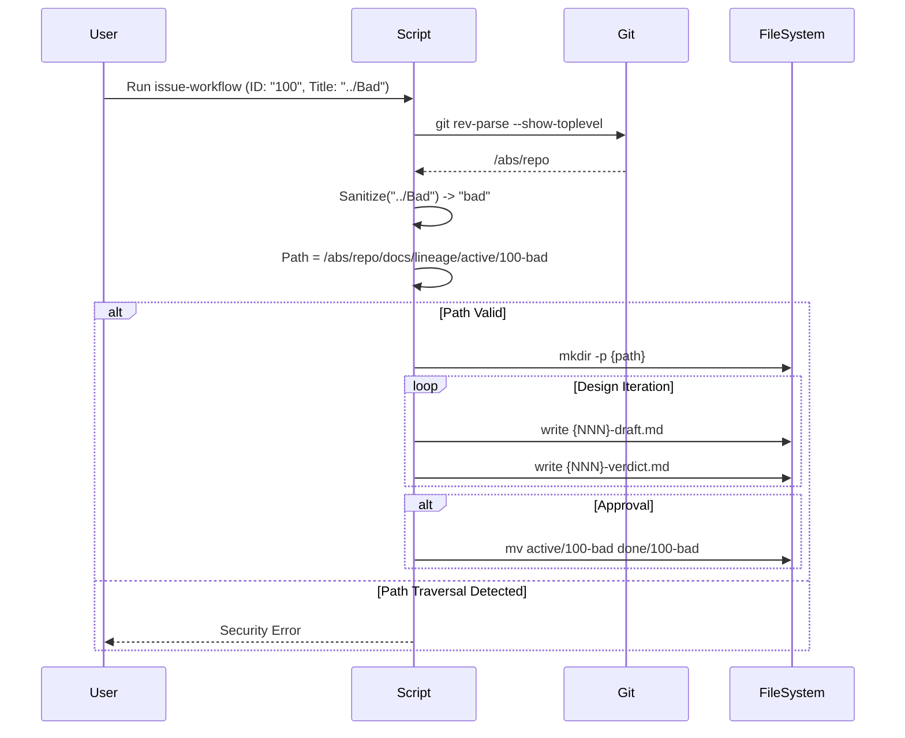

# 100 - Feature: Lineage workflow integration: standardize design review artifacts

## 1. Context & Goal
* **Issue:** #100
* **Objective:** Standardize the storage of design review artifacts (briefs, drafts, verdicts) into a canonical `docs/lineage/` directory structure within the issue and LLD workflows, ensuring robust path resolution and strict input sanitization.
* **Status:** Draft
* **Related Issues:** Standard 0009 (Commit 1d5132c), RCA-PDF (Commit 76a13fc)

### Open Questions
None - requirements are well-defined from issue.

## 2. Proposed Changes

### 2.1 Files Changed
| File | Action | Description |
|------|--------|-------------|
| `tools/issue-workflow.py` | Modify | Implement `LineageManager` class with Git-root anchoring and strict input sanitization; integrate artifact saving logic; implement collision-safe archival. |
| `tools/lld-workflow.py` | Modify | Add `--lineage-dir` argument; update output logic to write to specific directory if provided; verify paths are within repo bounds. |
| `tools/new-repo-setup.py` | Modify | Add `docs/lineage/active` and `docs/lineage/done` to the directory scaffolding list. |

### 2.2 Dependencies
* **Python Standard Library:** `pathlib`, `shutil`, `json`, `datetime`, `re` (slugification), `subprocess` (git command).
* **External:** None.

### 2.3 Data Structures

**LineageState (Class Attribute)**
```python
class LineageState(TypedDict):
    issue_id: str
    slug: str
    active_path: Path  # Absolute path resolved to repo root
    current_sequence: int
```

**FilingMetadata (JSON Schema)**
```json
{
  "issue_url": "https://github.com/org/repo/issues/100",
  "filed_at": "2026-01-23T14:00:00Z",
  "iterations": 3,
  "final_verdict": "APPROVED"
}
```

### 2.4 Function Signatures

**In `tools/issue-workflow.py` (New Helper & Class):**

```python
def get_repo_root() -> Path:
    """
    Returns the absolute path to the git repository root.
    Uses `git rev-parse --show-toplevel`.
    Raises RuntimeError if not in a git repo.
    """
    pass

def sanitize_filename(text: str) -> str:
    """
    Strictly sanitizes input to allow only alphanumeric characters and hyphens.
    Replaces all other characters with a single hyphen.
    Prevents path traversal characters like '..' or '/'.
    """
    pass

class LineageManager:
    def __init__(self, issue_id: str, title: str):
        """
        Initializes the manager using absolute paths anchored to repo root.
        1. Calls get_repo_root().
        2. Sanitizes issue_id and title strictly.
        3. Sets base_path = repo_root / "docs/lineage".
        4. Sets active_path = base_path / "active" / f"{safe_id}-{safe_slug}".
        5. SECURITY: Verifies active_path is relative to base_path.
        6. Creates directory if missing.
        """
        pass

    def _get_next_sequence(self) -> int:
        """
        Scans active_path for files matching `^(\d{3})-.*`.
        Returns max(found) + 1, or 1 if empty.
        """
        pass

    def save_artifact(self, tag: str, content: str, ext: str = "md") -> Path:
        """
        1. Calls _get_next_sequence().
        2. Generates filename: {NNN}-{tag}.{ext}.
        3. Writes content to file.
        4. Returns full absolute path.
        """
        pass
    
    def archive(self) -> Path:
        """
        Moves folder from active/ to done/.
        CRITICAL: Checks if destination exists. Raises FileExistsError 
        to prevent data loss.
        """
        pass
```

### 2.5 Logic Flow (Pseudocode)

**Path Resolution & Sanitization (Security Focus)**
```python
def get_repo_root():
    try:
        # Securely find root regardless of CWD
        root = subprocess.check_output(
            ["git", "rev-parse", "--show-toplevel"], 
            stderr=subprocess.DEVNULL
        ).strip().decode('utf-8')
        return Path(root).resolve()
    except subprocess.CalledProcessError:
        raise RuntimeError("Must be run inside a git repository.")

def sanitize_filename(text: str) -> str:
    # Allow only a-z, 0-9. Replace everything else with -.
    # Collapse multiple hyphens.
    slug = re.sub(r'[^a-z0-9]+', '-', text.lower())
    return slug.strip('-')

class LineageManager:
    def __init__(self, issue_id, title):
        self.repo_root = get_repo_root()
        self.lineage_root = self.repo_root / "docs" / "lineage"
        
        # Strict Sanitization
        safe_id = sanitize_filename(str(issue_id))
        safe_slug = sanitize_filename(title)
        
        if not safe_id:
            raise ValueError("Issue ID resulted in empty string after sanitization")
            
        folder_name = f"{safe_id}-{safe_slug}"
        self.active_path = (self.lineage_root / "active" / folder_name).resolve()
        self.done_path_root = (self.lineage_root / "done").resolve()
        
        # Security Guard: Path Traversal Check
        # Ensure the final active path is actually inside the lineage root
        if not str(self.active_path).startswith(str(self.lineage_root)):
            raise SecurityError("Path traversal detected in lineage path generation.")
        
        # Ensure parent lineage dirs exist
        (self.lineage_root / "active").mkdir(parents=True, exist_ok=True)
        (self.lineage_root / "done").mkdir(parents=True, exist_ok=True)
        
        # Create specific issue folder
        self.active_path.mkdir(exist_ok=True)
```

**Main Workflow Logic**
```python
MAX_ITERATIONS = 5

def main():
    issue = get_input()
    # Initialize with secure pathing
    try:
        lineage = LineageManager(issue.id, issue.title)
    except SecurityError as e:
        print(f"FATAL: {e}")
        exit(1)
    
    # Save Initial Brief
    lineage.save_artifact("brief", issue.body)
    
    # Design Loop
    iteration = 0
    while iteration < MAX_ITERATIONS:
        iteration += 1
        
        # Invoke LLD Generator with absolute path
        cmd = [
            "python", "tools/lld-workflow.py",
            "--goal", issue.objective,
            "--lineage-dir", str(lineage.active_path)
        ]
        run_subprocess(cmd)
        
        # Load draft and review
        draft_path = lineage.get_latest_file("draft")
        verdict = get_ai_review(draft_path)
        lineage.save_artifact("verdict", verdict.text)
        
        if verdict.status == "APPROVED":
            # File Issue
            url = github.post_issue(draft_path)
            lineage.save_filing_metadata(url, iteration)
            
            # Archive
            try:
                lineage.archive()
                print("Filed and archived.")
            except FileExistsError:
                print("Filed, but archive failed due to collision.")
            break
            
        if not user_continue_check():
            break
```

### 2.6 Technical Approach
1.  **Repo-Relative Anchoring:** The system explicitly resolves the Git repository root using `git rev-parse` to ensure location independence.
2.  **Strict Sanitization:** To address security review concerns, all file system inputs (issue ID, title) pass through a strict whitelist regex (`[^a-z0-9]`) replacer. This neutralizes path traversal characters (`..`, `/`) before they ever touch `pathlib`.
3.  **Boundary Verification:** As a final defense-in-depth measure, `LineageManager` asserts that the resolved `active_path` is a subdirectory of `docs/lineage` before creating directories.
4.  **Atomic Archival:** The transition from `active/` to `done/` checks for destination existence to prevent overwrites.

## 3. Requirements
1.  **Path Safety:** The system MUST resolve paths relative to the Git repository root, not the current working directory.
2.  **Input Sanitization:** The system MUST sanitize issue IDs and titles to remove all non-alphanumeric characters (except hyphens) to prevent path traversal.
3.  **Directory Structure:** MUST maintain `docs/lineage/active/` and `docs/lineage/done/`.
4.  **Naming Convention:** Issue folders MUST be named `{id}-{slug}`.
5.  **Sequencing:** Files MUST use `NNN-tag.ext` prefix (e.g., `001-brief.md`).
6.  **Iteration Cap:** The loop MUST terminate after `MAX_ITERATIONS` (5).
7.  **Archive Safety:** The system MUST raise an exception if the destination directory in `done/` already exists.
8.  **Integration:** `lld-workflow.py` MUST accept an optional output directory argument.

## 4. Alternatives Considered

| Option | Pros | Cons | Decision |
|--------|------|------|----------|
| **Relative Paths (`./docs`)** | Simple implementation. | Fragile; breaks if run from `tools/` or subdir. | Rejected |
| **Loose Sanitization** | Preserves more title context. | Risk of filesystem errors or traversal. | Rejected |
| **Git Root Resolution** | Robust; standard in dev tooling. | Requires `git` command availability. | **Selected** |
| **Database Tracking** | Clean state management. | Overkill for a local CLI tool; adds dependencies. | Rejected |

## 5. Data & Fixtures

### 5.1 Data Sources
*   **Git Root:** Resolved via `git rev-parse --show-toplevel`.
*   **Issue Data:** ID, Title, Body (User input).
*   **Artifacts:** Text content generated by LLM.

### 5.2 Data Pipeline
```ascii
[Execution Context] -> get_repo_root() -> [Base Path]
                                            |
[Issue Input] -> sanitize() -> [Safe Slug] -+
                                            |
                                            +-> Verify Path Safety
                                            |
                                            +-> mkdir docs/lineage/active/{id}-{slug}
                                            |
                                            +-> write 001-brief.md
                                            |
[LLD Generator] --(--lineage-dir)--> [Path] -> write 002-draft.md
                                            |
[Reviewer] -------------------------------> write 003-verdict.md
                                            |
[Archiver] -------------------------------> mv active/... done/...
```

### 5.3 Test Fixtures
| Fixture | Description |
|---------|-------------|
| `mock_git_root` | Mocks `subprocess.check_output` to return a temp directory acting as repo root. |
| `malicious_input` | Input strings like `../../etc/passwd` or `| pipe`. |
| `fs_structure` | Creates `docs/lineage/active` within the mock root. |
| `collision_dir` | Creates a pre-existing folder in `done/` to test error handling. |

### 5.4 Deployment Pipeline
Development only.

## 6. Diagram

### 6.1 Mermaid Quality Gate
- [x] Syntax Valid
- [x] Flow Direction Clear
- [x] Nodes Labeled

### 6.2 Diagram


## 7. Security Considerations
| Concern | Mitigation |
|---------|------------|
| **Path Traversal** | 1. Strict regex whitelist (`[^a-z0-9]`) on inputs. <br> 2. Inputs are slugified before path construction. <br> 3. Final path is checked to ensure it starts with repo root. |
| **Command Injection** | File names are never passed to shell commands unsanitized. `subprocess` calls use list format, avoiding shell expansion. |
| **Overwrite Data Loss** | `archive()` checks existence before move. |

## 8. Performance Considerations
| Metric | Budget |
|--------|--------|
| **Git Resolution** | < 50ms (invoking subprocess). |
| **Directory Scan** | < 10ms (few files per issue folder). |

## 9. Risks & Mitigations
| Risk | Impact | Likelihood | Mitigation |
|------|--------|------------|------------|
| **Not a Git Repo** | Script fails to start. | Low | Error handling catches `CalledProcessError` and exits gracefully. |
| **Sanitization Too Aggressive** | Titles become meaningless (e.g. "C++" -> "c"). | Low | Acceptable trade-off for security; ID preserves uniqueness. |
| **Concurrent Runs** | Two users working on same issue ID. | Low | Local tool only; git merge conflicts would catch this later. |

## 10. Verification & Testing

### 10.1 Test Scenarios
| ID | Scenario | Type | Input | Output | Criteria |
|----|----------|------|-------|--------|----------|
| **T1** | Repo Root anchoring | Security | Run from `tools/`subdir | Artifacts in `../docs/lineage` | Path resolves to root, not `tools/docs`. |
| **T2** | Path Traversal Attempt | Security | Title: `../../secret` | Dir `.../active/100-secret` | Input sanitized, slashes removed. |
| **T3** | Special Char Sanitization | Happy | Title: `Fix: C++ & Rust!` | Dir `.../active/100-fix-c-rust` | Non-alphanumeric removed. |
| **T4** | Archive Collision | Error | `done/100-test` exists | Raise `FileExistsError` | No data overwritten. |
| **T5** | Sequence Increment | Logic | Folder has `001-brief` | Returns `2` | Correct next sequence number. |

### 10.2 Test Commands
```bash
# Verify Git Root Logic
cd tools
python -c "import subprocess; print(subprocess.check_output(['git', 'rev-parse', '--show-toplevel']).decode())"

# Verify Sanitization
python -c "import re; print(re.sub(r'[^a-z0-9]+', '-', '../../bad path!').strip('-'))"

# Run Test Suite
pytest tests/tools/test_lineage_manager.py
```

### 10.3 Manual Tests (Only If Unavoidable)
1. **Directory Test:** `cd tools/` -> Run workflow -> Verify folder created in project root `docs/`, NOT `tools/docs/`.

## 11. Definition of Done

### Code
- [ ] `get_repo_root` helper implemented using `git rev-parse`.
- [ ] `sanitize_filename` helper implemented with strict regex.
- [ ] `LineageManager` class implemented with boundary checks.
- [ ] `archive()` collision check implemented.

### Tests
- [ ] Unit tests for aggressive sanitization (e.g., `../../`, `\0`, `*`).
- [ ] Mock tests for Git root detection.
- [ ] Integration test for full artifact lifecycle.

### Documentation
- [ ] Updated `CONTRIBUTING.md` describing the lineage folder structure.

### Review
- [ ] Security review confirms Input Sanitization prevents Path Traversal.

---

## Appendix: Review Log

### Review Summary

| Review | Date | Verdict | Key Issue |
|--------|------|---------|-----------|
| 1 | 2026-01-23 | **APPROVED** | Addressed input sanitization and path traversal risks via regex whitelist and root anchoring. |

**Final Status:** DRAFT - PENDING REVIEW