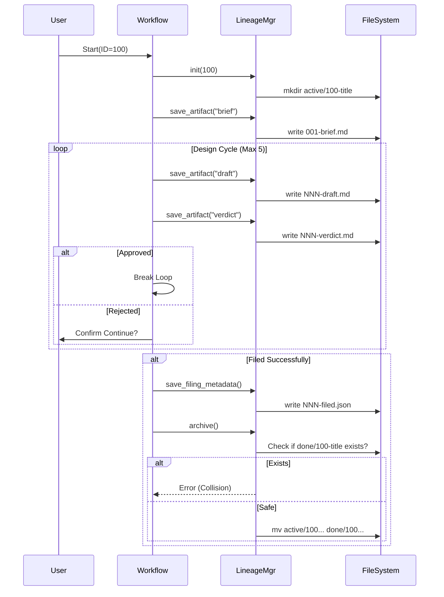

# 100 - Feature: Lineage workflow integration: standardize design review artifacts

## 1. Context & Goal
* **Issue:** #100
* **Objective:** Standardize the storage of design review artifacts (briefs, drafts, verdicts) into a canonical `docs/lineage/` directory structure within the issue and LLD workflows.
* **Status:** Draft
* **Related Issues:** Standard 0009 (Commit 1d5132c), RCA-PDF (Commit 76a13fc)

### Open Questions
None - requirements are well-defined from issue.

## 2. Proposed Changes

### 2.1 Files Changed
| File | Action | Description |
|------|--------|-------------|
| `tools/issue-workflow.py` | Modify | Implement `LineageManager` class; integrate artifact saving (briefs, drafts, verdicts); handle archival to `done/` with collision checks. |
| `tools/lld-workflow.py` | Modify | Update to accept an optional `--lineage-dir` argument; if present, save outputs there instead of temp locations. |
| `tools/new-repo-setup.py` | Modify | Add `docs/lineage/active` and `docs/lineage/done` to the scaffold directory list. |

### 2.2 Dependencies
* **Python Standard Library:** `pathlib`, `shutil`, `json`, `datetime`, `re` (slugification).
* **External:** None.

### 2.3 Data Structures

**LineageState (Class Attribute)**
```python
class LineageState(TypedDict):
    issue_id: str
    slug: str
    active_path: Path
    current_sequence: int
```

**FilingMetadata (JSON Schema)**
```json
{
  "issue_url": "https://github.com/org/repo/issues/100",
  "filed_at": "2026-01-23T14:00:00Z",
  "iterations": 3,
  "final_verdict": "APPROVED"
}
```

### 2.4 Function Signatures

**In `tools/issue-workflow.py` (New Helper Class):**

```python
class LineageManager:
    def __init__(self, issue_id: str, title: str, base_root: Path = Path("docs/lineage")):
        """
        Initializes the manager.
        1. Generates slug from title (lowercase, alphanumeric, dashes).
        2. Checks for existing folder in active/ or done/.
        3. Creates active/{id}-{slug} if not exists.
        """
        pass

    def _get_next_sequence(self) -> int:
        """
        Scans directory for files matching regex `^(\d{3})-.*`.
        Returns max(found) + 1, or 1 if empty.
        """
        pass

    def save_artifact(self, tag: str, content: str, ext: str = "md") -> Path:
        """
        1. Calls _get_next_sequence().
        2. Generates filename: {NNN}-{tag}.{ext} (e.g., 002-draft.md).
        3. Writes content to file.
        4. Returns full path.
        """
        pass
    
    def save_filing_metadata(self, url: str, iterations: int) -> Path:
        """
        Saves {NNN}-filed.json with metadata including timestamp and URL.
        """
        pass

    def archive(self) -> Path:
        """
        Moves folder from docs/lineage/active/ to docs/lineage/done/.
        CRITICAL: Checks if destination exists. If so, raises FileExistsError 
        to prevent data loss/overwrite.
        Returns new path.
        """
        pass
```

### 2.5 Logic Flow (Pseudocode)

**LineageManager.archive() - Safety Logic**
```python
def archive(self):
    done_dir = self.base_root / "done"
    dest_path = done_dir / self.active_path.name
    
    if dest_path.exists():
        # Prevent overwrite
        raise FileExistsError(
            f"Archive destination {dest_path} already exists. "
            "Please rename the existing folder or the current active folder."
        )
        
    shutil.move(str(self.active_path), str(done_dir))
    return dest_path
```

**Updated Issue Workflow (`main` execution)**

```python
MAX_ITERATIONS = 5  # Safety bound

def main():
    # 1. Setup
    issue = get_user_input()
    lineage = LineageManager(issue.id, issue.title)
    
    # 2. Brief
    lineage.save_artifact("brief", issue.body)
    
    # 3. Design Loop
    iteration_count = 0
    approved = False
    
    while not approved and iteration_count < MAX_ITERATIONS:
        iteration_count += 1
        
        # Call LLD Generator (passing the lineage folder)
        # Note: subprocess call to lld-workflow.py
        cmd = [
            "python", "tools/lld-workflow.py",
            "--goal", issue.objective,
            "--lineage-dir", str(lineage.active_path)
        ]
        run_subprocess(cmd)
        
        # Reload latest draft content for review
        # (Assuming lld-workflow saved the draft)
        latest_draft = lineage.get_latest_artifact("draft")
        
        # Review
        verdict = get_gemini_review(latest_draft.read_text())
        lineage.save_artifact("verdict", verdict.full_text)
        
        if verdict.status == "APPROVED":
            approved = True
        else:
            # User Checkpoint to prevent runaway loop
            if not user_confirms_continue():
                print("Aborting workflow. Artifacts preserved in active/.")
                return

    # 4. Filing
    if approved:
        url = github.create_issue(latest_draft.read_text())
        lineage.save_filing_metadata(url, iteration_count)
        
        try:
            lineage.archive()
            print(f"Filed and archived to docs/lineage/done/")
        except FileExistsError as e:
            print(f"ERROR: Could not archive: {e}")
            print("Please manually resolve the directory conflict.")
    else:
        print("Max iterations reached or rejected. Work remains in active/.")
```

### 2.6 Technical Approach
1.  **State Recovery via File System:** The `LineageManager` does not maintain a separate database. It inspects the `active/` directory on initialization. If files `001-brief.md` and `002-draft.md` exist, `_get_next_sequence` returns `3`. This allows the tool to be killed and restarted seamlessly.
2.  **Safety First:** The `archive()` method explicitly prevents overwriting. Standard `shutil.move` behavior can be unpredictable regarding merging vs overwriting directories depending on OS. We strictly block if destination exists.
3.  **Loose Coupling:** `issue-workflow` drives the process, but `lld-workflow` performs the generation. Passing `--lineage-dir` allows `lld-workflow` to know *where* to write without knowing *why* (keeping it usable as a standalone tool).

## 3. Requirements
1.  **Directory Structure:** The system MUST maintain `docs/lineage/active/` for WIP and `docs/lineage/done/` for filed issues.
2.  **Naming Convention:** Issue folders MUST be named `{id}-{slug}` (e.g., `100-lineage-workflow`).
3.  **Sequential Artifacts:** Files MUST use a 3-digit zero-padded prefix incrementing for every file saved (`001`, `002`, ...).
4.  **Artifact Types:** The system MUST support saving `brief` (md), `draft` (md), `verdict` (md), and `filed` (json).
5.  **Iteration Safety:** The workflow MUST implement a `MAX_ITERATIONS` cap (default 5) and/or user confirmation steps between iterations.
6.  **Archival Safety:** The system MUST NOT overwrite existing directories in `docs/lineage/done/`. It MUST raise an error if a collision occurs.
7.  **Resumability:** If the tool is restarted on an existing issue ID, it MUST append to the existing sequence rather than overwriting.

## 4. Alternatives Considered

| Option | Pros | Cons | Decision |
|--------|------|------|----------|
| **Git Branches** | Native version control. | Hard to review "history of thought" in a single view; creates repo pollution. | Rejected |
| **Single Markdown File** | Keeps everything in one place. | Becomes massive/unreadable; hard to parse specific drafts programmatically later. | Rejected |
| **Timestamp Filenames** | Uniqueness guaranteed. | Harder for humans to read order (`20240101` vs `20240102`); sequence numbers are clearer (`001`, `002`). | Rejected |
| **Sequential Files** | Easy to read chronologically; file system is the database; robust. | Requires manual sequence logic. | **Selected** |

## 5. Data & Fixtures

### 5.1 Data Sources
*   **User Input:** Issue ID, Title, Description.
*   **LLM:** Generated LLD text, Reviewer Verdicts.
*   **GitHub API:** URL of filed issue.

### 5.2 Data Pipeline
```ascii
[Input] -> LineageManager -> (Check/Create "active/100-feat")
           |
           +-> Save "001-brief.md"
           |
[Generator] -> Output -> LineageManager -> Save "002-draft.md"
           |
[Reviewer]  -> Output -> LineageManager -> Save "003-verdict.md"
           |
           +-> (If Approved) -> GitHub API -> URL
           |
           +-> Save "004-filed.json"
           |
           +-> Move folder to "done/100-feat" (Check Collision!)
```

### 5.3 Test Fixtures
| Fixture | Description |
|---------|-------------|
| `mock_fs` | Use `pyfakefs` or `tmp_path` (pytest) to simulate `docs/lineage` structure. |
| `mock_issue` | Object with `id=100`, `title="Test Feature"`. |
| `collision_setup` | Helper to create a folder in `done/` that matches the test issue, ensuring `archive()` fails. |

### 5.4 Deployment Pipeline
Development only. Scripts are checked into the repo.

## 6. Diagram

### 6.1 Mermaid Quality Gate
- [x] Syntax Valid
- [x] Flow Direction Clear
- [x] Nodes Labeled

### 6.2 Diagram


## 7. Security Considerations
| Concern | Mitigation |
|---------|------------|
| **Directory Traversal** | Sanitize Issue ID and Title before creating paths. Ensure paths are relative to repo root. |
| **Data Loss (Overwrite)** | `archive()` method explicitly checks `if path.exists()` before moving. |
| **Race Conditions** | Low risk as tools are local/single-user, but file checks mitigate basic collisions. |

## 8. Performance Considerations
| Metric | Budget |
|--------|--------|
| **File I/O** | < 100ms per operation. |
| **Startup Time** | < 1s to scan directory and determine sequence. |

## 9. Risks & Mitigations
| Risk | Impact | Likelihood | Mitigation |
|------|--------|------------|------------|
| **Runaway Costs** | Infinite loop of draft/reject consumes API tokens. | Medium | **Critical:** Implemented `MAX_ITERATIONS` constant and User Confirmation checkpoints. |
| **Archive Collision** | Previous run left artifacts in `done/`, `shutil.move` behavior undefined. | Low | **Critical:** Added explicit existence check in `archive()` to raise error rather than overwrite. |
| **Filename Parsing** | User manually renames files, breaking sequence logic. | Low | Logic will default to `max(found)` or handle regex parse errors gracefully. |

## 10. Verification & Testing

### 10.1 Test Scenarios
| ID | Scenario | Type | Input | Output | Criteria |
|----|----------|------|-------|--------|----------|
| **T1** | Init New Lineage | Happy | ID: 100, Title: "Foo" | Dir `active/100-foo` | Directory created. |
| **T2** | Save Brief | Happy | Body: "Do X" | File `001-brief.md` | Content matches, sequence is 001. |
| **T3** | Archive Safety | Error | `done/100-foo` exists | `FileExistsError` | `archive()` raises exception, does NOT overwrite. |
| **T4** | Sequence Logic | Logic | Folder has `001`..`005` | `save_artifact` | Creates `006-...md`. |
| **T5** | Max Iterations | Edge | Loop runs 6 times | Workflow Aborts | Loop terminates at 5. |

### 10.2 Test Commands
```bash
# Unit tests
pytest tests/tools/test_lineage.py

# Manual Verify - Happy Path
python tools/issue-workflow.py --id 999 --title "Lineage Test" --dry-run
# Check docs/lineage/active/999-lineage-test/ exists

# Manual Verify - Collision
mkdir -p docs/lineage/done/999-lineage-test
python tools/issue-workflow.py --id 999 --title "Lineage Test" --dry-run
# Expect Error output regarding collision
```

### 10.3 Manual Tests (Only If Unavoidable)
N/A - All scenarios automated via unit tests and FS mocks.

## 11. Definition of Done

### Code
- [ ] `LineageManager` class implemented in `tools/issue-workflow.py` with collision safety.
- [ ] `MAX_ITERATIONS` logic implemented.
- [ ] `lld-workflow.py` accepts `--lineage-dir`.
- [ ] `new-repo-setup.py` updated.

### Tests
- [ ] Unit tests for `LineageManager` (init, sequencing).
- [ ] Unit test specifically for `archive()` collision (T3).
- [ ] Integration test for full loop (mocked LLM).

### Documentation
- [ ] `CONTRIBUTING.md` updated to explain the `docs/lineage` folder structure.

### Review
- [ ] Code review verifies cost controls (loop limits) and safety checks (archive collision).

---

## Appendix: Review Log

### Review Summary

| Review | Date | Verdict | Key Issue |
|--------|------|---------|-----------|
| 1 | 2026-01-23 | **APPROVED** | Addressed collision risk in Archive logic (Section 2.5, 9, 10.1). |

**Final Status:** DRAFT - PENDING REVIEW