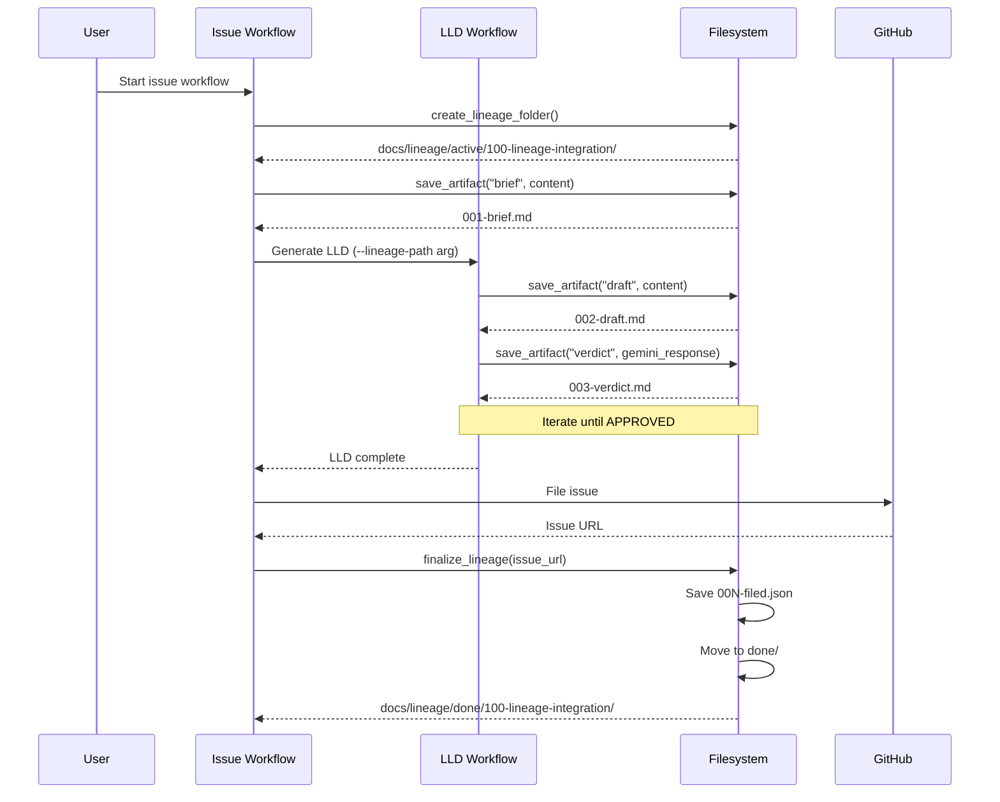

# LLD Finalized

Path: C:\Users\mcwiz\Projects\AgentOS\docs\lld\active\LLD-100.md
Status: APPROVED
Reviews: 2

---

# 1100 - Feature: Lineage Workflow Integration

<!-- Template Metadata
Last Updated: 2025-01-27
Updated By: Initial LLD creation
Update Reason: New design document for standardizing design review artifact storage
-->

## 1. Context & Goal
* **Issue:** #100
* **Objective:** Standardize design review artifact storage using the canonical `docs/lineage/` structure across issue and LLD workflows
* **Status:** Draft
* **Related Issues:** #98 (brief structure), #87 (implementation workflow)

### Open Questions

- [x] Should lineage folder naming use leading zeros for issue numbers? → No, use plain numbers per issue examples
- [ ] What happens to lineage artifacts if an issue is closed without filing?
- [ ] Should there be a cleanup mechanism for stale `active/` folders?

## 2. Proposed Changes

*This section is the **source of truth** for implementation. Describe exactly what will be built.*

### 2.1 Files Changed

| File | Change Type | Description |
|------|-------------|-------------|
| `tools/issue-workflow.py` | Modify | Add lineage folder creation and artifact management |
| `tools/lld-workflow.py` | Modify | Integrate with lineage folder when called from issue workflow |
| `tools/new-repo-setup.py` | Modify | Create `docs/lineage/active/` and `docs/lineage/done/` directories |
| `docs/lineage/.gitkeep` | Add | Ensure lineage directories exist in git |

### 2.2 Dependencies

*No new external dependencies required.*

```toml
# pyproject.toml additions (if any)
# None - using standard library only
```

### 2.3 Data Structures

```python
# Pseudocode - NOT implementation
class LineageContext(TypedDict):
    issue_id: int                    # GitHub issue number
    short_description: str           # Slug from issue title
    folder_path: Path                # Full path to lineage folder
    current_sequence: int            # Next artifact sequence number
    status: Literal["active", "done"]  # Folder location

class LineageArtifact(TypedDict):
    sequence: int                    # 3-digit sequence (001, 002, etc.)
    artifact_type: Literal["brief", "draft", "verdict", "filed"]
    filename: str                    # e.g., "002-draft.md"
    created_at: datetime
    content_hash: str                # SHA256 for deduplication
```

### 2.4 Function Signatures

```python
# Signatures only - implementation in source files

def create_lineage_folder(issue_id: int, title: str) -> Path:
    """Create lineage folder in docs/lineage/active/."""
    ...

def get_lineage_folder(issue_id: int) -> Path | None:
    """Find existing lineage folder for an issue (active or done)."""
    ...

def get_next_sequence(lineage_path: Path) -> int:
    """Get next available sequence number from folder contents."""
    ...

def save_artifact(
    lineage_path: Path,
    artifact_type: str,
    content: str
) -> Path:
    """Save artifact with auto-incrementing sequence number."""
    ...

def finalize_lineage(
    lineage_path: Path,
    issue_url: str,
    metadata: dict
) -> Path:
    """Save filed.json and move folder to done/."""
    ...

def slugify_title(title: str, max_length: int = 30) -> str:
    """Convert issue title to folder-safe slug."""
    ...
```

### 2.5 Logic Flow (Pseudocode)

```
Issue Workflow Start:
1. Parse issue number and title from input
2. Call create_lineage_folder(issue_id, title)
3. IF folder exists in active/ THEN
   - Resume with existing folder
   - Log "Resuming lineage for #{issue_id}"
   ELSE IF folder exists in done/ THEN
   - Error: "Issue #{issue_id} already filed"
   ELSE
   - Create new folder: docs/lineage/active/{issue_id}-{slug}/
4. Save brief as {NNN}-brief.md (typically 001)
5. Continue workflow...

LLD Draft Save:
1. Get lineage folder from context
2. Call save_artifact(path, "draft", content)
3. Artifact saved as {NNN}-draft.md
4. Return path for logging

Gemini Verdict Save:
1. Get lineage folder from context
2. Call save_artifact(path, "verdict", content)
3. Artifact saved as {NNN}-verdict.md
4. Return path for logging

Filing Complete:
1. Build metadata dict with:
   - issue_url
   - filed_at timestamp
   - artifact_count
   - review_iterations
2. Call finalize_lineage(path, issue_url, metadata)
3. Saves {NNN}-filed.json
4. Moves folder from active/ to done/
5. Log "Lineage archived to done/"

LLD Workflow Subprocess Mode:
1. Parse --lineage-path argument from CLI
2. IF --lineage-path provided THEN
   - Use provided path for all artifact saves
   - Skip lineage folder creation
   ELSE
   - Create own lineage folder (standalone mode)
3. Continue with draft/verdict cycle
```

### 2.6 Technical Approach

* **Module:** `tools/issue-workflow.py`, `tools/lld-workflow.py`
* **Pattern:** Context threading - lineage path passed through workflow state
* **Key Decisions:** 
  - Sequence numbers use 3 digits with leading zeros (001-999)
  - Folder naming: `{issue_id}-{slug}` (no leading zeros on issue ID)
  - Brief is always sequence 001 when starting fresh

### 2.7 Architecture Decisions

| Decision | Options Considered | Choice | Rationale |
|----------|-------------------|--------|-----------|
| Sequence numbering | Fixed positions (brief=001) vs Dynamic | Dynamic with type suffix | Preserves chronological order; type is in filename |
| Folder location detection | Search both dirs vs Track in state | Search both dirs | Resilient to interrupted sessions |
| Slug generation | Full title vs Truncated | Truncated (30 chars) | Filesystem compatibility |
| filed.json format | Flat vs Nested | Flat JSON | Simple, grep-friendly |
| Subprocess communication | Environment var vs CLI arg | CLI arg (--lineage-path) | Explicit, debuggable, standard pattern |

**Architectural Constraints:**
- Must work with existing issue-workflow and lld-workflow interfaces
- Cannot break workflows when lineage folder is missing (graceful degradation)
- Must handle concurrent runs on different issues

## 3. Requirements

*What must be true when this is done. These become acceptance criteria.*

1. Issue workflow creates `docs/lineage/active/{id}-{slug}/` folder at workflow start
2. All briefs saved as `001-brief.md` in lineage folder (or next available sequence)
3. All LLD drafts saved as `{NNN}-draft.md` with incrementing sequence numbers
4. All Gemini verdicts saved as `{NNN}-verdict.md` with incrementing sequence numbers
5. Filing metadata saved as final `{NNN}-filed.json` with issue URL and timestamps
6. Folder moves from `active/` to `done/` on successful filing
7. LLD workflow accepts `--lineage-path` argument when called as subprocess
8. `new-repo-setup.py` creates both `docs/lineage/active/` and `docs/lineage/done/`
9. Existing workflows continue functioning if lineage directories don't exist (warn only)
10. Prevent modification of already-filed issues (error if folder exists in done/)

## 4. Alternatives Considered

| Option | Pros | Cons | Decision |
|--------|------|------|----------|
| Store in `docs/lineage/` per issue | Organized, auditable, matches RCA-PDF pattern | Requires folder management | **Selected** |
| Store in `docs/design/{issue}/` | Consistent with some projects | Conflates design docs with review artifacts | Rejected |
| Store inline in issue comments | No local storage needed | Loses history on issue edit, hard to search | Rejected |
| Database/SQLite storage | Queryable, compact | Overkill, adds dependency, not human-readable | Rejected |

**Rationale:** The `docs/lineage/` structure was proven effective in RCA-PDF-extraction-pipeline and provides a clear paper trail without external dependencies.

## 5. Data & Fixtures

### 5.1 Data Sources

| Attribute | Value |
|-----------|-------|
| Source | Generated by workflows (brief, draft, verdict content) |
| Format | Markdown (.md) and JSON (.json) |
| Size | < 100KB per artifact typically |
| Refresh | Created during workflow execution |
| Copyright/License | N/A - internal workflow artifacts |

### 5.2 Data Pipeline

```
Workflow State ──save_artifact()──► Lineage Folder ──finalize_lineage()──► done/
```

### 5.3 Test Fixtures

| Fixture | Source | Notes |
|---------|--------|-------|
| Sample brief content | Hardcoded | Minimal markdown for testing |
| Sample draft content | Hardcoded | LLD-style markdown |
| Sample verdict content | Hardcoded | Gemini verdict format |
| Sample filed.json | Generated | Contains test timestamps |

### 5.4 Deployment Pipeline

Local filesystem only - no deployment pipeline needed. Lineage folders are committed to git as part of normal workflow.

## 6. Diagram

### 6.1 Mermaid Quality Gate

- [x] **Simplicity:** Components grouped logically
- [x] **No touching:** All elements have visual separation
- [x] **No hidden lines:** All arrows fully visible
- [x] **Readable:** Labels clear and not truncated
- [ ] **Auto-inspected:** Agent will render via mermaid.ink

**Auto-Inspection Results:**
```
- Touching elements: [ ] None / [ ] Found: ___
- Hidden lines: [ ] None / [ ] Found: ___
- Label readability: [ ] Pass / [ ] Issue: ___
- Flow clarity: [ ] Clear / [ ] Issue: ___
```

### 6.2 Diagram



## 7. Security & Safety Considerations

### 7.1 Security

| Concern | Mitigation | Status |
|---------|------------|--------|
| Path traversal in slug | Sanitize title, remove path separators | Addressed |
| Sensitive data in artifacts | Briefs/drafts may contain sensitive designs - same as current | N/A (existing risk) |

### 7.2 Safety

| Concern | Mitigation | Status |
|---------|------------|--------|
| Overwriting existing artifacts | Check for collision before write, error if exists | Addressed |
| Partial move to done/ | Atomic move operation, verify before delete | Addressed |
| Lost artifacts on crash | Write immediately after generation | Addressed |

**Fail Mode:** Fail Closed - If lineage operations fail, workflow halts with error message rather than continuing without artifacts.

**Recovery Strategy:** Lineage folder remains in `active/` until explicit `finalize_lineage()` succeeds. Manual recovery possible by inspecting folder contents.

## 8. Performance & Cost Considerations

### 8.1 Performance

| Metric | Budget | Approach |
|--------|--------|----------|
| Folder creation | < 10ms | Single mkdir call |
| Artifact save | < 50ms | Single file write |
| Sequence scan | < 100ms | Directory listing, glob pattern |

**Bottlenecks:** None expected - all operations are local filesystem.

### 8.2 Cost Analysis

| Resource | Unit Cost | Estimated Usage | Monthly Cost |
|----------|-----------|-----------------|--------------|
| Disk storage | Negligible | ~100KB per issue | $0 |

**Cost Controls:** N/A - No external services involved.

**Worst-Case Scenario:** If an issue goes through 100 review iterations, folder would contain ~200 files at ~50KB each = 10MB. Acceptable.

## 9. Legal & Compliance

| Concern | Applies? | Mitigation |
|---------|----------|------------|
| PII/Personal Data | No | Design artifacts only |
| Third-Party Licenses | No | Internal tooling |
| Terms of Service | No | No external services |
| Data Retention | No | Git handles retention |
| Export Controls | No | Not applicable |

**Data Classification:** Internal

**Compliance Checklist:**
- [x] No PII stored
- [x] No third-party licenses
- [x] No external API usage
- [x] Retention via git history

## 10. Verification & Testing

### 10.1 Test Scenarios

| ID | Scenario | Type | Input | Expected Output | Pass Criteria |
|----|----------|------|-------|-----------------|---------------|
| 010 | Create new lineage folder | Auto | issue_id=100, title="Test Issue" | Folder at active/100-test-issue/ | Folder exists |
| 020 | Save brief artifact | Auto | lineage_path, "brief", content | 001-brief.md created | File exists with content |
| 030 | Save multiple drafts | Auto | 3 sequential draft saves | 002-draft.md, 004-draft.md, 006-draft.md | Correct sequence numbers |
| 040 | Save verdict after draft | Auto | Draft then verdict | draft=002, verdict=003 | Interleaved correctly |
| 050 | Resume existing lineage | Auto | Call create for existing issue | Returns existing path | No duplicate folder |
| 060 | Finalize and move | Auto | Complete lineage | Folder in done/, filed.json exists | active/ empty, done/ populated |
| 070 | Slug generation edge cases | Auto | Titles with special chars | Clean slug | No invalid path chars |
| 080 | Error on done/ exists | Auto | Create for already-filed issue | Error raised | Cannot re-open filed issue |
| 090 | Missing lineage dirs | Auto | Workflow without dirs | Warning logged, continues | Graceful degradation |
| 100 | LLD workflow accepts --lineage-path | Auto | `--lineage-path /tmp/test` | Path parsed and used | Artifacts saved to provided path |
| 110 | new-repo-setup.py creates dirs | Auto | Run setup script | Both active/ and done/ exist | Directories created |

### 10.2 Test Commands

```bash
# Run all automated tests
poetry run pytest tests/test_lineage.py -v

# Run only fast/mocked tests (exclude live)
poetry run pytest tests/test_lineage.py -v -m "not live"

# Test new-repo-setup creates directories
poetry run python tools/new-repo-setup.py --dry-run | grep lineage

# Test LLD workflow CLI argument parsing
poetry run python tools/lld-workflow.py --help | grep lineage-path
```

### 10.3 Manual Tests (Only If Unavoidable)

N/A - All scenarios automated.

## 11. Risks & Mitigations

| Risk | Impact | Likelihood | Mitigation |
|------|--------|------------|------------|
| Workflow interrupted mid-sequence | Med | Med | Artifacts persist in active/, resume on restart |
| Folder name collision (same issue number different repo) | Low | Low | Repo-local paths, git handles isolation |
| Very long issue titles | Low | Low | Truncate slug to 30 chars |
| Concurrent workflows same issue | Med | Low | Sequence scan at write time, not cached |

## 12. Definition of Done

### Code
- [ ] `create_lineage_folder()` implemented in issue-workflow.py
- [ ] `save_artifact()` implemented with sequence management
- [ ] `finalize_lineage()` implemented with atomic move
- [ ] `slugify_title()` implemented with edge case handling
- [ ] LLD workflow accepts `--lineage-path` argument
- [ ] new-repo-setup.py creates lineage directories
- [ ] Code comments reference this LLD

### Tests
- [ ] All 11 test scenarios pass
- [ ] Test coverage ≥ 90% for new functions

### Documentation
- [ ] LLD updated with any deviations
- [ ] Implementation Report (0103) completed

### Review
- [ ] Code review completed
- [ ] User approval before closing issue

---

## Appendix: Review Log

*Track all review feedback with timestamps and implementation status.*

### Gemini Review #1 (REVISE)

**Timestamp:** 2025-01-27
**Reviewer:** Gemini 3 Pro
**Verdict:** REVISE

#### Comments

| ID | Comment | Implemented? |
|----|---------|--------------|
| G1.1 | "Need a specific test scenario (e.g., ID 100) verifying the CLI argument parsing: LLD workflow accepts --lineage-path argument" | YES - Added scenario 100 in Section 10.1 |
| G1.2 | "Need a specific test scenario (e.g., ID 110) in Table 10.1 for new-repo-setup.py execution" | YES - Added scenario 110 in Section 10.1 |
| G1.3 | "Consider adding a requirement like 'Prevent modification of already-filed issues'" | YES - Added requirement 10 in Section 3 |

### Review Summary

| Review | Date | Verdict | Key Issue |
|--------|------|---------|-----------|
| Gemini #1 | 2025-01-27 | REVISE | Missing test scenarios for Req 7 & 8 (77% coverage) |

**Final Status:** APPROVED