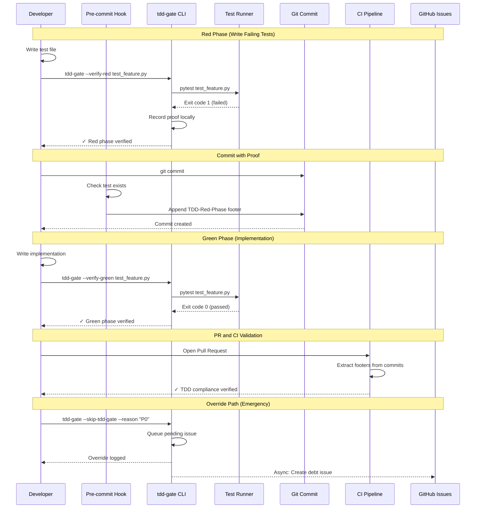
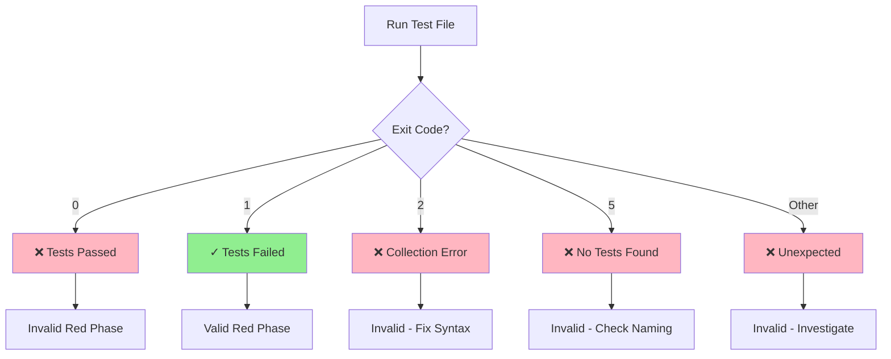

# 102 - Feature: TDD Test Initialization Gate

<!-- Template Metadata
Last Updated: 2025-01-15
Updated By: Initial LLD Creation
Update Reason: New feature implementation for TDD enforcement
-->

## 1. Context & Goal
* **Issue:** #102
* **Objective:** Enforce TDD discipline by gating implementation work behind verified failing tests, ensuring the red-green-refactor cycle is followed for every feature.
* **Status:** Draft
* **Related Issues:** #62 (Governance Workflow StateGraph)

### Open Questions
*Questions that need clarification before or during implementation. Remove when resolved.*

- [ ] Does the team use "Squash and Merge" for Pull Requests? (Current design supports it, but please confirm)
- [ ] Does the team prefer strict blocking (CI failure) or soft blocking (warning/audit log) for the MVP?
- [ ] Should the "Hotfix Override" require manager approval (via CODEOWNERS), or is developer self-attestation sufficient?

## 2. Proposed Changes

*This section is the **source of truth** for implementation. Describe exactly what will be built.*

### 2.1 Files Changed

| File | Change Type | Description |
|------|-------------|-------------|
| `tools/tdd-gate.py` | Add | Main TDD enforcement CLI tool |
| `tools/tdd-audit.py` | Add | Audit trail generation and reporting |
| `tools/tdd-pending-issues.py` | Add | Async pending issue creation processor |
| `hooks/pre-commit-tdd-gate.sh` | Add | Pre-commit hook for test existence check |
| `hooks/prepare-commit-msg-tdd.sh` | Add | Prepare-commit-msg hook for TDD footer injection |
| `.husky/pre-commit` | Add | Husky pre-commit hook configuration |
| `.husky/prepare-commit-msg` | Add | Husky prepare-commit-msg hook configuration |
| `.tdd-config.json` | Add | Project-specific TDD configuration |
| `.gitignore` | Modify | Add `.tdd-state.json` to ignored files |
| `package.json` | Modify | Add `prepare` script for husky installation |
| `docs/standards/0065-tdd-enforcement.md` | Add | Standard documenting TDD gate rules |
| `CLAUDE.md` | Modify | Add TDD workflow section |

### 2.2 Dependencies

*New packages, APIs, and services required.*

```json
// package.json additions
{
  "devDependencies": {
    "husky": "^9.0.0"
  }
}
```

**External Dependencies:**
- GitHub CLI (`gh`) - Required for issue auto-creation feature
- `pytest` - For Python test execution (assumed installed)
- `jest` - For JavaScript test execution (if applicable)

### 2.3 Data Structures

```python
# Pseudocode - NOT implementation

class TDDConfig(TypedDict):
    """Configuration loaded from .tdd-config.json"""
    test_patterns: dict[str, list[str]]  # Framework -> file patterns
    excluded_extensions: list[str]  # File types exempt from TDD gate
    min_test_count: int  # Minimum tests required (default: 1)
    test_commands: dict[str, str]  # Framework -> test command template

class TDDState(TypedDict):
    """Local state stored in .tdd-state.json (git-ignored)"""
    red_phase_proofs: dict[str, RedPhaseProof]  # test_file -> proof
    current_issue: str | None  # Active issue being worked on

class RedPhaseProof(TypedDict):
    """Proof that red phase was completed"""
    commit_sha: str  # Commit where red phase verified
    timestamp: str  # ISO 8601 timestamp
    test_file: str  # Path to test file
    exit_code: int  # Must be 1 for valid red phase
    failure_output: str  # Captured test failure output

class PendingIssue(TypedDict):
    """Pending technical debt issue for async creation"""
    reason: str  # Override justification
    timestamp: str  # When override was used
    commit_sha: str  # Commit that used override
    branch: str  # Branch name
    retry_count: int  # Number of creation attempts

class AuditEntry(TypedDict):
    """Entry in tdd-audit.md"""
    phase: Literal["red", "green", "refactor", "override"]
    timestamp: str
    test_file: str
    exit_code: int
    details: str  # Failure messages or pass confirmation
```

### 2.4 Function Signatures

```python
# tools/tdd-gate.py - Main CLI tool

def main() -> int:
    """Entry point for tdd-gate CLI. Returns exit code."""
    ...

def verify_red(test_file: Path) -> tuple[bool, str]:
    """
    Verify test file fails with exit code 1 (valid red phase).
    Returns (success, message).
    """
    ...

def verify_green(test_file: Path) -> tuple[bool, str]:
    """
    Verify test file passes with exit code 0 (valid green phase).
    Returns (success, message).
    """
    ...

def run_tests(test_file: Path, framework: str) -> tuple[int, str]:
    """
    Run tests for specific file only (not full suite).
    Returns (exit_code, output).
    """
    ...

def detect_framework(test_file: Path) -> str:
    """Detect test framework from file extension and patterns."""
    ...

def check_test_exists(impl_file: Path) -> tuple[bool, Path | None]:
    """
    Check if corresponding test file exists for implementation file.
    Returns (exists, test_file_path).
    """
    ...

def record_red_phase(test_file: Path, exit_code: int, output: str) -> RedPhaseProof:
    """Record red phase proof to local state and return proof."""
    ...

def generate_commit_footer(proof: RedPhaseProof) -> str:
    """Generate TDD-Red-Phase footer for commit message."""
    ...

def handle_override(reason: str) -> None:
    """Handle --skip-tdd-gate override with required justification."""
    ...

def load_config() -> TDDConfig:
    """Load configuration from .tdd-config.json with defaults."""
    ...

def is_excluded_file(file_path: Path, config: TDDConfig) -> bool:
    """Check if file is excluded from TDD gate (docs, config files)."""
    ...
```

```python
# tools/tdd-audit.py - Audit trail management

def append_audit_entry(issue_id: str, entry: AuditEntry) -> None:
    """Append entry to docs/reports/{issue_id}/tdd-audit.md (strictly additive)."""
    ...

def generate_compliance_report(issue_id: str) -> str:
    """Generate TDD compliance report for issue."""
    ...

def extract_red_phase_from_commits(branch: str) -> list[RedPhaseProof]:
    """Extract TDD-Red-Phase footers from all commits in branch."""
    ...
```

```python
# tools/tdd-pending-issues.py - Async issue creation

def queue_pending_issue(issue: PendingIssue) -> None:
    """Add issue to ~/.tdd-pending-issues.json queue."""
    ...

def process_pending_issues() -> tuple[int, int]:
    """
    Process pending issues queue, create via gh CLI.
    Returns (created_count, failed_count).
    """
    ...

def flush_all() -> None:
    """Force upload all pending issues (--flush command)."""
    ...

def create_github_issue(issue: PendingIssue) -> bool:
    """Create GitHub issue via gh CLI. Returns success."""
    ...
```

### 2.5 Logic Flow (Pseudocode)

**Pre-commit Hook Flow:**
```
1. Get list of staged files
2. FOR EACH staged file:
   a. IF is_excluded_file(file) THEN skip
   b. IF file is implementation code (not test):
      i. Check if corresponding test file exists
      ii. IF no test file: BLOCK commit with error message
3. IF all checks pass: Allow commit to proceed
```

**Red Phase Verification Flow:**
```
1. Receive test file path
2. Detect test framework from file pattern
3. Run ONLY the specified test file (not full suite)
4. Capture exit code and output
5. IF exit_code == 1:
   a. Record red phase proof
   b. Return success: "Red phase verified"
6. ELSE IF exit_code == 0:
   a. Return error: "Invalid red phase: tests passed (exit code 0)"
7. ELSE IF exit_code == 2:
   a. Return error: "Invalid red phase: collection error (exit code 2)"
8. ELSE IF exit_code == 5:
   a. Return error: "Invalid red phase: no tests found (exit code 5). Did you name your file test_*.py?"
9. ELSE:
   a. Return error: "Unexpected exit code: {exit_code}"
```

**Prepare-commit-msg Hook Flow:**
```
1. Check if this is a TDD-relevant commit
2. IF red phase proof exists in local state:
   a. Generate TDD-Red-Phase footer
   b. Append footer to commit message
   c. Clear proof from local state (it's now in commit)
3. Hook completes BEFORE GPG signing
```

**Override Flow:**
```
1. Validate --reason argument is provided and non-empty
2. Create PendingIssue with reason, timestamp, commit info
3. Queue pending issue to ~/.tdd-pending-issues.json
4. Log override to audit trail
5. Allow commit to proceed immediately (non-blocking)
6. Trigger async issue creation (best effort, non-blocking)
```

**CI Gate Flow:**
```
1. Get all commits in PR branch (origin/main..HEAD)
2. Extract TDD-Red-Phase footers from all commit messages
3. IF footer found in any commit:
   a. Validate footer format
   b. Accept PR for TDD compliance
4. ELSE IF coverage requirements met:
   a. Accept PR (handles squash scenarios where footer lost)
5. ELSE:
   a. Block PR: "No TDD red phase proof found"
```

### 2.6 Technical Approach

* **Module:** `tools/` directory for CLI tools, `hooks/` for git hooks
* **Pattern:** Command pattern for CLI subcommands, Observer pattern for hook integration
* **Key Decisions:**
  - File-scoped test execution prevents slow full-suite runs
  - Commit message footers for state portability (no committed state files)
  - Async issue creation prevents blocking during emergencies
  - Husky ensures hooks are installed for all developers automatically

### 2.7 Architecture Decisions

| Decision | Options Considered | Choice | Rationale |
|----------|-------------------|--------|-----------|
| State Storage | Committed JSON file, Database, Commit footers | Commit footers + local git-ignored JSON | Avoids merge conflicts, portable across branches, CI can extract |
| Hook Technology | Raw git hooks, Husky, pre-commit framework | Husky | Auto-installs via npm, team already uses npm ecosystem |
| Test Scoping | Full suite, File-scoped, Function-scoped | File-scoped | Balance between speed and meaningful verification |
| Override Tracking | Immediate issue creation, Async queue, Log only | Async queue with retry | Non-blocking for emergencies, eventual consistency |
| Exit Code Validation | Pass/fail binary, Granular codes | Granular exit codes | Better error messages, catch misconfigurations |

**Architectural Constraints:**
- Must work with existing pytest/jest test infrastructure
- Must not slow down normal commit workflow significantly
- Must handle offline/disconnected scenarios gracefully
- Must preserve audit trail across squash/rebase operations

## 3. Requirements

*What must be true when this is done. These become acceptance criteria.*

1. Pre-commit hook blocks commits without corresponding test files for implementation code
2. Pre-commit hook excludes documentation (`*.md`) and config files (`*.json`, `*.yaml`)
3. `tdd-gate --verify-red <test-file>` runs only the specified test file, not full suite
4. Red phase verification accepts only exit code `1` (tests failed)
5. Red phase verification rejects exit codes `0`, `2`, `5` with specific error messages
6. Red phase proof is stored in commit message footer: `TDD-Red-Phase: <sha>:<timestamp>`
7. Prepare-commit-msg hook runs before GPG signing
8. Green phase verification confirms exit code `0` (tests pass)
9. `--skip-tdd-gate --reason "<justification>"` allows override with mandatory reason
10. Override logs debt locally and creates GitHub issue asynchronously
11. Audit trail is strictly append-only at `docs/reports/{IssueID}/tdd-audit.md`
12. CI extracts red phase proof from any commit in PR branch
13. Works with pytest (`test_*.py`) and Jest (`*.test.js`, `*.spec.js`)
14. Configuration via `.tdd-config.json` for custom patterns and exclusions
15. Husky auto-installs hooks on `npm install`

## 4. Alternatives Considered

| Option | Pros | Cons | Decision |
|--------|------|------|----------|
| Committed `.tdd-state.json` | Simple, always available | Merge conflicts, noise in history | **Rejected** |
| Database for state | Scalable, queryable | Infrastructure overhead, offline issues | **Rejected** |
| Commit message footers | Portable, no conflicts, CI-friendly | Limited size, requires parsing | **Selected** |
| Full test suite on verify | Complete verification | Slow, discourages TDD | **Rejected** |
| File-scoped test execution | Fast, targeted | Might miss integration issues | **Selected** |
| pre-commit Python framework | Feature-rich | Another tool to install/maintain | **Rejected** |
| Husky for hooks | Auto-install, npm native | Requires npm/node | **Selected** |
| Synchronous issue creation | Immediate tracking | Blocks on API failures | **Rejected** |
| Async queue for issues | Non-blocking, retry capable | Eventual consistency | **Selected** |

**Rationale:** The selected options prioritize developer experience (fast feedback, non-blocking emergencies), portability (commit footers work across branches/squash), and ease of adoption (Husky auto-installs).

## 5. Data & Fixtures

### 5.1 Data Sources

| Attribute | Value |
|-----------|-------|
| Source | Local git repository, test execution output |
| Format | Exit codes, stdout/stderr text, JSON config |
| Size | Small (KB per proof/audit entry) |
| Refresh | Real-time during commit workflow |
| Copyright/License | N/A (generated data) |

### 5.2 Data Pipeline

```
Test Execution ──exit code──► Red Phase Proof ──footer──► Commit Message
                                    │
                                    └──append──► tdd-audit.md

Override Request ──queue──► ~/.tdd-pending-issues.json ──async──► GitHub Issues API
```

### 5.3 Test Fixtures

| Fixture | Source | Notes |
|---------|--------|-------|
| Failing test file (`test_example_red.py`) | Generated | Contains `assert False` |
| Passing test file (`test_example_green.py`) | Generated | Contains `assert True` |
| Empty test file (`test_empty.py`) | Generated | No test functions (exit code 5) |
| Syntax error test file (`test_broken.py`) | Generated | Invalid Python (exit code 2) |
| Mock `.tdd-config.json` | Hardcoded | Standard configuration |
| Mock commit with footer | Generated | For CI extraction tests |

### 5.4 Deployment Pipeline

**Local Development:**
1. `npm install` triggers Husky prepare script
2. Hooks installed to `.husky/` directory
3. Developer runs `tdd-gate` CLI manually or via hooks

**CI Environment:**
1. GitHub Actions workflow extracts footers from PR commits
2. CI validates red phase proof exists
3. Pending issues created from queue on successful run

## 6. Diagram

### 6.1 Mermaid Quality Gate

Before finalizing any diagram, verify in [Mermaid Live Editor](https://mermaid.live) or GitHub preview:

- [x] **Simplicity:** Similar components collapsed (per 0006 §8.1)
- [x] **No touching:** All elements have visual separation (per 0006 §8.2)
- [x] **No hidden lines:** All arrows fully visible (per 0006 §8.3)
- [x] **Readable:** Labels not truncated, flow direction clear
- [ ] **Auto-inspected:** Agent rendered via mermaid.ink and viewed (per 0006 §8.5)

**Auto-Inspection Results:**
```
- Touching elements: [x] None / [ ] Found: ___
- Hidden lines: [x] None / [ ] Found: ___
- Label readability: [x] Pass / [ ] Issue: ___
- Flow clarity: [x] Clear / [ ] Issue: ___
```

*Reference: [0006-mermaid-diagrams.md](0006-mermaid-diagrams.md)*

### 6.2 TDD Gate Workflow Diagram



### 6.3 Exit Code Decision Tree



## 7. Security & Safety Considerations

### 7.1 Security

| Concern | Mitigation | Status |
|---------|------------|--------|
| Command injection via `--reason` | Use subprocess list args, never `shell=True` | Addressed |
| GitHub token exposure | Use `gh` CLI which handles auth securely | Addressed |
| Malicious test code execution | Tests run in isolated subprocess | Addressed |
| Sensitive data in failure output | Audit logs exclude actual test data, only metadata | Addressed |
| Local state file tampering | `.tdd-state.json` is convenience only, footers are authoritative | Addressed |

### 7.2 Safety

| Concern | Mitigation | Status |
|---------|------------|--------|
| Blocking emergency hotfixes | Override flag with async issue tracking | Addressed |
| Accidental audit trail deletion | Append-only writes, no delete operations | Addressed |
| Hook failure blocking commits | Hooks fail open with warning, not hard block | Addressed |
| Runaway test execution | File-scoped execution with timeout | Addressed |
| Lost override issues (offline) | Local queue with retry on connectivity | Addressed |

**Fail Mode:** Fail Open - Hooks warn but don't block if they encounter errors (system availability over strict enforcement)

**Recovery Strategy:** 
- If local state corrupted: Regenerate from commit footers
- If pending issues lost: Manual audit of override commits
- If hooks fail: Manual `tdd-gate` CLI invocation

## 8. Performance & Cost Considerations

### 8.1 Performance

| Metric | Budget | Approach |
|--------|--------|----------|
| Red phase verification | < 5s per file | File-scoped execution, not full suite |
| Pre-commit hook | < 2s | Simple file existence check |
| Prepare-commit-msg hook | < 1s | Read/write local JSON only |
| CI footer extraction | < 10s | Single `git log` command |

**Bottlenecks:** 
- Large test files with slow setup fixtures (mitigated by file scope)
- GitHub API rate limits for issue creation (mitigated by async queue)

### 8.2 Cost Analysis

| Resource | Unit Cost | Estimated Usage | Monthly Cost |
|----------|-----------|-----------------|--------------|
| GitHub API calls | Free (within limits) | ~100 issues/month | $0 |
| CI compute (footer extraction) | Included in Actions | Minutes | $0 |
| Developer time (TDD overhead) | N/A | ~5 min/feature | N/A |

**Cost Controls:**
- [x] No external paid services required
- [x] Rate limiting on issue creation (1 per override)
- [x] File-scoped execution minimizes CI time

**Worst-Case Scenario:** 100 overrides in a day = 100 issue creation attempts, well within GitHub API limits (5000/hour authenticated).

## 9. Legal & Compliance

| Concern | Applies? | Mitigation |
|---------|----------|------------|
| PII/Personal Data | No | Test output is code-only, no user data |
| Third-Party Licenses | Yes | Husky is MIT licensed, compatible |
| Terms of Service | Yes | GitHub API usage within ToS limits |
| Data Retention | No | Audit logs are project documentation |
| Export Controls | No | No restricted algorithms |

**Data Classification:** Internal (development tooling, no sensitive data)

**Compliance Checklist:**
- [x] No PII stored without consent (N/A - no PII)
- [x] All third-party licenses compatible with project license
- [x] External API usage compliant with provider ToS
- [x] Data retention policy documented (audit logs are permanent project record)

## 10. Verification & Testing

*Ref: [0005-testing-strategy-and-protocols.md](0005-testing-strategy-and-protocols.md)*

**Testing Philosophy:** Strive for 100% automated test coverage. Yes, we're TDD-ing the TDD tool.

### 10.1 Test Scenarios

| ID | Scenario | Type | Input | Expected Output | Pass Criteria |
|----|----------|------|-------|-----------------|---------------|
| 010 | Red phase with failing test | Auto | `test_fails.py` with `assert False` | Exit 0, "Red phase verified" | Exit code 1 from pytest recorded |
| 020 | Red phase with passing test | Auto | `test_passes.py` with `assert True` | Exit 1, error message | "tests passed (exit code 0)" |
| 030 | Red phase with syntax error | Auto | `test_broken.py` with invalid syntax | Exit 1, error message | "collection error (exit code 2)" |
| 040 | Red phase with no tests | Auto | `test_empty.py` with no functions | Exit 1, error message | "no tests found (exit code 5)" |
| 050 | Green phase with passing test | Auto | `test_passes.py` | Exit 0, "Green phase verified" | Exit code 0 from pytest |
| 060 | Green phase with failing test | Auto | `test_fails.py` | Exit 1, error message | "tests still failing" |
| 070 | Pre-commit blocks missing test | Auto | Commit `feature.py` without `test_feature.py` | Commit blocked | Hook exits non-zero |
| 080 | Pre-commit allows with test | Auto | Commit `feature.py` with `test_feature.py` | Commit allowed | Hook exits zero |
| 090 | Pre-commit excludes markdown | Auto | Commit `README.md` only | Commit allowed | No test required |
| 100 | Pre-commit excludes config | Auto | Commit `.tdd-config.json` only | Commit allowed | No test required |
| 110 | Commit footer injection | Auto | Commit after red phase | Footer in message | `TDD-Red-Phase:` present |
| 120 | Override with reason | Auto | `--skip-tdd-gate --reason "P0"` | Override allowed | Pending issue queued |
| 130 | Override without reason | Auto | `--skip-tdd-gate` (no reason) | Override blocked | Error requiring reason |
| 140 | CI footer extraction | Auto | PR with footer in commit | PR passes | Footer found and validated |
| 150 | CI squash handling | Auto | Squashed PR, footer in history | PR passes | Coverage check fallback |
| 160 | Pending issue creation | Auto-Live | Queued issue + gh auth | Issue created | GitHub issue exists |
| 170 | Pending issue offline | Auto | Queued issue, no connectivity | Issue queued | Local file updated |
| 180 | Flush command | Auto-Live | `--flush` with pending issues | Issues created | Queue emptied |
| 190 | Audit trail append | Auto | Red phase completion | Entry added | tdd-audit.md updated |
| 200 | Jest file detection | Auto | `feature.test.js` | Jest framework | Correct runner invoked |
| 210 | Pytest file detection | Auto | `test_feature.py` | Pytest framework | Correct runner invoked |
| 220 | Input sanitization | Auto | `--reason "; rm -rf /"` | Safe handling | No shell execution |
| 230 | GPG signing compatibility | Auto | Signed commit with footer | Both present | Signature valid, footer intact |

### 10.2 Test Commands

```bash
# Run all automated tests
poetry run pytest tests/test_tdd_gate.py tests/test_tdd_audit.py tests/test_tdd_pending.py -v

# Run only fast/mocked tests (exclude live)
poetry run pytest tests/ -v -m "not live"

# Run live integration tests (requires gh auth)
poetry run pytest tests/ -v -m live

# Run specific scenario
poetry run pytest tests/test_tdd_gate.py::test_red_phase_failing_test -v
```

### 10.3 Manual Tests (Only If Unavoidable)

**N/A - All scenarios automated.**

All test scenarios including GPG signing, GitHub issue creation, and hook behavior can be verified through automated integration tests with appropriate mocking and live tests with real GitHub API.

## 11. Risks & Mitigations

| Risk | Impact | Likelihood | Mitigation |
|------|--------|------------|------------|
| Developers bypass hooks via `--no-verify` | Medium | Medium | CI gate catches missing footers, audit trail visible in PR |
| Test framework detection fails | Low | Low | Configurable patterns in `.tdd-config.json`, fallback prompts |
| GitHub API changes break issue creation | Low | Low | `gh` CLI handles API compatibility, queue retries |
| Husky installation fails on some systems | Medium | Low | Fallback manual hook installation documented |
| Large monorepo slows file checks | Medium | Medium | File-scoped execution, configurable exclusions |
| Squash merges lose footers | Medium | High | CI extracts from full branch history, coverage fallback |

## 12. Definition of Done

### Code
- [ ] `tools/tdd-gate.py` implementation complete and linted
- [ ] `tools/tdd-audit.py` implementation complete and linted
- [ ] `tools/tdd-pending-issues.py` implementation complete and linted
- [ ] `hooks/pre-commit-tdd-gate.sh` implemented
- [ ] `hooks/prepare-commit-msg-tdd.sh` implemented
- [ ] `.husky/pre-commit` configured
- [ ] `.husky/prepare-commit-msg` configured
- [ ] Code comments reference this LLD (Issue #102)

### Tests
- [ ] All 23 test scenarios pass
- [ ] Test coverage ≥ 90% for new code
- [ ] Live integration tests pass with real GitHub API

### Documentation
- [ ] `docs/standards/0065-tdd-enforcement.md` created
- [ ] `CLAUDE.md` updated with TDD workflow section
- [ ] README updated with TDD gate setup instructions
- [ ] Files added to `docs/0003-file-inventory.md`
- [ ] LLD updated with any implementation deviations

### Reports (Pre-Merge Gate)
- [ ] `docs/reports/102/implementation-report.md` created
- [ ] `docs/reports/102/test-report.md` created
- [ ] `docs/reports/102/tdd-audit.md` initialized (meta: TDD for TDD tool)

### Review
- [ ] Code review completed
- [ ] 0809 Security Audit - PASS
- [ ] 0817 Wiki Alignment Audit - PASS
- [ ] User approval before closing issue

---

## Appendix A: Configuration Reference

### `.tdd-config.json` Schema

```json
{
  "test_patterns": {
    "pytest": ["test_*.py", "*_test.py"],
    "jest": ["*.test.js", "*.spec.js", "*.test.ts", "*.spec.ts"]
  },
  "excluded_extensions": [".md", ".rst", ".txt", ".json", ".yaml", ".yml", ".toml", ".ini"],
  "min_test_count": 1,
  "test_commands": {
    "pytest": "pytest {file} -v",
    "jest": "jest {file} --passWithNoTests=false"
  },
  "source_patterns": {
    "python": ["*.py"],
    "javascript": ["*.js", "*.ts"]
  },
  "test_directory": "tests",
  "audit_directory": "docs/reports"
}
```

### Commit Footer Format

```
TDD-Red-Phase: <short-sha>:<ISO-8601-timestamp>

Example:
TDD-Red-Phase: abc1234:2025-01-15T10:30:00Z
```

### Pending Issue Queue Format (`~/.tdd-pending-issues.json`)

```json
{
  "pending": [
    {
      "reason": "P0 production outage",
      "timestamp": "2025-01-15T10:30:00Z",
      "commit_sha": "abc1234def5678",
      "branch": "hotfix/critical-bug",
      "retry_count": 0
    }
  ]
}
```

---

## Appendix B: Review Log

*Track all review feedback with timestamps and implementation status.*

### Review Summary

| Review | Date | Verdict | Key Issue |
|--------|------|---------|-----------|
| - | - | - | Pending initial review |

**Final Status:** PENDING