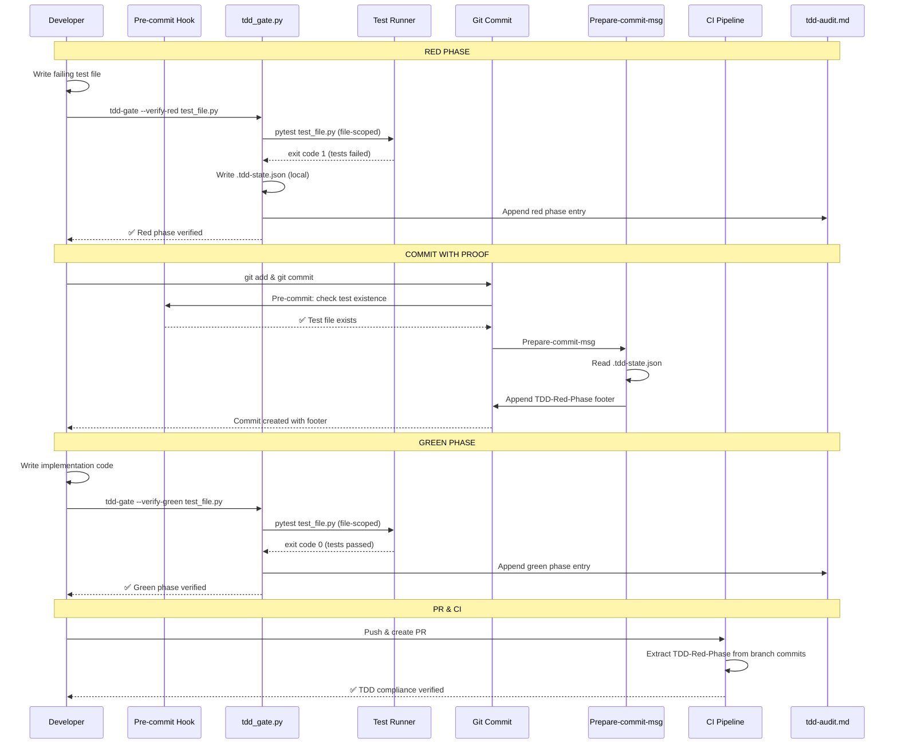
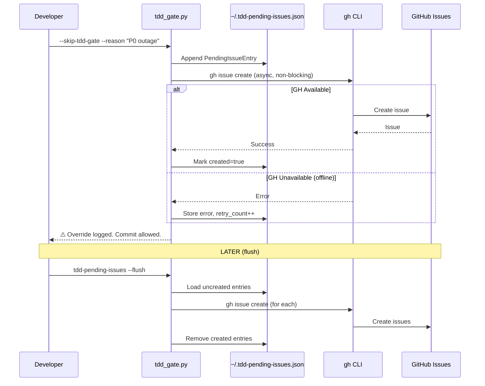

# 102 - Feature: TDD Test Initialization Gate

<!-- Template Metadata
Last Updated: 2026-02-10
Updated By: Issue #102 LLD creation
Update Reason: Initial Low-Level Design for TDD enforcement tooling
Previous: N/A
-->

## 1. Context & Goal
* **Issue:** #102
* **Objective:** Enforce TDD discipline by gating implementation work behind verified failing tests, ensuring the red-green-refactor cycle is followed for every feature.
* **Status:** Draft
* **Related Issues:** #62 (Governance Workflow StateGraph)

### Open Questions

- [ ] Does the team use "Squash and Merge" for Pull Requests? (Design supports it, but confirm preference)
- [ ] Strict blocking (CI failure) vs soft blocking (warning/audit log) for MVP?
- [ ] Should hotfix override require manager approval (CODEOWNERS) or is developer self-attestation sufficient?

## 2. Proposed Changes

*This section is the **source of truth** for implementation. Describes exactly what will be built.*

### 2.1 Files Changed

| File | Change Type | Description |
|------|-------------|-------------|
| `tools/` | Existing Directory | Parent for new TDD tools |
| `tools/tdd_gate.py` | Add | Main TDD enforcement CLI tool — red/green verification, override handling |
| `tools/tdd_audit.py` | Add | Audit trail generation and TDD compliance reporting |
| `tools/tdd_pending_issues.py` | Add | Async pending GitHub issue creation processor with `--flush` |
| `hooks/` | Add (Directory) | Shell hook scripts directory |
| `hooks/pre-commit-tdd-gate.sh` | Add | Pre-commit hook: test existence check, file exclusions |
| `hooks/prepare-commit-msg-tdd.sh` | Add | Prepare-commit-msg hook: append TDD-Red-Phase footer |
| `.tdd-config.json` | Add | Project-specific TDD configuration (patterns, exclusions, thresholds) |
| `.gitignore` | Modify | Add `.tdd-state.json` to ignored files |
| `.husky/pre-commit` | Add | Husky pre-commit hook configuration |
| `.husky/prepare-commit-msg` | Add | Husky prepare-commit-msg hook configuration |
| `dashboard/package.json` | Modify | Add `prepare` script for automatic husky installation |
| `docs/standards/0065-tdd-enforcement.md` | Add | Standard documenting TDD gate rules |
| `CLAUDE.md` | Modify | Add TDD workflow section |
| `docs/reports/102/` | Add (Directory) | Reports directory for this issue |
| `docs/reports/102/tdd-audit.md` | Add | TDD audit trail for this issue |
| `docs/reports/102/implementation-report.md` | Add | Implementation report |
| `docs/reports/102/test-report.md` | Add | Test report |
| `tests/unit/test_tdd_gate.py` | Add | Unit tests for tdd_gate.py |
| `tests/unit/test_tdd_audit.py` | Add | Unit tests for tdd_audit.py |
| `tests/unit/test_tdd_pending_issues.py` | Add | Unit tests for tdd_pending_issues.py |
| `tests/fixtures/tdd_gate/` | Add (Directory) | Test fixtures for TDD gate tests |
| `tests/fixtures/tdd_gate/sample_passing_test.py` | Add | Fixture: test that passes (exit code 0) |
| `tests/fixtures/tdd_gate/sample_failing_test.py` | Add | Fixture: test that fails (exit code 1) |
| `tests/fixtures/tdd_gate/sample_syntax_error_test.py` | Add | Fixture: test with collection error (exit code 2) |
| `tests/fixtures/tdd_gate/sample_empty_test.py` | Add | Fixture: empty file, no tests (exit code 5) |
| `tests/fixtures/tdd_gate/sample_tdd_config.json` | Add | Fixture: sample TDD configuration |
| `tests/e2e/test_tdd_workflow.py` | Add | End-to-end TDD workflow integration tests |

### 2.1.1 Path Validation (Mechanical - Auto-Checked)

Mechanical validation:
- `tools/` — exists ✅
- `.gitignore` — exists ✅
- `CLAUDE.md` — exists ✅
- `dashboard/package.json` — exists ✅
- `tests/unit/` — exists ✅
- `tests/fixtures/` — exists ✅
- `tests/e2e/` — exists ✅
- `docs/standards/` — exists ✅
- `docs/reports/` — parent exists, `102/` will be created ✅
- `hooks/` — new directory, Add (Directory) declared ✅
- `.husky/` — new directory at repo root, created by husky install ✅
- `tests/fixtures/tdd_gate/` — new directory, Add (Directory) declared ✅

### 2.2 Dependencies

```toml
# No new pyproject.toml dependencies required.
# tools/tdd_gate.py uses only Python stdlib: subprocess, json, pathlib, argparse, datetime, sys, os
# dashboard/package.json additions:
```

```json
{
  "devDependencies": {
    "husky": "^9.0.0"
  },
  "scripts": {
    "prepare": "husky"
  }
}
```

External runtime dependencies (not Python packages):
- **GitHub CLI (`gh`)** — required for async issue creation; must be installed and authenticated
- **pytest** — already a dev dependency
- **husky** — npm devDependency for git hook management

### 2.3 Data Structures

```python
# === .tdd-config.json schema (project configuration) ===
class TDDConfig(TypedDict):
    """Project-level TDD gate configuration."""
    test_framework: str  # "pytest" | "jest"
    test_command: str  # e.g. "poetry run pytest" or "npx jest"
    source_patterns: list[str]  # [".py", ".js", ".ts"]
    test_patterns: dict[str, str]  # {"*.py": "test_*.py", "*.js": "*.test.js"}
    test_directories: list[str]  # ["tests/"]
    excluded_extensions: list[str]  # [".md", ".rst", ".txt", ".json", ".yaml", ".yml", ".toml", ".ini"]
    excluded_paths: list[str]  # ["docs/", "data/", ".github/"]
    min_test_count: int  # default: 1
    override_requires_reason: bool  # default: True


# === .tdd-state.json schema (local, git-ignored) ===
class TDDLocalState(TypedDict):
    """Local developer state, NOT committed. Git-ignored."""
    current_issue: str | None  # e.g. "102"
    red_phase_completed: bool
    red_phase_timestamp: str | None  # ISO 8601
    red_phase_commit_sha: str | None
    test_file: str | None  # path to test file
    red_phase_exit_code: int | None
    red_phase_failure_output: str | None  # captured stderr/stdout (truncated to 2KB)


# === ~/.tdd-pending-issues.json schema (user-global pending debt) ===
class PendingIssueEntry(TypedDict):
    """Single pending technical debt issue for async creation."""
    timestamp: str  # ISO 8601
    repo: str  # e.g. "martymcenroe/AssemblyZero"
    branch: str  # branch name at time of override
    commit_sha: str  # commit that used override
    reason: str  # developer-provided justification
    files_changed: list[str]  # files in the commit
    created: bool  # whether gh issue was created
    issue_number: int | None  # set after creation
    error: str | None  # last error if creation failed
    retry_count: int  # number of creation attempts


# === Red Phase Proof (commit footer format) ===
# Format: TDD-Red-Phase: <commit-sha>:<ISO-8601-timestamp>
# Example: TDD-Red-Phase: abc1234:2026-02-10T14:30:00Z
# Stored in: git commit message footer (last line, after blank line separator)


# === TDD Audit Entry (appended to docs/reports/{IssueID}/tdd-audit.md) ===
class TDDAuditEntry(TypedDict):
    """Single audit trail entry."""
    phase: str  # "red" | "green" | "refactor" | "override"
    timestamp: str  # ISO 8601
    commit_sha: str
    test_file: str
    exit_code: int
    test_names: list[str]  # names of tests discovered
    output_summary: str  # truncated failure/pass output (max 2KB)
    override_reason: str | None  # only for "override" phase


# === Verify Red Result ===
class VerifyRedResult(TypedDict):
    """Return type for red phase verification."""
    valid: bool
    exit_code: int
    message: str  # human-readable explanation
    test_names: list[str]
    failure_output: str  # raw captured output (truncated)
    timestamp: str  # ISO 8601


# === Verify Green Result ===
class VerifyGreenResult(TypedDict):
    """Return type for green phase verification."""
    valid: bool
    exit_code: int
    message: str
    test_names: list[str]
    coverage_delta: float | None  # percentage points, if available
    timestamp: str
```

### 2.4 Function Signatures

```python
# ============================================================
# tools/tdd_gate.py — Main TDD enforcement CLI tool
# ============================================================

import argparse
import json
import subprocess
import sys
from datetime import datetime, timezone
from pathlib import Path
from typing import Any


def main(argv: list[str] | None = None) -> int:
    """CLI entry point. Parses args and dispatches to subcommands.

    Returns exit code: 0 = success, 1 = gate blocked, 2 = usage error.
    """
    ...


def load_config(config_path: Path | None = None) -> dict[str, Any]:
    """Load .tdd-config.json from project root. Returns defaults if not found.

    Args:
        config_path: Explicit path to config file. If None, searches cwd upward.

    Returns:
        Parsed configuration dictionary with defaults applied.

    Raises:
        json.JSONDecodeError: If config file contains invalid JSON.
    """
    ...


def resolve_test_file(source_file: Path, config: dict[str, Any]) -> Path | None:
    """Map a source file to its expected test file path.

    Args:
        source_file: Path to implementation source file (e.g., assemblyzero/core/foo.py).
        config: Loaded TDD configuration.

    Returns:
        Expected test file path, or None if source file is excluded from TDD gate.

    Examples:
        assemblyzero/core/foo.py -> tests/unit/test_foo.py
        src/utils/bar.js -> src/utils/__tests__/bar.test.js
    """
    ...


def is_excluded_file(file_path: Path, config: dict[str, Any]) -> bool:
    """Check if a file is excluded from TDD gate (docs, config, etc).

    Args:
        file_path: Path to check against exclusion rules.
        config: Loaded TDD configuration.

    Returns:
        True if file should be excluded from TDD requirements.
    """
    ...


def get_changed_source_files() -> list[Path]:
    """Get list of staged source files from git index.

    Returns:
        List of Path objects for files staged in git (via `git diff --cached --name-only`).
    """
    ...


def check_test_existence(source_files: list[Path], config: dict[str, Any]) -> tuple[bool, list[str]]:
    """Verify test files exist for all non-excluded source files.

    Args:
        source_files: List of staged source file paths.
        config: Loaded TDD configuration.

    Returns:
        Tuple of (all_exist: bool, missing_messages: list[str]).
        missing_messages contains human-readable errors for each missing test.
    """
    ...


def run_test_file(test_file: Path, config: dict[str, Any]) -> tuple[int, str, str]:
    """Execute ONLY the specified test file via configured test runner.

    CRITICAL: Runs only the single file, never the full suite.
    Uses subprocess with list args (never shell=True).

    Args:
        test_file: Path to the specific test file to run.
        config: Loaded TDD configuration (for test command).

    Returns:
        Tuple of (exit_code, stdout, stderr).
        exit_code semantics:
          pytest: 0=passed, 1=failed, 2=error, 5=no tests
          jest: 0=passed, 1=failed
    """
    ...


def verify_red_phase(test_file: Path, config: dict[str, Any]) -> dict[str, Any]:
    """Verify that the specified test file fails (exit code 1 = valid red phase).

    Args:
        test_file: Path to the test file to verify.
        config: Loaded TDD configuration.

    Returns:
        VerifyRedResult dict with validity, exit code, message, and captured output.
    """
    ...


def verify_green_phase(test_file: Path, config: dict[str, Any]) -> dict[str, Any]:
    """Verify that the specified test file passes (exit code 0 = valid green phase).

    Args:
        test_file: Path to the test file to verify.
        config: Loaded TDD configuration.

    Returns:
        VerifyGreenResult dict.
    """
    ...


def format_exit_code_message(exit_code: int, framework: str) -> str:
    """Generate specific human-readable message for each exit code.

    Args:
        exit_code: The test runner's exit code.
        framework: "pytest" or "jest".

    Returns:
        Descriptive message explaining what the exit code means and what to do.

    Examples:
        (0, "pytest") -> "Invalid red phase: tests passed (exit code 0). Tests must fail first."
        (2, "pytest") -> "Invalid red phase: collection error (exit code 2). Check for syntax errors."
        (5, "pytest") -> "Invalid red phase: no tests found (exit code 5). Did you name your file test_*.py?"
        (1, "pytest") -> "Red phase verified: tests failed as expected (exit code 1)."
    """
    ...


def read_local_state(state_path: Path | None = None) -> dict[str, Any]:
    """Read local .tdd-state.json (git-ignored). Returns empty state if not found."""
    ...


def write_local_state(state: dict[str, Any], state_path: Path | None = None) -> None:
    """Write local .tdd-state.json (git-ignored). Creates parent dirs if needed."""
    ...


def generate_red_phase_footer(commit_sha: str, timestamp: str) -> str:
    """Generate the TDD-Red-Phase commit footer line.

    Args:
        commit_sha: Short SHA of the commit (7 chars).
        timestamp: ISO 8601 timestamp.

    Returns:
        Formatted footer string, e.g. "TDD-Red-Phase: abc1234:2026-02-10T14:30:00Z"
    """
    ...


def handle_override(reason: str, config: dict[str, Any]) -> int:
    """Handle --skip-tdd-gate override: log debt locally, allow commit.

    1. Validates reason is non-empty.
    2. Appends entry to ~/.tdd-pending-issues.json.
    3. Attempts async issue creation via gh (non-blocking).
    4. Returns 0 (always allows commit to proceed).

    Args:
        reason: Required justification string.
        config: Loaded TDD configuration.

    Returns:
        0 always (override is non-blocking).
    """
    ...


def extract_test_names(output: str, framework: str) -> list[str]:
    """Parse test runner output to extract individual test names.

    Args:
        output: Combined stdout/stderr from test runner.
        framework: "pytest" or "jest".

    Returns:
        List of discovered test names (e.g., ["test_feature_works", "test_edge_case"]).
    """
    ...


# ============================================================
# tools/tdd_audit.py — Audit trail generation and reporting
# ============================================================

def append_audit_entry(
    issue_id: str,
    phase: str,
    commit_sha: str,
    test_file: str,
    exit_code: int,
    test_names: list[str],
    output_summary: str,
    override_reason: str | None = None,
) -> Path:
    """Append a TDD audit entry to docs/reports/{issue_id}/tdd-audit.md.

    Strictly additive — never modifies existing entries.

    Args:
        issue_id: GitHub issue number (e.g., "102").
        phase: "red", "green", "refactor", or "override".
        commit_sha: Git commit SHA.
        test_file: Path to the test file.
        exit_code: Test runner exit code.
        test_names: List of test names.
        output_summary: Truncated output (max 2KB).
        override_reason: Justification if phase is "override".

    Returns:
        Path to the audit file.
    """
    ...


def generate_compliance_report(issue_id: str) -> str:
    """Generate TDD compliance report for a given issue.

    Reads tdd-audit.md and produces summary with:
    - Red phase count and timestamps
    - Green phase count and timestamps
    - Override count (if any)
    - Overall compliance status

    Args:
        issue_id: GitHub issue number.

    Returns:
        Markdown-formatted compliance report string.
    """
    ...


def parse_audit_file(audit_path: Path) -> list[dict[str, Any]]:
    """Parse an existing tdd-audit.md into structured entries.

    Args:
        audit_path: Path to the audit markdown file.

    Returns:
        List of parsed audit entry dictionaries.
    """
    ...


# ============================================================
# tools/tdd_pending_issues.py — Async pending issue processor
# ============================================================

def load_pending_issues(queue_path: Path | None = None) -> list[dict[str, Any]]:
    """Load pending issues from ~/.tdd-pending-issues.json.

    Args:
        queue_path: Override path for testing. Defaults to ~/.tdd-pending-issues.json.

    Returns:
        List of PendingIssueEntry dicts. Empty list if file doesn't exist.
    """
    ...


def save_pending_issues(entries: list[dict[str, Any]], queue_path: Path | None = None) -> None:
    """Save pending issues back to ~/.tdd-pending-issues.json.

    Args:
        entries: Updated list of pending entries.
        queue_path: Override path for testing.
    """
    ...


def add_pending_issue(
    repo: str,
    branch: str,
    commit_sha: str,
    reason: str,
    files_changed: list[str],
    queue_path: Path | None = None,
) -> None:
    """Add a new pending issue entry to the queue.

    Args:
        repo: GitHub repo in owner/name format.
        branch: Git branch name.
        commit_sha: The commit SHA that used override.
        reason: Developer-provided justification.
        files_changed: List of changed file paths.
        queue_path: Override path for testing.
    """
    ...


def create_github_issue(entry: dict[str, Any]) -> tuple[bool, int | None, str | None]:
    """Attempt to create a GitHub issue via gh CLI for a pending entry.

    Uses subprocess with list args (never shell=True).

    Args:
        entry: PendingIssueEntry dict.

    Returns:
        Tuple of (success: bool, issue_number: int | None, error: str | None).
    """
    ...


def flush_pending_issues(queue_path: Path | None = None) -> tuple[int, int]:
    """Process all pending issues: attempt creation, update queue.

    Args:
        queue_path: Override path for testing.

    Returns:
        Tuple of (created_count, failed_count).
    """
    ...


def main(argv: list[str] | None = None) -> int:
    """CLI entry point for pending issue management.

    Subcommands:
        --flush: Attempt to create all pending issues.
        --list: Show pending issues without creating.
        --clear: Remove all pending issues (with confirmation).

    Returns:
        0 on success, 1 on partial failure, 2 on usage error.
    """
    ...
```

### 2.5 Logic Flow (Pseudocode)

#### Pre-commit Hook Flow (`hooks/pre-commit-tdd-gate.sh`)

```
1. Get list of staged files via `git diff --cached --name-only --diff-filter=ACM`
2. FOR EACH staged file:
   a. Check extension against excluded_extensions (.md, .json, .yaml, etc.)
   b. Check path against excluded_paths (docs/, data/, etc.)
   c. IF excluded → SKIP
   d. IF source code file (.py, .js, .ts):
      i. Resolve expected test file path
      ii. IF test file does NOT exist:
          - Print error: "TDD Gate: Missing test file for {source_file}"
          - Print suggestion: "Expected: {expected_test_path}"
          - Set BLOCKED = true
3. IF BLOCKED:
   - Print: "Commit blocked. Write tests first (TDD red phase)."
   - Print: "Override: --skip-tdd-gate --reason '<justification>'"
   - EXIT 1
4. ELSE:
   - EXIT 0 (allow commit)
```

#### Prepare-commit-msg Hook Flow (`hooks/prepare-commit-msg-tdd.sh`)

```
1. Read commit message file path from $1
2. Read commit source from $2 (message, merge, squash, template)
3. IF commit source is "merge" or "squash" → EXIT 0 (skip)
4. Load .tdd-state.json from project root
5. IF state.red_phase_completed == true:
   a. Get current HEAD sha (short)
   b. Get current timestamp (ISO 8601 UTC)
   c. Append blank line + "TDD-Red-Phase: {sha}:{timestamp}" to commit message
   d. Clear red_phase_completed in local state
6. EXIT 0 (never block commit at this stage)
```

#### Red Phase Verification Flow (`tdd-gate --verify-red <test-file>`)

```
1. Load config from .tdd-config.json
2. Validate test_file exists on disk
3. Determine framework from config or file extension
4. Build command: [config.test_command, str(test_file)]
   - pytest: ["poetry", "run", "pytest", test_file, "-v", "--tb=short", "--no-header"]
   - jest: ["npx", "jest", "--verbose", test_file]
5. Execute via subprocess.run(cmd, capture_output=True, text=True, timeout=120)
   - NEVER use shell=True
6. Capture exit_code, stdout, stderr
7. SWITCH exit_code:
   CASE 1 (pytest/jest): → VALID red phase
     - Extract test names from output
     - Truncate failure output to 2KB
     - Write local state: red_phase_completed=true, timestamp, sha
     - Append audit entry (phase="red")
     - Print: "✅ Red phase verified: {N} tests failed as expected"
     - RETURN success
   CASE 0:
     - Print: "❌ Invalid red phase: tests passed (exit code 0). Tests must fail first."
     - RETURN failure
   CASE 2 (pytest):
     - Print: "❌ Invalid red phase: collection error (exit code 2). Check for syntax errors."
     - RETURN failure
   CASE 5 (pytest):
     - Print: "❌ Invalid red phase: no tests found (exit code 5). Did you name your file test_*.py?"
     - RETURN failure
   DEFAULT:
     - Print: "❌ Unexpected exit code {exit_code}. Check test runner output."
     - RETURN failure
```

#### Green Phase Verification Flow (`tdd-gate --verify-green <test-file>`)

```
1. Load config from .tdd-config.json
2. Validate test_file exists
3. Check local state: was red phase completed for this file?
   - IF NOT: warn but continue (CI validates via commit footer)
4. Build and execute test command (same as red phase, file-scoped)
5. IF exit_code == 0:
   - Extract test names
   - Compare test count: warn if fewer tests than red phase (no deletions)
   - Append audit entry (phase="green")
   - Print: "✅ Green phase verified: {N} tests passed"
   - RETURN success
6. ELSE:
   - Print: "❌ Green phase failed: tests did not pass (exit code {exit_code})"
   - RETURN failure
```

#### Override Flow (`tdd-gate --skip-tdd-gate --reason "<justification>"`)

```
1. Validate --reason is non-empty string
2. Get current repo name (from git remote or config)
3. Get current branch name
4. Get current HEAD sha
5. Get staged files list
6. Create PendingIssueEntry:
   - timestamp: now (ISO 8601)
   - repo, branch, commit_sha, reason, files_changed
   - created: false, issue_number: null, retry_count: 0
7. Append to ~/.tdd-pending-issues.json
8. Attempt async issue creation via gh (non-blocking):
   TRY:
     gh issue create --repo {repo} --title "TDD Debt: {branch}" \
       --body "Override by {user} at {timestamp}\nReason: {reason}\nFiles: {files}" \
       --label "tdd-debt,follow-up"
     IF success: mark entry.created = true, store issue_number
   CATCH (any error):
     Log: "Issue creation deferred (offline or gh unavailable)"
     entry.error = str(error)
9. Print: "⚠️ TDD gate overridden. Debt logged. Reason: {reason}"
10. RETURN 0 (always allow commit)
```

#### CI Footer Extraction Flow

```
1. Get all commits in PR branch: git log --format=%B origin/main..HEAD
2. Search for "TDD-Red-Phase:" in any commit message
3. IF found in ANY commit:
   - Extract sha and timestamp
   - Validate sha exists in branch history
   - PASS CI gate
4. IF NOT found:
   - Check if ALL changed files are excluded types (docs/config)
   - IF all excluded: PASS (no TDD required)
   - ELSE: FAIL CI gate with message:
     "No TDD-Red-Phase proof found in branch commits.
      Write failing tests first, then run: tdd-gate --verify-red <test-file>"
```

#### Flush Pending Issues Flow (`tdd-pending-issues --flush`)

```
1. Load ~/.tdd-pending-issues.json
2. Filter entries where created == false
3. FOR EACH uncreated entry:
   a. Attempt create_github_issue(entry)
   b. IF success:
      - Set entry.created = true
      - Set entry.issue_number = result
      - Increment created_count
   c. IF failure:
      - Set entry.error = error_message
      - Increment entry.retry_count
      - Increment failed_count
4. Save updated entries back to file
5. Remove entries where created == true AND retry_count == 0 (clean successful)
6. Print summary: "{created_count} issues created, {failed_count} failed"
7. RETURN 0 if all created, 1 if any failed
```

### 2.6 Technical Approach

* **Module:** `tools/tdd_gate.py` (standalone CLI, no assemblyzero package dependency)
* **Pattern:** Command-line tool with subcommand dispatch (argparse), stateless per invocation except for local state file
* **Hook Integration:** Shell scripts in `hooks/` delegate to `tools/tdd_gate.py` for logic; Husky manages hook installation
* **State Strategy:** Two-tier state — local `.tdd-state.json` for developer UX, commit message footers for CI verification. No state files are committed to the repository.
* **Key Decisions:**
  - Tools are standalone Python scripts (no dependency on `assemblyzero` package) for portability
  - Shell hooks are thin wrappers calling Python tools
  - `subprocess.run()` always uses list args, never `shell=True`
  - Test runner timeout: 120 seconds (prevents hanging)
  - Output truncation: 2KB max stored in audit/state (prevents bloat)
  - Husky is required for automatic hook installation across all developers

### 2.7 Architecture Decisions

| Decision | Options Considered | Choice | Rationale |
|----------|-------------------|--------|-----------|
| State storage for CI | Committed state file, commit footers, PR labels | Commit footers | Avoids merge conflicts; survives rebase; extractable by CI from any commit |
| Hook framework | raw git hooks, husky, pre-commit (Python), lefthook | Husky | Already have dashboard/package.json; husky auto-installs via npm lifecycle; widely adopted |
| CLI tool language | Python, Bash, Node.js | Python | Project is Python-first (poetry); subprocess handling is cleaner; type hints available |
| Test runner invocation | shell=True with string, subprocess with list args | subprocess with list args | Security: prevents command injection via `--reason` or filenames |
| Override issue creation | Synchronous (blocking), Async (non-blocking) | Async non-blocking | Emergency hotfixes must not be blocked by network/API issues |
| Local state persistence | SQLite, JSON file, environment variables | JSON file (.tdd-state.json) | Simplest; human-readable; easy to debug; git-ignored |
| Audit trail format | JSON log, SQLite, Markdown | Markdown (append-only) | Human-readable in GitHub; reviewable in PRs; matches existing report patterns |

**Architectural Constraints:**
- Must not introduce new Python package dependencies (uses stdlib only)
- Must not modify the `assemblyzero/` package source
- Must work on Windows (PowerShell/Git Bash), macOS, and Linux
- Must not block commits when `gh` CLI is unavailable (override path)
- Hooks must be compatible with GPG commit signing

## 3. Requirements

1. Pre-commit hook blocks commits for source files without corresponding test files
2. Pre-commit hook excludes documentation files (`.md`, `.rst`, `.txt`) and configuration files (`.json`, `.yaml`, `.yml`, `.toml`, `.ini`)
3. `tdd-gate --verify-red <test-file>` runs ONLY the specified test file, not the full suite
4. Red phase verification accepts only exit code `1` (tests failed); rejects `0`, `2`, `5` with specific messages
5. Green phase verification confirms exit code `0` (tests passed)
6. Red phase proof is stored in commit footer via prepare-commit-msg hook: `TDD-Red-Phase: <sha>:<timestamp>`
7. Prepare-commit-msg hook runs before GPG signing (does not invalidate signatures)
8. CI gate extracts `TDD-Red-Phase` footer from all commits in PR branch (supports squash/rebase)
9. `--skip-tdd-gate --reason "<justification>"` override allows commit immediately; logs debt locally
10. Async issue creation via `gh issue create` with local queue for offline/failure scenarios
11. `--flush` command processes pending issue queue
12. All `--reason` arguments sanitized via subprocess list args (no shell injection)
13. Audit trail is append-only at `docs/reports/{IssueID}/tdd-audit.md`
14. Works with pytest (`test_*.py` detection, exit code validation) and Jest (`*.test.js`/`*.spec.js`)
15. Configuration via `.tdd-config.json` for custom patterns and exclusions
16. `.tdd-state.json` is git-ignored
17. Husky auto-installs hooks on `npm install`

## 4. Alternatives Considered

| Option | Pros | Cons | Decision |
|--------|------|------|----------|
| **Commit footer state (Selected)** | No merge conflicts; survives rebase/squash; CI-extractable from any commit; no committed files | Requires footer parsing; can be stripped by aggressive rebase | **Selected** |
| **Committed .tdd-state.json** | Simple to read; explicit in repo | Merge conflicts on every branch; bloats repo; conflicts with parallel agents | Rejected |
| **PR labels for state** | Easy to query in CI | Can be removed/modified; no audit trail; requires API calls | Rejected |
| **Python pre-commit framework** | Rich ecosystem; many hooks available | Another dependency; overkill for our use case; doesn't handle prepare-commit-msg well | Rejected |
| **Bash-only implementation** | No Python dependency for hooks | Complex logic in bash is error-prone; poor testability; cross-platform issues | Rejected |
| **Blocking override (require approval)** | Stronger governance | Blocks emergency hotfixes; unacceptable for P0 incidents | Rejected |

**Rationale:** Commit footers are the most robust state mechanism for CI integration. They travel with the code through rebase, cherry-pick, and squash (extractable from branch history before squash). Combined with Husky for hook management and Python for logic, this provides the best balance of reliability, testability, and developer experience.

## 5. Data & Fixtures

### 5.1 Data Sources

| Attribute | Value |
|-----------|-------|
| Source | Git index (staged files), test runner output, local JSON state files |
| Format | Git diff output (text), JSON (config/state), Markdown (audit) |
| Size | Small: config < 1KB, state < 5KB, audit grows ~500 bytes per entry |
| Refresh | Per-commit (hooks), per-invocation (CLI) |
| Copyright/License | N/A — all generated data |

### 5.2 Data Pipeline

```
git staged files ──hook──► tdd_gate.py ──subprocess──► test runner (pytest/jest)
                                          │
                                          ├──► .tdd-state.json (local, git-ignored)
                                          ├──► commit footer (TDD-Red-Phase)
                                          ├──► docs/reports/{ID}/tdd-audit.md (committed)
                                          └──► ~/.tdd-pending-issues.json (override debt)
```

### 5.3 Test Fixtures

| Fixture | Source | Notes |
|---------|--------|-------|
| `sample_passing_test.py` | Generated | Contains `def test_pass(): assert True` |
| `sample_failing_test.py` | Generated | Contains `def test_fail(): assert False, "Not implemented"` |
| `sample_syntax_error_test.py` | Generated | Contains `def test_broken(: pass` (invalid syntax) |
| `sample_empty_test.py` | Generated | Contains `# empty file` (no test functions) |
| `sample_tdd_config.json` | Generated | Complete config with all fields populated |
| Mock subprocess results | Generated in tests | Mocked subprocess.run return values for each exit code |

### 5.4 Deployment Pipeline

- Dev: Hooks installed automatically via `npm install` (husky) or manual `cp hooks/* .git/hooks/`
- CI: GitHub Actions workflow extracts commit footers; no hook installation needed in CI
- No external data services required

## 6. Diagram

### 6.1 Mermaid Quality Gate

- [x] **Simplicity:** Components collapsed where appropriate
- [x] **No touching:** All elements have visual separation
- [x] **No hidden lines:** All arrows visible
- [x] **Readable:** Labels not truncated
- [ ] **Auto-inspected:** Agent to render and verify before commit

**Auto-Inspection Results:**
```
- Touching elements: [ ] None / [ ] Found: ___
- Hidden lines: [ ] None / [ ] Found: ___
- Label readability: [ ] Pass / [ ] Issue: ___
- Flow clarity: [ ] Clear / [ ] Issue: ___
```
*To be completed during implementation.*

### 6.2 Diagram — TDD Gate Workflow


```mermaid
sequenceDiagram
    participant Dev as Developer
    participant Hook as Pre-commit Hook
    participant Gate as tdd_gate.py
    participant Runner as Test Runner
    participant Git as Git Commit
    participant PMH as Prepare-commit-msg
    participant CI as CI Pipeline
    participant Audit as tdd-audit.md

    Note over Dev,Audit: RED PHASE
    Dev->>Dev: Write failing test file
    Dev->>Gate: tdd-gate --verify-red test_file.py
    Gate->>Runner: pytest test_file.py (file-scoped)
    Runner-->>Gate: exit code 1 (tests failed)
    Gate->>Gate: Write .tdd-state.json (local)
    Gate->>Audit: Append red phase entry
    Gate-->>Dev: ✅ Red phase verified

    Note over Dev,Audit: COMMIT WITH PROOF
    Dev->>Git: git add & git commit
    Git->>Hook: Pre-commit: check test existence
    Hook-->>Git: ✅ Test file exists
    Git->>PMH: Prepare-commit-msg
    PMH->>PMH: Read .tdd-state.json
    PMH->>Git: Append TDD-Red-Phase footer
    Git-->>Dev: Commit created with footer

    Note over Dev,Audit: GREEN PHASE
    Dev->>Dev: Write implementation code
    Dev->>Gate: tdd-gate --verify-green test_file.py
    Gate->>Runner: pytest test_file.py (file-scoped)
    Runner-->>Gate: exit code 0 (tests passed)
    Gate->>Audit: Append green phase entry
    Gate-->>Dev: ✅ Green phase verified

    Note over Dev,Audit: PR & CI
    Dev->>CI: Push & create PR
    CI->>CI: Extract TDD-Red-Phase from branch commits
    CI-->>Dev: ✅ TDD compliance verified
```

### 6.3 Diagram — Override Flow


```mermaid
sequenceDiagram
    participant Dev as Developer
    participant Gate as tdd_gate.py
    participant Queue as ~/.tdd-pending-issues.json
    participant GH as gh CLI
    participant GitHub as GitHub Issues

    Dev->>Gate: --skip-tdd-gate --reason "P0 outage"
    Gate->>Queue: Append PendingIssueEntry
    Gate->>GH: gh issue create (async, non-blocking)
    alt GH Available
        GH->>GitHub: Create issue
        GitHub-->>GH: Issue #NNN
        GH-->>Gate: Success
        Gate->>Queue: Mark created=true
    else GH Unavailable (offline)
        GH-->>Gate: Error
        Gate->>Queue: Store error, retry_count++
    end
    Gate-->>Dev: ⚠️ Override logged. Commit allowed.

    Note over Dev,GitHub: LATER (flush)
    Dev->>Gate: tdd-pending-issues --flush
    Gate->>Queue: Load uncreated entries
    Gate->>GH: gh issue create (for each)
    GH->>GitHub: Create issues
    Gate->>Queue: Remove created entries
```

## 7. Security & Safety Considerations

### 7.1 Security

| Concern | Mitigation | Status |
|---------|------------|--------|
| Command injection via `--reason` argument | `subprocess.run()` with list args; `--reason` value is a single list element, never interpolated into a shell string | Addressed |
| Command injection via filenames | File paths passed as list elements to subprocess, never concatenated into shell commands | Addressed |
| `GITHUB_TOKEN` exposure | Token read by `gh` CLI from environment or `gh auth`; never logged, printed, or stored in state files | Addressed |
| Malicious test file execution | Test runner runs in subprocess with timeout (120s); no eval/exec of test content by our code | Addressed |
| Local state file tampering | `.tdd-state.json` is convenience only; CI verification uses commit footers which are immutable in git history | Addressed |
| Sensitive data in test output | Output truncated to 2KB; stored only in local state (git-ignored) and audit trail (committed but reviewed) | Addressed |

### 7.2 Safety

| Concern | Mitigation | Status |
|---------|------------|--------|
| Test runner hangs indefinitely | `subprocess.run(timeout=120)` kills process after 120 seconds | Addressed |
| Disk space from audit file growth | Audit entries are ~500 bytes each; would take >10K TDD cycles to reach 5MB; acceptable for project lifecycle | Addressed |
| Hook breaks all commits | Pre-commit hook validates gracefully; errors in hook itself cause EXIT 0 (fail-open) to prevent blocking all development | Addressed |
| GPG signature invalidation | Using prepare-commit-msg (before signing) not post-commit (after signing); footer injection occurs before GPG signs | Addressed |
| Override abuse (skipping TDD without justification) | `--reason` is required (non-empty); override is logged and visible in PR; async issue creation creates accountability trail | Addressed |
| Pending issues lost on disk failure | `~/.tdd-pending-issues.json` is best-effort; entries also logged in git commit messages; manual issue creation is always possible | Addressed |

**Fail Mode:** Fail Open — If the TDD gate tool itself crashes, the hook exits 0 to prevent blocking all development. This is a conscious trade-off: we prefer occasional missed enforcement over blocking all commits due to tool bugs.

**Recovery Strategy:** If hooks are broken, developers can bypass with `git commit --no-verify` (standard git). This is logged in the commit (no TDD footer) and caught by CI gate. Tool bugs should be fixed promptly.

## 8. Performance & Cost Considerations

### 8.1 Performance

| Metric | Budget | Approach |
|--------|--------|----------|
| Pre-commit hook latency | < 500ms | Only checks file existence (no test execution); uses `git diff --cached` which is fast |
| Red/green phase verification | < 30s typical | Runs ONLY the specified test file, not full suite; 120s timeout as safety net |
| Prepare-commit-msg hook | < 100ms | Reads small JSON file, appends one line to commit message |
| `--flush` command | < 5s per issue | Each `gh issue create` takes ~1-2s; typically 0-2 pending issues |

**Bottlenecks:** Test runner execution time depends entirely on the tests themselves. File-scoped execution mitigates this — running a single file with 5-10 tests should complete in seconds, not minutes.

### 8.2 Cost Analysis

| Resource | Unit Cost | Estimated Usage | Monthly Cost |
|----------|-----------|-----------------|--------------|
| gh CLI API calls | Free (within rate limits) | ~5-10 override issues/month | $0 |
| pytest/jest execution | CPU time only | Per-commit (developer machine) | $0 |
| CI footer extraction | CI minutes | ~30s per PR | Negligible |

**Cost Controls:**
- [x] No paid API calls required
- [x] File-scoped execution prevents runaway test suite execution
- [x] 120s timeout prevents infinite loops in test runner

**Worst-Case Scenario:** If usage spikes 100x (100 overrides/month), `~/.tdd-pending-issues.json` grows to ~50KB. GitHub issue creation is rate-limited by `gh` CLI. No cost concerns.

## 9. Legal & Compliance

| Concern | Applies? | Mitigation |
|---------|----------|------------|
| PII/Personal Data | No | No personal data collected; only commit SHAs, timestamps, and test output |
| Third-Party Licenses | No | Husky is MIT licensed; no other new dependencies |
| Terms of Service | N/A | GitHub CLI used within normal GitHub ToS |
| Data Retention | N/A | Audit trail is part of repo history; follows repo retention policy |
| Export Controls | No | No restricted algorithms or data |

**Data Classification:** Internal (audit trail and state files contain no sensitive information)

**Compliance Checklist:**
- [x] No PII stored
- [x] Husky (MIT) compatible with PolyForm-Noncommercial-1.0.0
- [x] GitHub API usage within ToS
- [x] No external data services

## 10. Verification & Testing

### 10.0 Test Plan (TDD - Complete Before Implementation)

| Test ID | Test Description | Expected Behavior | Status |
|---------|------------------|-------------------|--------|
| T010 | `load_config` returns defaults when no config file | Returns dict with default values | RED |
| T020 | `load_config` parses valid .tdd-config.json | Returns parsed config with all fields | RED |
| T030 | `is_excluded_file` excludes .md files | Returns True for `README.md` | RED |
| T040 | `is_excluded_file` excludes .json files | Returns True for `config.json` | RED |
| T050 | `is_excluded_file` includes .py source files | Returns False for `foo.py` | RED |
| T060 | `resolve_test_file` maps source to test path | `assemblyzero/foo.py` → `tests/unit/test_foo.py` | RED |
| T070 | `resolve_test_file` returns None for excluded files | Returns None for `.md` files | RED |
| T080 | `check_test_existence` passes when test exists | Returns `(True, [])` | RED |
| T090 | `check_test_existence` fails when test missing | Returns `(False, [error_msg])` | RED |
| T100 | `verify_red_phase` accepts exit code 1 | Returns `{valid: True, exit_code: 1}` | RED |
| T110 | `verify_red_phase` rejects exit code 0 | Returns `{valid: False}` with "tests passed" msg | RED |
| T120 | `verify_red_phase` rejects exit code 2 | Returns `{valid: False}` with "collection error" msg | RED |
| T130 | `verify_red_phase` rejects exit code 5 | Returns `{valid: False}` with "no tests found" msg | RED |
| T140 | `verify_green_phase` accepts exit code 0 | Returns `{valid: True, exit_code: 0}` | RED |
| T150 | `verify_green_phase` rejects exit code 1 | Returns `{valid: False}` with "tests failed" msg | RED |
| T160 | `format_exit_code_message` for each pytest code | Returns correct human-readable string | RED |
| T170 | `format_exit_code_message` exit code 5 suggests naming | Contains "test_*.py" suggestion | RED |
| T180 | `run_test_file` uses list args not shell=True | Verify subprocess called with list, shell=False | RED |
| T190 | `run_test_file` enforces 120s timeout | subprocess.run called with timeout=120 | RED |
| T200 | `generate_red_phase_footer` format | Returns "TDD-Red-Phase: {sha}:{ts}" | RED |
| T210 | `handle_override` requires non-empty reason | Returns error/raises if reason is empty | RED |
| T220 | `handle_override` writes to pending issues queue | Entry appended to ~/.tdd-pending-issues.json | RED |
| T230 | `handle_override` always returns 0 (non-blocking) | Return value is 0 regardless of gh success | RED |
| T240 | `extract_test_names` parses pytest output | Returns list of test function names | RED |
| T250 | `append_audit_entry` creates file if not exists | Creates docs/reports/{ID}/tdd-audit.md | RED |
| T260 | `append_audit_entry` is strictly additive | File grows, existing content unchanged | RED |
| T270 | `add_pending_issue` appends to queue file | Queue file contains new entry | RED |
| T280 | `create_github_issue` uses subprocess list args | Verify no shell=True in subprocess call | RED |
| T290 | `flush_pending_issues` processes uncreated entries | Attempts creation for created=false entries | RED |
| T300 | `flush_pending_issues` handles gh unavailable | Failed entries retain in queue with error | RED |
| T310 | CLI `--verify-red` end-to-end with fixture | Correct exit code and output for failing test | RED |
| T320 | CLI `--verify-red` rejects passing test fixture | Correct error message for passing test | RED |
| T330 | CLI `--skip-tdd-gate` without `--reason` fails | Exit code 2 (usage error) | RED |
| T340 | `read_local_state` returns empty state when file missing | Returns default empty TDDLocalState | RED |
| T350 | `write_local_state` creates file and parent dirs | File exists with correct content after call | RED |

**Coverage Target:** ≥95% for all new code in `tools/tdd_gate.py`, `tools/tdd_audit.py`, `tools/tdd_pending_issues.py`

**TDD Checklist:**
- [ ] All tests written before implementation
- [ ] Tests currently RED (failing)
- [ ] Test IDs match scenario IDs in 10.1
- [ ] Test files created at: `tests/unit/test_tdd_gate.py`, `tests/unit/test_tdd_audit.py`, `tests/unit/test_tdd_pending_issues.py`

### 10.1 Test Scenarios

| ID | Scenario | Type | Input | Expected Output | Pass Criteria |
|----|----------|------|-------|-----------------|---------------|
| 010 | Config load with defaults | Auto | No config file on disk | Default config dict | All default values present |
| 020 | Config load from file | Auto | Valid `.tdd-config.json` fixture | Parsed config | All fields match fixture |
| 030 | Exclude markdown files | Auto | Path `docs/README.md` | `is_excluded=True` | Returns True |
| 040 | Exclude JSON config files | Auto | Path `config.json` | `is_excluded=True` | Returns True |
| 050 | Include Python source files | Auto | Path `assemblyzero/core/engine.py` | `is_excluded=False` | Returns False |
| 060 | Resolve test path for Python | Auto | `assemblyzero/core/engine.py` | `tests/unit/test_engine.py` | Correct path returned |
| 070 | Resolve returns None for excluded | Auto | `README.md` | `None` | Returns None |
| 080 | Test existence check passes | Auto | Source file + test file both exist | `(True, [])` | No missing messages |
| 090 | Test existence check fails | Auto | Source file exists, test file missing | `(False, ["Missing..."])` | Error message lists expected path |
| 100 | Red phase exit code 1 (valid) | Auto | Mock subprocess returning 1 | `{valid: True}` | valid=True, message contains "verified" |
| 110 | Red phase exit code 0 (invalid) | Auto | Mock subprocess returning 0 | `{valid: False}` | valid=False, message contains "passed" |
| 120 | Red phase exit code 2 (invalid) | Auto | Mock subprocess returning 2 | `{valid: False}` | valid=False, message contains "collection error" |
| 130 | Red phase exit code 5 (invalid) | Auto | Mock subprocess returning 5 | `{valid: False}` | valid=False, message contains "test_*.py" |
| 140 | Green phase exit code 0 (valid) | Auto | Mock subprocess returning 0 | `{valid: True}` | valid=True |
| 150 | Green phase exit code 1 (invalid) | Auto | Mock subprocess returning 1 | `{valid: False}` | valid=False |
| 160 | Exit code message formatting | Auto | Each exit code + framework | Correct string | Message matches expected text |
| 170 | Exit code 5 naming suggestion | Auto | Exit code 5, framework "pytest" | String containing "test_*.py" | Suggestion present |
| 180 | Subprocess uses list args | Auto | Any test file | subprocess.run call args | `shell` param is False, args is list |
| 190 | Subprocess timeout enforcement | Auto | Any test file | subprocess.run call args | `timeout=120` in call |
| 200 | Footer generation format | Auto | SHA "abc1234", timestamp | `"TDD-Red-Phase: abc1234:..."` | Exact format match |
| 210 | Override rejects empty reason | Auto | `--reason ""` | Exit code 2 | Non-zero exit, error message |
| 220 | Override writes pending issue | Auto | Valid reason + mock git info | Entry in queue file | File contains new entry with correct fields |
| 230 | Override returns 0 always | Auto | Valid reason, gh fails | Exit code 0 | Return value is 0 |
| 240 | Extract test names from pytest | Auto | Sample pytest verbose output | List of test names | Names match output |
| 250 | Audit entry creates file | Auto | Non-existent audit path | File created with entry | File exists, content valid |
| 260 | Audit entry is additive | Auto | Existing audit file + new entry | File contains both entries | Original content preserved, new entry appended |
| 270 | Pending issue queue append | Auto | New entry data | Queue file has entry | Entry present with correct fields |
| 280 | GH issue uses safe subprocess | Auto | Entry data | subprocess.run args | shell=False, args is list |
| 290 | Flush processes uncreated | Auto | Queue with 2 uncreated entries | Both attempted | created_count matches |
| 300 | Flush handles gh failure | Auto | Mock gh returning error | Entries remain in queue | error field set, retry_count incremented |
| 310 | CLI verify-red with failing fixture | Auto | `sample_failing_test.py` path | Exit 0 (tool success) | Output contains "Red phase verified" |
| 320 | CLI verify-red with passing fixture | Auto | `sample_passing_test.py` path | Exit 1 (gate blocked) | Output contains "tests passed" |
| 330 | CLI skip without reason | Auto | `--skip-tdd-gate` (no --reason) | Exit 2 | Error message about required reason |
| 340 | Local state read when missing | Auto | Non-existent .tdd-state.json | Default empty dict | No error, empty state returned |
| 350 | Local state write creates dirs | Auto | Non-existent parent directory | File created | File exists with valid JSON |

### 10.2 Test Commands

```bash
# Run all TDD gate unit tests
poetry run pytest tests/unit/test_tdd_gate.py tests/unit/test_tdd_audit.py tests/unit/test_tdd_pending_issues.py -v

# Run only fast/mocked tests
poetry run pytest tests/unit/test_tdd_gate.py -v -m "not integration"

# Run e2e workflow tests (requires git repo setup)
poetry run pytest tests/e2e/test_tdd_workflow.py -v -m e2e

# Run with coverage
poetry run pytest tests/unit/test_tdd_gate.py tests/unit/test_tdd_audit.py tests/unit/test_tdd_pending_issues.py -v --cov=tools --cov-report=term-missing
```

### 10.3 Manual Tests (Only If Unavoidable)

| ID | Scenario | Why Not Automated | Steps |
|----|----------|-------------------|-------|
| M010 | GPG signing compatibility | Requires GPG key configured on dev machine | 1. `git config commit.gpgsign true` 2. Write failing test 3. `tdd-gate --verify-red test_file.py` 4. `git commit` 5. `git log --show-signature -1` → verify signature AND footer present |
| M020 | Husky auto-installation | Requires fresh clone + npm install | 1. Clone repo to temp dir 2. `npm install` 3. Verify `.husky/pre-commit` exists 4. Verify `.husky/prepare-commit-msg` exists |
| M030 | Offline override flow | Requires network disconnection | 1. Disconnect network 2. `tdd-gate --skip-tdd-gate --reason "P0"` 3. Verify commit succeeds 4. Verify `~/.tdd-pending-issues.json` has entry 5. Reconnect, `tdd-pending-issues --flush` |

## 11. Risks & Mitigations

| Risk | Impact | Likelihood | Mitigation |
|------|--------|------------|------------|
| Hook crashes block all commits | High | Low | Fail-open: hook catches all exceptions and exits 0; `git commit --no-verify` as escape hatch |
| Developers circumvent with `--no-verify` | Med | Med | CI gate catches missing footer; audit trail shows gaps; team culture enforcement |
| Test runner timeout on slow tests | Med | Low | 120s timeout with clear error message; configurable in `.tdd-config.json` |
| Squash merge loses footer from branch | Med | Med | CI extracts from all branch commits before squash; also accepts if coverage met |
| Cross-platform shell compatibility | Med | Med | Shell hooks are minimal (delegate to Python); Python handles all complex logic |
| Husky not installed (npm not available) | Low | Low | Manual hook installation documented; shell scripts work standalone |
| `~/.tdd-pending-issues.json` grows unbounded | Low | Low | `--flush` command + successful entries auto-removed; max ~50 entries realistic |
| Concurrent agents editing same audit file | Med | Low | Audit file is append-only markdown; git merge handles appends cleanly; worktree isolation prevents conflicts |

## 12. Definition of Done

### Code
- [ ] `tools/tdd_gate.py` implemented with all functions from Section 2.4
- [ ] `tools/tdd_audit.py` implemented with all functions from Section 2.4
- [ ] `tools/tdd_pending_issues.py` implemented with all functions from Section 2.4
- [ ] `hooks/pre-commit-tdd-gate.sh` implemented
- [ ] `hooks/prepare-commit-msg-tdd.sh` implemented
- [ ] `.tdd-config.json` created with sensible defaults
- [ ] `.husky/pre-commit` and `.husky/prepare-commit-msg` configured
- [ ] `dashboard/package.json` updated with `prepare` script and husky devDependency
- [ ] `.gitignore` updated to include `.tdd-state.json`
- [ ] All code linted and type-hinted

### Tests
- [ ] All 35 test scenarios from Section 10.0 pass (RED → GREEN)
- [ ] Test coverage ≥ 95% for all new tools
- [ ] E2E workflow test passes

### Documentation
- [ ] `docs/standards/0065-tdd-enforcement.md` created
- [ ] `CLAUDE.md` updated with TDD workflow section
- [ ] LLD updated with any implementation deviations
- [ ] `docs/reports/102/implementation-report.md` completed
- [ ] `docs/reports/102/test-report.md` completed
- [ ] New files added to `docs/0003-file-inventory.md`

### Review
- [ ] Run 0809 Security Audit — PASS
- [ ] Run 0817 Wiki Alignment Audit — PASS
- [ ] Code review completed
- [ ] User approval before closing issue

### 12.1 Traceability (Mechanical - Auto-Checked)

Files in Definition of Done traced to Section 2.1:

| DoD Item | Section 2.1 Entry |
|----------|-------------------|
| `tools/tdd_gate.py` | ✅ Add |
| `tools/tdd_audit.py` | ✅ Add |
| `tools/tdd_pending_issues.py` | ✅ Add |
| `hooks/pre-commit-tdd-gate.sh` | ✅ Add |
| `hooks/prepare-commit-msg-tdd.sh` | ✅ Add |
| `.tdd-config.json` | ✅ Add |
| `.husky/pre-commit` | ✅ Add |
| `.husky/prepare-commit-msg` | ✅ Add |
| `dashboard/package.json` | ✅ Modify |
| `.gitignore` | ✅ Modify |
| `docs/standards/0065-tdd-enforcement.md` | ✅ Add |
| `CLAUDE.md` | ✅ Modify |
| `docs/reports/102/implementation-report.md` | ✅ Add |
| `docs/reports/102/test-report.md` | ✅ Add |

Risk mitigations traced to functions:

| Risk Mitigation | Function |
|-----------------|----------|
| Fail-open hook behavior | `hooks/pre-commit-tdd-gate.sh` (trap + exit 0) |
| Subprocess list args (injection prevention) | `run_test_file()`, `create_github_issue()` |
| 120s timeout | `run_test_file()` |
| Non-blocking override | `handle_override()` |
| Append-only audit | `append_audit_entry()` |
| Pending issue retry | `flush_pending_issues()` |

---

## Appendix: Review Log

*Track all review feedback with timestamps and implementation status.*

### Review Summary

| Review | Date | Verdict | Key Issue |
|--------|------|---------|-----------|
| — | — | — | Awaiting review |

**Final Status:** PENDING