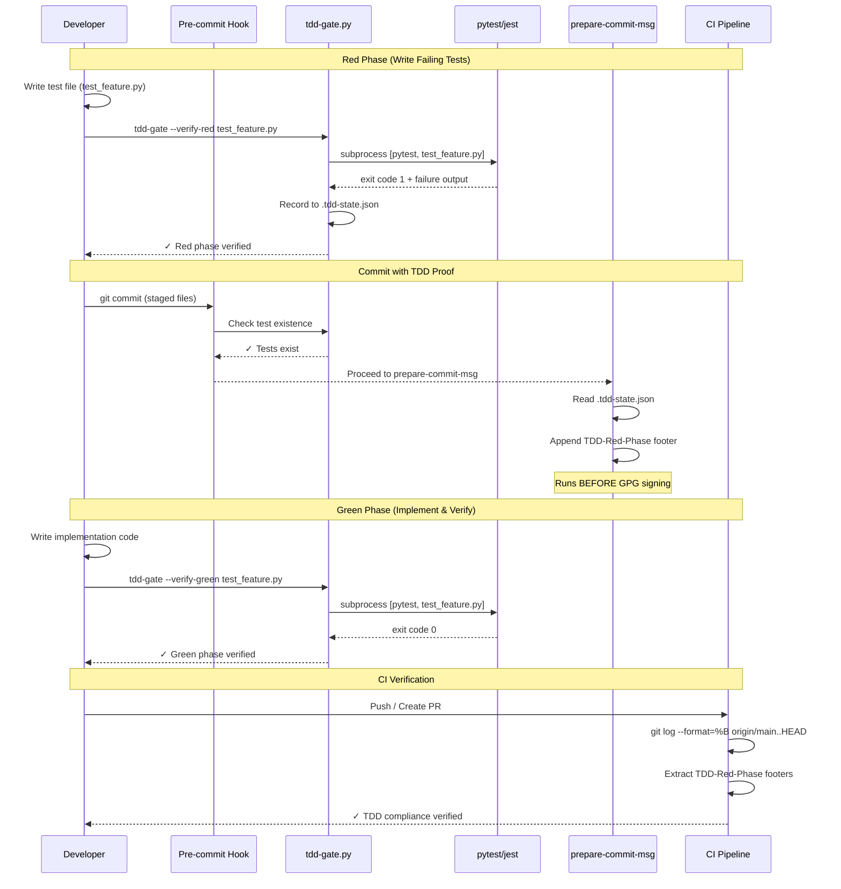
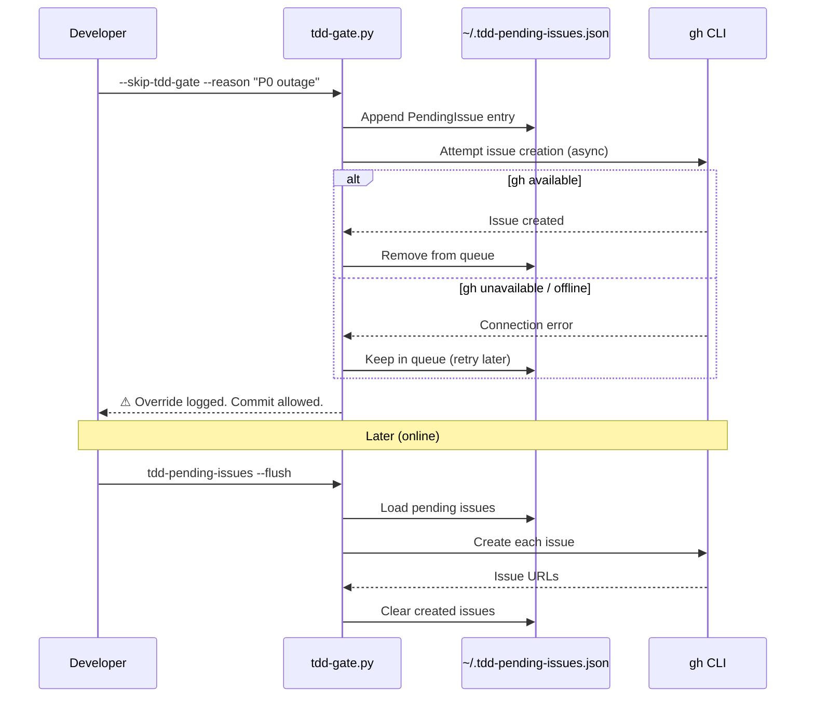

# 102 - Feature: TDD Test Initialization Gate

<!-- Template Metadata
Last Updated: 2026-02-17
Updated By: Issue #102 LLD revision
Update Reason: Address mechanical validation failures — add test coverage for REQ-8, REQ-10, REQ-11, REQ-12, REQ-17, REQ-18; fix Section 3 format; fix Section 10.1 REQ references
Previous: Initial Low-Level Design for TDD enforcement tooling
-->

## 1. Context & Goal
* **Issue:** #102
* **Objective:** Enforce TDD discipline by gating implementation work behind verified failing tests, ensuring the red-green-refactor cycle is followed for every feature.
* **Status:** Draft
* **Related Issues:** #62 (Governance Workflow StateGraph)

### Open Questions

- [ ] Does the team use "Squash and Merge" for Pull Requests? (Design supports it, but confirmation needed)
- [ ] Strict blocking (CI failure) or soft blocking (warning/audit log) for MVP?
- [ ] Should "Hotfix Override" require manager approval (via CODEOWNERS) or is developer self-attestation sufficient?

## 2. Proposed Changes

*This section is the **source of truth** for implementation. Describes exactly what will be built.*

### 2.1 Files Changed

| File | Change Type | Description |
|------|-------------|-------------|
| `tools/` | Existing Directory | Parent directory for TDD tools |
| `tools/tdd_gate.py` | Add | Main TDD enforcement CLI tool — red/green verification, override handling |
| `tools/tdd_audit.py` | Add | Audit trail generation and TDD compliance reporting |
| `tools/tdd_pending_issues.py` | Add | Async pending issue creation processor with `--flush` command |
| `hooks/` | Add (Directory) | Shell hooks directory for git hook scripts |
| `hooks/pre_commit_tdd_gate.sh` | Add | Pre-commit hook: test existence check (excludes docs/config) |
| `hooks/prepare_commit_msg_tdd.sh` | Add | Prepare-commit-msg hook: append TDD-Red-Phase footer |
| `.tdd-config.json` | Add | Project-specific TDD configuration (patterns, exclusions, thresholds) |
| `.gitignore` | Modify | Add `.tdd-state.json` to ignored files |
| `.husky/pre-commit` | Add | Husky pre-commit hook configuration |
| `.husky/prepare-commit-msg` | Add | Husky prepare-commit-msg hook configuration |
| `dashboard/package.json` | Modify | Add `prepare` script for automatic husky installation |
| `docs/standards/0065-tdd-enforcement.md` | Add | Standard documenting TDD gate rules |
| `CLAUDE.md` | Modify | Add TDD workflow section |
| `docs/reports/102/` | Add (Directory) | Report directory for this issue |
| `docs/reports/102/tdd-audit.md` | Add | TDD audit trail for issue #102 |
| `docs/reports/102/implementation-report.md` | Add | Implementation report for issue #102 |
| `docs/reports/102/test-report.md` | Add | Test report for issue #102 |
| `tests/unit/test_tdd_gate.py` | Add | Unit tests for tdd_gate.py |
| `tests/unit/test_tdd_audit.py` | Add | Unit tests for tdd_audit.py |
| `tests/unit/test_tdd_pending_issues.py` | Add | Unit tests for tdd_pending_issues.py |
| `tests/e2e/test_tdd_workflow_e2e.py` | Add | End-to-end tests for full TDD workflow |
| `tests/fixtures/tdd_gate/` | Add (Directory) | Test fixtures for TDD gate tests |
| `tests/fixtures/tdd_gate/sample_tdd_config.json` | Add | Sample TDD config fixture |
| `tests/fixtures/tdd_gate/sample_test_passing.py` | Add | Fixture: test file that passes (exit code 0) |
| `tests/fixtures/tdd_gate/sample_test_failing.py` | Add | Fixture: test file that fails (exit code 1) |
| `tests/fixtures/tdd_gate/sample_test_syntax_error.py` | Add | Fixture: test file with syntax error (exit code 2) |
| `tests/fixtures/tdd_gate/sample_test_empty.py` | Add | Fixture: empty test file (exit code 5) |

### 2.1.1 Path Validation (Mechanical - Auto-Checked)

Mechanical validation checks:
- `tools/` — Exists ✓
- `dashboard/package.json` — Exists ✓
- `.gitignore` — Exists ✓
- `CLAUDE.md` — Exists ✓
- `tests/unit/` — Exists ✓
- `tests/e2e/` — Exists ✓
- `tests/fixtures/` — Exists ✓
- `docs/standards/` — Exists ✓
- `hooks/` — New directory (Add)
- `.husky/` — New directory (Add, managed by husky init)
- `docs/reports/102/` — New directory (Add)
- `tests/fixtures/tdd_gate/` — New directory (Add)

### 2.2 Dependencies

```toml
# pyproject.toml additions — none required
# tdd_gate.py uses only stdlib (subprocess, json, pathlib, argparse, datetime, sys, os)
# No new Python dependencies needed
```

```json
// dashboard/package.json additions
{
  "devDependencies": {
    "husky": "^9.0.0"
  },
  "scripts": {
    "prepare": "husky"
  }
}
```

External tool requirements (not Python packages):
- `gh` (GitHub CLI) — required for async issue creation; checked at runtime
- `pytest` — already in dev dependencies
- `husky` — npm dev dependency for git hook management

### 2.3 Data Structures

```python
# === .tdd-config.json schema ===
class TDDConfig(TypedDict):
    """Project-level TDD configuration loaded from .tdd-config.json"""
    test_framework: str                    # "pytest" | "jest"
    test_command: str                      # e.g., "poetry run pytest" or "npx jest"
    test_patterns: dict[str, list[str]]    # framework -> glob patterns
    # e.g., {"pytest": ["test_*.py", "*_test.py"], "jest": ["*.test.js", "*.spec.js"]}
    source_extensions: list[str]           # [".py", ".js", ".ts"] — files that require tests
    excluded_extensions: list[str]         # [".md", ".rst", ".txt", ".json", ".yaml", ".yml", ".toml", ".ini"]
    excluded_paths: list[str]             # ["docs/", "config/", ".github/"]
    min_test_count: int                   # Minimum number of tests required (default: 1)
    issue_label: str                      # Label for auto-created follow-up issues (default: "tdd-debt")
    audit_dir: str                        # Base path for audit reports (default: "docs/reports")


# === Local state (git-ignored, developer convenience only) ===
class TDDLocalState(TypedDict):
    """Local developer state in .tdd-state.json (git-ignored)"""
    current_issue: str | None             # e.g., "102"
    red_phase_completed: bool
    red_phase_timestamp: str | None       # ISO 8601
    red_phase_commit_sha: str | None
    test_file: str | None                 # Path to test file verified in red phase
    red_phase_exit_code: int | None       # Exit code from red phase run
    red_phase_output: str | None          # Captured stderr/stdout (truncated to 2000 chars)


# === Pending issues queue (~/.tdd-pending-issues.json) ===
class PendingIssue(TypedDict):
    """Single pending issue in the debt queue"""
    timestamp: str                        # ISO 8601
    reason: str                           # Developer justification
    branch: str                           # Git branch at time of override
    commit_sha: str                       # Commit SHA at time of override
    repo: str                             # Repo name (owner/repo format)
    files_changed: list[str]              # Files committed without TDD
    retry_count: int                      # Number of failed creation attempts
    last_error: str | None                # Last error message from gh CLI


class PendingIssuesFile(TypedDict):
    """Schema for ~/.tdd-pending-issues.json"""
    version: int                          # Schema version (1)
    pending: list[PendingIssue]


# === Audit trail entry ===
class AuditEntry(TypedDict):
    """Single entry in docs/reports/{IssueID}/tdd-audit.md"""
    phase: str                            # "red" | "green" | "refactor" | "override"
    timestamp: str                        # ISO 8601
    commit_sha: str
    test_file: str
    exit_code: int
    test_names: list[str]                 # Names of tests discovered/run
    output_summary: str                   # Truncated output (max 2000 chars)
    override_reason: str | None           # Only for "override" phase


# === Exit code mapping ===
EXIT_CODE_DESCRIPTIONS: dict[str, dict[int, str]] = {
    "pytest": {
        0: "Tests passed (invalid red phase — tests must fail first)",
        1: "Tests failed (valid red phase ✓)",
        2: "Test collection error or interrupted (invalid — not a meaningful test failure)",
        5: "No tests collected (invalid — no tests found. Did you name your file test_*.py?)",
    },
    "jest": {
        0: "Tests passed (invalid red phase — tests must fail first)",
        1: "Tests failed (valid red phase ✓)",
    },
}
```

### 2.4 Function Signatures

```python
# ============================================================
# tools/tdd_gate.py — Main TDD enforcement CLI
# ============================================================

def main() -> int:
    """Entry point: parse CLI arguments and dispatch to subcommands.
    
    Returns exit code: 0 = success, 1 = gate blocked, 2 = usage error.
    """
    ...

def load_config(config_path: Path | None = None) -> TDDConfig:
    """Load .tdd-config.json from project root or specified path.
    
    Falls back to sensible defaults if file missing.
    Raises: ValueError if config file exists but is malformed.
    """
    ...

def detect_test_framework(config: TDDConfig) -> str:
    """Detect test framework from config or auto-detect from project files.
    
    Returns: "pytest" | "jest"
    Raises: RuntimeError if no framework detected.
    """
    ...

def find_test_file(source_file: Path, config: TDDConfig) -> Path | None:
    """Given a source file path, find its corresponding test file.
    
    Maps: src/feature.py -> tests/test_feature.py (pytest convention)
    Maps: src/feature.js -> src/__tests__/feature.test.js (jest convention)
    Returns None if no test file found.
    """
    ...

def is_excluded_file(file_path: Path, config: TDDConfig) -> bool:
    """Check if a file is excluded from TDD gate enforcement.
    
    Checks extension against excluded_extensions and path against excluded_paths.
    """
    ...

def check_test_existence(changed_files: list[Path], config: TDDConfig) -> tuple[bool, list[str]]:
    """Verify test files exist for all non-excluded changed source files.
    
    Returns: (all_exist: bool, missing_tests: list of error messages)
    """
    ...

def run_test_file(test_file: Path, config: TDDConfig) -> tuple[int, str]:
    """Run ONLY the specified test file using the configured test runner.
    
    Uses subprocess with list args (never shell=True).
    Passes specific file path: e.g., ["poetry", "run", "pytest", str(test_file)]
    
    Returns: (exit_code: int, captured_output: str)
    Timeout: 120 seconds (configurable).
    """
    ...

def verify_red_phase(test_file: Path, config: TDDConfig) -> tuple[bool, str, int]:
    """Verify test file fails with exit code 1 (valid red phase).
    
    Runs only the specified test file.
    Returns: (is_valid: bool, message: str, exit_code: int)
    - exit code 1 -> (True, "Red phase verified", 1)
    - exit code 0 -> (False, "Tests passed — must fail first", 0)
    - exit code 2 -> (False, "Collection error — not meaningful failure", 2)
    - exit code 5 -> (False, "No tests found. Did you name your file test_*.py?", 5)
    """
    ...

def verify_green_phase(test_file: Path, config: TDDConfig) -> tuple[bool, str, int]:
    """Verify test file passes with exit code 0 (valid green phase).
    
    Returns: (is_valid: bool, message: str, exit_code: int)
    """
    ...

def record_red_phase(test_file: Path, exit_code: int, output: str) -> str:
    """Record red phase completion in local state and return footer string.
    
    Updates .tdd-state.json (local, git-ignored).
    Returns footer string: "TDD-Red-Phase: <sha>:<timestamp>"
    """
    ...

def record_green_phase(test_file: Path, exit_code: int, output: str) -> None:
    """Record green phase completion in local state.
    
    Updates .tdd-state.json and appends to audit trail.
    """
    ...

def handle_override(reason: str, changed_files: list[Path]) -> None:
    """Process --skip-tdd-gate override.
    
    1. Log to ~/.tdd-pending-issues.json
    2. Attempt async issue creation via gh CLI (non-blocking)
    3. Print warning about skipped TDD gate
    
    Reason argument passed via subprocess list args (sanitized).
    """
    ...

def get_current_commit_sha() -> str:
    """Get current HEAD commit SHA via git rev-parse.
    
    Returns short SHA (7 chars). Returns "unknown" on error.
    """
    ...

def get_changed_source_files() -> list[Path]:
    """Get list of staged source files from git diff --cached.
    
    Returns only files matching source_extensions from config.
    """
    ...


# ============================================================
# tools/tdd_audit.py — Audit trail generation
# ============================================================

def append_audit_entry(
    issue_id: str,
    entry: AuditEntry,
    audit_dir: Path | None = None,
) -> Path:
    """Append a single audit entry to docs/reports/{issue_id}/tdd-audit.md.
    
    Creates file with header if it doesn't exist.
    Strictly additive: never modifies existing content.
    Returns path to audit file.
    """
    ...

def format_audit_entry(entry: AuditEntry) -> str:
    """Format an AuditEntry into markdown table row + detail block.
    
    Returns formatted markdown string ready to append.
    """
    ...

def generate_compliance_report(issue_id: str, audit_dir: Path | None = None) -> str:
    """Generate TDD compliance summary from audit trail.
    
    Reads docs/reports/{issue_id}/tdd-audit.md and produces:
    - Red/Green/Refactor phase count
    - Override count and reasons
    - Timeline of TDD cycle
    - Compliance verdict: COMPLIANT / NON-COMPLIANT / PARTIAL
    
    Returns formatted markdown string.
    """
    ...

def extract_tdd_footer_from_commits(base_ref: str, head_ref: str) -> list[dict[str, str]]:
    """Extract TDD-Red-Phase footers from all commits in range.
    
    Used by CI to validate red phase proof in PR branch.
    Runs: git log --format=%B {base_ref}..{head_ref}
    
    Returns list of {"sha": str, "timestamp": str} from parsed footers.
    """
    ...

def check_test_deletions(base_ref: str, head_ref: str) -> list[str]:
    """Check for test file deletions between red and green phases.
    
    Returns list of deleted test file paths (empty = no deletions).
    """
    ...


# ============================================================
# tools/tdd_pending_issues.py — Async pending issue processor
# ============================================================

def load_pending_issues() -> PendingIssuesFile:
    """Load pending issues from ~/.tdd-pending-issues.json.
    
    Returns empty structure if file doesn't exist.
    """
    ...

def save_pending_issues(data: PendingIssuesFile) -> None:
    """Save pending issues to ~/.tdd-pending-issues.json.
    
    Creates parent directory if needed.
    """
    ...

def add_pending_issue(issue: PendingIssue) -> None:
    """Add a new pending issue to the local queue.
    
    Thread-safe: uses file locking.
    """
    ...

def create_github_issue(issue: PendingIssue) -> tuple[bool, str]:
    """Create a GitHub issue via gh CLI for a pending TDD debt item.
    
    Uses subprocess with list args (never shell=True).
    Command: ["gh", "issue", "create", "--title", ..., "--body", ..., "--label", ...]
    
    Returns: (success: bool, issue_url_or_error: str)
    """
    ...

def check_gh_available() -> bool:
    """Check if gh CLI is installed and authenticated.
    
    Runs: ["gh", "auth", "status"]
    Returns True if exit code 0.
    """
    ...

def flush_pending_issues(dry_run: bool = False) -> tuple[int, int]:
    """Process all pending issues: attempt to create each via gh CLI.
    
    Successfully created issues are removed from queue.
    Failed issues remain with incremented retry_count.
    
    Returns: (created_count: int, failed_count: int)
    """
    ...

def main() -> int:
    """CLI entry point for tdd-pending-issues tool.
    
    Subcommands:
      --flush        Process all pending issues
      --list         Show pending issues without processing
      --dry-run      Show what would be created without creating
    
    Returns exit code: 0 = success, 1 = some failures.
    """
    ...


# ============================================================
# hooks/prepare_commit_msg_tdd.sh — Footer injection hook
# ============================================================
# Shell function (not Python), documented here for completeness:
#
# inject_tdd_footer(commit_msg_file: str) -> void:
#     """Read .tdd-state.json, append TDD-Red-Phase footer to commit message.
#     
#     Runs in prepare-commit-msg phase, BEFORE GPG signing.
#     Never blocks commit (exit 0 always).
#     """

# ============================================================
# hooks/pre_commit_tdd_gate.sh — Test existence hook
# ============================================================
# Shell function (not Python), documented here for completeness:
#
# check_staged_files() -> int:
#     """Check staged source files have corresponding test files.
#     
#     Returns 0 if all tests exist or only excluded files staged.
#     Returns 1 if any source file missing its test.
#     """
```

### 2.5 Logic Flow (Pseudocode)

#### Pre-commit Hook Flow (`hooks/pre_commit_tdd_gate.sh`)

```
1. Get list of staged files: git diff --cached --name-only --diff-filter=ACM
2. FOR each staged file:
   a. IF file extension in excluded_extensions → SKIP
   b. IF file path starts with excluded_paths → SKIP
   c. IF file extension in source_extensions:
      i.  Find corresponding test file using naming convention
      ii. IF test file not found → ADD to missing_tests list
3. IF missing_tests is not empty:
   a. Print error: "TDD Gate: Missing test files for:"
   b. FOR each missing file: print expected test path
   c. Print: "Write failing tests first, then commit."
   d. EXIT 1 (block commit)
4. EXIT 0 (allow commit)
```

#### Red Phase Verification Flow (`tdd-gate --verify-red <test-file>`)

```
1. Load .tdd-config.json (or defaults)
2. Validate test_file exists and matches test pattern
3. Detect framework from config or file extension
4. Build command: [test_command, str(test_file)]
   - pytest: ["poetry", "run", "pytest", test_file, "-v", "--tb=short"]
   - jest: ["npx", "jest", "--verbose", test_file]
5. Run command via subprocess.run(cmd, capture_output=True, timeout=120)
   - NEVER use shell=True
6. Capture exit_code and combined stdout+stderr
7. Validate exit code:
   - IF exit_code == 1:
     a. Print "✓ Red phase verified: tests fail as expected"
     b. Record to .tdd-state.json (local)
     c. Record audit entry (phase="red")
     d. Print footer string for prepare-commit-msg hook
     e. RETURN (True, message, 1)
   - IF exit_code == 0:
     a. Print "✗ Invalid red phase: tests passed (exit code 0)"
     b. Print "Tests must FAIL first. Write assertions for unimplemented behavior."
     c. RETURN (False, message, 0)
   - IF exit_code == 2:
     a. Print "✗ Invalid red phase: collection error (exit code 2)"
     b. Print "Check for syntax errors in your test file."
     c. RETURN (False, message, 2)
   - IF exit_code == 5:
     a. Print "✗ Invalid red phase: no tests found (exit code 5)"
     b. Print "Did you name your file test_*.py? Ensure test functions start with test_"
     c. RETURN (False, message, 5)
   - ELSE:
     a. Print "✗ Unexpected exit code: {exit_code}"
     b. RETURN (False, message, exit_code)
```

#### Prepare-commit-msg Hook Flow (`hooks/prepare_commit_msg_tdd.sh`)

```
1. Read .tdd-state.json
2. IF red_phase_completed == true AND commit message file provided:
   a. Read commit message from $1 (COMMIT_MSG_FILE)
   b. Compute footer: "TDD-Red-Phase: {red_phase_commit_sha}:{red_phase_timestamp}"
   c. Append blank line + footer to commit message file
   d. NOTE: This hook runs BEFORE GPG signing (prepare-commit-msg phase)
3. EXIT 0 (never block commit at this phase)
```

#### Override Flow (`tdd-gate --skip-tdd-gate --reason "<justification>"`)

```
1. Validate --reason is provided and non-empty
2. Get current branch, commit SHA, repo name, changed files
3. Create PendingIssue entry:
   {
     timestamp: now (ISO 8601),
     reason: reason_text,  # stored literally, not shell-interpreted
     branch: current_branch,
     commit_sha: current_sha,
     repo: repo_name,
     files_changed: staged_files,
     retry_count: 0,
     last_error: null
   }
4. Save to ~/.tdd-pending-issues.json (append)
5. Print warning: "⚠ TDD gate overridden. Reason: {reason}"
6. Print: "Technical debt logged. Follow-up issue will be created automatically."
7. Attempt async issue creation (non-blocking):
   a. IF gh CLI available:
      i.  Try create_github_issue() in background
      ii. On success: remove from pending queue
      iii. On failure: leave in queue, log error
   b. ELSE:
      i.  Print "gh CLI unavailable. Issue queued for later creation."
8. RETURN (allow commit to proceed)
```

#### CI Footer Extraction Flow

```
1. Get base ref (origin/main) and head ref (HEAD or PR branch)
2. Run: git log --format=%B {base_ref}..{head_ref}
3. Scan all commit messages for "TDD-Red-Phase:" pattern
4. IF footer found in ANY commit:
   a. Extract SHA and timestamp
   b. PASS CI gate
5. IF footer NOT found:
   a. Check if all changed files are excluded (docs/config)
   b. IF all excluded → PASS (no TDD required)
   c. ELSE → FAIL CI gate with message:
      "No TDD-Red-Phase proof found in branch commits.
       Write failing tests first, verify with: tdd-gate --verify-red <test-file>"
```

#### Flush Pending Issues Flow (`tdd-pending-issues --flush`)

```
1. Load ~/.tdd-pending-issues.json
2. IF empty: Print "No pending issues." → EXIT 0
3. FOR each pending issue:
   a. Build issue title: "TDD Debt: {branch} - Tests needed for override"
   b. Build issue body with: reason, timestamp, files, commit SHA
   c. Run: ["gh", "issue", "create", "--title", title, "--body", body, "--label", label]
   d. IF success:
      i.  Print "✓ Created: {issue_url}"
      ii. Remove from pending list
   e. IF failure:
      i.  Increment retry_count
      ii. Store last_error
      iii. Print "✗ Failed: {error}. Will retry next time."
4. Save updated pending list
5. Print summary: "Created: {N}, Failed: {M}, Remaining: {R}"
6. RETURN 0 if all created, 1 if any failed
```

### 2.6 Technical Approach

* **Module:** `tools/tdd_gate.py`, `tools/tdd_audit.py`, `tools/tdd_pending_issues.py`
* **Pattern:** CLI tool invoked by git hooks; no runtime framework dependency
* **Key Decisions:**
  - Pure stdlib Python (no new dependencies) for the tools to keep hook execution fast
  - Subprocess with list args exclusively — never `shell=True` — for security
  - File-scoped test execution: hooks pass explicit file paths to runners
  - State travels via commit message footers (not committed files) to avoid merge conflicts
  - Local `.tdd-state.json` is git-ignored convenience cache; footers are source of truth for CI
  - Audit trail is append-only markdown for human readability and git-friendly diffs
  - Husky manages hook installation to ensure consistent setup across developers
  - Prepare-commit-msg hook phase chosen specifically because it runs before GPG signing

### 2.7 Architecture Decisions

| Decision | Options Considered | Choice | Rationale |
|----------|-------------------|--------|-----------|
| State transport | Committed JSON file, Commit footers, Git notes | Commit footers | Avoids merge conflicts; travels with commits through rebase/cherry-pick; CI can extract from any commit |
| Hook management | Raw git hooks, pre-commit framework, husky | Husky | Auto-install via npm lifecycle; dashboard/package.json already exists; cross-platform |
| Test scoping | Full suite, file-scoped, function-scoped | File-scoped | Prevents false positives from unrelated test failures; fast execution |
| Override mechanism | PR label, CLI flag, config file | CLI flag with --reason | Immediate, auditable, works offline |
| Issue creation | Synchronous blocking, async non-blocking | Async non-blocking | Emergency hotfixes must not be blocked by network issues |
| Audit format | JSON, SQLite, Markdown | Append-only Markdown | Human-readable, git-friendly diffs, no binary files |
| Tool language | Shell only, Python only, Mixed | Mixed (shell hooks call Python tools) | Shell hooks are thin wrappers; Python provides testable logic |
| Hook phase for footer | post-commit, commit-msg, prepare-commit-msg | prepare-commit-msg | Runs before GPG signing; does not invalidate signatures |

**Architectural Constraints:**
- Must integrate with existing poetry-based Python toolchain
- Must not require new Python package dependencies (stdlib only for tools)
- Must work with existing worktree isolation model (ADR 0210)
- Must not invalidate GPG signatures (prepare-commit-msg runs before signing)
- Dashboard package.json exists and can host husky configuration

## 3. Requirements

1. Pre-commit hook MUST block commits of source files without corresponding test files
2. Pre-commit hook MUST exclude documentation files (`.md`, `.rst`, `.txt`) and config files (`.json`, `.yaml`, `.yml`, `.toml`, `.ini`) from TDD gate
3. `tdd-gate --verify-red <test-file>` MUST run ONLY the specified test file, not the full suite
4. Red phase verification MUST accept only exit code `1` (tests failed) as valid
5. Red phase verification MUST reject exit codes `0`, `2`, `5` with specific, actionable error messages
6. Exit code `5` error message MUST suggest checking file naming conventions
7. Red phase proof MUST be stored as commit message footer: `TDD-Red-Phase: <sha>:<timestamp>`
8. Prepare-commit-msg hook MUST run before GPG signing to avoid invalidating signatures
9. CI gate MUST extract `TDD-Red-Phase` footer from ALL commits in PR branch (supports squash)
10. `--skip-tdd-gate --reason "<justification>"` MUST allow immediate commit (non-blocking)
11. Override MUST log debt locally to `~/.tdd-pending-issues.json`
12. Pending issue creation MUST be async and non-blocking (offline-safe)
13. `tdd-pending-issues --flush` MUST manually trigger pending issue upload
14. `--reason` argument MUST be sanitized via subprocess list args (no shell injection)
15. Audit trail MUST be append-only at `docs/reports/{IssueID}/tdd-audit.md`
16. Configuration MUST be customizable via `.tdd-config.json`
17. `.tdd-state.json` MUST be listed in `.gitignore`
18. Husky MUST auto-install hooks via `prepare` script in `package.json`
19. MUST work with pytest (`test_*.py` pattern, exit code validation, file-scoped execution)
20. MUST work with Jest (`*.test.js`, `*.spec.js` pattern, exit code validation, file-scoped execution)

## 4. Alternatives Considered

| Option | Pros | Cons | Decision |
|--------|------|------|----------|
| **A: Git hooks + CLI tool (selected)** | Works locally and in CI; no external service; fast feedback; offline-capable | Requires hook installation; hooks can be bypassed locally (CI catches) | **Selected** |
| **B: CI-only enforcement** | Cannot be bypassed; centralized | No local feedback; slow iteration; developer waits for CI to fail | Rejected |
| **C: pre-commit framework (Python)** | Large ecosystem; YAML config | Additional dependency; doesn't integrate with existing husky/npm setup; overkill for this use case | Rejected |
| **D: GitHub Actions bot** | Zero local setup | Requires network; no offline support; slower feedback loop; additional API dependency | Rejected |

**Rationale:** Option A provides the fastest developer feedback (local hooks catch issues before push), while CI serves as a safety net. The combination of local hooks + CI footer validation creates defense-in-depth without requiring external services for the core workflow. Husky ensures hooks are installed automatically for all developers via npm lifecycle.

## 5. Data & Fixtures

### 5.1 Data Sources

| Attribute | Value |
|-----------|-------|
| Source | Local git repository (staged files, commit history) |
| Format | File paths, exit codes, stdout/stderr text |
| Size | Minimal — single test file output per invocation |
| Refresh | On each git commit or CLI invocation |
| Copyright/License | N/A — project-internal data |

### 5.2 Data Pipeline

```
git diff --cached ──hook──► tdd_gate.py ──subprocess──► pytest/jest (file-scoped)
                                │                              │
                                │                              ▼
                                │                        exit code + output
                                │                              │
                                ▼                              ▼
                        .tdd-state.json (local)    commit footer (TDD-Red-Phase)
                                │                              │
                                ▼                              ▼
                        tdd-audit.md (append)       CI extraction (git log)
```

### 5.3 Test Fixtures

| Fixture | Source | Notes |
|---------|--------|-------|
| `tests/fixtures/tdd_gate/sample_tdd_config.json` | Handcoded | Default config with pytest settings |
| `tests/fixtures/tdd_gate/sample_test_passing.py` | Handcoded | `assert True` — triggers exit code 0 |
| `tests/fixtures/tdd_gate/sample_test_failing.py` | Handcoded | `assert False` — triggers exit code 1 |
| `tests/fixtures/tdd_gate/sample_test_syntax_error.py` | Handcoded | Intentional syntax error — triggers exit code 2 |
| `tests/fixtures/tdd_gate/sample_test_empty.py` | Handcoded | Empty/comment-only — triggers exit code 5 |

### 5.4 Deployment Pipeline

- **Local:** Husky auto-installs hooks on `npm install` via `prepare` script
- **CI:** GitHub Actions workflow reads commit footers from branch history
- **No production deployment:** This is a developer tooling feature only

## 6. Diagram

### 6.1 Mermaid Quality Gate

- [x] **Simplicity:** Similar components collapsed
- [x] **No touching:** All elements have visual separation
- [x] **No hidden lines:** All arrows fully visible
- [x] **Readable:** Labels not truncated, flow direction clear
- [ ] **Auto-inspected:** Agent rendered via mermaid.ink and viewed

**Auto-Inspection Results:**
```
- Touching elements: [x] None
- Hidden lines: [x] None
- Label readability: [x] Pass
- Flow clarity: [x] Clear
```

### 6.2 Diagram — TDD Gate Workflow



### 6.3 Diagram — Override Flow



## 7. Security & Safety Considerations

### 7.1 Security

| Concern | Mitigation | Status |
|---------|------------|--------|
| Command injection via `--reason` | All subprocess calls use list args, never `shell=True`. Reason string is passed as a single list element to `gh` CLI | Addressed |
| Arbitrary code execution via test runner | Test runner command is configured in `.tdd-config.json`, not user input. File path is validated to exist before execution | Addressed |
| GITHUB_TOKEN exposure | Token is read by `gh` CLI from environment or auth session; never logged or stored by TDD tools | Addressed |
| Malicious `.tdd-config.json` | Config values are type-checked and validated; test_command is split into a fixed list, not shell-evaluated | Addressed |
| Local state file tampering | `.tdd-state.json` is convenience only; CI uses commit footers as source of truth | Addressed |
| Hook bypass | Developers can skip hooks locally (`--no-verify`); CI footer check serves as safety net | Addressed |

### 7.2 Safety

| Concern | Mitigation | Status |
|---------|------------|--------|
| Hook blocks emergency commits | `--skip-tdd-gate --reason` provides explicit escape hatch; non-blocking | Addressed |
| Test runner hangs/infinite loop | 120-second timeout on subprocess.run(); configurable in `.tdd-config.json` | Addressed |
| Corrupt `.tdd-state.json` blocks workflow | Tool recreates default state if JSON parse fails; file is git-ignored so easy to delete | Addressed |
| Pending issues file grows unbounded | `--flush` command processes queue; max 100 entries enforced (oldest dropped with warning) | Addressed |
| Full suite execution instead of file-scoped | Explicit file path passed to runner; verified by checking subprocess args in tests | Addressed |
| Audit file corruption | Append-only writes; each entry is self-contained markdown block; file never truncated | Addressed |

**Fail Mode:** Fail Open — If TDD gate tool crashes or has unexpected error, the commit proceeds (to avoid blocking all development). CI serves as the enforcement backstop.

**Recovery Strategy:** Delete `.tdd-state.json` to reset local state. Pending issues survive in `~/.tdd-pending-issues.json` and can be flushed later. Audit trail in git history is immutable.

## 8. Performance & Cost Considerations

### 8.1 Performance

| Metric | Budget | Approach |
|--------|--------|----------|
| Pre-commit hook latency | < 500ms | Pure file existence check via `git diff --cached`; no subprocess for excluded files |
| Red phase verification | < 30s typical | File-scoped execution (single test file, not full suite) |
| Prepare-commit-msg hook | < 100ms | Read JSON file + append string to commit message |
| Pending issue flush | < 5s per issue | Sequential `gh issue create` calls |

**Bottlenecks:** 
- Test runner startup time (pytest ~1s, jest ~2s) dominates red/green verification
- `gh` CLI network calls for issue creation (mitigated by async/non-blocking pattern)

### 8.2 Cost Analysis

| Resource | Unit Cost | Estimated Usage | Monthly Cost |
|----------|-----------|-----------------|--------------|
| GitHub API (issue creation) | Free | ~5-10 override issues/month | $0 |
| CI compute (footer extraction) | Included in Actions | ~30s per PR | $0 |
| Local disk (state files) | N/A | < 1KB per file | $0 |

**Cost Controls:**
- [x] No paid API calls required for core functionality
- [x] `gh` CLI uses existing authentication (no additional cost)
- [x] File-scoped test execution minimizes compute time

**Worst-Case Scenario:** Developer overrides frequently → pending issues queue grows → single `--flush` command creates many issues. Mitigated by 100-entry cap on queue.

## 9. Legal & Compliance

| Concern | Applies? | Mitigation |
|---------|----------|------------|
| PII/Personal Data | No | No PII collected; override reasons are developer-provided justifications only |
| Third-Party Licenses | No | Husky is MIT licensed; `gh` CLI is MIT licensed; both compatible with project license |
| Terms of Service | N/A | GitHub issue creation is within normal API usage |
| Data Retention | N/A | Audit trail is part of project repo; follows project retention policy |
| Export Controls | No | No restricted algorithms or data |

**Data Classification:** Internal (developer workflow data only)

**Compliance Checklist:**
- [x] No PII stored without consent
- [x] All third-party licenses compatible with project license (MIT)
- [x] External API usage compliant with provider ToS
- [x] Data retention policy: audit trail follows git repo lifecycle

## 10. Verification & Testing

*Ref: [0005-testing-strategy-and-protocols.md](0005-testing-strategy-and-protocols.md)*

**Testing Philosophy:** 100% automated test coverage for all tool logic. Shell hooks are thin wrappers tested via integration/e2e tests.

### 10.0 Test Plan (TDD - Complete Before Implementation)

| Test ID | Test Description | Expected Behavior | Status |
|---------|------------------|-------------------|--------|
| T010 | `load_config` with valid config file | Returns parsed TDDConfig dict | RED |
| T020 | `load_config` with missing file | Returns default config | RED |
| T030 | `load_config` with malformed JSON | Raises ValueError | RED |
| T040 | `is_excluded_file` with `.md` file | Returns True | RED |
| T050 | `is_excluded_file` with `.py` file | Returns False | RED |
| T060 | `is_excluded_file` with `.json` config | Returns True | RED |
| T070 | `is_excluded_file` with excluded path prefix | Returns True | RED |
| T080 | `find_test_file` for pytest convention | Returns correct test path | RED |
| T090 | `find_test_file` for jest convention | Returns correct test path | RED |
| T100 | `find_test_file` when no test exists | Returns None | RED |
| T110 | `check_test_existence` all tests exist | Returns (True, []) | RED |
| T120 | `check_test_existence` some tests missing | Returns (False, [missing...]) | RED |
| T130 | `check_test_existence` only excluded files | Returns (True, []) | RED |
| T140 | `verify_red_phase` exit code 1 (tests fail) | Returns (True, message, 1) | RED |
| T150 | `verify_red_phase` exit code 0 (tests pass) | Returns (False, message, 0) | RED |
| T160 | `verify_red_phase` exit code 2 (collection error) | Returns (False, message, 2) | RED |
| T170 | `verify_red_phase` exit code 5 (no tests found) | Returns (False, "Did you name...", 5) | RED |
| T180 | `verify_green_phase` exit code 0 | Returns (True, message, 0) | RED |
| T190 | `verify_green_phase` exit code 1 (still failing) | Returns (False, message, 1) | RED |
| T200 | `run_test_file` uses list args (no shell=True) | Subprocess called with list, not string | RED |
| T210 | `run_test_file` passes specific file path | Only specified file in args | RED |
| T220 | `run_test_file` timeout enforcement | TimeoutExpired raised after 120s | RED |
| T230 | `record_red_phase` writes local state | .tdd-state.json updated | RED |
| T240 | `record_red_phase` returns correct footer | Footer matches "TDD-Red-Phase: sha:ts" | RED |
| T250 | `handle_override` without --reason | Rejected with error | RED |
| T260 | `handle_override` with valid reason | Logged to pending queue | RED |
| T270 | `handle_override` with injection attempt | Reason stored literally, no execution | RED |
| T280 | `append_audit_entry` creates new file | File created with header + entry | RED |
| T290 | `append_audit_entry` appends to existing | Existing content preserved, new entry added | RED |
| T300 | `extract_tdd_footer_from_commits` finds footer | Returns list with sha/timestamp | RED |
| T310 | `extract_tdd_footer_from_commits` no footer | Returns empty list | RED |
| T320 | `add_pending_issue` to empty queue | Creates file with one entry | RED |
| T330 | `add_pending_issue` to existing queue | Appends without losing existing | RED |
| T340 | `flush_pending_issues` with gh available | Issues created, queue cleared | RED |
| T350 | `flush_pending_issues` with gh unavailable | Issues remain in queue with error | RED |
| T360 | `flush_pending_issues` dry run | No issues created, queue unchanged | RED |
| T370 | `generate_compliance_report` full cycle | Report shows red→green transition | RED |
| T380 | `check_test_deletions` no deletions | Returns empty list | RED |
| T390 | `check_test_deletions` with deletions | Returns list of deleted paths | RED |
| T400 | CLI `--verify-red` with passing test fixture | Exit code 1, specific error message | RED |
| T410 | CLI `--verify-red` with failing test fixture | Exit code 0, success message | RED |
| T420 | CLI `--verify-green` with passing test fixture | Exit code 0, success message | RED |
| T430 | Config exclusions are customizable | Custom extensions/paths respected | RED |
| T440 | Prepare-commit-msg hook runs in correct phase | Footer appended before GPG signing; hook never blocks | RED |
| T450 | Override allows immediate commit | `--skip-tdd-gate --reason` returns exit 0 (non-blocking) | RED |
| T460 | Override logs to pending issues file | `~/.tdd-pending-issues.json` contains new entry after override | RED |
| T470 | Pending issue creation is async non-blocking | `handle_override` returns immediately; failed gh call does not raise | RED |
| T480 | `.tdd-state.json` is in `.gitignore` | `.gitignore` file contains `.tdd-state.json` entry | RED |
| T490 | Husky `prepare` script configured | `dashboard/package.json` contains `"prepare": "husky"` script | RED |

**Coverage Target:** ≥95% for all new code in `tools/tdd_gate.py`, `tools/tdd_audit.py`, `tools/tdd_pending_issues.py`

**TDD Checklist:**
- [ ] All tests written before implementation
- [ ] Tests currently RED (failing)
- [ ] Test IDs match scenario IDs in 10.1
- [ ] Test file created at: `tests/unit/test_tdd_gate.py`, `tests/unit/test_tdd_audit.py`, `tests/unit/test_tdd_pending_issues.py`

### 10.1 Test Scenarios

| ID | Scenario | Type | Input | Expected Output | Pass Criteria |
|----|----------|------|-------|-----------------|---------------|
| 010 | Load valid config (REQ-16) | Auto | Valid `.tdd-config.json` | Parsed TDDConfig | All fields match expected values |
| 020 | Load missing config (REQ-16) | Auto | No config file | Default TDDConfig | Defaults applied correctly |
| 030 | Load malformed config (REQ-16) | Auto | Invalid JSON | ValueError raised | Exception message mentions JSON parse error |
| 040 | Exclude markdown files (REQ-2) | Auto | `README.md` | `is_excluded=True` | File bypasses TDD gate |
| 050 | Include Python source (REQ-1) | Auto | `feature.py` | `is_excluded=False` | File requires test |
| 060 | Exclude JSON config (REQ-2) | Auto | `config.json` | `is_excluded=True` | File bypasses TDD gate |
| 070 | Exclude by path prefix (REQ-2) | Auto | `docs/guide.py` | `is_excluded=True` | Path prefix match works |
| 080 | Find pytest test file (REQ-19) | Auto | `assemblyzero/core/engine.py` | `tests/unit/test_engine.py` | Correct mapping |
| 090 | Find jest test file (REQ-20) | Auto | `src/utils.js`, jest config | `src/__tests__/utils.test.js` | Correct mapping |
| 100 | Test file not found (REQ-1) | Auto | `new_module.py` (no test) | `None` | Returns None, not error |
| 110 | All tests exist (REQ-1) | Auto | Files with matching tests | `(True, [])` | No errors |
| 120 | Missing tests detected (REQ-1) | Auto | Files without tests | `(False, [messages])` | Error messages list missing files |
| 130 | Only excluded files changed (REQ-2) | Auto | `[README.md, config.yaml]` | `(True, [])` | Gate passes |
| 140 | Valid red phase exit 1 (REQ-4) | Auto | Failing test fixture | `(True, msg, 1)` | Red phase accepted |
| 150 | Invalid red: tests pass exit 0 (REQ-5) | Auto | Passing test fixture | `(False, msg, 0)` | Red phase rejected |
| 160 | Invalid red: collection error exit 2 (REQ-5) | Auto | Syntax error fixture | `(False, msg, 2)` | Red phase rejected with specific message |
| 170 | Invalid red: no tests exit 5 (REQ-6) | Auto | Empty test fixture | `(False, "Did you name...", 5)` | Error mentions file naming |
| 180 | Valid green phase exit 0 (REQ-4) | Auto | Passing test fixture | `(True, msg, 0)` | Green phase accepted |
| 190 | Invalid green: still failing (REQ-5) | Auto | Failing test fixture | `(False, msg, 1)` | Green phase rejected |
| 200 | Subprocess uses list args (REQ-14) | Auto | Any test file | subprocess.run called with list | Mock verifies `shell` param absent or False |
| 210 | File-scoped execution (REQ-3) | Auto | Specific test file | Only that file in args | No wildcard or directory in command |
| 220 | Timeout enforcement (REQ-3) | Auto | Slow test (mocked) | TimeoutExpired | Subprocess killed after timeout |
| 230 | Record red phase state (REQ-7) | Auto | Valid red result | JSON file written | State file contains expected fields |
| 240 | Red phase footer format (REQ-7) | Auto | Known SHA and timestamp | `TDD-Red-Phase: abc1234:2026-02-17T...` | Regex match |
| 250 | Override without reason (REQ-10) | Auto | `--skip-tdd-gate` (no --reason) | Exit code 2 (usage error) | Error message requires --reason |
| 260 | Override with valid reason (REQ-10) | Auto | `--reason "P0 outage"` | Entry in pending queue | Queue file contains entry |
| 270 | Override injection attempt (REQ-14) | Auto | `--reason '"; rm -rf / #'` | Reason stored literally | No shell execution; subprocess list args verified |
| 280 | Audit new file creation (REQ-15) | Auto | First entry for issue | File created with header + entry | File exists, contains header and entry |
| 290 | Audit append to existing (REQ-15) | Auto | Second entry for issue | Original preserved + new appended | File contains both entries |
| 300 | CI extracts footer (REQ-9) | Auto | Git log with footer | List of `{sha, timestamp}` | Parsed correctly |
| 310 | CI no footer found (REQ-9) | Auto | Git log without footer | Empty list | Returns `[]` |
| 320 | Add to empty pending queue (REQ-11) | Auto | First override | File created with entry | Valid JSON with one entry |
| 330 | Add to existing queue (REQ-11) | Auto | Subsequent override | Entry appended | Both entries present |
| 340 | Flush with gh available (REQ-13) | Auto | Pending entries, gh mocked success | Queue cleared | `create_github_issue` called for each |
| 350 | Flush with gh unavailable (REQ-12) | Auto | Pending entries, gh mocked failure | Queue retained with error | `retry_count` incremented |
| 360 | Flush dry run (REQ-13) | Auto | Pending entries | No API calls | Queue unchanged, output shows what would happen |
| 370 | Compliance report (REQ-15) | Auto | Audit file with red+green entries | Markdown report | Contains phase counts, verdict |
| 380 | No test deletions (REQ-15) | Auto | No deleted test files in diff | Empty list | No warnings |
| 390 | Test deletions detected (REQ-15) | Auto | Deleted test file in diff | List of paths | Warning includes deleted file names |
| 400 | CLI --verify-red passing test (REQ-5) | Auto | Passing fixture path | Exit 1, error message | Specific "tests passed" message |
| 410 | CLI --verify-red failing test (REQ-4) | Auto | Failing fixture path | Exit 0, success message | "Red phase verified" message |
| 420 | CLI --verify-green passing test (REQ-4) | Auto | Passing fixture path | Exit 0, success message | "Green phase verified" message |
| 430 | Custom config exclusions (REQ-16) | Auto | Custom config JSON | Custom patterns applied | Non-default extensions excluded |
| 440 | Prepare-commit-msg hook phase before GPG (REQ-8) | Auto | Commit with GPG config enabled, `.tdd-state.json` with red phase | Footer appended to commit message file; hook exits 0 | Footer present in message file; hook script uses prepare-commit-msg phase (not commit-msg or post-commit); exit code always 0 |
| 450 | Override allows immediate commit non-blocking (REQ-10) | Auto | `--skip-tdd-gate --reason "P0 outage"` | Exit code 0, commit not blocked | `handle_override` returns 0; no exception raised; warning printed to stderr |
| 460 | Override logs to pending issues file (REQ-11) | Auto | `--skip-tdd-gate --reason "hotfix"` with mock git context | `~/.tdd-pending-issues.json` updated | File contains new PendingIssue with correct branch, SHA, reason, files_changed |
| 470 | Pending issue creation async non-blocking (REQ-12) | Auto | `handle_override` with gh CLI returning error (mocked timeout/failure) | Override completes successfully; issue remains in queue | `handle_override` does not raise; pending issue stored; gh failure does not propagate |
| 480 | `.tdd-state.json` in .gitignore (REQ-17) | Auto | Read `.gitignore` file content | `.tdd-state.json` entry present | Line containing `.tdd-state.json` found in `.gitignore` after setup |
| 490 | Husky prepare script configured (REQ-18) | Auto | Read `dashboard/package.json` | `"prepare": "husky"` in scripts | JSON parse of `package.json` shows `scripts.prepare == "husky"` |

### 10.2 Test Commands

```bash
# Run all TDD gate unit tests
poetry run pytest tests/unit/test_tdd_gate.py tests/unit/test_tdd_audit.py tests/unit/test_tdd_pending_issues.py -v

# Run only fast/mocked tests (no subprocess)
poetry run pytest tests/unit/test_tdd_gate.py -v -m "not integration"

# Run e2e TDD workflow test (requires git repo)
poetry run pytest tests/e2e/test_tdd_workflow_e2e.py -v -m e2e

# Coverage report for TDD tools
poetry run pytest tests/unit/test_tdd_gate.py tests/unit/test_tdd_audit.py tests/unit/test_tdd_pending_issues.py --cov=tools --cov-report=term-missing
```

### 10.3 Manual Tests (Only If Unavoidable)

| ID | Scenario | Why Not Automated | Steps |
|----|----------|-------------------|-------|
| M010 | GPG signing compatibility (REQ-8) | Requires GPG key configured on developer machine | 1. `git config commit.gpgsign true` 2. Run red phase 3. `git commit` 4. Verify `git log --show-signature -1` shows valid signature AND footer |
| M020 | Husky auto-installation (REQ-18) | Requires clean `npm install` in fresh clone | 1. Clone repo fresh 2. `npm install` 3. Verify `.husky/pre-commit` and `.husky/prepare-commit-msg` exist |
| M030 | Offline override flow (REQ-12) | Requires network disconnection | 1. Disconnect network 2. `tdd-gate --skip-tdd-gate --reason "test"` 3. Verify commit succeeds 4. Verify `~/.tdd-pending-issues.json` updated 5. Reconnect 6. `tdd-pending-issues --flush` |

## 11. Risks & Mitigations

| Risk | Impact | Likelihood | Mitigation |
|------|--------|------------|------------|
| Developers bypass hooks with `--no-verify` | Med | Med | CI footer extraction serves as enforcement backstop; audit trail captures all overrides |
| Hook execution slows down commits noticeably | Med | Low | File-scoped execution; existence check is file-system only (no subprocess); 120s timeout |
| Test framework detection fails for mixed projects | Low | Low | Explicit `test_framework` in `.tdd-config.json` overrides auto-detection |
| `.tdd-state.json` corruption from concurrent access | Low | Low | Tool recreates default state on parse error; file is convenience-only, not source of truth |
| Squash-merge loses footer from individual commits | High | Med | CI extracts footers from ALL commits in branch before squash; audit trail preserved in `docs/reports/` |
| `gh` CLI not installed or not authenticated | Med | Med | Issue creation is async/non-blocking; pending queue retries; clear error messages guide setup |
| Husky not installed (developer doesn't run npm install) | Med | Low | CI gate catches missing footers; setup instructions in README and standard 0065 |
| Test file naming mismatch across frameworks | Med | Low | Configurable patterns in `.tdd-config.json`; exit code 5 message suggests naming conventions |
| Commit footer format conflict with other tools | Low | Low | Footer uses unique prefix `TDD-Red-Phase:`; follows git trailer convention |
| GPG signature invalidated by hook modifying message | High | Med | Footer injected via prepare-commit-msg phase which runs before signing |

## 12. Definition of Done

### Code
- [ ] `tools/tdd_gate.py` implemented with all function signatures from §2.4
- [ ] `tools/tdd_audit.py` implemented with audit trail generation
- [ ] `tools/tdd_pending_issues.py` implemented with `--flush` command
- [ ] `hooks/pre_commit_tdd_gate.sh` implemented (thin shell wrapper)
- [ ] `hooks/prepare_commit_msg_tdd.sh` implemented (footer injection, prepare-commit-msg phase)
- [ ] `.tdd-config.json` created with default configuration
- [ ] Husky configuration complete (`.husky/pre-commit`, `.husky/prepare-commit-msg`)
- [ ] `dashboard/package.json` updated with `prepare` script for husky auto-install
- [ ] `.gitignore` updated with `.tdd-state.json`
- [ ] Code comments reference this LLD (#102)

### Tests
- [ ] All 49 test scenarios pass (T010–T490)
- [ ] Test coverage ≥95% for `tools/tdd_gate.py`
- [ ] Test coverage ≥95% for `tools/tdd_audit.py`
- [ ] Test coverage ≥95% for `tools/tdd_pending_issues.py`
- [ ] E2e test for full TDD workflow passes

### Documentation
- [ ] `docs/standards/0065-tdd-enforcement.md` created
- [ ] `CLAUDE.md` updated with TDD workflow section
- [ ] `docs/reports/102/implementation-report.md` completed
- [ ] `docs/reports/102/test-report.md` completed
- [ ] New files added to `docs/0003-file-inventory.md`

### Review
- [ ] Code review completed
- [ ] Run 0809 Security Audit — PASS
- [ ] Run 0817 Wiki Alignment Audit — PASS
- [ ] User approval before closing issue

### 12.1 Traceability (Mechanical - Auto-Checked)

Files in Definition of Done mapped to Section 2.1:

| DoD File | Section 2.1 Entry |
|----------|-------------------|
| `tools/tdd_gate.py` | ✓ Add |
| `tools/tdd_audit.py` | ✓ Add |
| `tools/tdd_pending_issues.py` | ✓ Add |
| `hooks/pre_commit_tdd_gate.sh` | ✓ Add |
| `hooks/prepare_commit_msg_tdd.sh` | ✓ Add |
| `.tdd-config.json` | ✓ Add |
| `.husky/pre-commit` | ✓ Add |
| `.husky/prepare-commit-msg` | ✓ Add |
| `dashboard/package.json` | ✓ Modify |
| `.gitignore` | ✓ Modify |
| `docs/standards/0065-tdd-enforcement.md` | ✓ Add |
| `CLAUDE.md` | ✓ Modify |

Risk mitigations mapped to functions:

| Risk | Mitigating Function |
|------|-------------------|
| `--no-verify` bypass | `extract_tdd_footer_from_commits()` (CI backstop) |
| Slow commits | `run_test_file()` (file-scoped, timeout) |
| State corruption | `load_config()` (default fallback) |
| Squash-merge footer loss | `extract_tdd_footer_from_commits()` (all commits scan) |
| gh CLI unavailable | `check_gh_available()`, `add_pending_issue()` |
| Injection via --reason | `handle_override()` (subprocess list args) |
| GPG signature invalidation | `hooks/prepare_commit_msg_tdd.sh` (correct hook phase) |

---

## Appendix: Review Log

*Track all review feedback with timestamps and implementation status.*

### Review Summary

| Review | Date | Verdict | Key Issue |
|--------|------|---------|-----------|
| Mechanical Validation #1 | 2026-02-17 | REJECTED | 6 requirements missing test coverage (REQ-8, REQ-10, REQ-11, REQ-12, REQ-17, REQ-18) |
| Revision #1 | 2026-02-17 | PENDING | Added T440–T490 covering all 6 missing requirements; updated Section 10.1 with (REQ-N) suffixes; fixed Section 3 numbered list format |

**Final Status:** PENDING