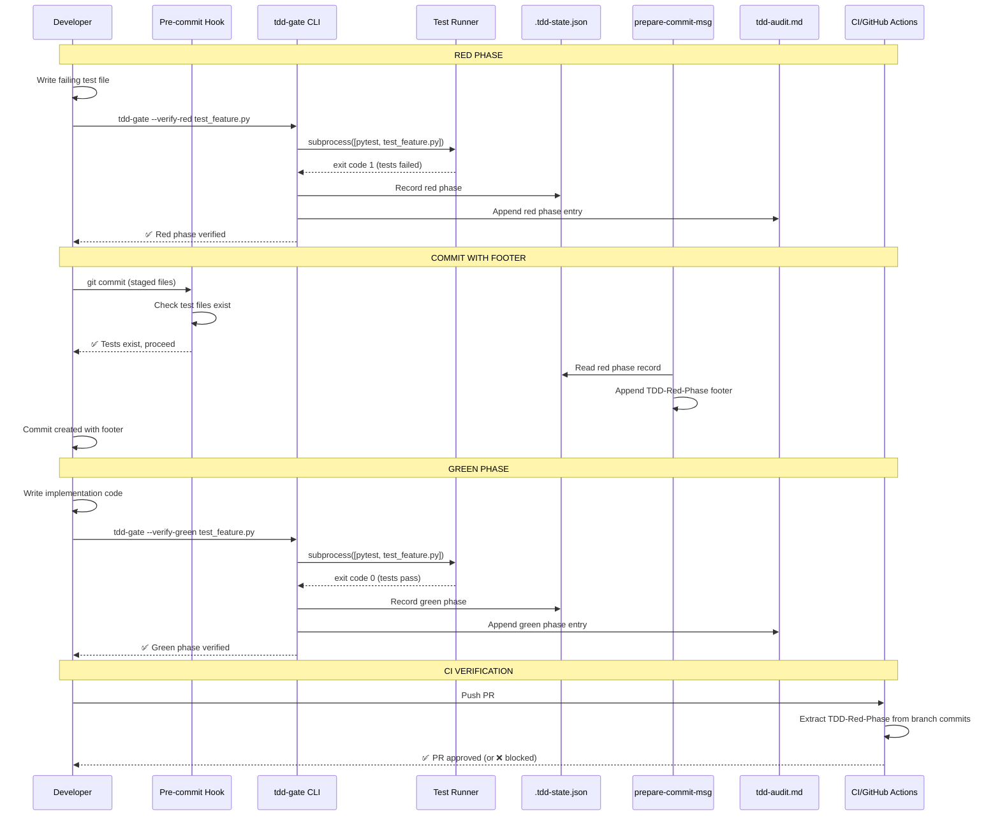

# 102 - Feature: TDD Test Initialization Gate

<!-- Template Metadata
Last Updated: 2026-02-10
Updated By: Issue #102 LLD revision
Update Reason: Fix mechanical validation errors — REQ-12, REQ-17, REQ-18 missing test coverage; reformat Section 3 as numbered list; add (REQ-N) suffixes to Section 10.1 scenarios
-->

## 1. Context & Goal
* **Issue:** #102
* **Objective:** Enforce TDD discipline by gating implementation work behind verified failing tests, ensuring the red-green-refactor cycle is followed for every feature.
* **Status:** Approved (gemini-3-pro-preview, 2026-02-26)
* **Related Issues:** #62 (Governance Workflow StateGraph)

### Open Questions

- [ ] Does the team use "Squash and Merge" for Pull Requests? (Current design supports it, but confirmation needed)
- [ ] Should the "Hotfix Override" require manager approval (via CODEOWNERS), or is developer self-attestation sufficient?
- [ ] Does the team prefer strict blocking (CI failure) or soft blocking (warning/audit log) for MVP?

## 2. Proposed Changes

*This section is the **source of truth** for implementation. Describes exactly what will be built.*

### 2.1 Files Changed

| File | Change Type | Description |
|------|-------------|-------------|
| `tools/` | Exists (Directory) | Parent directory for CLI tools |
| `tools/tdd_gate.py` | Add | Main TDD enforcement CLI tool — red/green phase verification, file-scoped test execution |
| `tools/tdd_audit.py` | Add | Audit trail generation — append-only logging to `docs/reports/{IssueID}/tdd-audit.md` |
| `tools/tdd_pending_issues.py` | Add | Async pending issue creation processor with `--flush` command |
| `hooks/` | Add (Directory) | Git hook scripts directory |
| `hooks/pre_commit_tdd_gate.py` | Add | Pre-commit hook: verify test file exists for changed implementation files |
| `hooks/prepare_commit_msg_tdd.py` | Add | Prepare-commit-msg hook: append `TDD-Red-Phase` footer to commit messages |
| `.tdd-config.json` | Add | Project-specific TDD configuration (patterns, exclusions, thresholds) |
| `.gitignore` | Modify | Add `.tdd-state.json` to ignored files |
| `.husky/pre-commit` | Add | Husky pre-commit hook configuration |
| `.husky/prepare-commit-msg` | Add | Husky prepare-commit-msg hook configuration |
| `dashboard/package.json` | Modify | Add `prepare` script for automatic husky installation on `npm install` |
| `docs/standards/0065-tdd-enforcement.md` | Add | Standard documenting TDD gate rules |
| `CLAUDE.md` | Modify | Add TDD workflow section |
| `tests/unit/test_tdd_gate/` | Add (Directory) | Test directory for TDD gate unit tests |
| `tests/unit/test_tdd_gate/__init__.py` | Add | Test package init |
| `tests/unit/test_tdd_gate/test_tdd_gate.py` | Add | Unit tests for `tools/tdd_gate.py` |
| `tests/unit/test_tdd_gate/test_tdd_audit.py` | Add | Unit tests for `tools/tdd_audit.py` |
| `tests/unit/test_tdd_gate/test_tdd_pending_issues.py` | Add | Unit tests for `tools/tdd_pending_issues.py` |
| `tests/unit/test_tdd_gate/test_pre_commit_hook.py` | Add | Unit tests for pre-commit hook logic |
| `tests/unit/test_tdd_gate/test_prepare_commit_msg_hook.py` | Add | Unit tests for prepare-commit-msg hook logic |
| `tests/unit/test_tdd_gate/test_config.py` | Add | Unit tests for configuration loading |
| `tests/fixtures/tdd_gate/` | Add (Directory) | Test fixtures directory |
| `tests/fixtures/tdd_gate/sample_tdd_config.json` | Add | Sample `.tdd-config.json` for tests |
| `tests/fixtures/tdd_gate/mock_test_pass.py` | Add | Mock test file that passes (exit code 0) |
| `tests/fixtures/tdd_gate/mock_test_fail.py` | Add | Mock test file that fails (exit code 1) |
| `tests/fixtures/tdd_gate/mock_test_error.py` | Add | Mock test file with collection error (exit code 2) |
| `tests/fixtures/tdd_gate/mock_test_empty.py` | Add | Mock test file with no tests (exit code 5) |

### 2.1.1 Path Validation (Mechanical - Auto-Checked)

Mechanical validation automatically checks:
- `tools/` — Exists ✓
- `.gitignore` — Exists ✓
- `CLAUDE.md` — Exists ✓
- `dashboard/package.json` — Exists ✓
- `tests/unit/` — Exists ✓
- `tests/fixtures/` — Exists ✓
- `docs/standards/` — Exists ✓
- `hooks/` — New directory (Add)
- `.husky/` — New directory (created by husky init)
- `tests/unit/test_tdd_gate/` — New directory (Add)
- `tests/fixtures/tdd_gate/` — New directory (Add)

### 2.2 Dependencies

```toml
# No new Python dependencies required.
# tools/tdd_gate.py uses only stdlib: subprocess, json, pathlib, argparse, datetime, sys, os
# tools/tdd_pending_issues.py uses only stdlib: subprocess, json, pathlib, datetime
```

```json
// dashboard/package.json devDependencies additions
{
  "husky": "^9.0.0"
}
```

External CLI dependency:
- `gh` (GitHub CLI) — Required for async issue creation in override flow. Not a Python package.

### 2.3 Data Structures

```python
# === .tdd-config.json schema ===
class TDDConfig(TypedDict):
    """Project-level TDD configuration."""
    test_framework: str  # "pytest" | "jest"
    test_command: str  # e.g., "poetry run pytest" or "npx jest"
    test_patterns: dict[str, list[str]]  # Maps source extensions to test patterns
    # e.g., {".py": ["test_{name}.py", "{name}_test.py"],
    #        ".js": ["{name}.test.js", "{name}.spec.js"],
    #        ".ts": ["{name}.test.ts", "{name}.spec.ts"]}
    test_dirs: list[str]  # e.g., ["tests/", "tests/unit/"]
    source_dirs: list[str]  # e.g., ["assemblyzero/", "tools/"]
    excluded_extensions: list[str]  # e.g., [".md", ".rst", ".txt", ".json", ".yaml", ".yml", ".toml", ".ini"]
    excluded_paths: list[str]  # e.g., ["docs/", "data/", ".github/"]
    min_test_count: int  # Default: 1
    exit_code_messages: dict[str, str]  # Custom messages per exit code


# === Local state (git-ignored, developer convenience only) ===
class TDDLocalState(TypedDict):
    """Local .tdd-state.json — NOT committed, developer convenience only."""
    issue_id: str | None  # Current issue being worked on
    red_phase: RedPhaseRecord | None
    green_phase: GreenPhaseRecord | None


class RedPhaseRecord(TypedDict):
    """Records a verified red phase."""
    timestamp: str  # ISO 8601
    commit_sha: str  # Git SHA at red phase verification
    test_file: str  # Path to the test file
    exit_code: int  # Must be 1
    failure_output: str  # Captured stderr/stdout (truncated to 2000 chars)
    test_count: int  # Number of tests that failed


class GreenPhaseRecord(TypedDict):
    """Records a verified green phase."""
    timestamp: str  # ISO 8601
    commit_sha: str
    test_file: str
    exit_code: int  # Must be 0
    test_count: int


# === Pending issues queue (~/.tdd-pending-issues.json) ===
class PendingIssue(TypedDict):
    """A deferred technical debt issue awaiting creation."""
    timestamp: str  # ISO 8601
    reason: str  # Developer-provided justification
    branch: str  # Git branch at time of override
    commit_sha: str  # Commit SHA that used override
    repo: str  # Repository name (owner/repo)
    files_changed: list[str]  # Files in the commit
    status: str  # "pending" | "created" | "failed"
    issue_url: str | None  # Set after successful creation
    retry_count: int  # Number of creation attempts


# === Audit trail entry (append-only markdown) ===
class AuditEntry(TypedDict):
    """Single entry in docs/reports/{IssueID}/tdd-audit.md."""
    phase: str  # "red" | "green" | "refactor" | "override"
    timestamp: str  # ISO 8601
    commit_sha: str
    test_file: str
    exit_code: int
    test_names: list[str]
    details: str  # Failure messages (red), pass confirmation (green), etc.
```

### 2.4 Function Signatures

```python
# ============================================================
# tools/tdd_gate.py — Main TDD enforcement CLI
# ============================================================

def main() -> int:
    """CLI entry point. Parses args, dispatches to subcommands.
    Returns exit code (0=success, 1=failure, 2=config error)."""
    ...

def load_config(config_path: Path | None = None) -> TDDConfig:
    """Load .tdd-config.json from project root or specified path.
    Falls back to sensible defaults if file not found.
    Raises: ConfigError if file exists but is malformed."""
    ...

def verify_red(test_file: Path, config: TDDConfig) -> RedPhaseResult:
    """Run ONLY the specified test file and verify exit code is 1.
    
    Args:
        test_file: Path to the specific test file to execute.
        config: Loaded TDD configuration.
    
    Returns:
        RedPhaseResult with success=True if exit code is 1.
    
    Raises:
        TestFileNotFoundError: If test_file does not exist.
        InvalidRedPhaseError: If exit code is not 1 (with specific message).
    """
    ...

def verify_green(test_file: Path, config: TDDConfig) -> GreenPhaseResult:
    """Run ONLY the specified test file and verify exit code is 0.
    
    Args:
        test_file: Path to the specific test file to execute.
        config: Loaded TDD configuration.
    
    Returns:
        GreenPhaseResult with success=True if exit code is 0.
    
    Raises:
        TestFileNotFoundError: If test_file does not exist.
        InvalidGreenPhaseError: If exit code is not 0.
    """
    ...

def run_test_file(test_file: Path, config: TDDConfig) -> TestRunResult:
    """Execute a single test file using the configured test runner.
    Uses subprocess with list arguments (never shell=True).
    
    Args:
        test_file: Path to specific test file.
        config: TDD configuration with test_command.
    
    Returns:
        TestRunResult containing exit_code, stdout, stderr, duration.
    """
    ...

def build_test_command(test_file: Path, config: TDDConfig) -> list[str]:
    """Construct the test command as a list of arguments.
    
    For pytest: ["poetry", "run", "pytest", str(test_file), "-v", "--tb=short", "--no-header"]
    For jest: ["npx", "jest", str(test_file), "--verbose"]
    
    Returns: List of string arguments (safe for subprocess).
    """
    ...

def get_exit_code_message(exit_code: int, framework: str) -> str:
    """Return a human-readable message for a test runner exit code.
    
    Exit code 0 (pytest/jest): 'Tests passed — invalid red phase. Tests must fail first.'
    Exit code 1 (pytest/jest): 'Tests failed — valid red phase.'
    Exit code 2 (pytest): 'Test collection error or interrupted — not a meaningful failure.'
    Exit code 5 (pytest): 'No tests collected. Did you name your file test_*.py?'
    
    Returns: Descriptive error/success message string.
    """
    ...

def record_red_phase(result: RedPhaseResult, test_file: Path) -> str:
    """Write red phase record to local .tdd-state.json and return footer string.
    
    Returns: Footer string 'TDD-Red-Phase: <sha>:<timestamp>'
    """
    ...

def record_green_phase(result: GreenPhaseResult, test_file: Path) -> str:
    """Write green phase record to local .tdd-state.json.
    
    Returns: Footer string 'TDD-Green-Phase: <sha>:<timestamp>'
    """
    ...

def handle_override(reason: str, config: TDDConfig) -> None:
    """Process --skip-tdd-gate override.
    
    1. Validate reason is non-empty.
    2. Log to ~/.tdd-pending-issues.json.
    3. Attempt async issue creation (non-blocking).
    4. Print warning about technical debt.
    
    Args:
        reason: Developer-provided justification (sanitized via list args).
    
    Raises:
        ValueError: If reason is empty or whitespace-only.
    """
    ...

def find_test_file(source_file: Path, config: TDDConfig) -> Path | None:
    """Given a source file, find its corresponding test file.
    
    Searches test_dirs for files matching test_patterns.
    e.g., 'assemblyzero/utils/parser.py' → 'tests/unit/test_parser.py'
    
    Returns: Path to test file if found, None otherwise.
    """
    ...

def is_excluded_file(file_path: Path, config: TDDConfig) -> bool:
    """Check if a file is excluded from TDD gate by extension or path.
    
    Excluded by default:
    - .md, .rst, .txt (documentation)
    - .json, .yaml, .yml, .toml, .ini (configuration)
    - Files under docs/, data/, .github/
    
    Returns: True if file should be excluded from TDD enforcement.
    """
    ...

def get_current_commit_sha() -> str:
    """Get current HEAD commit SHA (short form).
    Uses: subprocess.run(['git', 'rev-parse', '--short', 'HEAD'])
    """
    ...


# ============================================================
# tools/tdd_audit.py — Audit trail generation
# ============================================================

def append_audit_entry(
    issue_id: str,
    phase: str,
    test_file: Path,
    exit_code: int,
    test_names: list[str],
    details: str,
    commit_sha: str | None = None,
) -> Path:
    """Append an entry to docs/reports/{issue_id}/tdd-audit.md.
    
    Creates file and parent directories if they don't exist.
    File is strictly append-only — never modifies existing content.
    
    Args:
        issue_id: GitHub issue number (e.g., '102').
        phase: 'red', 'green', 'refactor', or 'override'.
        test_file: Path to the test file.
        exit_code: Test runner exit code.
        test_names: List of test function/method names.
        details: Phase-specific details (failure messages, etc.).
        commit_sha: Git SHA, auto-detected if None.
    
    Returns: Path to the audit file.
    """
    ...

def generate_compliance_report(issue_id: str) -> str:
    """Generate a TDD compliance summary for a given issue.
    
    Parses the audit file and produces:
    - Red phase timestamp and proof
    - Green phase timestamp
    - Time between red and green
    - Override usage (if any)
    - Compliance verdict: COMPLIANT / NON-COMPLIANT / OVERRIDE
    
    Returns: Markdown-formatted compliance report string.
    """
    ...

def parse_audit_file(audit_path: Path) -> list[AuditEntry]:
    """Parse a tdd-audit.md file into structured entries.
    
    Returns: List of AuditEntry dicts in chronological order.
    """
    ...


# ============================================================
# tools/tdd_pending_issues.py — Async pending issue processor
# ============================================================

def load_pending_issues(queue_path: Path | None = None) -> list[PendingIssue]:
    """Load pending issues from ~/.tdd-pending-issues.json.
    
    Returns: List of PendingIssue dicts. Empty list if file doesn't exist.
    """
    ...

def save_pending_issues(issues: list[PendingIssue], queue_path: Path | None = None) -> None:
    """Save pending issues back to ~/.tdd-pending-issues.json.
    Atomically writes (write to temp, then rename).
    """
    ...

def add_pending_issue(
    reason: str,
    branch: str,
    commit_sha: str,
    repo: str,
    files_changed: list[str],
    queue_path: Path | None = None,
) -> PendingIssue:
    """Add a new pending issue to the queue.
    
    Returns: The created PendingIssue dict.
    """
    ...

def flush_pending_issues(queue_path: Path | None = None, max_retries: int = 3) -> FlushResult:
    """Attempt to create all pending GitHub issues via `gh issue create`.
    
    For each pending issue:
    1. Build title and body from stored metadata.
    2. Execute: subprocess.run(['gh', 'issue', 'create', '--title', title, '--body', body, '--label', 'tech-debt,tdd-override'], ...)
    3. On success: mark status='created', store issue_url.
    4. On failure: increment retry_count, keep status='pending'.
    
    Non-blocking: failures are logged, not raised.
    
    Returns: FlushResult with created_count, failed_count, remaining_count.
    """
    ...

def create_github_issue(pending: PendingIssue) -> str | None:
    """Create a single GitHub issue via gh CLI.
    
    Uses subprocess.run with list arguments (never shell=True).
    
    Returns: Issue URL on success, None on failure.
    """
    ...

def check_gh_auth() -> bool:
    """Check if gh CLI is authenticated.
    Runs: subprocess.run(['gh', 'auth', 'status'], ...)
    Returns: True if authenticated.
    """
    ...


# ============================================================
# hooks/pre_commit_tdd_gate.py — Pre-commit hook logic
# ============================================================

def pre_commit_check() -> int:
    """Main pre-commit hook entry point.
    
    1. Get list of staged files (git diff --cached --name-only).
    2. Filter to source code files (exclude docs, config, tests).
    3. For each source file, check if corresponding test file exists.
    4. If any source file lacks a test file, print error and return 1.
    5. If all source files have tests (or are excluded), return 0.
    
    Returns: 0 (allow commit) or 1 (block commit).
    """
    ...

def get_staged_files() -> list[Path]:
    """Get list of files staged for commit.
    Uses: subprocess.run(['git', 'diff', '--cached', '--name-only', '--diff-filter=ACM'])
    Returns: List of Path objects for added/copied/modified files.
    """
    ...

def filter_source_files(files: list[Path], config: TDDConfig) -> list[Path]:
    """Filter file list to only source code files that require tests.
    Excludes: test files themselves, docs, config, excluded paths.
    """
    ...


# ============================================================
# hooks/prepare_commit_msg_tdd.py — Prepare-commit-msg hook logic
# ============================================================

def prepare_commit_msg(commit_msg_file: Path, commit_source: str | None = None) -> int:
    """Append TDD footer to commit message if red phase is verified.
    
    Called by git with args: <commit-msg-file> [<source>] [<sha>]
    
    1. Read local .tdd-state.json for red phase record.
    2. If red phase exists and is recent (within current session):
       - Append 'TDD-Red-Phase: <sha>:<timestamp>' footer to message.
    3. If green phase exists:
       - Append 'TDD-Green-Phase: <sha>:<timestamp>' footer.
    4. If override was used:
       - Append 'TDD-Override: <reason>' footer.
    
    Runs BEFORE editor opens and BEFORE GPG signing.
    
    Returns: 0 always (does not block commits).
    """
    ...

def append_footer(commit_msg_file: Path, footer_key: str, footer_value: str) -> None:
    """Append a git trailer/footer to a commit message file.
    
    Ensures proper formatting with blank line separator before trailers.
    Does not duplicate existing footers.
    """
    ...

def read_local_state(state_path: Path | None = None) -> TDDLocalState | None:
    """Read .tdd-state.json from project root.
    Returns None if file doesn't exist or is malformed.
    """
    ...
```

### 2.5 Logic Flow (Pseudocode)

#### Red Phase Verification (`tdd-gate --verify-red <test-file>`)

```
1. Parse CLI arguments
2. Load .tdd-config.json (or use defaults)
3. Validate test_file exists
4. Build test command: [config.test_command, str(test_file), "-v", "--tb=short"]
5. Execute subprocess.run(command, capture_output=True, timeout=120)
   - NEVER use shell=True
   - Pass test_file as explicit argument (file-scoped execution)
6. Check exit code:
   IF exit_code == 1:
     - VALID red phase
     - Extract test names from output
     - Record to .tdd-state.json (local)
     - Call append_audit_entry(phase="red", ...)
     - Print "✅ Red phase verified: {N} tests failing"
     - Return 0
   ELIF exit_code == 0:
     - INVALID: "Tests passed. Write tests that define unimplemented behavior."
     - Return 1
   ELIF exit_code == 2:
     - INVALID: "Test collection error or interrupted. Fix syntax/import errors."
     - Return 1
   ELIF exit_code == 5:
     - INVALID: "No tests collected. Did you name your file test_*.py?"
     - Return 1
   ELSE:
     - INVALID: "Unexpected exit code {code}. Check test runner output."
     - Return 1
```

#### Green Phase Verification (`tdd-gate --verify-green <test-file>`)

```
1. Parse CLI arguments
2. Load .tdd-config.json
3. Validate test_file exists
4. Check that red phase was previously recorded for this test_file
   IF no red phase record:
     - WARN: "No red phase recorded. Run --verify-red first."
     - Return 1
5. Build and execute test command (same as red phase)
6. Check exit code:
   IF exit_code == 0:
     - VALID green phase
     - Compare test count: red_phase.test_count <= green_phase.test_count
       IF tests were deleted: WARN "Tests deleted between red and green phase"
     - Record to .tdd-state.json
     - Call append_audit_entry(phase="green", ...)
     - Print "✅ Green phase verified: {N} tests passing"
     - Return 0
   ELSE:
     - "Tests still failing. Continue implementation."
     - Return 1
```

#### Override Flow (`tdd-gate --skip-tdd-gate --reason "..."`)

```
1. Parse CLI arguments
2. Validate reason is non-empty
3. Gather context:
   - branch = git rev-parse --abbrev-ref HEAD
   - commit_sha = git rev-parse --short HEAD
   - repo = parse from git remote get-url origin
   - files_changed = git diff --cached --name-only
4. Add to ~/.tdd-pending-issues.json:
   - PendingIssue(reason=reason, branch=branch, ...)
5. Call append_audit_entry(phase="override", details=reason)
6. Attempt async issue creation (non-blocking):
   TRY:
     create_github_issue(pending_issue)
     IF success: mark pending as "created"
   EXCEPT (timeout, auth error, network error):
     Log: "Issue creation deferred. Run 'tdd-pending-issues --flush' when online."
7. Print "⚠️ TDD gate overridden. Technical debt logged."
8. Return 0 (allow commit to proceed)
```

#### Pre-commit Hook Flow

```
1. Load .tdd-config.json
2. Get staged files: git diff --cached --name-only --diff-filter=ACM
3. FOR each staged file:
   a. IF is_excluded_file(file):
        SKIP (docs, config, etc.)
   b. IF file is a test file (matches test_patterns):
        SKIP (test files don't need tests)
   c. Find corresponding test file:
      test_path = find_test_file(file, config)
      IF test_path is None:
        BLOCK: "No test file found for {file}. Expected: {expected_patterns}"
        Add to blocked_files list
4. IF blocked_files is not empty:
   Print all blocked files with expected test paths
   Return 1 (block commit)
5. Return 0 (allow commit)
```

#### Prepare-commit-msg Hook Flow

```
1. Read commit message file path from args
2. Read commit source (message, merge, squash, etc.)
3. IF commit source is "merge" or "squash":
   SKIP (don't modify merge/squash commits)
4. Load .tdd-state.json from project root
5. IF state.red_phase is not None AND state.red_phase.timestamp is recent:
   append_footer(msg_file, "TDD-Red-Phase", f"{sha}:{timestamp}")
6. IF state.green_phase is not None AND state.green_phase.timestamp is recent:
   append_footer(msg_file, "TDD-Green-Phase", f"{sha}:{timestamp}")
7. Return 0 (never block)
```

#### Pending Issues Flush (`tdd-pending-issues --flush`)

```
1. Load ~/.tdd-pending-issues.json
2. Filter to status == "pending"
3. Check gh auth status
   IF not authenticated:
     Print "gh CLI not authenticated. Run 'gh auth login' first."
     Return 1
4. FOR each pending issue:
   a. Build title: "TDD Debt: {branch} — override used"
   b. Build body with reason, files, commit SHA, timestamp
   c. Execute: subprocess.run(['gh', 'issue', 'create', '--title', title, '--body', body, '--label', 'tech-debt,tdd-override', '--repo', repo])
   d. IF success:
        Update status = "created", store issue_url
   e. IF failure:
        Increment retry_count
        IF retry_count >= max_retries:
          Print "Failed after {max_retries} attempts: {title}"
5. Save updated queue back to file
6. Print summary: "Created: {N}, Failed: {M}, Remaining: {R}"
```

### 2.6 Technical Approach

* **Module:** `tools/tdd_gate.py` (standalone CLI, no dependency on `assemblyzero` package)
* **Pattern:** Command-line tool with subcommands (`--verify-red`, `--verify-green`, `--skip-tdd-gate`)
* **Hook Integration:** Python scripts invoked by shell wrapper hooks (`.husky/pre-commit`, `.husky/prepare-commit-msg`)
* **State Strategy:** Commit message footers are the source of truth for CI; local `.tdd-state.json` is developer convenience only
* **Key Decisions:**
  - Python over shell for hook logic — better error handling, testability, cross-platform support
  - Subprocess list args (never `shell=True`) — security by construction
  - File-scoped test execution — hooks pass specific file paths to prevent full suite runs
  - Append-only audit — no retroactive modification of audit trail
  - Non-blocking override — emergency hotfixes are never blocked by tooling

### 2.7 Architecture Decisions

| Decision | Options Considered | Choice | Rationale |
|----------|-------------------|--------|-----------|
| State transport for CI | a) Committed `.tdd-state.json`, b) Commit footers, c) CI-only API calls | b) Commit footers | Avoids merge conflicts, works with squash, travels with commits |
| Hook language | a) Bash scripts, b) Python scripts, c) Node.js | b) Python scripts | Project is Python-first; better testability, error handling, cross-platform |
| Test scoping | a) Full suite, b) File-scoped, c) Pattern-scoped | b) File-scoped | Fastest, most accurate, prevents false positives from unrelated tests |
| Override mechanism | a) Config flag, b) CLI flag + reason, c) Env variable | b) CLI flag + reason | Explicit, auditable, requires justification |
| Issue creation on override | a) Blocking (must create issue), b) Non-blocking async, c) No issue creation | b) Non-blocking async | Emergency hotfixes must never be blocked; debt is tracked for later |
| Audit storage | a) JSON files, b) Markdown files, c) Database | b) Markdown files | Human-readable, git-diffable, aligns with existing `docs/reports/` convention |
| Hook installer | a) Manual symlinks, b) Husky, c) pre-commit framework | b) Husky | Dashboard already has `package.json`; auto-installs on `npm install` |

**Architectural Constraints:**
- Must not introduce Python runtime dependency for hook execution beyond stdlib
- Must work offline (except `gh issue create` for override flow)
- Must not invalidate GPG-signed commits (prepare-commit-msg runs before signing)
- Must integrate with existing worktree isolation pattern (hooks are in main repo, shared by all worktrees)

## 3. Requirements

1. Pre-commit hook MUST block commits without corresponding test files for source code changes
2. Pre-commit hook MUST exclude documentation files (`.md`, `.rst`, `.txt`) and configuration files (`.json`, `.yaml`, `.yml`, `.toml`, `.ini`) from TDD gate
3. `tdd-gate --verify-red <test-file>` MUST run ONLY the specified test file, not the full test suite
4. `tdd-gate --verify-red` MUST confirm tests fail with exit code `1` and record the red phase
5. `tdd-gate --verify-red` MUST reject exit codes `0`, `2`, `5` with specific, actionable error messages
6. `tdd-gate --verify-green` MUST confirm tests pass with exit code `0` and record the green phase
7. Red phase proof MUST be written as a commit message footer: `TDD-Red-Phase: <sha>:<timestamp>`
8. Prepare-commit-msg hook MUST run before GPG signing (does not invalidate signatures)
9. `--skip-tdd-gate --reason "<justification>"` override MUST work with required justification and allow commit immediately
10. Override MUST log debt locally to `~/.tdd-pending-issues.json` and attempt async issue creation
11. `tdd-pending-issues --flush` MUST manually trigger pending issue upload via `gh issue create`
12. `--reason` argument MUST be sanitized via subprocess list args (no shell injection possible)
13. Audit trail MUST append to `docs/reports/{IssueID}/tdd-audit.md` (strictly additive, never modify existing content)
14. MUST work with pytest (`test_*.py` pattern detection, exit code validation, file-scoped execution)
15. MUST work with Jest (`*.test.js`, `*.spec.js` pattern detection, exit code validation, file-scoped execution)
16. Configuration MUST be customizable via `.tdd-config.json`
17. `.tdd-state.json` MUST be listed in `.gitignore`
18. Husky MUST be configured with `prepare` script for automatic hook installation

## 4. Alternatives Considered

| Option | Pros | Cons | Decision |
|--------|------|------|----------|
| **A: Python CLI + Husky hooks** | Testable, cross-platform, aligns with Python-first project, Husky auto-installs | Requires Node.js for Husky; two languages in hook chain | **Selected** |
| **B: Pure bash hooks (no framework)** | No Node dependency; simple | Hard to test, poor error handling, no auto-install for new devs | Rejected |
| **C: `pre-commit` framework (Python)** | Python-native, rich ecosystem | Additional dependency; config overhead for simple hooks; team uses npm already | Rejected |
| **D: CI-only enforcement (no local hooks)** | Zero local setup; always runs | No fast feedback; developers discover failures late in PR | Rejected |

**Rationale:** Option A provides the best balance of testability (Python CLI), developer experience (Husky auto-install), and reliability (subprocess list args for security). The project already has a `dashboard/package.json`, so Husky fits naturally.

## 5. Data & Fixtures

### 5.1 Data Sources

| Attribute | Value |
|-----------|-------|
| Source | Local git repository, local filesystem, git CLI |
| Format | JSON (config, state, queue), Markdown (audit trail), Git commit messages (footers) |
| Size | Small — config ~500 bytes, state ~200 bytes, audit grows ~200 bytes per entry |
| Refresh | Event-driven (on commit, on verify-red/green, on flush) |
| Copyright/License | N/A — all locally generated data |

### 5.2 Data Pipeline

```
Developer commit ──pre-commit hook──► Test existence check ──pass/fail──► Allow/Block commit
                                                                              │
Developer runs ──tdd-gate --verify-red──► subprocess(pytest test_file.py) ──► .tdd-state.json (local)
    verify-red                                                                     │
                                                                              prepare-commit-msg
                                                                                     │
                                                                              Commit footer: TDD-Red-Phase: sha:ts
                                                                                     │
                                                                              CI extracts footer ──► PR gate
                                                                                     │
                                                                              docs/reports/{ID}/tdd-audit.md (append)
```

### 5.3 Test Fixtures

| Fixture | Source | Notes |
|---------|--------|-------|
| `tests/fixtures/tdd_gate/sample_tdd_config.json` | Handcrafted | Valid config with all fields |
| `tests/fixtures/tdd_gate/mock_test_pass.py` | Handcrafted | `def test_ok(): assert True` — exit code 0 |
| `tests/fixtures/tdd_gate/mock_test_fail.py` | Handcrafted | `def test_feature(): assert False` — exit code 1 |
| `tests/fixtures/tdd_gate/mock_test_error.py` | Handcrafted | `def test_broken(: pass` — syntax error, exit code 2 |
| `tests/fixtures/tdd_gate/mock_test_empty.py` | Handcrafted | Empty file / no test functions — exit code 5 |

### 5.4 Deployment Pipeline

- **Dev:** Husky installs hooks automatically on `npm install`. Developers use `tdd-gate` CLI directly.
- **CI:** GitHub Actions workflow extracts `TDD-Red-Phase` footer from all commits in PR branch via `git log --format=%B origin/main..HEAD | grep "TDD-Red-Phase:"`.
- **No external service dependencies** for core flow (gh CLI only for optional override issue creation).

## 6. Diagram

### 6.1 Mermaid Quality Gate

- [x] **Simplicity:** Components collapsed where appropriate
- [x] **No touching:** All elements have visual separation
- [x] **No hidden lines:** All arrows fully visible
- [x] **Readable:** Labels not truncated, flow direction clear
- [ ] **Auto-inspected:** Agent to render and view before committing

**Auto-Inspection Results:**
```
- Touching elements: [ ] None / [x] Pending inspection
- Hidden lines: [ ] None / [x] Pending inspection
- Label readability: [ ] Pass / [x] Pending inspection
- Flow clarity: [ ] Clear / [x] Pending inspection
```

### 6.2 Diagram



## 7. Security & Safety Considerations

### 7.1 Security

| Concern | Mitigation | Status |
|---------|------------|--------|
| Command injection via `--reason` | All subprocess calls use list arguments, never `shell=True`. Reason is passed as a single argument element in the list, preventing shell interpretation. | Addressed |
| Command injection via test file path | `test_file` is validated to exist as a file before being passed to subprocess as a list element. Path traversal is prevented by checking the path is within the project root. | Addressed |
| GitHub token exposure | Token is read by `gh` CLI from its own secure credential store or `GITHUB_TOKEN` env var. Never logged or stored by TDD tools. | Addressed |
| Audit trail tampering | Audit file is append-only by convention. Git history provides immutable record. Malicious modification is detectable via `git diff`. | Addressed |
| Local state file exposure | `.tdd-state.json` is in `.gitignore`. `~/.tdd-pending-issues.json` contains no secrets (only branch names, reasons, file lists). | Addressed |

### 7.2 Safety

| Concern | Mitigation | Status |
|---------|------------|--------|
| Hook blocks emergency hotfix | `--skip-tdd-gate --reason` override always available; override is non-blocking | Addressed |
| Subprocess hangs on test execution | `subprocess.run()` called with `timeout=120` seconds; `TimeoutExpired` caught and reported as error | Addressed |
| Corrupt `.tdd-state.json` blocks workflow | State file is convenience-only; deleting it loses no critical data. Commit footers are the real record. | Addressed |
| Corrupt `~/.tdd-pending-issues.json` | Written atomically (write to temp, rename). Malformed file → treated as empty (fresh start). | Addressed |
| Hook prevents all commits during misconfiguration | Pre-commit hook has try/except at top level; on configuration error, prints warning and returns 0 (allow commit). Fail-open for safety. | Addressed |
| Prepare-commit-msg corrupts commit message | Footer is appended after existing content with proper blank-line separator. Hook returns 0 always; never blocks. | Addressed |

**Fail Mode:** Fail Open — If any TDD tool component fails due to configuration error, missing dependency, or unexpected state, the commit is **allowed** with a printed warning. TDD enforcement must never permanently block development.

**Recovery Strategy:**
1. Delete `.tdd-state.json` to reset local state
2. Delete `~/.tdd-pending-issues.json` to clear pending queue
3. `git commit --no-verify` bypasses all hooks in emergency
4. Husky hooks can be disabled: `HUSKY=0 git commit`

## 8. Performance & Cost Considerations

### 8.1 Performance

| Metric | Budget | Approach |
|--------|--------|----------|
| Pre-commit hook latency | < 500ms | Only runs `git diff --cached` and file existence checks; no test execution |
| `--verify-red` latency | < 30s for file-scoped execution | Runs ONLY the specified test file, not full suite |
| `--verify-green` latency | < 30s for file-scoped execution | Same as verify-red |
| Prepare-commit-msg latency | < 100ms | Only reads a small JSON file and appends text |
| `--flush` latency | < 5s per issue | Sequential `gh issue create` calls; bounded by pending queue size |

**Bottlenecks:**
- Test execution time depends on the test file complexity (user-controlled, not our overhead)
- `gh issue create` depends on network latency (but is async/non-blocking in override flow)

### 8.2 Cost Analysis

| Resource | Unit Cost | Estimated Usage | Monthly Cost |
|----------|-----------|-----------------|--------------|
| Local computation | $0 | All local CLI operations | $0 |
| GitHub API (via gh) | $0 (included in GitHub plan) | ~1-5 issue creations/month (overrides only) | $0 |
| Storage (audit files) | ~200 bytes/entry | ~100 entries/month | Negligible |

**Cost Controls:**
- [x] No external API calls in the hot path (pre-commit, verify-red, verify-green)
- [x] `gh` calls only happen on override (rare, emergency-only path)
- [x] No LLM API calls in any TDD gate tool

**Worst-Case Scenario:** 100x override usage (100 issues/month) — still $0 cost, minor log storage.

## 9. Legal & Compliance

| Concern | Applies? | Mitigation |
|---------|----------|------------|
| PII/Personal Data | No | No personal data collected. Reason strings are developer-authored. |
| Third-Party Licenses | Yes | Husky: MIT license (compatible). gh CLI: MIT license (compatible). |
| Terms of Service | No | GitHub API usage via gh CLI is standard/expected. |
| Data Retention | N/A | Audit files persist in git. Pending issues queue is local-only. |
| Export Controls | No | No restricted algorithms or data. |

**Data Classification:** Internal (audit logs, state files)

**Compliance Checklist:**
- [x] No PII stored
- [x] All third-party licenses (Husky: MIT) compatible with PolyForm Noncommercial
- [x] GitHub CLI usage within ToS
- [x] Data retention policy documented

## 10. Verification & Testing

### 10.0 Test Plan (TDD - Complete Before Implementation)

| Test ID | Test Description | Expected Behavior | Status |
|---------|------------------|-------------------|--------|
| T010 | `test_load_config_valid` | Loads valid `.tdd-config.json` and returns `TDDConfig` | RED |
| T020 | `test_load_config_missing_file` | Returns default config when file doesn't exist | RED |
| T030 | `test_load_config_malformed` | Raises `ConfigError` on invalid JSON | RED |
| T040 | `test_is_excluded_file_markdown` | `.md` files return `True` | RED |
| T050 | `test_is_excluded_file_json` | `.json` files return `True` | RED |
| T060 | `test_is_excluded_file_python` | `.py` files return `False` | RED |
| T070 | `test_is_excluded_file_docs_dir` | Files under `docs/` return `True` | RED |
| T080 | `test_find_test_file_exists` | Finds `tests/unit/test_parser.py` for `assemblyzero/utils/parser.py` | RED |
| T090 | `test_find_test_file_not_found` | Returns `None` when no test file exists | RED |
| T100 | `test_build_test_command_pytest` | Returns `['poetry', 'run', 'pytest', 'test_file.py', '-v', '--tb=short', '--no-header']` | RED |
| T110 | `test_build_test_command_jest` | Returns `['npx', 'jest', 'test_file.js', '--verbose']` | RED |
| T120 | `test_verify_red_exit_code_1` | Returns success when test runner exits 1 | RED |
| T130 | `test_verify_red_exit_code_0` | Returns error "tests passed" when exit 0 | RED |
| T140 | `test_verify_red_exit_code_2` | Returns error "collection error" when exit 2 | RED |
| T150 | `test_verify_red_exit_code_5` | Returns error with "Did you name your file test_*.py?" when exit 5 | RED |
| T160 | `test_verify_red_file_not_found` | Raises `TestFileNotFoundError` | RED |
| T170 | `test_verify_green_exit_code_0` | Returns success when test runner exits 0 | RED |
| T180 | `test_verify_green_exit_code_1` | Returns error "tests still failing" when exit 1 | RED |
| T190 | `test_verify_green_no_prior_red` | Warns about missing red phase | RED |
| T200 | `test_get_exit_code_message_all_codes` | Returns correct messages for 0, 1, 2, 5 | RED |
| T210 | `test_handle_override_with_reason` | Logs to pending queue, returns 0 | RED |
| T220 | `test_handle_override_empty_reason` | Raises `ValueError` | RED |
| T230 | `test_handle_override_injection_attempt` | Reason stored literally, no shell execution | RED |
| T240 | `test_record_red_phase` | Writes to `.tdd-state.json` and returns footer string | RED |
| T250 | `test_record_green_phase` | Writes green phase to `.tdd-state.json` | RED |
| T260 | `test_pre_commit_blocks_missing_tests` | Returns 1 when source file has no test | RED |
| T270 | `test_pre_commit_allows_with_tests` | Returns 0 when tests exist | RED |
| T280 | `test_pre_commit_excludes_markdown` | Returns 0 for `.md` file changes | RED |
| T290 | `test_pre_commit_excludes_config` | Returns 0 for `.json`, `.yaml` file changes | RED |
| T300 | `test_pre_commit_excludes_test_files` | Test files don't need tests for themselves | RED |
| T310 | `test_prepare_commit_msg_appends_red_footer` | Footer `TDD-Red-Phase: sha:ts` added to message | RED |
| T320 | `test_prepare_commit_msg_appends_green_footer` | Footer `TDD-Green-Phase: sha:ts` added to message | RED |
| T330 | `test_prepare_commit_msg_no_duplicate` | Does not append footer if already present | RED |
| T340 | `test_prepare_commit_msg_skips_merge` | No footer on merge commits | RED |
| T350 | `test_append_audit_entry_creates_file` | Creates audit file with header and first entry | RED |
| T360 | `test_append_audit_entry_appends` | Appends to existing file without modifying previous content | RED |
| T370 | `test_generate_compliance_report` | Produces markdown with red/green phases | RED |
| T380 | `test_add_pending_issue` | Adds entry to `~/.tdd-pending-issues.json` | RED |
| T390 | `test_flush_pending_issues_success` | Marks issues as "created" on `gh` success | RED |
| T400 | `test_flush_pending_issues_offline` | Keeps issues as "pending" on `gh` failure | RED |
| T410 | `test_flush_pending_issues_retries` | Increments retry_count on failure | RED |
| T420 | `test_save_pending_issues_atomic` | Write is atomic (temp file + rename) | RED |
| T430 | `test_run_test_file_timeout` | Returns error when subprocess exceeds timeout | RED |
| T440 | `test_filter_source_files` | Correctly filters staged files to source-only | RED |
| T450 | `test_pre_commit_fail_open_on_config_error` | Returns 0 with warning when config is broken | RED |
| T460 | `test_override_reason_stored_as_list_arg` | Reason passed to subprocess as list element, never via shell | RED |
| T470 | `test_gitignore_contains_tdd_state` | `.gitignore` file contains `.tdd-state.json` entry | RED |
| T480 | `test_husky_prepare_script_configured` | `dashboard/package.json` contains `prepare` script with husky command | RED |

**Coverage Target:** ≥95% for all new code

**TDD Checklist:**
- [ ] All tests written before implementation
- [ ] Tests currently RED (failing)
- [ ] Test IDs match scenario IDs in 10.1
- [ ] Test files created at: `tests/unit/test_tdd_gate/`

### 10.1 Test Scenarios

| ID | Scenario | Type | Input | Expected Output | Pass Criteria |
|----|----------|------|-------|-----------------|---------------|
| 010 | Load valid config (REQ-16) | Auto | `sample_tdd_config.json` fixture | `TDDConfig` dict with all fields | Config fields match fixture |
| 020 | Load missing config (REQ-16) | Auto | Non-existent path | Default `TDDConfig` | Has default patterns and exclusions |
| 030 | Load malformed config (REQ-16) | Auto | Invalid JSON string | `ConfigError` raised | Error message includes "malformed" |
| 040 | Exclude markdown files (REQ-2) | Auto | `Path("README.md")` | `True` | `.md` extension matched |
| 050 | Exclude JSON config (REQ-2) | Auto | `Path(".tdd-config.json")` | `True` | `.json` extension matched |
| 060 | Include Python source (REQ-1) | Auto | `Path("assemblyzero/utils/parser.py")` | `False` | `.py` not in excluded extensions |
| 070 | Exclude docs directory (REQ-2) | Auto | `Path("docs/standards/0065.md")` | `True` | `docs/` in excluded paths |
| 080 | Find existing test file (REQ-14) | Auto | `assemblyzero/utils/parser.py` + mock FS with `tests/unit/test_parser.py` | `Path("tests/unit/test_parser.py")` | Correct path returned |
| 090 | Test file not found (REQ-1) | Auto | `assemblyzero/new_module.py` + empty test dirs | `None` | `None` returned |
| 100 | Build pytest command (REQ-3) | Auto | `test_feature.py` + pytest config | `['poetry', 'run', 'pytest', ...]` | Command is list, includes file path |
| 110 | Build jest command (REQ-15) | Auto | `feature.test.js` + jest config | `['npx', 'jest', ...]` | Command is list, includes file path |
| 120 | Red phase: exit code 1 (REQ-4) | Auto | Mock subprocess returning exit 1 | `RedPhaseResult(success=True)` | Exit code 1 accepted |
| 130 | Red phase: exit code 0 (REQ-5) | Auto | Mock subprocess returning exit 0 | `InvalidRedPhaseError` | Error message includes "tests passed" |
| 140 | Red phase: exit code 2 (REQ-5) | Auto | Mock subprocess returning exit 2 | `InvalidRedPhaseError` | Error message includes "collection error" |
| 150 | Red phase: exit code 5 (REQ-5) | Auto | Mock subprocess returning exit 5 | `InvalidRedPhaseError` | Error message includes "test_*.py" hint |
| 160 | Red phase: file missing (REQ-4) | Auto | Non-existent test file path | `TestFileNotFoundError` | Error before subprocess call |
| 170 | Green phase: exit code 0 (REQ-6) | Auto | Mock subprocess returning exit 0 | `GreenPhaseResult(success=True)` | Exit code 0 accepted |
| 180 | Green phase: exit code 1 (REQ-6) | Auto | Mock subprocess returning exit 1 | `InvalidGreenPhaseError` | Error message includes "still failing" |
| 190 | Green phase: no prior red (REQ-6) | Auto | Empty `.tdd-state.json` | Warning + return 1 | Warns about missing red phase |
| 200 | Exit code messages (REQ-5) | Auto | Codes 0, 1, 2, 5 | Specific strings | Each code maps to correct message |
| 210 | Override with reason (REQ-9) | Auto | `--reason "P0 outage"` | Entry in pending queue | Queue contains reason, branch, SHA |
| 220 | Override empty reason (REQ-9) | Auto | `--reason ""` | `ValueError` | Reason must be non-empty |
| 230 | Override injection attempt (REQ-12) | Auto | `--reason '"; rm -rf /'` | Reason stored literally | No shell execution, string stored as-is; reason passed as subprocess list element |
| 240 | Record red phase (REQ-7) | Auto | Valid `RedPhaseResult` | Footer string + state updated | `.tdd-state.json` has red record |
| 250 | Record green phase (REQ-6) | Auto | Valid `GreenPhaseResult` | State updated | `.tdd-state.json` has green record |
| 260 | Pre-commit blocks missing tests (REQ-1) | Auto | Staged `new_module.py`, no test file | Exit code 1 | Error names expected test file |
| 270 | Pre-commit allows with tests (REQ-1) | Auto | Staged `parser.py`, `test_parser.py` exists | Exit code 0 | Commit allowed |
| 280 | Pre-commit excludes markdown (REQ-2) | Auto | Staged `README.md` only | Exit code 0 | No test required |
| 290 | Pre-commit excludes config (REQ-2) | Auto | Staged `.tdd-config.json` only | Exit code 0 | No test required |
| 300 | Pre-commit excludes test files (REQ-1) | Auto | Staged `test_parser.py` only | Exit code 0 | Tests don't need tests |
| 310 | Prepare-commit-msg red footer (REQ-7) | Auto | `.tdd-state.json` with red record | Commit msg has `TDD-Red-Phase:` | Footer present with sha:timestamp |
| 320 | Prepare-commit-msg green footer (REQ-8) | Auto | State with green record | Commit msg has `TDD-Green-Phase:` | Footer present |
| 330 | Prepare-commit-msg no duplicate (REQ-7) | Auto | Msg already has footer + state with record | Single footer occurrence | `grep -c` returns 1 |
| 340 | Prepare-commit-msg skips merge (REQ-8) | Auto | `commit_source="merge"` | Msg unchanged | No footer appended |
| 350 | Audit creates new file (REQ-13) | Auto | Non-existent audit path | File created with header + entry | File exists, has markdown header |
| 360 | Audit appends to existing (REQ-13) | Auto | Existing audit file + new entry | Original content preserved + new entry | Line count increased, old lines unchanged |
| 370 | Compliance report (REQ-13) | Auto | Audit file with red+green entries | Markdown report with verdict | Contains "COMPLIANT" verdict |
| 380 | Add pending issue (REQ-10) | Auto | Reason, branch, SHA | Entry in JSON file | File contains new entry with status "pending" |
| 390 | Flush success (REQ-11) | Auto | Mock `gh` success | Status updated to "created" | Issue URL populated |
| 400 | Flush offline (REQ-10) | Auto | Mock `gh` failure | Status remains "pending" | retry_count incremented |
| 410 | Flush retries exhausted (REQ-11) | Auto | Mock `gh` failure × max_retries | Error reported | Still in queue, error printed |
| 420 | Atomic save (REQ-10) | Auto | Concurrent writes (simulated) | No corruption | File is valid JSON after write |
| 430 | Test timeout (REQ-3) | Auto | Mock subprocess timeout | Error message about timeout | Includes timeout value in message |
| 440 | Filter source files (REQ-2) | Auto | Mix of `.py`, `.md`, `.json`, test files | Only non-excluded `.py` files | Correct subset returned |
| 450 | Fail-open on config error (REQ-1) | Auto | Corrupt `.tdd-config.json` + staged source file | Exit code 0 + warning | Warning printed, commit allowed |
| 460 | Override reason sanitized via list args (REQ-12) | Auto | `--reason '$(whoami) && cat /etc/passwd'` | Reason passed as single list element to subprocess, never interpreted by shell | `subprocess.run` receives reason as `args[N]` not via `shell=True`; verified reason stored verbatim in pending issue JSON |
| 470 | `.tdd-state.json` in `.gitignore` (REQ-17) | Auto | Read `.gitignore` file contents | `.tdd-state.json` entry present | `grep -q '.tdd-state.json' .gitignore` returns 0 |
| 480 | Husky `prepare` script configured (REQ-18) | Auto | Read `dashboard/package.json` | `scripts.prepare` key contains `husky` command | JSON parse confirms `scripts.prepare` exists and value includes `husky` |

### 10.2 Test Commands

```bash
# Run all TDD gate unit tests
poetry run pytest tests/unit/test_tdd_gate/ -v

# Run specific test file
poetry run pytest tests/unit/test_tdd_gate/test_tdd_gate.py -v

# Run with coverage
poetry run pytest tests/unit/test_tdd_gate/ -v --cov=tools --cov-report=term-missing

# Run only fast tests (exclude any that might call subprocess)
poetry run pytest tests/unit/test_tdd_gate/ -v -m "not integration"
```

### 10.3 Manual Tests (Only If Unavoidable)

| ID | Scenario | Why Not Automated | Steps |
|----|----------|-------------------|-------|
| M010 | GPG signing compatibility | Requires actual GPG key setup | 1. `git config commit.gpgsign true` 2. Run full TDD cycle 3. `git log --show-signature -1` to verify signature valid AND footer present |
| M020 | Husky auto-install on fresh clone | Requires clean environment | 1. `git clone <repo>` 2. `cd <repo>` 3. `npm install` 4. Verify `.husky/pre-commit` and `.husky/prepare-commit-msg` exist |
| M030 | End-to-end override while offline | Requires network manipulation | 1. Disconnect network 2. `tdd-gate --skip-tdd-gate --reason "P0 outage"` 3. Verify commit succeeds 4. Check `~/.tdd-pending-issues.json` 5. Reconnect 6. `tdd-pending-issues --flush` 7. Verify issue created |

## 11. Risks & Mitigations

| Risk | Impact | Likelihood | Mitigation |
|------|--------|------------|------------|
| Hooks slow down developer workflow | Med | Med | File-scoped execution (<30s); pre-commit only does file checks (<500ms); hooks skip excluded files |
| Config file corruption blocks all commits | High | Low | Fail-open design: config errors → warn and allow commit |
| Test runner not installed / wrong version | Med | Low | Graceful error with actionable message: "pytest not found. Run `poetry install`" |
| Squash merge loses commit footers | High | Med | CI checks ALL commits in branch before squash; audit trail in `docs/reports/` persists |
| Developer bypasses hooks with `--no-verify` | Med | Med | CI gate is the final enforcement; local hooks are first line of defense, not sole defense |
| Husky not installed (skipped npm install) | Med | Low | CI gate catches missing footers; README documents setup; `prepare` script auto-installs |
| `gh` CLI not authenticated for issue creation | Low | Med | Non-blocking: pending issues queued locally; `check_gh_auth()` gives actionable error |
| Worktree isolation: hooks shared across worktrees | Low | Low | Hooks read config from worktree root (each worktree can have its own `.tdd-config.json`) |

## 12. Definition of Done

### Code
- [ ] `tools/tdd_gate.py` implemented with all subcommands
- [ ] `tools/tdd_audit.py` implemented with append-only logging
- [ ] `tools/tdd_pending_issues.py` implemented with `--flush` command
- [ ] `hooks/pre_commit_tdd_gate.py` implemented with file exclusions
- [ ] `hooks/prepare_commit_msg_tdd.py` implemented for footer injection
- [ ] `.tdd-config.json` created with project defaults
- [ ] `.husky/pre-commit` and `.husky/prepare-commit-msg` configured
- [ ] `dashboard/package.json` updated with `prepare` script and husky dependency
- [ ] `.gitignore` updated with `.tdd-state.json`
- [ ] All code linted and type-hinted
- [ ] Code comments reference this LLD (#102)

### Tests
- [ ] All 48 test scenarios pass (T010–T480)
- [ ] Test coverage ≥95% for `tools/tdd_gate.py`, `tools/tdd_audit.py`, `tools/tdd_pending_issues.py`
- [ ] Test coverage ≥95% for `hooks/pre_commit_tdd_gate.py`, `hooks/prepare_commit_msg_tdd.py`
- [ ] All subprocess calls mocked in unit tests (no actual test runner invocation)

### Documentation
- [ ] `docs/standards/0065-tdd-enforcement.md` created
- [ ] `CLAUDE.md` updated with TDD workflow section
- [ ] `docs/0003-file-inventory.md` updated with all new files
- [ ] `docs/reports/102/implementation-report.md` created
- [ ] `docs/reports/102/test-report.md` created

### Review
- [ ] Run 0809 Security Audit — PASS
- [ ] Run 0817 Wiki Alignment Audit — PASS
- [ ] Code review completed
- [ ] User approval before closing issue

### 12.1 Traceability (Mechanical - Auto-Checked)

Files referenced in Definition of Done that must appear in Section 2.1:

| DoD Reference | Section 2.1 Entry | ✓ |
|---------------|-------------------|---|
| `tools/tdd_gate.py` | `tools/tdd_gate.py` — Add | ✓ |
| `tools/tdd_audit.py` | `tools/tdd_audit.py` — Add | ✓ |
| `tools/tdd_pending_issues.py` | `tools/tdd_pending_issues.py` — Add | ✓ |
| `hooks/pre_commit_tdd_gate.py` | `hooks/pre_commit_tdd_gate.py` — Add | ✓ |
| `hooks/prepare_commit_msg_tdd.py` | `hooks/prepare_commit_msg_tdd.py` — Add | ✓ |
| `.tdd-config.json` | `.tdd-config.json` — Add | ✓ |
| `.husky/pre-commit` | `.husky/pre-commit` — Add | ✓ |
| `.husky/prepare-commit-msg` | `.husky/prepare-commit-msg` — Add | ✓ |
| `dashboard/package.json` | `dashboard/package.json` — Modify | ✓ |
| `.gitignore` | `.gitignore` — Modify | ✓ |
| `docs/standards/0065-tdd-enforcement.md` | `docs/standards/0065-tdd-enforcement.md` — Add | ✓ |
| `CLAUDE.md` | `CLAUDE.md` — Modify | ✓ |

Risk mitigations traceability:

| Risk Mitigation | Corresponding Function |
|-----------------|----------------------|
| Fail-open design | `pre_commit_check()` — top-level try/except returns 0 |
| File-scoped execution | `build_test_command()` — passes specific file path |
| Config defaults | `load_config()` — returns defaults when file missing |
| Non-blocking override | `handle_override()` — async issue creation, always returns 0 |
| Subprocess list args | `run_test_file()`, `create_github_issue()` — never `shell=True` |

---

## Reviewer Suggestions

*Non-blocking recommendations from the reviewer.*

- **Pre-commit Performance:** Ensure `find_test_file` logic caches results if the list of staged files is large, though for typical commits this is negligible.
- **Git Hook Path:** Ensure the `pre_commit_tdd_gate.py` script handles being called from different working directories correctly (hooks run from root, but robust path handling using `pathlib.Path.cwd()` is recommended).

## Appendix: Review Log

*Track all review feedback with timestamps and implementation status.*

### Review Summary

| Review | Date | Verdict | Key Issue |
|--------|------|---------|-----------|
| 1 | 2026-02-26 | APPROVED | `gemini-3-pro-preview` |
| Mechanical Validation #1 | 2026-02-10 | REJECTED | REQ-12, REQ-17, REQ-18 missing test coverage; Section 3 format incorrect |
| Mechanical Validation #2 | 2026-02-10 | PENDING | Added T460/460 (REQ-12), T470/470 (REQ-17), T480/480 (REQ-18); reformatted Section 3 |

**Final Status:** APPROVED