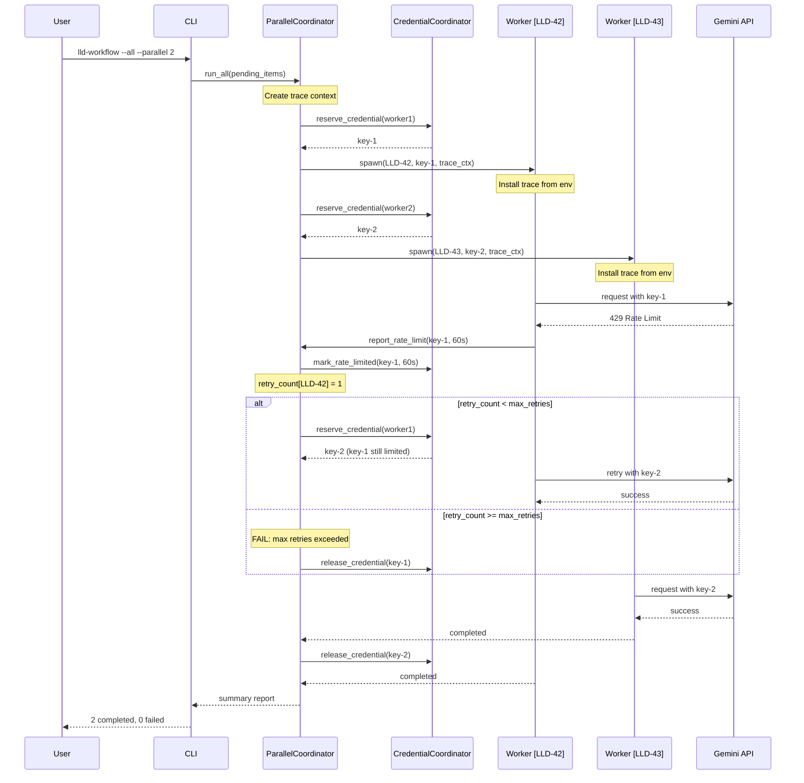

# LLD Finalized

Path: C:\Users\mcwiz\Projects\AgentOS-105-rename\docs\lld\active\LLD-106.md
Status: APPROVED
Reviews: 3

---

# 0XXX - Feature: Parallel Workflow Execution for LLD and Issue Processing

## 1. Context & Goal
* **Issue:** #TBD
* **Objective:** Enable concurrent execution of LLD and Issue workflows with the `--all` flag, solving SQLite contention, credential pool management, and output coordination challenges.
* **Status:** Draft
* **Related Issues:** N/A

### Open Questions
*Questions that need clarification before or during implementation. Remove when resolved.*

- [ ] Should failed workflow checkpoint databases be automatically cleaned up after a configurable retention period?
- [ ] What is the expected behavior if a user runs `--parallel 3` but only 2 items are pending?
- [x] ~~Should rate-limit backoff use exponential backoff or fixed intervals from retry-after headers?~~ **Resolved:** Use retry-after headers when available, exponential backoff as fallback, with max_retries limit.

## 2. Proposed Changes

*This section is the **source of truth** for implementation. Describe exactly what will be built.*

### 2.1 Files Changed

| File | Change Type | Description |
|------|-------------|-------------|
| `src/agentos/workflows/parallel_coordinator.py` | Add | New coordinator managing worker pool, progress tracking, and lifecycle |
| `src/agentos/workflows/credential_coordinator.py` | Add | Thread-safe credential reservation system with rate-limit tracking |
| `src/agentos/workflows/output_prefixer.py` | Add | Stdout/stderr wrapper with prefix injection for workflow identification |
| `src/agentos/workflows/input_sanitizer.py` | Add | Input validation utilities for path-safe identifiers |
| `src/agentos/workflows/trace_propagation.py` | Add | Trace context creation and propagation for observability |
| `src/agentos/workflows/lld_workflow.py` | Modify | Add `--parallel` and `--dry-run` flags, integrate with coordinator |
| `src/agentos/workflows/issue_workflow.py` | Modify | Add `--parallel` and `--dry-run` flags, integrate with coordinator |
| `src/agentos/workflows/checkpoint_manager.py` | Modify | Support dynamic database path via `AGENTOS_WORKFLOW_DB` env var |
| `tests/test_parallel_coordinator.py` | Add | Unit tests for coordinator logic |
| `tests/test_credential_coordinator.py` | Add | Unit tests for credential reservation and rate-limit handling |
| `tests/fixtures/mock_llm_provider.py` | Add | Mock LLM responses for offline testing |

### 2.2 Dependencies

*New packages, APIs, or services required.*

```toml
# pyproject.toml additions (if any)
# No new dependencies - uses stdlib multiprocessing and concurrent.futures
```

### 2.3 Data Structures

```python
# Pseudocode - NOT implementation
from enum import Enum
from typing import TypedDict, Optional
from datetime import datetime
from pathlib import Path

class CredentialStatus(Enum):
    AVAILABLE = "available"
    RESERVED = "reserved"
    RATE_LIMITED = "rate_limited"

class CredentialState(TypedDict):
    key_id: str
    status: CredentialStatus
    reserved_by: Optional[str]  # worker_id
    rate_limit_until: Optional[datetime]
    reservation_time: Optional[datetime]

class WorkflowState(TypedDict):
    workflow_id: str  # e.g., "LLD-42" or "ISSUE-17"
    status: str  # "pending", "running", "completed", "failed", "paused"
    worker_id: Optional[str]
    started_at: Optional[datetime]
    completed_at: Optional[datetime]
    error_message: Optional[str]
    checkpoint_db_path: str

class RetryConfig(TypedDict):
    max_retries: int  # Maximum retry attempts for rate limits (default: 5)
    base_backoff_seconds: int  # Base backoff for exponential retry (default: 10)
    max_backoff_seconds: int  # Maximum backoff cap (default: 300)

class ParallelRunConfig(TypedDict):
    max_parallelism: int  # 1-10
    dry_run: bool
    workflow_type: str  # "lld" or "issue"
    base_dir: Path  # Worktree-scoped base directory (default: ./.agentos/)
    log_dir: Path  # Derived: base_dir/logs/parallel/{timestamp}/
    checkpoint_dir: Path  # Derived: base_dir/checkpoints/
    retry_config: RetryConfig  # Retry limits for rate-limit handling
    worker_timeout_seconds: int  # Timeout for individual worker futures (default: 3600)

class CoordinatorEvent(TypedDict):
    event_type: str  # "workflow_started", "workflow_completed", "credential_exhausted", etc.
    timestamp: datetime
    workflow_id: Optional[str]
    details: dict
```

### 2.4 Function Signatures

```python
# src/agentos/workflows/parallel_coordinator.py

class ParallelCoordinator:
    def __init__(
        self, 
        config: ParallelRunConfig, 
        credential_coordinator: CredentialCoordinator,
        base_dir: Optional[Path] = None  # Defaults to worktree ./.agentos/
    ) -> None:
        """Initialize coordinator with config and credential manager.
        
        Args:
            config: Parallel run configuration
            credential_coordinator: Credential manager instance
            base_dir: Base directory for checkpoints/logs. Defaults to ./.agentos/
                      Can be overridden via AGENTOS_BASE_DIR env var for testing.
        """
        ...
    
    def run_all(self, pending_items: list[str]) -> ParallelRunSummary:
        """Execute all pending items with configured parallelism. Returns summary."""
        ...
    
    def _spawn_worker(self, workflow_id: str, trace_context: dict) -> Future:
        """Spawn a subprocess worker for a single workflow.
        
        Args:
            workflow_id: Sanitized workflow identifier
            trace_context: Dict containing TRACER_PROJECT, TRACER_RUN_ID, 
                          TRACER_PARENT_SPAN_ID for observability propagation
        
        Returns:
            Future with timeout enforcement via worker_timeout_seconds config
        """
        ...
    
    def _wait_for_worker_with_timeout(self, future: Future, workflow_id: str) -> WorkflowResult:
        """Wait for worker future with timeout. Kills worker if exceeded.
        
        Args:
            future: Worker future to wait on
            workflow_id: For logging and cleanup
            
        Returns:
            WorkflowResult with success/failure/timeout status
        """
        ...
    
    def _handle_credential_exhaustion(self) -> None:
        """Pause all workers when credential pool exhausted."""
        ...
    
    def _handle_graceful_shutdown(self, signum: int, frame: Any) -> None:
        """Handle Ctrl+C - checkpoint all workers and exit.
        
        Uses executor.shutdown(wait=False, cancel_futures=True) for edge cases.
        """
        ...
    
    def get_progress(self) -> ProgressState:
        """Return current progress for display."""
        ...


# src/agentos/workflows/credential_coordinator.py

class CredentialCoordinator:
    def __init__(self, credential_pool: CredentialPool) -> None:
        """Wrap existing credential pool with reservation semantics."""
        ...
    
    def reserve_credential(self, worker_id: str) -> Optional[str]:
        """Reserve a credential for worker. Returns key_id or None if exhausted."""
        ...
    
    def release_credential(self, worker_id: str, key_id: str) -> None:
        """Release a credential back to the pool."""
        ...
    
    def report_rate_limit(self, key_id: str, retry_after_seconds: int) -> None:
        """Mark a key as rate-limited with backoff expiry."""
        ...
    
    def get_available_count(self) -> int:
        """Return count of credentials available (not reserved, not rate-limited)."""
        ...
    
    def get_pool_status(self) -> PoolStatus:
        """Return detailed status for all credentials."""
        ...


# src/agentos/workflows/output_prefixer.py

class OutputPrefixer:
    def __init__(self, prefix: str, original_stream: TextIO) -> None:
        """Create prefixer for stdout or stderr."""
        ...
    
    def write(self, text: str) -> int:
        """Write text with prefix, handling partial lines."""
        ...
    
    def flush(self) -> None:
        """Flush the underlying stream."""
        ...


def install_prefixer(workflow_id: str) -> tuple[OutputPrefixer, OutputPrefixer]:
    """Install prefixers for stdout and stderr. Returns originals for restoration."""
    ...


# src/agentos/workflows/input_sanitizer.py

def sanitize_workflow_id(raw_id: str) -> str:
    """Sanitize workflow ID for use in file paths. Raises ValueError if invalid."""
    ...

def is_valid_workflow_id(raw_id: str) -> bool:
    """Check if workflow ID is valid (alphanumeric, underscore, hyphen only)."""
    ...


# src/agentos/workflows/trace_propagation.py

def create_trace_context(parent_run_id: Optional[str] = None) -> dict:
    """Create trace context dict for subprocess propagation.
    
    Returns dict with:
        - TRACER_PROJECT: Current project name
        - TRACER_RUN_ID: New unique run ID for this workflow
        - TRACER_PARENT_SPAN_ID: Parent span for correlation
    """
    ...

def install_trace_context_from_env() -> None:
    """Read trace context from environment and configure tracer in subprocess."""
    ...


# src/agentos/workflows/retry_handler.py

class RetryHandler:
    def __init__(self, config: RetryConfig) -> None:
        """Initialize retry handler with config."""
        ...
    
    def should_retry(self, attempt: int) -> bool:
        """Check if retry should be attempted based on max_retries."""
        ...
    
    def get_backoff_seconds(self, attempt: int, retry_after: Optional[int] = None) -> int:
        """Calculate backoff time. Uses retry_after if available, else exponential."""
        ...
    
    def record_attempt(self, workflow_id: str, key_id: str) -> None:
        """Record a retry attempt for tracking."""
        ...
```

### 2.5 Logic Flow (Pseudocode)

```
PARALLEL COORDINATOR MAIN FLOW:
1. Parse --parallel N and --dry-run flags
2. Discover pending items (LLDs or Issues)
3. IF --dry-run THEN
   - Print list of pending items
   - Exit
4. Resolve base_dir:
   a. Check AGENTOS_BASE_DIR env var (for testing)
   b. Default to {worktree}/.agentos/
5. Create checkpoint_dir and log_dir under base_dir
6. Initialize CredentialCoordinator with existing pool
7. Initialize RetryHandler with config.retry_config
8. Initialize ParallelCoordinator with config
9. Create parent trace context for observability
10. Register signal handler for SIGINT (Ctrl+C)
11. Create ProcessPoolExecutor with max_workers=N
12. Initialize retry_counts dict for tracking per-workflow retries
13. WHILE pending items remain OR workers active:
   a. IF available_credentials > 0 AND pending_items > 0 AND active_workers < N:
      - Pop next pending item
      - Sanitize workflow_id (reject if invalid)
      - Create isolated checkpoint DB path under checkpoint_dir
      - Reserve credential
      - Create child trace context with parent correlation
      - Spawn worker subprocess with env vars (including trace context)
   b. Check for completed futures WITH TIMEOUT (config.worker_timeout_seconds):
      - result = future.result(timeout=config.worker_timeout_seconds)
      - IF timeout exceeded:
         - Kill worker process
         - Log timeout error
         - Increment failure count
         - Release credential
      - IF completed successfully: log, release credential, increment success count
      - IF failed: log error, release credential, increment failure count, retain checkpoint
   c. IF credential pool exhausted (all reserved):
      - Pause spawning, display coordinator message
      - Wait for credential release or rate-limit expiry
   d. IF rate limit reported by worker:
      - Increment retry_counts[workflow_id]
      - IF retry_counts[workflow_id] > config.retry_config.max_retries:
         - Mark workflow as FAILED (max retries exceeded)
         - Log error: "Workflow {id} failed: max retries ({N}) exceeded"
         - Release credential
         - Continue to next workflow
      - ELSE:
         - Mark key as rate-limited in coordinator
         - Calculate backoff via RetryHandler
         - Redistribute work or reduce effective parallelism
   e. Update progress display
14. Cleanup successful checkpoint databases
15. Generate and display summary report
16. Return exit code based on failure count (non-zero if ANY failed)

WORKER SUBPROCESS FLOW:
1. Read AGENTOS_WORKFLOW_DB from environment
2. Read trace context from environment and configure tracer
3. Install output prefixer for workflow_id
4. Initialize checkpoint manager with isolated DB path
5. Initialize local retry_count = 0
6. Execute workflow (existing lld_workflow or issue_workflow logic)
7. ON HTTP 429:
   - Increment local retry_count
   - IF retry_count > max_retries from env:
      - Exit with error code indicating max retries exceeded
   - Extract retry-after header
   - Report to coordinator via IPC (shared queue)
   - Calculate backoff (retry-after or exponential)
   - Wait for backoff period
   - Retry with new credential or same credential after backoff
8. ON completion: write final checkpoint, exit 0
9. ON error: write error checkpoint, exit 1
10. ON SIGTERM: write checkpoint, exit 130

GRACEFUL SHUTDOWN FLOW:
1. SIGINT received
2. Set shutdown flag (shared memory)
3. FOR each active worker:
   - Send SIGTERM to worker subprocess
4. Wait up to 5 seconds for workers to checkpoint
5. IF workers still active after 5 seconds:
   - executor.shutdown(wait=False, cancel_futures=True)
   - Force terminate remaining processes
6. Log final state for each workflow
7. Display shutdown summary
8. Exit with appropriate code
```

### 2.6 Technical Approach

* **Module:** `src/agentos/workflows/`
* **Pattern:** Coordinator/Worker pattern with process isolation
* **Key Decisions:**
  - **ProcessPoolExecutor over ThreadPoolExecutor:** True isolation prevents GIL contention and ensures one workflow crash doesn't affect others
  - **Worktree-scoped storage:** All checkpoints and logs stored under `./.agentos/` in the project worktree, not `~/.agentos/`. This ensures file operations stay within the project scope and tests don't pollute the user's home directory.
  - **AGENTOS_BASE_DIR env var:** Allows test fixtures to inject a temporary directory, ensuring complete test isolation
  - **Environment variable for DB path:** Simple IPC mechanism, no serialization overhead
  - **Trace context propagation:** Explicit passing of trace IDs via environment variables ensures parallel workflows appear as a single coherent trace in LangSmith/OpenTelemetry dashboards
  - **Shared Queue for rate limits:** Workers report rate limits via `multiprocessing.Queue`, coordinator listens and updates state
  - **Prefix-based output:** Simpler than split-pane display, works in all terminals, preserves scrollback
  - **10-worker cap:** Prevents resource exhaustion; most systems can handle 10 subprocesses
  - **Bounded retries:** `max_retries` config (default: 5) prevents infinite retry loops on persistent rate limits or API outages
  - **Worker timeouts:** `worker_timeout_seconds` config (default: 3600) prevents indefinite hangs from worker deadlocks or freezes

## 3. Requirements

*What must be true when this is done. These become acceptance criteria.*

1. `lld-workflow --all --parallel 3` processes 3 LLDs concurrently
2. `issue-workflow --all --parallel` uses default parallelism of 3
3. `lld-workflow --all --dry-run` lists pending LLDs without executing
4. Each workflow uses isolated checkpoint database at `./.agentos/checkpoints/lld_workflow_{issue_number}.db`
5. Issue numbers containing path traversal characters (e.g., `../`, `/`) are rejected with clear error
6. Console output is prefixed with workflow identifier, no interleaving of partial lines
7. Credential exhaustion (all keys reserved) pauses all workflows gracefully with coordinator message
8. HTTP 429 rate limit triggers per-key backoff without crashing workflow
9. Rate-limited keys excluded from available pool until backoff expires
10. Ctrl+C triggers graceful shutdown with checkpointing within 5 seconds
11. Failed workflows don't affect other parallel workflows
12. Summary report shows status of all workflows at completion
13. Per-workflow log files created in `./.agentos/logs/parallel/{timestamp}/`
14. Total execution time for 6 items with `--parallel 3` is less than sum of individual execution times
15. Parallel workflows appear as a single coherent trace in observability dashboards (LangSmith/OpenTelemetry)
16. **Rate limit retries bounded by `max_retries` config (default: 5) to prevent infinite loops**
17. **Worker processes timeout after `worker_timeout_seconds` (default: 3600) to prevent indefinite hangs**
18. **Exit code is non-zero if ANY workflow fails**

## 4. Alternatives Considered

| Option | Pros | Cons | Decision |
|--------|------|------|----------|
| ProcessPoolExecutor | True isolation, crash protection | Higher memory per worker | **Selected** |
| ThreadPoolExecutor | Lower memory, simpler IPC | GIL contention, no crash isolation | Rejected |
| asyncio with aiofiles | Single process, efficient I/O | Complex async conversion, no isolation | Rejected |
| Redis-based coordination | Distributed-ready, robust | External dependency, overkill for single machine | Rejected |
| SQLite WAL mode with retries | Simpler, single DB | Still prone to contention under load | Rejected |
| Home directory storage (~/.agentos) | Central location | Violates worktree scope, pollutes home in tests | Rejected |
| Worktree-scoped storage (./.agentos) | Safe, test-friendly, project-isolated | Requires per-project cleanup | **Selected** |
| Unbounded retries | Simpler logic | Risk of infinite loops, runaway costs | Rejected |
| Bounded retries with max_retries | Predictable termination, cost control | May fail on transient long outages | **Selected** |

**Rationale:** ProcessPoolExecutor provides the strongest isolation guarantees. Each workflow is truly independent - a crash, memory leak, or hanging subprocess doesn't affect others. The memory overhead (~50-100MB per worker) is acceptable for N≤10. Worktree-scoped storage ensures file operations remain within the project and tests can use temporary directories without polluting the user's home. Bounded retries prevent runaway costs and infinite loops while still handling transient rate limits gracefully.

## 5. Data & Fixtures

*Per [0108-lld-pre-implementation-review.md](0108-lld-pre-implementation-review.md) - complete this section BEFORE implementation.*

### 5.1 Data Sources

| Attribute | Value |
|-----------|-------|
| Source | Local filesystem (LLD specs, Issue data from GitHub API cache) |
| Format | YAML (LLD specs), JSON (cached issue data) |
| Size | ~10-50 items typical, max ~100 concurrent |
| Refresh | On-demand via `--all` flag |
| Copyright/License | N/A (user-generated content) |

### 5.2 Data Pipeline

```
Pending Items ──discover──► ParallelCoordinator ──spawn──► Worker Subprocesses
                                    │                            │
                                    ▼                            ▼
                            CredentialPool ◄──reserve/release──► Checkpoint DB
                                    │                            │
                                    ▼                            ▼
                            Progress Queue ◄──status updates───► Log Files
                                                                 (./.agentos/logs/)
```

### 5.3 Test Fixtures

| Fixture | Source | Notes |
|---------|--------|-------|
| Mock LLD specs (5x) | Generated | Synthetic specs with varying complexity |
| Mock issue data (5x) | Generated | Synthetic issues with different states |
| Mock LLM responses | Hardcoded | Deterministic responses for each workflow step |
| Mock credential pool | Generated | Configurable pool size for testing exhaustion |
| Temporary base directory | `pytest.tmp_path` fixture | All test artifacts isolated in temp dir |
| Mock 429 responses | Generated | Configurable retry-after values for retry testing |

### 5.4 Deployment Pipeline

Local development → Integration tests with mocked LLM → Live testing with real credentials → Production use

**Test Data Hygiene:** All tests use `pytest`'s `tmp_path` fixture injected via `AGENTOS_BASE_DIR` environment variable. No test artifacts are written to the user's home directory or the actual worktree.

**If data source is external:** No separate utility needed; existing discovery mechanisms are reused.

## 6. Diagram

### 6.1 Mermaid Quality Gate

Before finalizing any diagram, verify in [Mermaid Live Editor](https://mermaid.live) or GitHub preview:

- [x] **Simplicity:** Similar components collapsed (per 0006 §8.1)
- [x] **No touching:** All elements have visual separation (per 0006 §8.2)
- [x] **No hidden lines:** All arrows fully visible (per 0006 §8.3)
- [x] **Readable:** Labels not truncated, flow direction clear
- [ ] **Auto-inspected:** Agent rendered via mermaid.ink and viewed (per 0006 §8.5)

**Auto-Inspection Results:**
```
- Touching elements: [ ] None / [ ] Found: ___
- Hidden lines: [ ] None / [ ] Found: ___
- Label readability: [ ] Pass / [ ] Issue: ___
- Flow clarity: [ ] Clear / [ ] Issue: ___
```

*Reference: [0006-mermaid-diagrams.md](0006-mermaid-diagrams.md)*

### 6.2 Diagram



## 7. Security Considerations

| Concern | Mitigation | Status |
|---------|------------|--------|
| Path traversal in workflow ID | Sanitize to alphanumeric only via `input_sanitizer.py` | Addressed |
| Credential exposure in logs | Credentials never logged; only key IDs used in logging | Addressed |
| Subprocess command injection | Workflow IDs validated before use in paths/commands | Addressed |
| Log file content exposure | Logs have same permissions as current workflow logs | Addressed |
| Checkpoint database tampering | Databases stored in worktree `.agentos/` with standard permissions | Addressed |
| File operations outside worktree | All file I/O scoped to `./.agentos/` within project worktree | Addressed |

**Fail Mode:** Fail Closed - Invalid workflow IDs rejected with error; no processing occurs for invalid input.

## 8. Performance Considerations

| Metric | Budget | Approach |
|--------|--------|----------|
| Parallelism overhead | < 15% of sequential time | Minimal coordination, async progress updates |
| Memory per worker | < 100MB | Process isolation, no shared state in memory |
| Startup latency | < 2s for all workers | Lazy credential reservation, parallel spawning |
| Shutdown time | < 5s | SIGTERM with timeout, forced kill if needed |
| Worker timeout | 3600s (1 hour) default | Configurable via `worker_timeout_seconds` |
| Retry attempts | 5 max default | Configurable via `max_retries` |

**Bottlenecks:**
- Credential pool size may limit effective parallelism
- Rate limits reduce throughput unpredictably (bounded by max_retries)
- Slow Gemini API responses are the primary time sink (not coordination)
- Worker hangs are bounded by worker_timeout_seconds

## 9. Risks & Mitigations

| Risk | Impact | Likelihood | Mitigation |
|------|--------|------------|------------|
| All credentials rate-limited simultaneously | High | Medium | Graceful pause, clear user messaging, resume from checkpoint, bounded retries |
| Worker subprocess hangs indefinitely | Medium | Low | **worker_timeout_seconds config with forced termination** |
| Checkpoint database corruption | Medium | Low | SQLite PRAGMA integrity_check on resume, option to reset |
| Output interleaving despite prefixer | Low | Medium | Line buffering, atomic writes, worst case is cosmetic |
| Memory exhaustion with N=10 | High | Low | Cap at 10, document resource requirements |
| Trace context not propagating | Medium | Low | Explicit env var passing, validation in worker startup |
| **Infinite retry loop on persistent outage** | High | Medium | **max_retries config (default: 5) enforced in coordinator and worker** |
| **Runaway API costs from retry storms** | High | Low | **Bounded retries + exponential backoff with cap** |

## 10. Verification & Testing

*Ref: [0005-testing-strategy-and-protocols.md](0005-testing-strategy-and-protocols.md)*

**Testing Philosophy:** Strive for 100% automated test coverage. Manual tests are a last resort for scenarios that genuinely cannot be automated.

### 10.1 Test Scenarios

| ID | Scenario | Type | Input | Expected Output | Pass Criteria |
|----|----------|------|-------|-----------------|---------------|
| 010 | Happy path - 3 LLDs parallel | Auto | 3 mock LLDs, --parallel 3 | All 3 complete | 3 success in summary |
| 020 | Dry run lists items | Auto | 5 mock LLDs, --dry-run | List of 5 items | No processing, correct list |
| 030 | Default parallelism is 3 | Auto | --parallel (no N) | 3 workers spawned | Worker count = 3 |
| 040 | Path traversal rejected | Auto | ID = "../../../etc/passwd" | ValueError raised | Clear error message |
| 050 | Credential exhaustion pauses | Auto | 2 credentials, 3 workers | Pause message shown | 3rd worker waits |
| 060 | Rate limit triggers backoff | Auto | Simulated 429 response | Key marked limited | Worker retries with different key |
| 070 | Single workflow failure isolated | Auto | 1 invalid spec, 2 valid | 2 success, 1 failed | Other workflows unaffected |
| 080 | Graceful shutdown checkpoints | Auto | SIGINT during run | Checkpoint files exist | All workers saved state |
| 090 | Output prefixing correct | Auto | 2 concurrent workflows | All lines prefixed | No unprefixed lines |
| 100 | Per-workflow log files created | Auto | 3 LLDs | 3 log files in .agentos/logs/parallel/ | Files exist in tmp_path |
| 110 | Checkpoint cleanup on success | Auto | 3 successful LLDs | No checkpoint DBs remain | DBs deleted post-run |
| 120 | Failed checkpoint retained | Auto | 1 failed LLD | Checkpoint DB exists | DB present for debugging |
| 130 | Performance benchmark | Auto | 6 LLDs, --parallel 3 | Total time < sum of individual times | Time comparison passes |
| 140 | Test isolation via tmp_path | Auto | Any test scenario | Artifacts in tmp_path only | No files in ~ or worktree |
| 150 | Trace context propagation | Auto | Parallel run with tracing | All workers share parent trace | Trace IDs correlate in logs |
| 160 | **Max retries exceeded fails workflow** | Auto | Persistent 429, max_retries=3 | Workflow fails after 3 attempts | Error message mentions max retries |
| 170 | **Worker timeout terminates hung worker** | Auto | Worker that sleeps > timeout | Worker killed, failure logged | Timeout error in summary |
| 180 | **Exit code non-zero on any failure** | Auto | 2 success, 1 failed | Exit code = 1 | Non-zero exit |

### 10.2 Test Commands

```bash
# Run all automated tests
poetry run pytest tests/test_parallel_coordinator.py tests/test_credential_coordinator.py -v

# Run only fast/mocked tests (exclude live)
poetry run pytest tests/test_parallel_coordinator.py -v -m "not live"

# Run live integration tests
poetry run pytest tests/test_parallel_coordinator.py -v -m live

# Run performance benchmark (local only, not CI)
poetry run pytest tests/test_parallel_coordinator.py::test_performance_benchmark -v -m benchmark

# Verify test isolation (should find no artifacts outside tmp dirs)
find ~ -name "*.db" -path "*agentos*" -newer /tmp/test_start_marker 2>/dev/null
```

### 10.3 Manual Tests (Only If Unavoidable)

**N/A - All scenarios automated.** 

The graceful shutdown test (080) uses `signal.SIGINT` programmatically. Output prefixing is verified by capturing stdout in tests. Test isolation (140) verifies no files are written outside the injected `tmp_path`. Worker timeout (170) uses a mock worker that sleeps beyond the configured timeout.

## 11. Definition of Done

### Code
- [ ] `parallel_coordinator.py` implemented and linted
- [ ] `credential_coordinator.py` implemented and linted
- [ ] `output_prefixer.py` implemented and linted
- [ ] `input_sanitizer.py` implemented and linted
- [ ] `trace_propagation.py` implemented and linted
- [ ] `retry_handler.py` implemented and linted
- [ ] `lld_workflow.py` modified with `--parallel` and `--dry-run` flags
- [ ] `issue_workflow.py` modified with `--parallel` and `--dry-run` flags
- [ ] `checkpoint_manager.py` supports `AGENTOS_WORKFLOW_DB` env var
- [ ] All file paths scoped to `./.agentos/` (not `~/.agentos/`)
- [ ] **max_retries enforced in coordinator and worker retry loops**
- [ ] **worker_timeout_seconds enforced when waiting for futures**
- [ ] Code comments reference this LLD

### Tests
- [ ] All 18 test scenarios pass
- [ ] Mock LLM provider fixtures working
- [ ] Performance benchmark passes (total time < sum of individual times)
- [ ] Test isolation verified (scenario 140) - no artifacts in `~` or worktree
- [ ] Trace propagation verified (scenario 150)
- [ ] **Max retries test passes (scenario 160)**
- [ ] **Worker timeout test passes (scenario 170)**
- [ ] **Exit code test passes (scenario 180)**

### Documentation
- [ ] LLD updated with any deviations
- [ ] Implementation Report (0103) completed
- [ ] Test Report (0113) completed
- [ ] Wiki pages updated for lld-workflow and issue-workflow
- [ ] README.md updated with parallel execution examples
- [ ] ADR created for parallel execution architecture
- [ ] Files added to `docs/0003-file-inventory.md`

### Review
- [ ] Code review completed
- [ ] 0809 Security Audit - PASS
- [ ] 0817 Wiki Alignment Audit - PASS
- [ ] User approval before closing issue

---

## Appendix: Review Log

*Track all review feedback with timestamps and implementation status.*

### Gemini Review #1 (REVISE)

**Timestamp:** 2024-XX-XX
**Reviewer:** Gemini
**Verdict:** REVISE

#### Comments

| ID | Comment | Implemented? |
|----|---------|--------------|
| G1.1 | "CRITICAL - Worktree Scope Violation: checkpoint databases and logs in `~/.agentos/` violates strict Worktree Scope requirement" | YES - Changed to `./.agentos/` in worktree |
| G1.2 | "Test Data Hygiene: Scenario 100 implies tests write to `~/.agentos/logs/parallel/`. Tests must never pollute developer's home directory" | YES - Tests use `tmp_path` fixture via `AGENTOS_BASE_DIR` env var |
| G1.3 | "Trace Context Propagation: ProcessPoolExecutor tracers may not automatically propagate to spawned subprocesses" | YES - Added explicit trace context passing via env vars and new `trace_propagation.py` module |
| G1.4 | "Test Isolation: Ensure ParallelCoordinator accepts a `base_dir` config parameter so tests can inject temporary directory fixture" | YES - Added `base_dir` parameter to `ParallelCoordinator.__init__()` and `ParallelRunConfig` |
| G1.5 | "Consider checking `os.cpu_count()` to set sensible default if `--parallel` used without argument" | NOTED - Suggestion captured; current default of 3 is reasonable for MVP |
| G1.6 | "Consider handling `SIGWINCH` signals for terminal resize during prefixer operation" | NOTED - Suggestion captured; cosmetic, deferred to future enhancement |

### Gemini Review #2 (REVISE)

**Timestamp:** 2024-XX-XX
**Reviewer:** Gemini
**Verdict:** REVISE

#### Comments

| ID | Comment | Implemented? |
|----|---------|--------------|
| G2.1 | "BLOCKING - Unbounded Retry Loop: Worker Logic Flow (Step 6) describes handling HTTP 429s but does not define a `max_retries` limit or `global_timeout`. Workers could enter infinite loop." | YES - Added `RetryConfig` with `max_retries` (default: 5), enforced in coordinator and worker logic flows |
| G2.2 | "Missing Worker Timeout: If a worker process hangs internally, Coordinator may hang indefinitely." | YES - Added `worker_timeout_seconds` to `ParallelRunConfig` (default: 3600), enforced via `future.result(timeout=...)` and `_wait_for_worker_with_timeout()` method |
| G2.3 | "Flaky Test Scenario (Scenario 130): '< 50% of sequential time' likely to fail in CI due to CPU contention" | YES - Changed pass criteria to "Total time < Sum of individual times" and marked as `@pytest.mark.benchmark` for local-only execution |
| G2.4 | "Exit Codes: Explicitly define exit code behavior when mixed results occur" | YES - Added requirement #18 "Exit code is non-zero if ANY workflow fails" and test scenario 180 |
| G2.5 | "Process Cleanup: Ensure `_handle_graceful_shutdown` explicitly terminates children" | YES - Added `executor.shutdown(wait=False, cancel_futures=True)` in shutdown flow |

### Review Summary

| Review | Date | Verdict | Key Issue |
|--------|------|---------|-----------|
| Gemini #1 | 2024-XX-XX | REVISE | Worktree scope violation - files written to ~/.agentos/ |
| Gemini #2 | 2024-XX-XX | REVISE | Unbounded retry loop - no max_retries limit |

**Final Status:** PENDING - Awaiting re-review after addressing all Tier 1/2 issues from both reviews