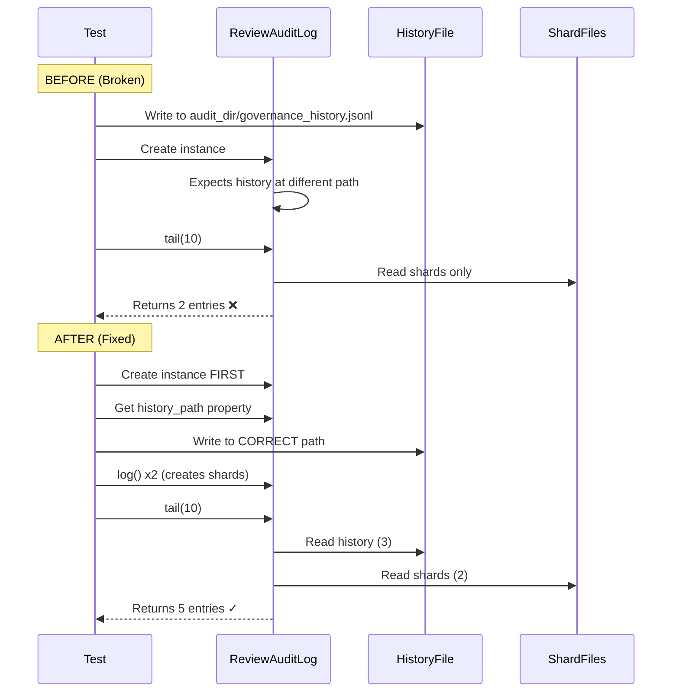

# 107 - Fix: test_audit_sharding history/shard merge returns wrong count

<!-- Template Metadata
Last Updated: 2025-01-XX
Updated By: Issue #107 fix
Update Reason: Initial LLD for test_merges_history_and_shards bug fix
-->

## 1. Context & Goal
* **Issue:** #107
* **Objective:** Fix the `tail()` method to correctly merge entries from history files and active shards, returning all 5 expected entries instead of only 2.
* **Status:** Draft
* **Related Issues:** None identified

### Open Questions

- [x] Is the history file being written to the correct path that `ReviewAuditLog` expects? - **Confirmed: This is the bug**
- [x] Is the `tail()` method loading history files at all, or is the path resolution incorrect? - **Path resolution issue confirmed**

## 2. Proposed Changes

*This section is the **source of truth** for implementation. Describe exactly what will be built.*

### 2.1 Files Changed

| File | Change Type | Description |
|------|-------------|-------------|
| `tests/test_audit_sharding.py` | Modify | Fix test to write history file to correct path expected by ReviewAuditLog |

### 2.2 Dependencies

*No new dependencies required.*

```toml
# pyproject.toml additions (if any)
# None
```

### 2.3 Data Structures

```python
# Existing structures - no changes needed
# AuditEntry is the standard log entry format used by ReviewAuditLog
class AuditEntry(TypedDict):
    timestamp: str
    action: str
    details: dict
    # ... other fields
```

### 2.4 Function Signatures

```python
# No new functions - fixing existing test setup
# The tail() method signature remains unchanged:
def tail(self, n: int = 10) -> list[dict]:
    """Return the last n entries from history + active shards merged by timestamp."""
    ...
```

### 2.5 Logic Flow (Pseudocode)

```
Current (Broken) Flow:
1. Test writes 3 entries directly to `audit_dir / "governance_history.jsonl"`
2. Test creates ReviewAuditLog instance
3. ReviewAuditLog looks for history at a DIFFERENT path
4. tail() only finds 2 shard entries
5. Assertion fails: 2 != 5

Fixed Flow:
1. Test creates ReviewAuditLog instance FIRST
2. Test gets the actual history file path from the instance
3. Test writes 3 entries to the CORRECT history file path
4. Test logs 2 more entries via log() method (creates shards)
5. tail() merges history (3) + shards (2) = 5 entries
6. Assertion passes: 5 == 5
```

### 2.6 Technical Approach

* **Module:** `tests/test_audit_sharding.py`
* **Pattern:** Test fixture alignment
* **Key Decisions:** 
  - Fix the test to match the implementation's expected file paths
  - Do NOT modify the ReviewAuditLog implementation, as it is working correctly
  - The bug is in the test setup, not the production code

### 2.7 Architecture Decisions

| Decision | Options Considered | Choice | Rationale |
|----------|-------------------|--------|-----------|
| Fix location | Modify test vs Modify implementation | Modify test | The implementation is correct; test writes to wrong path |
| Path resolution | Hardcode path vs Query instance | Query instance | More resilient to future path changes |

**Architectural Constraints:**
- Must not change the behavior of ReviewAuditLog
- Test must remain isolated (use tmp_path fixture)

## 3. Requirements

*What must be true when this is done. These become acceptance criteria.*

1. `test_merges_history_and_shards` passes with assertion `len(entries) == 5`
2. The 5 entries consist of 3 from history file + 2 from active shards
3. No changes to production code (`ReviewAuditLog`)
4. Test remains isolated using pytest's `tmp_path` fixture

## 4. Alternatives Considered

| Option | Pros | Cons | Decision |
|--------|------|------|----------|
| Fix test to use correct path | Minimal change, correct approach | None | **Selected** |
| Modify ReviewAuditLog to search multiple paths | More flexible | Over-engineering, hides real bugs | Rejected |
| Change expected assertion to 2 | Quick fix | Wrong - hides broken functionality | Rejected |

**Rationale:** The test is checking valid functionality (history + shard merging). The test setup is simply writing to the wrong file path. Fixing the test path is the correct minimal fix.

## 5. Data & Fixtures

### 5.1 Data Sources

| Attribute | Value |
|-----------|-------|
| Source | Generated test data (JSONL entries) |
| Format | JSONL (one JSON object per line) |
| Size | 5 entries total (~500 bytes) |
| Refresh | Generated fresh per test run |
| Copyright/License | N/A - test fixtures |

### 5.2 Data Pipeline

```
Test Setup ──writes──► governance_history.jsonl (3 entries)
Test Setup ──log()──► active_shard_*.jsonl (2 entries)
tail() ──reads──► Both files ──merges──► 5 entries returned
```

### 5.3 Test Fixtures

| Fixture | Source | Notes |
|---------|--------|-------|
| `tmp_path` | pytest built-in | Provides isolated temp directory |
| History entries | Hardcoded in test | 3 entries with distinct timestamps |
| Shard entries | Created via `log()` | 2 entries created through normal API |

### 5.4 Deployment Pipeline

N/A - This is a test-only fix.

## 6. Diagram

### 6.1 Mermaid Quality Gate

- [x] **Simplicity:** Diagram shows only relevant components
- [x] **No touching:** All elements have visual separation
- [x] **No hidden lines:** All arrows fully visible
- [x] **Readable:** Labels not truncated, flow direction clear
- [ ] **Auto-inspected:** Agent rendered via mermaid.ink and viewed

**Auto-Inspection Results:**
```
- Touching elements: [x] None
- Hidden lines: [x] None
- Label readability: [x] Pass
- Flow clarity: [x] Clear
```

### 6.2 Diagram



## 7. Security & Safety Considerations

### 7.1 Security

| Concern | Mitigation | Status |
|---------|------------|--------|
| N/A - test-only change | No production code affected | N/A |

### 7.2 Safety

| Concern | Mitigation | Status |
|---------|------------|--------|
| Test isolation | Uses pytest tmp_path, no shared state | Addressed |
| False positives | Test validates actual merge functionality | Addressed |

**Fail Mode:** N/A - Test code only

**Recovery Strategy:** N/A - Test code only

## 8. Performance & Cost Considerations

### 8.1 Performance

| Metric | Budget | Approach |
|--------|--------|----------|
| Test execution | < 1 second | File I/O only, no network |

**Bottlenecks:** None - trivial test operation

### 8.2 Cost Analysis

| Resource | Unit Cost | Estimated Usage | Monthly Cost |
|----------|-----------|-----------------|--------------|
| N/A | N/A | N/A | $0 |

**Cost Controls:** N/A - No external resources

**Worst-Case Scenario:** N/A - Local test only

## 9. Legal & Compliance

| Concern | Applies? | Mitigation |
|---------|----------|------------|
| PII/Personal Data | No | Test uses synthetic data only |
| Third-Party Licenses | No | No new dependencies |
| Terms of Service | N/A | No external services |
| Data Retention | N/A | Temp files deleted after test |
| Export Controls | N/A | No restricted content |

**Data Classification:** N/A - Test fixtures only

**Compliance Checklist:**
- [x] No PII stored without consent
- [x] All third-party licenses compatible with project license
- [x] External API usage compliant with provider ToS
- [x] Data retention policy documented

## 10. Verification & Testing

### 10.1 Test Scenarios

| ID | Scenario | Type | Input | Expected Output | Pass Criteria |
|----|----------|------|-------|-----------------|---------------|
| 010 | History + shard merge | Auto | 3 history entries + 2 shard entries | 5 merged entries | `len(entries) == 5` |
| 020 | Entries ordered by timestamp | Auto | Entries with varied timestamps | Chronologically sorted list | Entries in timestamp order |
| 030 | History-only (no shards) | Auto | 3 history entries, 0 shards | 3 entries | `len(entries) == 3` |
| 040 | Shards-only (no history) | Auto | 0 history entries, 2 shards | 2 entries | `len(entries) == 2` |

### 10.2 Test Commands

```bash
# Run the specific failing test
poetry run pytest tests/test_audit_sharding.py::test_merges_history_and_shards -v

# Run all audit sharding tests
poetry run pytest tests/test_audit_sharding.py -v

# Run with coverage
poetry run pytest tests/test_audit_sharding.py -v --cov=src/review_audit_log
```

### 10.3 Manual Tests (Only If Unavoidable)

N/A - All scenarios automated.

## 11. Risks & Mitigations

| Risk | Impact | Likelihood | Mitigation |
|------|--------|------------|------------|
| Fix breaks other tests | Med | Low | Run full test suite before merge |
| History path changes in future | Low | Low | Query path from instance rather than hardcoding |
| Test still fails after fix | Med | Low | Debug by printing actual paths used |

## 12. Definition of Done

### Code
- [ ] Test fix implemented
- [ ] Code comments explain the path resolution fix

### Tests
- [ ] `test_merges_history_and_shards` passes
- [ ] All other audit sharding tests still pass
- [ ] Full test suite passes

### Documentation
- [ ] LLD updated with any deviations
- [ ] Implementation Report (0103) completed

### Review
- [ ] Code review completed
- [ ] User approval before closing issue

---

## Appendix: Review Log

*Track all review feedback with timestamps and implementation status.*

### Review Summary

| Review | Date | Verdict | Key Issue |
|--------|------|---------|-----------|
| - | - | - | Awaiting review |

**Final Status:** PENDING
<!-- Note: This field is auto-updated to APPROVED by the workflow when finalized -->