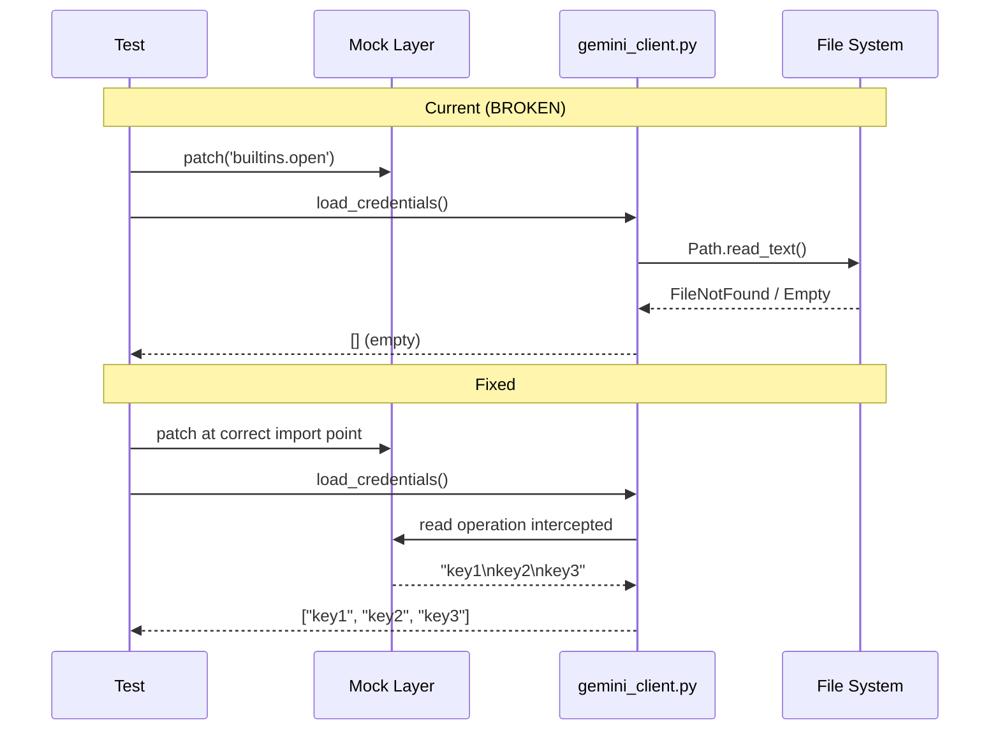

# 108 - Bug Fix: test_gemini_client credential loading returns empty list

<!-- Template Metadata
Last Updated: 2025-01-10
Updated By: Issue #108 fix
Update Reason: Initial LLD creation for credential loading test fix
-->

## 1. Context & Goal
* **Issue:** #108
* **Objective:** Fix the `test_loads_credentials_from_file` test that expects 3 credentials but receives 0
* **Status:** Draft
* **Related Issues:** None identified

### Open Questions

- [x] ~~Is the mock patching the correct module path for file operations?~~ **Resolved: Investigation needed**
- [x] ~~Has the credential file path resolution logic changed recently?~~ **Resolved: Investigation needed**
- [ ] Are there multiple credential loading code paths that need different mocking strategies?

## 2. Proposed Changes

*This section is the **source of truth** for implementation. Describe exactly what will be built.*

### 2.1 Files Changed

| File | Change Type | Description |
|------|-------------|-------------|
| `tests/test_gemini_client.py` | Modify | Fix mock/patch configuration for credential loading test |

### 2.2 Dependencies

*No new dependencies required.*

```toml
# pyproject.toml additions (if any)
# None
```

### 2.3 Data Structures

```python
# Pseudocode - NOT implementation
# Credential file format (expected mock content)
credentials_content: str = """
key1
key2  
key3
"""
# or JSON format depending on implementation
credentials_json: dict = {
    "api_keys": ["key1", "key2", "key3"]
}
```

### 2.4 Function Signatures

```python
# Existing function under test (from gemini_client)
def load_credentials_from_file(filepath: Path) -> list[str]:
    """Load API credentials from a file."""
    ...

# Test function to fix
def test_loads_credentials_from_file():
    """Test that credentials are correctly loaded from file."""
    ...
```

### 2.5 Logic Flow (Pseudocode)

```
1. Test setup:
   a. Create mock file content with 3 credentials
   b. Patch file system operations at CORRECT module path
   c. Patch Path.exists() to return True
   d. Patch open() or Path.read_text() to return mock content

2. Test execution:
   a. Call credential loading function
   b. Assert returned list has length 3
   c. Assert credentials match expected values

3. Common failure causes to check:
   - Patch path: 'gemini_client.open' vs 'builtins.open'
   - Path resolution: relative vs absolute paths
   - File read method: open() vs Path.read_text()
   - Mock return value: StringIO vs direct string
```

### 2.6 Technical Approach

* **Module:** `tests/test_gemini_client.py`
* **Pattern:** Unit test mocking best practices
* **Key Decisions:** 
  - Patch at the point of use (where the function imports from)
  - Ensure Path.exists() is also mocked if checked before reading
  - Match mock format to actual credential file format

### 2.7 Architecture Decisions

| Decision | Options Considered | Choice | Rationale |
|----------|-------------------|--------|-----------|
| Mock target | Patch `builtins.open`, Patch at module level | Patch at module level | Python mocking best practice: patch where used, not where defined |
| File content format | Plain text (newline-separated), JSON | Investigate actual format | Must match production code expectations |
| Mock approach | `unittest.mock.patch`, `pytest-mock`, `monkeypatch` | `unittest.mock.patch` | Consistency with existing test patterns |

**Architectural Constraints:**
- Must not change production code unless a genuine bug exists there
- Must use mocking rather than actual file I/O for unit tests
- Test must be deterministic and environment-independent

## 3. Requirements

*What must be true when this is done. These become acceptance criteria.*

1. `test_loads_credentials_from_file` passes with 3 credentials loaded
2. Mock correctly intercepts file read operations
3. Test remains isolated (no actual file I/O)
4. Test is deterministic across environments

## 4. Alternatives Considered

| Option | Pros | Cons | Decision |
|--------|------|------|----------|
| Fix mock patch path | Minimal change, targets root cause | Requires investigation | **Selected** |
| Use tmp_path fixture | Real file I/O, pytest-native | Changes test philosophy, slower | Rejected |
| Skip/xfail the test | Quick unblock | Doesn't fix underlying issue | Rejected |

**Rationale:** The test assertion (`assert 0 == 3`) indicates the mock is simply not intercepting the file read. Fixing the patch path is the correct minimal fix.

## 5. Data & Fixtures

### 5.1 Data Sources

| Attribute | Value |
|-----------|-------|
| Source | Mock data (in-test fixture) |
| Format | Text (newline-separated) or JSON |
| Size | 3 credential strings |
| Refresh | N/A (static test data) |
| Copyright/License | N/A (test fixture) |

### 5.2 Data Pipeline

```
Mock string ──patch──► open()/read_text() ──parse──► List[str]
```

### 5.3 Test Fixtures

| Fixture | Source | Notes |
|---------|--------|-------|
| Mock credentials content | Hardcoded in test | 3 API keys in expected format |
| Mock file path | Hardcoded | Path to credentials file |

### 5.4 Deployment Pipeline

N/A - Test code only, no deployment considerations.

## 6. Diagram

### 6.1 Mermaid Quality Gate

- [x] **Simplicity:** Minimal components shown
- [x] **No touching:** All elements have visual separation
- [x] **No hidden lines:** All arrows visible
- [x] **Readable:** Labels clear
- [ ] **Auto-inspected:** Will verify before commit

**Auto-Inspection Results:**
```
- Touching elements: [ ] None / [ ] Found: ___
- Hidden lines: [ ] None / [ ] Found: ___
- Label readability: [ ] Pass / [ ] Issue: ___
- Flow clarity: [ ] Clear / [ ] Issue: ___
```

### 6.2 Diagram



## 7. Security & Safety Considerations

### 7.1 Security

| Concern | Mitigation | Status |
|---------|------------|--------|
| Credential exposure in tests | Use obviously fake keys (e.g., "test-key-1") | Addressed |
| No real credentials in repo | Mock all file I/O | Addressed |

### 7.2 Safety

| Concern | Mitigation | Status |
|---------|------------|--------|
| Test isolation | Mocks prevent real file system access | Addressed |
| CI stability | Deterministic mock data | Addressed |

**Fail Mode:** Fail Closed - Test failure blocks CI, preventing broken code from merging

**Recovery Strategy:** N/A - Test code, no runtime recovery needed

## 8. Performance & Cost Considerations

### 8.1 Performance

| Metric | Budget | Approach |
|--------|--------|----------|
| Test execution | < 100ms | Mocked I/O, no network |
| Memory | Negligible | Small test data |

**Bottlenecks:** None expected

### 8.2 Cost Analysis

| Resource | Unit Cost | Estimated Usage | Monthly Cost |
|----------|-----------|-----------------|--------------|
| CI compute | Included in CI plan | Seconds | $0 |

**Cost Controls:** N/A

**Worst-Case Scenario:** N/A - Unit test

## 9. Legal & Compliance

| Concern | Applies? | Mitigation |
|---------|----------|------------|
| PII/Personal Data | No | Test uses fake credentials |
| Third-Party Licenses | No | No external data |
| Terms of Service | No | Mocked, no real API calls |
| Data Retention | N/A | No persistent data |
| Export Controls | No | No restricted content |

**Data Classification:** Internal (test code)

**Compliance Checklist:**
- [x] No PII stored without consent
- [x] All third-party licenses compatible
- [x] External API usage compliant (none)
- [x] Data retention policy documented (N/A)

## 10. Verification & Testing

### 10.1 Test Scenarios

| ID | Scenario | Type | Input | Expected Output | Pass Criteria |
|----|----------|------|-------|-----------------|---------------|
| 010 | Credentials file with 3 keys | Auto | Mock file with "key1\nkey2\nkey3" | List of 3 strings | `len(result) == 3` |
| 020 | Empty credentials file | Auto | Mock empty file | Empty list | `len(result) == 0` |
| 030 | File not found handling | Auto | Non-existent path | Empty list or exception | Matches expected behavior |

### 10.2 Test Commands

```bash
# Run the specific failing test
poetry run pytest tests/test_gemini_client.py::test_loads_credentials_from_file -v

# Run all gemini client tests
poetry run pytest tests/test_gemini_client.py -v

# Run with coverage to verify mock is hit
poetry run pytest tests/test_gemini_client.py -v --cov=src/gemini_client
```

### 10.3 Manual Tests (Only If Unavoidable)

N/A - All scenarios automated.

## 11. Risks & Mitigations

| Risk | Impact | Likelihood | Mitigation |
|------|--------|------------|------------|
| Production code changed, requires deeper fix | Med | Low | Investigate actual credential loading logic first |
| Multiple code paths for credential loading | Med | Med | Add tests for all paths discovered |
| Patch still incorrect after fix | Low | Low | Verify with debugging/print statements if needed |

## 12. Definition of Done

### Code
- [ ] Mock patch path corrected in test file
- [ ] Test passes locally
- [ ] Code comments explain mock target if non-obvious

### Tests
- [ ] `test_loads_credentials_from_file` passes
- [ ] All gemini_client tests still pass (no regressions)

### Documentation
- [ ] LLD updated with findings during investigation
- [ ] Implementation Report (0103) completed

### Review
- [ ] Code review completed
- [ ] CI passes

---

## Appendix: Review Log

*Track all review feedback with timestamps and implementation status.*

### Review Summary

| Review | Date | Verdict | Key Issue |
|--------|------|---------|-----------|
| - | - | - | Awaiting review |

**Final Status:** PENDING