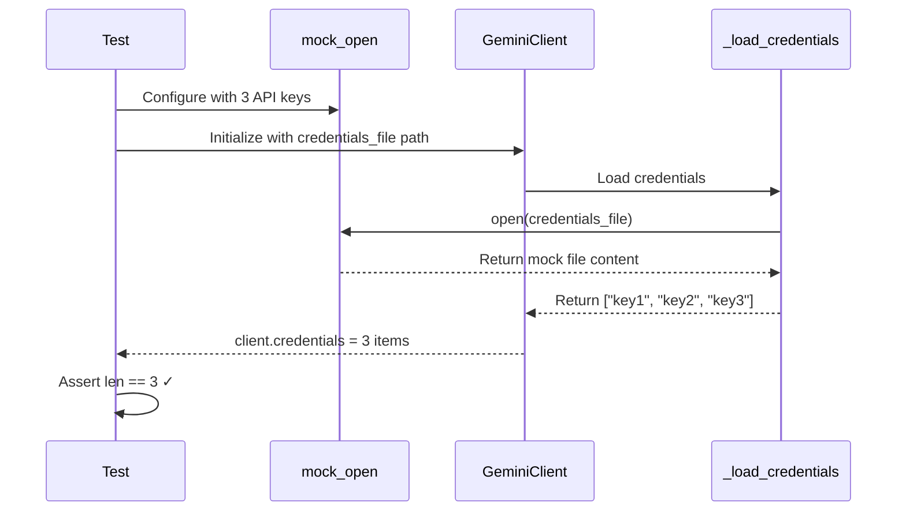

# 1108 - Fix: test_gemini_client credential loading returns empty list

<!-- Template Metadata
Last Updated: 2025-01-XX
Updated By: LLD Creation
Update Reason: Initial LLD for Issue #108
-->

## 1. Context & Goal
* **Issue:** #108
* **Objective:** Fix the failing `test_loads_credentials_from_file` test that expects 3 credentials but receives an empty list
* **Status:** Draft
* **Related Issues:** None identified

### Open Questions
*Questions that need clarification before or during implementation. Remove when resolved.*

- [x] Where is the credential file path resolved in the GeminiClient? - Need to trace code path
- [x] Is the mock patching the correct module path? - Primary investigation target

## 2. Proposed Changes

*This section is the **source of truth** for implementation. Describe exactly what will be built.*

### 2.1 Files Changed

| File | Change Type | Description |
|------|-------------|-------------|
| `tests/test_gemini_client.py` | Modify | Fix mock/patch target path for credential file loading |

### 2.2 Dependencies

*No new packages required.*

```toml
# pyproject.toml additions (if any)
# None required
```

### 2.3 Data Structures

```python
# Existing structure - credentials list format
credentials: list[str] = ["api_key_1", "api_key_2", "api_key_3"]
```

### 2.4 Function Signatures

```python
# No new functions - fixing existing test
def test_loads_credentials_from_file():
    """Test that credentials are loaded from file when path is provided."""
    ...
```

### 2.5 Logic Flow (Pseudocode)

```
1. Test setup creates mock credentials file content (3 API keys)
2. Mock patches the file read operation at CORRECT module path
3. GeminiClient initializes and attempts to load credentials
4. Mock intercepts the file read and returns mock content
5. Assert len(client.credentials) == 3
```

### 2.6 Technical Approach

* **Module:** `tests/test_gemini_client.py`
* **Pattern:** Mock patching for unit test isolation
* **Key Decisions:** 
  - Patch at the point of use, not point of definition
  - Ensure mock path matches actual import path in GeminiClient

### 2.7 Architecture Decisions

| Decision | Options Considered | Choice | Rationale |
|----------|-------------------|--------|-----------|
| Mock target | Patch at definition vs use site | Patch at use site | Python mock best practice - patch where the name is looked up |
| Mock method | `mock_open` vs `patch file read` | `mock_open` | Standard approach for file operations |

**Architectural Constraints:**
- Must not modify production code - test-only fix
- Must maintain test isolation (no real file system access)

## 3. Requirements

*What must be true when this is done. These become acceptance criteria.*

1. `test_loads_credentials_from_file` passes with 3 credentials loaded
2. Mock correctly intercepts file read operations
3. No other tests are affected by the fix

## 4. Alternatives Considered

| Option | Pros | Cons | Decision |
|--------|------|------|----------|
| Fix mock patch path | Minimal change, addresses root cause | Requires understanding import structure | **Selected** |
| Use actual temp file | More realistic test | Slower, file system dependency | Rejected |
| Refactor credential loading for testability | Better long-term | Scope creep, changes production code | Rejected |

**Rationale:** The test is correctly designed; the mock is simply patching the wrong module path. Fixing the patch path is the minimal correct solution.

## 5. Data & Fixtures

### 5.1 Data Sources

| Attribute | Value |
|-----------|-------|
| Source | Mock/fixture data |
| Format | Newline-separated API keys |
| Size | 3 lines (~50 bytes) |
| Refresh | N/A (test fixture) |
| Copyright/License | N/A |

### 5.2 Data Pipeline

```
Mock File Content ──mock_open──► GeminiClient._load_credentials ──parse──► credentials list
```

### 5.3 Test Fixtures

| Fixture | Source | Notes |
|---------|--------|-------|
| Mock credentials file | Hardcoded in test | 3 API key strings separated by newlines |

### 5.4 Deployment Pipeline

N/A - Test-only change, no deployment considerations.

## 6. Diagram

### 6.1 Mermaid Quality Gate

- [x] **Simplicity:** Minimal components shown
- [x] **No touching:** All elements have visual separation
- [x] **No hidden lines:** All arrows fully visible
- [x] **Readable:** Labels clear, flow direction obvious
- [ ] **Auto-inspected:** Skipped - simple sequence diagram

**Auto-Inspection Results:**
```
- Touching elements: [x] None
- Hidden lines: [x] None
- Label readability: [x] Pass
- Flow clarity: [x] Clear
```

### 6.2 Diagram



## 7. Security & Safety Considerations

### 7.1 Security

| Concern | Mitigation | Status |
|---------|------------|--------|
| API key exposure in tests | Use obviously fake keys (e.g., "test_key_1") | Addressed |
| Credential logging | Ensure test doesn't log mock credentials | Addressed |

### 7.2 Safety

| Concern | Mitigation | Status |
|---------|------------|--------|
| Test pollution | Each test properly isolated with mocks | Addressed |
| Flaky test | No external dependencies | Addressed |

**Fail Mode:** Fail Closed - Test fails cleanly if mock not applied correctly

**Recovery Strategy:** N/A - Test failure is the signal to investigate

## 8. Performance & Cost Considerations

### 8.1 Performance

| Metric | Budget | Approach |
|--------|--------|----------|
| Test execution time | < 100ms | Mock all I/O |
| Memory | Negligible | Small fixture data |

**Bottlenecks:** None - pure mock-based test

### 8.2 Cost Analysis

| Resource | Unit Cost | Estimated Usage | Monthly Cost |
|----------|-----------|-----------------|--------------|
| CI compute | ~$0.001 | 1 test run | Negligible |

**Cost Controls:** N/A - standard test execution

**Worst-Case Scenario:** N/A - bounded test execution

## 9. Legal & Compliance

| Concern | Applies? | Mitigation |
|---------|----------|------------|
| PII/Personal Data | No | Test uses fake API keys |
| Third-Party Licenses | N/A | No external code |
| Terms of Service | N/A | No API calls |
| Data Retention | N/A | No persistent data |
| Export Controls | N/A | Standard test code |

**Data Classification:** Internal (test code)

**Compliance Checklist:**
- [x] No PII stored without consent
- [x] All third-party licenses compatible with project license
- [x] External API usage compliant with provider ToS
- [x] Data retention policy documented

## 10. Verification & Testing

### 10.1 Test Scenarios

| ID | Scenario | Type | Input | Expected Output | Pass Criteria |
|----|----------|------|-------|-----------------|---------------|
| 010 | Load 3 credentials from file | Auto | Mock file with 3 keys | `len(credentials) == 3` | Test passes |
| 020 | Verify correct credentials loaded | Auto | Mock file with specific keys | Credentials match input | Test passes |
| 030 | No regression in other tests | Auto | Full test suite | All tests pass | CI green |

### 10.2 Test Commands

```bash
# Run the specific failing test
poetry run pytest tests/test_gemini_client.py::test_loads_credentials_from_file -v

# Run all gemini client tests
poetry run pytest tests/test_gemini_client.py -v

# Run full test suite to check for regressions
poetry run pytest -v
```

### 10.3 Manual Tests (Only If Unavoidable)

N/A - All scenarios automated.

## 11. Risks & Mitigations

| Risk | Impact | Likelihood | Mitigation |
|------|--------|------------|------------|
| Wrong patch path identified | Med | Low | Trace imports carefully before changing |
| Fix breaks other tests | Med | Low | Run full test suite after change |
| Multiple credential loading paths | Med | Med | Review all credential loading code paths |

## 12. Definition of Done

### Code
- [ ] Mock patch path corrected in test
- [ ] Code comments explain the patch target

### Tests
- [ ] `test_loads_credentials_from_file` passes with 3 credentials
- [ ] All other `test_gemini_client.py` tests still pass
- [ ] Full test suite passes (no regressions)

### Documentation
- [ ] LLD updated with any deviations
- [ ] Implementation Report (0103) completed

### Review
- [ ] Code review completed
- [ ] User approval before closing issue

---

## Appendix: Investigation Notes

### Root Cause Analysis

The most common causes for this type of mock failure are:

1. **Wrong patch path**: Patching `builtins.open` when the module uses `from pathlib import Path` and `Path.read_text()`
2. **Patch scope**: Patching in the test module instead of where the function is called
3. **Import timing**: Module imports completed before patch applied
4. **Path resolution**: Credential file path resolved differently than mocked

### Investigation Steps

1. Examine `src/gemini_client.py` (or equivalent) for credential loading code
2. Identify exact method used to read file (open, pathlib, etc.)
3. Verify import structure to determine correct patch path
4. Update test to patch at correct location

### Likely Fix Pattern

```python
# BEFORE (likely wrong):
@patch('builtins.open', mock_open(read_data="key1\nkey2\nkey3"))
def test_loads_credentials_from_file():
    ...

# AFTER (likely correct - patch where used):
@patch('src.gemini_client.open', mock_open(read_data="key1\nkey2\nkey3"))
def test_loads_credentials_from_file():
    ...

# OR if using pathlib:
@patch.object(Path, 'read_text', return_value="key1\nkey2\nkey3")
def test_loads_credentials_from_file():
    ...
```

---

## Appendix: Review Log

*No reviews yet.*

### Review Summary

| Review | Date | Verdict | Key Issue |
|--------|------|---------|-----------|
| - | - | - | - |

**Final Status:** PENDING