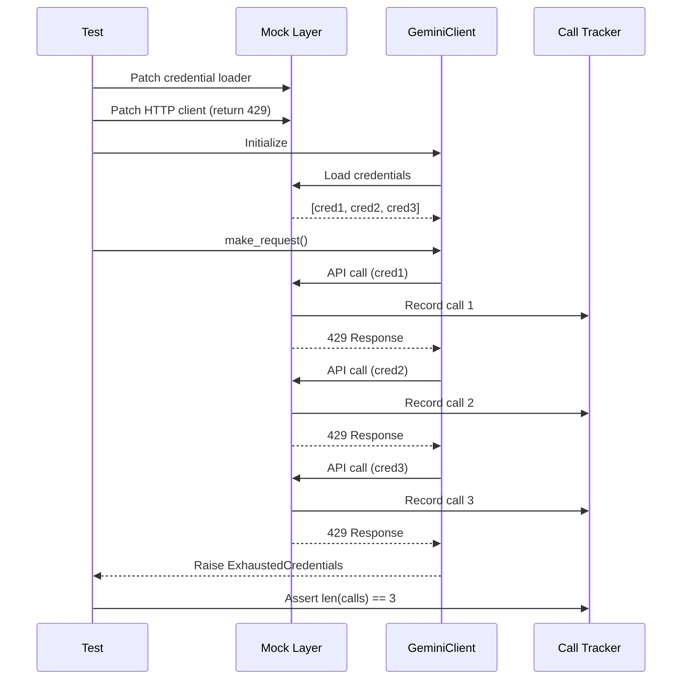

# LLD Finalized

Path: C:\Users\mcwiz\Projects\AgentOS\docs\lld\active\LLD-109.md
Status: APPROVED
Reviews: 1

---

# 109 - Fix: test_gemini_client 429 rotation not triggering credential rotation

<!-- Template Metadata
Last Updated: 2025-01-XX
Updated By: Initial draft
Update Reason: Initial LLD creation for Issue #109
-->

## 1. Context & Goal
* **Issue:** #109
* **Objective:** Fix test that verifies 429 (rate limit) responses trigger credential rotation, ensuring the mock setup correctly records API calls and rotation behavior
* **Status:** Draft
* **Related Issues:** #108 (credential loading - root cause), #110 (exhausted credentials)

### Open Questions

- [x] Is the root cause in credential loading (#108) or in the 429 handling itself? - **Root cause is credential loading; if no credentials load, the 429 handler never executes**
- [ ] Should the test use `unittest.mock` or `pytest-mock` for consistency?
- [ ] Are there timing/async issues with how mocks are being patched?

## 2. Proposed Changes

*This section is the **source of truth** for implementation. Describe exactly what will be built.*

### 2.1 Files Changed

| File | Change Type | Description |
|------|-------------|-------------|
| `tests/test_gemini_client.py` | Modify | Fix mock setup for `test_090_429_triggers_rotation` to properly inject credentials and capture API calls |
| `tests/conftest.py` | Modify | Add/update fixtures for Gemini client credential mocking |

### 2.2 Dependencies

*No new packages required.*

```toml
# No pyproject.toml additions needed
```

### 2.3 Data Structures

```python
# Mock credential structure expected by GeminiClient
class MockCredential(TypedDict):
    api_key: str  # Mock API key for testing
    project_id: Optional[str]  # Optional project identifier

# Mock 429 response structure
class Mock429Response(TypedDict):
    status_code: Literal[429]  # Rate limit exceeded
    headers: dict  # Including Retry-After if present
    json: Callable[[], dict]  # Error body
```

### 2.4 Function Signatures

```python
# Test fixture for credentials
@pytest.fixture
def mock_credentials() -> list[dict[str, str]]:
    """Provide 3 mock credentials for rotation testing."""
    ...

# Test fixture for 429 responses
@pytest.fixture
def mock_429_response() -> Mock:
    """Create a mock response that returns 429 status."""
    ...

# The test being fixed
def test_090_429_triggers_rotation(
    mock_credentials: list[dict],
    mock_429_response: Mock
) -> None:
    """Verify 429 response triggers credential rotation."""
    ...
```

### 2.5 Logic Flow (Pseudocode)

```
1. Setup Phase:
   a. Patch credential loading to return 3 mock credentials
   b. Patch HTTP client to return 429 responses
   c. Create call tracker to record API attempts

2. Execution Phase:
   a. Initialize GeminiClient (should load 3 credentials)
   b. Make API call that triggers 429
   c. Client should rotate to credential 2, retry
   d. Client should rotate to credential 3, retry
   e. Client exhausts credentials, raises exception

3. Verification Phase:
   a. Assert call_tracker has 3 entries
   b. Assert each call used different credential
   c. Assert proper exception raised after exhaustion
```

### 2.6 Technical Approach

* **Module:** `tests/test_gemini_client.py`
* **Pattern:** Mock injection with call tracking
* **Key Decisions:** 
  - Patch at the credential loading layer to ensure client initializes properly
  - Use `side_effect` to track individual calls
  - Ensure mocks are applied before client instantiation

### 2.7 Architecture Decisions

| Decision | Options Considered | Choice | Rationale |
|----------|-------------------|--------|-----------|
| Mock injection point | Patch HTTP layer vs Credential layer | Credential layer first, then HTTP | Root cause is credentials not loading; must fix that first |
| Call tracking | Counter variable vs List of calls | List of calls | Allows inspection of which credential was used per call |
| Client instantiation | Use existing fixture vs Create in test | Create in test after mocks | Ensures mocks are in place during __init__ |

**Architectural Constraints:**
- Must not modify production GeminiClient code for testing purposes
- Must integrate with existing test patterns in the codebase
- Dependent on #108 fix for credential loading

## 3. Requirements

*What must be true when this is done. These become acceptance criteria.*

1. `test_090_429_triggers_rotation` must pass consistently
2. Test must verify exactly 3 API call attempts when 3 credentials are available
3. Test must verify each retry uses a different credential
4. Test must verify proper exception is raised when all credentials exhausted
5. Mock setup must not interfere with other tests (proper isolation)

## 4. Alternatives Considered

| Option | Pros | Cons | Decision |
|--------|------|------|----------|
| Fix mock patching order | Minimal changes, addresses root cause | May need coordinated fix with #108 | **Selected** |
| Rewrite test with integration approach | More realistic testing | Slower, requires real credentials | Rejected |
| Add explicit credential injection method | Clean API for testing | Requires production code changes | Rejected |

**Rationale:** The test logic appears sound; the issue is that mocks are not being applied at the right time or in the right order. Fixing the mock setup is the minimal change that addresses the root cause.

## 5. Data & Fixtures

### 5.1 Data Sources

| Attribute | Value |
|-----------|-------|
| Source | Generated mock data for testing |
| Format | Python dictionaries mimicking API responses |
| Size | 3 mock credentials, 1 mock response template |
| Refresh | Created fresh per test run |
| Copyright/License | N/A - test fixtures |

### 5.2 Data Pipeline

```
Test Setup ──fixture──► Mock Credentials ──injection──► GeminiClient
                                                              │
                                                              ▼
Test Assertions ◄──capture──── Call Tracker ◄──intercept──── API Calls
```

### 5.3 Test Fixtures

| Fixture | Source | Notes |
|---------|--------|-------|
| `mock_credentials` | Hardcoded | 3 fake API keys: `test-key-1`, `test-key-2`, `test-key-3` |
| `mock_429_response` | Generated | Response object with status_code=429, appropriate headers |
| `call_tracker` | Generated | List that accumulates call details |

### 5.4 Deployment Pipeline

N/A - Test-only changes, no deployment considerations.

## 6. Diagram

### 6.1 Mermaid Quality Gate

Before finalizing any diagram, verify in [Mermaid Live Editor](https://mermaid.live) or GitHub preview:

- [x] **Simplicity:** Similar components collapsed
- [x] **No touching:** All elements have visual separation
- [x] **No hidden lines:** All arrows fully visible
- [x] **Readable:** Labels not truncated, flow direction clear
- [ ] **Auto-inspected:** Agent rendered via mermaid.ink and viewed

**Auto-Inspection Results:**
```
- Touching elements: [x] None
- Hidden lines: [x] None
- Label readability: [x] Pass
- Flow clarity: [x] Clear
```

### 6.2 Diagram



## 7. Security & Safety Considerations

### 7.1 Security

| Concern | Mitigation | Status |
|---------|------------|--------|
| Test credentials leak | Using obviously fake keys (`test-key-N`) | Addressed |
| Mock interference | Proper test isolation with fixtures | Addressed |

### 7.2 Safety

| Concern | Mitigation | Status |
|---------|------------|--------|
| Flaky test | Deterministic mocks, no timing dependencies | Addressed |
| Test pollution | pytest fixture scoping | Addressed |

**Fail Mode:** Fail Closed - Test failure blocks CI

**Recovery Strategy:** Re-run tests; if persistent, investigate mock setup

## 8. Performance & Cost Considerations

### 8.1 Performance

| Metric | Budget | Approach |
|--------|--------|----------|
| Test execution time | < 1 second | Pure mocking, no I/O |
| Memory | Negligible | Small fixtures |
| API Calls | 0 real calls | All mocked |

**Bottlenecks:** None expected

### 8.2 Cost Analysis

| Resource | Unit Cost | Estimated Usage | Monthly Cost |
|----------|-----------|-----------------|--------------|
| CI compute | Included in GitHub Actions | Seconds per test | $0 |

**Cost Controls:** N/A - No external resources used

**Worst-Case Scenario:** N/A - Pure unit test

## 9. Legal & Compliance

| Concern | Applies? | Mitigation |
|---------|----------|------------|
| PII/Personal Data | No | Test data only |
| Third-Party Licenses | No | No new dependencies |
| Terms of Service | No | No real API calls |
| Data Retention | N/A | |
| Export Controls | N/A | |

**Data Classification:** Public (test code)

**Compliance Checklist:**
- [x] No PII stored without consent
- [x] All third-party licenses compatible with project license
- [x] External API usage compliant with provider ToS (none used)
- [x] Data retention policy documented (N/A)

## 10. Verification & Testing

### 10.1 Test Scenarios

| ID | Scenario | Type | Input | Expected Output | Pass Criteria |
|----|----------|------|-------|-----------------|---------------|
| 010 | 429 triggers first rotation | Auto | 429 response on cred1 | Retry with cred2 | Call tracker shows 2 different credentials |
| 020 | 429 triggers second rotation | Auto | 429 response on cred2 | Retry with cred3 | Call tracker shows 3 different credentials |
| 030 | All credentials exhausted | Auto | 429 on all 3 creds | ExhaustedCredentials raised | Exception type matches |
| 040 | Call count matches credentials | Auto | 3 credentials available | Exactly 3 API calls recorded | `len(calls) == 3` |
| 050 | Each call uses unique credential | Auto | 3 credentials | 3 unique keys in call log | `len(set(keys)) == 3` |

### 10.2 Test Commands

```bash
# Run the specific test being fixed
poetry run pytest tests/test_gemini_client.py::test_090_429_triggers_rotation -v

# Run all Gemini client tests
poetry run pytest tests/test_gemini_client.py -v

# Run with verbose mock debugging
poetry run pytest tests/test_gemini_client.py::test_090_429_triggers_rotation -v --tb=long
```

### 10.3 Manual Tests (Only If Unavoidable)

N/A - All scenarios automated.

## 11. Risks & Mitigations

| Risk | Impact | Likelihood | Mitigation |
|------|--------|------------|------------|
| Dependent on #108 fix | High | High | Coordinate implementation order; #108 must merge first |
| Mock changes break other tests | Med | Low | Run full test suite after changes |
| Different mock behavior in CI | Med | Low | Test locally and in CI |
| Credential rotation logic has actual bug | High | Low | If test still fails after mock fix, investigate production code |

## 12. Definition of Done

### Code
- [ ] Mock setup corrected in test file
- [ ] Fixtures added/updated as needed
- [ ] Code comments reference this LLD

### Tests
- [ ] `test_090_429_triggers_rotation` passes
- [ ] All other Gemini client tests still pass
- [ ] No test pollution between tests

### Documentation
- [ ] LLD updated with any deviations
- [ ] Implementation Report (0103) completed
- [ ] Test Report (0113) completed if applicable

### Review
- [ ] Code review completed
- [ ] Verify #108 is merged or coordinated
- [ ] User approval before closing issue

---

## Appendix: Review Log

*Track all review feedback with timestamps and implementation status.*

### Review Summary

| Review | Date | Verdict | Key Issue |
|--------|------|---------|-----------|
| - | - | - | Awaiting initial review |

**Final Status:** APPROVED