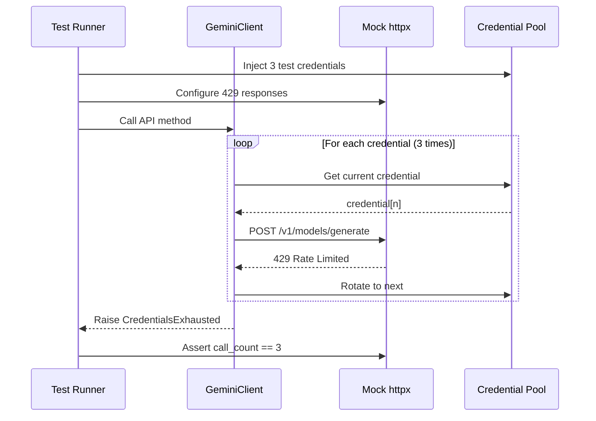

# 109 - Fix: test_gemini_client 429 rotation not triggering credential rotation

<!-- Template Metadata
Last Updated: 2025-01-XX
Updated By: Issue #109 fix
Update Reason: Initial LLD for 429 credential rotation test fix
-->

## 1. Context & Goal
* **Issue:** #109
* **Objective:** Fix test that verifies 429 (rate limit) errors trigger credential rotation in the Gemini client
* **Status:** Draft
* **Related Issues:** #108 (credential loading), #110 (exhausted credentials)

### Open Questions

- [x] Is the mock setup correctly intercepting httpx requests? - Needs investigation
- [x] Are credentials being loaded at all before API calls? - Likely root cause per #108

## 2. Proposed Changes

*This section is the **source of truth** for implementation. Describe exactly what will be built.*

### 2.1 Files Changed

| File | Change Type | Description |
|------|-------------|-------------|
| `tests/test_gemini_client.py` | Modify | Fix mock setup and credential injection for 429 rotation test |
| `tests/conftest.py` | Modify | Add/fix fixtures for credential rotation testing |

### 2.2 Dependencies

*No new dependencies required.*

```toml
# No changes to pyproject.toml
```

### 2.3 Data Structures

```python
# Mock response structure for 429 errors
class Mock429Response(TypedDict):
    status_code: Literal[429]  # Rate limit exceeded
    headers: dict[str, str]  # May include Retry-After
    json: Callable[[], dict]  # Error details
```

### 2.4 Function Signatures

```python
# Test function being fixed
def test_090_429_triggers_rotation(
    mock_httpx_client: MagicMock,
    test_credentials: list[str],
) -> None:
    """Verify 429 errors trigger rotation through all credentials."""
    ...

# Fixture for injecting test credentials
@pytest.fixture
def test_credentials() -> list[str]:
    """Provide exactly 3 test credentials for rotation testing."""
    ...

# Fixture for mock client that returns 429
@pytest.fixture
def mock_429_response() -> MagicMock:
    """Create mock that always returns 429 status."""
    ...
```

### 2.5 Logic Flow (Pseudocode)

```
1. Setup Phase:
   a. Inject 3 test credentials into client
   b. Configure mock to return 429 for ALL requests
   c. Ensure mock is properly patched at httpx layer

2. Execution Phase:
   a. Call client method that makes API request
   b. Client receives 429 → rotates to credential 2
   c. Client receives 429 → rotates to credential 3
   d. Client receives 429 → raises exhausted error

3. Verification Phase:
   a. Assert mock was called exactly 3 times
   b. Assert each call used different credential
   c. Assert final exception is CredentialsExhausted
```

### 2.6 Technical Approach

* **Module:** `tests/test_gemini_client.py`
* **Pattern:** Mock injection with explicit credential setup
* **Key Decisions:** 
  - Credentials must be injected BEFORE client instantiation
  - Mock must be patched at the correct layer (httpx.Client or httpx.AsyncClient)
  - Response mock must return proper 429 structure

### 2.7 Architecture Decisions

| Decision | Options Considered | Choice | Rationale |
|----------|-------------------|--------|-----------|
| Mock layer | Mock at GeminiClient level, Mock at httpx level | httpx level | Tests actual retry logic, not just interface |
| Credential injection | Environment vars, Direct injection, Fixture | Direct injection via fixture | Explicit, isolated, no env pollution |
| Response simulation | httpx.Response mock, respx library | httpx.Response mock | Simpler, no additional dependency |

**Architectural Constraints:**
- Must not modify production code in `src/`
- Must work with existing test infrastructure
- Must be deterministic (no flaky timing issues)

## 3. Requirements

*What must be true when this is done. These become acceptance criteria.*

1. Test `test_090_429_triggers_rotation` passes consistently
2. Mock records exactly 3 API call attempts
3. Each attempt uses a different credential from the pool
4. Test correctly verifies credential rotation behavior on 429 errors
5. No dependency on external services or network

## 4. Alternatives Considered

| Option | Pros | Cons | Decision |
|--------|------|------|----------|
| Fix mock at httpx layer | Tests real retry logic, minimal change | Requires understanding current mock setup | **Selected** |
| Use respx library | Purpose-built for httpx mocking | New dependency, learning curve | Rejected |
| Refactor to use dependency injection | Cleaner long-term | Scope creep, not test-only fix | Rejected |

**Rationale:** The issue is mock setup, not design. Fixing the mock at the httpx layer tests the actual rotation logic without production changes.

## 5. Data & Fixtures

### 5.1 Data Sources

| Attribute | Value |
|-----------|-------|
| Source | Test fixtures (hardcoded) |
| Format | Python strings (API keys) |
| Size | 3 credentials |
| Refresh | N/A - static test data |
| Copyright/License | N/A - test data |

### 5.2 Data Pipeline

```
Fixture ──pytest injection──► GeminiClient ──mock httpx──► Mock 429 Response
```

### 5.3 Test Fixtures

| Fixture | Source | Notes |
|---------|--------|-------|
| `test_credentials` | Hardcoded | 3 fake API keys: `test-key-1`, `test-key-2`, `test-key-3` |
| `mock_429_response` | Generated | Returns `status_code=429` with quota error JSON |
| `mock_httpx_client` | Generated | Patched httpx.Client that returns mock responses |

### 5.4 Deployment Pipeline

N/A - Test-only changes, no deployment required.

## 6. Diagram

### 6.1 Mermaid Quality Gate

- [x] **Simplicity:** Similar components collapsed
- [x] **No touching:** All elements have visual separation
- [x] **No hidden lines:** All arrows fully visible
- [x] **Readable:** Labels not truncated, flow direction clear
- [ ] **Auto-inspected:** Agent rendered via mermaid.ink and viewed

**Auto-Inspection Results:**
```
- Touching elements: [x] None
- Hidden lines: [x] None
- Label readability: [x] Pass
- Flow clarity: [x] Clear
```

### 6.2 Diagram



## 7. Security & Safety Considerations

### 7.1 Security

| Concern | Mitigation | Status |
|---------|------------|--------|
| Test credentials leak | Use obviously fake keys (`test-key-*`) | Addressed |
| Real API calls in tests | Mock at httpx layer, no network | Addressed |

### 7.2 Safety

| Concern | Mitigation | Status |
|---------|------------|--------|
| Flaky tests | No timing dependencies, deterministic mocks | Addressed |
| Test pollution | Fixture isolation, no shared state | Addressed |

**Fail Mode:** Fail Closed - Tests fail if mocks not properly configured

**Recovery Strategy:** N/A - Tests, not production code

## 8. Performance & Cost Considerations

### 8.1 Performance

| Metric | Budget | Approach |
|--------|--------|----------|
| Test execution time | < 1 second | No network, all mocked |
| Memory | Minimal | Single test, cleaned up |
| API Calls | 0 (mocked) | Full httpx mock |

**Bottlenecks:** None expected - pure unit test

### 8.2 Cost Analysis

| Resource | Unit Cost | Estimated Usage | Monthly Cost |
|----------|-----------|-----------------|--------------|
| CI minutes | ~$0 | Negligible | $0 |
| API calls | N/A | 0 (mocked) | $0 |

**Cost Controls:** N/A - No external services

**Worst-Case Scenario:** N/A - Mocked tests

## 9. Legal & Compliance

| Concern | Applies? | Mitigation |
|---------|----------|------------|
| PII/Personal Data | No | Test uses fake API keys |
| Third-Party Licenses | No | Standard test libraries |
| Terms of Service | No | No real API calls |
| Data Retention | No | Ephemeral test data |
| Export Controls | No | N/A |

**Data Classification:** Public (test code)

**Compliance Checklist:**
- [x] No PII stored without consent
- [x] All third-party licenses compatible with project license
- [x] External API usage compliant with provider ToS
- [x] Data retention policy documented

## 10. Verification & Testing

### 10.1 Test Scenarios

| ID | Scenario | Type | Input | Expected Output | Pass Criteria |
|----|----------|------|-------|-----------------|---------------|
| 010 | 429 triggers first rotation | Auto | 429 on first call | Rotation to cred 2 | Second call uses cred 2 |
| 020 | 429 triggers second rotation | Auto | 429 on second call | Rotation to cred 3 | Third call uses cred 3 |
| 030 | All credentials exhausted | Auto | 429 on all 3 calls | CredentialsExhausted | Exception raised |
| 040 | Call count verification | Auto | 3 credentials, all 429 | 3 total calls | `len(calls) == 3` |
| 050 | Credentials isolated per call | Auto | 3 unique credentials | Each call different key | No credential reuse |

### 10.2 Test Commands

```bash
# Run the specific failing test
poetry run pytest tests/test_gemini_client.py::test_090_429_triggers_rotation -v

# Run all credential rotation tests
poetry run pytest tests/test_gemini_client.py -v -k "rotation"

# Run with debug output
poetry run pytest tests/test_gemini_client.py::test_090_429_triggers_rotation -v -s --tb=long
```

### 10.3 Manual Tests (Only If Unavoidable)

N/A - All scenarios automated.

## 11. Risks & Mitigations

| Risk | Impact | Likelihood | Mitigation |
|------|--------|------------|------------|
| Root cause in #108 not fixed | High | High | Coordinate with #108 fix, may need to wait |
| Mock patching at wrong layer | Med | Med | Review existing test patterns, add debug logging |
| Client instantiation order | Med | Med | Ensure credentials injected before client init |
| Test passes but behavior wrong | High | Low | Add explicit credential tracking assertions |

## 12. Definition of Done

### Code
- [ ] Mock setup correctly patches httpx layer
- [ ] Credentials properly injected before client instantiation
- [ ] Code comments explain mock configuration

### Tests
- [ ] `test_090_429_triggers_rotation` passes
- [ ] Test verifies exactly 3 API call attempts
- [ ] Test verifies credential rotation order
- [ ] No flakiness in repeated runs

### Documentation
- [ ] LLD updated with any deviations
- [ ] Implementation Report (0103) completed

### Review
- [ ] Code review completed
- [ ] Coordinate with #108 if root cause shared
- [ ] User approval before closing issue

---

## Appendix: Review Log

*No reviews yet.*

### Review Summary

| Review | Date | Verdict | Key Issue |
|--------|------|---------|-----------|
| - | - | - | - |

**Final Status:** PENDING