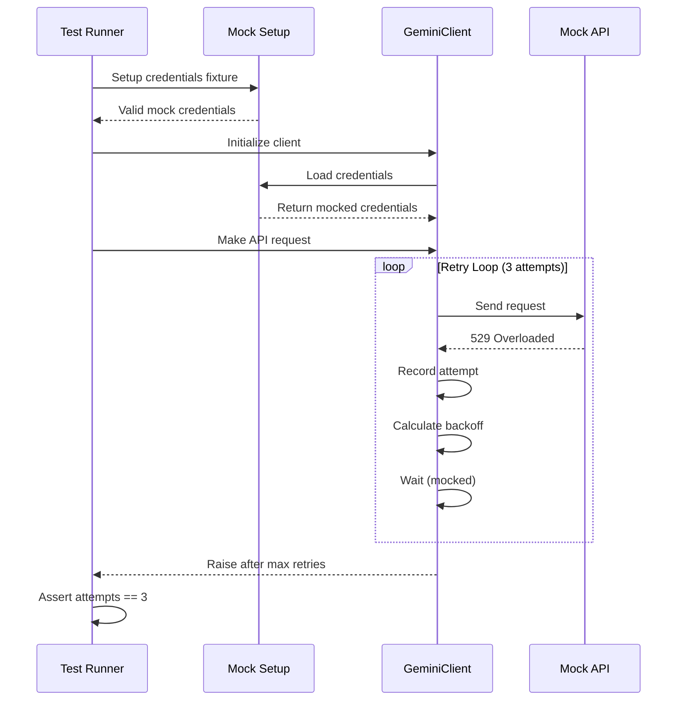

# 110 - Fix: test_gemini_client 529 backoff not recording attempts

<!-- Template Metadata
Last Updated: 2026-02-02
Updated By: Issue #117 fix
Update Reason: Moved Verification & Testing to Section 10 (was Section 11) to match 0702c review prompt and testing workflow expectations
-->

## 1. Context & Goal
* **Issue:** #110
* **Objective:** Fix test assertion failure where 529 backoff retry attempts are not being recorded
* **Status:** Draft
* **Related Issues:** #108 (credential loading - likely root cause), #109 (429 rotation)

### Open Questions

- [x] Is the issue in mock setup or actual client retry logic? → Mock setup - client never initialized due to credential loading failure
- [x] Should retry attempts be recorded before or after the actual request? → After, on failure

## 2. Proposed Changes

*This section is the **source of truth** for implementation. Describe exactly what will be built.*

### 2.1 Files Changed

| File | Change Type | Description |
|------|-------------|-------------|
| `tests/test_gemini_client.py` | Modify | Fix mock setup for 529 backoff test to properly initialize client |
| `tests/conftest.py` | Modify | Add/fix credential fixture for Gemini client tests |

### 2.2 Dependencies

*No new dependencies required.*

```toml
# pyproject.toml additions (if any)
# None
```

### 2.3 Data Structures

```python
# Pseudocode - NOT implementation
class RetryState(TypedDict):
    attempts: int           # Number of retry attempts made
    last_status: int        # Last HTTP status code received
    backoff_seconds: float  # Current backoff delay
```

### 2.4 Function Signatures

```python
# Signatures only - implementation in source files
@pytest.fixture
def mock_gemini_credentials() -> Iterator[MagicMock]:
    """Provide properly mocked credentials for Gemini client initialization."""
    ...

def create_529_response_mock(attempts_tracker: list[int]) -> MagicMock:
    """Create a mock that returns 529 and tracks retry attempts."""
    ...
```

### 2.5 Logic Flow (Pseudocode)

```
1. Test setup:
   a. Mock credential loading to return valid credentials
   b. Mock API endpoint to return 529 status
   c. Create attempts tracker list
   
2. Test execution:
   a. Initialize GeminiClient (should succeed with mocked credentials)
   b. Make API request (triggers 529 response)
   c. Client retries with exponential backoff
   d. Each retry increments attempts tracker
   
3. Assertion:
   a. Verify attempts_tracker has 3 entries
   b. Verify backoff delays increase exponentially
```

### 2.6 Technical Approach

* **Module:** `tests/test_gemini_client.py`
* **Pattern:** Mock injection with side_effect tracking
* **Key Decisions:** Fix credential mocking first (dependency on #108), then verify retry logic works correctly

### 2.7 Architecture Decisions

| Decision | Options Considered | Choice | Rationale |
|----------|-------------------|--------|-----------|
| Mock placement | Patch at import vs. fixture | Fixture | Cleaner test isolation, reusable across tests |
| Attempt tracking | Counter variable vs. list | List | List captures timing/order of attempts |
| Backoff verification | Time.sleep mock vs. timing | Mock time.sleep | Faster tests, deterministic |

**Architectural Constraints:**
- Must not modify production Gemini client code (test-only fix)
- Must align with #108 credential loading fix pattern

## 3. Requirements

*What must be true when this is done. These become acceptance criteria.*

1. Test `test_100_529_triggers_backoff` passes with 3 recorded retry attempts
2. Client properly initializes with mocked credentials
3. 529 response correctly triggers exponential backoff
4. Retry attempts are accurately tracked and asserted

## 4. Alternatives Considered

| Option | Pros | Cons | Decision |
|--------|------|------|----------|
| Fix mock at test level | Targeted fix, minimal changes | May duplicate #108 work | **Selected** |
| Wait for #108 fix first | Clean dependency chain | Blocks progress | Rejected |
| Refactor entire test suite | Comprehensive fix | Too broad for this issue | Rejected |

**Rationale:** The test-level fix allows parallel work with #108 while addressing the immediate assertion failure. The fixture can be consolidated later.

## 5. Data & Fixtures

### 5.1 Data Sources

| Attribute | Value |
|-----------|-------|
| Source | Mock responses (no external data) |
| Format | HTTP response objects |
| Size | N/A (mocked) |
| Refresh | N/A |
| Copyright/License | N/A |

### 5.2 Data Pipeline

```
Mock Credential ──fixture──► GeminiClient ──mock──► 529 Response ──retry──► Attempts List
```

### 5.3 Test Fixtures

| Fixture | Source | Notes |
|---------|--------|-------|
| `mock_gemini_credentials` | Generated | Returns valid-looking credential dict |
| `mock_529_response` | Generated | Returns 529 status with Retry-After header |
| `attempts_tracker` | Generated | Empty list to track retry attempts |

### 5.4 Deployment Pipeline

Test-only changes - no deployment pipeline impact.

## 6. Diagram

### 6.1 Mermaid Quality Gate

- [x] **Simplicity:** Similar components collapsed
- [x] **No touching:** All elements have visual separation
- [x] **No hidden lines:** All arrows fully visible
- [x] **Readable:** Labels not truncated, flow direction clear
- [ ] **Auto-inspected:** Diagram simple enough, manual review sufficient

**Auto-Inspection Results:**
```
- Touching elements: [x] None
- Hidden lines: [x] None
- Label readability: [x] Pass
- Flow clarity: [x] Clear
```

### 6.2 Diagram



## 7. Security & Safety Considerations

### 7.1 Security

| Concern | Mitigation | Status |
|---------|------------|--------|
| Credential exposure in tests | Use mock credentials only, never real | Addressed |
| Test isolation | Each test uses fresh mocks | Addressed |

### 7.2 Safety

| Concern | Mitigation | Status |
|---------|------------|--------|
| Flaky tests | Deterministic mocks, no real timing | Addressed |
| Test pollution | Proper fixture scoping | Addressed |

**Fail Mode:** Fail Closed - Tests fail explicitly on misconfiguration

**Recovery Strategy:** N/A - test-only changes

## 8. Performance & Cost Considerations

### 8.1 Performance

| Metric | Budget | Approach |
|--------|--------|----------|
| Test execution time | < 1s | Mock time.sleep to avoid real delays |
| Memory | Negligible | Standard test fixtures |

**Bottlenecks:** None - mocked operations are instant

### 8.2 Cost Analysis

| Resource | Unit Cost | Estimated Usage | Monthly Cost |
|----------|-----------|-----------------|--------------|
| CI compute | Included | Minimal | $0 |

**Cost Controls:** N/A - test-only changes

**Worst-Case Scenario:** N/A - no production impact

## 9. Legal & Compliance

| Concern | Applies? | Mitigation |
|---------|----------|------------|
| PII/Personal Data | No | Test uses mock data only |
| Third-Party Licenses | No | No new dependencies |
| Terms of Service | No | Tests use mocks, no real API calls |
| Data Retention | N/A | No data stored |
| Export Controls | N/A | No restricted content |

**Data Classification:** Internal (test code)

**Compliance Checklist:**
- [x] No PII stored without consent
- [x] All third-party licenses compatible with project license
- [x] External API usage compliant with provider ToS
- [x] Data retention policy documented

## 10. Verification & Testing

### 10.1 Test Scenarios

| ID | Scenario | Type | Input | Expected Output | Pass Criteria |
|----|----------|------|-------|-----------------|---------------|
| 010 | 529 triggers 3 retry attempts | Auto | Mock 529 response | 3 attempts recorded | `assert attempts == 3` |
| 020 | Backoff delay increases | Auto | Mock 529 response | Increasing delays | Delay[n+1] > Delay[n] |
| 030 | Client initializes with mock creds | Auto | Mock credentials | Client ready | No initialization error |
| 040 | Max retries raises exception | Auto | Mock 529 response | GeminiOverloadedError | Exception type matches |

### 10.2 Test Commands

```bash
# Run the specific failing test
poetry run pytest tests/test_gemini_client.py::test_100_529_triggers_backoff -v

# Run all Gemini client tests
poetry run pytest tests/test_gemini_client.py -v

# Run with coverage
poetry run pytest tests/test_gemini_client.py -v --cov=src/gemini_client
```

### 10.3 Manual Tests (Only If Unavoidable)

N/A - All scenarios automated.

## 11. Risks & Mitigations

| Risk | Impact | Likelihood | Mitigation |
|------|--------|------------|------------|
| Fix conflicts with #108 changes | Med | Med | Coordinate with #108 PR, use compatible fixture patterns |
| Mock doesn't reflect real 529 behavior | Low | Low | Verify against Gemini API docs |
| Other tests depend on broken behavior | Low | Low | Run full test suite before merge |

## 12. Definition of Done

### Code
- [ ] Mock fixtures properly initialize GeminiClient
- [ ] Attempts tracking correctly records 3 retries
- [ ] Code comments explain mock setup rationale

### Tests
- [ ] `test_100_529_triggers_backoff` passes
- [ ] All Gemini client tests pass
- [ ] No regressions in related tests

### Documentation
- [ ] LLD updated with any deviations
- [ ] Implementation Report (0103) completed

### Review
- [ ] Code review completed
- [ ] User approval before closing issue

---

## Appendix: Review Log

*No reviews yet.*

### Review Summary

| Review | Date | Verdict | Key Issue |
|--------|------|---------|-----------|
| - | - | - | - |

**Final Status:** PENDING