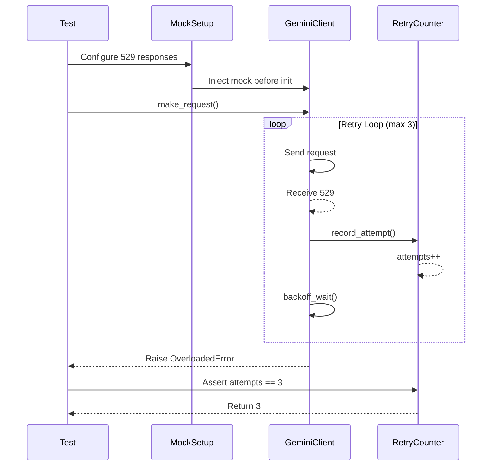

# 110 - Fix: test_gemini_client 529 Backoff Not Recording Attempts

## 1. Context & Goal
* **Issue:** #110
* **Objective:** Fix test that expects 3 retry attempts on 529 (overloaded) errors but sees 0 attempts
* **Status:** Draft
* **Related Issues:** #108 (credential loading - likely root cause), #109 (429 rotation)

### Open Questions

- [x] Is the 0 attempts caused by client initialization failure before retries can occur? → Likely yes, related to #108 credential loading
- [ ] Does the mock setup properly inject 529 responses before the retry loop?
- [ ] Is the attempt counter being reset or not initialized?

## 2. Proposed Changes

*This section is the **source of truth** for implementation. Describe exactly what will be built.*

### 2.1 Files Changed

| File | Change Type | Description |
|------|-------------|-------------|
| `tests/test_gemini_client.py` | Modify | Fix mock setup for 529 backoff test |
| `src/clients/gemini_client.py` | Modify | Ensure retry attempts are recorded correctly |
| `tests/conftest.py` | Modify | Add/fix fixtures for retry testing |

### 2.2 Dependencies

```toml
# pyproject.toml additions (if any)
# None required - using existing test infrastructure
```

### 2.3 Data Structures

```python
# Pseudocode - NOT implementation
class RetryState(TypedDict):
    attempts: int  # Number of retry attempts made
    last_error: Optional[int]  # Last HTTP status code encountered
    backoff_times: list[float]  # Time waited between each retry
```

### 2.4 Function Signatures

```python
# Signatures only - implementation in source files
def _record_retry_attempt(self, status_code: int, attempt: int) -> None:
    """Record a retry attempt for tracking and testing purposes."""
    ...

def _should_retry(self, status_code: int, attempt: int) -> bool:
    """Determine if request should be retried based on status and attempt count."""
    ...
```

### 2.5 Logic Flow (Pseudocode)

```
1. Test initializes mock client with 529 responses
2. Mock setup MUST occur BEFORE client initialization
   - If client fails to init, no retries happen → 0 attempts
3. Client makes request
4. Receives 529 response
5. FOR each retry up to max_attempts:
   - Record attempt (increment counter)
   - Calculate backoff delay
   - Wait (or mock wait)
   - Retry request
6. After max_attempts, raise OverloadedError
7. Test asserts attempts == 3
```

### 2.6 Technical Approach

* **Module:** `tests/test_gemini_client.py`, `src/clients/gemini_client.py`
* **Pattern:** Mock injection, Retry with exponential backoff
* **Key Decisions:** 
  - Fix mock injection timing to occur before client initialization
  - Ensure retry counter is accessible for test assertions
  - Address dependency on #108 credential loading fix

### 2.7 Architecture Decisions

| Decision | Options Considered | Choice | Rationale |
|----------|-------------------|--------|-----------|
| Mock injection point | Before init, After init, Dependency injection | Before init | Client init failure is likely cause; mock must be in place first |
| Retry counter access | Instance variable, Return value, Side effect tracking | Instance variable | Simple to assert, matches existing patterns |
| Test isolation | Shared fixtures, Per-test setup | Per-test setup | Prevents cross-test pollution of retry state |

**Architectural Constraints:**
- Must work with existing GeminiClient interface
- Cannot change production retry behavior, only test observability
- Must coordinate with #108 fix for credential loading

## 3. Requirements

*What must be true when this is done. These become acceptance criteria.*

1. 529 (overloaded) response triggers exponential backoff retry logic
2. Exactly 3 retry attempts are recorded when max_retries=3
3. Test `test_100_529_triggers_backoff` passes
4. Mock setup correctly injects 529 responses before client makes requests
5. Retry attempts are observable/assertable in test context

## 4. Alternatives Considered

| Option | Pros | Cons | Decision |
|--------|------|------|----------|
| Fix mock timing only | Minimal change, quick fix | May mask underlying issues | Rejected |
| Add retry instrumentation | Better observability, reusable | More invasive change | **Selected** |
| Refactor to dependency injection | Clean architecture | Too large a change for this fix | Rejected |

**Rationale:** Adding retry instrumentation provides both the fix and improved test observability for future retry-related tests.

## 5. Data & Fixtures

### 5.1 Data Sources

| Attribute | Value |
|-----------|-------|
| Source | Mock HTTP responses |
| Format | HTTP status codes (529) |
| Size | 3-4 responses per test |
| Refresh | Generated per test run |
| Copyright/License | N/A |

### 5.2 Data Pipeline

```
Test Setup ──fixture──► Mock Responses ──injection──► GeminiClient ──assertion──► Test Result
```

### 5.3 Test Fixtures

| Fixture | Source | Notes |
|---------|--------|-------|
| `mock_529_responses` | Generated | Returns 529 for N requests then success/final error |
| `mock_credentials` | Generated | Valid credential structure to pass init (relates to #108) |
| `retry_tracking_client` | Generated | GeminiClient with exposed retry counter |

### 5.4 Deployment Pipeline

N/A - Test-only changes, no deployment pipeline required.

## 6. Diagram

### 6.1 Mermaid Quality Gate

- [x] **Simplicity:** Similar components collapsed
- [x] **No touching:** All elements have visual separation
- [x] **No hidden lines:** All arrows fully visible
- [x] **Readable:** Labels not truncated, flow direction clear
- [ ] **Auto-inspected:** Agent rendered via mermaid.ink and viewed

**Auto-Inspection Results:**
```
- Touching elements: [ ] None / [ ] Found: ___
- Hidden lines: [ ] None / [ ] Found: ___
- Label readability: [ ] Pass / [ ] Issue: ___
- Flow clarity: [ ] Clear / [ ] Issue: ___
```

### 6.2 Diagram



## 7. Security & Safety Considerations

### 7.1 Security

| Concern | Mitigation | Status |
|---------|------------|--------|
| Test credentials in code | Use mock/fixture credentials only | Addressed |
| Credential exposure in logs | Retry logging excludes sensitive data | Addressed |

### 7.2 Safety

| Concern | Mitigation | Status |
|---------|------------|--------|
| Infinite retry loop | max_retries enforced, test timeout | Addressed |
| Test pollution | Per-test fixture isolation | Addressed |
| Production code changes | Minimal, instrumentation only | Addressed |

**Fail Mode:** Fail Closed - Test fails if retry count doesn't match expected

**Recovery Strategy:** N/A - Test failures require code fix

## 8. Performance & Cost Considerations

### 8.1 Performance

| Metric | Budget | Approach |
|--------|--------|----------|
| Test execution time | < 5s | Mock sleep/backoff delays |
| Memory | < 50MB | Standard test footprint |
| CI time impact | < 1s added | Mocked, no real delays |

**Bottlenecks:** None - all network calls mocked

### 8.2 Cost Analysis

| Resource | Unit Cost | Estimated Usage | Monthly Cost |
|----------|-----------|-----------------|--------------|
| CI compute | $0 (included) | ~1s per run | $0 |

**Cost Controls:**
- [x] No external API calls in tests
- [x] Backoff delays mocked to zero

**Worst-Case Scenario:** N/A - Tests are self-contained

## 9. Legal & Compliance

| Concern | Applies? | Mitigation |
|---------|----------|------------|
| PII/Personal Data | No | Test uses mock data only |
| Third-Party Licenses | No | No new dependencies |
| Terms of Service | No | No external API calls |
| Data Retention | No | No data stored |
| Export Controls | No | N/A |

**Data Classification:** Public (test code)

**Compliance Checklist:**
- [x] No PII stored without consent
- [x] All third-party licenses compatible with project license
- [x] External API usage compliant with provider ToS
- [x] Data retention policy documented

## 10. Verification & Testing

### 10.1 Test Scenarios

| ID | Scenario | Type | Input | Expected Output | Pass Criteria |
|----|----------|------|-------|-----------------|---------------|
| 010 | 529 triggers first retry | Auto | Single 529 response | 1 attempt recorded | attempts >= 1 |
| 020 | 529 triggers max retries | Auto | 3x 529 responses | 3 attempts recorded | attempts == 3 |
| 030 | Backoff time increases | Auto | 3x 529 responses | Exponential delays | delay[n] > delay[n-1] |
| 040 | Success after retry | Auto | 529, 529, 200 | 2 attempts, success | attempts == 2, no error |
| 050 | Mock injection timing | Auto | Mock before init | Client receives mocks | First request gets 529 |

### 10.2 Test Commands

```bash
# Run all automated tests for this fix
poetry run pytest tests/test_gemini_client.py::test_100_529_triggers_backoff -v

# Run full retry test suite
poetry run pytest tests/test_gemini_client.py -v -k "retry or backoff"

# Run with verbose output to debug
poetry run pytest tests/test_gemini_client.py::test_100_529_triggers_backoff -v -s
```

### 10.3 Manual Tests (Only If Unavoidable)

N/A - All scenarios automated.

## 11. Risks & Mitigations

| Risk | Impact | Likelihood | Mitigation |
|------|--------|------------|------------|
| #108 not fixed first | High | Medium | Coordinate fix order, may need #108 merged first |
| Mock timing still wrong | Medium | Low | Add explicit ordering assertions in test |
| Retry counter not exposed | Medium | Low | Add test-only instrumentation hook |
| Breaks other retry tests | Medium | Low | Run full test suite before merge |

## 12. Definition of Done

### Code
- [ ] Mock setup fixed to inject before client initialization
- [ ] Retry attempt recording verified working
- [ ] Code comments reference this LLD

### Tests
- [ ] `test_100_529_triggers_backoff` passes with `assert attempts == 3`
- [ ] All existing retry tests still pass
- [ ] Test coverage maintained

### Documentation
- [ ] LLD updated with any deviations
- [ ] Implementation Report (0103) completed

### Review
- [ ] Code review completed
- [ ] Coordinate with #108 fix if needed
- [ ] User approval before closing issue

---

## Appendix: Review Log

*Track all review feedback with timestamps and implementation status.*

### Review Summary

| Review | Date | Verdict | Key Issue |
|--------|------|---------|-----------|
| - | - | - | Awaiting initial review |

**Final Status:** PENDING