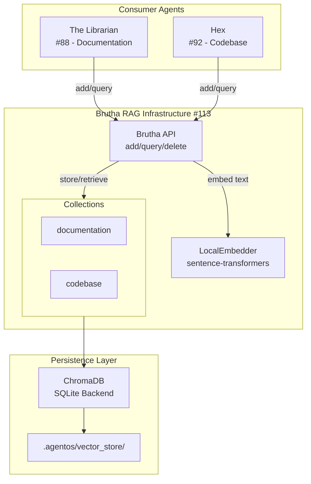
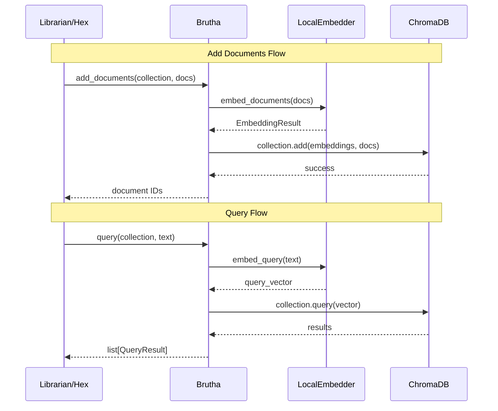

# 113 - Feature: Brutha Vector Database Infrastructure (RAG Foundation)

<!-- Template Metadata
Last Updated: 2025-01-13
Updated By: LLD Creation
Update Reason: Initial LLD for vector database infrastructure
-->

## 1. Context & Goal
* **Issue:** #113
* **Objective:** Implement shared vector database infrastructure with local embeddings that serves as the RAG foundation for documentation (The Librarian #88) and codebase (Hex #92) retrieval.
* **Status:** Draft
* **Related Issues:** #88 (The Librarian - depends on this), #92 (Hex - depends on this)

### Open Questions

- [x] ChromaDB vs. alternatives (LanceDB, Qdrant) - **Decision: ChromaDB** for maturity and ecosystem
- [ ] Embedding model selection - all-MiniLM-L6-v2 vs. all-mpnet-base-v2?
- [ ] Collection naming convention - domain-based or persona-based?
- [ ] Persistence location - `.agentos/vector_store/` or configurable?

## 2. Proposed Changes

*This section is the **source of truth** for implementation. Describes exactly what will be built.*

### 2.1 Files Changed

| File | Change Type | Description |
|------|-------------|-------------|
| `src/agentos/rag/__init__.py` | Add | Package initialization, exports public API |
| `src/agentos/rag/brutha.py` | Add | Core Brutha class - vector store manager |
| `src/agentos/rag/embeddings.py` | Add | Local embedding model wrapper |
| `src/agentos/rag/collections.py` | Add | Collection management and configuration |
| `src/agentos/rag/config.py` | Add | Configuration dataclasses |
| `tests/unit/test_brutha.py` | Add | Unit tests for Brutha infrastructure |
| `tests/integration/test_rag_integration.py` | Add | Integration tests with real embeddings |

### 2.2 Dependencies

*New packages, APIs, or services required.*

```toml
# pyproject.toml additions
chromadb = "^0.4.22"
sentence-transformers = "^2.2.2"
```

**Note:** `sentence-transformers` pulls in PyTorch. Consider `onnxruntime` backend for lighter footprint if needed.

### 2.3 Data Structures

```python
# Pseudocode - NOT implementation

class CollectionConfig(TypedDict):
    name: str              # Collection identifier (e.g., "documentation", "codebase")
    embedding_model: str   # Model name from sentence-transformers
    distance_metric: str   # "cosine" | "l2" | "ip"
    metadata_schema: dict  # Expected metadata fields

class QueryResult(TypedDict):
    id: str                # Document ID
    content: str           # Original text content
    metadata: dict         # Associated metadata
    distance: float        # Distance/similarity score
    collection: str        # Source collection name

class BruthaConfig(TypedDict):
    persist_directory: Path       # Where to store ChromaDB data
    default_embedding_model: str  # Default model for new collections
    default_distance_metric: str  # Default distance metric
    max_batch_size: int           # Max documents per batch operation

class EmbeddingResult(TypedDict):
    embeddings: list[list[float]]  # Vector embeddings
    model: str                      # Model used
    dimension: int                  # Embedding dimension
```

### 2.4 Function Signatures

```python
# Signatures only - implementation in source files

# brutha.py
class Brutha:
    """Vector database manager - the memory that never forgets."""
    
    def __init__(self, config: BruthaConfig | None = None) -> None:
        """Initialize Brutha with optional configuration."""
        ...
    
    def get_or_create_collection(
        self, 
        name: str, 
        config: CollectionConfig | None = None
    ) -> Collection:
        """Get existing collection or create new one."""
        ...
    
    def add_documents(
        self,
        collection: str,
        documents: list[str],
        metadatas: list[dict] | None = None,
        ids: list[str] | None = None
    ) -> list[str]:
        """Add documents to a collection. Returns document IDs."""
        ...
    
    def query(
        self,
        collection: str,
        query_text: str,
        n_results: int = 5,
        where: dict | None = None,
        where_document: dict | None = None
    ) -> list[QueryResult]:
        """Query a collection with natural language."""
        ...
    
    def delete_documents(
        self,
        collection: str,
        ids: list[str] | None = None,
        where: dict | None = None
    ) -> int:
        """Delete documents by ID or filter. Returns count deleted."""
        ...
    
    def get_collection_stats(self, collection: str) -> dict:
        """Get statistics about a collection."""
        ...
    
    def list_collections(self) -> list[str]:
        """List all available collections."""
        ...
    
    def reset_collection(self, collection: str) -> None:
        """Clear all documents from a collection."""
        ...
    
    @property
    def is_initialized(self) -> bool:
        """Check if vector store is properly initialized."""
        ...

# embeddings.py
class LocalEmbedder:
    """Local embedding model wrapper - no data egress."""
    
    def __init__(self, model_name: str = "all-MiniLM-L6-v2") -> None:
        """Initialize with specified model."""
        ...
    
    def embed_documents(self, texts: list[str]) -> EmbeddingResult:
        """Generate embeddings for multiple documents."""
        ...
    
    def embed_query(self, text: str) -> list[float]:
        """Generate embedding for a single query."""
        ...
    
    @property
    def dimension(self) -> int:
        """Return embedding dimension for current model."""
        ...

# collections.py
PREDEFINED_COLLECTIONS: dict[str, CollectionConfig] = {
    "documentation": CollectionConfig(...),
    "codebase": CollectionConfig(...),
}

def get_collection_config(name: str) -> CollectionConfig:
    """Get predefined or default collection configuration."""
    ...
```

### 2.5 Logic Flow (Pseudocode)

```
INITIALIZATION:
1. Load config from environment/defaults
2. Set persist_directory to .agentos/vector_store/
3. Initialize ChromaDB client with persistence
4. Load embedding model lazily (on first use)

ADD DOCUMENTS:
1. Validate inputs (documents not empty, IDs unique)
2. Get or create target collection
3. Generate embeddings locally via LocalEmbedder
4. Batch documents if exceeding max_batch_size
5. FOR each batch:
   - Call collection.add() with embeddings, docs, metadata
6. Return list of document IDs

QUERY:
1. Validate collection exists
2. IF collection not initialized:
   - Return empty results (graceful degradation)
3. Generate query embedding locally
4. Call collection.query() with:
   - query_embeddings
   - n_results
   - where filters
5. Transform ChromaDB results to QueryResult format
6. Return sorted by relevance

GRACEFUL DEGRADATION:
1. IF vector store fails to initialize:
   - Log warning
   - Set is_initialized = False
2. IF query on uninitialized store:
   - Return empty list (not error)
3. IF collection doesn't exist:
   - Return empty list (not error)
```

### 2.6 Technical Approach

* **Module:** `src/agentos/rag/`
* **Pattern:** Repository pattern - Brutha wraps ChromaDB, providing domain-specific interface
* **Key Decisions:**
  - Local embeddings only - sentence-transformers runs on CPU, no API calls
  - Collection-per-domain - keeps concerns separated, enables domain-specific tuning
  - Lazy initialization - embedding model loads on first use, not import
  - Graceful degradation - consumers get empty results, not exceptions

### 2.7 Architecture Decisions

| Decision | Options Considered | Choice | Rationale |
|----------|-------------------|--------|-----------|
| Vector Store | ChromaDB, LanceDB, Qdrant, FAISS | ChromaDB | Mature, Pythonic API, built-in persistence, good for local use |
| Embedding Model | OpenAI API, Cohere, sentence-transformers | sentence-transformers (local) | No data egress requirement, free, runs offline |
| Specific Model | all-MiniLM-L6-v2, all-mpnet-base-v2 | all-MiniLM-L6-v2 | Smaller (80MB), faster, good quality for retrieval |
| Persistence | In-memory, SQLite, DuckDB | SQLite (ChromaDB default) | Persistence across sessions, good for single-user |
| Collection Strategy | Single collection, Per-domain, Per-persona | Per-domain | Clear separation, can have different schemas |

**Architectural Constraints:**
- Must be fully local - no external API calls for embeddings
- Must integrate with Librarian (#88) and Hex (#92) as consumers
- Must persist data in `.agentos/` directory structure
- Must handle missing/uninitialized state gracefully

## 3. Requirements

*What must be true when this is done. These become acceptance criteria.*

1. Vector store initializes automatically on first use with sensible defaults
2. Multiple named collections supported (at minimum: `documentation`, `codebase`)
3. All embedding generation happens locally via sentence-transformers
4. The Librarian (#88) can store and query documentation in `documentation` collection
5. Hex (#92) can store and query code in `codebase` collection
6. Graceful degradation: queries return empty results when store not initialized
7. Data persists in `.agentos/vector_store/` across sessions
8. No PII or sensitive data transmitted externally

## 4. Alternatives Considered

| Option | Pros | Cons | Decision |
|--------|------|------|----------|
| ChromaDB | Pythonic, built-in persistence, active community | Heavier than FAISS | **Selected** |
| LanceDB | Very fast, Lance format | Newer, less mature API | Rejected |
| FAISS | Facebook-backed, extremely fast | No built-in persistence, complex API | Rejected |
| Qdrant | Production-ready, rich filtering | Overkill for local use, needs separate server | Rejected |
| OpenAI Embeddings | High quality | Requires API key, data egress, cost | Rejected |
| all-mpnet-base-v2 | Higher quality embeddings | 420MB vs 80MB, slower | Rejected (for default) |

**Rationale:** ChromaDB provides the best balance of ease-of-use, persistence, and Python-native API. Local embeddings via sentence-transformers meet the no-data-egress requirement while maintaining quality.

## 5. Data & Fixtures

### 5.1 Data Sources

| Attribute | Value |
|-----------|-------|
| Source | Documents provided by consumers (Librarian, Hex) |
| Format | Plain text strings with optional metadata dicts |
| Size | Varies - expected 100s to 10,000s of documents |
| Refresh | On-demand via consumer agents |
| Copyright/License | N/A - infrastructure only, content is caller's responsibility |

### 5.2 Data Pipeline

```
Consumer (Librarian/Hex) 
    ──add_documents()──► 
        Brutha 
            ──embed()──► 
                LocalEmbedder (sentence-transformers)
                    ──vectors──► 
                        ChromaDB (SQLite persistence)
```

### 5.3 Test Fixtures

| Fixture | Source | Notes |
|---------|--------|-------|
| Sample documents | Hardcoded strings | Generic technical content |
| Sample queries | Hardcoded strings | Match sample documents |
| Mock embeddings | Generated deterministically | For unit tests without model |
| Model fixture | Downloaded on first test run | Cached in CI |

### 5.4 Deployment Pipeline

- **Dev:** Vector store in `.agentos/vector_store/` (gitignored)
- **Test:** Ephemeral in-memory store or temp directory
- **Production:** Same as dev - local persistence

## 6. Diagram

### 6.1 Mermaid Quality Gate

- [x] **Simplicity:** Components collapsed appropriately
- [x] **No touching:** All elements have visual separation
- [x] **No hidden lines:** All arrows fully visible
- [x] **Readable:** Labels not truncated, flow direction clear
- [ ] **Auto-inspected:** Agent rendered via mermaid.ink and viewed

**Auto-Inspection Results:**
```
- Touching elements: [ ] None / [ ] Found: ___
- Hidden lines: [ ] None / [ ] Found: ___
- Label readability: [ ] Pass / [ ] Issue: ___
- Flow clarity: [ ] Clear / [ ] Issue: ___
```

### 6.2 Diagram





## 7. Security & Safety Considerations

### 7.1 Security

| Concern | Mitigation | Status |
|---------|------------|--------|
| Data egress via embeddings | All embeddings local, no API calls | Addressed |
| Injection via metadata | Metadata keys/values sanitized | TODO |
| Path traversal in persist_directory | Validate path is under project root | TODO |
| Model download security | sentence-transformers uses HuggingFace CDN with checksums | Addressed |

### 7.2 Safety

| Concern | Mitigation | Status |
|---------|------------|--------|
| Vector store corruption | ChromaDB handles atomic writes | Addressed |
| Disk space exhaustion | Log warnings at configurable thresholds | TODO |
| Memory exhaustion from large batches | max_batch_size configuration, default 500 | Addressed |
| Model download failure | Graceful error with clear message | TODO |

**Fail Mode:** Fail Closed - queries return empty results rather than raising exceptions or proceeding without RAG

**Recovery Strategy:** 
- Corrupted store: Delete `.agentos/vector_store/` and rebuild from source documents
- Failed initialization: Clear error message, consumers proceed without RAG

## 8. Performance & Cost Considerations

### 8.1 Performance

| Metric | Budget | Approach |
|--------|--------|----------|
| First query latency | < 5s (includes model load) | Lazy load, then cached |
| Subsequent query latency | < 500ms | Model stays in memory |
| Embedding throughput | > 100 docs/sec | Batch processing |
| Memory footprint | < 500MB | MiniLM model is ~80MB + ChromaDB overhead |

**Bottlenecks:**
- First embedding generation loads model (~2-3s)
- Large batch inserts limited by embedding generation speed
- ChromaDB query performance degrades past ~100k documents

### 8.2 Cost Analysis

| Resource | Unit Cost | Estimated Usage | Monthly Cost |
|----------|-----------|-----------------|--------------|
| CPU compute | Local | Background process | $0 |
| Disk storage | Local | ~1GB for 100k docs | $0 |
| Model download | One-time | ~80MB | $0 |
| API calls | None | 0 | $0 |

**Cost Controls:**
- [x] No external API dependencies
- [x] All compute is local
- [ ] Disk usage monitoring (future)

**Worst-Case Scenario:** User indexes 1M documents - disk usage grows to ~10GB, query latency increases. Mitigate with collection size warnings.

## 9. Legal & Compliance

| Concern | Applies? | Mitigation |
|---------|----------|------------|
| PII/Personal Data | N/A | Infrastructure only - content is caller's responsibility |
| Third-Party Licenses | Yes | ChromaDB (Apache 2.0), sentence-transformers (Apache 2.0) - compatible |
| Terms of Service | N/A | No external services |
| Data Retention | N/A | User controls - can delete collections |
| Export Controls | No | No restricted algorithms |

**Data Classification:** Internal - all data stays local

**Compliance Checklist:**
- [x] No PII handling at infrastructure level
- [x] All third-party licenses Apache 2.0 compatible
- [x] No external API usage
- [x] User controls data retention via collection management

## 10. Verification & Testing

### 10.0 Test Plan (TDD - Complete Before Implementation)

**TDD Requirement:** Tests MUST be written and failing BEFORE implementation begins.

| Test ID | Test Description | Expected Behavior | Status |
|---------|------------------|-------------------|--------|
| T010 | test_brutha_initialization | Creates ChromaDB client and persist dir | RED |
| T020 | test_create_collection | Creates new named collection | RED |
| T030 | test_add_documents | Adds documents and returns IDs | RED |
| T040 | test_query_returns_results | Query returns relevant documents | RED |
| T050 | test_query_empty_collection | Returns empty list, not error | RED |
| T060 | test_query_nonexistent_collection | Returns empty list, not error | RED |
| T070 | test_delete_documents | Removes documents by ID | RED |
| T080 | test_local_embedder_no_network | Embeddings generated without network | RED |
| T090 | test_persistence_across_sessions | Data survives Brutha recreation | RED |
| T100 | test_multiple_collections | Different collections isolated | RED |

**Coverage Target:** ≥95% for all new code

**TDD Checklist:**
- [ ] All tests written before implementation
- [ ] Tests currently RED (failing)
- [ ] Test IDs match scenario IDs in 10.1
- [ ] Test file created at: `tests/unit/test_brutha.py`

### 10.1 Test Scenarios

| ID | Scenario | Type | Input | Expected Output | Pass Criteria |
|----|----------|------|-------|-----------------|---------------|
| 010 | Initialize Brutha | Auto | Default config | Brutha instance with is_initialized=True | Client created, persist dir exists |
| 020 | Create collection | Auto | name="test" | Collection object | Collection in list_collections() |
| 030 | Add single document | Auto | doc="Hello world", collection="test" | ["id-0"] | Document retrievable |
| 040 | Add batch documents | Auto | 100 documents | 100 IDs | All documents queryable |
| 050 | Query with results | Auto | query="hello", n=3 | 3 QueryResults | Results sorted by relevance |
| 060 | Query empty collection | Auto | query on empty collection | [] | No exception raised |
| 070 | Query nonexistent collection | Auto | query on "fake" | [] | No exception raised |
| 080 | Delete by ID | Auto | delete id="doc-1" | 1 | Document not in subsequent query |
| 090 | Delete by filter | Auto | where={"source": "test"} | N | Matching docs removed |
| 100 | Persistence test | Auto | Add docs, recreate Brutha | Same docs returned | Count matches |
| 110 | Multiple collections | Auto | Add to "a" and "b" | Isolated results | Query "a" doesn't return "b" docs |
| 120 | Local embedding verification | Auto-Live | Disconnect network, embed | Embeddings generated | No network error |
| 130 | Large batch handling | Auto | 1000 documents | All indexed | Under 30s |

### 10.2 Test Commands

```bash
# Run all automated tests
poetry run pytest tests/unit/test_brutha.py -v

# Run only fast/mocked tests (exclude live)
poetry run pytest tests/unit/test_brutha.py -v -m "not live"

# Run integration tests with real embeddings
poetry run pytest tests/integration/test_rag_integration.py -v -m live

# Run with coverage
poetry run pytest tests/unit/test_brutha.py --cov=src/agentos/rag --cov-report=term-missing
```

### 10.3 Manual Tests (Only If Unavoidable)

**N/A - All scenarios automated.**

## 11. Risks & Mitigations

| Risk | Impact | Likelihood | Mitigation |
|------|--------|------------|------------|
| sentence-transformers model download fails | High | Low | Clear error message, offline mode docs |
| ChromaDB breaking changes | Med | Low | Pin version, monitor releases |
| Disk space exhaustion | Med | Low | Logging warnings, documentation |
| Memory pressure from model | Med | Med | Document requirements, lazy loading |
| Query performance at scale | Low | Med | Document limits, future sharding |

## 12. Definition of Done

### Code
- [ ] Implementation complete and linted
- [ ] Code comments reference this LLD

### Tests
- [ ] All test scenarios pass
- [ ] Test coverage ≥95%

### Documentation
- [ ] LLD updated with any deviations
- [ ] Implementation Report (0103) completed
- [ ] Docstrings on all public methods

### Review
- [ ] Code review completed
- [ ] User approval before closing issue

---

## Appendix: Review Log

*Track all review feedback with timestamps and implementation status.*

### Review Summary

| Review | Date | Verdict | Key Issue |
|--------|------|---------|-----------|
| - | - | - | Awaiting first review |

**Final Status:** PENDING