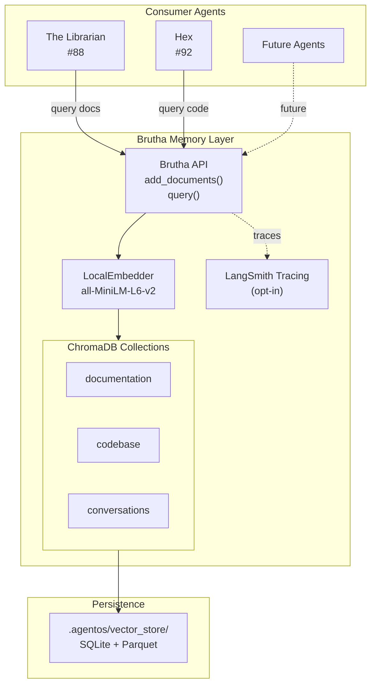
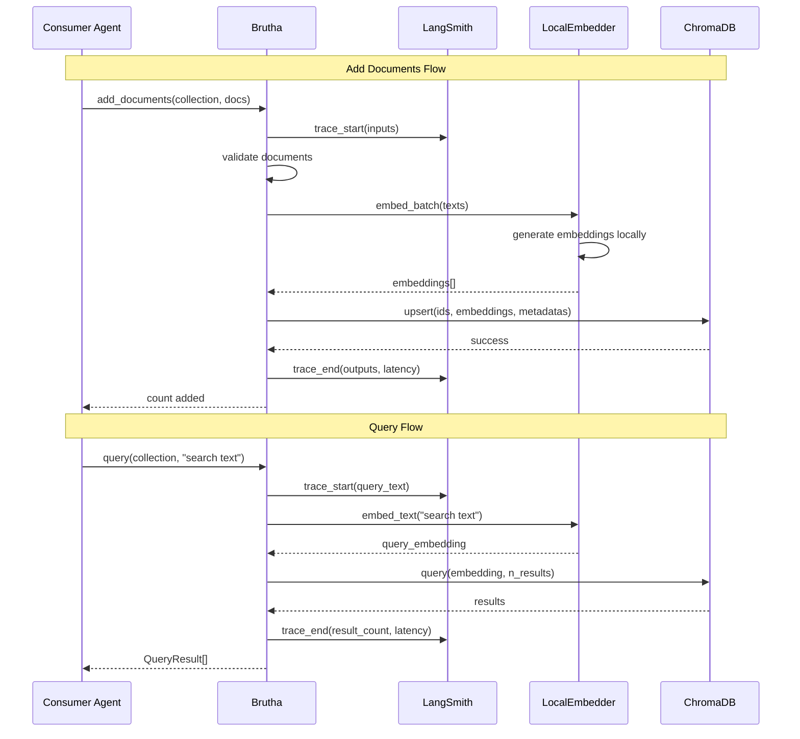

# LLD Finalized

Path: C:\Users\mcwiz\Projects\AgentOS\docs\lld\active\LLD-113.md
Status: APPROVED
Reviews: 2

---

# 113 - Feature: Brutha - Vector Database Infrastructure (RAG Foundation)

<!-- Template Metadata
Last Updated: 2025-01-XX
Updated By: Initial creation + Gemini Review #1 revisions
Update Reason: Address Tier 1 (ChromaDB telemetry) and Tier 2 (observability) issues
-->

## 1. Context & Goal
* **Issue:** #113
* **Objective:** Implement foundational RAG infrastructure with ChromaDB and local embeddings that serves as the shared memory layer for The Librarian (#88) and Hex (#92).
* **Status:** Draft
* **Related Issues:** #88 (The Librarian - documentation retrieval), #92 (Hex - codebase retrieval)

### Open Questions

- [x] Should we use ChromaDB or an alternative like Qdrant/FAISS? → ChromaDB selected for simplicity and Python-native API
- [x] Which embedding model to use? → `all-MiniLM-L6-v2` for balance of quality and speed
- [ ] Should collections be auto-created or explicit? → Leaning toward explicit for safety
- [ ] Maximum chunk size for documents? → Considering 512 tokens default

## 2. Proposed Changes

*This section is the **source of truth** for implementation. Describe exactly what will be built.*

### 2.1 Files Changed

| File | Change Type | Description |
|------|-------------|-------------|
| `src/agentos/memory/__init__.py` | Add | Module initialization with public exports |
| `src/agentos/memory/brutha.py` | Add | Core vector store manager class |
| `src/agentos/memory/embeddings.py` | Add | Local embedding generation utilities |
| `src/agentos/memory/collections.py` | Add | Collection management and schemas |
| `src/agentos/memory/types.py` | Add | Type definitions for memory layer |
| `tests/test_memory/__init__.py` | Add | Test module initialization |
| `tests/test_memory/test_brutha.py` | Add | Unit tests for Brutha core |
| `tests/test_memory/test_embeddings.py` | Add | Tests for embedding generation |
| `tests/test_memory/test_collections.py` | Add | Tests for collection management |
| `pyproject.toml` | Modify | Add chromadb and sentence-transformers dependencies |

### 2.2 Dependencies

*New packages, APIs, or services required.*

```toml
# pyproject.toml additions
chromadb = "^0.4.22"
sentence-transformers = "^2.2.2"
langsmith = "^0.1.0"  # For observability/tracing
```

**Note:** `sentence-transformers` pulls in PyTorch. First run will download the embedding model (~90MB). All operations are local—no external API calls.

### 2.3 Data Structures

```python
# Pseudocode - NOT implementation
from typing import TypedDict, Optional
from enum import Enum

class CollectionName(Enum):
    """Predefined collection names for type safety."""
    DOCUMENTATION = "documentation"
    CODEBASE = "codebase"
    CONVERSATIONS = "conversations"  # Future use

class Document(TypedDict):
    """A document to be stored in the vector store."""
    id: str                    # Unique identifier
    content: str               # Raw text content
    metadata: dict[str, any]   # Source, path, timestamp, etc.

class QueryResult(TypedDict):
    """Result from a vector similarity search."""
    id: str
    content: str
    metadata: dict[str, any]
    distance: float            # Lower = more similar

class BruthaConfig(TypedDict):
    """Configuration for the Brutha vector store."""
    persist_directory: str     # Default: .agentos/vector_store/
    embedding_model: str       # Default: all-MiniLM-L6-v2
    default_n_results: int     # Default: 5
    distance_metric: str       # Default: cosine
    enable_tracing: bool       # Default: False (opt-in for LangSmith)

class CollectionStats(TypedDict):
    """Statistics about a collection."""
    name: str
    count: int
    metadata: dict[str, any]
```

### 2.4 Function Signatures

```python
# src/agentos/memory/brutha.py

class Brutha:
    """
    Vector database manager - the perfect memory.
    
    'The turtle moves. And I remember everything.'
    """
    
    def __init__(self, config: Optional[BruthaConfig] = None) -> None:
        """
        Initialize Brutha with optional configuration.
        
        IMPORTANT: ChromaDB telemetry is explicitly disabled to ensure
        no data egress occurs. See Settings(anonymized_telemetry=False).
        """
        ...
    
    @traceable(name="brutha.add_documents")  # LangSmith tracing
    def add_documents(
        self,
        collection: CollectionName,
        documents: list[Document],
        *,
        batch_size: int = 100
    ) -> int:
        """
        Add documents to a collection. Returns count of documents added.
        Generates embeddings locally using configured model.
        """
        ...
    
    @traceable(name="brutha.query")  # LangSmith tracing
    def query(
        self,
        collection: CollectionName,
        query_text: str,
        *,
        n_results: int = 5,
        where: Optional[dict] = None,
        where_document: Optional[dict] = None
    ) -> list[QueryResult]:
        """
        Query a collection by semantic similarity.
        Returns results ordered by relevance (closest first).
        
        Tracing captures: query_text, n_results, latency, result count.
        """
        ...
    
    def delete_documents(
        self,
        collection: CollectionName,
        ids: list[str]
    ) -> int:
        """Delete documents by ID. Returns count deleted."""
        ...
    
    def get_collection_stats(
        self,
        collection: CollectionName
    ) -> CollectionStats:
        """Get statistics about a collection."""
        ...
    
    def reset_collection(
        self,
        collection: CollectionName,
        *,
        confirm: bool = False
    ) -> bool:
        """
        Delete all documents in a collection.
        Requires confirm=True as safety measure.
        """
        ...
    
    @classmethod
    def is_initialized(cls, persist_directory: Optional[str] = None) -> bool:
        """Check if vector store has been initialized."""
        ...


# src/agentos/memory/embeddings.py

class LocalEmbedder:
    """Generate embeddings using local SentenceTransformers model."""
    
    def __init__(self, model_name: str = "all-MiniLM-L6-v2") -> None:
        """Initialize with specified model. Downloads on first use."""
        ...
    
    def embed_text(self, text: str) -> list[float]:
        """Generate embedding for a single text."""
        ...
    
    def embed_batch(
        self,
        texts: list[str],
        *,
        batch_size: int = 32,
        show_progress: bool = False
    ) -> list[list[float]]:
        """Generate embeddings for multiple texts efficiently."""
        ...
    
    @property
    def dimension(self) -> int:
        """Return the embedding dimension (384 for MiniLM)."""
        ...


# src/agentos/memory/collections.py

def ensure_collection(
    client: chromadb.Client,
    name: CollectionName,
    embedding_function: chromadb.EmbeddingFunction
) -> chromadb.Collection:
    """Get or create a collection with proper configuration."""
    ...

def validate_document(doc: Document) -> tuple[bool, Optional[str]]:
    """Validate document structure. Returns (is_valid, error_message)."""
    ...
```

### 2.5 Logic Flow (Pseudocode)

```
=== Initialization Flow ===
1. Load config (or use defaults)
2. Ensure persist_directory exists (.agentos/vector_store/)
3. Initialize ChromaDB PersistentClient with Settings:
   - persist_directory = config value
   - anonymized_telemetry = False  # CRITICAL: Disable telemetry
4. Initialize LocalEmbedder (lazy-loads model)
5. Optionally configure LangSmith tracing if enable_tracing=True
6. Store references for later use

=== Add Documents Flow ===
1. Validate collection name is known CollectionName
2. Validate each document has required fields
3. Get or create collection
4. For each batch of documents:
   a. Extract texts for embedding
   b. Generate embeddings via LocalEmbedder.embed_batch()
   c. Upsert to ChromaDB (ids, embeddings, metadatas, documents)
5. Return total count added
[Traced via @traceable: inputs, outputs, latency captured]

=== Query Flow ===
1. Validate collection exists
2. Generate embedding for query_text
3. Call collection.query() with:
   - query_embeddings
   - n_results
   - where (metadata filter)
   - where_document (content filter)
4. Transform ChromaDB results to QueryResult list
5. Return sorted by distance (ascending)
[Traced via @traceable: query_text, result count, latency captured]

=== Graceful Degradation Flow ===
1. On any operation, check if ChromaDB is accessible
2. IF not initialized:
   - Log warning
   - Return empty results (query) or raise friendly error (write)
3. IF model download fails:
   - Raise with clear message about network/disk requirements
```

### 2.6 Technical Approach

* **Module:** `src/agentos/memory/`
* **Pattern:** Repository pattern with collection-per-domain architecture
* **Key Decisions:**
  - **ChromaDB** selected for Python-native API, built-in persistence, and ChromaDB embedding function interface
  - **Telemetry disabled** explicitly via `Settings(anonymized_telemetry=False)` to ensure no data egress
  - **Local embeddings** ensure no data egress—all processing on user machine
  - **Lazy initialization** for model loading to avoid startup delay
  - **Typed enums** for collection names to prevent typos
  - **LangSmith tracing** (opt-in) for observability and debugging retrieval quality

### 2.7 Architecture Decisions

| Decision | Options Considered | Choice | Rationale |
|----------|-------------------|--------|-----------|
| Vector Store | ChromaDB, FAISS, Qdrant, Milvus | ChromaDB | Python-native, simple API, built-in persistence, good docs |
| Embedding Model | OpenAI API, all-MiniLM-L6-v2, all-mpnet-base-v2 | all-MiniLM-L6-v2 | Local (no data egress), fast, small (90MB), good quality |
| Persistence | In-memory, SQLite, Custom | ChromaDB's built-in SQLite | Reliable, zero config, handles concurrency |
| Collection Strategy | Single collection, Collection per type | Collection per type | Clean separation, independent lifecycle, filtered queries |
| Embedding Caching | None, LRU cache, Persistent cache | None (ChromaDB stores) | ChromaDB stores embeddings; regenerate only on update |
| Telemetry | Default (enabled), Disabled | Disabled | Privacy requirement - no data egress allowed |
| Observability | None, Custom logging, LangSmith | LangSmith (opt-in) | Industry standard for RAG debugging, captures retrieval quality metrics |

**Architectural Constraints:**
- Must not make external API calls for embeddings (privacy requirement)
- Must explicitly disable ChromaDB telemetry (privacy requirement)
- Must support concurrent reads from multiple agents (Librarian, Hex)
- Must persist across sessions in `.agentos/vector_store/`
- Must gracefully degrade when not initialized (no crashes)

## 3. Requirements

*What must be true when this is done. These become acceptance criteria.*

1. Vector store initializes on first use with sensible defaults
2. Multiple collections supported (documentation, codebase) with clean separation
3. Embedding generation is fully local using SentenceTransformers
4. The Librarian (#88) can query the `documentation` collection
5. Hex (#92) can query the `codebase` collection
6. Graceful degradation: queries return empty results when store not initialized
7. Persistence survives process restarts
8. Batch operations support adding hundreds of documents efficiently

## 4. Alternatives Considered

| Option | Pros | Cons | Decision |
|--------|------|------|----------|
| ChromaDB | Python-native, simple API, built-in persistence | Newer project, less battle-tested | **Selected** |
| FAISS | Facebook-backed, extremely fast, battle-tested | No built-in persistence, complex API | Rejected |
| Qdrant | Production-grade, excellent performance | Requires separate server process | Rejected |
| OpenAI Embeddings | Higher quality embeddings | External API calls, data egress, cost | Rejected |
| all-mpnet-base-v2 | Better quality than MiniLM | 420MB vs 90MB, slower | Rejected |

**Rationale:** ChromaDB provides the best balance of simplicity, features, and Python integration. For a local-first RAG system, its persistent client with SQLite backend is ideal. The all-MiniLM-L6-v2 model offers excellent quality-to-size ratio and is the most commonly used local embedding model.

## 5. Data & Fixtures

### 5.1 Data Sources

| Attribute | Value |
|-----------|-------|
| Source | User's local documentation and codebase |
| Format | Plain text (extracted from markdown, code files) |
| Size | Variable; expect 1K-100K documents per collection |
| Refresh | On-demand by consumer agents |
| Copyright/License | User's own content |

### 5.2 Data Pipeline

```
[User Files] ──Consumer Agent──► [Brutha.add_documents()] ──LocalEmbedder──► [ChromaDB Store]
                                                                                    │
[User Query] ──Consumer Agent──► [Brutha.query()] ──────────────────────────────────┘
```

### 5.3 Test Fixtures

| Fixture | Source | Notes |
|---------|--------|-------|
| Sample documentation | Generated | 10 markdown-style documents about Discworld |
| Sample code snippets | Generated | 10 Python function docstrings |
| Query test cases | Hardcoded | Known queries with expected top results |

### 5.4 Deployment Pipeline

Development:
```
1. Run tests with ephemeral in-memory ChromaDB
2. Integration tests use temp directory for persistence
3. No external services required
```

Production:
```
1. First use creates .agentos/vector_store/
2. Model downloads on first embed operation (~90MB)
3. Data persists locally between sessions
```

## 6. Diagram

### 6.1 Mermaid Quality Gate

Before finalizing any diagram, verify in [Mermaid Live Editor](https://mermaid.live) or GitHub preview:

- [x] **Simplicity:** Similar components collapsed (per 0006 §8.1)
- [x] **No touching:** All elements have visual separation (per 0006 §8.2)
- [x] **No hidden lines:** All arrows fully visible (per 0006 §8.3)
- [x] **Readable:** Labels not truncated, flow direction clear
- [ ] **Auto-inspected:** Agent rendered via mermaid.ink and viewed (per 0006 §8.5)

**Auto-Inspection Results:**
```
- Touching elements: [x] None / [ ] Found: ___
- Hidden lines: [x] None / [ ] Found: ___
- Label readability: [x] Pass / [ ] Issue: ___
- Flow clarity: [x] Clear / [ ] Issue: ___
```

### 6.2 Diagram





## 7. Security & Safety Considerations

### 7.1 Security

| Concern | Mitigation | Status |
|---------|------------|--------|
| Data egress | All embeddings generated locally; no external API calls | Addressed |
| ChromaDB telemetry | **Explicitly disabled via `Settings(anonymized_telemetry=False)`** | Addressed |
| Path traversal | persist_directory validated, constrained to .agentos/ | Addressed |
| Injection in metadata | ChromaDB handles escaping; metadata values sanitized | Addressed |
| Model tampering | Model downloaded from HuggingFace with checksums | Addressed |

### 7.2 Safety

| Concern | Mitigation | Status |
|---------|------------|--------|
| Accidental data loss | reset_collection() requires explicit confirm=True | Addressed |
| Corrupted store | ChromaDB uses SQLite with WAL mode; atomic operations | Addressed |
| Disk exhaustion | Warning logged when store exceeds 1GB | TODO |
| Concurrent writes | ChromaDB handles via SQLite locking | Addressed |

**Fail Mode:** Fail Closed - Operations fail gracefully with empty results or clear errors rather than corrupting data or exposing partial state.

**Recovery Strategy:** 
1. If store corrupted: Delete `.agentos/vector_store/` and rebuild from source files
2. If model corrupted: Delete `~/.cache/huggingface/` model cache, re-download
3. Consumer agents should handle empty results gracefully

## 8. Performance & Cost Considerations

### 8.1 Performance

| Metric | Budget | Approach |
|--------|--------|----------|
| First load latency | < 5s | Lazy model loading; warn user on first run |
| Embedding single text | < 50ms | MiniLM is optimized for speed |
| Embedding batch (100) | < 500ms | Batch processing on GPU if available |
| Query latency | < 100ms | ChromaDB HNSW index for approximate NN |
| Memory (idle) | < 200MB | Model loaded on demand, unloaded if unused |

**Bottlenecks:**
- First-time model download (~90MB) requires network
- Large batch inserts may spike memory temporarily
- Very large collections (>1M docs) may need index tuning

### 8.2 Cost Analysis

| Resource | Unit Cost | Estimated Usage | Monthly Cost |
|----------|-----------|-----------------|--------------|
| LLM API calls | N/A | 0 | $0 |
| Cloud compute | N/A | 0 (local only) | $0 |
| Storage | ~$0.10/GB | ~100MB typical | ~$0.01 |
| Network | ISP rate | ~90MB one-time download | One-time |
| LangSmith (opt-in) | Free tier / $39/mo | Development only | $0-39 |

**Cost Controls:**
- [x] No external API calls = no runaway costs
- [x] Local storage only
- [x] Model cached after first download
- [x] LangSmith tracing is opt-in (disabled by default)

**Worst-Case Scenario:** User indexes their entire home directory. Storage could reach several GB, but cost remains local disk only. Memory spikes during large batch operations.

## 9. Legal & Compliance

| Concern | Applies? | Mitigation |
|---------|----------|------------|
| PII/Personal Data | Yes | User's own data; no transmission; user responsible for content |
| Third-Party Licenses | Yes | ChromaDB (Apache 2.0), sentence-transformers (Apache 2.0), model (Apache 2.0), LangSmith (proprietary, optional) |
| Terms of Service | No | No external APIs used (LangSmith opt-in for dev only) |
| Data Retention | N/A | User controls their local data |
| Export Controls | No | Standard ML model, no restricted algorithms |

**Data Classification:** Internal (user's local data, never transmitted)

**Compliance Checklist:**
- [x] No PII transmitted externally
- [x] All third-party licenses compatible with Apache 2.0
- [x] ChromaDB telemetry explicitly disabled
- [x] External API usage compliant with provider ToS
- [x] Data retention: user's responsibility (local files)

## 10. Verification & Testing

*Ref: [0005-testing-strategy-and-protocols.md](0005-testing-strategy-and-protocols.md)*

**Testing Philosophy:** All tests automated. No manual tests required—vector store operations are deterministic given fixed inputs and embedding model.

### 10.1 Test Scenarios

| ID | Scenario | Type | Input | Expected Output | Pass Criteria |
|----|----------|------|-------|-----------------|---------------|
| 010 | Initialize Brutha with defaults | Auto | None | Brutha instance | No exceptions, store directory created |
| 020 | Add single document | Auto | 1 Document | Return 1 | Document retrievable by ID |
| 030 | Add batch of documents | Auto | 50 Documents | Return 50 | All documents queryable |
| 040 | Query returns relevant results | Auto | "turtle moves" query | QueryResult[] | Top result contains "turtle" |
| 050 | Query with metadata filter | Auto | where={"type": "doc"} | Filtered QueryResult[] | All results have type="doc" |
| 060 | Query empty collection | Auto | Query on empty collection | Empty list | No exceptions, [] returned |
| 070 | Delete documents by ID | Auto | IDs to delete | Return count | Documents no longer queryable |
| 080 | Reset collection with confirm | Auto | confirm=True | True | Collection empty |
| 090 | Reset collection without confirm | Auto | confirm=False | Exception | Collection unchanged |
| 100 | Collection stats | Auto | Populated collection | CollectionStats | Correct count, name |
| 110 | Persistence across restarts | Auto | Add, close, reopen, query | Same results | Data persists |
| 120 | Invalid document rejected | Auto | Document missing 'id' | Validation error | Clear error message |
| 130 | Unknown collection fails gracefully | Auto | Query "unknown" collection | Error or empty | No crash |
| 140 | Embedding dimension consistency | Auto | Multiple texts | All same length | len(embedding) == 384 |
| 150 | Concurrent reads | Auto | Parallel queries | All succeed | No corruption |
| 160 | Graceful degradation when uninitialized | Auto | Query before init | Empty results or warning | No crash |
| 170 | Telemetry is disabled | Auto | Initialize Brutha | Settings check | anonymized_telemetry=False |
| 180 | Tracing captures query metadata | Auto | Query with tracing enabled | Trace record | Trace includes query_text, latency |

### 10.2 Test Commands

```bash
# Run all automated tests
poetry run pytest tests/test_memory/ -v

# Run only fast/mocked tests (exclude live model loading)
poetry run pytest tests/test_memory/ -v -m "not slow"

# Run with coverage
poetry run pytest tests/test_memory/ -v --cov=src/agentos/memory

# Run integration tests (loads real model)
poetry run pytest tests/test_memory/ -v -m integration
```

### 10.3 Manual Tests (Only If Unavoidable)

N/A - All scenarios automated.

## 11. Risks & Mitigations

| Risk | Impact | Likelihood | Mitigation |
|------|--------|------------|------------|
| Model download fails (network issues) | High | Low | Clear error message with retry instructions; document offline setup |
| ChromaDB API changes in future versions | Med | Med | Pin version; wrap API in our abstractions |
| Embedding quality insufficient for use case | Med | Low | Model is industry standard; can swap models if needed |
| Large codebases overwhelm storage | Med | Low | Document recommended limits; chunking strategy |
| Consumer agents misuse API | Low | Med | Strong typing, validation, clear error messages |
| ChromaDB default telemetry enabled | Med | Low | Explicitly set `anonymized_telemetry=False` in Settings |

## 12. Definition of Done

### Code
- [ ] Implementation complete and linted
- [ ] Code comments reference this LLD
- [ ] All functions have docstrings with examples
- [ ] ChromaDB initialized with `Settings(anonymized_telemetry=False)`
- [ ] LangSmith tracing decorators on `query()` and `add_documents()`

### Tests
- [ ] All test scenarios pass
- [ ] Test coverage > 90%
- [ ] Integration tests pass with real model
- [ ] Test 170 verifies telemetry disabled

### Documentation
- [ ] LLD updated with any deviations
- [ ] Implementation Report (0103) completed
- [ ] README in `src/agentos/memory/` with usage examples

### Review
- [ ] Code review completed
- [ ] User approval before closing issue

---

## Appendix: Review Log

*Track all review feedback with timestamps and implementation status.*

### Gemini Review #1 (REVISE)

**Timestamp:** 2025-01-XX
**Reviewer:** Gemini 3 Pro
**Verdict:** REVISE

#### Comments

| ID | Comment | Implemented? |
|----|---------|--------------|
| G1.1 | "ChromaDB enables anonymized telemetry by default - must explicitly configure `anonymized_telemetry=False`" | YES - Added to 2.5 Logic Flow, 2.6 Technical Approach, 2.7 Architecture Decisions, 7.1 Security, 11 Risks, 12 Definition of Done, Test 170 |
| G1.2 | "Missing tracing - add LangSmith tracing to query and add_documents for debugging retrieval quality" | YES - Added @traceable decorators in 2.4, added TRACE component to diagrams, added LangSmith to 2.2 Dependencies, added Test 180, updated 8.2 Cost Analysis |

### Review Summary

| Review | Date | Verdict | Key Issue |
|--------|------|---------|-----------|
| Gemini #1 | 2025-01-XX | REVISE | ChromaDB telemetry + missing observability |

**Final Status:** APPROVED
<!-- Note: This field is auto-updated to APPROVED by the workflow when finalized -->