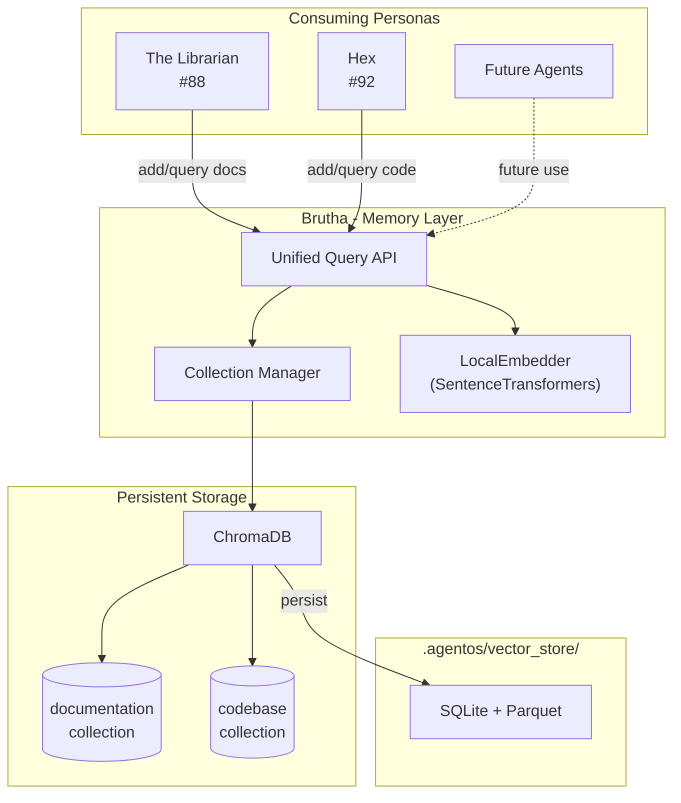

# 113 - Feature: Brutha - Vector Database Infrastructure (RAG Foundation)

<!-- Template Metadata
Last Updated: 2025-01-XX
Updated By: Initial creation
Update Reason: New LLD for RAG foundation infrastructure
-->

## 1. Context & Goal
* **Issue:** #113
* **Objective:** Implement shared vector database infrastructure with perfect recall that serves as the foundation for documentation retrieval (The Librarian #88) and codebase retrieval (Hex #92)
* **Status:** Approved (gemini-3-pro-preview, 2026-02-04)
* **Related Issues:** #88 (The Librarian - depends on this), #92 (Hex - depends on this)

### Open Questions

- [ ] Should we use ChromaDB's built-in persistence or implement custom backup strategy?
- [ ] What embedding model dimension should we standardize on (384 vs 768)?
- [ ] Should collection schemas be strictly enforced or allow dynamic metadata?

## 2. Proposed Changes

*This section is the **source of truth** for implementation. Describes exactly what will be built.*

### 2.1 Files Changed

| File | Change Type | Description |
|------|-------------|-------------|
| `src/agentos/memory/__init__.py` | Add | Package initialization, exports public API |
| `src/agentos/memory/brutha.py` | Add | Core vector store manager class |
| `src/agentos/memory/embeddings.py` | Add | Local embedding generation using SentenceTransformers |
| `src/agentos/memory/collections.py` | Add | Collection management and schema definitions |
| `src/agentos/memory/query.py` | Add | Unified query interface for all consumers |
| `src/agentos/memory/config.py` | Add | Configuration constants and paths |
| `tests/unit/test_brutha.py` | Add | Unit tests for vector store operations |
| `tests/integration/test_brutha_integration.py` | Add | Integration tests with real ChromaDB |

### 2.2 Dependencies

*New packages, APIs, or services required.*

```toml
# pyproject.toml additions
chromadb = "^0.4.22"
sentence-transformers = "^2.3.1"
```

### 2.3 Data Structures

```python
# Pseudocode - NOT implementation
from typing import TypedDict, Optional
from enum import Enum

class CollectionName(Enum):
    DOCUMENTATION = "documentation"
    CODEBASE = "codebase"
    CONVERSATIONS = "conversations"  # Future use

class Document(TypedDict):
    id: str                    # Unique document identifier
    content: str               # Text content to embed
    metadata: dict[str, any]   # Source, timestamp, type, etc.

class QueryResult(TypedDict):
    id: str                    # Document ID
    content: str               # Retrieved text
    metadata: dict[str, any]   # Associated metadata
    distance: float            # Similarity score (lower = more similar)

class BruthaConfig(TypedDict):
    persist_directory: str     # Path to .agentos/vector_store/
    embedding_model: str       # SentenceTransformer model name
    embedding_dimension: int   # Vector dimension (384)
    default_n_results: int     # Default query result count

class CollectionStats(TypedDict):
    name: str                  # Collection name
    document_count: int        # Number of documents
    last_updated: Optional[str]  # ISO timestamp
```

### 2.4 Function Signatures

```python
# === brutha.py ===
class Brutha:
    """The memory layer - perfect recall without embellishment."""
    
    def __init__(self, config: Optional[BruthaConfig] = None) -> None:
        """Initialize vector store with optional custom config."""
        ...
    
    def initialize(self) -> bool:
        """Initialize vector store on first use. Returns True if successful."""
        ...
    
    def is_initialized(self) -> bool:
        """Check if vector store is ready for operations."""
        ...
    
    def add_documents(
        self, 
        collection: CollectionName, 
        documents: list[Document]
    ) -> int:
        """Add documents to collection. Returns count added."""
        ...
    
    def query(
        self,
        collection: CollectionName,
        query_text: str,
        n_results: int = 10,
        where: Optional[dict] = None
    ) -> list[QueryResult]:
        """Query collection with optional metadata filtering."""
        ...
    
    def delete_documents(
        self,
        collection: CollectionName,
        ids: list[str]
    ) -> int:
        """Delete documents by ID. Returns count deleted."""
        ...
    
    def get_collection_stats(self, collection: CollectionName) -> CollectionStats:
        """Get statistics for a collection."""
        ...

# === embeddings.py ===
class LocalEmbedder:
    """Local embedding generation - no data egress."""
    
    def __init__(self, model_name: str = "all-MiniLM-L6-v2") -> None:
        """Initialize with specified SentenceTransformer model."""
        ...
    
    def embed(self, texts: list[str]) -> list[list[float]]:
        """Generate embeddings for texts. Batched for efficiency."""
        ...
    
    def embed_single(self, text: str) -> list[float]:
        """Generate embedding for single text."""
        ...

# === collections.py ===
def get_or_create_collection(
    client: chromadb.Client,
    name: CollectionName,
    embedding_function: EmbeddingFunction
) -> chromadb.Collection:
    """Get existing collection or create with proper schema."""
    ...

def validate_metadata(
    collection: CollectionName,
    metadata: dict
) -> tuple[bool, Optional[str]]:
    """Validate metadata against collection schema. Returns (valid, error_msg)."""
    ...

# === query.py ===
def unified_query(
    brutha: Brutha,
    query_text: str,
    collections: list[CollectionName],
    n_results: int = 10
) -> dict[CollectionName, list[QueryResult]]:
    """Query multiple collections simultaneously."""
    ...
```

### 2.5 Logic Flow (Pseudocode)

```
=== Initialization Flow ===
1. Check if .agentos/vector_store/ exists
2. IF not exists THEN
   - Create directory structure
   - Initialize ChromaDB with persistence
   - Create default collections (documentation, codebase)
   - Log: "Brutha initialized - memory is ready"
3. ELSE
   - Load existing ChromaDB from disk
   - Validate collection integrity
   - Log: "Brutha awakened - {n} memories restored"
4. Load embedding model (lazy - only when first needed)

=== Add Documents Flow ===
1. Validate documents (id required, content non-empty)
2. Extract texts for embedding
3. Generate embeddings locally (batch)
4. Upsert to collection (ChromaDB handles duplicates)
5. Persist changes
6. Return count added

=== Query Flow ===
1. Validate collection exists
2. IF collection empty THEN
   - Return empty list with warning
3. Generate query embedding
4. Execute similarity search with optional metadata filter
5. Transform results to QueryResult format
6. Return sorted by distance (ascending)

=== Graceful Degradation Flow ===
1. On any ChromaDB error:
   - Log error with full context
   - IF initialization error THEN
     - Set initialized = False
     - Return empty results for queries
     - Raise BruthaNotInitializedError for writes
   - IF query error THEN
     - Return empty results, log warning
   - IF write error THEN
     - Raise with details, caller decides retry
```

### 2.6 Technical Approach

* **Module:** `src/agentos/memory/`
* **Pattern:** Repository pattern with facade (Brutha class provides unified interface)
* **Key Decisions:**
  - **Local embeddings only**: SentenceTransformers ensures no data leaves the machine
  - **Collection-per-domain**: Isolates documentation from code for cleaner queries
  - **Lazy initialization**: Embedding model loads only when first query/add occurs
  - **Upsert semantics**: Re-adding same document ID updates rather than duplicates

### 2.7 Architecture Decisions

| Decision | Options Considered | Choice | Rationale |
|----------|-------------------|--------|-----------|
| Vector database | ChromaDB, FAISS, Pinecone, Milvus | ChromaDB | Local-first, embedded, good Python API, handles persistence |
| Embedding model | OpenAI Ada, Cohere, all-MiniLM-L6-v2 | all-MiniLM-L6-v2 | Local (no API calls), 384 dimensions, fast, good quality |
| Persistence strategy | In-memory only, SQLite, File-based | ChromaDB native (SQLite + parquet) | Built-in, reliable, handles concurrent access |
| Collection schema | Strict validation, Dynamic | Semi-strict with core fields | Balance between flexibility and consistency |
| Query interface | Per-collection, Unified | Both (unified wraps per-collection) | Flexibility for different use cases |

**Architectural Constraints:**
- Must not make any external API calls for embeddings (privacy requirement)
- Must persist to `.agentos/vector_store/` (consistent with other AgentOS data)
- Must support graceful degradation (feature, not hard dependency)

## 3. Requirements

*What must be true when this is done. These become acceptance criteria.*

1. **R1**: Vector store initializes automatically on first use, creating `.agentos/vector_store/` directory
2. **R2**: Multiple collections supported with independent schemas (documentation, codebase minimum)
3. **R3**: All embedding generation happens locally via SentenceTransformers (zero data egress)
4. **R4**: The Librarian (#88) can add and query the `documentation` collection
5. **R5**: Hex (#92) can add and query the `codebase` collection
6. **R6**: Graceful degradation when vector store not initialized (returns empty, doesn't crash)
7. **R7**: Vector store persists across sessions (survives process restart)
8. **R8**: Query results include similarity scores for relevance ranking

## 4. Alternatives Considered

| Option | Pros | Cons | Decision |
|--------|------|------|----------|
| ChromaDB | Embedded, Python-native, built-in persistence, good docs | Newer project, less battle-tested than FAISS | **Selected** |
| FAISS | Battle-tested, very fast, Facebook backing | Requires manual persistence, C++ bindings can be tricky | Rejected |
| Pinecone | Managed, scalable, great API | External service = data egress, cost | Rejected |
| LanceDB | Embedded, handles large scale | Newer, less community support | Rejected |

**Rationale:** ChromaDB provides the best balance of local-first operation, ease of use, and built-in persistence. FAISS would require implementing persistence ourselves, and Pinecone violates the "no data egress" requirement.

## 5. Data & Fixtures

### 5.1 Data Sources

| Attribute | Value |
|-----------|-------|
| Source | Documents provided by consumers (Librarian, Hex) |
| Format | Text strings with metadata dictionaries |
| Size | Variable: ~1KB-100KB per document, est. 10K-100K documents total |
| Refresh | On-demand when consumers index new content |
| Copyright/License | N/A - infrastructure layer, content owned by consumers |

### 5.2 Data Pipeline

```
Consumer (Librarian/Hex) ──add_documents()──► Brutha ──embed()──► LocalEmbedder
                                                │
                                                ▼
                                          ChromaDB ──persist()──► .agentos/vector_store/
```

### 5.3 Test Fixtures

| Fixture | Source | Notes |
|---------|--------|-------|
| Sample documentation chunks | Generated | 10 markdown snippets of varying length |
| Sample code chunks | Generated | 10 Python code snippets with docstrings |
| Edge case texts | Hardcoded | Empty string, unicode, very long text |
| Mock embeddings | Generated | Fixed vectors for deterministic testing |

### 5.4 Deployment Pipeline

Development → Test (ephemeral ChromaDB) → Production (persistent to `.agentos/`)

No external data source utility needed - this is pure infrastructure.

## 6. Diagram

### 6.1 Mermaid Quality Gate

- [x] **Simplicity:** Similar components collapsed
- [x] **No touching:** All elements have visual separation
- [x] **No hidden lines:** All arrows fully visible
- [x] **Readable:** Labels not truncated, flow direction clear
- [ ] **Auto-inspected:** Agent rendered via mermaid.ink and viewed

**Auto-Inspection Results:**
```
- Touching elements: [ ] None / [ ] Found: ___
- Hidden lines: [ ] None / [ ] Found: ___
- Label readability: [ ] Pass / [ ] Issue: ___
- Flow clarity: [ ] Clear / [ ] Issue: ___
```

### 6.2 Diagram



## 7. Security & Safety Considerations

### 7.1 Security

| Concern | Mitigation | Status |
|---------|------------|--------|
| Data egress via embeddings | All embeddings generated locally via SentenceTransformers | Addressed |
| Malicious content injection | Content stored as-is; sanitization is consumer responsibility | Addressed |
| Path traversal in persist dir | Hardcoded path under `.agentos/`, no user input in paths | Addressed |
| Concurrent access corruption | ChromaDB handles locking; recommend single writer pattern | Addressed |

### 7.2 Safety

| Concern | Mitigation | Status |
|---------|------------|--------|
| Data loss on failure | ChromaDB auto-persists; no explicit transaction needed | Addressed |
| Embedding model download failure | Graceful degradation; warn and continue without RAG | Addressed |
| Disk space exhaustion | Log warnings at 1GB, 5GB thresholds; leave cleanup to user | Addressed |
| Runaway indexing | Batch size limits (100 docs), progress logging | Addressed |

**Fail Mode:** Fail Open - queries return empty results rather than crashing
**Justification:** RAG is an enhancement, not critical path; better to proceed without context than halt entirely

**Recovery Strategy:** 
1. If ChromaDB corrupted: Delete `.agentos/vector_store/`, re-index on next use
2. If embedding model corrupted: Clear HuggingFace cache, re-download

## 8. Performance & Cost Considerations

### 8.1 Performance

| Metric | Budget | Approach |
|--------|--------|----------|
| Query latency | < 100ms for 10 results | ChromaDB in-memory index, local embeddings |
| Indexing throughput | > 100 docs/second | Batch embedding generation |
| Memory (idle) | < 50MB | Lazy model loading |
| Memory (active) | < 500MB | Model loaded only during operations |
| Startup time | < 2s | Lazy initialization |

**Bottlenecks:**
- First query loads embedding model (~1-2s cold start)
- Very large collections (>100K docs) may see query slowdown
- Disk I/O during initial load with large persistence files

### 8.2 Cost Analysis

| Resource | Unit Cost | Estimated Usage | Monthly Cost |
|----------|-----------|-----------------|--------------|
| Compute (embedding) | Local CPU | ~1000 docs/day | $0 |
| Storage | Disk | ~1GB | $0 |
| API calls | None | 0 | $0 |

**Cost Controls:**
- [x] No external API dependencies = no usage costs
- [x] Embedding model cached locally after first download
- [x] No cloud infrastructure required

**Worst-Case Scenario:** At 100x usage (100K docs/day), performance degrades but no cost increase. May need to consider chunking strategy or index optimization.

## 9. Legal & Compliance

| Concern | Applies? | Mitigation |
|---------|----------|------------|
| PII/Personal Data | N/A | Infrastructure layer; content decisions left to consumers |
| Third-Party Licenses | Yes | ChromaDB (Apache 2.0), sentence-transformers (Apache 2.0) - compatible |
| Terms of Service | No | No external services used |
| Data Retention | N/A | User controls persistence; no automatic deletion |
| Export Controls | No | No restricted algorithms; embeddings are standard ML |

**Data Classification:** Internal (infrastructure handles whatever consumers provide)

**Compliance Checklist:**
- [x] No PII stored without consent - N/A, infrastructure layer
- [x] All third-party licenses compatible with project license - Apache 2.0
- [x] External API usage compliant with provider ToS - No external APIs
- [x] Data retention policy documented - User-controlled persistence

## 10. Verification & Testing

### 10.0 Test Plan (TDD - Complete Before Implementation)

**TDD Requirement:** Tests MUST be written and failing BEFORE implementation begins.

| Test ID | Test Description | Expected Behavior | Status |
|---------|------------------|-------------------|--------|
| T010 | test_brutha_initialization | Creates vector store on first use | RED |
| T020 | test_add_documents_to_collection | Documents stored and retrievable | RED |
| T030 | test_query_returns_relevant_results | Semantic search returns similar docs | RED |
| T040 | test_multiple_collections_isolated | Docs in one collection don't appear in another | RED |
| T050 | test_local_embeddings_no_network | Embedding generation works offline | RED |
| T060 | test_persistence_survives_restart | Data available after reinstantiation | RED |
| T070 | test_graceful_degradation_uninitialized | Returns empty, doesn't crash | RED |
| T080 | test_delete_documents | Documents removed from collection | RED |
| T090 | test_metadata_filtering | Where clause filters results | RED |
| T100 | test_empty_collection_query | Returns empty list, no error | RED |

**Coverage Target:** ≥95% for all new code

**TDD Checklist:**
- [ ] All tests written before implementation
- [ ] Tests currently RED (failing)
- [ ] Test IDs match scenario IDs in 10.1
- [ ] Test file created at: `tests/unit/test_brutha.py`

### 10.1 Test Scenarios

| ID | Scenario | Type | Input | Expected Output | Pass Criteria |
|----|----------|------|-------|-----------------|---------------|
| 010 | Initialize fresh vector store | Auto | No existing store | Store created, is_initialized() = True | Directory exists, collections available |
| 020 | Add documents to documentation collection | Auto | 5 Document objects | 5 returned from query | Count matches, IDs correct |
| 030 | Query with semantic similarity | Auto | Query text similar to stored doc | Relevant doc in top 3 | Distance < 0.5 for best match |
| 040 | Collections are isolated | Auto | Doc in 'codebase', query 'documentation' | Empty result | Zero results from wrong collection |
| 050 | Embeddings generated locally | Auto | Text input | 384-dim float vector | No network calls, correct dimension |
| 060 | Persistence across restarts | Auto | Add doc, recreate Brutha instance, query | Doc still present | ID and content match |
| 070 | Graceful degradation | Auto | Query without initialization | Empty list, no exception | len(results) == 0 |
| 080 | Delete documents by ID | Auto | Add 3 docs, delete 1 | 2 remaining | Deleted doc not in results |
| 090 | Metadata filtering in query | Auto | Docs with different 'source' metadata | Only matching source returned | Filter works correctly |
| 100 | Query empty collection | Auto | Query freshly created collection | Empty list | No errors, len == 0 |
| 110 | Duplicate document handling | Auto | Add same ID twice with different content | Latest content stored | Upsert semantics |
| 120 | Batch add performance | Auto | Add 100 documents | All added in < 5s | Performance acceptable |
| 130 | Unicode content handling | Auto | Japanese/emoji text | Stored and queryable | No encoding errors |
| 140 | Very long document | Auto | 50KB text document | Stored successfully | No truncation |

### 10.2 Test Commands

```bash
# Run all Brutha unit tests
poetry run pytest tests/unit/test_brutha.py -v

# Run only fast/mocked tests (no disk I/O)
poetry run pytest tests/unit/test_brutha.py -v -m "not slow"

# Run integration tests with real ChromaDB
poetry run pytest tests/integration/test_brutha_integration.py -v

# Run with coverage
poetry run pytest tests/unit/test_brutha.py --cov=src/agentos/memory --cov-report=term-missing
```

### 10.3 Manual Tests (Only If Unavoidable)

N/A - All scenarios automated.

## 11. Risks & Mitigations

| Risk | Impact | Likelihood | Mitigation |
|------|--------|------------|------------|
| ChromaDB API breaking changes | High | Low | Pin version in pyproject.toml, test before upgrades |
| Embedding model unavailable offline | Med | Low | Model cached after first download; document offline setup |
| Disk space exhaustion | Med | Low | Monitor and warn at thresholds; document cleanup |
| Query performance degrades with scale | Med | Med | Document scaling limits; consider sharding for future |
| SentenceTransformers model quality insufficient | Med | Low | all-MiniLM-L6-v2 is well-tested; allow model config for future swap |
| Concurrent write corruption | High | Low | ChromaDB handles locking; recommend single writer |

## 12. Definition of Done

### Code
- [ ] Implementation complete and linted
- [ ] Code comments reference this LLD (Issue #113)
- [ ] All files in `src/agentos/memory/` created

### Tests
- [ ] All test scenarios pass (100% of T010-T140)
- [ ] Test coverage ≥ 95%
- [ ] Integration test demonstrates Librarian/Hex consumption pattern

### Documentation
- [ ] LLD updated with any deviations
- [ ] Implementation Report (0103) completed
- [ ] README in `src/agentos/memory/` documenting usage

### Review
- [ ] Code review completed
- [ ] Librarian (#88) and Hex (#92) authors confirm API meets needs
- [ ] User approval before closing issue

---

## Reviewer Suggestions

*Non-blocking recommendations from the reviewer.*

- **Configurability**: Consider making the `persist_directory` configurable via an environment variable (e.g., `AGENTOS_VECTOR_STORE_PATH`) to facilitate testing or different deployment environments, defaulting to `.agentos/vector_store/` if unset.
- **Batching**: Ensure the `add_documents` implementation explicitly chunks inputs larger than the `batch_size` to prevent OOM errors on the embedding model, even though 100 is stated as a limit.

## Appendix: Review Log

*Track all review feedback with timestamps and implementation status.*

### Review Summary

| Review | Date | Verdict | Key Issue |
|--------|------|---------|-----------|
| 1 | 2026-02-04 | APPROVED | `gemini-3-pro-preview` |
| - | - | - | Awaiting review |

**Final Status:** APPROVED