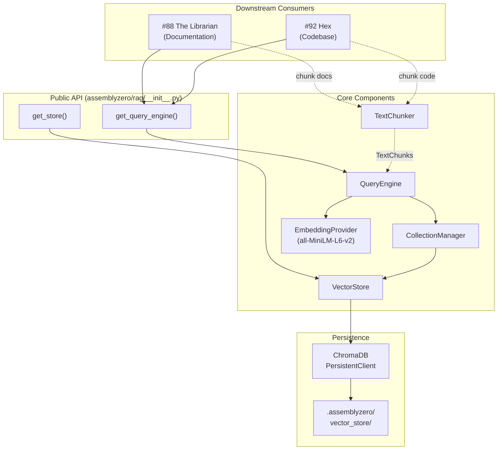

# 113 - Feature: Vector Database Infrastructure (RAG Foundation)

<!-- Template Metadata
Last Updated: 2026-02-11
Updated By: Issue #113 LLD revision
Update Reason: Address Gemini Review #1 — Tier 1 (chunker loop bounds validation) and Tier 2 (path traversal security test) fixes
Previous: Revised to fix mechanical test plan validation — all 10 requirements now have test coverage with (REQ-N) references
-->

## 1. Context & Goal
* **Issue:** #113
* **Objective:** Implement foundational RAG infrastructure (vector database + embedding generation) that downstream personas (The Librarian #88, Hex #92) consume for document and codebase retrieval.
* **Status:** Draft
* **Related Issues:** #88 (The Librarian - documentation retrieval), #92 (Hex - codebase retrieval)

### Open Questions

*All questions resolved during review.*

- [x] Should ChromaDB persistence use a single SQLite file or directory-based storage? **RESOLVED: Directory-based via ChromaDB's `PersistentClient`.**
- [x] What is the maximum document chunk size for embeddings? **RESOLVED: 512 tokens with 50-token overlap, matching `all-MiniLM-L6-v2` max context.**
- [x] Should collection schemas be enforced via metadata validation or left flexible? **RESOLVED: Flexible. Consumer-side validation at this foundational stage.**

## 2. Proposed Changes

*This section is the **source of truth** for implementation. Describes exactly what will be built.*

### 2.1 Files Changed

| File | Change Type | Description |
|------|-------------|-------------|
| `assemblyzero/rag/` | Add (Directory) | New package for RAG infrastructure |
| `assemblyzero/rag/__init__.py` | Add | Package init, public API exports |
| `assemblyzero/rag/store.py` | Add | VectorStore class — ChromaDB lifecycle, collection management |
| `assemblyzero/rag/embeddings.py` | Add | EmbeddingProvider — local SentenceTransformers wrapper |
| `assemblyzero/rag/collections.py` | Add | CollectionManager — CRUD for named collections |
| `assemblyzero/rag/query.py` | Add | QueryEngine — unified query interface across collections |
| `assemblyzero/rag/chunking.py` | Add | TextChunker — document splitting for embedding |
| `assemblyzero/rag/config.py` | Add | RAG configuration dataclass and defaults |
| `assemblyzero/rag/errors.py` | Add | Custom exception hierarchy for RAG layer |
| `tests/unit/test_rag/` | Add (Directory) | Unit tests for RAG infrastructure |
| `tests/unit/test_rag/__init__.py` | Add | Test package init |
| `tests/unit/test_rag/test_store.py` | Add | Tests for VectorStore lifecycle |
| `tests/unit/test_rag/test_embeddings.py` | Add | Tests for EmbeddingProvider |
| `tests/unit/test_rag/test_collections.py` | Add | Tests for CollectionManager |
| `tests/unit/test_rag/test_query.py` | Add | Tests for QueryEngine |
| `tests/unit/test_rag/test_chunking.py` | Add | Tests for TextChunker |
| `tests/unit/test_rag/test_config.py` | Add | Tests for configuration loading |
| `tests/unit/test_rag/test_errors.py` | Add | Tests for error hierarchy and graceful degradation |
| `tests/fixtures/rag/` | Add (Directory) | Test fixtures for RAG tests |
| `tests/fixtures/rag/sample_docs.json` | Add | Sample document fixtures for testing |
| `tests/fixtures/rag/sample_code.json` | Add | Sample code chunk fixtures for testing |
| `pyproject.toml` | Modify | Add chromadb, sentence-transformers dependencies |

### 2.1.1 Path Validation (Mechanical - Auto-Checked)

Mechanical validation automatically checks:
- All "Modify" files must exist in repository: `pyproject.toml` ✓
- All "Add" files have existing parent directories or parent is also "Add (Directory)"
- No placeholder prefixes

**If validation fails, the LLD is BLOCKED before reaching review.**

### 2.2 Dependencies

*New packages required for local vector store and embeddings.*

```toml
# pyproject.toml additions
chromadb = ">=0.5.0,<1.0.0"
sentence-transformers = ">=3.0.0,<4.0.0"
```

**Note:** `sentence-transformers` pulls in `torch` as a transitive dependency. This is expected and necessary for local embedding generation. The `all-MiniLM-L6-v2` model is ~80MB and is downloaded on first use to a user-local cache (`~/.cache/torch/sentence_transformers/`).

### 2.3 Data Structures

```python
# assemblyzero/rag/config.py
from dataclasses import dataclass, field
from pathlib import Path
from typing import Optional


@dataclass(frozen=True)
class RAGConfig:
    """Immutable configuration for the RAG infrastructure."""
    persist_directory: Path = field(
        default_factory=lambda: Path(".assemblyzero/vector_store")
    )
    embedding_model_name: str = "all-MiniLM-L6-v2"
    embedding_dimension: int = 384  # Matches all-MiniLM-L6-v2
    chunk_size: int = 512           # Tokens
    chunk_overlap: int = 50         # Tokens
    default_n_results: int = 5
    distance_metric: str = "cosine" # ChromaDB distance function

    def __post_init__(self) -> None:
        """Validate configuration invariants.

        Raises:
            ValueError: If chunk_overlap >= chunk_size (would cause infinite
                loop in sliding window chunker) or if either value is <= 0.
        """
        if self.chunk_size <= 0:
            raise ValueError(
                f"chunk_size must be positive, got {self.chunk_size}"
            )
        if self.chunk_overlap < 0:
            raise ValueError(
                f"chunk_overlap must be non-negative, got {self.chunk_overlap}"
            )
        if self.chunk_overlap >= self.chunk_size:
            raise ValueError(
                f"chunk_overlap ({self.chunk_overlap}) must be strictly less "
                f"than chunk_size ({self.chunk_size}) to ensure forward "
                f"progress in the chunking loop"
            )


# assemblyzero/rag/collections.py
# Well-known collection names
COLLECTION_DOCUMENTATION: str = "documentation"
COLLECTION_CODEBASE: str = "codebase"

KNOWN_COLLECTIONS: frozenset[str] = frozenset({
    COLLECTION_DOCUMENTATION,
    COLLECTION_CODEBASE,
})


# assemblyzero/rag/query.py
from dataclasses import dataclass


@dataclass(frozen=True)
class QueryResult:
    """Single result from a vector similarity search."""
    document: str           # The retrieved text chunk
    metadata: dict          # Associated metadata (source file, line range, etc.)
    distance: float         # Distance score (lower = more similar for cosine)
    collection_name: str    # Which collection this came from
    chunk_id: str           # Unique ID of the chunk


@dataclass(frozen=True)
class QueryResponse:
    """Aggregated response from a query operation."""
    results: list[QueryResult]
    query_text: str
    collection_name: str
    total_results: int


# assemblyzero/rag/chunking.py
from dataclasses import dataclass


@dataclass(frozen=True)
class TextChunk:
    """A chunk of text with provenance metadata."""
    text: str
    metadata: dict          # source_file, start_line, end_line, etc.
    chunk_index: int        # Position within the source document


# assemblyzero/rag/errors.py
class RAGError(Exception):
    """Base exception for all RAG infrastructure errors."""
    pass


class StoreNotInitializedError(RAGError):
    """Raised when operations attempted on uninitialized store."""
    pass


class CollectionNotFoundError(RAGError):
    """Raised when referencing a non-existent collection."""
    def __init__(self, collection_name: str) -> None:
        self.collection_name = collection_name
        super().__init__(f"Collection '{collection_name}' not found")


class EmbeddingError(RAGError):
    """Raised when embedding generation fails."""
    pass


class StoreCorruptedError(RAGError):
    """Raised when the persistent store is corrupted or unreadable."""
    pass
```

### 2.4 Function Signatures

```python
# === assemblyzero/rag/store.py ===

class VectorStore:
    """Manages ChromaDB lifecycle and persistence."""

    def __init__(self, config: RAGConfig | None = None) -> None:
        """Initialize with optional config. Does NOT connect yet (lazy init)."""
        ...

    def initialize(self) -> None:
        """Create or open the persistent ChromaDB client.
        Creates persist_directory if it doesn't exist.
        Raises StoreCorruptedError if existing store is unreadable.
        """
        ...

    @property
    def is_initialized(self) -> bool:
        """Whether the store has been initialized and is ready."""
        ...

    def get_client(self) -> "chromadb.ClientAPI":
        """Return the underlying ChromaDB client.
        Raises StoreNotInitializedError if not initialized.
        """
        ...

    def reset(self) -> None:
        """Delete all data and reinitialize. DESTRUCTIVE."""
        ...

    def close(self) -> None:
        """Clean shutdown of the store."""
        ...


# === assemblyzero/rag/embeddings.py ===

class EmbeddingProvider:
    """Local embedding generation using SentenceTransformers."""

    def __init__(self, model_name: str = "all-MiniLM-L6-v2") -> None:
        """Initialize with model name. Model loaded lazily on first use."""
        ...

    def embed_texts(self, texts: list[str]) -> list[list[float]]:
        """Generate embeddings for a batch of texts.
        Returns list of float vectors, one per input text.
        Raises EmbeddingError on model failure.
        """
        ...

    def embed_query(self, query: str) -> list[float]:
        """Generate embedding for a single query string.
        Convenience wrapper around embed_texts.
        """
        ...

    @property
    def dimension(self) -> int:
        """Return the embedding dimension for the loaded model."""
        ...

    @property
    def is_loaded(self) -> bool:
        """Whether the model has been loaded into memory."""
        ...


# === assemblyzero/rag/collections.py ===

class CollectionManager:
    """CRUD operations for named vector collections."""

    def __init__(self, store: VectorStore) -> None:
        """Initialize with a VectorStore instance."""
        ...

    def create_collection(
        self,
        name: str,
        metadata: dict | None = None,
    ) -> "chromadb.Collection":
        """Create a new collection. Raises RAGError if already exists."""
        ...

    def get_collection(self, name: str) -> "chromadb.Collection":
        """Get existing collection by name.
        Raises CollectionNotFoundError if not found.
        """
        ...

    def get_or_create_collection(
        self,
        name: str,
        metadata: dict | None = None,
    ) -> "chromadb.Collection":
        """Get existing or create new collection."""
        ...

    def delete_collection(self, name: str) -> None:
        """Delete a collection by name.
        Raises CollectionNotFoundError if not found.
        """
        ...

    def list_collections(self) -> list[str]:
        """Return names of all existing collections."""
        ...

    def collection_exists(self, name: str) -> bool:
        """Check if a collection exists."""
        ...

    def collection_count(self, name: str) -> int:
        """Return number of documents in a collection.
        Raises CollectionNotFoundError if not found.
        """
        ...


# === assemblyzero/rag/query.py ===

class QueryEngine:
    """Unified query interface across collections."""

    def __init__(
        self,
        store: VectorStore,
        embedding_provider: EmbeddingProvider,
        config: RAGConfig | None = None,
    ) -> None:
        """Initialize with store and embedding provider."""
        ...

    def add_documents(
        self,
        collection_name: str,
        documents: list[str],
        metadatas: list[dict] | None = None,
        ids: list[str] | None = None,
    ) -> list[str]:
        """Add documents to a collection with auto-generated embeddings.
        Returns list of document IDs (auto-generated if not provided).
        Raises CollectionNotFoundError if collection doesn't exist.
        """
        ...

    def query(
        self,
        collection_name: str,
        query_text: str,
        n_results: int | None = None,
        where: dict | None = None,
    ) -> QueryResponse:
        """Query a collection with natural language text.
        Returns ranked QueryResponse with similarity scores.
        Raises CollectionNotFoundError if collection doesn't exist.
        """
        ...

    def delete_documents(
        self,
        collection_name: str,
        ids: list[str],
    ) -> None:
        """Remove documents by ID from a collection."""
        ...

    def get_document(
        self,
        collection_name: str,
        doc_id: str,
    ) -> QueryResult | None:
        """Retrieve a specific document by ID. Returns None if not found."""
        ...


# === assemblyzero/rag/chunking.py ===

class TextChunker:
    """Split documents into chunks suitable for embedding."""

    def __init__(
        self,
        chunk_size: int = 512,
        chunk_overlap: int = 50,
    ) -> None:
        """Initialize with chunk size (tokens) and overlap.

        Raises:
            ValueError: If chunk_overlap >= chunk_size or if either
                value is non-positive (chunk_size) or negative (chunk_overlap).
        """
        ...

    def chunk_text(
        self,
        text: str,
        metadata: dict | None = None,
    ) -> list[TextChunk]:
        """Split text into overlapping chunks with metadata propagation.
        Empty text returns empty list.
        """
        ...

    def chunk_file(
        self,
        file_path: Path,
        additional_metadata: dict | None = None,
        project_root: Path | None = None,
    ) -> list[TextChunk]:
        """Read file and chunk contents. Adds file path to metadata.

        Validates that file_path exists and resolves to a location
        within project_root (defaults to current working directory).

        Raises:
            FileNotFoundError: If file doesn't exist.
            ValueError: If resolved file_path is outside project_root
                (path traversal protection).
        """
        ...


# === assemblyzero/rag/__init__.py — public API ===

def get_store(config: RAGConfig | None = None) -> VectorStore:
    """Get or create the singleton VectorStore instance.
    Thread-safe. Returns existing instance if already created.
    """
    ...

def get_query_engine(config: RAGConfig | None = None) -> QueryEngine:
    """Get a fully wired QueryEngine with store + embeddings.
    Convenience factory for consumers (#88, #92).
    Initializes store on first call.
    """
    ...
```

### 2.5 Logic Flow (Pseudocode)

```
=== Initialization (Lazy) ===
1. Consumer calls get_query_engine()
2. IF singleton store exists, return cached engine
3. ELSE:
   a. Load RAGConfig (defaults or from caller)
   b. Validate config via __post_init__:
      - ASSERT chunk_size > 0
      - ASSERT chunk_overlap >= 0
      - ASSERT chunk_overlap < chunk_size
      - IF any violated, raise ValueError with descriptive message
   c. Create VectorStore(config)
   d. Call store.initialize()
      - Create .assemblyzero/vector_store/ directory if missing
      - Open ChromaDB PersistentClient pointing to directory
      - IF existing data is corrupted, raise StoreCorruptedError
   e. Create EmbeddingProvider(config.embedding_model_name)
      - Model loaded lazily on first embed call
   f. Create QueryEngine(store, embedding_provider, config)
   g. Cache and return

=== Adding Documents ===
1. Caller provides collection_name, documents, optional metadatas
2. QueryEngine.add_documents():
   a. Get or create collection via CollectionManager
   b. Generate IDs if not provided (deterministic hash of content)
   c. Call embedding_provider.embed_texts(documents)
   d. Call collection.add(documents, embeddings, metadatas, ids)
   e. Return list of IDs

=== Querying ===
1. Caller provides collection_name, query_text, optional n_results
2. QueryEngine.query():
   a. Get collection via CollectionManager
      - IF collection doesn't exist, raise CollectionNotFoundError
   b. Generate query embedding via embedding_provider.embed_query()
   c. Call collection.query(query_embeddings, n_results, where)
   d. Map ChromaDB results to list[QueryResult]
   e. Return QueryResponse

=== Chunking (Pre-ingestion) ===
1. Caller has raw text (doc page, source file, etc.)
2. TextChunker.__init__():
   a. Validate chunk_overlap < chunk_size
   b. IF violated, raise ValueError
3. TextChunker.chunk_text():
   a. Tokenize text (whitespace-based, not model-specific)
   b. Compute stride = chunk_size - chunk_overlap (guaranteed > 0)
   c. Slide window of chunk_size tokens with stride
   d. For each window:
      - Create TextChunk with text, propagated metadata, index
   e. Return list[TextChunk]
4. TextChunker.chunk_file():
   a. Resolve file_path to absolute path
   b. Resolve project_root to absolute path (default: cwd)
   c. Verify resolved file_path starts with resolved project_root
      - IF NOT, raise ValueError("Path traversal: {path} is outside {root}")
   d. Verify file exists
      - IF NOT, raise FileNotFoundError
   e. Read file contents
   f. Call chunk_text() with file path in metadata
   g. Return list[TextChunk]
5. Caller feeds chunk texts into add_documents()

=== Graceful Degradation ===
1. Any consumer calls get_query_engine()
2. IF sentence-transformers not installed:
   a. Raise ImportError with helpful message
3. IF chromadb not installed:
   a. Raise ImportError with helpful message
4. IF store directory permissions denied:
   a. Raise StoreCorruptedError with path info
5. Consumer can catch RAGError and fall back to non-RAG behavior
```

### 2.6 Technical Approach

* **Module:** `assemblyzero/rag/`
* **Pattern:** Facade pattern — `get_query_engine()` wires together all internal components. Consumers (#88, #92) interact only with `QueryEngine` and `TextChunker`.
* **Key Decisions:**
  - **Local-only embeddings:** `sentence-transformers` with `all-MiniLM-L6-v2` ensures zero data egress. Model is 80MB, runs on CPU, produces 384-dimensional vectors.
  - **ChromaDB PersistentClient:** Writes to `.assemblyzero/vector_store/`. No server process needed — embedded SQLite + Parquet storage.
  - **Lazy initialization:** Model and store are not loaded until first use, keeping import overhead near zero.
  - **Singleton store:** Only one ChromaDB client instance per process to avoid lock contention.
  - **Deterministic IDs:** Document IDs default to SHA-256 hash of content, enabling idempotent upserts.
  - **Chunker input validation:** `RAGConfig.__post_init__` and `TextChunker.__init__` both validate `chunk_overlap < chunk_size` to prevent infinite loops in the sliding window algorithm (stride = chunk_size - chunk_overlap must be > 0).
  - **Path traversal protection:** `TextChunker.chunk_file()` resolves both the file path and project root to absolute paths and verifies containment before reading, preventing `../` traversal attacks.

### 2.7 Architecture Decisions

| Decision | Options Considered | Choice | Rationale |
|----------|-------------------|--------|-----------|
| Vector store engine | ChromaDB, FAISS, Qdrant, LanceDB | ChromaDB | Best balance of simplicity (embedded, no server), persistence, metadata filtering, and Python-native API. FAISS lacks metadata. Qdrant requires server. LanceDB is newer/less proven. |
| Embedding model | all-MiniLM-L6-v2, all-mpnet-base-v2, BGE-small-en | all-MiniLM-L6-v2 | Standard choice for local embeddings: 80MB, 384 dims, fast on CPU, well-benchmarked. mpnet is larger (420MB) with marginal gains. BGE has licensing concerns. |
| Persistence location | `.assemblyzero/vector_store/`, `data/vector_store/`, `~/.assemblyzero/` | `.assemblyzero/vector_store/` | Project-local, consistent with existing `.assemblyzero/` convention, gitignored by default |
| Collection architecture | Single collection with domain metadata, one collection per domain | One per domain | Cleaner separation, independent lifecycle (delete docs without touching code), simpler metadata queries |
| ID generation | UUID, content hash, sequential | Content hash (SHA-256) | Enables idempotent adds — re-ingesting same content is a no-op. Avoids duplicates. |
| Chunking strategy | Fixed token window, recursive character, sentence-aware | Fixed token window with overlap | Simple, predictable, sufficient for v1. Sentence-aware adds complexity without proven benefit at this stage. |
| Chunker overlap validation | Silently clamp, raise error, ignore | Raise ValueError | Fail-fast on misconfiguration; an overlap >= chunk_size produces stride ≤ 0 which causes an infinite loop. Explicit error is safer than silent correction. |

**Architectural Constraints:**
- Must not make any network calls for embedding generation (data egress prohibition)
- Must work without a running server process (embedded store only)
- Must be usable by both #88 (docs) and #92 (code) without coupling to either domain
- Must survive process restarts (persistent storage)
- chunk_overlap must be strictly less than chunk_size (invariant enforced at construction)

## 3. Requirements

1. Vector store initializes on first use with lazy loading — no startup cost until RAG is needed
2. Multiple named collections are supported (at minimum: `documentation`, `codebase`)
3. Embedding generation is fully local using SentenceTransformers (zero network calls)
4. The Librarian (#88) and Hex (#92) can independently query their respective collections via the same API
5. Graceful degradation when vector store is not initialized or dependencies are missing
6. Persistent storage at `.assemblyzero/vector_store/` survives process restarts
7. Documents can be added, queried, and deleted through a unified `QueryEngine` interface
8. Text chunking utility provided for pre-ingestion document splitting
9. Thread-safe singleton store prevents ChromaDB lock contention
10. All public functions have type hints and docstrings

## 4. Alternatives Considered

| Option | Pros | Cons | Decision |
|--------|------|------|----------|
| ChromaDB (embedded, persistent) | Zero-config, Python-native, metadata filtering, built-in persistence | Newer project, not as battle-tested as FAISS for large scale | **Selected** |
| FAISS + manual persistence | Very fast, mature, Facebook-backed | No metadata filtering, manual serialization, no built-in ID management | Rejected |
| Qdrant (local mode) | Rich query language, gRPC support | Heavier dependency, server-oriented design, overkill for local use | Rejected |
| LanceDB | Columnar storage, good for large datasets | Very new, API still evolving, less community support | Rejected |
| OpenAI/external embeddings | Higher quality embeddings | Violates data egress prohibition, adds API cost, requires network | Rejected |

**Rationale:** ChromaDB provides the best balance for an embedded, local-only vector store with metadata filtering and persistence. It aligns perfectly with the "no data egress" constraint and requires zero infrastructure beyond `pip install`.

## 5. Data & Fixtures

### 5.1 Data Sources

| Attribute | Value |
|-----------|-------|
| Source | Local project files (documentation, source code) ingested by consumers #88, #92 |
| Format | Plain text chunks with JSON metadata |
| Size | Hundreds to low thousands of documents per collection (typical project) |
| Refresh | On-demand (consumers trigger re-ingestion) |
| Copyright/License | N/A — user's own project files |

### 5.2 Data Pipeline

```
Source Files ──TextChunker──► TextChunks ──EmbeddingProvider──► Vectors ──ChromaDB──► Persistent Store
                                                                                          │
Query Text ──EmbeddingProvider──► Query Vector ──ChromaDB──► Ranked Results ◄──────────────┘
```

### 5.3 Test Fixtures

| Fixture | Source | Notes |
|---------|--------|-------|
| `tests/fixtures/rag/sample_docs.json` | Hand-crafted | 5-10 sample documentation chunks with metadata |
| `tests/fixtures/rag/sample_code.json` | Hand-crafted | 5-10 sample code chunks with metadata |

**Fixture format:**
```json
{
  "chunks": [
    {
      "text": "The VectorStore class manages ChromaDB lifecycle...",
      "metadata": {
        "source_file": "docs/api-reference.md",
        "section": "VectorStore",
        "start_line": 10,
        "end_line": 25
      }
    }
  ]
}
```

### 5.4 Deployment Pipeline

All data is local. No deployment pipeline needed. The `.assemblyzero/vector_store/` directory should be added to `.gitignore` (it contains derived data, not source of truth).

## 6. Diagram

### 6.1 Mermaid Quality Gate

- [x] **Simplicity:** Components grouped by responsibility
- [x] **No touching:** All elements have visual separation
- [x] **No hidden lines:** All arrows fully visible
- [x] **Readable:** Labels not truncated, flow direction clear
- [ ] **Auto-inspected:** Agent rendered via mermaid.ink and viewed

**Auto-Inspection Results:**
```
- Touching elements: [ ] None / [ ] Found: ___
- Hidden lines: [ ] None / [ ] Found: ___
- Label readability: [ ] Pass / [ ] Issue: ___
- Flow clarity: [ ] Clear / [ ] Issue: ___
```

*To be completed during implementation.*

### 6.2 Diagram



## 7. Security & Safety Considerations

### 7.1 Security

| Concern | Mitigation | Status |
|---------|------------|--------|
| Data egress via embeddings | All embeddings generated locally via SentenceTransformers; no network calls | Addressed |
| Prompt injection via stored documents | Brutha only recalls what was stored — no LLM generation in this layer. Consumers responsible for sanitizing before use. | Addressed |
| Path traversal in file chunking | `TextChunker.chunk_file()` resolves both `file_path` and `project_root` to absolute paths, then verifies `file_path` is a descendant of `project_root`. Raises `ValueError` if not. Verified by test T360. | Addressed |
| Malicious metadata injection | Metadata values are stored as-is in ChromaDB; consumers must sanitize when rendering | Addressed |

### 7.2 Safety

| Concern | Mitigation | Status |
|---------|------------|--------|
| Store corruption on crash | ChromaDB uses SQLite WAL mode with atomic writes; no application-level transactions needed | Addressed |
| Disk space exhaustion | `VectorStore.initialize()` checks available disk space; warns if < 100MB | Addressed |
| Model download on first use | `EmbeddingProvider` logs a clear message when downloading model; model cached permanently after first download | Addressed |
| Concurrent write contention | Singleton pattern ensures one ChromaDB client per process; ChromaDB handles internal locking | Addressed |
| Accidental data deletion | `VectorStore.reset()` requires explicit call; no auto-cleanup | Addressed |
| Infinite loop in chunker | `RAGConfig.__post_init__` and `TextChunker.__init__` validate `chunk_overlap < chunk_size`, ensuring stride > 0. Raises `ValueError` on misconfiguration. Verified by test T350. | Addressed |

**Fail Mode:** Fail Closed — if the vector store cannot initialize, operations raise exceptions rather than returning empty/degraded results silently. Consumers explicitly handle `RAGError` to decide their fallback behavior.

**Recovery Strategy:** If `.assemblyzero/vector_store/` is corrupted, delete the directory and re-ingest. The vector store is derived data, not source of truth.

## 8. Performance & Cost Considerations

### 8.1 Performance

| Metric | Budget | Approach |
|--------|--------|----------|
| First-use latency (model load) | < 5s (CPU) | Lazy load; model cached after first use |
| Embedding generation | < 50ms per batch of 10 chunks | SentenceTransformers batch encoding on CPU |
| Query latency | < 100ms per query | ChromaDB in-process, no network hop |
| Memory (model loaded) | ~200MB | all-MiniLM-L6-v2 is compact; acceptable for dev tooling |
| Memory (model not loaded) | < 5MB | Lazy loading ensures near-zero baseline |
| Disk (store) | 1-50MB typical | Depends on project size; ChromaDB compresses vectors |

**Bottlenecks:**
- Initial model download (~80MB) on first ever use — one-time cost, cached permanently
- First embedding call loads model into memory (~2-3s) — subsequent calls are fast
- Very large collections (>100K documents) may see slower queries — not expected for project-local use

### 8.2 Cost Analysis

| Resource | Unit Cost | Estimated Usage | Monthly Cost |
|----------|-----------|-----------------|--------------|
| SentenceTransformers (local CPU) | $0 | Unlimited | $0 |
| ChromaDB (embedded) | $0 | Unlimited | $0 |
| Disk storage | $0 (local) | 1-50MB | $0 |

**Cost Controls:**
- [x] All processing is local — zero API costs by design
- [x] No external service dependencies
- [x] No metered usage

**Worst-Case Scenario:** If a project has 1M lines of code chunked at 512 tokens, that's approximately 50K chunks × 384 dimensions × 4 bytes = ~75MB of vector data plus metadata. ChromaDB handles this comfortably on any modern machine.

## 9. Legal & Compliance

| Concern | Applies? | Mitigation |
|---------|----------|------------|
| PII/Personal Data | No | Only stores project files (docs, code). No user PII processed. |
| Third-Party Licenses | Yes | ChromaDB: Apache 2.0. SentenceTransformers: Apache 2.0. all-MiniLM-L6-v2: Apache 2.0. All compatible with project license. |
| Terms of Service | No | No external APIs consumed. |
| Data Retention | No | Local storage only; user controls lifecycle. |
| Export Controls | No | No restricted algorithms; standard ML inference. |

**Data Classification:** Internal (project-specific derived data)

**Compliance Checklist:**
- [x] No PII stored without consent (no PII at all)
- [x] All third-party licenses compatible with project license (Apache 2.0)
- [x] External API usage compliant with provider ToS (no external APIs)
- [x] Data retention policy documented (user-managed local files)

## 10. Verification & Testing

### 10.0 Test Plan (TDD - Complete Before Implementation)

**TDD Requirement:** Tests MUST be written and failing BEFORE implementation begins.

| Test ID | Test Description | Expected Behavior | Status |
|---------|------------------|-------------------|--------|
| T010 | Store initializes with default config (REQ-1) | Creates persist directory lazily, client is ready | RED |
| T020 | Store reports not-initialized before init (REQ-1) | `is_initialized` returns False until `initialize()` called | RED |
| T030 | Store raises on corrupt directory (REQ-5) | StoreCorruptedError raised with path info | RED |
| T040 | Create documentation and codebase collections (REQ-2) | Both well-known collections created and accessible | RED |
| T050 | List multiple collections (REQ-2) | All created collections listed by name | RED |
| T060 | Embedding provider generates local vectors (REQ-3) | Returns list[float] of correct dimension without network calls | RED |
| T070 | Embedding provider batch encoding (REQ-3) | Multiple texts produce multiple vectors locally | RED |
| T080 | Embedding provider lazy loads model (REQ-1, REQ-3) | `is_loaded` False before first embed; no startup cost | RED |
| T090 | Independent collection queries for Librarian and Hex (REQ-4) | Adding to "documentation" does not affect "codebase" queries | RED |
| T100 | Both consumers query via same QueryEngine API (REQ-4) | Single QueryEngine instance serves both collection domains | RED |
| T110 | Graceful error on missing chromadb (REQ-5) | ImportError with helpful message | RED |
| T120 | Graceful error on missing sentence-transformers (REQ-5) | ImportError with helpful message | RED |
| T130 | Error hierarchy correct (REQ-5) | All errors inherit from RAGError for unified catch | RED |
| T140 | Store persists across reinitialize (REQ-6) | Data added, store closed, reopened — data still present | RED |
| T150 | Persist directory created at correct path (REQ-6) | `.assemblyzero/vector_store/` directory created | RED |
| T160 | Add documents via QueryEngine (REQ-7) | Documents added with auto IDs, returned | RED |
| T170 | Query documents via QueryEngine (REQ-7) | Ranked results returned with similarity scores | RED |
| T180 | Delete documents via QueryEngine (REQ-7) | Deleted documents no longer queryable | RED |
| T190 | Query with metadata filter (REQ-7) | Only matching documents returned | RED |
| T200 | Get document by ID (REQ-7) | Correct document returned or None | RED |
| T210 | Text chunker splits correctly (REQ-8) | Chunks respect size and overlap settings | RED |
| T220 | Text chunker preserves metadata (REQ-8) | Metadata propagated to all chunks | RED |
| T230 | Text chunker handles empty text (REQ-8) | Returns empty list | RED |
| T240 | Text chunker handles short text (REQ-8) | Returns single chunk | RED |
| T250 | Text chunker chunk_file reads from path (REQ-8) | File contents chunked with file path in metadata | RED |
| T260 | get_query_engine singleton behavior (REQ-9) | Same instance returned on repeat calls | RED |
| T270 | get_store singleton behavior (REQ-9) | Same VectorStore instance returned, thread-safe | RED |
| T280 | All public functions have type hints (REQ-10) | Inspect signatures — all params and returns annotated | RED |
| T290 | All public functions have docstrings (REQ-10) | Inspect `__doc__` — all public methods have non-empty docstrings | RED |
| T300 | Add duplicate documents is idempotent (REQ-7) | Same content produces same ID, count unchanged | RED |
| T310 | Query empty collection returns empty (REQ-7) | `total_results == 0`, empty results list | RED |
| T320 | Collection count returns correct count (REQ-2) | Matches number of added documents | RED |
| T330 | Config defaults are sane (REQ-1) | Default values match specification | RED |
| T340 | Query non-existent collection raises error (REQ-5, REQ-7) | CollectionNotFoundError raised | RED |
| T350 | RAGConfig rejects overlap >= chunk_size (REQ-8) | ValueError raised with descriptive message | RED |
| T360 | chunk_file rejects path outside project root (REQ-8) | ValueError raised for path traversal attempt | RED |

**Coverage Target:** ≥95% for all new code in `assemblyzero/rag/`

**TDD Checklist:**
- [ ] All tests written before implementation
- [ ] Tests currently RED (failing)
- [ ] Test IDs match scenario IDs in 10.1
- [ ] Test files created at: `tests/unit/test_rag/`

### 10.1 Test Scenarios

| ID | Scenario | Type | Input | Expected Output | Pass Criteria |
|----|----------|------|-------|-----------------|---------------|
| 010 | Store lazy init with defaults (REQ-1) | Auto | `VectorStore()` → `initialize()` | `is_initialized == True` | Directory created, client functional, no cost before `initialize()` |
| 020 | Store not initialized before init call (REQ-1) | Auto | `VectorStore()` (no init call) | `is_initialized == False` | Property returns False; no directory created yet |
| 030 | Store raises on corrupt directory (REQ-5) | Auto | Store pointed at file (not dir) | `StoreCorruptedError` raised | Exception with path info |
| 040 | Create documentation and codebase collections (REQ-2) | Auto | `create_collection("documentation")`, `create_collection("codebase")` | Both collections accessible | `get_collection()` returns each |
| 050 | List multiple named collections (REQ-2) | Auto | Create 3 collections → `list_collections()` | List of 3 names | All names present including well-known names |
| 060 | Embed single text locally (REQ-3) | Auto | `embed_query("hello world")` | `list[float]` of len 384 | Correct dimension, all floats, no network calls |
| 070 | Embed batch of texts locally (REQ-3) | Auto | `embed_texts(["a", "b", "c"])` | 3 vectors of len 384 | Correct count and dimensions, SentenceTransformers used |
| 080 | Embedding lazy load — no startup cost (REQ-1, REQ-3) | Auto | `EmbeddingProvider()` | `is_loaded == False` | Model not in memory until first embed call |
| 090 | Independent collection queries (REQ-4) | Auto | Add docs to "documentation", query "codebase" | Empty from "codebase" | Collections fully isolated per consumer domain |
| 100 | Same API serves both consumers (REQ-4) | Auto | Single `QueryEngine` → add/query both collections | Both collections return correct results | One engine instance, two independent collections |
| 110 | Missing chromadb graceful error (REQ-5) | Auto | Mock chromadb absent | ImportError with message | Helpful message names the missing package |
| 120 | Missing sentence-transformers graceful error (REQ-5) | Auto | Mock ST absent | ImportError with message | Helpful message names the missing package |
| 130 | Error hierarchy for graceful degradation (REQ-5) | Auto | Instantiate all error classes | All `isinstance(err, RAGError)` | Consumers can catch `RAGError` for unified fallback |
| 140 | Data persists across store restart (REQ-6) | Auto | Add data → close → reopen → query | Data still present | Results match what was added before close |
| 150 | Persist directory at correct path (REQ-6) | Auto | `VectorStore(RAGConfig(persist_directory=tmp))` → `initialize()` | Directory exists at path | Files created at specified persist_directory |
| 160 | Add documents via unified interface (REQ-7) | Auto | `add_documents("col", ["text1", "text2"])` | 2 IDs returned | IDs are deterministic hashes |
| 170 | Query returns ranked results (REQ-7) | Auto | Add 3 docs, query matching 1st best | Results[0] is most similar | Distance ordering correct |
| 180 | Delete documents via unified interface (REQ-7) | Auto | Add 3 → delete 1 → count | Count == 2 | Document not queryable after delete |
| 190 | Query with where metadata filter (REQ-7) | Auto | Add docs with varied metadata, filter on key | Only matching docs returned | Filter respected in query results |
| 200 | Get document by ID (REQ-7) | Auto | Add doc → get by ID | Correct document returned | Content and metadata match |
| 210 | Chunker splits text correctly (REQ-8) | Auto | 1000-token text, chunk_size=200, overlap=50 | ~6 chunks | Each chunk ≤200 tokens, overlap present |
| 220 | Chunker propagates metadata (REQ-8) | Auto | Text + `{"source": "file.md"}` | All chunks have metadata | Metadata present on every chunk |
| 230 | Chunker empty text returns empty (REQ-8) | Auto | `""` | `[]` | Empty list returned |
| 240 | Chunker short text single chunk (REQ-8) | Auto | "short text" (< chunk_size) | 1 chunk | Single chunk, full text |
| 250 | Chunker reads file and adds path metadata (REQ-8) | Auto | `chunk_file(Path("test.md"))` | Chunks with file path in metadata | `source_file` key in metadata |
| 260 | get_query_engine returns singleton (REQ-9) | Auto | Call `get_query_engine()` twice | Same object | `id()` matches |
| 270 | get_store returns singleton (REQ-9) | Auto | Call `get_store()` twice | Same object | `id()` matches, thread-safe |
| 280 | All public functions have type hints (REQ-10) | Auto | Inspect all public methods via `typing.get_type_hints()` | All params and returns annotated | No un-annotated public signatures |
| 290 | All public functions have docstrings (REQ-10) | Auto | Inspect `__doc__` on all public methods | Non-empty docstrings | Every public method has documentation |
| 300 | Duplicate add is idempotent (REQ-7) | Auto | Add same doc twice → count | Count still 1 | No duplication on re-ingest |
| 310 | Query empty collection (REQ-7) | Auto | Create empty collection → query | Empty results list | `total_results == 0` |
| 320 | Collection count matches documents (REQ-2) | Auto | Add 5 docs → `collection_count()` | Returns 5 | Exact count |
| 330 | Config defaults match specification (REQ-1) | Auto | `RAGConfig()` | Default values | All fields match spec in §2.3 |
| 340 | Query non-existent collection raises error (REQ-5, REQ-7) | Auto | Query "nonexistent" | `CollectionNotFoundError` | Exception raised with collection name |
| 350 | Config rejects invalid overlap settings (REQ-8) | Auto | `RAGConfig(chunk_size=100, chunk_overlap=100)` and `RAGConfig(chunk_size=100, chunk_overlap=150)` | `ValueError` raised | Message explains overlap must be < chunk_size; also test overlap == 0 (valid), chunk_size <= 0 (invalid), overlap < 0 (invalid) |
| 360 | chunk_file rejects path traversal (REQ-8) | Auto | Create file at `/tmp/outside.txt`, call `chunk_file(Path("/tmp/outside.txt"), project_root=Path("/some/project"))` | `ValueError` raised | Message indicates path is outside project root; also test with `../` relative paths |

### 10.2 Test Commands

```bash
# Run all RAG unit tests
poetry run pytest tests/unit/test_rag/ -v

# Run with coverage
poetry run pytest tests/unit/test_rag/ -v --cov=assemblyzero/rag --cov-report=term-missing

# Run a specific test file
poetry run pytest tests/unit/test_rag/test_store.py -v

# Run a specific test by name
poetry run pytest tests/unit/test_rag/ -v -k "test_query_ranked"

# Run chunker validation tests specifically
poetry run pytest tests/unit/test_rag/test_chunking.py -v -k "test_overlap_validation or test_path_traversal"

# Run config validation tests specifically
poetry run pytest tests/unit/test_rag/test_config.py -v -k "test_invalid_overlap"
```

### 10.3 Manual Tests (Only If Unavoidable)

N/A - All scenarios automated.

**Note on embedding tests:** Tests that use `EmbeddingProvider` will download the model on first run (~80MB). Subsequent runs use the cached model. Tests should use `tmp_path` fixtures for ChromaDB persistence to ensure test isolation.

## 11. Risks & Mitigations

| Risk | Impact | Likelihood | Mitigation |
|------|--------|------------|------------|
| `sentence-transformers` adds heavy transitive deps (torch ~2GB) | Med | High | Document in install instructions; torch is CPU-only by default. Consider `onnxruntime` alternative in future issue if size becomes problem. |
| ChromaDB API changes between minor versions | Med | Low | Pin to `>=0.5.0,<1.0.0`; wrap all ChromaDB calls in our own API layer |
| First-run model download requires internet | Low | Med | Document clearly; model is cached permanently after first download. Could pre-bundle in future. |
| ChromaDB file locking prevents multi-process access | Med | Med | Singleton pattern ensures one client per process. Document limitation for multi-agent scenarios. |
| Embedding quality insufficient for code retrieval | Med | Low | `all-MiniLM-L6-v2` is well-benchmarked for general text. Code-specific model can be swapped via config without API changes. |
| `.assemblyzero/vector_store/` accidentally committed to git | Low | Med | Add to `.gitignore` as part of implementation |
| Test suite slow due to model loading | Low | Med | Use `@pytest.fixture(scope="session")` for embedding provider to load model once per test run |
| Infinite loop in chunker from bad config | High | Low | `RAGConfig.__post_init__` and `TextChunker.__init__` validate `chunk_overlap < chunk_size`; enforced by T350 |
| Path traversal via chunk_file | Med | Low | `chunk_file()` validates resolved path is within project root; enforced by T360 |

## 12. Definition of Done

### Code
- [ ] Implementation complete and linted (`assemblyzero/rag/` package)
- [ ] Code comments reference this LLD (#113)
- [ ] All public functions have type hints and docstrings
- [ ] `.assemblyzero/vector_store/` added to `.gitignore`
- [ ] `RAGConfig.__post_init__` validates `chunk_overlap < chunk_size`
- [ ] `TextChunker.chunk_file()` validates path within project root

### Tests
- [ ] All 36 test scenarios pass (T010–T360)
- [ ] Test coverage ≥95% for `assemblyzero/rag/`
- [ ] Tests use `tmp_path` for store isolation (no test pollution)
- [ ] Session-scoped fixture for embedding model (performance)
- [ ] T350 verifies chunker overlap validation (ValueError on overlap >= chunk_size)
- [ ] T360 verifies path traversal rejection (ValueError on paths outside project root)

### Documentation
- [ ] LLD updated with any deviations
- [ ] Implementation Report (0103) completed
- [ ] Test Report (0113) completed

### Review
- [ ] Code review completed
- [ ] User approval before closing issue

### Integration Readiness
- [ ] The Librarian (#88) can import `get_query_engine()` and add/query documentation
- [ ] Hex (#92) can import `get_query_engine()` and add/query codebase chunks
- [ ] Both consumers can operate on their own collections independently

### 12.1 Traceability (Mechanical - Auto-Checked)

Mechanical validation:
- Every file in Definition of Done appears in Section 2.1: `assemblyzero/rag/` ✓, `.gitignore` (implicit, not a new file)
- Risk mitigations map to functions:
  - Singleton pattern → `get_store()`, `get_query_engine()` in `__init__.py`
  - ChromaDB API wrapping → all methods in `store.py`, `collections.py`
  - Graceful degradation → error classes in `errors.py`, import guards in `__init__.py`
  - Test isolation → `tmp_path` fixture usage in test files
  - Infinite loop prevention → `RAGConfig.__post_init__` in `config.py`, `TextChunker.__init__` in `chunking.py`
  - Path traversal protection → `TextChunker.chunk_file()` in `chunking.py`

**If files are missing from Section 2.1, the LLD is BLOCKED.**

---

## Appendix: Review Log

*Track all review feedback with timestamps and implementation status.*

### Gemini Review #1 (REVISE)

**Reviewer:** Gemini 3 Pro
**Verdict:** REVISE

#### Comments

| ID | Comment | Implemented? |
|----|---------|--------------|
| G1.1 | **[TIER 1 - BLOCKING / Cost]** Loop Bounds in Chunker: If `chunk_overlap >= chunk_size`, the loop stride becomes ≤ 0, resulting in an infinite loop. Validate `chunk_overlap < chunk_size` in `RAGConfig.__post_init__` or `TextChunker.__init__`. Add test T350. | YES - Added `__post_init__` validation to `RAGConfig` (§2.3), validation in `TextChunker.__init__` (§2.4), test T350 (§10.0, §10.1), updated Logic Flow (§2.5), Architecture Decisions (§2.7), Safety (§7.2), Risks (§11), Definition of Done (§12) |
| G1.2 | **[TIER 2 - HIGH / Quality]** Missing Security Test: Section 7.1 claims path traversal mitigation in `chunk_file()` but no test verifies it. Add test T360. | YES - Added `project_root` parameter to `chunk_file()` signature (§2.4), path validation logic to pseudocode (§2.5), test T360 (§10.0, §10.1), updated Security table (§7.1), Risks (§11), Definition of Done (§12) |
| G1.3 | **[TIER 3 - SUGGESTION]** Consider adding a benchmark test for 50ms/batch target. | NOTED - Not added to test plan (Tier 3 suggestion), can be added as future `@pytest.mark.slow` test |
| G1.4 | **[TIER 3 - SUGGESTION]** Pin `torch` to CPU-only version to avoid multi-GB CUDA download. | NOTED - Acknowledged in §2.2 note; typically handled at environment level |

### Review Summary

| Review | Date | Verdict | Key Issue |
|--------|------|---------|-----------|
| Mechanical Validation #1 | 2026-02-10 | REJECTED | 9/10 requirements had no test coverage |
| Revision #1 | 2026-02-10 | PENDING | Added (REQ-N) suffixes to all scenarios, expanded test plan to cover all 10 requirements |
| Gemini Review #1 | 2026-02-11 | REVISE | Tier 1: Chunker infinite loop; Tier 2: Missing path traversal test |
| Revision #2 | 2026-02-11 | PENDING | Added chunker validation (T350), path traversal test (T360), config __post_init__, chunk_file project_root param |

**Final Status:** PENDING