# 114 - Feature: DEATH Documentation Reconciliation

<!-- Template Metadata
Last Updated: 2025-01-13
Updated By: LLD Creation
Update Reason: Initial LLD for post-implementation documentation reconciliation
Previous: N/A
-->

## 1. Context & Goal
* **Issue:** #114
* **Objective:** Reconcile and consolidate all architecture documentation after the Discworld persona workflow implementations are complete
* **Status:** Draft
* **Related Issues:** #113 (Brutha), #88 (Librarian), #91 (History Monks), #92 (Hex), #93 (Angua), #94 (Lu-Tze), Commander Vimes (Brief)

### Open Questions

- [ ] What is the completion status of each persona workflow implementation?
- [ ] Which existing ADRs need updates vs. new ADRs?
- [ ] Is there a preferred diagramming tool beyond Mermaid for architecture diagrams?
- [ ] Should the wiki use the same persona theme in page naming?

## 2. Proposed Changes

*This section is the **source of truth** for implementation. Describes exactly what will be built.*

### 2.1 Files Changed

| File | Change Type | Description |
|------|-------------|-------------|
| `docs/architecture/system-overview.md` | Add | Master architecture diagram showing all personas |
| `docs/architecture/data-flow.md` | Add | Data flow diagram: Brutha → Librarian/Hex |
| `docs/architecture/workflow-interactions.md` | Add | Workflow interaction diagram |
| `docs/adr/XXXX-discworld-persona-convention.md` | Add | ADR for Discworld naming convention |
| `docs/adr/XXXX-rag-architecture.md` | Add | ADR for Brutha-based RAG architecture |
| `docs/adr/XXXX-local-embeddings.md` | Add | ADR for local-only embeddings policy |
| `docs/wiki/Workflow-Personas.md` | Modify | Ensure current with all implemented workflows |
| `docs/wiki/Home.md` | Modify | Add workflow family overview |
| `docs/0003-file-inventory.md` | Modify | Add all new files from persona implementations |
| `README.md` | Modify | Add workflow family overview section |

### 2.2 Dependencies

*No new code dependencies - this is a documentation-only task.*

```toml
# No pyproject.toml additions required
```

### 2.3 Data Structures

*N/A - Documentation task, no code data structures.*

### 2.4 Function Signatures

*N/A - Documentation task, no code functions.*

### 2.5 Logic Flow (Pseudocode)

```
1. WAIT until all persona workflows are implemented
   - Monitor #113, #88, #91, #92, #93, #94, Vimes brief
   
2. INVENTORY existing documentation
   - Scan docs/ for architecture files
   - Scan docs/adr/ for existing ADRs
   - Scan wiki for workflow pages
   
3. CREATE architecture diagrams
   - System overview (all personas)
   - Data flow (Brutha → consumers)
   - Workflow interactions
   
4. CREATE new ADRs
   - Discworld naming convention
   - RAG architecture design
   - Local embeddings policy
   
5. UPDATE existing documentation
   - Wiki pages
   - File inventory
   - README
   
6. VERIFY cross-references
   - All new files referenced
   - All links valid
   - Consistent terminology
   
7. CLOSE issue when complete
```

### 2.6 Technical Approach

* **Module:** Documentation only (no code module)
* **Pattern:** Post-implementation documentation consolidation
* **Key Decisions:** 
  - Use Mermaid for all diagrams (consistent with project standards)
  - ADRs follow existing numbering scheme
  - Preserve persona theme in documentation

### 2.7 Architecture Decisions

| Decision | Options Considered | Choice | Rationale |
|----------|-------------------|--------|-----------|
| Diagram format | Mermaid, Draw.io, ASCII | Mermaid | Project standard, version-controllable |
| Documentation location | Wiki only, docs/ only, Both | Both | Wiki for discoverability, docs/ for version control |
| ADR numbering | Sequential, Grouped by topic | Sequential | Consistent with existing ADR practice |

**Architectural Constraints:**
- Must maintain compatibility with existing documentation structure
- Cannot require additional tooling beyond what's already in project
- Diagrams must render in GitHub Markdown

## 3. Requirements

*What must be true when this is done. These become acceptance criteria.*

1. System architecture diagram exists showing all Discworld personas and their relationships
2. Data flow diagram shows how Brutha serves Librarian and Hex
3. Workflow interaction diagram shows persona coordination patterns
4. ADR exists documenting Discworld persona naming convention
5. ADR exists documenting RAG architecture with Brutha as foundation
6. ADR exists documenting local-only embeddings policy
7. Wiki Workflow-Personas.md is current with all implemented workflows
8. Wiki Home.md includes workflow family overview
9. File inventory (0003) includes all new files from persona implementations
10. README includes workflow family overview section
11. All cross-references are valid and links work

## 4. Alternatives Considered

| Option | Pros | Cons | Decision |
|--------|------|------|----------|
| Document as we build | Docs stay current | May need revision, duplicated effort | **Rejected** |
| Single post-implementation pass | Complete picture, efficient | Delayed documentation | **Selected** |
| No consolidated docs | Less work | Poor discoverability, inconsistency | **Rejected** |

**Rationale:** Post-implementation consolidation (DEATH's approach) ensures documentation reflects the actual implemented state rather than plans that may have changed. It also provides a holistic view impossible during incremental development.

## 5. Data & Fixtures

### 5.1 Data Sources

| Attribute | Value |
|-----------|-------|
| Source | Existing codebase and documentation |
| Format | Markdown, Python source files |
| Size | ~50-100 files to inventory |
| Refresh | One-time reconciliation |
| Copyright/License | Project license (existing) |

### 5.2 Data Pipeline

```
Implemented Code ──scan──► Extract Structure ──synthesize──► Documentation
                                    ↓
Existing Docs ──────review──────────┘
```

### 5.3 Test Fixtures

| Fixture | Source | Notes |
|---------|--------|-------|
| N/A | N/A | Documentation task - no test fixtures |

### 5.4 Deployment Pipeline

Documentation changes deploy via standard git workflow:
- Changes committed to feature branch
- PR reviewed for accuracy
- Merge to main deploys to GitHub (wiki auto-syncs if configured)

**If data source is external:** N/A - all sources are internal

## 6. Diagram

### 6.1 Mermaid Quality Gate

Before finalizing any diagram, verify in [Mermaid Live Editor](https://mermaid.live) or GitHub preview:

- [ ] **Simplicity:** Similar components collapsed (per 0006 §8.1)
- [ ] **No touching:** All elements have visual separation (per 0006 §8.2)
- [ ] **No hidden lines:** All arrows fully visible (per 0006 §8.3)
- [ ] **Readable:** Labels not truncated, flow direction clear
- [ ] **Auto-inspected:** Agent rendered via mermaid.ink and viewed (per 0006 §8.5)

**Agent Auto-Inspection (MANDATORY):**

AI agents MUST render and view the diagram before committing:
1. Base64 encode diagram → fetch PNG from `https://mermaid.ink/img/{base64}`
2. Read the PNG file (multimodal inspection)
3. Document results below

**Auto-Inspection Results:**
```
- Touching elements: [ ] None / [ ] Found: ___
- Hidden lines: [ ] None / [ ] Found: ___
- Label readability: [ ] Pass / [ ] Issue: ___
- Flow clarity: [ ] Clear / [ ] Issue: ___
```

*Reference: [0006-mermaid-diagrams.md](0006-mermaid-diagrams.md)*

### 6.2 System Architecture Diagram (To Be Created)

```mermaid
graph TB
    subgraph "AgentOS Discworld Workflows"
        subgraph "Vector Foundation"
            Brutha[🐘 Brutha<br/>Vector DB Infrastructure<br/>#113]
        end
        
        subgraph "RAG Consumers"
            Librarian[📚 The Librarian<br/>Documentation Retrieval<br/>#88]
            Hex[⚙️ Hex<br/>Codebase RAG<br/>#92]
        end
        
        subgraph "Context Services"
            HistoryMonks[⏰ History Monks<br/>Past Context<br/>#91]
        end
        
        subgraph "Operations"
            Angua[🐺 Captain Angua<br/>Scout/External Intel<br/>#93]
            LuTze[🧹 Lu-Tze<br/>Janitor/Hygiene<br/>#94]
            Vimes[👮 Commander Vimes<br/>Regression Guardian]
        end
        
        subgraph "Post-Implementation"
            Death[💀 DEATH<br/>Documentation<br/>#114]
        end
    end
    
    Brutha --> Librarian
    Brutha --> Hex
    HistoryMonks --> Librarian
    HistoryMonks --> Hex
    Angua --> Hex
    LuTze --> Brutha
    Vimes --> LuTze
    Death -.->|reconciles| Brutha
    Death -.->|reconciles| Librarian
    Death -.->|reconciles| Hex
    Death -.->|reconciles| HistoryMonks
    Death -.->|reconciles| Angua
    Death -.->|reconciles| LuTze
    Death -.->|reconciles| Vimes
```



### 6.3 Data Flow Diagram (To Be Created)


## 7. Security & Safety Considerations

### 7.1 Security

| Concern | Mitigation | Status |
|---------|------------|--------|
| Documentation may expose internal architecture | Review for sensitive details before committing | TODO |
| Diagram links may become stale | Use relative paths where possible | TODO |

### 7.2 Safety

| Concern | Mitigation | Status |
|---------|------------|--------|
| Overwriting existing documentation | Review changes via PR, never force-push | Addressed |
| Incorrect cross-references | Validate all links before merge | TODO |
| Stale file inventory | Automated scan rather than manual list | TODO |

**Fail Mode:** Fail Closed - Documentation not published until verified accurate

**Recovery Strategy:** Git history allows rollback of any documentation changes

## 8. Performance & Cost Considerations

### 8.1 Performance

| Metric | Budget | Approach |
|--------|--------|----------|
| Documentation generation time | < 4 hours | Single focused session |
| Diagram render time | < 1 second | Keep diagrams simple |
| Link validation time | < 5 minutes | Automated script |

**Bottlenecks:** Manual review of diagram accuracy is the primary time cost

### 8.2 Cost Analysis

| Resource | Unit Cost | Estimated Usage | Monthly Cost |
|----------|-----------|-----------------|--------------|
| Developer time | Internal | 4-8 hours one-time | N/A |
| LLM assistance | ~$0.01/query | ~50 queries | $0.50 |
| No external services | N/A | N/A | $0 |

**Cost Controls:**
- [x] One-time task, no recurring costs
- [x] All tools already available in project

**Worst-Case Scenario:** If documentation takes longer, only internal time cost increases. No external cost risk.

## 9. Legal & Compliance

| Concern | Applies? | Mitigation |
|---------|----------|------------|
| PII/Personal Data | No | Documentation contains no personal data |
| Third-Party Licenses | No | All content is original project documentation |
| Terms of Service | N/A | No external services used |
| Data Retention | N/A | Documentation is version-controlled, not sensitive |
| Export Controls | No | No restricted algorithms documented |

**Data Classification:** Internal

**Compliance Checklist:**
- [x] No PII stored without consent
- [x] All third-party licenses compatible with project license
- [x] External API usage compliant with provider ToS
- [x] Data retention policy documented

## 10. Verification & Testing

*Ref: [0005-testing-strategy-and-protocols.md](0005-testing-strategy-and-protocols.md)*

**Testing Philosophy:** Documentation quality is verified through review and link validation rather than traditional unit tests.

### 10.1 Test Scenarios

| ID | Scenario | Type | Input | Expected Output | Pass Criteria |
|----|----------|------|-------|-----------------|---------------|
| 010 | All Mermaid diagrams render | Auto | Diagram source | Valid PNG | No render errors |
| 020 | All internal links valid | Auto | Markdown files | 200 status | No broken links |
| 030 | File inventory complete | Auto | docs/0003 + file list | Match | All new files listed |
| 040 | ADR numbering sequential | Auto | ADR directory | Sequential IDs | No gaps, no duplicates |
| 050 | Wiki pages contain required sections | Manual | Wiki pages | Section checklist | All sections present |
| 060 | Persona descriptions accurate | Manual | Workflow docs | Implementation match | Docs match code |

### 10.2 Test Commands

```bash
# Validate Mermaid diagrams render (requires mermaid-cli)
npx @mermaid-js/mermaid-cli -i docs/architecture/*.md -o /tmp/

# Check internal links (requires markdown-link-check)
find docs -name "*.md" -exec markdown-link-check {} \;

# Verify file inventory completeness
diff <(find src -name "*.py" | sort) <(grep "\.py" docs/0003-file-inventory.md | sort)
```

### 10.3 Manual Tests (Only If Unavoidable)

| ID | Scenario | Why Not Automated | Steps |
|----|----------|-------------------|-------|
| 050 | Wiki pages contain required sections | Semantic understanding required | 1. Open each wiki page 2. Verify persona overview, links, status present |
| 060 | Persona descriptions accurate | Requires understanding code intent | 1. Read persona workflow code 2. Compare to documentation 3. Flag discrepancies |

## 11. Risks & Mitigations

| Risk | Impact | Likelihood | Mitigation |
|------|--------|------------|------------|
| Persona workflows not complete when DEATH runs | High | Medium | Explicit prerequisite check before starting |
| Documentation becomes stale after reconciliation | Medium | High | Establish ongoing maintenance process |
| Diagrams too complex to be useful | Medium | Low | Follow simplicity guidelines from 0006 |
| Inconsistent terminology across docs | Medium | Medium | Create glossary, search-replace for consistency |
| Missing workflows not yet tracked | Medium | Low | Comprehensive scan of codebase for workflows |

## 12. Definition of Done

### Code
- [x] N/A - Documentation task, no code implementation
- [x] N/A - No code comments needed

### Tests
- [ ] All Mermaid diagrams render without errors
- [ ] All internal links validated
- [ ] File inventory verified complete

### Documentation
- [ ] System architecture diagram created
- [ ] Data flow diagram created  
- [ ] Workflow interaction diagram created
- [ ] ADR: Discworld persona naming convention
- [ ] ADR: RAG architecture (Brutha foundation)
- [ ] ADR: Local-only embeddings policy
- [ ] Wiki Workflow-Personas.md updated
- [ ] Wiki Home.md updated
- [ ] File inventory (0003) updated
- [ ] README updated with workflow overview

### Review
- [ ] All documentation reviewed for accuracy
- [ ] Cross-references validated
- [ ] User approval before closing issue

---

## Appendix: Documentation Inventory

*To be populated during execution*

### Existing Architecture Documentation

| File | Status | Action Needed |
|------|--------|---------------|
| *To be inventoried* | | |

### New Files Created

| File | Created | Verified |
|------|---------|----------|
| *To be populated* | | |

### ADR Status

| ADR Number | Title | Status |
|------------|-------|--------|
| *To be assigned* | Discworld Persona Convention | Pending |
| *To be assigned* | RAG Architecture | Pending |
| *To be assigned* | Local Embeddings | Pending |

---

## Appendix: DEATH's Checklist

*"I DO NOT KILL. I MERELY TAKE WHAT IS DUE. IN THIS CASE, DOCUMENTATION."*

### Pre-Execution Verification

- [ ] #113 Brutha - COMPLETE
- [ ] #88 Librarian - COMPLETE
- [ ] #91 History Monks - COMPLETE
- [ ] #92 Hex - COMPLETE
- [ ] #93 Angua - COMPLETE
- [ ] #94 Lu-Tze - COMPLETE
- [ ] Commander Vimes - COMPLETE

### Execution Order

1. [ ] Inventory existing state
2. [ ] Create architecture diagrams
3. [ ] Create ADRs
4. [ ] Update wiki
5. [ ] Update file inventory
6. [ ] Update README
7. [ ] Verify all links
8. [ ] Final review

*"WHAT CAN THE HARVEST HOPE FOR, IF NOT FOR THE CARE OF THE REAPER MAN?"*

---

## Appendix: Review Log

*Track all review feedback with timestamps and implementation status.*

### Review Summary

| Review | Date | Verdict | Key Issue |
|--------|------|---------|-----------|
| *Pending* | | | |

**Final Status:** PENDING
<!-- Note: This field is auto-updated to APPROVED by the workflow when finalized -->