# 114 - DEATH: Documentation Reconciliation (Post-Implementation Cleanup)

<!-- Template Metadata
Last Updated: 2025-01-XX
Updated By: Issue #114 creation
Update Reason: Revision 2 - Fixed Test ID/Scenario ID synchronization per Gemini Review #2
-->

## 1. Context & Goal
* **Issue:** #114
* **Objective:** Create a post-implementation workflow that ensures all documentation is reconciled, architecture diagrams updated, and no loose ends remain after Discworld persona workflows are implemented.
* **Status:** Approved (gemini-3-pro-preview, 2026-02-04)
* **Related Issues:** #113 (Brutha), #88 (Librarian), #91 (History Monks), #92 (Hex), #93 (Angua), #94 (Lu-Tze)

### Open Questions

- [x] What triggers DEATH workflow - manual invocation after milestone completion, or automated detection of "implementation complete" state? **RESOLVED: Manual invocation**
- [x] Should DEATH operate on the entire repository or accept a scope parameter (e.g., specific issue range)? **RESOLVED: Accept scope + auto-detect**
- [x] What format for architecture diagrams - Mermaid only, or also PlantUML/ASCII? **RESOLVED: Mermaid only**

## 2. Proposed Changes

*This section is the **source of truth** for implementation. Describes exactly what will be built.*

### 2.1 Files Changed

| File | Change Type | Description |
|------|-------------|-------------|
| `skills/death/skill.md` | Add | Skill metadata and invocation pattern |
| `skills/death/prompt.md` | Add | DEATH persona prompt and reconciliation logic |
| `skills/death/templates/system-architecture-diagram.md` | Add | Template for system architecture diagram |
| `skills/death/templates/data-flow-diagram.md` | Add | Template for data flow diagrams |
| `skills/death/checklists/reconciliation.md` | Add | Checklist for documentation reconciliation |
| `docs/0003-file-inventory.md` | Modify | Add DEATH skill files |
| `wiki/Workflow-Personas.md` | Modify | Add DEATH persona entry |
| `README.md` | Modify | Add DEATH to workflow overview |

### 2.2 Dependencies

```toml
# No new dependencies required
# DEATH operates through Claude's native capabilities
```

### 2.3 Data Structures

```python
# Pseudocode - NOT implementation
class ReconciliationState(TypedDict):
    scope: list[int]  # Issue numbers to reconcile
    diagrams_updated: list[str]  # Paths to updated diagrams
    adrs_created: list[str]  # New ADR filenames
    wiki_pages_updated: list[str]  # Updated wiki pages
    inventory_synced: bool  # File inventory matches reality
    readme_updated: bool  # README reflects current state
    orphaned_docs: list[str]  # Docs that reference non-existent code
    missing_docs: list[str]  # Code without documentation
```

### 2.4 Function Signatures

```python
# Signatures only - implementation in source files
def scan_implementation_state(issues: list[int], max_files: int = 10000) -> ImplementationStatus:
    """Check which issues are complete and ready for reconciliation.
    
    Args:
        issues: List of issue numbers to scan
        max_files: Maximum files to scan before warning (prevents performance issues)
    """
    ...

def generate_system_architecture_diagram(personas: list[PersonaInfo]) -> str:
    """Create Mermaid diagram showing all persona relationships (Requirement 1)."""
    ...

def generate_data_flow_diagram(source: str, destinations: list[str]) -> str:
    """Create data flow diagram showing how data moves between components (Requirement 2)."""
    ...

def audit_file_inventory(inventory_path: str) -> InventoryDiff:
    """Compare file inventory against actual files in repository."""
    ...

def reconcile_wiki_links(wiki_dir: str) -> list[BrokenLink]:
    """Find and report broken cross-links in wiki."""
    ...

def update_workflow_personas_wiki(personas: list[PersonaInfo]) -> WikiUpdateResult:
    """Update Workflow-Personas.md with discovered personas (Requirement 4)."""
    ...

def update_readme_workflow_overview(personas: list[PersonaInfo]) -> ReadmeUpdateResult:
    """Update README.md with workflow family overview (Requirement 6)."""
    ...

def detect_undocumented_code(code_dir: str, docs_dir: str) -> list[str]:
    """Find code files without corresponding documentation (Requirement 8)."""
    ...

def generate_adr(decision: str, context: str, options: list[str]) -> str:
    """Generate Architecture Decision Record from structured input."""
    ...
```

### 2.5 Logic Flow (Pseudocode)

```
1. DEATH ARRIVES (skill invoked)
   
2. ASSESS THE SITUATION
   - Scan repository for Discworld persona implementations
   - Identify which issues are marked complete
   - Build dependency graph of workflows
   - Check file count against max_files threshold

3. ARCHITECTURE DIAGRAMS
   IF system architecture diagram missing or stale THEN
     - Generate new System Architecture diagram from discovered personas (Req 1)
     - Place in docs/architecture/
   IF data flow diagram missing THEN
     - Trace Brutha → consumers (Librarian, Hex)
     - Generate Data Flow diagram (Req 2)
     - Place in docs/architecture/

4. ADRS
   FOR EACH undocumented architectural decision
     - Generate ADR from implementation evidence (Req 3)
     - Assign next ADR number
     - Cross-link to relevant issues

5. WIKI RECONCILIATION
   - Update Workflow-Personas.md with all personas (Req 4)
   - Verify cross-links between pages
   - Update Home.md with current overview

6. FILE INVENTORY
   - Run complete file inventory audit
   - Report additions/deletions/moves
   - Update 0003-file-inventory.md (Req 5)

7. README UPDATE
   - Add/update workflow family section (Req 6)
   - Ensure all personas mentioned

8. ORPHAN AND UNDOCUMENTED DETECTION
   - Scan for orphaned documentation (Req 7)
   - Scan for undocumented major components (Req 8)
   - Report both categories

9. FINAL REPORT
   - Generate reconciliation report
   - List what was updated
   - Flag any unresolved issues

10. DEATH DEPARTS
   > "THE END."
```

### 2.6 Technical Approach

* **Module:** `skills/death/`
* **Pattern:** Audit → Report → Apply workflow
* **Key Decisions:** 
  - DEATH operates as a skill, not a background daemon
  - Changes are proposed before application (dry-run mode available)
  - All diagram generation uses Mermaid for consistency
  - System Architecture and Data Flow diagrams are distinct artifacts

### 2.7 Architecture Decisions

| Decision | Options Considered | Choice | Rationale |
|----------|-------------------|--------|-----------|
| Invocation model | Auto-trigger vs Manual | Manual invocation | DEATH comes when summoned; premature reconciliation causes churn |
| Diagram format | Mermaid, PlantUML, Draw.io | Mermaid | Already established in project (0006-mermaid-diagrams.md) |
| Change application | Direct apply vs Dry-run first | Dry-run with optional apply | Safety first; allows human review before changes |
| Scope detection | Parse all issues vs Accept scope param | Accept scope + auto-detect | Flexibility for partial reconciliation or full sweep |
| File count protection | No limit vs max_files threshold | max_files with warning | Prevents performance degradation on massive repos |

**Architectural Constraints:**
- Must integrate with existing skill invocation system
- Cannot modify files without showing proposed changes first
- Must respect existing ADR numbering scheme
- Wiki updates must preserve existing content structure

## 3. Requirements

*What must be true when this is done. These become acceptance criteria.*

1. System architecture diagram exists showing all Discworld personas and their relationships
2. Data flow diagram shows Brutha serving Librarian and Hex
3. ADRs exist for: persona naming convention, RAG architecture, local-only embeddings
4. Workflow-Personas.md is complete and accurate
5. File inventory (0003) reflects all new files
6. README includes workflow family overview
7. No orphaned documentation (references to removed code)
8. No undocumented major components

## 4. Alternatives Considered

| Option | Pros | Cons | Decision |
|--------|------|------|----------|
| Continuous reconciliation daemon | Always up-to-date | Noisy, premature updates | **Rejected** |
| Post-PR hook | Automatic triggering | Too granular, slows merges | **Rejected** |
| Manual milestone skill | Deliberate, thorough | Requires remembering to invoke | **Selected** |
| CI check that fails on drift | Enforces discipline | Blocks unrelated PRs | **Rejected** |

**Rationale:** DEATH is philosophically appropriate as a deliberate, end-of-lifecycle intervention. Continuous reconciliation would create noise; post-PR hooks are too granular. The milestone-based approach matches the persona's nature.

## 5. Data & Fixtures

### 5.1 Data Sources

| Attribute | Value |
|-----------|-------|
| Source | Repository files, GitHub issues, existing docs |
| Format | Markdown, Python, YAML |
| Size | Entire repository (~500-1000 files) |
| Refresh | On-demand when skill invoked |
| Copyright/License | Project-owned |

### 5.2 Data Pipeline

```
Repository Files ──scan──► File Index ──diff──► Inventory Updates
                                        └──► Architecture Diagrams
GitHub Issues ──parse──► Implementation Status ──► ADR Generation
Existing Docs ──audit──► Cross-link Map ──► Wiki Updates
Code Files ──compare──► Doc Files ──► Undocumented Code Report
```

### 5.3 Test Fixtures

| Fixture | Source | Notes |
|---------|--------|-------|
| Mock repository structure | Generated | Simulates multi-persona project |
| Sample incomplete docs | Hardcoded | Tests orphan detection |
| Sample undocumented code | Hardcoded | Tests missing doc detection |
| Mock GitHub issue data | Hardcoded | Tests implementation status detection |
| Missing ADR fixtures | Hardcoded | Specifically tests absence of "RAG Architecture" and "Persona Naming" ADRs per Req 3 |

### 5.4 Deployment Pipeline

DEATH is a skill; deployment is file-based:
1. Merge skill files to main
2. Skill becomes available immediately
3. No separate deployment step required

## 6. Diagram

### 6.1 Mermaid Quality Gate

- [x] **Simplicity:** Similar components collapsed
- [x] **No touching:** All elements have visual separation
- [x] **No hidden lines:** All arrows fully visible
- [x] **Readable:** Labels not truncated, flow direction clear
- [ ] **Auto-inspected:** Pending implementation

**Auto-Inspection Results:**
```
- Touching elements: [ ] None / [ ] Found: ___
- Hidden lines: [ ] None / [ ] Found: ___
- Label readability: [ ] Pass / [ ] Issue: ___
- Flow clarity: [ ] Clear / [ ] Issue: ___
```

### 6.2 Diagram - DEATH Workflow


### 6.3 Diagram - Discworld Persona Relationships (DEATH Creates This)

```mermaid
flowchart LR
    subgraph Foundation["🏛️ Vector Infrastructure"]
        Brutha["🐢 Brutha<br/>Vector Database"]
    end

    subgraph Retrieval["📚 Information Retrieval"]
        Librarian["🦧 Librarian<br/>Doc Retrieval"]
        Hex["⚙️ Hex<br/>Codebase RAG"]
        Monks["⏰ History Monks<br/>Past Context"]
    end

    subgraph Operations["🔧 Operational"]
        Angua["🐺 Angua<br/>External Scout"]
        LuTze["🧹 Lu-Tze<br/>Repo Janitor"]
        Vimes["👮 Vimes<br/>Regression Watch"]
    end

    subgraph Meta["💀 Meta"]
        DEATH["💀 DEATH<br/>Doc Reconciliation"]
    end

    Brutha --> Librarian
    Brutha --> Hex
    Brutha --> Monks
    
    Angua -.->|feeds| Brutha
    LuTze -.->|cleans| Brutha
    Vimes -.->|validates| Brutha
    
    DEATH ==>|reconciles all| Foundation
    DEATH ==>|reconciles all| Retrieval
    DEATH ==>|reconciles all| Operations
```



## 7. Security & Safety Considerations

### 7.1 Security

| Concern | Mitigation | Status |
|---------|------------|--------|
| Accidental secret exposure | Diagram generation excludes .env, credentials | Addressed |
| Wiki injection | Markdown sanitization for generated content | Addressed |

### 7.2 Safety

| Concern | Mitigation | Status |
|---------|------------|--------|
| Overwriting human-curated content | Dry-run mode shows diff before apply | Addressed |
| Incorrect inventory sync | Git status check prevents uncommitted conflicts | Addressed |
| Broken links from auto-updates | Link validation pass after changes | Addressed |

**Fail Mode:** Fail Closed - If uncertain about a change, report it rather than apply it

**Recovery Strategy:** All changes are Git-tracked; `git checkout` recovers any file

## 8. Performance & Cost Considerations

### 8.1 Performance

| Metric | Budget | Approach |
|--------|--------|----------|
| Full repo scan | < 30s | Exclude node_modules, .git, venv; max_files threshold |
| Diagram generation | < 5s per diagram | Mermaid text generation only |
| Total runtime | < 5 min | Parallelizable scans |

**Bottlenecks:** Large repositories may slow file scanning; mitigated by exclusion patterns and max_files parameter

### 8.2 Cost Analysis

| Resource | Unit Cost | Estimated Usage | Monthly Cost |
|----------|-----------|-----------------|--------------|
| Claude API (if needed) | $0.01/1K tokens | ~50K tokens/run | $0.50/run |
| Local execution | $0 | All file ops | $0 |

**Cost Controls:**
- [x] DEATH is invoked manually, not continuously
- [x] Local file operations avoid API costs
- [x] Diagram generation is template-based, minimal LLM use

**Worst-Case Scenario:** Manual invocation prevents runaway costs; maximum ~$5/month even with daily runs

## 9. Legal & Compliance

| Concern | Applies? | Mitigation |
|---------|----------|------------|
| PII/Personal Data | No | Documentation only; no personal data processed |
| Third-Party Licenses | N/A | Internal documentation |
| Terms of Service | N/A | Internal tool |
| Data Retention | N/A | Documentation is version-controlled |
| Export Controls | No | No restricted content |

**Data Classification:** Internal

**Compliance Checklist:**
- [x] No PII stored without consent
- [x] All third-party licenses compatible with project license
- [x] External API usage compliant with provider ToS
- [x] Data retention policy documented

## 10. Verification & Testing

### 10.0 Test Plan (TDD - Complete Before Implementation)

| Test ID | Test Description | Expected Behavior | Status |
|---------|------------------|-------------------|--------|
| T010 | Scan mock repo for personas | Returns list of persona skill directories | RED |
| T020 | Empty scope defaults to all issues | Scans all issues when no scope param provided | RED |
| T025 | Detect missing ADR (specifically RAG/Naming) | Reports ADR needed when RAG Architecture or Persona Naming ADR absent | RED |
| T030 | Detect stale system architecture diagram | Reports "Update needed" when diagram missing a persona | RED |
| T035 | Detect missing data flow diagram | Reports "Data flow diagram needed" when none exists | RED |
| T040 | Generate system architecture diagram | Valid Mermaid syntax with all persona relationships | RED |
| T045 | Generate data flow diagram | Valid Mermaid showing Brutha → Librarian/Hex flow | RED |
| T050 | Detect orphaned documentation | Finds docs referencing removed code | RED |
| T055 | Detect undocumented code | Finds code files missing corresponding documentation | RED |
| T060 | Sync file inventory | Produces accurate diff report of additions/deletions | RED |
| T065 | Update Workflow-Personas.md | Wiki updated when new persona detected | RED |
| T067 | Update README workflow overview | README patched with workflow family section | RED |
| T070 | Dry-run mode prevents changes | No files modified, only report generated | RED |
| T080 | ADR generation with correct numbering | Finds next available number, creates valid ADR | RED |
| T090 | Apply mode modifies files | Files updated and changes appear in Git status | RED |
| T100 | DEATH quote in output | Persona quote included in any invocation output | RED |

**Coverage Target:** ≥95% for all new code

**TDD Checklist:**
- [ ] All tests written before implementation
- [ ] Tests currently RED (failing)
- [x] Test IDs match scenario IDs in 10.1
- [ ] Test file created at: `tests/skills/test_death.py`

### 10.1 Test Scenarios

| ID | Scenario | Type | Input | Expected Output | Pass Criteria | Requirement |
|----|----------|------|-------|-----------------|---------------|-------------|
| 010 | Scan mock repo for personas | Auto | Mock repo with persona dirs | List of PersonaInfo | All persona dirs found | - |
| 020 | Empty scope defaults to all | Auto | No scope param | Scans all issues | Correct scope expansion | - |
| 025 | Missing ADR detected | Auto | No ADR for "RAG Architecture" or "Persona Naming" | "ADR needed" in report | Specific ADR gaps identified | Req 3 |
| 030 | Stale system architecture diagram detected | Auto | Diagram missing Angua persona | "Update needed" in report | Staleness flagged | Req 1 |
| 035 | Missing data flow diagram detected | Auto | No data flow diagram exists | "Data flow diagram needed" in report | Gap identified | Req 2 |
| 040 | System architecture diagram generated | Auto | Persona list | Valid Mermaid with all personas | Diagram validates, all personas present | Req 1 |
| 045 | Data flow diagram generated | Auto | Brutha + consumers list | Valid Mermaid showing Brutha → Librarian/Hex | Diagram validates, flow correct | Req 2 |
| 050 | Orphan doc detected | Auto | Doc refs deleted module | Orphan in report | Cleanup suggested | Req 7 |
| 055 | Undocumented code detected | Auto | Code file without corresponding doc | "Undocumented" in report | Gap identified | Req 8 |
| 060 | Inventory sync works | Auto | New files not in inventory | Diff shows additions | Accurate diff | Req 5 |
| 065 | Wiki Workflow-Personas.md updated | Auto | New persona discovered | Persona added to wiki | Wiki reflects reality | Req 4 |
| 067 | README workflow overview updated | Auto | New personas | README contains workflow family section | Overview present | Req 6 |
| 070 | Dry-run produces no changes | Auto | --dry-run flag | No file modifications | Git status clean | - |
| 080 | ADR generation with correct numbering | Auto | Existing ADRs 0001-0041 | Creates ADR-0042 | Correct number assigned | Req 3 |
| 090 | Apply mode modifies files | Auto | --apply flag | Files updated | Changes in Git status | - |
| 100 | DEATH quote in output | Auto | Any invocation | Persona quote included | Quote present | - |

### 10.2 Test Commands

```bash
# Run all automated tests
poetry run pytest tests/skills/test_death.py -v

# Run only fast/mocked tests (exclude live)
poetry run pytest tests/skills/test_death.py -v -m "not live"

# Run with coverage
poetry run pytest tests/skills/test_death.py -v --cov=skills/death
```

### 10.3 Manual Tests (Only If Unavoidable)

| ID | Scenario | Why Not Automated | Steps |
|----|----------|-------------------|-------|
| M010 | Diagram renders correctly | Visual inspection of Mermaid output | 1. Generate diagram 2. Open in mermaid.live 3. Verify readability |
| M020 | Report is human-readable | Subjective formatting quality | 1. Run DEATH 2. Review report 3. Confirm actionable output |

## 11. Risks & Mitigations

| Risk | Impact | Likelihood | Mitigation |
|------|--------|------------|------------|
| DEATH invoked too early (implementations incomplete) | Med | Med | Skill warns if issues not marked complete |
| Diagram generation creates invalid Mermaid | Low | Low | Mermaid lint validation before commit |
| Over-aggressive orphan detection | Med | Low | Conservative matching; flag uncertain items |
| ADR numbering conflicts | Low | Low | Lock file or atomic numbering |
| Wiki updates break existing links | Med | Med | Link validation pass; dry-run first |
| Performance degradation on massive repos | Med | Low | max_files threshold with warning |

## 12. Definition of Done

### Code
- [ ] Implementation complete and linted
- [ ] Code comments reference this LLD
- [ ] All skill files in place (`skills/death/`)

### Tests
- [ ] All test scenarios pass
- [ ] Test coverage ≥95%

### Documentation
- [ ] LLD updated with any deviations
- [ ] Implementation Report (0103) completed
- [ ] skill.md properly describes invocation

### Review
- [ ] Code review completed
- [ ] User approval before closing issue

### DEATH-Specific Deliverables
- [ ] System architecture diagram generated
- [ ] Data flow diagram generated
- [ ] ADRs created for key decisions
- [ ] Workflow-Personas.md complete
- [ ] File inventory synchronized
- [ ] README updated with workflow overview

---

## Reviewer Suggestions

*Non-blocking recommendations from the reviewer.*

- **ADR Test Specificity:** Test T025 specifically mentions checking for "RAG/Naming" ADRs. Ensure the test implementation also verifies the presence of the "local-only embeddings" ADR required by Req 3.
- **Performance:** Consider adding a timeout to the `scan_implementation_state` function in addition to the `max_files` limit, to prevent hanging on network drives or slow I/O.
- **Templates:** Ensure `skills/death/templates/` are distinct from the actual generated output paths to prevent overwriting templates during self-reconciliation.

## Appendix: DEATH Persona Details

### Invocation Pattern

```bash
# Via skill system
/skill death

# With explicit scope
/skill death --scope 113,114,88,91,92,93,94

# Dry-run mode (default)
/skill death --dry-run

# Apply changes
/skill death --apply

# JSON output for programmatic parsing
/skill death --json
```

### Persona Quotes (Rotation)

```
> "THERE IS NO JUSTICE. THERE IS JUST ME."

> "I COULD KILL YOU. BUT THEN THE UNIVERSE WOULD NEVER KNOW WHY YOU DIED."

> "HUMANS NEED FANTASY TO BE HUMAN. TO BE THE PLACE WHERE THE FALLING ANGEL MEETS THE RISING APE."

> "WHAT CAN THE HARVEST HOPE FOR, IF NOT FOR THE CARE OF THE REAPER MAN?"

> "THE END."
```

### Output Report Format

```markdown
# DEATH: Documentation Reconciliation Report

## Summary
- Issues Reconciled: 7
- Diagrams Updated: 2
- ADRs Created: 3
- Wiki Pages Modified: 4
- Inventory Entries Added: 12
- Orphaned Docs Found: 1
- Undocumented Code Found: 2

## Details

### Architecture Diagrams
- [x] Created: docs/architecture/discworld-personas.md (System Architecture - Req 1)
- [x] Created: docs/architecture/data-flow-brutha.md (Data Flow - Req 2)

### ADRs
- [x] Created: docs/adr/ADR-0042-discworld-persona-naming.md
- [x] Created: docs/adr/ADR-0043-rag-architecture.md
- [x] Created: docs/adr/ADR-0044-local-only-embeddings.md

### Wiki
- [x] Updated: wiki/Workflow-Personas.md (Req 4)
- [x] Updated: wiki/Home.md
- [x] Updated: wiki/Architecture.md

### README
- [x] Updated: README.md workflow family overview (Req 6)

### File Inventory
- [x] Synced: docs/0003-file-inventory.md (12 additions) (Req 5)

### Warnings
- ⚠️ Orphaned doc: docs/old-workflow-notes.md (references removed module) (Req 7)
- ⚠️ Undocumented code: src/utils/new_helper.py (no corresponding doc) (Req 8)
- ⚠️ Undocumented code: skills/angua/parser.py (no corresponding doc) (Req 8)

> "THE END."
```

---

## Appendix: Review Log

*Track all review feedback with timestamps and implementation status.*

### Gemini Review #1 (REVISE)

**Reviewer:** Gemini 3 Pro
**Verdict:** REVISE

#### Comments

| ID | Comment | Implemented? |
|----|---------|--------------|
| G1.1 | "Test coverage 50% - missing tests for Req 2, 4, 6, 8" | YES - Added T025, T035, T045, T055, T057, scenarios 035, 045, 055, 065, 067 |
| G1.2 | "T030 unclear if covers System Arch or Data Flow" | YES - Renamed T030 to explicitly test System Architecture; added T035 for Data Flow |
| G1.3 | "Consider max_files check in scan_implementation_state" | YES - Added max_files parameter to function signature |
| G1.4 | "Consider JSON output option" | YES - Added --json flag to invocation pattern |

### Gemini Review #2 (REVISE)

**Reviewer:** Gemini 3 Pro
**Verdict:** REVISE

#### Comments

| ID | Comment | Implemented? |
|----|---------|--------------|
| G2.1 | "Test ID / Scenario ID Mismatch - Table 10.0 and 10.1 use conflicting IDs" | YES - Completely realigned Section 10.0 Test Plan to match Section 10.1 Scenario IDs |
| G2.2 | "ADR Specificity: Ensure fixtures check for absence of 'RAG Architecture' and 'Persona Naming'" | YES - Updated fixture description in 5.3; clarified T025/Scenario 025 to specifically check for these ADRs |

### Review Summary

| Review | Date | Verdict | Key Issue |
|--------|------|---------|-----------|
| 3 | 2026-02-04 | APPROVED | `gemini-3-pro-preview` |
| Gemini #1 | (auto) | REVISE | Test coverage 50% - missing tests for Req 2, 4, 6, 8 |
| Gemini #2 | (auto) | REVISE | Test ID / Scenario ID Mismatch between 10.0 and 10.1 |

**Final Status:** APPROVED