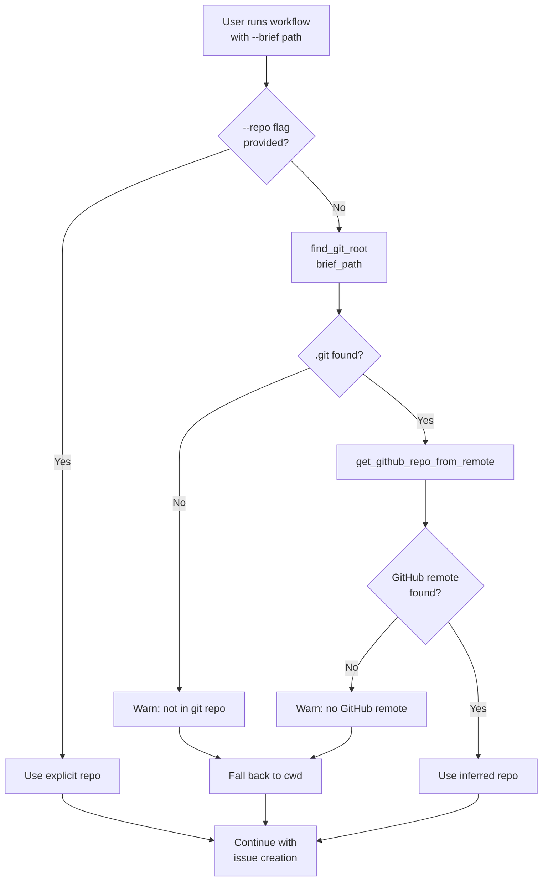

# LLD Finalized

Path: C:\Users\mcwiz\Projects\AgentOS\docs\lld\active\LLD-115.md
Status: APPROVED
Reviews: 1

---

# 115 - Feature: Auto-detect target repo from brief file path

<!-- Template Metadata
Last Updated: 2025-01-15
Updated By: Issue #115 LLD creation
Update Reason: Initial LLD for auto-detecting target repository from brief file path
-->

## 1. Context & Goal
* **Issue:** #115
* **Objective:** Automatically infer the target GitHub repository from the brief file's location instead of defaulting to the current working directory.
* **Status:** Draft
* **Related Issues:** None

### Open Questions
*Questions that need clarification before or during implementation. Remove when resolved.*

- [ ] Should we support bare git repositories (no remote configured)?
- [ ] What should happen if the brief is in a directory with multiple git remotes (origin, upstream, etc.)?

## 2. Proposed Changes

*This section is the **source of truth** for implementation. Describe exactly what will be built.*

### 2.1 Files Changed

| File | Change Type | Description |
|------|-------------|-------------|
| `tools/run_issue_workflow.py` | Modify | Add logic to infer repo from brief path when `--repo` not specified |
| `src/agentos/utils/git_utils.py` | Add | New utility module for git repository detection and parsing |
| `tests/test_git_utils.py` | Add | Unit tests for git utility functions |
| `tests/test_run_issue_workflow.py` | Modify | Add integration tests for repo inference behavior |

### 2.2 Dependencies

*New packages, APIs, or services required.*

```toml
# pyproject.toml additions (if any)
# None - uses standard library and existing git CLI
```

### 2.3 Data Structures

```python
# Pseudocode - NOT implementation
class RepoInfo(TypedDict):
    owner: str       # GitHub repository owner (user or org)
    name: str        # Repository name
    full_name: str   # "owner/name" format
    local_path: Path # Absolute path to repo root
```

### 2.4 Function Signatures

```python
# Signatures only - implementation in source files
def find_git_root(file_path: Path) -> Path | None:
    """Walk up from file_path to find the nearest .git directory.
    
    Returns the directory containing .git, or None if not found.
    """
    ...

def get_github_repo_from_remote(repo_path: Path, remote: str = "origin") -> str | None:
    """Parse git remote URL to extract GitHub repo in 'owner/repo' format.
    
    Supports both HTTPS and SSH URL formats:
    - https://github.com/owner/repo.git
    - git@github.com:owner/repo.git
    
    Returns None if remote not found or not a GitHub URL.
    """
    ...

def infer_repo_from_brief(brief_path: Path) -> tuple[str, Path] | None:
    """Infer GitHub repo and local path from a brief file location.
    
    Returns tuple of (repo_full_name, repo_local_path) or None if cannot infer.
    """
    ...
```

### 2.5 Logic Flow (Pseudocode)

```
1. User runs workflow with --brief /path/to/repo/docs/brief.md
2. Check if --repo flag was explicitly provided
   IF --repo provided THEN
   - Use explicit repo path (existing behavior)
   ELSE
   - Call infer_repo_from_brief(brief_path)
3. In infer_repo_from_brief:
   a. Call find_git_root(brief_path)
   b. IF git root found THEN
      - Call get_github_repo_from_remote(git_root)
      - IF GitHub repo found THEN
        - Return (repo_name, git_root)
      - ELSE
        - Log warning: "Could not determine GitHub repo from git remote"
        - Fall back to cwd
   c. ELSE
      - Log warning: "Brief not in a git repository"
      - Fall back to cwd
4. Continue with issue creation using determined repo
```

### 2.6 Technical Approach

* **Module:** `src/agentos/utils/git_utils.py`
* **Pattern:** Utility functions with graceful degradation
* **Key Decisions:** 
  - Use `subprocess` to call `git remote get-url origin` for reliability
  - Support both SSH and HTTPS remote URL formats
  - Always allow `--repo` flag to override inferred value

### 2.7 Architecture Decisions

*Document key architectural decisions that affect the design. This section addresses the most common category of governance feedback (23 patterns).*

| Decision | Options Considered | Choice | Rationale |
|----------|-------------------|--------|-----------|
| Git info retrieval | GitPython library, subprocess git CLI, manual .git parsing | subprocess git CLI | No new dependency, handles all edge cases git itself handles |
| Remote selection | Always use "origin", configurable remote, try multiple | Always use "origin" | Simplest solution, covers 99% of use cases, matches user expectations |
| Fallback behavior | Error and exit, warn and use cwd, prompt user | Warn and use cwd | Maintains backward compatibility, non-breaking change |

**Architectural Constraints:**
- Must not break existing `--repo` flag behavior
- Must work on Windows, macOS, and Linux
- Must handle paths with spaces and special characters

## 3. Requirements

*What must be true when this is done. These become acceptance criteria.*

1. When `--brief` points to a file inside a git repository with a GitHub remote, the workflow uses that repo as the target
2. When `--repo` is explicitly provided, it overrides any inferred repository
3. When the brief is not in a git repository, the workflow falls back to cwd with a warning
4. When the git repository has no GitHub remote, the workflow falls back to cwd with a warning
5. Both SSH (`git@github.com:owner/repo.git`) and HTTPS (`https://github.com/owner/repo.git`) remote URLs are supported

## 4. Alternatives Considered

| Option | Pros | Cons | Decision |
|--------|------|------|----------|
| Walk up directories looking for .git, parse remote | Works without dependencies, reliable | Requires subprocess call to git | **Selected** |
| Use GitPython library | Rich API, handles edge cases | New dependency, overkill for this use case | Rejected |
| Parse .git/config file directly | No subprocess needed | Complex parsing, may miss edge cases | Rejected |
| Require --repo always | No ambiguity | Poor UX, breaks user expectation | Rejected |

**Rationale:** Using the git CLI via subprocess provides the most reliable behavior without adding dependencies. Git handles all the edge cases (bare repos, worktrees, etc.) automatically.

## 5. Data & Fixtures

*Per [0108-lld-pre-implementation-review.md](0108-lld-pre-implementation-review.md) - complete this section BEFORE implementation.*

### 5.1 Data Sources

| Attribute | Value |
|-----------|-------|
| Source | Local git repository configuration |
| Format | Git remote URL strings |
| Size | Single string per repo |
| Refresh | Real-time (read on each invocation) |
| Copyright/License | N/A |

### 5.2 Data Pipeline

```
Brief file path ──walk up──► .git directory ──git CLI──► Remote URL ──regex parse──► owner/repo
```

### 5.3 Test Fixtures

| Fixture | Source | Notes |
|---------|--------|-------|
| Mock git repo with HTTPS remote | Generated in test setup | Temporary directory with .git |
| Mock git repo with SSH remote | Generated in test setup | Temporary directory with .git |
| Mock non-git directory | Generated in test setup | Directory without .git |

### 5.4 Deployment Pipeline

No special deployment needed. Changes are Python code that will work in any environment with git installed.

**If data source is external:** N/A - all data is local git configuration.

## 6. Diagram
*{Write "N/A" if not applicable - do not delete sections}*

### 6.1 Mermaid Quality Gate

Before finalizing any diagram, verify in [Mermaid Live Editor](https://mermaid.live) or GitHub preview:

- [x] **Simplicity:** Similar components collapsed (per 0006 §8.1)
- [x] **No touching:** All elements have visual separation (per 0006 §8.2)
- [x] **No hidden lines:** All arrows fully visible (per 0006 §8.3)
- [x] **Readable:** Labels not truncated, flow direction clear
- [ ] **Auto-inspected:** Agent rendered via mermaid.ink and viewed (per 0006 §8.5)

**Agent Auto-Inspection (MANDATORY):**

AI agents MUST render and view the diagram before committing:
1. Base64 encode diagram → fetch PNG from `https://mermaid.ink/img/{base64}`
2. Read the PNG file (multimodal inspection)
3. Document results below

**Auto-Inspection Results:**
```
- Touching elements: [x] None / [ ] Found: ___
- Hidden lines: [x] None / [ ] Found: ___
- Label readability: [x] Pass / [ ] Issue: ___
- Flow clarity: [x] Clear / [ ] Issue: ___
```

*Reference: [0006-mermaid-diagrams.md](0006-mermaid-diagrams.md)*

### 6.2 Diagram



## 7. Security & Safety Considerations

*This section addresses security (10 patterns) and safety (9 patterns) concerns from governance feedback.*

### 7.1 Security

| Concern | Mitigation | Status |
|---------|------------|--------|
| Path traversal via brief path | Resolve to absolute path, validate exists | Addressed |
| Command injection via path | Use subprocess with list args, not shell=True | Addressed |
| Arbitrary remote URL parsing | Only extract owner/repo, don't execute URLs | Addressed |

### 7.2 Safety

*Safety concerns focus on preventing data loss, ensuring fail-safe behavior, and protecting system integrity.*

| Concern | Mitigation | Status |
|---------|------------|--------|
| Wrong repo inference | Clear logging of inferred repo before action | Addressed |
| Breaking existing workflows | --repo flag always overrides | Addressed |
| Non-git directories | Graceful fallback to cwd with warning | Addressed |

**Fail Mode:** Fail Open - Falls back to existing cwd behavior rather than erroring out

**Recovery Strategy:** If wrong repo is inferred, user can re-run with explicit `--repo` flag or use `gh issue transfer`

## 8. Performance & Cost Considerations

*This section addresses performance and cost concerns (6 patterns) from governance feedback.*

### 8.1 Performance

| Metric | Budget | Approach |
|--------|--------|----------|
| Latency | < 100ms | Single git subprocess call |
| Memory | < 1MB additional | String manipulation only |
| Disk I/O | Minimal | Only reading .git existence |

**Bottlenecks:** None expected. Git CLI calls are fast and well-optimized.

### 8.2 Cost Analysis

| Resource | Unit Cost | Estimated Usage | Monthly Cost |
|----------|-----------|-----------------|--------------|
| N/A | N/A | N/A | $0 |

**Cost Controls:**
- [x] No external API calls
- [x] No cloud resources used
- [x] Pure local computation

**Worst-Case Scenario:** N/A - feature is purely local computation

## 9. Legal & Compliance

*This section addresses legal concerns (8 patterns) from governance feedback.*

| Concern | Applies? | Mitigation |
|---------|----------|------------|
| PII/Personal Data | No | Only reads git remote URLs |
| Third-Party Licenses | No | Uses system git CLI |
| Terms of Service | No | No external services called |
| Data Retention | No | No data stored |
| Export Controls | No | No restricted algorithms |

**Data Classification:** N/A - feature processes local file paths only

**Compliance Checklist:**
- [x] No PII stored without consent
- [x] All third-party licenses compatible with project license
- [x] External API usage compliant with provider ToS
- [x] Data retention policy documented

## 10. Verification & Testing

*Ref: [0005-testing-strategy-and-protocols.md](0005-testing-strategy-and-protocols.md)*

**Testing Philosophy:** Strive for 100% automated test coverage. Manual tests are a last resort for scenarios that genuinely cannot be automated (e.g., visual inspection, hardware interaction). Every scenario marked "Manual" requires justification.

### 10.1 Test Scenarios

| ID | Scenario | Type | Input | Expected Output | Pass Criteria |
|----|----------|------|-------|-----------------|---------------|
| 010 | Find git root from nested path | Auto | `/repo/a/b/c/file.md` with .git at `/repo` | `/repo` | Returns correct path |
| 020 | Find git root at same level | Auto | `/repo/file.md` with .git at `/repo` | `/repo` | Returns correct path |
| 030 | No git root found | Auto | `/tmp/not-a-repo/file.md` | `None` | Returns None |
| 040 | Parse HTTPS remote URL | Auto | `https://github.com/owner/repo.git` | `owner/repo` | Correct extraction |
| 050 | Parse HTTPS remote URL without .git | Auto | `https://github.com/owner/repo` | `owner/repo` | Correct extraction |
| 060 | Parse SSH remote URL | Auto | `git@github.com:owner/repo.git` | `owner/repo` | Correct extraction |
| 070 | Parse SSH remote URL without .git | Auto | `git@github.com:owner/repo` | `owner/repo` | Correct extraction |
| 080 | Non-GitHub remote URL | Auto | `https://gitlab.com/owner/repo.git` | `None` | Returns None |
| 090 | Explicit --repo overrides inference | Auto | Brief in repo A, --repo points to B | Repo B used | Override works |
| 100 | Infer repo from brief in git repo | Auto | Brief inside git repo with GitHub remote | Correct repo inferred | Full integration |
| 110 | Brief not in git repo falls back | Auto | Brief in non-git directory | Warning + cwd used | Graceful fallback |
| 120 | Brief in repo without GitHub remote | Auto | Brief in git repo, remote is GitLab | Warning + cwd used | Graceful fallback |

*Note: Use 3-digit IDs with gaps of 10 (010, 020, 030...) to allow insertions.*

**Type values:**
- `Auto` - Fully automated, runs in CI (pytest, playwright, etc.)
- `Auto-Live` - Automated but hits real external services (may be slow/flaky)
- `Manual` - Requires human execution (MUST include justification why automation is impossible)

### 10.2 Test Commands

```bash
# Run all automated tests
poetry run pytest tests/test_git_utils.py tests/test_run_issue_workflow.py -v

# Run only fast/mocked tests (exclude live)
poetry run pytest tests/test_git_utils.py -v -m "not live"

# Run specific test scenarios
poetry run pytest tests/test_git_utils.py::test_find_git_root -v
poetry run pytest tests/test_git_utils.py::test_parse_github_remote -v
```

### 10.3 Manual Tests (Only If Unavoidable)

**N/A - All scenarios automated.**

*Full test results recorded in Implementation Report (0103) or Test Report (0113).*

## 11. Risks & Mitigations

| Risk | Impact | Likelihood | Mitigation |
|------|--------|------------|------------|
| Git not installed on system | Med | Low | Check for git availability, provide helpful error message |
| Unusual remote URL format not handled | Low | Low | Regex handles common formats, fallback to cwd |
| User expects different behavior | Med | Low | Clear documentation, logging shows inferred repo |
| Symlinked brief paths | Low | Low | Resolve symlinks before walking up |

## 12. Definition of Done

### Code
- [ ] Implementation complete and linted
- [ ] Code comments reference this LLD

### Tests
- [ ] All test scenarios pass
- [ ] Test coverage meets threshold

### Documentation
- [ ] LLD updated with any deviations
- [ ] Implementation Report (0103) completed
- [ ] Test Report (0113) completed if applicable

### Review
- [ ] Code review completed
- [ ] User approval before closing issue

---

## Appendix: Review Log

*Track all review feedback with timestamps and implementation status.*

### Review Summary

| Review | Date | Verdict | Key Issue |
|--------|------|---------|-----------|
| - | - | - | Awaiting review |

**Final Status:** APPROVED
<!-- Note: This field is auto-updated to APPROVED by the workflow when finalized -->