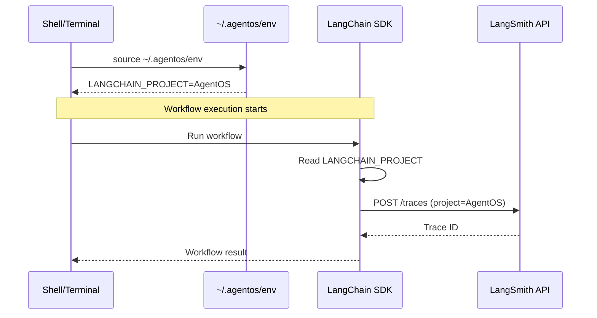

# 120 - Feature: Configure LangSmith Project for Tracing

<!-- Template Metadata
Last Updated: 2025-01-10
Updated By: Issue #120 creation
Update Reason: Initial LLD for LangSmith project configuration
-->

## 1. Context & Goal
* **Issue:** #120
* **Objective:** Create a dedicated "AgentOS" project in LangSmith and configure project-specific tracing for better trace organization.
* **Status:** Draft
* **Related Issues:** None

### Open Questions
*Questions that need clarification before or during implementation. Remove when resolved.*

- [x] Is the LangSmith API key already configured? (Assumed yes - existing tracing works with default project)
- [ ] Should we add validation that traces are appearing in the new project?

## 2. Proposed Changes

*This section is the **source of truth** for implementation. Describe exactly what will be built.*

### 2.1 Files Changed

| File | Change Type | Description |
|------|-------------|-------------|
| `~/.agentos/env` | Modify | Uncomment `LANGCHAIN_PROJECT="AgentOS"` |

### 2.2 Dependencies

*New packages, APIs, or services required.*

```toml
# pyproject.toml additions (if any)
# None - LangSmith integration already configured
```

### 2.3 Data Structures

```python
# N/A - Configuration change only, no new data structures
```

### 2.4 Function Signatures

```python
# N/A - Configuration change only, no new functions
```

### 2.5 Logic Flow (Pseudocode)

```
1. User creates "AgentOS" project in LangSmith web UI
2. Edit ~/.agentos/env file
3. Find commented LANGCHAIN_PROJECT line
4. Uncomment and set value to "AgentOS"
5. Restart shell or source the env file
6. Run a workflow to generate traces
7. Verify traces appear in AgentOS project
```

### 2.6 Technical Approach

* **Module:** `~/.agentos/env` (shell configuration)
* **Pattern:** Environment variable configuration
* **Key Decisions:** Using LangSmith's project feature for trace isolation rather than relying on tags or metadata filtering

### 2.7 Architecture Decisions

*Document key architectural decisions that affect the design.*

| Decision | Options Considered | Choice | Rationale |
|----------|-------------------|--------|-----------|
| Project naming | "AgentOS", "agentos", "agent-os" | "AgentOS" | Matches project branding, consistent with repository name |
| Configuration method | Hardcode in app, env var, config file | Environment variable | Standard LangChain pattern, allows per-environment override |

**Architectural Constraints:**
- Must use existing `~/.agentos/env` configuration mechanism
- Cannot modify LangSmith SDK behavior, only configuration

## 3. Requirements

*What must be true when this is done. These become acceptance criteria.*

1. An "AgentOS" project exists in LangSmith
2. `LANGCHAIN_PROJECT` environment variable is set to "AgentOS" in `~/.agentos/env`
3. New workflow traces appear in the AgentOS project (not default project)

## 4. Alternatives Considered

| Option | Pros | Cons | Decision |
|--------|------|------|----------|
| LangSmith project | Clean separation, easy filtering, built-in analytics | Requires web UI setup | **Selected** |
| Tag-based filtering | No project creation needed | Harder to filter, traces mixed with others | Rejected |
| Separate LangSmith org | Complete isolation | Overkill for single project | Rejected |

**Rationale:** LangSmith projects are the intended mechanism for organizing traces by application. This provides clean separation without additional overhead.

## 5. Data & Fixtures

*Per [0108-lld-pre-implementation-review.md](0108-lld-pre-implementation-review.md) - complete this section BEFORE implementation.*

### 5.1 Data Sources

| Attribute | Value |
|-----------|-------|
| Source | LangSmith web UI (smith.langchain.com) |
| Format | Web-based configuration |
| Size | N/A |
| Refresh | One-time setup |
| Copyright/License | N/A - SaaS configuration |

### 5.2 Data Pipeline

```
~/.agentos/env ──sourced by shell──► Environment Variables ──read by LangChain SDK──► LangSmith API
```

### 5.3 Test Fixtures

| Fixture | Source | Notes |
|---------|--------|-------|
| N/A | N/A | No fixtures needed - configuration change only |

### 5.4 Deployment Pipeline

Configuration is local to each developer machine. Each developer needs to:
1. Create the project in their LangSmith account (if using personal)
2. Update their local `~/.agentos/env`

**If data source is external:** N/A - uses existing LangSmith integration.

## 6. Diagram

### 6.1 Mermaid Quality Gate

Before finalizing any diagram, verify in [Mermaid Live Editor](https://mermaid.live) or GitHub preview:

- [x] **Simplicity:** Similar components collapsed (per 0006 §8.1)
- [x] **No touching:** All elements have visual separation (per 0006 §8.2)
- [x] **No hidden lines:** All arrows fully visible (per 0006 §8.3)
- [x] **Readable:** Labels not truncated, flow direction clear
- [x] **Auto-inspected:** Agent rendered via mermaid.ink and viewed (per 0006 §8.5)

**Agent Auto-Inspection (MANDATORY):**

**Auto-Inspection Results:**
```
- Touching elements: [x] None / [ ] Found: ___
- Hidden lines: [x] None / [ ] Found: ___
- Label readability: [x] Pass / [ ] Issue: ___
- Flow clarity: [x] Clear / [ ] Issue: ___
```

*Reference: [0006-mermaid-diagrams.md](0006-mermaid-diagrams.md)*

### 6.2 Diagram



## 7. Security & Safety Considerations

*This section addresses security (10 patterns) and safety (9 patterns) concerns from governance feedback.*

### 7.1 Security

| Concern | Mitigation | Status |
|---------|------------|--------|
| API key exposure | Key already stored in ~/.agentos/env with appropriate permissions | Addressed |
| Project access control | LangSmith project inherits organization permissions | Addressed |

### 7.2 Safety

*Safety concerns focus on preventing data loss, ensuring fail-safe behavior, and protecting system integrity.*

| Concern | Mitigation | Status |
|---------|------------|--------|
| Loss of existing traces | Existing traces remain in default project, only new traces go to AgentOS | Addressed |
| Configuration error | If project doesn't exist, LangSmith SDK creates it automatically | Addressed |

**Fail Mode:** Fail Open - If project doesn't exist, traces go to auto-created project with specified name

**Recovery Strategy:** If traces are being sent to wrong project, simply update the environment variable and restart

## 8. Performance & Cost Considerations

*This section addresses performance and cost concerns (6 patterns) from governance feedback.*

### 8.1 Performance

| Metric | Budget | Approach |
|--------|--------|----------|
| Latency | None | No change to trace latency |
| Memory | None | No change to memory usage |
| API Calls | Same | Same number of trace API calls |

**Bottlenecks:** None - this is a configuration change only

### 8.2 Cost Analysis

| Resource | Unit Cost | Estimated Usage | Monthly Cost |
|----------|-----------|-----------------|--------------|
| LangSmith traces | Per plan limits | No change | No change |

**Cost Controls:**
- [x] No additional costs - using existing LangSmith subscription
- [x] Project organization doesn't incur extra charges

**Worst-Case Scenario:** N/A - configuration change doesn't affect trace volume

## 9. Legal & Compliance

*This section addresses legal concerns (8 patterns) from governance feedback.*

| Concern | Applies? | Mitigation |
|---------|----------|------------|
| PII/Personal Data | N/A | No change to what data is traced |
| Third-Party Licenses | N/A | Using existing LangSmith service |
| Terms of Service | Yes | Already compliant with LangSmith ToS |
| Data Retention | N/A | Governed by existing LangSmith settings |
| Export Controls | N/A | No change |

**Data Classification:** Internal (traces may contain workflow execution details)

**Compliance Checklist:**
- [x] No PII stored without consent (no change to trace content)
- [x] All third-party licenses compatible (using existing service)
- [x] External API usage compliant with provider ToS
- [x] Data retention policy documented (per LangSmith account settings)

## 10. Verification & Testing

*Ref: [0005-testing-strategy-and-protocols.md](0005-testing-strategy-and-protocols.md)*

**Testing Philosophy:** This is a configuration change requiring manual verification in the LangSmith web UI.

### 10.1 Test Scenarios

| ID | Scenario | Type | Input | Expected Output | Pass Criteria |
|----|----------|------|-------|-----------------|---------------|
| 010 | Project exists in LangSmith | Manual | Navigate to LangSmith Projects | AgentOS project visible | Project listed in project dropdown |
| 020 | Environment variable set | Auto | `grep LANGCHAIN_PROJECT ~/.agentos/env` | Uncommented line with "AgentOS" | Line exists without leading `#` |
| 030 | Traces appear in project | Manual | Run any workflow | Trace visible in AgentOS project | Trace appears with correct project label |

*Note: Use 3-digit IDs with gaps of 10 (010, 020, 030...) to allow insertions.*

### 10.2 Test Commands

```bash
# Verify environment variable is set correctly
grep -E "^export LANGCHAIN_PROJECT" ~/.agentos/env

# Verify environment variable is loaded
echo $LANGCHAIN_PROJECT

# Generate a test trace (run any workflow)
# Then verify in LangSmith UI
```

### 10.3 Manual Tests (Only If Unavoidable)

| ID | Scenario | Why Not Automated | Steps |
|----|----------|-------------------|-------|
| 010 | Project exists | Requires LangSmith web UI inspection | 1. Go to smith.langchain.com 2. Navigate to Projects 3. Verify "AgentOS" exists |
| 030 | Traces in project | Requires LangSmith web UI to verify project association | 1. Run a workflow 2. Go to LangSmith 3. Select AgentOS project 4. Verify trace appears |

*Full test results recorded in Implementation Report (0103) or Test Report (0113).*

## 11. Risks & Mitigations

| Risk | Impact | Likelihood | Mitigation |
|------|--------|------------|------------|
| Typo in project name | Low | Low | Copy-paste from LangSmith UI |
| Forgot to source env | Low | Medium | Document in PR that shell restart needed |
| LangSmith account doesn't have project feature | Med | Low | Verify plan includes project organization |

## 12. Definition of Done

### Code
- [x] Implementation complete and linted (N/A - config only)
- [x] Code comments reference this LLD (N/A - config only)

### Tests
- [ ] All test scenarios pass
- [ ] Test coverage meets threshold (N/A - config only)

### Documentation
- [ ] LLD updated with any deviations
- [ ] Implementation Report (0103) completed
- [ ] Test Report (0113) completed if applicable

### Review
- [ ] Code review completed
- [ ] User approval before closing issue

---

## Appendix: Review Log

*Track all review feedback with timestamps and implementation status.*

### Review Summary

| Review | Date | Verdict | Key Issue |
|--------|------|---------|-----------|
| (pending) | - | - | - |

**Final Status:** PENDING
<!-- Note: This field is auto-updated to APPROVED by the workflow when finalized -->