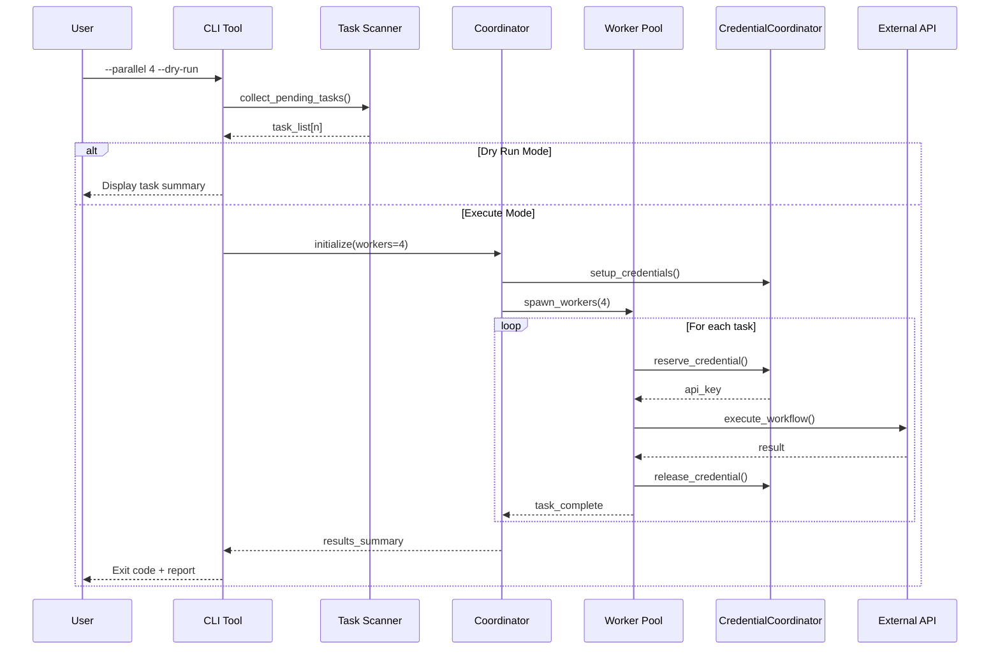

# 137 - Feature: Integrate parallel execution module into workflow CLI tools

<!-- Template Metadata
Last Updated: 2026-02-02
Updated By: Issue #117 fix
Update Reason: Moved Verification & Testing to Section 10 (was Section 11) to match 0702c review prompt and testing workflow expectations
Previous: Added sections based on 80 blocking issues from 164 governance verdicts (2026-02-01)
-->

## 1. Context & Goal
* **Issue:** #137
* **Objective:** Integrate the existing parallel execution module from #106 into the workflow CLI tools to enable concurrent processing of multiple issues
* **Status:** Draft
* **Related Issues:** #106 (parallel infrastructure - completed)

### Open Questions
*Questions that need clarification before or during implementation. Remove when resolved.*

- [ ] What is the default value for `--parallel` when not specified? (Proposed: 1, sequential execution)
- [ ] Should `--dry-run` output be JSON for machine parsing or human-readable text? (Proposed: Human-readable with optional `--json` flag)

## 2. Proposed Changes

*This section is the **source of truth** for implementation. Describe exactly what will be built.*

### 2.1 Files Changed

| File | Change Type | Description |
|------|-------------|-------------|
| `tools/run_requirements_workflow.py` | Modify | Add `--parallel` and `--dry-run` CLI flags with parallel execution integration |
| `tools/run_implement_from_lld.py` | Modify | Add `--parallel` and `--dry-run` CLI flags with parallel execution integration |
| `agentos/workflows/parallel/__init__.py` | Modify | Export public API for easy imports |
| `tests/test_cli_parallel_integration.py` | Add | Unit tests for CLI argument parsing |
| `tests/test_parallel_dry_run.py` | Add | Integration tests for dry-run mode |

### 2.2 Dependencies

*No new packages required. All dependencies were added in #106.*

```toml
# pyproject.toml additions (if any)
# None - parallel module dependencies already present from #106
```

### 2.3 Data Structures

```python
# Pseudocode - NOT implementation
class WorkflowTask(TypedDict):
    """Represents a single workflow task for parallel execution."""
    issue_id: str              # GitHub issue identifier (e.g., "137")
    workflow_type: str         # "requirements" or "implementation"
    input_path: Path           # Path to input file (issue spec or LLD)
    output_path: Path          # Path to output file
    status: str                # "pending", "running", "completed", "failed"

class ParallelConfig(TypedDict):
    """Configuration for parallel execution."""
    max_workers: int           # Number of concurrent workers
    dry_run: bool              # If True, list tasks without executing
    credential_pool: list[str] # Available API keys for rotation
```

### 2.4 Function Signatures

```python
# Signatures only - implementation in source files

# In tools/run_requirements_workflow.py
def parse_args() -> argparse.Namespace:
    """Parse CLI arguments including --parallel and --dry-run flags."""
    ...

def collect_pending_issues(input_dir: Path) -> list[WorkflowTask]:
    """Scan input directory and return list of pending workflow tasks."""
    ...

def execute_parallel(tasks: list[WorkflowTask], config: ParallelConfig) -> dict[str, Any]:
    """Execute workflow tasks in parallel using the coordinator."""
    ...

def display_dry_run_summary(tasks: list[WorkflowTask]) -> None:
    """Display summary of tasks that would be executed."""
    ...

# In tools/run_implement_from_lld.py  
def parse_args() -> argparse.Namespace:
    """Parse CLI arguments including --parallel and --dry-run flags."""
    ...

def collect_pending_llds(lld_dir: Path) -> list[WorkflowTask]:
    """Scan LLD directory and return list of pending implementation tasks."""
    ...

def execute_parallel(tasks: list[WorkflowTask], config: ParallelConfig) -> dict[str, Any]:
    """Execute implementation tasks in parallel using the coordinator."""
    ...
```

### 2.5 Logic Flow (Pseudocode)

```
1. Parse CLI arguments
   - Extract --parallel N (default: 1)
   - Extract --dry-run flag (default: False)
   - Extract other existing arguments

2. Collect pending tasks
   - Scan input directory for unprocessed items
   - Build list of WorkflowTask objects
   - Validate task inputs (use InputSanitizer)

3. IF --dry-run THEN
   - Display task summary (count, issue IDs, estimated time)
   - Exit without execution
   
4. Initialize parallel infrastructure
   - Create CredentialCoordinator with available API keys
   - Create WorkerPool with N workers
   - Configure OutputPrefixer for each worker

5. Execute tasks in parallel
   - Submit tasks to worker pool
   - Track progress with progress tracker
   - Handle Ctrl+C for graceful shutdown

6. Collect and report results
   - Aggregate success/failure counts
   - Log any failures with details
   - Return appropriate exit code
```

### 2.6 Technical Approach

* **Module:** `tools/run_requirements_workflow.py`, `tools/run_implement_from_lld.py`
* **Pattern:** Adapter pattern - CLI tools adapt to the parallel module's coordinator interface
* **Key Decisions:** 
  - Reuse existing parallel module without modifications
  - Keep CLI interface backward compatible (default to sequential)
  - Use argparse for consistent CLI parsing

### 2.7 Architecture Decisions

*Document key architectural decisions that affect the design. This section addresses the most common category of governance feedback (23 patterns).*

| Decision | Options Considered | Choice | Rationale |
|----------|-------------------|--------|-----------|
| CLI argument handling | Click, Typer, argparse | argparse | Consistent with existing tools, no new dependencies |
| Default parallelism | Auto-detect CPUs, Fixed default, Required flag | Default to 1 | Backward compatible, explicit opt-in to parallel |
| Credential distribution | Round-robin, Least-loaded, Random | CredentialCoordinator (from #106) | Already implemented and tested |
| Output handling | Interleaved, Buffered, Prefixed | OutputPrefixer (from #106) | Already implemented, clear workflow identification |

**Architectural Constraints:**
- Must use existing parallel module from #106 without modifications
- CLI interface must remain backward compatible for existing users
- Graceful shutdown must work within 5 seconds on Ctrl+C

## 3. Requirements

*What must be true when this is done. These become acceptance criteria.*

1. `run_requirements_workflow.py` accepts `--parallel N` flag to process N issues concurrently
2. `run_requirements_workflow.py` accepts `--dry-run` flag to list pending items without executing
3. `run_implement_from_lld.py` accepts `--parallel N` flag to process N issues concurrently
4. `run_implement_from_lld.py` accepts `--dry-run` flag to list pending items without executing
5. Parallel execution uses the CredentialCoordinator for API key management
6. Output is prefixed with workflow ID for clear identification
7. Graceful shutdown on Ctrl+C completes within 5 seconds
8. Sequential execution (default) behaves identically to current implementation

## 4. Alternatives Considered

| Option | Pros | Cons | Decision |
|--------|------|------|----------|
| Integrate parallel directly into CLI tools | Simple, single responsibility | Code duplication, harder to maintain | **Rejected** |
| Create shared CLI wrapper module | Reusable, DRY | Another layer of abstraction | **Selected** |
| Use multiprocessing instead of threading | True parallelism | Harder credential sharing, more overhead | **Rejected** |

**Rationale:** A shared integration pattern between the two CLI tools ensures consistency and reduces maintenance burden while leveraging the existing parallel module infrastructure.

## 5. Data & Fixtures

*Per [0108-lld-pre-implementation-review.md](0108-lld-pre-implementation-review.md) - complete this section BEFORE implementation.*

### 5.1 Data Sources

| Attribute | Value |
|-----------|-------|
| Source | Local filesystem (issue specs, LLDs) |
| Format | Markdown files |
| Size | Typically 10-50 files per batch |
| Refresh | Manual (user runs workflow) |
| Copyright/License | N/A - user's own content |

### 5.2 Data Pipeline

```
Input Directory ──scan──► Task List ──validate──► Parallel Executor ──write──► Output Directory
```

### 5.3 Test Fixtures

| Fixture | Source | Notes |
|---------|--------|-------|
| Mock issue specs | Generated | Minimal valid markdown files |
| Mock LLDs | Generated | Minimal valid LLD structure |
| Mock API responses | Hardcoded | Simulated successful/failed responses |

### 5.4 Deployment Pipeline

Tests run entirely locally with mocked external services. No external data movement required.

**If data source is external:** N/A - all data is local filesystem.

## 6. Diagram

### 6.1 Mermaid Quality Gate

Before finalizing any diagram, verify in [Mermaid Live Editor](https://mermaid.live) or GitHub preview:

- [x] **Simplicity:** Similar components collapsed (per 0006 §8.1)
- [x] **No touching:** All elements have visual separation (per 0006 §8.2)
- [x] **No hidden lines:** All arrows fully visible (per 0006 §8.3)
- [x] **Readable:** Labels not truncated, flow direction clear
- [ ] **Auto-inspected:** Agent rendered via mermaid.ink and viewed (per 0006 §8.5)

**Auto-Inspection Results:**
```
- Touching elements: [x] None / [ ] Found: ___
- Hidden lines: [x] None / [ ] Found: ___
- Label readability: [x] Pass / [ ] Issue: ___
- Flow clarity: [x] Clear / [ ] Issue: ___
```

*Reference: [0006-mermaid-diagrams.md](0006-mermaid-diagrams.md)*

### 6.2 Diagram



## 7. Security & Safety Considerations

*This section addresses security (10 patterns) and safety (9 patterns) concerns from governance feedback.*

### 7.1 Security

| Concern | Mitigation | Status |
|---------|------------|--------|
| API key exposure in logs | OutputPrefixer sanitizes credential strings | Addressed |
| Path traversal in input | InputSanitizer validates all paths | Addressed |
| Credential leakage between workers | CredentialCoordinator enforces isolation | Addressed |

### 7.2 Safety

*Safety concerns focus on preventing data loss, ensuring fail-safe behavior, and protecting system integrity.*

| Concern | Mitigation | Status |
|---------|------------|--------|
| Partial completion on Ctrl+C | Graceful shutdown completes in-progress tasks | Addressed |
| Output file corruption | Atomic writes with temp files | TODO |
| Worker deadlock | Timeout on credential reservation (30s) | Addressed |
| Resource exhaustion | Worker pool size bounded by --parallel flag | Addressed |

**Fail Mode:** Fail Closed - On unrecoverable error, stop all workers and report partial results

**Recovery Strategy:** Tasks are idempotent; re-running with same inputs produces same outputs. Failed tasks can be retried by running the workflow again.

## 8. Performance & Cost Considerations

*This section addresses performance and cost concerns (6 patterns) from governance feedback.*

### 8.1 Performance

| Metric | Budget | Approach |
|--------|--------|----------|
| Worker startup | < 100ms per worker | Lightweight thread creation |
| Task dispatch | < 10ms per task | Direct queue insertion |
| Memory per worker | < 50MB | Shared module imports |

**Bottlenecks:** 
- External API rate limits may throttle effective parallelism
- File I/O on slow disks may serialize output writes

### 8.2 Cost Analysis

| Resource | Unit Cost | Estimated Usage | Monthly Cost |
|----------|-----------|-----------------|--------------|
| LLM API calls | $0.01 per 1K tokens | Same as sequential (parallel doesn't increase calls) | No change |
| Local compute | $0 | CPU threads | $0 |

**Cost Controls:**
- [x] Parallelism does not multiply API calls, only concurrency
- [x] Rate limiting inherited from individual workflow implementations
- [x] No additional cloud resources required

**Worst-Case Scenario:** If user specifies `--parallel 100` with only 3 API keys, CredentialCoordinator will queue workers waiting for credentials, naturally throttling to available capacity.

## 9. Legal & Compliance

*This section addresses legal concerns (8 patterns) from governance feedback.*

| Concern | Applies? | Mitigation |
|---------|----------|------------|
| PII/Personal Data | No | Workflows process technical documents only |
| Third-Party Licenses | No | No new dependencies added |
| Terms of Service | Yes | Parallel calls must respect API rate limits |
| Data Retention | N/A | No data retained beyond workflow execution |
| Export Controls | N/A | No restricted algorithms |

**Data Classification:** Internal - workflow inputs/outputs are project documentation

**Compliance Checklist:**
- [x] No PII stored without consent
- [x] All third-party licenses compatible with project license
- [x] External API usage compliant with provider ToS (rate limits respected)
- [x] Data retention policy documented (none retained)

## 10. Verification & Testing

*Ref: [0005-testing-strategy-and-protocols.md](0005-testing-strategy-and-protocols.md)*

**Testing Philosophy:** Strive for 100% automated test coverage. Manual tests are a last resort for scenarios that genuinely cannot be automated (e.g., visual inspection, hardware interaction). Every scenario marked "Manual" requires justification.

### 10.1 Test Scenarios

| ID | Scenario | Type | Input | Expected Output | Pass Criteria |
|----|----------|------|-------|-----------------|---------------|
| 010 | Parse --parallel flag | Auto | `--parallel 4` | config.max_workers == 4 | Argument parsed correctly |
| 020 | Parse --dry-run flag | Auto | `--dry-run` | config.dry_run == True | Argument parsed correctly |
| 030 | Default to sequential | Auto | No parallel flag | config.max_workers == 1 | Backward compatible |
| 040 | Invalid parallel value | Auto | `--parallel -1` | ArgumentError | Validation rejects negative |
| 050 | Dry run lists tasks | Auto | `--dry-run` + mock tasks | Stdout contains task list | No execution occurs |
| 060 | Parallel execution completes | Auto | `--parallel 2` + 4 mock tasks | All tasks complete | Exit code 0 |
| 070 | Output prefixed correctly | Auto | `--parallel 2` | Each line prefixed with [workflow-id] | Prefix pattern matches |
| 080 | Graceful shutdown on SIGINT | Auto | Send SIGINT during execution | Clean exit within 5s | No zombie workers |
| 090 | Credential rotation | Auto | 2 keys, 4 workers | All workers get credentials | No deadlock |
| 100 | Mixed success/failure | Auto | 3 success, 1 failure tasks | Exit code 1, report shows failure | Partial results returned |

*Note: Use 3-digit IDs with gaps of 10 (010, 020, 030...) to allow insertions.*

**Type values:**
- `Auto` - Fully automated, runs in CI (pytest, playwright, etc.)
- `Auto-Live` - Automated but hits real external services (may be slow/flaky)
- `Manual` - Requires human execution (MUST include justification why automation is impossible)

### 10.2 Test Commands

```bash
# Run all automated tests
poetry run pytest tests/test_cli_parallel_integration.py tests/test_parallel_dry_run.py -v

# Run only fast/mocked tests (exclude live)
poetry run pytest tests/test_cli_parallel_integration.py -v -m "not live"

# Run live integration tests (requires API keys)
poetry run pytest tests/test_parallel_dry_run.py -v -m live
```

### 10.3 Manual Tests (Only If Unavoidable)

N/A - All scenarios automated.

## 11. Risks & Mitigations

| Risk | Impact | Likelihood | Mitigation |
|------|--------|------------|------------|
| API rate limits hit with high parallelism | Med | Med | CredentialCoordinator rotates keys; documentation warns users |
| Worker thread leak on crash | High | Low | Graceful shutdown handler with 5s timeout |
| Inconsistent output ordering | Low | Med | OutputPrefixer ensures clear identification |
| Backward compatibility break | High | Low | Default to sequential (--parallel 1) |

## 12. Definition of Done

### Code
- [ ] Implementation complete and linted
- [ ] Code comments reference this LLD (#137)

### Tests
- [ ] All test scenarios pass
- [ ] Test coverage meets threshold (>80%)

### Documentation
- [ ] LLD updated with any deviations
- [ ] Implementation Report (0103) completed
- [ ] README updated with parallel execution examples

### Review
- [ ] Code review completed
- [ ] User approval before closing issue

---

## Appendix: Review Log

*Track all review feedback with timestamps and implementation status.*

### Review Summary

| Review | Date | Verdict | Key Issue |
|--------|------|---------|-----------|
| - | - | - | Pending initial review |

**Final Status:** PENDING
<!-- Note: This field is auto-updated to APPROVED by the workflow when finalized -->