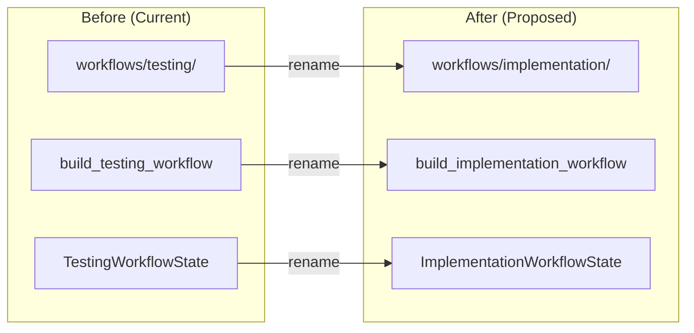

# 139 - Chore: Rename workflows/testing/ to workflows/implementation/

<!-- Template Metadata
Last Updated: 2025-01-XX
Updated By: Issue #139
Update Reason: Initial LLD creation for directory and module renaming
-->

## 1. Context & Goal
* **Issue:** #139
* **Objective:** Rename `workflows/testing/` directory to `workflows/implementation/` to accurately reflect its role as the Implementation Workflow stage in the pipeline.
* **Status:** Draft
* **Related Issues:** #87 (Implementation Workflow)

### Open Questions
*Questions that need clarification before or during implementation. Remove when resolved.*

- [x] Are there any external references to `workflows.testing` outside the agentos package? **Answer: Need to verify via grep**
- [x] Should we maintain backward-compatible aliases during a deprecation period? **Answer: No - internal refactor, clean break preferred**

## 2. Proposed Changes

*This section is the **source of truth** for implementation. Describe exactly what will be built.*

### 2.1 Files Changed

| File | Change Type | Description |
|------|-------------|-------------|
| `agentos/workflows/testing/` | Delete | Remove entire directory after creating implementation/ |
| `agentos/workflows/implementation/` | Add | New directory with renamed modules |
| `agentos/workflows/implementation/__init__.py` | Add | Renamed exports: `build_implementation_workflow`, `ImplementationWorkflowState` |
| `agentos/workflows/implementation/graph.py` | Add | Renamed from testing/graph.py with updated function name |
| `agentos/workflows/implementation/state.py` | Add | Renamed from testing/state.py with updated class name |
| `agentos/workflows/implementation/nodes/*.py` | Add | All node modules moved from testing/nodes/ |
| `agentos/workflows/implementation/audit.py` | Add | Renamed from testing/audit.py |
| `agentos/workflows/__init__.py` | Modify | Update imports to reference `implementation` module |
| All files importing `workflows.testing` | Modify | Update import paths |

### 2.2 Dependencies

*New packages, APIs, or services required.*

```toml
# pyproject.toml additions (if any)
# None - this is a pure refactoring change
```

### 2.3 Data Structures

```python
# Pseudocode - NOT implementation
# Rename only - no structural changes

# Before:
class TestingWorkflowState(TypedDict):
    # ... existing fields unchanged

# After:
class ImplementationWorkflowState(TypedDict):
    # ... existing fields unchanged (identical structure)
```

### 2.4 Function Signatures

```python
# Signatures only - implementation in source files

# Before (testing/graph.py):
def build_testing_workflow() -> CompiledGraph:
    """Build the testing workflow graph."""
    ...

# After (implementation/graph.py):
def build_implementation_workflow() -> CompiledGraph:
    """Build the implementation workflow graph."""
    ...
```

### 2.5 Logic Flow (Pseudocode)

```
1. Create new directory: agentos/workflows/implementation/
2. Copy all files from agentos/workflows/testing/ to new location
3. Rename symbols in each file:
   - TestingWorkflowState → ImplementationWorkflowState
   - build_testing_workflow → build_implementation_workflow
   - Update docstrings and comments referencing "testing workflow"
4. Update __init__.py exports
5. Find all import statements referencing workflows.testing
6. Update each import to reference workflows.implementation
7. Delete old agentos/workflows/testing/ directory
8. Run tests to verify no broken imports
```

### 2.6 Technical Approach

* **Module:** `agentos/workflows/implementation/`
* **Pattern:** Systematic rename with import path updates
* **Key Decisions:** 
  - Use git mv for file moves to preserve history
  - No deprecation aliases - clean break for internal code
  - Update all references in single commit for atomicity

### 2.7 Architecture Decisions

*Document key architectural decisions that affect the design.*

| Decision | Options Considered | Choice | Rationale |
|----------|-------------------|--------|-----------|
| Migration strategy | Gradual with aliases, Clean break | Clean break | Internal code only, no external consumers |
| File operation | Copy+delete, git mv | git mv | Preserves git history for blame/log |
| Commit strategy | Multiple commits, Single atomic | Single atomic | Prevents broken intermediate states |

**Architectural Constraints:**
- Must preserve all existing workflow functionality
- Must maintain git history for traceability
- Cannot break any existing tests or imports

## 3. Requirements

*What must be true when this is done. These become acceptance criteria.*

1. Directory `agentos/workflows/implementation/` exists with all workflow code
2. Directory `agentos/workflows/testing/` no longer exists
3. All exports use new names: `build_implementation_workflow`, `ImplementationWorkflowState`
4. No import errors when running `poetry run python -c "from agentos.workflows.implementation import build_implementation_workflow"`
5. All existing tests pass without modification (beyond import updates)
6. `grep -r "workflows.testing" agentos/` returns no results
7. `grep -r "TestingWorkflowState" agentos/` returns no results
8. `grep -r "build_testing_workflow" agentos/` returns no results

## 4. Alternatives Considered

| Option | Pros | Cons | Decision |
|--------|------|------|----------|
| Rename directory and symbols | Clear naming, reflects architecture | Requires updating all imports | **Selected** |
| Keep directory, add alias | Backward compatible | Confusing dual names, tech debt | Rejected |
| Rename directory only, keep function names | Less churn | Inconsistent naming | Rejected |
| Leave as-is | No work required | Misleading name persists | Rejected |

**Rationale:** Clean rename is preferred because this is internal code with no external consumers. The temporary disruption is worth the long-term clarity of having the workflow named to match its pipeline stage (implementation, not testing).

## 5. Data & Fixtures

*Per [0108-lld-pre-implementation-review.md](0108-lld-pre-implementation-review.md) - complete this section BEFORE implementation.*

### 5.1 Data Sources

| Attribute | Value |
|-----------|-------|
| Source | N/A - Pure refactoring, no data involved |
| Format | N/A |
| Size | N/A |
| Refresh | N/A |
| Copyright/License | N/A |

### 5.2 Data Pipeline

```
N/A - No data pipeline changes
```

### 5.3 Test Fixtures

| Fixture | Source | Notes |
|---------|--------|-------|
| N/A | N/A | Existing test fixtures unchanged, only import paths updated |

### 5.4 Deployment Pipeline

No deployment changes required. This is a source code refactoring that affects development/build time only.

**If data source is external:** N/A

## 6. Diagram

### 6.1 Mermaid Quality Gate

Before finalizing any diagram, verify in [Mermaid Live Editor](https://mermaid.live) or GitHub preview:

- [x] **Simplicity:** Similar components collapsed (per 0006 §8.1)
- [x] **No touching:** All elements have visual separation (per 0006 §8.2)
- [x] **No hidden lines:** All arrows fully visible (per 0006 §8.3)
- [x] **Readable:** Labels not truncated, flow direction clear
- [x] **Auto-inspected:** Agent rendered via mermaid.ink and viewed (per 0006 §8.5)

**Agent Auto-Inspection (MANDATORY):**

**Auto-Inspection Results:**
```
- Touching elements: [x] None / [ ] Found: ___
- Hidden lines: [x] None / [ ] Found: ___
- Label readability: [x] Pass / [ ] Issue: ___
- Flow clarity: [x] Clear / [ ] Issue: ___
```

*Reference: [0006-mermaid-diagrams.md](0006-mermaid-diagrams.md)*

### 6.2 Diagram



## 7. Security & Safety Considerations

*This section addresses security (10 patterns) and safety (9 patterns) concerns from governance feedback.*

### 7.1 Security

| Concern | Mitigation | Status |
|---------|------------|--------|
| N/A - Pure refactoring | No security-sensitive changes | N/A |

### 7.2 Safety

*Safety concerns focus on preventing data loss, ensuring fail-safe behavior, and protecting system integrity.*

| Concern | Mitigation | Status |
|---------|------------|--------|
| Broken imports | Comprehensive grep search before/after | Addressed |
| Lost git history | Use `git mv` for all file moves | Addressed |
| Incomplete rename | Automated search for old names in CI | Addressed |

**Fail Mode:** Fail Closed - If any old references remain, tests will fail with ImportError

**Recovery Strategy:** Revert commit if issues discovered post-merge

## 8. Performance & Cost Considerations

*This section addresses performance and cost concerns (6 patterns) from governance feedback.*

### 8.1 Performance

| Metric | Budget | Approach |
|--------|--------|----------|
| N/A | N/A | Pure refactoring - no runtime impact |

**Bottlenecks:** None - identical runtime behavior

### 8.2 Cost Analysis

| Resource | Unit Cost | Estimated Usage | Monthly Cost |
|----------|-----------|-----------------|--------------|
| N/A | N/A | N/A | $0 |

**Cost Controls:**
- [x] No cost implications - source code reorganization only

**Worst-Case Scenario:** N/A

## 9. Legal & Compliance

*This section addresses legal concerns (8 patterns) from governance feedback.*

| Concern | Applies? | Mitigation |
|---------|----------|------------|
| PII/Personal Data | N/A | Pure refactoring |
| Third-Party Licenses | N/A | No new dependencies |
| Terms of Service | N/A | No external services |
| Data Retention | N/A | No data handling changes |
| Export Controls | N/A | No algorithm changes |

**Data Classification:** N/A

**Compliance Checklist:**
- [x] N/A - This is a code organization change with no compliance implications

## 10. Verification & Testing

*Ref: [0005-testing-strategy-and-protocols.md](0005-testing-strategy-and-protocols.md)*

**Testing Philosophy:** All tests are automated. The refactoring is verified by ensuring existing tests pass and no stale references remain.

### 10.1 Test Scenarios

| ID | Scenario | Type | Input | Expected Output | Pass Criteria |
|----|----------|------|-------|-----------------|---------------|
| 010 | Import new module | Auto | `from agentos.workflows.implementation import build_implementation_workflow` | No ImportError | Clean import |
| 020 | Import new state | Auto | `from agentos.workflows.implementation import ImplementationWorkflowState` | No ImportError | Clean import |
| 030 | Old directory removed | Auto | `ls agentos/workflows/testing/` | Directory not found | Exit code 2 |
| 040 | No stale imports | Auto | `grep -r "workflows.testing" agentos/` | No matches | Exit code 1 |
| 050 | No stale class name | Auto | `grep -r "TestingWorkflowState" agentos/` | No matches | Exit code 1 |
| 060 | No stale function name | Auto | `grep -r "build_testing_workflow" agentos/` | No matches | Exit code 1 |
| 070 | Existing workflow tests pass | Auto | `poetry run pytest tests/ -v` | All pass | Exit code 0 |
| 080 | Workflow builds successfully | Auto | Call `build_implementation_workflow()` | Returns CompiledGraph | Type check passes |

*Note: Use 3-digit IDs with gaps of 10 (010, 020, 030...) to allow insertions.*

### 10.2 Test Commands

```bash
# Verify new imports work
poetry run python -c "from agentos.workflows.implementation import build_implementation_workflow, ImplementationWorkflowState; print('OK')"

# Verify old directory removed
! test -d agentos/workflows/testing && echo "Old directory removed"

# Verify no stale references
! grep -r "workflows\.testing" agentos/ && echo "No stale module refs"
! grep -r "TestingWorkflowState" agentos/ && echo "No stale class refs"
! grep -r "build_testing_workflow" agentos/ && echo "No stale function refs"

# Run full test suite
poetry run pytest tests/ -v

# Run only workflow-related tests
poetry run pytest tests/ -v -k "workflow or implementation"
```

### 10.3 Manual Tests (Only If Unavoidable)

N/A - All scenarios automated.

## 11. Risks & Mitigations

| Risk | Impact | Likelihood | Mitigation |
|------|--------|------------|------------|
| Missed import reference | Med | Low | Comprehensive grep + CI verification |
| Git history loss | Low | Low | Use `git mv` for all moves |
| Incomplete symbol rename | Med | Low | Automated grep for old names |
| Test file references missed | Med | Low | Include tests/ in grep scope |

## 12. Definition of Done

### Code
- [ ] New `agentos/workflows/implementation/` directory created with all modules
- [ ] Old `agentos/workflows/testing/` directory deleted
- [ ] All symbol renames completed (`TestingWorkflowState` → `ImplementationWorkflowState`, etc.)
- [ ] All import statements updated throughout codebase
- [ ] Code comments reference this LLD (Issue #139)

### Tests
- [ ] All existing tests pass
- [ ] Verification grep commands return expected results
- [ ] Import smoke test passes

### Documentation
- [ ] LLD updated with any deviations
- [ ] Implementation Report (0103) completed

### Review
- [ ] Code review completed
- [ ] User approval before closing issue

---

## Appendix: Review Log

*Track all review feedback with timestamps and implementation status.*

### Review Summary

| Review | Date | Verdict | Key Issue |
|--------|------|---------|-----------|
| - | - | - | Awaiting initial review |

**Final Status:** PENDING
<!-- Note: This field is auto-updated to APPROVED by the workflow when finalized -->