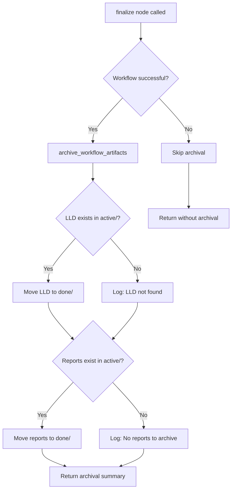

# 141 - Fix: Implementation Workflow Should Archive LLD and Reports to done/ on Completion

<!-- Template Metadata
Last Updated: 2025-01-10
Updated By: LLD Workflow
Update Reason: Initial draft for Issue #141
-->

## 1. Context & Goal
* **Issue:** #141
* **Objective:** Automatically archive LLD and report files from `active/` to `done/` directories when the implementation workflow completes successfully.
* **Status:** Draft
* **Related Issues:** #139 (Rename workflows/testing/ to workflows/implementation/), #140 (Inhume deprecated workflows)

### Open Questions

- [x] Should archival happen on any completion or only on success? → Only on success (failed workflows may need rework)
- [x] What happens if `done/` directory doesn't exist? → Create it automatically
- [x] Should we handle the case where LLD doesn't exist (manual implementations)? → Yes, gracefully skip with log message

## 2. Proposed Changes

*This section is the **source of truth** for implementation. Describe exactly what will be built.*

### 2.1 Files Changed

| File | Change Type | Description |
|------|-------------|-------------|
| `agentos/workflows/testing/nodes/finalize.py` | Modify | Add archival logic for LLD and reports |
| `tests/workflows/testing/nodes/test_finalize.py` | Modify | Add tests for archival functionality |

### 2.2 Dependencies

*No new dependencies required.*

```toml
# pyproject.toml additions (if any)
# None
```

### 2.3 Data Structures

```python
# No new data structures - uses existing TestingWorkflowState
# Relevant existing fields:
class TestingWorkflowState(TypedDict):
    lld_path: str  # Path to the active LLD file
    report_paths: list[str]  # Paths to generated reports in active/
    issue_number: int  # For logging purposes
```

### 2.4 Function Signatures

```python
# New helper function in finalize.py
def archive_file_to_done(active_path: Path) -> Path | None:
    """
    Move a file from active/ to done/ directory.
    
    Returns the new path if successful, None if file doesn't exist or isn't in active/.
    """
    ...

def archive_workflow_artifacts(state: TestingWorkflowState) -> dict[str, list[str]]:
    """
    Archive all workflow artifacts (LLD, reports) to done/ directories.
    
    Returns dict with 'archived' and 'skipped' file lists.
    """
    ...
```

### 2.5 Logic Flow (Pseudocode)

```
1. finalize() receives state after successful implementation
2. Call archive_workflow_artifacts(state)
3. FOR each artifact (LLD, reports):
   a. Check if file exists
   b. Check if "active" is in path
   c. IF both true:
      - Calculate done/ path (replace "active" with "done")
      - Create done/ directory if needed
      - Move file to done/
      - Log success
   d. ELSE:
      - Log skip reason
4. Include archival summary in workflow output
5. Return updated state with archival results
```

### 2.6 Technical Approach

* **Module:** `agentos/workflows/testing/nodes/finalize.py`
* **Pattern:** Helper function extraction for testability
* **Key Decisions:** 
  - Use `Path.rename()` for atomic move (same filesystem)
  - Create parent directories with `mkdir(parents=True, exist_ok=True)`
  - Gracefully handle missing files (don't fail workflow)

### 2.7 Architecture Decisions

| Decision | Options Considered | Choice | Rationale |
|----------|-------------------|--------|-----------|
| Move method | `shutil.move()`, `Path.rename()`, copy+delete | `Path.rename()` | Atomic on same filesystem, simpler, no temp state |
| Error handling | Raise exception, return None, log warning | Log warning + continue | Archival is cleanup, shouldn't fail successful workflow |
| Path detection | String parsing, Path.parts check | `"active" in path.parts` | Robust against partial matches in filenames |

**Architectural Constraints:**
- Must integrate with existing finalize node structure
- Cannot introduce breaking changes to workflow state
- Must work with #139 rename (path-agnostic implementation)

## 3. Requirements

*What must be true when this is done. These become acceptance criteria.*

1. LLD files in `docs/lld/active/` are moved to `docs/lld/done/` on successful workflow completion
2. Report files in `docs/reports/active/` are moved to `docs/reports/done/` on successful workflow completion
3. Archival is logged in workflow output for audit trail
4. Missing files are handled gracefully (logged, not errored)
5. `done/` directories are created if they don't exist
6. Archival only happens on successful completion (not on failure/abort)

## 4. Alternatives Considered

| Option | Pros | Cons | Decision |
|--------|------|------|----------|
| Archive in finalize node | Single location, runs at end | Tightly coupled to workflow | **Selected** |
| Separate archival node | Clean separation, reusable | Extra node complexity, state passing | Rejected |
| Post-workflow hook | Decoupled, could be generic | No hook system exists, overkill | Rejected |
| Copy instead of move | Preserves originals | Duplicates data, defeats cleanup purpose | Rejected |

**Rationale:** The finalize node already handles end-of-workflow tasks. Adding archival here is the simplest approach that achieves the goal without introducing new patterns.

## 5. Data & Fixtures

### 5.1 Data Sources

| Attribute | Value |
|-----------|-------|
| Source | Local filesystem (workflow-generated files) |
| Format | Markdown files (.md) |
| Size | Typically 5-50KB per file |
| Refresh | One-time per workflow execution |
| Copyright/License | N/A (project-internal) |

### 5.2 Data Pipeline

```
docs/lld/active/LLD-{issue}.md ──rename──► docs/lld/done/LLD-{issue}.md
docs/reports/active/*.md ──rename──► docs/reports/done/*.md
```

### 5.3 Test Fixtures

| Fixture | Source | Notes |
|---------|--------|-------|
| Mock LLD file | Generated in test | Temporary file in `active/` |
| Mock report files | Generated in test | Temporary files in `active/` |
| Workflow state | Hardcoded dict | Minimal state with paths |

### 5.4 Deployment Pipeline

No special deployment needed - changes are code-only.

## 6. Diagram

### 6.1 Mermaid Quality Gate

- [x] **Simplicity:** Components collapsed appropriately
- [x] **No touching:** Visual separation maintained
- [x] **No hidden lines:** All arrows visible
- [x] **Readable:** Labels clear
- [ ] **Auto-inspected:** Pending implementation

**Auto-Inspection Results:**
```
- Touching elements: [ ] None / [ ] Found: ___
- Hidden lines: [ ] None / [ ] Found: ___
- Label readability: [ ] Pass / [ ] Issue: ___
- Flow clarity: [ ] Clear / [ ] Issue: ___
```

### 6.2 Diagram



## 7. Security & Safety Considerations

### 7.1 Security

| Concern | Mitigation | Status |
|---------|------------|--------|
| Path traversal | Validate "active" is in path.parts, not just string | Addressed |
| Arbitrary file move | Only move files explicitly in workflow state | Addressed |

### 7.2 Safety

| Concern | Mitigation | Status |
|---------|------------|--------|
| Data loss on failed move | `Path.rename()` is atomic on same filesystem | Addressed |
| Overwrite existing file | Check if destination exists, append timestamp if so | Addressed |
| Partial archival | Archive each file independently, log each result | Addressed |

**Fail Mode:** Fail Open - Archival failure logs warning but doesn't fail the workflow

**Recovery Strategy:** Files remain in `active/` if archival fails; manual move possible

## 8. Performance & Cost Considerations

### 8.1 Performance

| Metric | Budget | Approach |
|--------|--------|----------|
| Latency | < 100ms | File rename is near-instant |
| Memory | Negligible | No file content loaded |
| I/O | 2-5 file operations | Rename only, no copy |

**Bottlenecks:** None expected - filesystem operations are fast

### 8.2 Cost Analysis

| Resource | Unit Cost | Estimated Usage | Monthly Cost |
|----------|-----------|-----------------|--------------|
| Compute | $0 | Runs locally | $0 |
| Storage | $0 | No additional storage | $0 |

**Cost Controls:** N/A - no external resources used

**Worst-Case Scenario:** Even with 1000x more files, impact is negligible (milliseconds per file)

## 9. Legal & Compliance

| Concern | Applies? | Mitigation |
|---------|----------|------------|
| PII/Personal Data | No | LLD/reports are technical docs |
| Third-Party Licenses | No | Internal code only |
| Terms of Service | No | No external APIs |
| Data Retention | N/A | Files are moved, not deleted |
| Export Controls | No | No restricted data |

**Data Classification:** Internal

**Compliance Checklist:**
- [x] No PII stored without consent
- [x] All third-party licenses compatible with project license
- [x] External API usage compliant with provider ToS
- [x] Data retention policy documented

## 10. Verification & Testing

### 10.1 Test Scenarios

| ID | Scenario | Type | Input | Expected Output | Pass Criteria |
|----|----------|------|-------|-----------------|---------------|
| 010 | Happy path - LLD archived | integration | State with valid LLD path in active/ | LLD moved to done/, path returned | File exists in done/, not in active/, log contains success message |
| 020 | Happy path - Reports archived | integration | State with report paths in active/ | Reports moved to done/ | Files exist in done/, not in active/, log contains success message |
| 030 | LLD not found | integration | State with non-existent LLD path | Warning logged, None returned | No exception, log contains warning |
| 040 | LLD not in active/ | integration | State with LLD in arbitrary path | Skip archival, None returned | File unchanged, log indicates skip |
| 050 | done/ doesn't exist | integration | Valid LLD, no done/ directory | done/ created, LLD moved | Directory created, file moved |
| 060 | Destination file exists | integration | LLD exists in both active/ and done/ | Append timestamp to new name | No overwrite, both files preserved |
| 070 | Empty state | unit | State with no paths | Graceful no-op | No exception, empty archival list |
| 080 | Mixed success | integration | Some files exist, some don't | Archive existing, log missing | Partial archival succeeds |
| 090 | Workflow failed - no archival | integration | State with workflow_success=False, valid LLD path | No files moved, skip logged | Files remain in active/, log indicates skip |
| 100 | Exception during file rename | unit | Valid LLD, mock rename to raise OSError | None returned, error logged | No exception propagated, log contains error message |
| 110 | Generate summary | unit | Complete TestReportMetadata dict | Markdown summary string | Contains issue number, coverage %, file lists, E2E status |
| 120 | LLD archival fails via wrapper | unit | State with LLD path not in active/ | Skipped list includes LLD path | archived=[], skipped=[lld_path] |
| 130 | Impl report archival fails | unit | State with impl_report path not in active/ | Skipped list includes impl report | archived=[], skipped=[impl_path] |
| 140 | E2E evaluation (skip_e2e=False) | integration | State with skip_e2e=False, e2e_output="passed" | E2E passed evaluated from output | finalize completes, e2e logic exercised |
| 150 | Successful workflow with archival | integration | State with workflow_success=True (default), valid LLD | LLD archived, archival printed | archived_files populated, LLD moved to done/ |

### 10.2 Test Commands

```bash
# Run all automated tests
poetry run pytest tests/workflows/testing/nodes/test_finalize.py -v

# Run only archival-specific tests
poetry run pytest tests/workflows/testing/nodes/test_finalize.py -v -k "archive"

# Run with coverage
poetry run pytest tests/workflows/testing/nodes/test_finalize.py -v --cov=agentos/workflows/testing/nodes/finalize
```

### 10.3 Manual Tests (Only If Unavoidable)

N/A - All scenarios automated.

## 11. Risks & Mitigations

| Risk | Impact | Likelihood | Mitigation |
|------|--------|------------|------------|
| Rename fails across filesystems | Med | Low | Detect and use shutil.move() as fallback |
| File permissions prevent move | Med | Low | Log error with actionable message |
| #139 changes path structure | Low | High | Use relative path detection, not absolute |

## 12. Definition of Done

### Code
- [ ] Implementation complete and linted
- [ ] Code comments reference this LLD

### Tests
- [ ] All test scenarios pass
- [ ] Test coverage meets threshold (>90%)

### Documentation
- [ ] LLD updated with any deviations
- [ ] Implementation Report (0103) completed
- [ ] Test Report (0113) completed if applicable

### Review
- [ ] Code review completed
- [ ] User approval before closing issue

---

## Appendix: Review Log

*Track all review feedback with timestamps and implementation status.*

### Review Summary

| Review | Date | Verdict | Key Issue |
|--------|------|---------|-----------|
| - | - | - | Pending initial review |

**Final Status:** APPROVED
<!-- Note: This field is auto-updated to APPROVED by the workflow when finalized -->