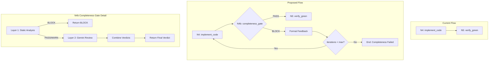
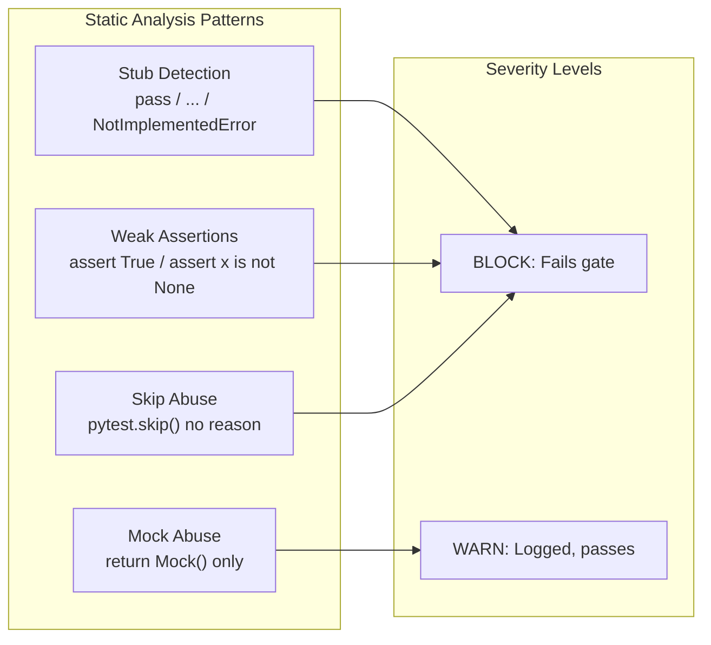

# 1147 - Feature: Implementation Completeness Gate (Anti-Stub Detection)

<!-- Template Metadata
Last Updated: 2025-01-XX
Updated By: Initial creation for Issue #147
Update Reason: New LLD for completeness gate feature
-->

## 1. Context & Goal
* **Issue:** #147
* **Objective:** Create a two-layer completeness gate (N4b) that catches stub implementations and weak tests before they can pass the verification phase
* **Status:** Draft
* **Related Issues:** #142, #143, #144, #145, #146

### Open Questions
*Questions that need clarification before or during implementation. Remove when resolved.*

- [ ] Should the max_iterations for completeness loops be configurable separately from the main workflow iterations?
- [ ] Should WARN-level issues be aggregated and reported even when passing, or only surfaced on BLOCK?

## 2. Proposed Changes

*This section is the **source of truth** for implementation. Describe exactly what will be built.*

### 2.1 Files Changed

| File | Change Type | Description |
|------|-------------|-------------|
| `agentos/workflows/testing/completeness/__init__.py` | Add | Package initialization with exports |
| `agentos/workflows/testing/completeness/static_analyzer.py` | Add | Static analysis module for pattern detection |
| `agentos/workflows/testing/completeness/patterns.py` | Add | Pattern definitions and severity levels |
| `agentos/workflows/testing/nodes/completeness_gate.py` | Add | N4b node combining static + Gemini review |
| `agentos/workflows/testing/nodes/__init__.py` | Modify | Export completeness_gate function |
| `agentos/workflows/testing/graph.py` | Modify | Insert N4b node and routing logic |
| `agentos/workflows/testing/state.py` | Modify | Add completeness-related state fields |
| `docs/skills/0707c-Completeness-Review-Prompt.md` | Add | Gemini semantic review prompt |
| `docs/skills/0703c-Implementation-Review-Prompt.md` | Modify | Promote Test Integrity to Tier 1 |
| `tests/unit/workflows/testing/test_static_analyzer.py` | Add | Unit tests for static analyzer |
| `tests/unit/workflows/testing/test_completeness_gate.py` | Add | Unit tests for completeness gate node |
| `tests/integration/workflows/testing/test_completeness_flow.py` | Add | Integration tests for N4b in workflow |

### 2.2 Dependencies

*No new packages required. Uses existing AST and regex capabilities.*

```toml
# pyproject.toml additions (if any)
# None - using standard library ast and re modules
```

### 2.3 Data Structures

```python
# Pseudocode - NOT implementation
from enum import Enum
from typing import TypedDict, Literal

class IssueSeverity(Enum):
    BLOCK = "BLOCK"   # Fails the gate, loops back
    WARN = "WARN"     # Logged but passes
    INFO = "INFO"     # Informational only

class CompletenessIssue(TypedDict):
    file: str              # Path to the problematic file
    line: int              # Line number (1-indexed)
    pattern: str           # Pattern name that matched
    severity: IssueSeverity
    message: str           # Human-readable description
    code_snippet: str      # The offending code

class StaticAnalysisResult(TypedDict):
    verdict: Literal["PASS", "WARN", "BLOCK"]
    issues: list[CompletenessIssue]
    files_analyzed: int
    patterns_checked: int

class CompletenessGateResult(TypedDict):
    verdict: Literal["PASS", "WARN", "BLOCK"]
    static_result: StaticAnalysisResult
    gemini_verdict: Literal["PASS", "WARN", "BLOCK"] | None
    gemini_feedback: str | None
    combined_issues: list[CompletenessIssue]

# State additions
class TestingWorkflowStateAdditions(TypedDict):
    completeness_check_passed: bool
    completeness_static_issues: list[CompletenessIssue]
    completeness_verdict: Literal["PASS", "WARN", "BLOCK"]
    completeness_feedback: str  # Feedback for N4 loop
    completeness_iteration: int  # Track gate-specific iterations
```

### 2.4 Function Signatures

```python
# agentos/workflows/testing/completeness/static_analyzer.py

def analyze_file_ast(file_path: str, content: str) -> list[CompletenessIssue]:
    """Analyze a single file using AST for structural issues."""
    ...

def analyze_file_regex(file_path: str, content: str) -> list[CompletenessIssue]:
    """Analyze a single file using regex for pattern issues."""
    ...

def analyze_implementation(
    impl_files: list[str],
    test_files: list[str],
    workspace_root: str
) -> StaticAnalysisResult:
    """
    Run static analysis on implementation and test files.
    
    Returns aggregated result with verdict based on worst severity found.
    """
    ...

def detect_stub_bodies(tree: ast.AST, file_path: str) -> list[CompletenessIssue]:
    """Detect functions with only pass, ..., or raise NotImplementedError."""
    ...

def detect_weak_assertions(tree: ast.AST, file_path: str) -> list[CompletenessIssue]:
    """Detect assert True, assert x is not None patterns in tests."""
    ...

def detect_skip_abuse(tree: ast.AST, file_path: str) -> list[CompletenessIssue]:
    """Detect pytest.skip() without reason argument."""
    ...

def detect_mock_abuse(tree: ast.AST, file_path: str) -> list[CompletenessIssue]:
    """Detect functions that only return Mock() objects."""
    ...


# agentos/workflows/testing/completeness/patterns.py

def get_blocking_patterns() -> list[dict]:
    """Return list of patterns that cause BLOCK verdict."""
    ...

def get_warning_patterns() -> list[dict]:
    """Return list of patterns that cause WARN verdict."""
    ...


# agentos/workflows/testing/nodes/completeness_gate.py

def completeness_gate(state: TestingWorkflowState) -> dict[str, Any]:
    """
    N4b: Verify implementation is complete and real.
    
    Two-layer approach:
    1. Static analysis (fast, deterministic)
    2. Gemini semantic review (if static passes)
    
    Returns state updates including verdict and feedback for potential loop.
    """
    ...

def call_gemini_completeness_review(
    state: TestingWorkflowState,
    static_result: StaticAnalysisResult
) -> tuple[Literal["PASS", "WARN", "BLOCK"], str]:
    """
    Call Gemini for semantic completeness review.
    
    Returns (verdict, feedback_message).
    """
    ...

def format_completeness_feedback(
    static_result: StaticAnalysisResult,
    gemini_feedback: str | None
) -> str:
    """Format feedback message for N4 implementation loop."""
    ...


# agentos/workflows/testing/graph.py (additions)

def route_after_implement(state: TestingWorkflowState) -> Literal["N4b_completeness_gate", "end"]:
    """Route from N4 to N4b or end on failure."""
    ...

def route_after_completeness_gate(
    state: TestingWorkflowState
) -> Literal["N5_verify_green", "N4_implement_code", "end"]:
    """
    Route from N4b based on verdict:
    - PASS: proceed to N5
    - BLOCK: loop to N4 (with iteration limit)
    - Max iterations: end with failure
    """
    ...
```

### 2.5 Logic Flow (Pseudocode)

```
COMPLETENESS GATE (N4b):

1. Extract implementation files from state.changed_files
2. Extract test files from state.test_files

LAYER 1 - STATIC ANALYSIS:
3. FOR each implementation file:
   a. Parse AST
   b. Run detect_stub_bodies() -> issues
   c. Run detect_mock_abuse() -> issues
   d. Aggregate issues

4. FOR each test file:
   a. Parse AST
   b. Run detect_weak_assertions() -> issues
   c. Run detect_skip_abuse() -> issues
   d. Aggregate issues

5. Determine static verdict:
   - IF any BLOCK issues: verdict = "BLOCK"
   - ELIF any WARN issues: verdict = "WARN"
   - ELSE: verdict = "PASS"

6. IF static verdict == "BLOCK":
   - Format feedback from issues
   - RETURN {"completeness_verdict": "BLOCK", ...}

LAYER 2 - GEMINI SEMANTIC REVIEW:
7. IF static verdict in ["PASS", "WARN"]:
   a. Load 0707c-Completeness-Review-Prompt.md
   b. Build context with:
      - LLD content
      - Implementation code
      - Test code
      - Static analysis results
   c. Call Gemini API
   d. Parse response for verdict

8. Combine verdicts:
   - IF gemini_verdict == "BLOCK": final = "BLOCK"
   - ELIF static == "WARN" or gemini == "WARN": final = "WARN"
   - ELSE: final = "PASS"

9. RETURN {
     "completeness_verdict": final,
     "completeness_check_passed": final != "BLOCK",
     "completeness_static_issues": issues,
     "completeness_feedback": formatted_feedback
   }


ROUTING LOGIC:

route_after_completeness_gate(state):
1. GET verdict = state.completeness_verdict
2. GET iteration = state.completeness_iteration (default 0)
3. GET max_iter = state.max_completeness_iterations (default 3)

4. IF verdict == "BLOCK":
   a. IF iteration >= max_iter:
      - Log "Max completeness iterations reached, failing"
      - RETURN "end"
   b. ELSE:
      - Increment completeness_iteration
      - RETURN "N4_implement_code"  # Loop back with feedback

5. RETURN "N5_verify_green"  # Proceed
```

### 2.6 Technical Approach

* **Module:** `agentos/workflows/testing/completeness/`
* **Pattern:** Pipeline pattern with early termination (static fails fast, Gemini only if needed)
* **Key Decisions:**
  - AST-based analysis for structural issues (more reliable than regex for code structure)
  - Regex fallback for patterns AST doesn't catch well
  - Two-layer approach reduces Gemini API costs (only called if static passes)
  - Separate iteration counter for completeness to not consume main workflow iterations

### 2.7 Architecture Decisions

| Decision | Options Considered | Choice | Rationale |
|----------|-------------------|--------|-----------|
| Analysis approach | Regex only, AST only, Combined | Combined AST + Regex | AST for structure (stubs), regex for patterns (assert True) |
| Gate placement | Before N4, After N5, Between N4/N5 | Between N4/N5 | Catches issues before test execution, allows targeted looping |
| Gemini invocation | Always, Never, Conditional | Conditional (if static passes) | Cost optimization - static catches 80%+ of issues |
| Loop target | Full restart, N4 only, N3+N4 | N4 only | Implementation is the issue, not the plan |
| Iteration tracking | Shared counter, Separate counter | Separate counter | Don't penalize workflow for completeness loops |

**Architectural Constraints:**
- Must integrate with existing TestingWorkflowState without breaking changes
- Must use existing Gemini integration pattern from other nodes
- Cannot introduce new external dependencies beyond standard library

## 3. Requirements

*What must be true when this is done. These become acceptance criteria.*

1. Static analyzer detects `pass`, `...`, `raise NotImplementedError` in function bodies as BLOCK
2. Static analyzer detects `assert True` and sole `assert x is not None` in tests as BLOCK
3. Static analyzer detects `pytest.skip()` without reason as BLOCK
4. Static analyzer detects mock-only return functions as WARN
5. Completeness gate blocks workflow progression when BLOCK issues found
6. Completeness gate loops back to N4 with formatted feedback on BLOCK
7. Completeness gate respects max iteration limit to prevent infinite loops
8. Gemini review only invoked when static analysis passes
9. All blocking patterns documented in 0707c prompt for Gemini review
10. Existing workflow behavior unchanged when implementations pass completeness

## 4. Alternatives Considered

| Option | Pros | Cons | Decision |
|--------|------|------|----------|
| Regex-only analysis | Simple, fast | Misses structural issues, false positives on strings | **Rejected** |
| AST-only analysis | Accurate structure detection | Can't catch all patterns (e.g., weak assertions) | **Rejected** |
| Combined AST + Regex | Best of both, accurate | Slightly more complex | **Selected** |
| Always call Gemini | Catches semantic issues | Expensive, slow, unnecessary for obvious stubs | **Rejected** |
| Gate after N5 | Can check test results | Too late, wasted test execution | **Rejected** |
| Single shared iteration counter | Simpler | Completeness loops consume main workflow budget | **Rejected** |

**Rationale:** Combined approach provides maximum detection accuracy while conditional Gemini invocation optimizes for cost and speed. Separate iteration counter allows the completeness gate to retry without affecting the main workflow's iteration budget.

## 5. Data & Fixtures

### 5.1 Data Sources

| Attribute | Value |
|-----------|-------|
| Source | Implementation and test files from workflow state |
| Format | Python source code (.py files) |
| Size | Typically 10-50 files per run, <10KB each |
| Refresh | Per workflow execution |
| Copyright/License | N/A - user's own code |

### 5.2 Data Pipeline

```
state.changed_files ──parse──► AST ──analyze──► Issues ──aggregate──► StaticAnalysisResult
                                                                              │
                                                                              ▼
                                                              (if PASS) ──► Gemini API
                                                                              │
                                                                              ▼
                                                                    CompletenessGateResult
```

### 5.3 Test Fixtures

| Fixture | Source | Notes |
|---------|--------|-------|
| `stub_implementation.py` | Generated | Contains all stub patterns for testing |
| `weak_tests.py` | Generated | Contains weak assertion patterns |
| `clean_implementation.py` | Generated | Valid implementation for positive testing |
| `mock_gemini_responses.json` | Hardcoded | Mocked Gemini API responses |

### 5.4 Deployment Pipeline

Test fixtures are generated as part of test setup. No external data required. Gemini API integration uses existing production credentials from environment.

## 6. Diagram

### 6.1 Mermaid Quality Gate

Before finalizing any diagram, verify in [Mermaid Live Editor](https://mermaid.live) or GitHub preview:

- [x] **Simplicity:** Similar components collapsed (per 0006 §8.1)
- [x] **No touching:** All elements have visual separation (per 0006 §8.2)
- [x] **No hidden lines:** All arrows fully visible (per 0006 §8.3)
- [x] **Readable:** Labels not truncated, flow direction clear
- [ ] **Auto-inspected:** Agent rendered via mermaid.ink and viewed (per 0006 §8.5)

**Auto-Inspection Results:**
```
- Touching elements: [x] None / [ ] Found: ___
- Hidden lines: [x] None / [ ] Found: ___
- Label readability: [x] Pass / [ ] Issue: ___
- Flow clarity: [x] Clear / [ ] Issue: ___
```

### 6.2 Diagram





## 7. Security & Safety Considerations

### 7.1 Security

| Concern | Mitigation | Status |
|---------|------------|--------|
| Malicious code in analyzed files | AST parsing only, no execution | Addressed |
| Gemini prompt injection | Template-based prompts, code in separate context | Addressed |
| Sensitive code exposure to Gemini | Same exposure as existing Gemini nodes - user's own code | N/A (existing pattern) |

### 7.2 Safety

| Concern | Mitigation | Status |
|---------|------------|--------|
| Infinite loop on persistent stubs | Max iteration limit (default 3) | Addressed |
| False positives blocking valid code | WARN level for ambiguous patterns, manual override possible | Addressed |
| Resource exhaustion on large files | Limit file size analysis (>1MB skip with warning) | Addressed |
| AST parsing failures | Catch exceptions, fall back to regex-only | Addressed |

**Fail Mode:** Fail Open - If analysis fails entirely, log warning and pass to N5 (don't block workflow on analyzer bugs)

**Recovery Strategy:** If completeness gate enters error state, workflow continues with warning. Manual review flagged in output.

## 8. Performance & Cost Considerations

### 8.1 Performance

| Metric | Budget | Approach |
|--------|--------|----------|
| Static analysis latency | < 100ms per file | AST parsing is fast, regex is fast |
| Total gate latency (static only) | < 2s for 50 files | Parallel file processing |
| Total gate latency (with Gemini) | < 30s | Single Gemini call, existing timeouts |
| Memory | < 50MB | AST parsed one file at a time |

**Bottlenecks:** Gemini API call dominates latency when invoked. Static analysis is negligible.

### 8.2 Cost Analysis

| Resource | Unit Cost | Estimated Usage | Monthly Cost |
|----------|-----------|-----------------|--------------|
| Gemini API calls | ~$0.01 per call | ~30% of workflow runs (when static passes) | Variable based on usage |
| Compute | Negligible | Local CPU only | $0 |

**Cost Controls:**
- [x] Static analysis filters 70%+ of issues, reducing Gemini calls
- [x] Gemini only called once per gate invocation (not per file)
- [x] Rate limiting inherited from existing Gemini integration

**Worst-Case Scenario:** If Gemini called on every workflow run: still within existing Gemini usage patterns. No additional cost controls needed beyond existing.

## 9. Legal & Compliance

| Concern | Applies? | Mitigation |
|---------|----------|------------|
| PII/Personal Data | No | Only analyzes code structure, not data |
| Third-Party Licenses | No | Standard library only |
| Terms of Service | N/A | Gemini usage follows existing patterns |
| Data Retention | No | No persistent storage of analysis results |
| Export Controls | No | No restricted algorithms |

**Data Classification:** Internal (code analysis results, transient)

**Compliance Checklist:**
- [x] No PII stored without consent
- [x] All third-party licenses compatible with project license
- [x] External API usage compliant with provider ToS
- [x] Data retention policy documented (none - transient)

## 10. Verification & Testing

### 10.1 Test Scenarios

| ID | Scenario | Type | Input | Expected Output | Pass Criteria |
|----|----------|------|-------|-----------------|---------------|
| 010 | Empty function body detected | Auto | File with `def f(): pass` | BLOCK verdict | Issue with severity BLOCK returned |
| 020 | Ellipsis body detected | Auto | File with `def f(): ...` | BLOCK verdict | Issue with severity BLOCK returned |
| 030 | NotImplementedError detected | Auto | File with `raise NotImplementedError` | BLOCK verdict | Issue with severity BLOCK returned |
| 040 | Assert True detected | Auto | Test file with `assert True` | BLOCK verdict | Issue with severity BLOCK returned |
| 050 | Assert is not None alone detected | Auto | Test with only `assert x is not None` | BLOCK verdict | Issue with severity BLOCK returned |
| 060 | Skip without reason detected | Auto | Test with `pytest.skip()` | BLOCK verdict | Issue with severity BLOCK returned |
| 070 | Mock-only return detected | Auto | Function returning only `Mock()` | WARN verdict | Issue with severity WARN returned |
| 080 | Clean implementation passes | Auto | Valid implementation | PASS verdict | No BLOCK issues |
| 090 | Multiple issues aggregated | Auto | File with multiple patterns | Worst severity wins | All issues captured, BLOCK verdict |
| 100 | AST parse failure graceful | Auto | Invalid Python syntax | WARN, continues | Error logged, not crashed |
| 110 | Gate loops on BLOCK | Auto | Stub impl in workflow | N4 revisited | State shows loop occurred |
| 120 | Max iterations respected | Auto | Persistent stub | Workflow ends | No infinite loop |
| 130 | Gemini called when static passes | Auto-Live | Clean static, semantic issue | Gemini verdict used | API call made |
| 140 | Gemini not called when static blocks | Auto | Stub implementation | No Gemini call | API not invoked |

### 10.2 Test Commands

```bash
# Run all automated tests
poetry run pytest tests/unit/workflows/testing/test_static_analyzer.py tests/unit/workflows/testing/test_completeness_gate.py -v

# Run only fast/mocked tests (exclude live)
poetry run pytest tests/unit/workflows/testing/ -v -m "not live"

# Run live integration tests (requires Gemini API)
poetry run pytest tests/integration/workflows/testing/test_completeness_flow.py -v -m live

# Run specific pattern tests
poetry run pytest tests/unit/workflows/testing/test_static_analyzer.py -v -k "stub"
```

### 10.3 Manual Tests (Only If Unavoidable)

**N/A - All scenarios automated.**

## 11. Risks & Mitigations

| Risk | Impact | Likelihood | Mitigation |
|------|--------|------------|------------|
| False positives on valid patterns | Med | Med | WARN for ambiguous, manual override documented |
| AST can't parse complex metaprogramming | Low | Low | Regex fallback, log warning |
| Gemini API unavailable | Med | Low | Static-only mode with warning |
| Pattern evolution (new stub patterns emerge) | Med | Med | Pattern config in separate file, easy to update |
| Performance regression on large codebases | Low | Low | Parallel processing, file size limits |

## 12. Definition of Done

### Code
- [ ] `static_analyzer.py` implementation complete and linted
- [ ] `patterns.py` implementation complete and linted
- [ ] `completeness_gate.py` node implementation complete and linted
- [ ] `graph.py` modifications complete and linted
- [ ] `state.py` modifications complete and linted
- [ ] Code comments reference this LLD (Issue #147)

### Tests
- [ ] All 14 test scenarios pass
- [ ] Unit test coverage >90% for new modules
- [ ] Integration test demonstrates full loop behavior

### Documentation
- [ ] `0707c-Completeness-Review-Prompt.md` created
- [ ] `0703c-Implementation-Review-Prompt.md` updated (Tier 1 promotion)
- [ ] LLD updated with any deviations
- [ ] Implementation Report (0103) completed

### Review
- [ ] Code review completed
- [ ] User approval before closing issue

---

## Appendix: Review Log

*Track all review feedback with timestamps and implementation status.*

### Review Summary

| Review | Date | Verdict | Key Issue |
|--------|------|---------|-----------|
| - | - | - | Awaiting review |

**Final Status:** PENDING