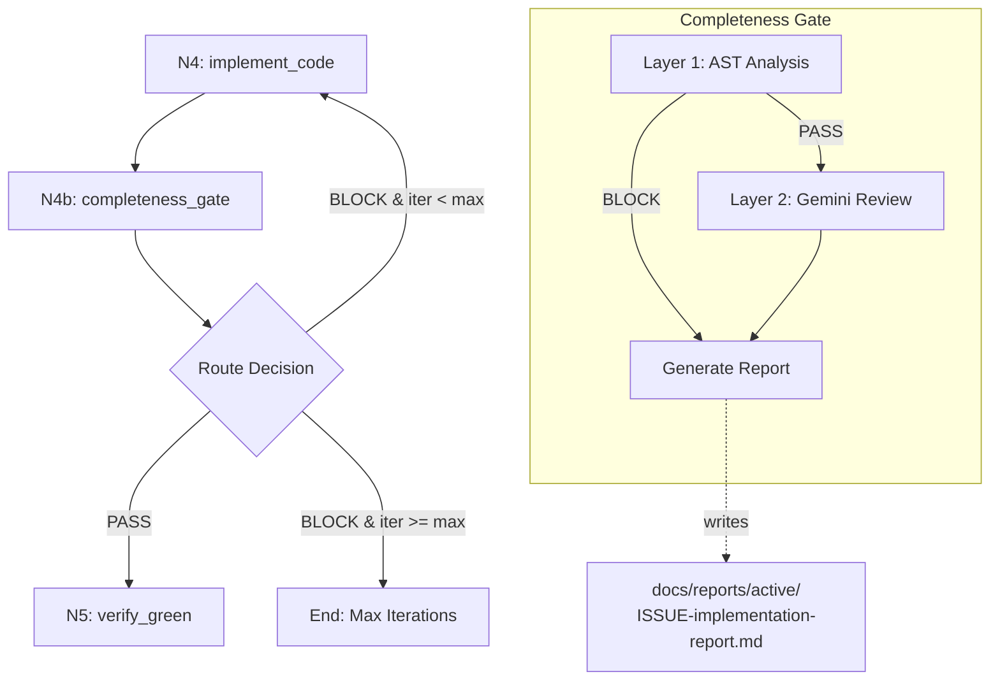

# 147 - Feature: Implementation Completeness Gate (Anti-Stub Detection)

<!-- Template Metadata
Last Updated: 2026-02-16
Updated By: LLD creation for issue #147
Update Reason: Initial LLD creation
-->

## 1. Context & Goal
* **Issue:** #147
* **Objective:** Introduce a two-layer completeness gate (N4b) between implementation and verification that detects semantically incomplete code using AST analysis and Gemini review.
* **Status:** Draft
* **Related Issues:** #181 (subsumed - report generation), #335 (N2.5 precedent), #225 (skipped test overlap), #354 (mutation testing - future), #149-#156 (real codebase findings)

### Open Questions
*Questions that need clarification before or during implementation. Remove when resolved.*

- [ ] Should the completeness gate block indefinitely or have a configurable retry limit separate from `max_iterations`?
- [ ] Should Layer 2 (Gemini review) be optional/skippable for performance-sensitive CI runs?

## 2. Proposed Changes

*This section is the **source of truth** for implementation. Describe exactly what will be built.*

### 2.1 Files Changed

| File | Change Type | Description |
|------|-------------|-------------|
| `assemblyzero/workflows/testing/completeness/__init__.py` | Add | Package initializer with exports |
| `assemblyzero/workflows/testing/completeness/ast_analyzer.py` | Add | Layer 1 AST-based analysis engine |
| `assemblyzero/workflows/testing/completeness/report_generator.py` | Add | Verification report output (from #181) |
| `assemblyzero/workflows/testing/nodes/completeness_gate.py` | Add | N4b workflow node implementation |
| `tests/test_completeness_gate.py` | Add | Unit and integration tests |
| `assemblyzero/workflows/testing/graph.py` | Modify | Insert N4b between N4 and N5, add routing |
| `assemblyzero/workflows/testing/state.py` | Modify | Add completeness_verdict and completeness_issues fields |
| `assemblyzero/workflows/testing/nodes/__init__.py` | Modify | Export completeness_gate |

### 2.1.1 Path Validation (Mechanical - Auto-Checked)

*Issue #277: Before human or Gemini review, paths are verified programmatically.*

Mechanical validation automatically checks:
- All "Modify" files must exist in repository
- All "Delete" files must exist in repository
- All "Add" files must have existing parent directories
- No placeholder prefixes (`src/`, `lib/`, `app/`) unless directory exists

**If validation fails, the LLD is BLOCKED before reaching review.**

### 2.2 Dependencies

*New packages, APIs, or services required.*

```toml
# pyproject.toml additions (if any)
# No new dependencies - uses stdlib ast module
```

### 2.3 Data Structures

```python
# Pseudocode - NOT implementation
class CompletenessIssue(TypedDict):
    """Individual completeness problem detected."""
    check_type: str  # e.g., "dead_cli_flag", "empty_branch", "trivial_assertion"
    file_path: str   # Relative path to file
    line_number: int # Line where issue found
    description: str # Human-readable explanation
    severity: Literal["ERROR", "WARNING"]  # ERROR blocks, WARNING informs

class CompletenessResult(TypedDict):
    """Result from completeness analysis."""
    verdict: Literal["PASS", "BLOCK", "WARN"]
    issues: list[CompletenessIssue]
    ast_analysis_passed: bool
    gemini_review_passed: bool | None  # None if not run
    report_path: str  # Path to generated report

class ASTAnalysisConfig(TypedDict):
    """Configuration for AST analyzer."""
    check_dead_cli_flags: bool
    check_empty_branches: bool
    check_docstring_only_functions: bool
    check_trivial_assertions: bool
    check_unused_imports: bool
    min_assertion_quality_score: float  # 0.0-1.0, default 0.3

# State additions
class TestingState(TypedDict, total=False):
    # ... existing fields ...
    completeness_verdict: Literal["PASS", "BLOCK", "WARN"]
    completeness_issues: list[CompletenessIssue]
    implementation_report_path: str  # From #181
```

### 2.4 Function Signatures

```python
# assemblyzero/workflows/testing/completeness/ast_analyzer.py

def analyze_file(file_path: Path, config: ASTAnalysisConfig) -> list[CompletenessIssue]:
    """Analyze a single Python file for completeness issues."""
    ...

def detect_dead_cli_flags(tree: ast.AST, source: str) -> list[CompletenessIssue]:
    """Find argparse add_argument calls whose dest is never used."""
    ...

def detect_empty_branches(tree: ast.AST, source: str) -> list[CompletenessIssue]:
    """Find if/else branches with only pass, return None, or ellipsis."""
    ...

def detect_docstring_only_functions(tree: ast.AST, source: str) -> list[CompletenessIssue]:
    """Find functions with docstring + pass/return None only."""
    ...

def detect_trivial_assertions(tree: ast.AST, source: str) -> list[CompletenessIssue]:
    """Find test functions where the only assertion is 'assert x is not None'."""
    ...

def detect_unused_imports(tree: ast.AST, source: str) -> list[CompletenessIssue]:
    """Find imports that are never referenced in function bodies."""
    ...

def calculate_assertion_quality_score(test_function: ast.FunctionDef) -> float:
    """Score test function assertion quality from 0.0 (trivial) to 1.0 (thorough)."""
    ...

# assemblyzero/workflows/testing/completeness/report_generator.py

def generate_implementation_report(
    issue_number: int,
    lld_path: Path,
    implementation_files: list[Path],
    completeness_result: CompletenessResult,
    lld_requirements: list[str],
) -> Path:
    """Generate implementation report with LLD requirement verification."""
    ...

def extract_lld_requirements(lld_path: Path) -> list[str]:
    """Parse Section 3 requirements from LLD markdown."""
    ...

def map_requirements_to_implementation(
    requirements: list[str],
    implementation_files: list[Path],
) -> list[dict]:
    """Map each requirement to implementing code (for Gemini review)."""
    ...

# assemblyzero/workflows/testing/nodes/completeness_gate.py

def completeness_gate(state: TestingState) -> TestingState:
    """N4b: Verify implementation completeness before test verification."""
    ...

def run_ast_analysis(
    implementation_files: list[Path],
    config: ASTAnalysisConfig,
) -> tuple[bool, list[CompletenessIssue]]:
    """Layer 1: Run AST-based completeness checks."""
    ...

def prepare_gemini_review_materials(
    state: TestingState,
    lld_path: Path,
    implementation_files: list[Path],
) -> dict:
    """Prepare materials for orchestrator-controlled Gemini review."""
    ...

def route_after_completeness_gate(
    state: TestingState,
) -> Literal["N5_verify_green", "N4_implement_code", "end"]:
    """Route based on completeness verdict."""
    ...
```

### 2.5 Logic Flow (Pseudocode)

```
N4b_completeness_gate:
1. Receive state from N4_implement_code
2. Collect implementation files from state.changed_files
3. Load AST analysis config (defaults or from state)

4. LAYER 1 - AST Analysis:
   FOR each implementation file:
     - Parse AST
     - Run detect_dead_cli_flags()
     - Run detect_empty_branches()
     - Run detect_docstring_only_functions()
     - Run detect_trivial_assertions() (for test files)
     - Run detect_unused_imports()
     - Collect all issues

5. IF any ERROR-severity issues found:
   - Set verdict = "BLOCK"
   - Skip Layer 2
   - Generate report
   - Return state with issues

6. LAYER 2 - Gemini Semantic Review (orchestrator-controlled):
   - Extract LLD requirements from Section 3
   - Map requirements to implementation
   - Prepare review materials for orchestrator
   - Set state.pending_gemini_review = True
   - Return state (orchestrator handles actual API call)

7. After Gemini response (orchestrator callback):
   - Parse Gemini verdict
   - IF verdict is BLOCK:
     - Add semantic issues to completeness_issues
     - Set verdict = "BLOCK"
   - ELSE:
     - Set verdict = "PASS" or "WARN"

8. Generate implementation report at:
   docs/reports/active/{issue}-implementation-report.md

9. Update state:
   - completeness_verdict = verdict
   - completeness_issues = all_issues
   - implementation_report_path = report_path

10. Return updated state

route_after_completeness_gate:
1. Get verdict from state.completeness_verdict
2. Get iteration from state.iteration_count
3. Get max_iter from state.max_iterations (default 10)

4. IF verdict == "BLOCK":
   IF iteration >= max_iter:
     - Log "Max iterations reached, giving up"
     - Return "end"
   ELSE:
     - Inject feedback into state for N4
     - Return "N4_implement_code"

5. Return "N5_verify_green"
```

### 2.6 Technical Approach

* **Module:** `assemblyzero/workflows/testing/completeness/`
* **Pattern:** Two-layer verification (fast deterministic + slow semantic)
* **Key Decisions:**
  - AST analysis first (fast, deterministic) before expensive Gemini calls
  - Orchestrator-controlled Gemini per WORKFLOW.md (Claude prepares, orchestrator submits)
  - Report generation as side effect (serves #181 requirement)
  - Deliberately exclude high false-positive patterns (bare `pass`, `...`, `assert True`)

### 2.7 Architecture Decisions

| Decision | Options Considered | Choice | Rationale |
|----------|-------------------|--------|-----------|
| Analysis layers | Single-pass Gemini, AST-only, Two-layer | Two-layer | AST catches deterministic issues fast; Gemini handles semantic gaps |
| AST library | ast (stdlib), tree-sitter, libcst | ast (stdlib) | No new dependencies, sufficient for our detection needs |
| Report format | JSON, Markdown, HTML | Markdown | Matches existing report conventions, human-readable |
| Gemini integration | Direct API, Orchestrator-controlled | Orchestrator-controlled | Per WORKFLOW.md architectural constraint |
| Loop behavior | Block indefinitely, Fixed limit, Configurable | Configurable with default | Allows flexibility while preventing infinite loops |

**Architectural Constraints:**
- Must integrate with existing LangGraph workflow state machine
- Must follow orchestrator-controlled external API pattern per WORKFLOW.md
- Must not introduce new external dependencies
- Report must populate `implementation_report_path` state field per #181

## 3. Requirements

*What must be true when this is done. These become acceptance criteria.*

1. AST analyzer detects dead CLI flags (argparse add_argument with unused dest)
2. AST analyzer detects empty conditional branches (pass, return None, ellipsis only)
3. AST analyzer detects docstring-only functions (docstring + trivial body)
4. AST analyzer detects trivial assertions as sole test validation
5. AST analyzer detects unused imports in implementation files
6. Completeness gate blocks on ERROR-severity issues
7. Completeness gate loops back to N4_implement_code with feedback on BLOCK
8. Gemini review verifies LLD requirements are implemented (Layer 2)
9. Implementation report generated at `docs/reports/active/{issue}-implementation-report.md`
10. State includes `completeness_verdict` and `completeness_issues` fields
11. Gate respects max_iterations to prevent infinite loops

## 4. Alternatives Considered

| Option | Pros | Cons | Decision |
|--------|------|------|----------|
| AST-only analysis | Fast, deterministic, no API costs | Misses semantic completeness gaps | **Rejected** |
| Gemini-only analysis | Catches semantic issues | Slow, expensive, non-deterministic for obvious patterns | **Rejected** |
| Two-layer (AST + Gemini) | Fast detection of mechanical issues, semantic review for gaps | More complex implementation | **Selected** |
| Regex-based detection | Simple implementation | High false-positive rate, can't understand structure | **Rejected** |
| Type-checker integration | Catches type-level incompleteness | Doesn't address behavioral completeness | **Rejected** for this scope (future enhancement) |

**Rationale:** Two-layer approach optimizes for both speed (AST catches obvious issues fast) and thoroughness (Gemini catches semantic gaps). The AST layer acts as a fast-fail filter, reducing unnecessary Gemini API calls.

## 5. Data & Fixtures

### 5.1 Data Sources

| Attribute | Value |
|-----------|-------|
| Source | Implementation files from workflow state |
| Format | Python source files (.py) |
| Size | Variable, typically 10-100 files per implementation |
| Refresh | Per workflow invocation |
| Copyright/License | N/A - internal codebase |

### 5.2 Data Pipeline

```
state.changed_files ──parse──► AST trees ──analyze──► CompletenessIssues
                                                            │
LLD file ──extract──► Requirements ──map──► Implementation evidence
                                                            │
                                                            v
                                              Implementation Report
```

### 5.3 Test Fixtures

| Fixture | Source | Notes |
|---------|--------|-------|
| Dead CLI flag example | Generated | Synthetic argparse with unused flag |
| Empty branch example | Generated | If statements with pass/return None |
| Docstring-only function | Generated | Function with docstring + pass |
| Trivial assertion test | Generated | Test with only `assert x is not None` |
| Good implementation | Generated | Reference implementation passing all checks |
| Real patterns from #149-#156 | Adapted from closed issues | Anonymized versions of actual problems found |

### 5.4 Deployment Pipeline

Tests run in CI on every PR. No external data deployment needed.

**If data source is external:** N/A - all data from internal workflow state.

## 6. Diagram

### 6.1 Mermaid Quality Gate

Before finalizing any diagram, verify in [Mermaid Live Editor](https://mermaid.live) or GitHub preview:

- [x] **Simplicity:** Similar components collapsed (per 0006 §8.1)
- [x] **No touching:** All elements have visual separation (per 0006 §8.2)
- [x] **No hidden lines:** All arrows fully visible (per 0006 §8.3)
- [x] **Readable:** Labels not truncated, flow direction clear
- [ ] **Auto-inspected:** Agent rendered via mermaid.ink and viewed (per 0006 §8.5)

**Agent Auto-Inspection (MANDATORY):**

AI agents MUST render and view the diagram before committing:
1. Base64 encode diagram → fetch PNG from `https://mermaid.ink/img/{base64}`
2. Read the PNG file (multimodal inspection)
3. Document results below

**Auto-Inspection Results:**
```
- Touching elements: [ ] None / [ ] Found: ___
- Hidden lines: [ ] None / [ ] Found: ___
- Label readability: [ ] Pass / [ ] Issue: ___
- Flow clarity: [ ] Clear / [ ] Issue: ___
```

*Reference: [0006-mermaid-diagrams.md](0006-mermaid-diagrams.md)*

### 6.2 Diagram



## 7. Security & Safety Considerations

### 7.1 Security

| Concern | Mitigation | Status |
|---------|------------|--------|
| Arbitrary code execution | AST parsing only, no eval/exec | Addressed |
| Path traversal | Validate all file paths against workspace root | Addressed |
| Gemini prompt injection | LLD content sanitized before inclusion in review prompt | Addressed |

### 7.2 Safety

| Concern | Mitigation | Status |
|---------|------------|--------|
| Infinite loop on persistent BLOCK | max_iterations limit with configurable default | Addressed |
| False positive BLOCKs | Conservative detection rules, WARNING vs ERROR severity | Addressed |
| Lost implementation progress | State preserved across iterations, feedback accumulated | Addressed |
| Gemini API failure | Graceful degradation to AST-only with WARN | Addressed |

**Fail Mode:** Fail Open with Warning - If Gemini API fails, proceed with AST-only verdict marked as incomplete.

**Recovery Strategy:** On BLOCK, previous implementation preserved in state; feedback injected for next iteration.

## 8. Performance & Cost Considerations

### 8.1 Performance

| Metric | Budget | Approach |
|--------|--------|----------|
| AST analysis latency | < 500ms for 100 files | stdlib ast is fast, parallel file processing |
| Memory | < 128MB additional | Stream processing, don't hold all ASTs simultaneously |
| Gemini calls | 1 per completeness check | Single consolidated review request |

**Bottlenecks:** Gemini API latency (~2-5s) dominates when Layer 2 runs.

### 8.2 Cost Analysis

| Resource | Unit Cost | Estimated Usage | Monthly Cost |
|----------|-----------|-----------------|--------------|
| Gemini API (Layer 2) | ~$0.001 per call | ~500 calls/month | ~$0.50 |
| Compute (AST analysis) | Negligible | Runs on CI | $0 |

**Cost Controls:**
- [x] AST layer filters out obvious issues before Gemini call
- [x] Single consolidated Gemini request per gate invocation
- [ ] Budget alerts configured at {$X threshold} - N/A for this cost level

**Worst-Case Scenario:** 10x usage spike → ~$5/month, acceptable.

## 9. Legal & Compliance

| Concern | Applies? | Mitigation |
|---------|----------|------------|
| PII/Personal Data | No | Only analyzes code structure |
| Third-Party Licenses | No | No new dependencies |
| Terms of Service | Yes | Gemini API usage within ToS limits |
| Data Retention | No | Reports are internal artifacts |
| Export Controls | No | No restricted algorithms |

**Data Classification:** Internal

**Compliance Checklist:**
- [x] No PII stored without consent
- [x] All third-party licenses compatible with project license
- [x] External API usage compliant with provider ToS
- [x] Data retention policy documented

## 10. Verification & Testing

*Ref: [0005-testing-strategy-and-protocols.md](0005-testing-strategy-and-protocols.md)*

**Testing Philosophy:** Strive for 100% automated test coverage. Manual tests are a last resort for scenarios that genuinely cannot be automated.

### 10.0 Test Plan (TDD - Complete Before Implementation)

**TDD Requirement:** Tests MUST be written and failing BEFORE implementation begins.

| Test ID | Test Description | Expected Behavior | Status |
|---------|------------------|-------------------|--------|
| T010 | test_detect_dead_cli_flags | Finds unused argparse arguments | RED |
| T020 | test_detect_empty_branches_pass | Flags if body is only pass | RED |
| T030 | test_detect_empty_branches_return_none | Flags if body is only return None | RED |
| T040 | test_detect_docstring_only_function | Flags function with docstring + pass | RED |
| T050 | test_detect_trivial_assertion_sole | Flags test with only is-not-None check | RED |
| T060 | test_detect_trivial_assertion_with_others | Does NOT flag if other assertions exist | RED |
| T070 | test_detect_unused_imports | Finds imports never used in bodies | RED |
| T080 | test_legitimate_pass_not_flagged | Exception handlers with pass are OK | RED |
| T090 | test_legitimate_ellipsis_not_flagged | Protocol stubs with ... are OK | RED |
| T100 | test_completeness_gate_pass_verdict | Gate returns PASS when no issues | RED |
| T110 | test_completeness_gate_block_verdict | Gate returns BLOCK on ERROR issues | RED |
| T120 | test_routing_block_loops_to_n4 | Router sends BLOCK back to N4 | RED |
| T130 | test_routing_max_iterations_ends | Router ends after max iterations | RED |
| T140 | test_report_generation | Report created at expected path | RED |
| T150 | test_real_pattern_issue_149 | Catches pattern from closed issue #149 | RED |

**Coverage Target:** ≥95% for all new code

**TDD Checklist:**
- [ ] All tests written before implementation
- [ ] Tests currently RED (failing)
- [ ] Test IDs match scenario IDs in 10.1
- [ ] Test file created at: `tests/test_completeness_gate.py`

### 10.1 Test Scenarios

| ID | Scenario | Type | Input | Expected Output | Pass Criteria |
|----|----------|------|-------|-----------------|---------------|
| 010 | Dead CLI flag detection | Auto | argparse with unused `--select` | 1 CompletenessIssue | Issue type = "dead_cli_flag" |
| 020 | Empty branch (pass) | Auto | `if x: pass` | 1 CompletenessIssue | Issue type = "empty_branch" |
| 030 | Empty branch (return None) | Auto | `if x: return None` | 1 CompletenessIssue | Issue type = "empty_branch" |
| 040 | Docstring-only function | Auto | `def f(): """doc"""; pass` | 1 CompletenessIssue | Issue type = "docstring_only" |
| 050 | Trivial assertion (sole) | Auto | `def test_x(): assert y is not None` | 1 CompletenessIssue | Issue type = "trivial_assertion" |
| 060 | Trivial assertion (with others) | Auto | `assert y is not None; assert y == 1` | 0 CompletenessIssue | No false positive |
| 070 | Unused import | Auto | `import os` with no usage | 1 CompletenessIssue | Issue type = "unused_import" |
| 080 | Legitimate pass (exception) | Auto | `except Error: pass` | 0 CompletenessIssue | No false positive |
| 090 | Legitimate ellipsis (protocol) | Auto | `class P(Protocol): def m(self): ...` | 0 CompletenessIssue | No false positive |
| 100 | Gate PASS verdict | Auto | Clean implementation | verdict = "PASS" | State updated correctly |
| 110 | Gate BLOCK verdict | Auto | Implementation with dead flag | verdict = "BLOCK" | State updated correctly |
| 120 | Router loops on BLOCK | Auto | State with BLOCK, iter=1 | Returns "N4_implement_code" | Correct routing |
| 130 | Router ends on max iter | Auto | State with BLOCK, iter=10, max=10 | Returns "end" | Prevents infinite loop |
| 140 | Report generation | Auto | Valid state | Report file exists | File at expected path |
| 150 | Real pattern #149 | Auto | Adapted fixture from issue | Detected | Regression prevention |

### 10.2 Test Commands

```bash
# Run all automated tests
poetry run pytest tests/test_completeness_gate.py -v

# Run only fast/mocked tests (exclude live)
poetry run pytest tests/test_completeness_gate.py -v -m "not live"

# Run with coverage
poetry run pytest tests/test_completeness_gate.py -v --cov=assemblyzero/workflows/testing/completeness --cov-report=term-missing
```

### 10.3 Manual Tests (Only If Unavoidable)

**N/A - All scenarios automated.**

## 11. Risks & Mitigations

| Risk | Impact | Likelihood | Mitigation |
|------|--------|------------|------------|
| False positives cause unnecessary loops | Med | Med | Conservative detection rules, WARNING vs ERROR severity, test against real codebase |
| Gemini API unavailable | Low | Low | Graceful degradation to AST-only with WARN |
| AST parsing fails on complex code | Low | Low | Exception handling, fallback to WARN |
| Detection rules miss real issues | Med | Med | Start conservative, iterate based on production feedback |
| Report generation blocks workflow | Med | Low | Report generation is non-blocking, errors logged but don't fail gate |

## 12. Definition of Done

### Code
- [ ] Implementation complete and linted
- [ ] Code comments reference this LLD

### Tests
- [ ] All test scenarios pass
- [ ] Test coverage meets threshold (≥95%)

### Documentation
- [ ] LLD updated with any deviations
- [ ] Implementation Report (0103) completed
- [ ] Test Report (0113) completed if applicable

### Review
- [ ] Code review completed
- [ ] User approval before closing issue

### 12.1 Traceability (Mechanical - Auto-Checked)

*Issue #277: Cross-references are verified programmatically.*

Mechanical validation automatically checks:
- Every file mentioned in this section must appear in Section 2.1
- Every risk mitigation in Section 11 should have a corresponding function in Section 2.4 (warning if not)

**Files verified:** All 8 files from Section 2.1 are implementation targets.

**Risk-to-function mapping:**
- False positives → `calculate_assertion_quality_score()`, severity levels
- Gemini unavailable → `prepare_gemini_review_materials()` with fallback
- AST parsing fails → `analyze_file()` with exception handling
- Report generation blocks → `generate_implementation_report()` non-blocking

**If files are missing from Section 2.1, the LLD is BLOCKED.**

---

## Appendix: Review Log

*Track all review feedback with timestamps and implementation status.*

### Review Summary

| Review | Date | Verdict | Key Issue |
|--------|------|---------|-----------|
| (pending) | - | - | - |

**Final Status:** PENDING