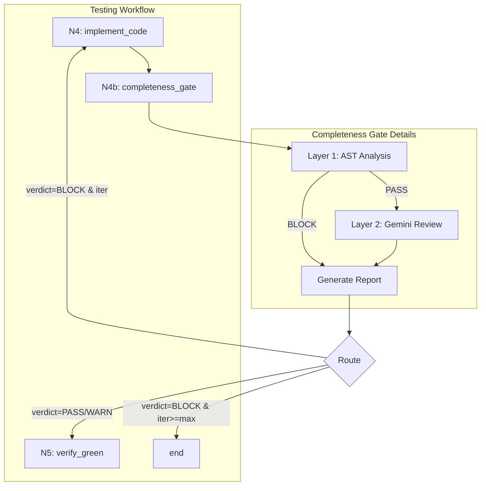

# 147 - Feature: Implementation Completeness Gate (Anti-Stub Detection)

## 1. Context & Goal
* **Issue:** #147
* **Objective:** Add a completeness gate (N4b) between implementation and verification nodes to detect semantically incomplete implementations that pass mechanical tests but fail to fulfill LLD requirements.
* **Status:** Draft
* **Related Issues:** #181 (subsumed - Implementation Report), #335 (N2.5 precedent), #225 (skipped test enforcement), #354 (mutation testing - future), #149-#156 (codebase scan findings - closed)

### Open Questions
*Questions that need clarification before or during implementation. Remove when resolved.*

- [ ] Should the Gemini semantic review have a configurable timeout for budget control?
- [ ] What is the maximum number of N4→N4b→N4 iterations before escalating to human review vs hard stop?

## 2. Proposed Changes

*This section is the **source of truth** for implementation. Describe exactly what will be built.*

### 2.1 Files Changed

| File | Change Type | Description |
|------|-------------|-------------|
| `assemblyzero/workflows/testing/completeness/` | Add (Directory) | Package directory for completeness analysis |
| `assemblyzero/workflows/testing/completeness/__init__.py` | Add | Package init with exports |
| `assemblyzero/workflows/testing/completeness/ast_analyzer.py` | Add | Layer 1 AST-based analysis functions |
| `assemblyzero/workflows/testing/completeness/report_generator.py` | Add | Generate implementation verification reports |
| `assemblyzero/workflows/testing/nodes/completeness_gate.py` | Add | N4b workflow node implementation |
| `tests/unit/test_completeness_gate.py` | Add | Unit and integration tests for completeness gate |
| `assemblyzero/workflows/testing/graph.py` | Modify | Insert N4b node between N4 and N5, add routing |
| `assemblyzero/workflows/testing/state.py` | Modify | Add completeness_verdict and completeness_issues fields |
| `assemblyzero/workflows/testing/nodes/__init__.py` | Modify | Export completeness_gate node |

### 2.1.1 Path Validation (Mechanical - Auto-Checked)

*Issue #277: Before human or Gemini review, paths are verified programmatically.*

Mechanical validation automatically checks:
- All "Modify" files must exist in repository
- All "Delete" files must exist in repository
- All "Add" files must have existing parent directories
- No placeholder prefixes (`src/`, `lib/`, `app/`) unless directory exists

**If validation fails, the LLD is BLOCKED before reaching review.**

### 2.2 Dependencies

*No new packages required. Uses standard library `ast` module.*

```toml
# pyproject.toml additions (if any)
# None - uses stdlib ast module
```

### 2.3 Data Structures

```python
# Pseudocode - NOT implementation
class CompletenessIssue(TypedDict):
    """Single completeness issue detected by analysis."""
    category: Literal["dead_cli_flag", "empty_branch", "docstring_only", "trivial_assertion", "unused_import"]
    file_path: str
    line_number: int
    description: str
    severity: Literal["ERROR", "WARNING"]

class CompletenessResult(TypedDict):
    """Result of completeness analysis."""
    verdict: Literal["PASS", "WARN", "BLOCK"]
    issues: list[CompletenessIssue]
    ast_analysis_ms: int
    gemini_review_ms: int | None

class RequirementVerification(TypedDict):
    """Single LLD requirement verification status."""
    requirement_id: int
    requirement_text: str
    status: Literal["IMPLEMENTED", "PARTIAL", "MISSING"]
    evidence: str  # File:line or explanation

class ImplementationReport(TypedDict):
    """Full implementation verification report."""
    issue_number: int
    requirements: list[RequirementVerification]
    completeness_result: CompletenessResult
    generated_at: str  # ISO timestamp

# State additions
class TestingState(TypedDict):
    # ... existing fields ...
    completeness_verdict: Literal["PASS", "WARN", "BLOCK", ""]
    completeness_issues: list[CompletenessIssue]
    implementation_report_path: str  # From #181
```

### 2.4 Function Signatures

```python
# assemblyzero/workflows/testing/completeness/ast_analyzer.py

def analyze_dead_cli_flags(source_code: str, file_path: str) -> list[CompletenessIssue]:
    """Detect argparse add_argument calls with no corresponding usage."""
    ...

def analyze_empty_branches(source_code: str, file_path: str) -> list[CompletenessIssue]:
    """Detect if/elif/else branches with only pass, return None, or trivial bodies."""
    ...

def analyze_docstring_only_functions(source_code: str, file_path: str) -> list[CompletenessIssue]:
    """Detect functions with docstring + pass/return None only."""
    ...

def analyze_trivial_assertions(source_code: str, file_path: str) -> list[CompletenessIssue]:
    """Detect test functions where sole assertion is 'is not None' or similar."""
    ...

def analyze_unused_imports(source_code: str, file_path: str) -> list[CompletenessIssue]:
    """Detect imports with no usage in function bodies."""
    ...

def run_ast_analysis(files: list[Path]) -> CompletenessResult:
    """Run all AST checks on provided files."""
    ...


# assemblyzero/workflows/testing/completeness/report_generator.py

def generate_implementation_report(
    issue_number: int,
    lld_path: Path,
    implementation_files: list[Path],
    completeness_result: CompletenessResult,
) -> Path:
    """Generate implementation report to docs/reports/active/{issue}-implementation-report.md."""
    ...

def extract_lld_requirements(lld_path: Path) -> list[tuple[int, str]]:
    """Parse Section 3 requirements from LLD markdown."""
    ...


# assemblyzero/workflows/testing/nodes/completeness_gate.py

def completeness_gate(state: TestingState) -> TestingState:
    """N4b: Verify implementation completeness before proceeding to test verification."""
    ...

def route_after_completeness_gate(state: TestingState) -> Literal["N5_verify_green", "N4_implement_code", "end"]:
    """Route based on completeness verdict and iteration count."""
    ...
```

### 2.5 Logic Flow (Pseudocode)

```
N4b_completeness_gate:
1. Receive state from N4_implement_code
2. Collect modified/created files from state.files_changed

3. LAYER 1: AST Analysis
   FOR each file in implementation files:
     - Run analyze_dead_cli_flags()
     - Run analyze_empty_branches()
     - Run analyze_docstring_only_functions()
     - Run analyze_unused_imports()
   FOR each test file:
     - Run analyze_trivial_assertions()
   
   Aggregate issues with severity

4. IF Layer 1 has BLOCK-level issues:
   - Set verdict = "BLOCK"
   - Skip Layer 2
   ELSE:
   
5. LAYER 2: Gemini Semantic Review (orchestrator-controlled)
   - Extract requirements from LLD Section 3
   - Prepare review materials (code snippets, LLD excerpt)
   - Return state with review_materials for orchestrator
   - Orchestrator submits to Gemini
   - Receive Gemini verdict

6. Generate implementation report
   - Write to docs/reports/active/{issue}-implementation-report.md
   - Set state.implementation_report_path

7. Update state:
   - state.completeness_verdict = verdict
   - state.completeness_issues = all_issues

8. Return state

route_after_completeness_gate:
1. IF verdict == "BLOCK":
   - IF iteration_count >= max_iterations: return "end"
   - ELSE: return "N4_implement_code"
2. ELSE:
   - return "N5_verify_green"
```

### 2.6 Technical Approach

* **Module:** `assemblyzero/workflows/testing/completeness/`
* **Pattern:** Two-layer validation (fast deterministic → slow semantic)
* **Key Decisions:**
  - AST analysis runs first as a fast, deterministic gate
  - Gemini review only triggers if AST passes (cost control)
  - Orchestrator controls Gemini submission per WORKFLOW.md
  - Report generation is a side effect, not blocking

### 2.7 Architecture Decisions

| Decision | Options Considered | Choice | Rationale |
|----------|-------------------|--------|-----------|
| Analysis ordering | Parallel layers, Sequential layers | Sequential (AST then Gemini) | AST is fast/free; skip expensive Gemini if AST fails |
| AST implementation | Tree-sitter, Python ast, LibCST | Python ast | Zero dependencies, sufficient for our patterns |
| Report storage | Database, S3, Local markdown | Local markdown | Consistent with existing report patterns |
| Loop limit | Hardcoded, Configurable, Unlimited | Configurable via state | Different issues may need different patience |

**Architectural Constraints:**
- Must integrate with existing LangGraph workflow structure
- Gemini calls must go through orchestrator (not direct from node)
- Cannot modify N4 or N5 node logic (only add N4b between them)

## 3. Requirements

*What must be true when this is done. These become acceptance criteria.*

1. N4b node inserted into workflow graph between N4 and N5
2. AST analyzer detects dead CLI flags (add_argument without usage)
3. AST analyzer detects empty conditional branches (if x: pass)
4. AST analyzer detects docstring-only functions
5. AST analyzer detects trivial assertions in test files
6. AST analyzer detects unused imports from implementation
7. BLOCK verdict routes back to N4 for re-implementation
8. PASS/WARN verdict routes forward to N5
9. Implementation report generated at docs/reports/active/{issue}-implementation-report.md
10. Report includes LLD requirement verification table
11. Report includes completeness analysis summary
12. Max iteration limit prevents infinite loops
13. Layer 2 Gemini review prepared for orchestrator submission (not direct call)

## 4. Alternatives Considered

| Option | Pros | Cons | Decision |
|--------|------|------|----------|
| AST-only gate (no Gemini) | Fast, deterministic, zero cost | Misses semantic incompleteness | **Rejected** |
| Gemini-only gate (no AST) | Catches semantic issues | Expensive, slow, non-deterministic | **Rejected** |
| Two-layer approach | Best of both, cost-controlled | More complex implementation | **Selected** |
| Integrate into N4 node | Simpler graph | Violates single-responsibility | **Rejected** |
| Post-N5 check | Catches test-passing stubs | Late in pipeline, wastes test runs | **Rejected** |

**Rationale:** Two-layer approach provides deterministic fast-fail for obvious issues while preserving expensive semantic review for subtle completeness problems. Inserting as N4b maintains node separation.

## 5. Data & Fixtures

*Per [0108-lld-pre-implementation-review.md](0108-lld-pre-implementation-review.md) - complete this section BEFORE implementation.*

### 5.1 Data Sources

| Attribute | Value |
|-----------|-------|
| Source | Local filesystem (implementation files, LLD) |
| Format | Python source code, Markdown |
| Size | ~10-50 files per workflow run |
| Refresh | Per-workflow-run |
| Copyright/License | N/A - internal project files |

### 5.2 Data Pipeline

```
Implementation Files ──ast.parse──► AST Trees ──analyze──► CompletenessIssues
LLD Markdown ──parse──► Requirements ──compare──► RequirementVerification
CompletenessIssues + RequirementVerification ──format──► Implementation Report (Markdown)
```

### 5.3 Test Fixtures

| Fixture | Source | Notes |
|---------|--------|-------|
| Dead CLI flag example | Generated | Synthetic argparse code with unused flags |
| Empty branch example | Generated | if/else with pass bodies |
| Docstring-only function | Generated | Functions with docstring + return None |
| Trivial assertion test | Generated | Test with only `assert x is not None` |
| Valid implementation | Generated | Code with no issues (negative test) |
| Patterns from #149-#156 | Extracted | Real issues from codebase scan |

### 5.4 Deployment Pipeline

Report files are written to local `docs/reports/active/` directory. No external deployment required.

**If data source is external:** N/A - all sources are internal.

## 6. Diagram

### 6.1 Mermaid Quality Gate

Before finalizing any diagram, verify in [Mermaid Live Editor](https://mermaid.live) or GitHub preview:

- [x] **Simplicity:** Similar components collapsed (per 0006 §8.1)
- [x] **No touching:** All elements have visual separation (per 0006 §8.2)
- [x] **No hidden lines:** All arrows fully visible (per 0006 §8.3)
- [x] **Readable:** Labels not truncated, flow direction clear
- [ ] **Auto-inspected:** Agent rendered via mermaid.ink and viewed (per 0006 §8.5)

**Agent Auto-Inspection (MANDATORY):**

AI agents MUST render and view the diagram before committing:
1. Base64 encode diagram → fetch PNG from `https://mermaid.ink/img/{base64}`
2. Read the PNG file (multimodal inspection)
3. Document results below

**Auto-Inspection Results:**
```
- Touching elements: [ ] None / [ ] Found: ___
- Hidden lines: [ ] None / [ ] Found: ___
- Label readability: [ ] Pass / [ ] Issue: ___
- Flow clarity: [ ] Clear / [ ] Issue: ___
```

*Reference: [0006-mermaid-diagrams.md](0006-mermaid-diagrams.md)*

### 6.2 Diagram



## 7. Security & Safety Considerations

### 7.1 Security

| Concern | Mitigation | Status |
|---------|------------|--------|
| Code injection via AST parsing | ast.parse is read-only, no exec | Addressed |
| Path traversal in file collection | Validate files within project root | Addressed |
| Gemini prompt injection | Review materials are code excerpts, not user input | Addressed |

### 7.2 Safety

| Concern | Mitigation | Status |
|---------|------------|--------|
| Infinite loop in N4↔N4b cycle | max_iterations state field with hard limit | Addressed |
| False positive blocks valid code | WARN severity for uncertain detections, only ERROR blocks | Addressed |
| Report overwrite data loss | Reports use unique issue number in filename | Addressed |
| AST parse failure on syntax errors | Catch SyntaxError, report as separate issue | Addressed |

**Fail Mode:** Fail Open - If AST analysis fails unexpectedly, proceed to N5 with warning rather than blocking indefinitely.

**Recovery Strategy:** If N4b crashes, state contains completeness_issues=[], verdict="" allowing manual inspection and re-run.

## 8. Performance & Cost Considerations

### 8.1 Performance

| Metric | Budget | Approach |
|--------|--------|----------|
| AST analysis latency | < 500ms for 50 files | Python ast is fast, no I/O |
| Gemini review latency | < 30s | Only runs if AST passes |
| Memory | < 50MB | AST trees are small, process sequentially |

**Bottlenecks:** Gemini API call is the slowest component; mitigated by Layer 1 filtering.

### 8.2 Cost Analysis

| Resource | Unit Cost | Estimated Usage | Monthly Cost |
|----------|-----------|-----------------|--------------|
| Gemini API calls | ~$0.01 per review | ~100 reviews/month | ~$1 |
| Local compute | $0 | N/A | $0 |

**Cost Controls:**
- [x] Layer 1 AST analysis gates expensive Gemini calls
- [x] Gemini only called when AST analysis passes
- [ ] Budget alerts configured at {$X threshold} - N/A for this cost level

**Worst-Case Scenario:** If Layer 1 has bugs allowing all implementations through, Gemini costs increase proportionally. At $0.01/call, even 10x usage is $10/month.

## 9. Legal & Compliance

| Concern | Applies? | Mitigation |
|---------|----------|------------|
| PII/Personal Data | No | Only analyzes code, no user data |
| Third-Party Licenses | No | Uses stdlib ast only |
| Terms of Service | Yes | Gemini usage within existing API agreement |
| Data Retention | No | Reports are project artifacts, not sensitive |
| Export Controls | No | No restricted algorithms |

**Data Classification:** Internal

**Compliance Checklist:**
- [x] No PII stored without consent
- [x] All third-party licenses compatible with project license
- [x] External API usage compliant with provider ToS
- [x] Data retention policy documented (reports persist with project)

## 10. Verification & Testing

*Ref: [0005-testing-strategy-and-protocols.md](0005-testing-strategy-and-protocols.md)*

**Testing Philosophy:** Strive for 100% automated test coverage. Manual tests are a last resort for scenarios that genuinely cannot be automated.

### 10.0 Test Plan (TDD - Complete Before Implementation)

**TDD Requirement:** Tests MUST be written and failing BEFORE implementation begins.

| Test ID | Test Description | Expected Behavior | Status |
|---------|------------------|-------------------|--------|
| T010 | test_detect_dead_cli_flags | Returns issue for unused argparse arg | RED |
| T020 | test_detect_empty_branch_pass | Returns issue for `if x: pass` | RED |
| T030 | test_detect_empty_branch_return_none | Returns issue for `if x: return None` | RED |
| T040 | test_detect_docstring_only_function | Returns issue for func with docstring+pass | RED |
| T050 | test_detect_trivial_assertion | Returns issue for `assert x is not None` only | RED |
| T060 | test_detect_unused_import | Returns issue for import not used in functions | RED |
| T070 | test_valid_code_no_issues | Returns empty issues list for clean code | RED |
| T080 | test_completeness_gate_block_routing | BLOCK verdict routes to N4 | RED |
| T090 | test_completeness_gate_pass_routing | PASS verdict routes to N5 | RED |
| T100 | test_max_iterations_ends | BLOCK at max iterations routes to end | RED |
| T110 | test_report_generation | Report file created with correct structure | RED |
| T120 | test_lld_requirement_extraction | Requirements parsed from Section 3 | RED |

**Coverage Target:** ≥95% for all new code

**TDD Checklist:**
- [ ] All tests written before implementation
- [ ] Tests currently RED (failing)
- [ ] Test IDs match scenario IDs in 10.1
- [ ] Test file created at: `tests/unit/test_completeness_gate.py`

### 10.1 Test Scenarios

| ID | Scenario | Type | Input | Expected Output | Pass Criteria |
|----|----------|------|-------|-----------------|---------------|
| 010 | Dead CLI flag detection | Auto | Code with `add_argument('--foo')` unused | CompletenessIssue with category='dead_cli_flag' | Issue returned with correct file/line |
| 020 | Empty branch (pass) detection | Auto | Code with `if x: pass` | CompletenessIssue with category='empty_branch' | Issue identifies branch location |
| 030 | Empty branch (return None) detection | Auto | Code with `if mock: return None` | CompletenessIssue with category='empty_branch' | Issue identifies branch location |
| 040 | Docstring-only function detection | Auto | `def foo(): """Doc.""" pass` | CompletenessIssue with category='docstring_only' | Issue identifies function |
| 050 | Trivial assertion detection | Auto | Test with only `assert result is not None` | CompletenessIssue with category='trivial_assertion' | Issue warns about assertion quality |
| 060 | Unused import detection | Auto | `import os` with no usage | CompletenessIssue with category='unused_import' | Issue identifies import |
| 070 | Valid implementation (negative) | Auto | Complete implementation code | Empty issues list | No false positives |
| 080 | BLOCK routes to N4 | Auto | State with verdict='BLOCK', iter<max | Route returns 'N4_implement_code' | Correct routing |
| 090 | PASS routes to N5 | Auto | State with verdict='PASS' | Route returns 'N5_verify_green' | Correct routing |
| 100 | Max iterations ends workflow | Auto | State with verdict='BLOCK', iter>=max | Route returns 'end' | Prevents infinite loop |
| 110 | Report file generation | Auto | Issue #999, results | File at docs/reports/active/999-implementation-report.md | File exists with correct structure |
| 120 | LLD requirement parsing | Auto | LLD with Section 3 requirements | List of (id, text) tuples | All requirements extracted |

### 10.2 Test Commands

```bash
# Run all automated tests
poetry run pytest tests/unit/test_completeness_gate.py -v

# Run only fast/mocked tests (exclude live)
poetry run pytest tests/unit/test_completeness_gate.py -v -m "not live"

# Run with coverage
poetry run pytest tests/unit/test_completeness_gate.py -v --cov=assemblyzero/workflows/testing/completeness --cov-report=term-missing
```

### 10.3 Manual Tests (Only If Unavoidable)

N/A - All scenarios automated.

## 11. Risks & Mitigations

| Risk | Impact | Likelihood | Mitigation |
|------|--------|------------|------------|
| False positives block valid implementations | Med | Med | WARN severity for uncertain patterns; review false positive rate in first sprint |
| AST analysis misses edge cases | Low | Med | Start with high-confidence patterns; add patterns iteratively |
| Gemini semantic review gives inconsistent results | Med | Low | Layer 1 catches most issues; Layer 2 is enhancement |
| Integration breaks existing workflow | High | Low | Comprehensive integration tests; feature flag for rollout |
| Report generation fails silently | Low | Low | Log errors; proceed with verdict regardless of report |

## 12. Definition of Done

### Code
- [ ] Implementation complete and linted
- [ ] Code comments reference this LLD

### Tests
- [ ] All test scenarios pass
- [ ] Test coverage meets threshold (≥95%)

### Documentation
- [ ] LLD updated with any deviations
- [ ] Implementation Report (0103) completed
- [ ] Test Report (0113) completed if applicable

### Review
- [ ] Code review completed
- [ ] User approval before closing issue

### 12.1 Traceability (Mechanical - Auto-Checked)

*Issue #277: Cross-references are verified programmatically.*

Mechanical validation automatically checks:
- Every file mentioned in this section must appear in Section 2.1
- Every risk mitigation in Section 11 should have a corresponding function in Section 2.4 (warning if not)

**If files are missing from Section 2.1, the LLD is BLOCKED.**

---

## Appendix: Review Log

*Track all review feedback with timestamps and implementation status.*

<!-- Note: Timestamps are auto-generated by the workflow. Do not fill in manually. -->

### Review Summary

| Review | Date | Verdict | Key Issue |
|--------|------|---------|-----------|
| - | - | - | - |

**Final Status:** PENDING