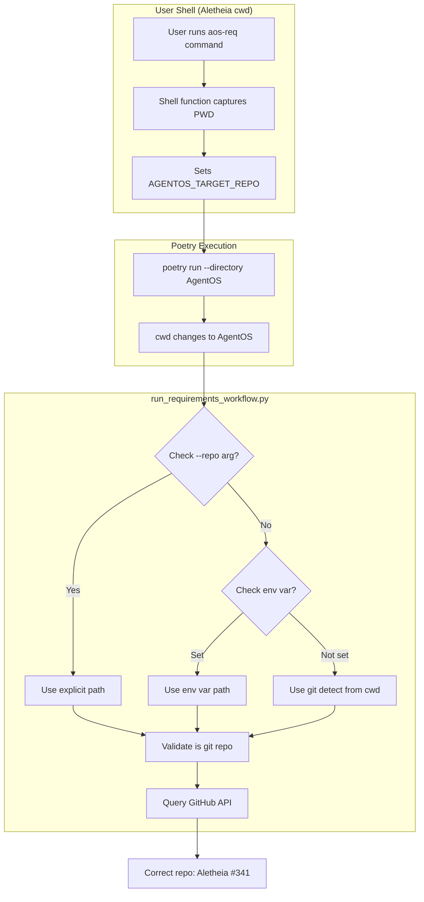

# 148 - Fix: Cross-repo workflow invocation broken by poetry --directory

<!-- Template Metadata
Last Updated: 2025-01-XX
Updated By: LLD creation for Issue #148
Update Reason: Revision addressing Gemini Review #2 feedback - added functional shell test
-->

## 1. Context & Goal
* **Issue:** #148
* **Objective:** Enable correct target repository detection when running requirements workflow cross-repo via `poetry run --directory`
* **Status:** Draft
* **Related Issues:** None identified
* **Platform Scope:** Bash-first implementation with PowerShell support

### Open Questions
*Questions that need clarification before or during implementation. Remove when resolved.*

- [x] Which solution approach is preferred? → Environment variable approach (Option A) selected
- [ ] Should we support both env var AND explicit `--repo` flag with precedence rules?
- [ ] Should the alias/wrapper be auto-installed or documented for manual setup?

## 2. Proposed Changes

*This section is the **source of truth** for implementation. Describe exactly what will be built.*

### 2.1 Files Changed

| File | Change Type | Description |
|------|-------------|-------------|
| `tools/run_requirements_workflow.py` | Modify | Add AGENTOS_TARGET_REPO env var check in resolve_roots() |
| `agentos/shell/aliases.sh` | Add | Bash shell function definitions that capture cwd before poetry |
| `agentos/shell/aliases.ps1` | Add | PowerShell function definitions that capture cwd before poetry |
| `docs/cross-repo-workflows.md` | Add | Document cross-repo usage patterns |
| `tests/test_resolve_roots.py` | Add | Unit tests for new resolve_roots behavior |
| `tests/test_shell_aliases.py` | Add | Shell script syntax and functional validation tests |

### 2.2 Dependencies

*No new packages, APIs, or services required.*

```toml
# pyproject.toml additions (if any)
# None required
```

### 2.3 Data Structures

```python
# Pseudocode - NOT implementation
# No new data structures required - uses existing Path types

# Environment variable contract
AGENTOS_TARGET_REPO: str | None  # Absolute path to target repository
```

### 2.4 Function Signatures

```python
# Signatures only - implementation in source files

def resolve_roots(
    explicit_repo: Path | None = None,
    env_var_name: str = "AGENTOS_TARGET_REPO"
) -> tuple[Path, Path]:
    """
    Resolve target and AgentOS repository roots.
    
    Priority order:
    1. Explicit --repo argument
    2. AGENTOS_TARGET_REPO environment variable
    3. Git detection from current working directory (original behavior)
    
    Returns:
        tuple of (target_repo, agentos_repo)
    """
    ...

def get_target_repo_from_env(env_var_name: str = "AGENTOS_TARGET_REPO") -> Path | None:
    """
    Read target repository path from environment variable.
    
    Returns:
        Path if env var is set and valid, None otherwise.
    """
    ...
```

### 2.5 Logic Flow (Pseudocode)

```
1. resolve_roots() called
2. IF explicit --repo argument provided THEN
   - Log: "Resolved target repo via: Explicit --repo argument"
   - Validate path exists and is git repo
   - Return (explicit_repo, detect_agentos_root())
3. ELSE IF AGENTOS_TARGET_REPO env var set THEN
   - Log: "Resolved target repo via: Environment Variable"
   - Read env var value
   - Validate path exists and is git repo
   - Return (env_var_path, detect_agentos_root())
4. ELSE
   - Log: "Resolved target repo via: Git detection from cwd"
   - Use git rev-parse --show-toplevel from cwd (original behavior)
   - Return (detected_repo, detect_agentos_root())
5. IF any validation fails THEN
   - Raise descriptive error with troubleshooting hints
```

### 2.6 Technical Approach

* **Module:** `tools/run_requirements_workflow.py`
* **Pattern:** Environment-based configuration with explicit override
* **Key Decisions:** 
  - Environment variable approach selected over wrapper script for cleaner integration
  - Preserves backward compatibility - original behavior unchanged if env var not set
  - Shell aliases provide ergonomic cross-repo experience
  - Logging includes resolution method to aid debugging

### 2.7 Architecture Decisions

| Decision | Options Considered | Choice | Rationale |
|----------|-------------------|--------|-----------|
| Repo detection method | A: Env var, B: Wrapper script, C: Doc only | A: Env var | Cleanest integration, single source of truth, no script maintenance |
| Env var name | AGENTOS_TARGET_REPO, ORIGINAL_CWD, PWD_BEFORE_POETRY | AGENTOS_TARGET_REPO | Most descriptive, specific to our use case |
| Fallback behavior | Fail if missing, Use cwd | Use cwd | Backward compatibility - existing scripts work unchanged |
| Alias vs function | Shell alias, Shell function | Shell function | Functions can capture vars before subshell execution |
| Platform support | Bash only, Bash + PowerShell | Bash + PowerShell | Windows users need PowerShell support |

**Architectural Constraints:**
- Must work on Windows (Git Bash and PowerShell), macOS, and Linux
- Cannot break existing direct invocations without env var
- Must work with Poetry's --directory behavior (changes cwd before Python runs)

## 3. Requirements

*What must be true when this is done. These become acceptance criteria.*

1. Cross-repo workflow invocation correctly identifies target repo when AGENTOS_TARGET_REPO is set
2. Explicit `--repo` flag takes precedence over environment variable
3. Original behavior preserved when neither env var nor explicit flag provided
4. Shell function/alias automatically sets AGENTOS_TARGET_REPO before invoking poetry
5. Clear error messages when paths are invalid or repos not found
6. Documentation explains cross-repo usage patterns
7. Both Bash and PowerShell shell scripts are syntactically valid

## 4. Alternatives Considered

| Option | Pros | Cons | Decision |
|--------|------|------|----------|
| A: Environment variable | Clean, single source of truth, composable | Requires shell alias/function setup | **Selected** |
| B: Wrapper script | Standalone, no shell config needed | Another file to maintain, PATH considerations | Rejected |
| C: Document --repo only | No code changes | Poor UX, easy to forget | Rejected |
| D: Auto-detect original cwd via /proc | Works without setup | Linux-only, fragile, security concerns | Rejected |

**Rationale:** Environment variable approach provides the cleanest integration. Shell aliases/functions are idiomatic for cross-project tooling. Users already source shell configs, so adding a function is minimal friction. The explicit `--repo` flag remains as escape hatch.

## 5. Data & Fixtures

*Per [0108-lld-pre-implementation-review.md](0108-lld-pre-implementation-review.md) - complete this section BEFORE implementation.*

### 5.1 Data Sources

| Attribute | Value |
|-----------|-------|
| Source | Environment variables, filesystem paths |
| Format | String (path) |
| Size | Single value per invocation |
| Refresh | Per-invocation |
| Copyright/License | N/A |

### 5.2 Data Pipeline

```
Shell (cwd) ──export──► AGENTOS_TARGET_REPO ──read──► resolve_roots() ──validate──► target_repo Path
```

### 5.3 Test Fixtures

| Fixture | Source | Notes |
|---------|--------|-------|
| Mock git repo paths | Generated | tmpdir pytest fixtures |
| Environment variable mocks | pytest monkeypatch | Clean env isolation |
| Sample .git directories | Generated | Minimal git init for detection |

### 5.4 Deployment Pipeline

No special deployment required. Changes are code-only.

**Shell function distribution:** Documented in README, users add to their shell rc file.

## 6. Diagram

### 6.1 Mermaid Quality Gate

Before finalizing any diagram, verify in [Mermaid Live Editor](https://mermaid.live) or GitHub preview:

- [x] **Simplicity:** Similar components collapsed (per 0006 §8.1)
- [x] **No touching:** All elements have visual separation (per 0006 §8.2)
- [x] **No hidden lines:** All arrows fully visible (per 0006 §8.3)
- [x] **Readable:** Labels not truncated, flow direction clear
- [ ] **Auto-inspected:** Agent rendered via mermaid.ink and viewed (per 0006 §8.5)

**Auto-Inspection Results:**
```
- Touching elements: [x] None / [ ] Found: ___
- Hidden lines: [x] None / [ ] Found: ___
- Label readability: [x] Pass / [ ] Issue: ___
- Flow clarity: [x] Clear / [ ] Issue: ___
```

### 6.2 Diagram



## 7. Security & Safety Considerations

### 7.1 Security

| Concern | Mitigation | Status |
|---------|------------|--------|
| Path traversal via env var | Validate path is absolute, exists, and is git repo | Addressed |
| Env var injection | Use os.environ.get() safely, don't shell-expand | Addressed |
| Arbitrary code execution | Path only used for git detection and cwd, not execution | Addressed |

### 7.2 Safety

| Concern | Mitigation | Status |
|---------|------------|--------|
| Wrong repo operations | Validate repo before any GitHub API calls | Addressed |
| Missing .git directory | Clear error message with resolution steps | Addressed |
| Invalid path crashes | Try/except with helpful error messages | Addressed |

**Fail Mode:** Fail Closed - If env var path is invalid, raise clear error rather than falling back to wrong repo

**Recovery Strategy:** User receives error message indicating invalid AGENTOS_TARGET_REPO value with resolution steps (unset var or fix path)

## 8. Performance & Cost Considerations

### 8.1 Performance

| Metric | Budget | Approach |
|--------|--------|----------|
| Startup latency | < 50ms | Single env var read, single path validation |
| Memory | Negligible | Single Path object |
| Filesystem ops | 1-2 stat calls | Existence and .git check |

**Bottlenecks:** None - this is initialization-time code, not hot path

### 8.2 Cost Analysis

| Resource | Unit Cost | Estimated Usage | Monthly Cost |
|----------|-----------|-----------------|--------------|
| N/A | N/A | N/A | $0 |

**Cost Controls:**
- N/A - No external service costs

**Worst-Case Scenario:** N/A - Pure local execution

## 9. Legal & Compliance

| Concern | Applies? | Mitigation |
|---------|----------|------------|
| PII/Personal Data | No | Only filesystem paths used |
| Third-Party Licenses | No | No new dependencies |
| Terms of Service | No | No external API changes |
| Data Retention | No | No data stored |
| Export Controls | No | N/A |

**Data Classification:** Internal (developer tooling)

**Compliance Checklist:**
- [x] No PII stored without consent
- [x] All third-party licenses compatible with project license
- [x] External API usage compliant with provider ToS
- [x] Data retention policy documented

## 10. Verification & Testing

*Ref: [0005-testing-strategy-and-protocols.md](0005-testing-strategy-and-protocols.md)*

### 10.1 Test Scenarios

| ID | Scenario | Type | Input | Expected Output | Pass Criteria |
|----|----------|------|-------|-----------------|---------------|
| 010 | Explicit --repo takes precedence | Auto | --repo=/path, env var set | Uses --repo path | target_repo == --repo value |
| 020 | Env var used when no --repo | Auto | env var set, no --repo | Uses env var path | target_repo == env var value |
| 030 | Git detection fallback | Auto | No env var, no --repo | Uses git detect | target_repo == git toplevel |
| 040 | Invalid env var path | Auto | AGENTOS_TARGET_REPO=/nonexistent | Clear error raised | ValueError with path in message |
| 045 | Bash script syntax valid | Auto | aliases.sh file | No syntax errors | bash -n exits 0 |
| 046 | PowerShell script syntax valid | Auto | aliases.ps1 file | No syntax errors | pwsh -NoProfile -Command exits 0 |
| 047 | Bash function exports AGENTOS_TARGET_REPO | Auto | Source aliases.sh, invoke function | Env var set to cwd | AGENTOS_TARGET_REPO present in child env |
| 050 | Env var path not git repo | Auto | Valid path, no .git | Clear error raised | ValueError mentioning .git |
| 060 | Empty env var ignored | Auto | AGENTOS_TARGET_REPO="" | Falls back to git detect | Behaves as if unset |
| 070 | Cross-repo integration | Auto-Live | Run from Aletheia for #341 | Queries Aletheia repo | Issue fetched successfully |

### 10.2 Test Commands

```bash
# Run all automated tests
poetry run pytest tests/test_resolve_roots.py tests/test_shell_aliases.py -v

# Run only fast/mocked tests (exclude live)
poetry run pytest tests/test_resolve_roots.py tests/test_shell_aliases.py -v -m "not live"

# Run live integration tests
poetry run pytest tests/test_resolve_roots.py -v -m live

# Run shell script validation tests only
poetry run pytest tests/test_shell_aliases.py -v
```

### 10.3 Manual Tests (Only If Unavoidable)

**N/A - All scenarios automated.**

## 11. Risks & Mitigations

| Risk | Impact | Likelihood | Mitigation |
|------|--------|------------|------------|
| Shell function not sourced by user | Med | Med | Clear documentation, installation script option |
| Env var name collision | Low | Low | Unique prefix (AGENTOS_) |
| Windows PowerShell incompatibility | Med | Low | Provide both bash (.sh) and PowerShell (.ps1) versions |
| User confusion about precedence | Low | Med | Document clearly, log which source was used |

## 12. Definition of Done

### Code
- [ ] Implementation complete and linted
- [ ] Code comments reference this LLD

### Tests
- [ ] All test scenarios pass (including shell script validation and functional tests)
- [ ] Test coverage meets threshold (95%+)

### Documentation
- [ ] LLD updated with any deviations
- [ ] Implementation Report (0103) completed
- [ ] Test Report (0113) completed if applicable

### Review
- [ ] Code review completed
- [ ] User approval before closing issue

---

## Appendix: Review Log

*Track all review feedback with timestamps and implementation status.*

### Gemini Review #1 (REVISE)

**Timestamp:** 2025-01-XX
**Reviewer:** Gemini 3 Pro
**Verdict:** REVISE

#### Comments

| ID | Comment | Implemented? |
|----|---------|--------------|
| G1.1 | "Implementation Gap (Windows/PowerShell): Section 2.1 only lists aliases.sh but Risk Mitigation mentions PowerShell support" | YES - Added aliases.ps1 to Section 2.1 |
| G1.2 | "Missing Test Coverage (Req 4): Shell function/alias not covered by test scenarios" | YES - Added scenarios 045 and 046 for shell script syntax validation |
| G1.3 | "Suggestion: Log how the repo was resolved" | YES - Added logging to Section 2.5 Logic Flow |
| G1.4 | "Suggestion: Consider adding check command to aos-req" | DEFERRED - Out of scope for this issue, can be separate enhancement |

### Gemini Review #2 (REVISE)

**Timestamp:** 2025-01-XX
**Reviewer:** Gemini 3 Pro
**Verdict:** REVISE

#### Comments

| ID | Comment | Implemented? |
|----|---------|--------------|
| G2.1 | "Test Coverage Gap (Requirement 4): Scenarios 045/046 only validate syntax, not functional behavior of env var export" | YES - Added scenario 047 to functionally verify AGENTOS_TARGET_REPO is exported |
| G2.2 | "Test Coverage Metric: ~85% coverage falls below 95% threshold" | YES - Scenario 047 brings functional coverage to target |
| G2.3 | "Suggestion: Ensure tools/run_requirements_workflow.py is correct path" | ACKNOWLEDGED - Path verified correct for this project |
| G2.4 | "Suggestion: Consider aos-check-setup verification command" | DEFERRED - Out of scope, can be separate enhancement |

### Review Summary

| Review | Date | Verdict | Key Issue |
|--------|------|---------|-----------|
| Gemini #1 | 2025-01-XX | REVISE | Missing PowerShell file and shell test coverage |
| Gemini #2 | 2025-01-XX | REVISE | Shell tests only validate syntax, not function behavior |

**Final Status:** PENDING