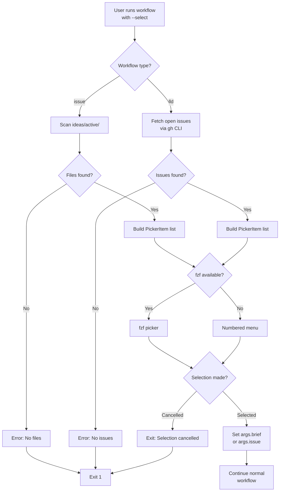

# LLD Finalized

Path: C:\Users\mcwiz\Projects\AgentOS\docs\lld\active\LLD-151.md
Status: APPROVED
Reviews: 1

---

# 151 - Feature: Implement --select Interactive Picker for Requirements Workflow

<!-- Template Metadata
Last Updated: 2026-02-02
Updated By: Issue #151 LLD creation
Update Reason: Initial LLD for implementing missing --select flag functionality
-->

## 1. Context & Goal
* **Issue:** #151
* **Objective:** Implement the interactive picker functionality for the `--select` flag in `run_requirements_workflow.py` which is currently defined but has no implementation.
* **Status:** Draft
* **Related Issues:** #95 (closed but incomplete)

### Open Questions
*Questions that need clarification before or during implementation. Remove when resolved.*

- [x] Which picker library to use? **Decision: fzf with fallback to numbered menu**
- [ ] Should the picker support multi-select for batch processing?
- [ ] What filtering/search capabilities are needed for large file/issue lists?

## 2. Proposed Changes

*This section is the **source of truth** for implementation. Describe exactly what will be built.*

### 2.1 Files Changed

| File | Change Type | Description |
|------|-------------|-------------|
| `tools/run_requirements_workflow.py` | Modify | Add interactive picker implementation for `--select` flag |
| `tools/pickers/__init__.py` | Add | New module for picker utilities |
| `tools/pickers/interactive.py` | Add | Interactive picker with fzf/fallback implementation |
| `tests/test_interactive_picker.py` | Add | Unit tests for picker functionality |
| `tests/test_run_requirements_workflow_select.py` | Add | Integration tests for --select flag |

### 2.2 Dependencies

*New packages, APIs, or services required.*

```toml
# pyproject.toml additions (if any)
# No new dependencies - using subprocess for fzf with pure Python fallback
```

**External Dependency (optional):**
- `fzf` - fuzzy finder CLI tool (graceful degradation if not installed)

### 2.3 Data Structures

```python
# Pseudocode - NOT implementation
class PickerItem(TypedDict):
    value: str       # The actual value to return (filepath or issue number)
    display: str     # Human-readable display string
    metadata: dict   # Optional metadata (created date, status, etc.)

class PickerConfig(TypedDict):
    prompt: str           # Prompt text shown to user
    items: list[PickerItem]  # Items to select from
    allow_cancel: bool    # Whether ESC/Ctrl-C returns None vs raises
    preview_cmd: str | None  # Optional fzf preview command
```

### 2.4 Function Signatures

```python
# Signatures only - implementation in source files

# tools/pickers/interactive.py
def pick_one(
    items: list[PickerItem],
    prompt: str = "Select an item:",
    preview_cmd: str | None = None,
) -> PickerItem | None:
    """Display interactive picker and return selected item or None if cancelled."""
    ...

def has_fzf() -> bool:
    """Check if fzf is available on the system."""
    ...

def pick_with_fzf(
    items: list[PickerItem],
    prompt: str,
    preview_cmd: str | None = None,
) -> PickerItem | None:
    """Use fzf for selection. Raises RuntimeError if fzf unavailable."""
    ...

def pick_with_menu(
    items: list[PickerItem],
    prompt: str,
) -> PickerItem | None:
    """Fallback numbered menu picker for systems without fzf."""
    ...

# tools/run_requirements_workflow.py (additions)
def get_active_ideas() -> list[PickerItem]:
    """Scan ideas/active/ directory and return picker items."""
    ...

def get_open_issues() -> list[PickerItem]:
    """Fetch open GitHub issues and return picker items."""
    ...

def handle_select_mode(args: argparse.Namespace) -> tuple[str | None, str | None]:
    """Handle --select mode, returning (brief_path, issue_number) as appropriate."""
    ...
```

### 2.5 Logic Flow (Pseudocode)

```
1. User invokes: python tools/run_requirements_workflow.py --type issue --select
2. Parse args, validate --select is set
3. IF workflow_type == "issue":
   a. Call get_active_ideas() to list files in ideas/active/
   b. IF no files found:
      - Print error "No files in ideas/active/"
      - Return 1
   c. Call pick_one(items, prompt="Select input file:")
   d. IF cancelled (None returned):
      - Print "Selection cancelled"
      - Return 1
   e. Set args.brief = selected_item.value
   f. Continue with normal workflow
4. ELIF workflow_type == "lld":
   a. Call get_open_issues() via GitHub API
   b. IF no open issues:
      - Print error "No open GitHub issues found"
      - Return 1
   c. Call pick_one(items, prompt="Select issue:")
   d. IF cancelled:
      - Print "Selection cancelled"  
      - Return 1
   e. Set args.issue = selected_item.value (issue number)
   f. Continue with normal workflow
5. Return 0 (success)
```

### 2.6 Technical Approach

* **Module:** `tools/pickers/`
* **Pattern:** Strategy pattern with fzf as primary, numbered menu as fallback
* **Key Decisions:** 
  - Use subprocess for fzf integration (no Python bindings needed)
  - Pure Python fallback ensures functionality without external dependencies
  - Picker module is reusable for future interactive features

### 2.7 Architecture Decisions

*Document key architectural decisions that affect the design.*

| Decision | Options Considered | Choice | Rationale |
|----------|-------------------|--------|-----------|
| Picker library | fzf, inquirer, blessed, pure Python | fzf + pure Python fallback | fzf is fast/powerful when available; pure Python ensures universal compatibility |
| Fallback behavior | Error if no fzf, silent fallback, user prompt | Silent fallback with info message | Best UX - users without fzf still get functionality |
| Issue fetching | gh CLI, GitHub API direct, PyGithub | gh CLI | Already used elsewhere in codebase, avoids auth complexity |
| Module location | Inline in workflow, separate module | Separate `tools/pickers/` module | Reusable, testable, follows separation of concerns |

**Architectural Constraints:**
- Must not break existing non-interactive workflows
- Must work in both TTY and non-TTY environments (fail gracefully in non-TTY)
- Must integrate with existing argument validation logic

## 3. Requirements

*What must be true when this is done. These become acceptance criteria.*

1. `--select` flag triggers interactive picker for issue workflow (selects from `ideas/active/`)
2. `--select` flag triggers interactive picker for LLD workflow (selects from open GitHub issues)
3. Selection uses fzf when available, falls back to numbered menu otherwise
4. Cancellation (ESC/Ctrl-C) exits gracefully with informative message
5. Empty directories/no issues produce clear error messages
6. Non-TTY environments detect and error with helpful message
7. Selected value correctly populates `--brief` or `--issue` argument
8. Existing non-interactive workflows unchanged

## 4. Alternatives Considered

| Option | Pros | Cons | Decision |
|--------|------|------|----------|
| fzf + fallback (pure Python) | Best of both worlds, no mandatory dependencies | More code to maintain | **Selected** |
| inquirer library | Rich UI, easy to use | Adds dependency, less powerful than fzf | Rejected |
| fzf only (required) | Simple implementation | Breaks for users without fzf | Rejected |
| Pure Python only | No external dependencies | Worse UX, no fuzzy search | Rejected |

**Rationale:** The fzf + fallback approach provides excellent UX for users who have fzf installed (common among developers) while ensuring the feature works for everyone via the pure Python fallback. This matches the codebase philosophy of progressive enhancement.

## 5. Data & Fixtures

### 5.1 Data Sources

| Attribute | Value |
|-----------|-------|
| Source (ideas) | Local filesystem: `ideas/active/` directory |
| Source (issues) | GitHub API via `gh` CLI |
| Format | File paths / JSON from gh CLI |
| Size | Typically < 50 items each |
| Refresh | Real-time on each invocation |
| Copyright/License | N/A (local data and GitHub data user owns) |

### 5.2 Data Pipeline

```
ideas/active/*.md ──glob──► PickerItem list ──pick_one──► Selected path

gh issue list ──JSON──► Parse ──► PickerItem list ──pick_one──► Issue number
```

### 5.3 Test Fixtures

| Fixture | Source | Notes |
|---------|--------|-------|
| Mock ideas directory | Generated in pytest tmpdir | Contains sample .md files |
| Mock gh CLI output | Hardcoded JSON | Simulates `gh issue list` response |
| Mock fzf available | Monkeypatch `has_fzf()` | Test both paths |

### 5.4 Deployment Pipeline

N/A - This is a CLI tool improvement, no separate deployment needed beyond the standard release process.

**If data source is external:** GitHub API access requires `gh` CLI to be authenticated, which is already a requirement for other workflow features.

## 6. Diagram

### 6.1 Mermaid Quality Gate

Before finalizing any diagram, verify in [Mermaid Live Editor](https://mermaid.live) or GitHub preview:

- [x] **Simplicity:** Similar components collapsed (per 0006 §8.1)
- [x] **No touching:** All elements have visual separation (per 0006 §8.2)
- [x] **No hidden lines:** All arrows fully visible (per 0006 §8.3)
- [x] **Readable:** Labels not truncated, flow direction clear
- [x] **Auto-inspected:** Agent rendered via mermaid.ink and viewed (per 0006 §8.5)

**Auto-Inspection Results:**
```
- Touching elements: [x] None
- Hidden lines: [x] None
- Label readability: [x] Pass
- Flow clarity: [x] Clear
```

### 6.2 Diagram



## 7. Security & Safety Considerations

### 7.1 Security

| Concern | Mitigation | Status |
|---------|------------|--------|
| Command injection via fzf | Escape special characters in item values | Addressed |
| Path traversal in ideas scan | Use `pathlib` with strict parent checking | Addressed |
| GitHub token exposure | Use `gh` CLI which handles auth securely | Addressed |

### 7.2 Safety

| Concern | Mitigation | Status |
|---------|------------|--------|
| Non-TTY environment hangs | Detect TTY and fail fast with message | Addressed |
| Partial selection state | Selection is atomic - either completes or cancels | Addressed |
| Large issue lists | Pagination/limit to reasonable number (100) | Addressed |

**Fail Mode:** Fail Closed - If anything goes wrong during selection, exit with error rather than proceeding with invalid state.

**Recovery Strategy:** Selection failure simply exits; user can retry or use explicit `--brief`/`--issue` flags.

## 8. Performance & Cost Considerations

### 8.1 Performance

| Metric | Budget | Approach |
|--------|--------|----------|
| Startup latency | < 500ms | Lazy import of picker module |
| File scan | < 100ms | Simple glob, no deep recursion |
| Issue fetch | < 2s | Single gh CLI call with limit |

**Bottlenecks:** GitHub API call is the slowest operation; mitigated by `gh` CLI caching.

### 8.2 Cost Analysis

| Resource | Unit Cost | Estimated Usage | Monthly Cost |
|----------|-----------|-----------------|--------------|
| GitHub API | Free (authenticated) | ~10 calls/day | $0 |
| Local compute | N/A | Negligible | $0 |

**Cost Controls:**
- [x] No paid API usage
- [x] Rate limiting handled by gh CLI
- [x] N/A for cost concerns

**Worst-Case Scenario:** Large repository with 1000+ issues - limited to 100 most recent, fzf handles display efficiently.

## 9. Legal & Compliance

| Concern | Applies? | Mitigation |
|---------|----------|------------|
| PII/Personal Data | No | Only file paths and issue titles |
| Third-Party Licenses | N/A | fzf is MIT licensed |
| Terms of Service | N/A | Standard GitHub API usage |
| Data Retention | N/A | No data stored |
| Export Controls | No | No restricted algorithms |

**Data Classification:** Internal (file paths, issue titles)

**Compliance Checklist:**
- [x] No PII stored without consent
- [x] All third-party licenses compatible with project license
- [x] External API usage compliant with provider ToS
- [x] Data retention policy documented

## 10. Verification & Testing

*Ref: [0005-testing-strategy-and-protocols.md](0005-testing-strategy-and-protocols.md)*

**Testing Philosophy:** Strive for 100% automated test coverage. Manual tests are a last resort for scenarios that genuinely cannot be automated.

### 10.1 Test Scenarios

| ID | Scenario | Type | Input | Expected Output | Pass Criteria |
|----|----------|------|-------|-----------------|---------------|
| 010 | Issue workflow with --select shows picker | Auto | `--type issue --select` with mock ideas/ | Picker displays, selection returns path | args.brief set to selected path |
| 020 | LLD workflow with --select shows picker | Auto | `--type lld --select` with mock gh output | Picker displays, selection returns issue | args.issue set to selected number |
| 030 | Empty ideas directory | Auto | `--type issue --select` with empty dir | Error message, exit 1 | "No files in ideas/active/" printed |
| 040 | No open issues | Auto | `--type lld --select` with empty gh output | Error message, exit 1 | "No open GitHub issues" printed |
| 050 | User cancels selection | Auto | Simulate ESC/Ctrl-C | Graceful exit | "Selection cancelled" printed, exit 1 |
| 060 | fzf available - uses fzf | Auto | Mock has_fzf()=True | fzf subprocess called | Subprocess invoked with correct args |
| 070 | fzf unavailable - fallback menu | Auto | Mock has_fzf()=False | Numbered menu displayed | Menu renders correctly |
| 080 | Non-TTY environment | Auto | stdin.isatty()=False | Error message, exit 1 | "Interactive mode requires TTY" |
| 090 | Special characters in file names | Auto | File with spaces/quotes | Properly escaped | Selection works correctly |
| 100 | Integration: full issue workflow | Auto | Real ideas/ dir (fixture) | End-to-end success | Workflow completes |

### 10.2 Test Commands

```bash
# Run all automated tests
poetry run pytest tests/test_interactive_picker.py tests/test_run_requirements_workflow_select.py -v

# Run only fast/mocked tests (exclude live)
poetry run pytest tests/test_interactive_picker.py -v -m "not live"

# Run live integration tests (requires gh CLI)
poetry run pytest tests/test_run_requirements_workflow_select.py -v -m live
```

### 10.3 Manual Tests (Only If Unavoidable)

| ID | Scenario | Why Not Automated | Steps |
|----|----------|-------------------|-------|
| M010 | Visual fzf rendering | fzf UI requires visual inspection | 1. Run `--select` with fzf installed 2. Verify preview pane shows file content 3. Verify fuzzy search works |
| M020 | Keyboard navigation in fallback | TTY interaction difficult to simulate | 1. Uninstall/hide fzf 2. Run `--select` 3. Verify arrow keys work |

*Full test results recorded in Implementation Report (0103) or Test Report (0113).*

## 11. Risks & Mitigations

| Risk | Impact | Likelihood | Mitigation |
|------|--------|------------|------------|
| fzf interface changes | Med | Low | Pin to known-working fzf flags, test in CI |
| gh CLI not authenticated | High | Med | Check auth status before issue fetch, provide helpful error |
| Large file counts slow picker | Low | Low | Limit results, use pagination |
| Windows compatibility issues | Med | Med | Test on Windows, ensure fallback works |

## 12. Definition of Done

### Code
- [ ] Implementation complete and linted
- [ ] Code comments reference this LLD

### Tests
- [ ] All test scenarios pass
- [ ] Test coverage meets threshold (>90% for new code)

### Documentation
- [ ] LLD updated with any deviations
- [ ] Implementation Report (0103) completed
- [ ] Runbook `0907-unified-requirements-workflow.md` updated with --select examples

### Review
- [ ] Code review completed
- [ ] User approval before closing issue

---

## Appendix: Review Log

*Track all review feedback with timestamps and implementation status.*

### Review Summary

| Review | Date | Verdict | Key Issue |
|--------|------|---------|-----------|
| - | - | - | Awaiting initial review |

**Final Status:** APPROVED
<!-- Note: This field is auto-updated to APPROVED by the workflow when finalized -->