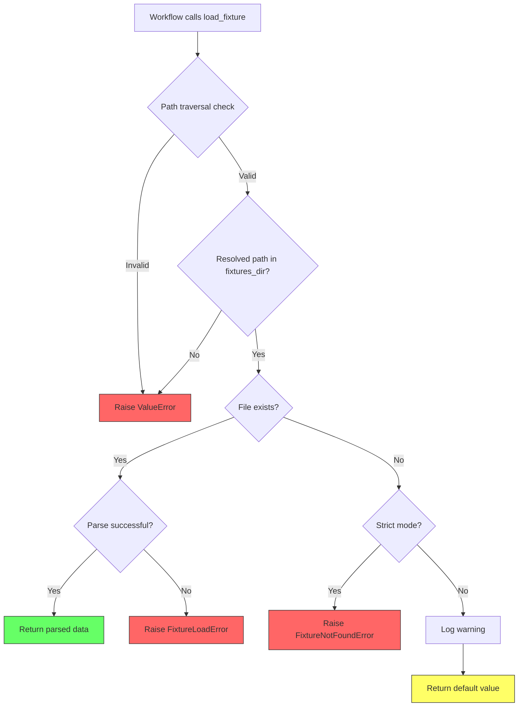

# 152 - Fix: Mock-mode branches fail silently when fixtures missing

<!-- Template Metadata
Last Updated: 2026-02-02
Updated By: Issue #152 LLD creation
Update Reason: Revision 1 - Address Gemini Review #1 feedback on security validation
-->

## 1. Context & Goal
* **Issue:** #152
* **Objective:** Ensure mock-mode implementations raise clear errors when required fixture files are missing, instead of silently returning empty results.
* **Status:** Draft
* **Related Issues:** None

### Open Questions
*Questions that need clarification before or during implementation. Remove when resolved.*

- [ ] Should we support a fallback mode with sensible defaults + warning, or always fail hard?
- [ ] Are there legitimate cases where empty `[]` is a valid fixture response that should be distinguished from missing files?

## 2. Proposed Changes

*This section is the **source of truth** for implementation. Describe exactly what will be built.*

### 2.1 Files Changed

| File | Change Type | Description |
|------|-------------|-------------|
| `agentos/core/fixtures.py` | Add | New centralized fixture loading utility with error handling |
| `agentos/workflows/scout/nodes.py` | Modify | Use new `load_fixture` with strict mode |
| `agentos/workflows/testing/nodes/implement_code.py` | Modify | Use new `load_fixture` in `_mock_implement_code` |
| `agentos/workflows/lld/nodes.py` | Modify | Update mock implementations to use new fixture loader |
| `tests/core/test_fixtures.py` | Add | Unit tests for fixture loading behavior |

### 2.2 Dependencies

*No new packages required.*

```toml
# pyproject.toml additions (if any)
# None - uses standard library only
```

### 2.3 Data Structures

```python
# Pseudocode - NOT implementation
class FixtureNotFoundError(Exception):
    """Raised when a required fixture file is missing."""
    fixture_name: str  # Name of the missing fixture
    search_path: Path  # Where we looked for it
    
class FixtureLoadError(Exception):
    """Raised when a fixture file exists but cannot be parsed."""
    fixture_name: str
    cause: Exception  # Original parsing error
```

### 2.4 Function Signatures

```python
# Signatures only - implementation in source files
def load_fixture(
    filename: str,
    *,
    strict: bool = True,
    default: Any = None,
    fixtures_dir: Path | None = None,
) -> Any:
    """
    Load a fixture file with explicit error handling.
    
    Args:
        filename: Name of fixture file (e.g., 'github_search_response.json')
        strict: If True, raise FixtureNotFoundError when file missing.
                If False, return default value with warning.
        default: Value to return when strict=False and file missing.
        fixtures_dir: Override default fixtures directory.
    
    Returns:
        Parsed fixture data (typically dict or list).
    
    Raises:
        ValueError: When filename contains path traversal attempts.
        FixtureNotFoundError: When strict=True and file not found.
        FixtureLoadError: When file exists but cannot be parsed.
    """
    ...

def get_fixtures_dir() -> Path:
    """Return the configured fixtures directory path."""
    ...

def fixture_exists(filename: str, fixtures_dir: Path | None = None) -> bool:
    """Check if a fixture file exists without loading it."""
    ...
```

### 2.5 Logic Flow (Pseudocode)

```
1. Receive filename and options
2. Validate filename for path traversal:
   - IF filename contains ".." OR starts with "/" THEN
     - RAISE ValueError("Invalid fixture filename: path traversal not allowed")
3. Resolve fixtures directory:
   - Use provided fixtures_dir if given
   - Otherwise use FIXTURES_DIR from config
4. Construct full path: fixtures_dir / filename
5. Validate resolved path is within fixtures directory:
   - IF NOT path.resolve().is_relative_to(fixtures_dir.resolve()) THEN
     - RAISE ValueError("Resolved path escapes fixtures directory")
6. IF file does not exist:
   - IF strict mode:
     - RAISE FixtureNotFoundError with clear message including path
   - ELSE:
     - LOG warning: "Fixture 'X' not found, using default"
     - RETURN default value
7. TRY to read and parse file:
   - Detect format from extension (.json, .yaml, .txt)
   - Parse accordingly
8. IF parsing fails:
   - RAISE FixtureLoadError with original cause
9. RETURN parsed data
```

### 2.6 Technical Approach

* **Module:** `agentos/core/fixtures.py`
* **Pattern:** Centralized utility with fail-fast behavior
* **Key Decisions:** 
  - Strict mode by default to catch issues early
  - Custom exceptions for clear error reporting
  - Single source of truth for fixture loading across all workflows
  - Path traversal validation before any file operations

### 2.7 Architecture Decisions

*Document key architectural decisions that affect the design.*

| Decision | Options Considered | Choice | Rationale |
|----------|-------------------|--------|-----------|
| Error handling strategy | Silent fallback, Warning + fallback, Fail hard | Fail hard by default | Tests should fail explicitly; opt-in fallback for special cases |
| Centralization | Inline in each workflow, Shared utility | Shared utility | DRY principle; consistent behavior; easier to test and maintain |
| Exception types | Generic Exception, FileNotFoundError, Custom exceptions | Custom exceptions | Clearer error messages; easier to catch specifically in tests |
| Default strict mode | True (fail), False (fallback) | True | Align with "fail fast" principle; silent failures are the bug we're fixing |
| Path validation | Regex check, Path.resolve comparison, Both | Both | Defense in depth: reject obvious traversal patterns AND verify resolved path |

**Architectural Constraints:**
- Must be backwards compatible with existing workflow code
- Must not require changes to fixture file format or location
- Must integrate with existing logging infrastructure
- Must prevent path traversal attacks even with symlinks

## 3. Requirements

*What must be true when this is done. These become acceptance criteria.*

1. Missing fixture files MUST raise `FixtureNotFoundError` with the fixture name and search path
2. Malformed fixture files MUST raise `FixtureLoadError` with the original parsing error
3. Path traversal attempts MUST raise `ValueError` before any file system access
4. All mock-mode implementations in `scout`, `testing`, and `lld` workflows MUST use the new `load_fixture` function
5. Error messages MUST be actionable (tell user exactly which file is missing and where to create it)
6. Optional non-strict mode MUST log a warning when falling back to defaults
7. Existing tests MUST continue to pass (no regression)
8. Custom `fixtures_dir` MUST act as a security boundary, not just a search path

## 4. Alternatives Considered

| Option | Pros | Cons | Decision |
|--------|------|------|----------|
| Centralized `load_fixture` with strict mode | Single point of change; clear errors; testable | Requires updating all callers | **Selected** |
| Add null checks at each call site | Minimal change | Duplicated logic; easy to miss spots; inconsistent | Rejected |
| Wrapper that auto-generates missing fixtures | Self-healing; tests never fail | Masks real issues; unpredictable data | Rejected |
| Environment variable to toggle behavior | Flexible | More complexity; harder to reason about | Rejected |

**Rationale:** A centralized utility provides consistent behavior, clear error messages, and is easy to test. The strict-by-default approach aligns with the goal of catching missing fixtures early rather than silently degrading.

## 5. Data & Fixtures

### 5.1 Data Sources

| Attribute | Value |
|-----------|-------|
| Source | Local fixture files in `tests/fixtures/` or `agentos/fixtures/` |
| Format | JSON (primary), YAML (secondary), plain text |
| Size | Typically < 100KB per fixture |
| Refresh | Manual - updated by developers as needed |
| Copyright/License | N/A - internal test data |

### 5.2 Data Pipeline

```
Fixture File (JSON/YAML) ──validate──► load_fixture() ──parse──► Python dict/list
```

### 5.3 Test Fixtures

| Fixture | Source | Notes |
|---------|--------|-------|
| `valid_fixture.json` | Generated | Valid JSON for happy path tests |
| `malformed_fixture.json` | Generated | Invalid JSON for error handling tests |
| (missing file) | N/A | Test that missing file raises error |

### 5.4 Deployment Pipeline

Fixtures are committed to the repository and deployed with the code. No separate deployment needed.

**If data source is external:** N/A - all fixtures are internal to the repo.

## 6. Diagram

### 6.1 Mermaid Quality Gate

Before finalizing any diagram, verify in [Mermaid Live Editor](https://mermaid.live) or GitHub preview:

- [x] **Simplicity:** Similar components collapsed (per 0006 §8.1)
- [x] **No touching:** All elements have visual separation (per 0006 §8.2)
- [x] **No hidden lines:** All arrows fully visible (per 0006 §8.3)
- [x] **Readable:** Labels not truncated, flow direction clear
- [ ] **Auto-inspected:** Agent rendered via mermaid.ink and viewed (per 0006 §8.5)

**Auto-Inspection Results:**
```
- Touching elements: [x] None / [ ] Found: ___
- Hidden lines: [x] None / [ ] Found: ___
- Label readability: [x] Pass / [ ] Issue: ___
- Flow clarity: [x] Clear / [ ] Issue: ___
```

### 6.2 Diagram



## 7. Security & Safety Considerations

### 7.1 Security

| Concern | Mitigation | Status |
|---------|------------|--------|
| Path traversal in filename | Reject filenames containing `..` or starting with `/`; validate resolved path is within fixtures_dir using `path.resolve().is_relative_to(fixtures_dir)` | Defined |
| Arbitrary file read | Only allow files within fixtures directory; resolved path check enforces boundary | Defined |
| Symlink escape | Use `resolve()` to follow symlinks before boundary check | Defined |

### 7.2 Safety

| Concern | Mitigation | Status |
|---------|------------|--------|
| Silent data loss (current bug) | Fail hard when fixtures missing | Addressed |
| Test false positives | Strict mode ensures tests fail when data missing | Addressed |
| Breaking existing tests | Non-strict mode available for gradual migration | Addressed |

**Fail Mode:** Fail Closed - Missing fixtures cause immediate failure to prevent silent degradation.

**Recovery Strategy:** Developer must create the missing fixture file or fix the fixture path.

## 8. Performance & Cost Considerations

### 8.1 Performance

| Metric | Budget | Approach |
|--------|--------|----------|
| Latency | < 10ms per load | Simple file I/O, no caching needed |
| Memory | < 10MB | Fixtures loaded on demand, not preloaded |
| Disk I/O | 1 read per fixture | No change from current behavior |

**Bottlenecks:** None - fixture loading is already fast; we're only adding existence checks and path validation.

### 8.2 Cost Analysis

| Resource | Unit Cost | Estimated Usage | Monthly Cost |
|----------|-----------|-----------------|--------------|
| N/A | N/A | N/A | $0 |

**Cost Controls:** N/A - no external services involved.

**Worst-Case Scenario:** N/A - local file operations only.

## 9. Legal & Compliance

| Concern | Applies? | Mitigation |
|---------|----------|------------|
| PII/Personal Data | No | Fixtures contain only mock test data |
| Third-Party Licenses | No | Using standard library only |
| Terms of Service | N/A | No external services |
| Data Retention | N/A | Fixtures are version controlled |
| Export Controls | No | No restricted algorithms |

**Data Classification:** Internal

**Compliance Checklist:**
- [x] No PII stored without consent
- [x] All third-party licenses compatible with project license
- [x] External API usage compliant with provider ToS
- [x] Data retention policy documented

## 10. Verification & Testing

*Ref: [0005-testing-strategy-and-protocols.md](0005-testing-strategy-and-protocols.md)*

**Testing Philosophy:** All scenarios are fully automated. No manual testing required.

### 10.1 Test Scenarios

| ID | Scenario | Type | Input | Expected Output | Pass Criteria |
|----|----------|------|-------|-----------------|---------------|
| 010 | Load existing JSON fixture | Auto | `"valid_fixture.json"` | Parsed dict | Returns correct data |
| 020 | Load missing fixture (strict) | Auto | `"nonexistent.json", strict=True` | FixtureNotFoundError | Exception raised with filename in message |
| 030 | Load missing fixture (non-strict) | Auto | `"nonexistent.json", strict=False, default=[]` | `[]` | Returns default, logs warning |
| 040 | Load malformed JSON | Auto | `"malformed.json"` | FixtureLoadError | Exception raised with parse error |
| 050 | Path traversal blocked (parent dir) | Auto | `"../secret.env"` | ValueError | Rejects path with `..` |
| 051 | Path traversal blocked (absolute path) | Auto | `"/etc/passwd"` | ValueError | Rejects absolute paths |
| 052 | Path traversal blocked (nested) | Auto | `"foo/../../secret.env"` | ValueError | Rejects nested traversal |
| 060 | Custom fixtures_dir respected | Auto | `"test.json", fixtures_dir=custom_path` | Looks in custom_path | Respects override |
| 061 | Custom fixtures_dir enforces boundary | Auto | `"../outside.json", fixtures_dir=custom_path` | ValueError | Cannot escape custom dir |
| 070 | fixture_exists returns True | Auto | Existing file | `True` | Correct boolean |
| 080 | fixture_exists returns False | Auto | Missing file | `False` | Correct boolean |
| 090 | Scout workflow with missing fixture | Auto | Mock mode + missing fixture | FixtureNotFoundError | Error propagates |
| 100 | Testing workflow with missing fixture | Auto | Mock mode + missing fixture | FixtureNotFoundError | Error propagates |

### 10.2 Test Commands

```bash
# Run all automated tests
poetry run pytest tests/core/test_fixtures.py -v

# Run integration tests for workflows
poetry run pytest tests/workflows/test_mock_mode.py -v

# Run with coverage
poetry run pytest tests/core/test_fixtures.py --cov=agentos.core.fixtures
```

### 10.3 Manual Tests (Only If Unavoidable)

**N/A - All scenarios automated.**

## 11. Risks & Mitigations

| Risk | Impact | Likelihood | Mitigation |
|------|--------|------------|------------|
| Breaking existing tests that rely on silent `[]` | Med | Med | Audit all callers; update tests to provide fixtures or use non-strict mode |
| Missing fixture locations across codebase | Low | Med | Grep for all mock_mode/offline_mode patterns; systematic update |
| Developers confused by new errors | Low | Low | Clear error messages with actionable guidance |

## 12. Definition of Done

### Code
- [ ] Implementation complete and linted
- [ ] Code comments reference this LLD (#152)
- [ ] All mock-mode branches updated to use `load_fixture`
- [ ] Path traversal validation implemented and tested

### Tests
- [ ] All test scenarios pass
- [ ] Test coverage ≥ 90% for new code
- [ ] No regressions in existing tests
- [ ] Security boundary tests pass (050-061)

### Documentation
- [ ] LLD updated with any deviations
- [ ] Implementation Report (0103) completed
- [ ] Docstrings added to all public functions

### Review
- [ ] Code review completed
- [ ] User approval before closing issue

---

## Appendix: Review Log

*Track all review feedback with timestamps and implementation status.*

### Gemini Review #1 (REVISE)

**Timestamp:** 2026-02-02
**Reviewer:** Gemini 3 Pro
**Verdict:** REVISE

#### Comments

| ID | Comment | Implemented? |
|----|---------|--------------|
| G1.1 | "Section 2.5 (Logic Flow) completely omits the validation step for path traversal" | YES - Added steps 2 and 5 in Section 2.5 |
| G1.2 | "Section 7.1 lists the status of Path Traversal mitigation as 'TODO'. Change to 'Defined'" | YES - Updated Section 7.1 status to "Defined" with detailed mitigation |
| G1.3 | "Update 2.4 to explicitly document ValueError in the Raises section" | YES - Added ValueError to docstring in Section 2.4 |
| G1.4 | "Enhance Test 060 or add 061 to ensure fixtures_dir acts as a security boundary" | YES - Added Test 061 in Section 10.1 |
| G1.5 | "Specify exact input for Test 050" | YES - Split into 050, 051, 052 with specific inputs |

### Review Summary

| Review | Date | Verdict | Key Issue |
|--------|------|---------|-----------|
| Gemini #1 | 2026-02-02 | REVISE | Path traversal validation missing from logic flow |

**Final Status:** PENDING