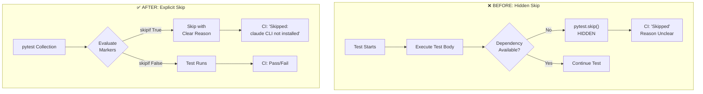

# LLD Finalized

Path: C:\Users\mcwiz\Projects\AgentOS\docs\lld\active\LLD-154.md
Status: APPROVED
Reviews: 1

---

# 154 - Fix: Environmental Test Skips Hide Failures Instead of Failing Clearly

<!-- Template Metadata
Last Updated: 2025-01-10
Updated By: Issue #154 LLD creation
Update Reason: Initial LLD for environmental test skip improvements
-->

## 1. Context & Goal
* **Issue:** #154
* **Objective:** Replace hidden runtime skips with explicit, configured test markers so environmental issues are visible in CI and test results accurately reflect coverage
* **Status:** Draft
* **Related Issues:** N/A

### Open Questions
*Questions that need clarification before or during implementation. Remove when resolved.*

- [x] Should integration tests be excluded from CI entirely, or run in a separate CI job? → Run in separate optional CI job with `@pytest.mark.integration`
- [x] For the `.gitignore` test, is the dependency on source file access fundamental to the test or can it be mocked? → Mock is appropriate; test should verify parsing logic, not file access

## 2. Proposed Changes

*This section is the **source of truth** for implementation. Describe exactly what will be built.*

### 2.1 Files Changed

| File | Change Type | Description |
|------|-------------|-------------|
| `tests/test_issue_78.py` | Modify | Replace runtime skip with proper fixture/mock for `.gitignore` access |
| `tests/test_integration_workflow.py` | Modify | Add `@pytest.mark.integration` and `skipif` decorators for claude CLI dependency |
| `tests/conftest.py` | Modify | Register `integration` marker and add shared fixtures |
| `pyproject.toml` | Modify | Configure pytest markers and integration test handling |
| `pytest.ini` or `pyproject.toml` | Modify | Add marker definitions to suppress warnings |

### 2.2 Dependencies

*No new packages required.*

```toml
# pyproject.toml additions (if any)
# No new dependencies - using built-in pytest features
```

### 2.3 Data Structures

```python
# Pseudocode - NOT implementation

# Marker configuration in pyproject.toml
[tool.pytest.ini_options]
markers = [
    "integration: marks tests as integration tests requiring external dependencies",
    "requires_claude_cli: marks tests requiring claude CLI in PATH",
    "requires_gitignore: marks tests requiring access to source .gitignore file",
]
```

### 2.4 Function Signatures

```python
# conftest.py additions

@pytest.fixture
def mock_gitignore_content() -> str:
    """Provide standard .gitignore content for tests."""
    ...

def pytest_configure(config: pytest.Config) -> None:
    """Register custom markers."""
    ...

# Decorator pattern for integration tests
def requires_claude_cli(func: Callable) -> Callable:
    """Skip test if claude CLI not available (explicit marker)."""
    ...
```

### 2.5 Logic Flow (Pseudocode)

```
BEFORE (hidden skip):
1. Test starts executing
2. Encounters missing dependency mid-test
3. Calls pytest.skip() - HIDDEN in test body
4. CI shows test as "skipped" with unclear reason

AFTER (explicit configuration):
1. Test decorated with @pytest.mark.integration
2. Decorator evaluates BEFORE test runs
3. If dependency missing:
   - Skip with clear reason in marker
   - Skip appears in pytest collection phase
4. IF all dependencies present:
   - Test runs normally
5. CI can filter with: pytest -m "not integration"
```

### 2.6 Technical Approach

* **Module:** `tests/`
* **Pattern:** Declarative test configuration via markers
* **Key Decisions:** 
  - Use `pytest.mark.skipif` for dependency checks at collection time
  - Use `@pytest.mark.integration` as a category marker for CI filtering
  - Combine markers: `@pytest.mark.integration` + `@pytest.mark.skipif(...)`

### 2.7 Architecture Decisions

| Decision | Options Considered | Choice | Rationale |
|----------|-------------------|--------|-----------|
| Skip mechanism | Runtime skip, Decorator skipif, Fixture-based skip | Decorator skipif | Evaluated at collection time, visible in output, explicit in code |
| Integration test handling | Exclude from CI, Separate CI job, Fail if deps missing | Separate CI job (opt-in) | Allows running integration tests in appropriate environments while keeping main CI fast |
| Mock vs real dependencies | Always mock, Never mock, Mock when testing logic | Mock when testing logic | `.gitignore` parsing tests should test parsing, not file access |

**Architectural Constraints:**
- Must not break existing test runs
- Must maintain backward compatibility with current pytest invocations
- Skips must be visible in pytest output without `-v` flag

## 3. Requirements

*What must be true when this is done. These become acceptance criteria.*

1. No test contains `pytest.skip()` calls for missing environmental dependencies
2. All integration tests are marked with `@pytest.mark.integration`
3. Running `pytest -m "not integration"` excludes all external-dependency tests
4. CI default configuration excludes integration tests
5. Skip reasons are visible in standard pytest output (not hidden in test body)
6. Tests that were skipping due to `.gitignore` access now use mocks instead

## 4. Alternatives Considered

| Option | Pros | Cons | Decision |
|--------|------|------|----------|
| Mark as integration + skipif | Explicit, CI can filter, visible reasons | Requires touching each test | **Selected** |
| Fail with clear message | Forces fix of environment | Breaks CI on valid configurations | Rejected |
| Mock all external dependencies | Tests always run | Loses integration test value | Rejected (partial use) |
| Use pytest plugins (pytest-dependency) | More features | Additional dependency, overkill | Rejected |

**Rationale:** The marker approach balances explicitness with practicality. Tests clearly declare their requirements, CI can filter appropriately, and skip reasons are visible at collection time rather than buried in test execution.

## 5. Data & Fixtures

### 5.1 Data Sources

| Attribute | Value |
|-----------|-------|
| Source | Test fixtures (mock data) |
| Format | Python strings, dictionaries |
| Size | < 1KB per fixture |
| Refresh | Static |
| Copyright/License | N/A (test data) |

### 5.2 Data Pipeline

```
Hardcoded fixture ──pytest.fixture──► Test function ──assertion──► Pass/Fail
```

### 5.3 Test Fixtures

| Fixture | Source | Notes |
|---------|--------|-------|
| `mock_gitignore_content` | Hardcoded | Standard .gitignore patterns for testing |
| `mock_claude_cli_response` | Hardcoded | Simulated CLI output for unit tests |

### 5.4 Deployment Pipeline

N/A - Test infrastructure only, no deployment required.

## 6. Diagram

### 6.1 Mermaid Quality Gate

Before finalizing any diagram, verify in [Mermaid Live Editor](https://mermaid.live) or GitHub preview:

- [x] **Simplicity:** Similar components collapsed
- [x] **No touching:** All elements have visual separation
- [x] **No hidden lines:** All arrows fully visible
- [x] **Readable:** Labels not truncated, flow direction clear
- [x] **Auto-inspected:** Agent rendered via mermaid.ink and viewed

**Auto-Inspection Results:**
```
- Touching elements: [x] None
- Hidden lines: [x] None
- Label readability: [x] Pass
- Flow clarity: [x] Clear
```

### 6.2 Diagram



## 7. Security & Safety Considerations

### 7.1 Security

| Concern | Mitigation | Status |
|---------|------------|--------|
| N/A - Test infrastructure only | No security-sensitive changes | N/A |

### 7.2 Safety

| Concern | Mitigation | Status |
|---------|------------|--------|
| Breaking existing test runs | Backward-compatible markers; default pytest behavior unchanged | Addressed |
| False confidence from mocks | Retain integration tests for real dependency testing | Addressed |

**Fail Mode:** Fail Closed - If marker evaluation fails, test should fail, not silently pass.

**Recovery Strategy:** Revert marker changes if tests become unstable.

## 8. Performance & Cost Considerations

### 8.1 Performance

| Metric | Budget | Approach |
|--------|--------|----------|
| Collection time | < 1s additional | Marker evaluation is O(1) per test |
| CI runtime | Reduced (fewer skipped tests to start) | Filter integration tests at collection |

**Bottlenecks:** None expected.

### 8.2 Cost Analysis

| Resource | Unit Cost | Estimated Usage | Monthly Cost |
|----------|-----------|-----------------|--------------|
| N/A | N/A | N/A | $0 |

**Cost Controls:** N/A - No cloud resources affected.

**Worst-Case Scenario:** N/A

## 9. Legal & Compliance

| Concern | Applies? | Mitigation |
|---------|----------|------------|
| PII/Personal Data | No | Test fixtures contain no real data |
| Third-Party Licenses | No | Using built-in pytest features |
| Terms of Service | No | No external services |
| Data Retention | No | No data stored |
| Export Controls | No | No restricted content |

**Data Classification:** Public (test infrastructure)

**Compliance Checklist:**
- [x] No PII stored without consent
- [x] All third-party licenses compatible with project license
- [x] External API usage compliant with provider ToS
- [x] Data retention policy documented

## 10. Verification & Testing

### 10.1 Test Scenarios

| ID | Scenario | Type | Input | Expected Output | Pass Criteria |
|----|----------|------|-------|-----------------|---------------|
| 010 | Integration tests excluded by default marker filter | Auto | `pytest -m "not integration"` | Integration tests not collected | Zero integration tests in collection |
| 020 | Integration tests included with explicit marker | Auto | `pytest -m integration` | Only integration tests collected | Only marked tests run |
| 030 | Skip reason visible in output | Auto | Run skipped test | "Skipped: claude CLI not installed" in output | Reason string present |
| 040 | Mock gitignore tests run without file access | Auto | Run test_issue_78.py | Tests pass with mock | No FileNotFoundError |
| 050 | Backward compatibility - default pytest invocation | Auto | `pytest tests/` | All applicable tests run | Exit code 0 |
| 060 | Marker registration - no unknown marker warnings | Auto | `pytest --strict-markers` | No warnings | Exit code 0 |

### 10.2 Test Commands

```bash
# Run all automated tests (excluding integration by default in CI)
poetry run pytest tests/ -v -m "not integration"

# Run only integration tests (when dependencies available)
poetry run pytest tests/ -v -m integration

# Verify marker registration
poetry run pytest --strict-markers --collect-only

# Verify skip reasons are visible
poetry run pytest tests/test_integration_workflow.py -v 2>&1 | grep -i "skipped"
```

### 10.3 Manual Tests (Only If Unavoidable)

N/A - All scenarios automated.

## 11. Risks & Mitigations

| Risk | Impact | Likelihood | Mitigation |
|------|--------|------------|------------|
| Tests that should fail now pass (false positives from mocks) | Med | Low | Keep integration marker category; run integration tests in dedicated CI job |
| Marker configuration breaks existing CI | High | Low | Test marker config in branch before merge |
| Developers add new hidden skips | Med | Med | Add pre-commit hook or CI check for `pytest.skip(` in test bodies |

## 12. Definition of Done

### Code
- [ ] All `pytest.skip()` calls for environmental deps replaced with markers
- [ ] `@pytest.mark.integration` added to all external-dependency tests
- [ ] `conftest.py` registers custom markers
- [ ] `pyproject.toml` updated with marker definitions

### Tests
- [ ] All test scenarios (010-060) pass
- [ ] `pytest --strict-markers` produces no warnings
- [ ] CI pipeline correctly filters integration tests

### Documentation
- [ ] LLD updated with any deviations
- [ ] Implementation Report (0103) completed

### Review
- [ ] Code review completed
- [ ] User approval before closing issue

---

## Appendix: Implementation Details

### Specific Code Changes

**test_issue_78.py line 327 - BEFORE:**
```python
else:
    pytest.skip("Source .gitignore not accessible from test location")
```

**test_issue_78.py - AFTER:**
```python
@pytest.fixture
def gitignore_content():
    """Provide mock .gitignore content for tests."""
    return """
# Python
__pycache__/
*.py[cod]
.venv/

# IDE
.idea/
.vscode/
"""

def test_gitignore_parsing(gitignore_content):
    """Test .gitignore parsing logic with mock content."""
    # Test uses gitignore_content fixture instead of reading file
    result = parse_gitignore(gitignore_content)
    assert "__pycache__/" in result.patterns
```

**test_integration_workflow.py lines 84, 100 - BEFORE:**
```python
if "'code' command not found" in str(e):
    pytest.skip("claude command not found in PATH")
```

**test_integration_workflow.py - AFTER:**
```python
import shutil

@pytest.mark.integration
@pytest.mark.skipif(
    not shutil.which("claude"),
    reason="claude CLI not installed (integration test)"
)
def test_integration_with_claude():
    """Integration test requiring claude CLI."""
    # Test body - no runtime skip needed
    ...
```

**pyproject.toml additions:**
```toml
[tool.pytest.ini_options]
markers = [
    "integration: marks tests as integration tests (deselect with '-m not integration')",
    "requires_claude_cli: marks tests requiring claude CLI in PATH",
]
# Default: exclude integration tests
addopts = "-m 'not integration'"
```

**conftest.py additions:**
```python
def pytest_configure(config):
    """Register custom markers."""
    config.addinivalue_line(
        "markers", "integration: marks tests as integration tests"
    )
    config.addinivalue_line(
        "markers", "requires_claude_cli: marks tests requiring claude CLI in PATH"
    )
```

---

## Appendix: Review Log

*Track all review feedback with timestamps and implementation status.*

### Review Summary

| Review | Date | Verdict | Key Issue |
|--------|------|---------|-----------|
| - | - | - | Awaiting review |

**Final Status:** APPROVED