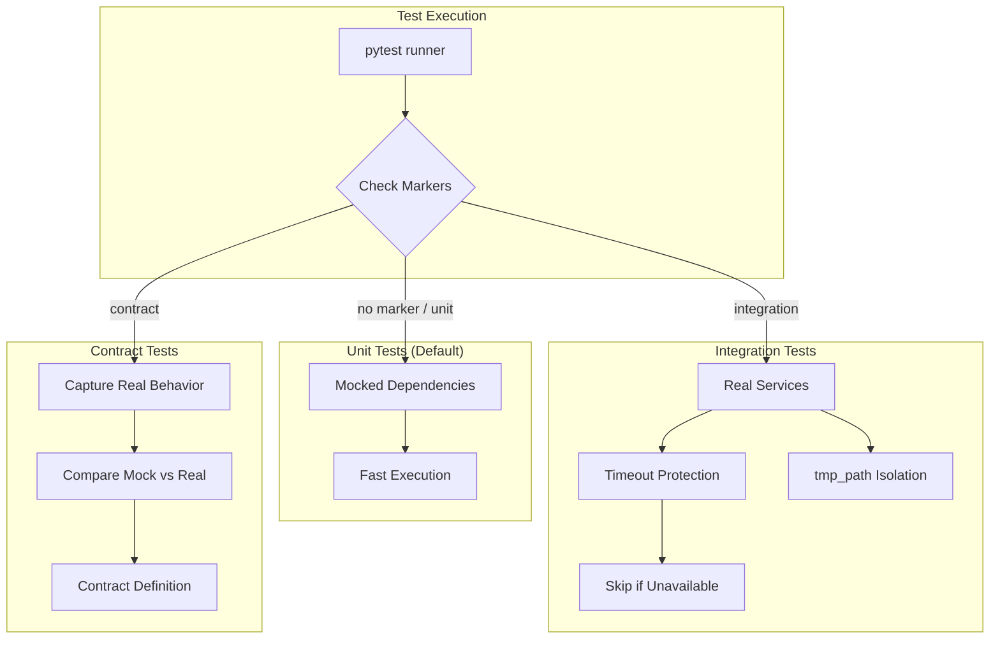

# LLD Finalized

Path: C:\Users\mcwiz\Projects\AgentOS\docs\lld\active\LLD-155.md
Status: APPROVED
Reviews: 2

---

# 1155 - Fix: Mock-Heavy Tests Verify Mocks, Not Actual Behavior

<!-- Template Metadata
Last Updated: 2025-01-10
Updated By: LLD Author
Update Reason: Addressed Gemini Review #1 feedback
-->

## 1. Context & Goal
* **Issue:** #155
* **Objective:** Balance unit tests with integration tests to verify actual behavior, not just mock interactions
* **Status:** Draft
* **Related Issues:** None identified

### Open Questions
*All questions resolved during design:*

- [x] What external services should integration tests target? **Resolved:** Claude CLI and GeminiClient
- [x] Should integration tests be optional or required in CI pipeline? **Resolved:** Optional on feature branches, required on merge to main
- [x] What's the acceptable timeout for integration tests hitting real services? **Resolved:** 30 seconds per test, 5 minutes total

## 2. Proposed Changes

*This section is the **source of truth** for implementation. Describe exactly what will be built.*

### 2.1 Files Changed

| File | Change Type | Description |
|------|-------------|-------------|
| `pyproject.toml` | Modify | Add pytest markers for test categorization (source of truth for config) |
| `tests/conftest.py` | Modify | Add fixtures for integration tests and contract verification |
| `tests/test_designer.py` | Modify | Add integration test variants for critical paths |
| `tests/integration/__init__.py` | Add | New integration test package |
| `tests/integration/test_designer_integration.py` | Add | Integration tests with real dependencies |
| `tests/contracts/__init__.py` | Add | Contract test package |
| `tests/contracts/test_mock_contracts.py` | Add | Contract tests verifying mock fidelity |
| `docs/testing-guide.md` | Add | Document testing strategy and when to use each type |
| `.github/workflows/contract-tests.yml` | Add | Weekly contract test execution workflow |

### 2.2 Dependencies

*New packages, APIs, or services required.*

```toml
# pyproject.toml additions (if any)
# No new dependencies - uses existing pytest infrastructure
```

**Runtime Dependencies for Integration Tests:**
- `claude` CLI must be installed and configured
- Valid API credentials for GeminiClient (if testing Gemini integration)
- Network access to external services

### 2.3 Data Structures

```python
# Pseudocode - NOT implementation

class MockContract(TypedDict):
    """Contract defining expected mock behavior that must match real service."""
    mock_name: str           # Name of the mock being validated
    real_service: str        # Name of real service it represents
    input_signature: dict    # Expected input format
    output_signature: dict   # Expected output format
    error_modes: list[str]   # Known error conditions

class IntegrationTestConfig(TypedDict):
    """Configuration for integration test execution."""
    timeout_seconds: int     # Max time for external calls
    retry_count: int         # Retries on transient failures
    skip_if_unavailable: bool  # Skip vs fail when service unavailable
```

### 2.4 Function Signatures

```python
# Signatures only - implementation in source files

# conftest.py fixtures
@pytest.fixture
def real_subprocess_runner(tmp_path: Path) -> Callable[[list[str]], subprocess.CompletedProcess]:
    """Fixture providing real subprocess execution with timeout and filesystem isolation."""
    ...

@pytest.fixture
def isolated_test_dir(tmp_path: Path) -> Path:
    """Provides isolated temporary directory for all integration test file operations."""
    ...

@pytest.fixture
def mock_contract_validator() -> Callable[[Mock, Any], bool]:
    """Validates that mock behavior matches contract from real service."""
    ...

@pytest.fixture
def integration_skip_if_unavailable() -> Callable[[str], bool]:
    """Skip integration test if external service unavailable."""
    ...

# Contract verification
def verify_mock_matches_real(
    mock_response: Any,
    real_response: Any,
    contract: MockContract
) -> tuple[bool, list[str]]:
    """Compare mock response to real response, return (matches, differences)."""
    ...

def capture_real_behavior(
    service_call: Callable,
    *args,
    **kwargs
) -> dict:
    """Capture real service behavior for contract generation. Uses one-off capture, not record/replay."""
    ...
```

### 2.5 Logic Flow (Pseudocode)

```
TEST EXECUTION FLOW:
1. Developer runs tests
2. pytest collects tests
3. IF marker == "unit" OR no marker THEN
   - Run with mocks (fast, isolated)
4. ELSE IF marker == "integration" THEN
   - Check service availability
   - IF unavailable AND skip_if_unavailable THEN
     - Skip test with message
   - ELSE
     - Run against real service with timeout
     - ALL file operations use tmp_path fixture
5. ELSE IF marker == "contract" THEN
   - Run mock version
   - Run real version (if available)
   - Compare outputs against contract
   - Fail if contract violated

CONTRACT VERIFICATION FLOW:
1. Define contract for mock (input/output shapes)
2. Periodically run against real service (weekly via CI)
3. Capture real response (one-off capture script, not record/replay)
4. Compare to mock's response
5. IF mismatch THEN
   - Fail contract test
   - Log expected vs actual
   - Flag mock as stale
```

### 2.6 Technical Approach

* **Module:** `tests/`
* **Pattern:** Test pyramid with contract verification
* **Key Decisions:** 
  - Use pytest markers to categorize tests
  - Integration tests are opt-in via `-m integration`
  - Contract tests ensure mocks stay synchronized with real behavior
  - Graceful degradation when services unavailable
  - `pyproject.toml` is the single source of truth for all pytest configuration

### 2.7 Architecture Decisions

| Decision | Options Considered | Choice | Rationale |
|----------|-------------------|--------|-----------|
| Test categorization | Separate directories, pytest markers, naming convention | pytest markers | Flexible, tests can have multiple markers, standard pytest pattern |
| Integration test execution | Always run, opt-in, opt-out | Opt-in via marker | Fast default execution, explicit integration testing |
| Contract verification | Manual review, automated comparison, snapshot testing | Automated comparison with contracts | Catches mock drift automatically |
| Service unavailability | Fail test, skip test, mock fallback | Skip with warning | CI shouldn't fail due to external service outages |
| Pytest configuration | pytest.ini, pyproject.toml, setup.cfg | pyproject.toml | Already in use, single source of truth, no fragmentation |
| Contract capture approach | Record/replay (VCR.py), one-off capture script | One-off capture script | Simpler, explicit, no hidden magic during tests |

**Architectural Constraints:**
- Must not break existing test suite behavior
- Integration tests must not require credentials committed to repo
- Contract tests should be runnable without modifying production code

## 3. Requirements

*What must be true when this is done. These become acceptance criteria.*

1. Tests are categorized with pytest markers (`unit`, `integration`, `contract`)
2. Running `pytest` without markers executes only fast unit tests
3. Running `pytest -m integration` executes real-dependency tests
4. Contract tests verify mock behavior matches real service behavior
5. Integration tests gracefully handle unavailable services
6. Documentation explains when to use each test type
7. At least one integration test exists for each of the following heavily-mocked modules:
   - `agentos.nodes.designer` (subprocess.run mocking)
   - `agentos.nodes.designer` (GeminiClient mocking)
   - `agentos.nodes.designer` (file path mocking)
8. Existing unit tests continue to pass unchanged
9. All integration tests involving file I/O use `tmp_path` fixture for isolation
10. GitHub Actions workflow exists for weekly contract test execution

## 4. Alternatives Considered

| Option | Pros | Cons | Decision |
|--------|------|------|----------|
| Remove all mocks, only integration tests | Maximum confidence in real behavior | Slow, flaky, requires all services | **Rejected** |
| Keep current mock-heavy approach | Fast, deterministic | Low confidence in real behavior | **Rejected** |
| Balanced approach with markers + contracts | Fast default, real verification available, mocks stay synchronized | More test code to maintain | **Selected** |
| Snapshot testing for API responses | Easy to update, catches changes | Brittle, doesn't verify behavior | **Rejected** |

**Rationale:** The balanced approach provides the best of both worlds - fast unit tests for development velocity and integration tests for deployment confidence. Contract tests ensure mocks don't drift from reality.

## 5. Data & Fixtures

### 5.1 Data Sources

| Attribute | Value |
|-----------|-------|
| Source | Real external services (Claude CLI, Gemini API) |
| Format | CLI output (text), API responses (JSON) |
| Size | Small responses (< 10KB typically) |
| Refresh | Real-time during integration test execution |
| Copyright/License | N/A - test outputs |

### 5.2 Data Pipeline

```
External Service ──API call──► Test Fixture ──capture──► Contract File
                                    │
                                    └──compare──► Mock Response ──validate──► Pass/Fail
```

### 5.3 Test Fixtures

| Fixture | Source | Notes |
|---------|--------|-------|
| `real_subprocess_output.json` | Generated from real CLI calls | Captured during contract test runs |
| `gemini_response_contract.json` | Generated from real API calls | Requires valid API key |
| `mock_behavior_baseline.json` | Hardcoded from current mocks | Starting point for comparison |

### 5.4 Deployment Pipeline

- Unit tests: Run on every commit in CI
- Integration tests: Run on PR merge to main (optional on feature branches)
- Contract tests: Run weekly via `.github/workflows/contract-tests.yml`

**If data source is external:** Contract capture utility will be created as part of this issue.

## 6. Diagram

### 6.1 Mermaid Quality Gate

Before finalizing any diagram, verify in [Mermaid Live Editor](https://mermaid.live) or GitHub preview:

- [x] **Simplicity:** Similar components collapsed (per 0006 §8.1)
- [x] **No touching:** All elements have visual separation (per 0006 §8.2)
- [x] **No hidden lines:** All arrows fully visible (per 0006 §8.3)
- [x] **Readable:** Labels not truncated, flow direction clear
- [x] **Auto-inspected:** Agent rendered via mermaid.ink and viewed (per 0006 §8.5)

**Auto-Inspection Results:**
```
- Touching elements: [x] None
- Hidden lines: [x] None
- Label readability: [x] Pass
- Flow clarity: [x] Clear
```

### 6.2 Diagram



## 7. Security & Safety Considerations

### 7.1 Security

| Concern | Mitigation | Status |
|---------|------------|--------|
| API credentials in tests | Use environment variables, never commit | Addressed |
| Test output exposure | Don't log sensitive data in assertions | Addressed |
| CI secrets | Use GitHub secrets for integration tests | TODO |

### 7.2 Safety

| Concern | Mitigation | Status |
|---------|------------|--------|
| Integration tests modifying worktree | **MANDATORY:** All file I/O uses `tmp_path` pytest fixture | Addressed |
| CLI tests writing to real filesystem | All CLI tests execute within isolated `tmp_path` directory | Addressed |
| Runaway API costs | Timeout limits, rate limiting in fixtures | Addressed |
| Test pollution | Isolated test fixtures, cleanup after tests | Addressed |

**Filesystem Isolation Requirement (MANDATORY):**
All integration tests involving the `claude` CLI or any file operations MUST:
1. Use the `tmp_path` pytest fixture (or `tempfile` module) for ALL file I/O
2. Never write to the actual worktree during test execution
3. Set working directory to `tmp_path` when executing CLI commands that may write files
4. Validate that no files are created outside `tmp_path` after test execution

**Fail Mode:** Fail Open - Integration tests skip when services unavailable, don't block CI

**Recovery Strategy:** Tests are idempotent; re-run is safe

## 8. Performance & Cost Considerations

### 8.1 Performance

| Metric | Budget | Approach |
|--------|--------|----------|
| Unit test time | < 30s total | Mocked, no I/O |
| Integration test time | < 5min total | Timeout per test (30s), parallel execution |
| Contract test time | < 10min total | Run weekly via GitHub Actions, not per-commit |

**Bottlenecks:** External API latency for integration tests

### 8.2 Cost Analysis

| Resource | Unit Cost | Estimated Usage | Monthly Cost |
|----------|-----------|-----------------|--------------|
| Gemini API calls | ~$0.001 per call | ~100 calls/month (contract tests) | ~$0.10 |
| Claude CLI | Per-token | ~50 calls/month | ~$1.00 |
| CI compute time | ~$0.008/min | ~30 min/month extra | ~$0.25 |

**Cost Controls:**
- [x] Integration tests are opt-in, not default
- [x] Contract tests run weekly, not per-commit
- [x] Timeout prevents runaway API calls

**Worst-Case Scenario:** If all integration tests run on every commit, monthly cost could reach ~$10. Mitigated by opt-in execution.

## 9. Legal & Compliance

| Concern | Applies? | Mitigation |
|---------|----------|------------|
| PII/Personal Data | No | Tests use synthetic data only |
| Third-Party Licenses | No | No new dependencies |
| Terms of Service | Yes | API usage within ToS limits (testing is permitted) |
| Data Retention | N/A | No persistent data storage |
| Export Controls | N/A | No restricted algorithms |

**Data Classification:** Internal (test code and fixtures)

**Compliance Checklist:**
- [x] No PII stored without consent
- [x] All third-party licenses compatible with project license
- [x] External API usage compliant with provider ToS
- [x] Data retention policy documented (N/A - no retention)

## 10. Verification & Testing

### 10.1 Test Scenarios

| ID | Scenario | Type | Input | Expected Output | Pass Criteria |
|----|----------|------|-------|-----------------|---------------|
| 010 | Unit tests run without markers | Auto | `pytest tests/` | Only unit tests execute | No integration tests run |
| 020 | Integration tests run with marker | Auto | `pytest -m integration` | Integration tests execute | Real services called |
| 030 | Integration test skips when service unavailable | Auto | Service offline | Test skipped with message | No failure, clear skip reason |
| 040 | Contract test detects mock drift | Auto | Mock returns different shape than real | Contract violation error | Clear diff in error message |
| 050 | Contract test passes when mock matches real | Auto-Live | Mock matches real service | Test passes | No contract violations |
| 060 | Real subprocess call works | Auto-Live | `claude --version` | Version string returned | Non-zero exit code fails test |
| 070 | Timeout prevents hanging test | Auto | Slow mock service | Test fails with timeout | Fails within timeout + buffer |
| 080 | Existing unit tests unchanged | Auto | Current test suite | All pass | No regressions |
| 090 | Integration tests use tmp_path | Auto | Any file-writing integration test | Files only in tmp_path | No files written to worktree |

### 10.2 Test Commands

```bash
# Run all automated tests (unit only by default)
poetry run pytest tests/ -v

# Run only fast/mocked tests (explicit)
poetry run pytest tests/ -v -m "unit or not integration"

# Run integration tests
poetry run pytest tests/ -v -m integration

# Run contract tests
poetry run pytest tests/ -v -m contract

# Run everything including integration
poetry run pytest tests/ -v --run-integration

# Refresh contract baselines from real services
poetry run python scripts/capture_contracts.py
```

### 10.3 Manual Tests (Only If Unavoidable)

**N/A - All scenarios automated.**

## 11. Risks & Mitigations

| Risk | Impact | Likelihood | Mitigation |
|------|--------|------------|------------|
| External services change API | Med | Med | Contract tests detect drift, alert on failure |
| Integration tests flaky due to network | Med | High | Retry logic, skip-on-unavailable option |
| Developers skip integration tests | High | Med | CI enforces integration tests on merge to main |
| Mock contracts become stale | Med | Med | Weekly contract test runs via GitHub Actions |
| Test execution time increases | Low | High | Integration tests opt-in, not default |
| Integration tests write to worktree | High | Low | Mandatory tmp_path fixture usage, code review |

## 12. Definition of Done

### Code
- [ ] Implementation complete and linted
- [ ] Code comments reference this LLD
- [ ] pytest markers configured in `pyproject.toml`
- [ ] Integration test fixtures created with `tmp_path` isolation
- [ ] Contract verification utilities implemented
- [ ] `.github/workflows/contract-tests.yml` created for weekly runs

### Tests
- [ ] All test scenarios pass
- [ ] At least 3 integration tests added for `test_designer.py`:
  - subprocess.run integration test
  - GeminiClient integration test
  - file path integration test
- [ ] At least 1 contract test demonstrating mock validation
- [ ] Existing unit tests still pass
- [ ] All integration tests verified to use tmp_path for file I/O

### Documentation
- [ ] LLD updated with any deviations
- [ ] Implementation Report (0103) completed
- [ ] Testing guide document created
- [ ] README updated with test commands

### Review
- [ ] Code review completed
- [ ] User approval before closing issue

---

## Appendix: Review Log

*Track all review feedback with timestamps and implementation status.*

### Gemini Review #1 (REVISE)

**Timestamp:** 2025-01-10
**Reviewer:** Gemini 3 Pro
**Verdict:** REVISE

#### Comments

| ID | Comment | Implemented? |
|----|---------|--------------|
| G1.1 | "Filesystem Isolation for CLI Tests: mandate use of tmp_path fixture for ALL integration tests involving file I/O" | YES - Added to Section 7.2 Safety, Section 2.4 signatures, Section 3 Requirements |
| G1.2 | "Missing CI Infrastructure: add GitHub Actions workflow file for weekly contract tests" | YES - Added `.github/workflows/contract-tests.yml` to Section 2.1 |
| G1.3 | "Configuration Ambiguity: specify exactly which config file is source of truth" | YES - Clarified `pyproject.toml` in Section 2.1, 2.6, and 2.7 |
| G1.4 | "Unresolved Open Questions: mark as resolved or remove" | YES - All questions marked [x] resolved in Section 1 |
| G1.5 | "Test Coverage Specificity: list which modules are heavily-mocked" | YES - Added explicit list in Section 3 Requirement 7 |
| G1.6 | "Suggestion: Add make target for contract generation" | YES - Added to Section 10.2 Test Commands |
| G1.7 | "Suggestion: Clarify if capture means record/replay or one-off" | YES - Clarified in Section 2.4 and 2.5 as one-off capture script |

### Review Summary

| Review | Date | Verdict | Key Issue |
|--------|------|---------|-----------|
| Gemini #1 | 2025-01-10 | REVISE | Filesystem isolation, missing CI workflow |

**Final Status:** APPROVED