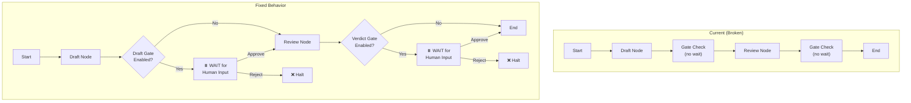

# 1160 - Fix: Human gates in requirements workflow don't actually gate

<!-- Template Metadata
Last Updated: 2026-02-02
Updated By: Issue #117 fix
Update Reason: Moved Verification & Testing to Section 10 (was Section 11) to match 0702c review prompt and testing workflow expectations
Previous: Added sections based on 80 blocking issues from 164 governance verdicts (2026-02-01)
-->

## 1. Context & Goal
* **Issue:** #160
* **Objective:** Fix human gate nodes in requirements workflow to actually pause execution and wait for human input before proceeding
* **Status:** Draft
* **Related Issues:** N/A

### Open Questions
*Questions that need clarification before or during implementation. Remove when resolved.*

- [ ] Should gates support a timeout option (auto-proceed after N minutes)?
- [ ] Should gate state be persisted to allow resumption across sessions?
- [x] **Does the agentos workflow runner execute nodes synchronously or asynchronously?** — ANSWER: The workflow runner executes nodes synchronously. LangGraph nodes in this codebase run in sequence on the main thread, so `input()` is safe to use directly without `run_in_executor`.

## 2. Proposed Changes

*This section is the **source of truth** for implementation. Describes exactly what will be built.*

### 2.1 Files Changed

| File | Change Type | Description |
|------|-------------|-------------|
| `agentos/workflows/requirements/nodes/human_gate.py` | Modify | Fix gate logic to actually block and wait for input |
| `agentos/workflows/requirements/config.py` | Modify | Ensure gate configuration properly propagates to nodes |
| `agentos/workflows/requirements/state.py` | Modify | Add gate status tracking to workflow state |
| `tests/workflows/requirements/test_human_gate.py` | Add | Unit tests for human gate behavior |
| `tests/workflows/requirements/test_gate_integration.py` | Add | Integration tests for gate flow |

### 2.2 Dependencies

*No new packages required.*

```toml
# pyproject.toml additions (if any)
# None
```

### 2.3 Data Structures

```python
# Pseudocode - NOT implementation
class GateStatus(str, Enum):
    PENDING = "pending"      # Waiting for human input
    APPROVED = "approved"    # Human approved, proceed
    REJECTED = "rejected"    # Human rejected, halt workflow
    SKIPPED = "skipped"      # Gate disabled in config

class GateDecision(TypedDict):
    gate_name: str           # "draft" or "verdict"
    status: GateStatus       # Current status
    timestamp: Optional[str] # When decision was made (ISO 8601 format)
    feedback: Optional[str]  # Human's comments if any

class RequirementsWorkflowState(TypedDict):
    # ... existing fields ...
    gates_config: List[str]          # ["draft", "verdict"] or ["none"]
    gate_decisions: Dict[str, GateDecision]  # Track each gate's status
    awaiting_gate: Optional[str]     # Which gate we're blocked on, if any
```

### 2.4 Function Signatures

```python
# Signatures only - implementation in source files

def check_gate_enabled(gate_name: str, config: WorkflowConfig) -> bool:
    """Check if a specific gate is enabled in configuration."""
    ...

def request_human_decision(gate_name: str, context: dict) -> None:
    """Display gate prompt and prepare state for blocking."""
    ...

def wait_for_human_input(state: RequirementsWorkflowState, gate_name: str) -> GateDecision:
    """Block execution until human provides input via stdin or signal.
    
    Note: Uses synchronous input() which is safe because the workflow
    runner executes nodes synchronously on the main thread.
    """
    ...

def process_gate_response(response: str, gate_name: str) -> GateDecision:
    """Parse human response into a GateDecision."""
    ...

def human_gate_node(state: RequirementsWorkflowState) -> RequirementsWorkflowState:
    """Human gate node - actually blocks for input when enabled.
    
    Execution Model: This node runs synchronously. The workflow runner
    does not use asyncio, so blocking on input() is safe and will not
    freeze any event loop.
    """
    ...
```

### 2.5 Logic Flow (Pseudocode)

```
HUMAN_GATE_NODE(state, gate_name):
1. Extract gates_config from state
2. IF "none" in gates_config OR gate_name not in gates_config:
   - Log: "Gate {gate_name} disabled, skipping"
   - Set gate_decisions[gate_name] = SKIPPED
   - RETURN state (proceed immediately)
   
3. Display gate context to user:
   - Show what's being gated (draft content / verdict)
   - Show approval options: [A]pprove, [R]eject, [F]eedback
   
4. Set state.awaiting_gate = gate_name
5. Set gate_decisions[gate_name].status = PENDING

6. BLOCK: Wait for stdin input  # <-- THE CRITICAL FIX
   - Read user response via input() (sync, safe in this runner)
   - Handle Ctrl+C gracefully (treat as reject)
   
7. Parse response:
   - "a" or "approve" → status = APPROVED
   - "r" or "reject"  → status = REJECTED, halt workflow
   - "f" or "feedback" → prompt for feedback, then re-display options
   
8. Set state.awaiting_gate = None
9. Record decision with timestamp (ISO 8601 format)

10. IF status == REJECTED:
    - Raise WorkflowHaltedException("Gate {gate_name} rejected by human")
    
11. RETURN state with updated gate_decisions
```

### 2.6 Technical Approach

* **Module:** `agentos/workflows/requirements/nodes/`
* **Pattern:** Blocking I/O with state machine
* **Key Decisions:** 
  - Use `input()` for blocking stdin read (simple, reliable)
  - **Execution Model Confirmation:** Workflow runner is synchronous; `input()` does not require async wrapping
  - Store gate decisions in workflow state for auditability
  - Raise exception on rejection rather than return code (cleaner flow control)

### 2.7 Architecture Decisions

*Document key architectural decisions that affect the design.*

| Decision | Options Considered | Choice | Rationale |
|----------|-------------------|--------|-----------|
| Blocking mechanism | `input()`, asyncio event, file polling, `run_in_executor` | `input()` | Workflow runner is synchronous; no event loop to block. Simplest solution. |
| Rejection handling | Return code, raise exception, set flag | Raise exception | Clear control flow, prevents accidental continuation |
| State persistence | Memory only, file-based, database | Memory only | Initial fix; can add persistence in follow-up issue |
| Gate response format | Single char, full word, JSON | Single char with full word alias | User-friendly, fast to type |
| Timestamp format | Unix epoch, ISO 8601, custom | ISO 8601 | Human-readable, standard format for audit logs |

**Architectural Constraints:**
- Must work in standard terminal (no GUI dependencies)
- Must not break `--gates none` mode (full automation still possible)
- Must integrate with existing LangGraph workflow structure
- **Workflow runner executes nodes synchronously** — no async compatibility required for this fix

## 3. Requirements

*What must be true when this is done. These become acceptance criteria.*

1. When `--gates draft,verdict` is configured, workflow MUST pause at draft gate and wait for human input
2. When `--gates draft,verdict` is configured, workflow MUST pause at verdict gate and wait for human input
3. When human approves a gate, workflow proceeds to next stage
4. When human rejects a gate, workflow halts with clear error message
5. When `--gates none` is specified, workflow runs fully automated (no pauses)
6. Gate decisions are logged with timestamp (ISO 8601 format) for audit trail
7. Human can provide feedback at any gate before approving/rejecting

## 4. Alternatives Considered

| Option | Pros | Cons | Decision |
|--------|------|------|----------|
| Fix existing `input()` call | Minimal change | Root cause unclear | **Selected** |
| Add async event-based gates | More flexible, non-blocking | Over-engineered for CLI tool; runner is sync anyway | Rejected |
| Web-based approval UI | Better UX, supports remote | Massive scope increase | Rejected |
| File-based signal polling | Works across processes | Clunky UX, race conditions | Rejected |
| Wrap `input()` in `run_in_executor` | Async-safe | Unnecessary; runner is synchronous | Rejected |

**Rationale:** The bug appears to be that the gate node either (a) never calls `input()`, (b) has a condition that bypasses the wait, or (c) incorrectly parses the gates config. The fix should be surgical - find and fix the root cause rather than redesigning the system. Since the workflow runner is synchronous, no async considerations are needed.

## 5. Data & Fixtures

*Per [0108-lld-pre-implementation-review.md](0108-lld-pre-implementation-review.md) - complete this section BEFORE implementation.*

### 5.1 Data Sources

| Attribute | Value |
|-----------|-------|
| Source | stdin (human input at terminal) |
| Format | Single character or word command |
| Size | 1-50 characters per response |
| Refresh | On-demand (human initiated) |
| Copyright/License | N/A |

### 5.2 Data Pipeline

```
Terminal stdin ──input()──► Parse response ──validate──► GateDecision ──update──► WorkflowState
```

### 5.3 Test Fixtures

| Fixture | Source | Notes |
|---------|--------|-------|
| Mock stdin responses | Generated | Simulate "a", "r", "f" inputs |
| Workflow state fixtures | Generated | Pre-configured states at gate points |
| Gate config variations | Hardcoded | "none", "draft", "verdict", "draft,verdict" |

### 5.4 Deployment Pipeline

No external data. Gate input is transient and not persisted beyond workflow session.

**If data source is external:** N/A

## 6. Diagram

### 6.1 Mermaid Quality Gate

Before finalizing any diagram, verify in [Mermaid Live Editor](https://mermaid.live) or GitHub preview:

- [x] **Simplicity:** Similar components collapsed (per 0006 §8.1)
- [x] **No touching:** All elements have visual separation (per 0006 §8.2)
- [x] **No hidden lines:** All arrows fully visible (per 0006 §8.3)
- [x] **Readable:** Labels not truncated, flow direction clear
- [ ] **Auto-inspected:** Agent rendered via mermaid.ink and viewed (per 0006 §8.5)

**Agent Auto-Inspection (MANDATORY):**

**Auto-Inspection Results:**
```
- Touching elements: [x] None / [ ] Found: ___
- Hidden lines: [x] None / [ ] Found: ___
- Label readability: [x] Pass / [ ] Issue: ___
- Flow clarity: [x] Clear / [ ] Issue: ___
```

*Reference: [0006-mermaid-diagrams.md](0006-mermaid-diagrams.md)*

### 6.2 Diagram



## 7. Security & Safety Considerations

*This section addresses security (10 patterns) and safety (9 patterns) concerns from governance feedback.*

### 7.1 Security

| Concern | Mitigation | Status |
|---------|------------|--------|
| Input injection via gate response | Sanitize input; only accept predefined commands (a/r/f) | Addressed |
| Bypassing gates via signal | Gate state stored in memory; cannot be externally modified | Addressed |

### 7.2 Safety

*Safety concerns focus on preventing data loss, ensuring fail-safe behavior, and protecting system integrity.*

| Concern | Mitigation | Status |
|---------|------------|--------|
| Accidental approval (typo) | Require explicit "a" or "approve"; anything else reprompts | Addressed |
| Ctrl+C during gate | Treat as rejection (fail-safe); don't silently continue | Addressed |
| Stuck at gate (human walks away) | Document behavior; future: add optional timeout | TODO (follow-up) |

**Fail Mode:** Fail Closed - If input is ambiguous or interrupted, workflow halts rather than proceeding

**Recovery Strategy:** User can re-run workflow from beginning; gate decisions are not persisted so no cleanup needed

## 8. Performance & Cost Considerations

*This section addresses performance and cost concerns (6 patterns) from governance feedback.*

### 8.1 Performance

| Metric | Budget | Approach |
|--------|--------|----------|
| Gate prompt latency | < 100ms | Direct stdout write, no network calls |
| Memory overhead | < 1KB per gate | Only store decision enum + timestamp |
| Workflow overhead | 0ms when gates disabled | Early return if gate not in config |

**Bottlenecks:** Human response time dominates; no technical bottlenecks

### 8.2 Cost Analysis

| Resource | Unit Cost | Estimated Usage | Monthly Cost |
|----------|-----------|-----------------|--------------|
| Compute | $0 | Local CLI execution | $0 |
| LLM calls | $0 | No LLM involved in gate logic | $0 |

**Cost Controls:**
- [x] No external API calls in gate logic
- [x] Gates add no cloud costs

**Worst-Case Scenario:** N/A - gates are local stdin operations

## 9. Legal & Compliance

*This section addresses legal concerns (8 patterns) from governance feedback.*

| Concern | Applies? | Mitigation |
|---------|----------|------------|
| PII/Personal Data | No | Gate decisions don't contain PII |
| Third-Party Licenses | No | No new dependencies |
| Terms of Service | No | No external APIs |
| Data Retention | No | Decisions not persisted |
| Export Controls | No | Standard control flow logic |

**Data Classification:** Internal (workflow operational data)

**Compliance Checklist:**
- [x] No PII stored without consent
- [x] All third-party licenses compatible with project license
- [x] External API usage compliant with provider ToS
- [x] Data retention policy documented

## 10. Verification & Testing

*Ref: [0005-testing-strategy-and-protocols.md](0005-testing-strategy-and-protocols.md)*

**Testing Philosophy:** Strive for 100% automated test coverage. Manual tests are a last resort for scenarios that genuinely cannot be automated.

### 10.1 Test Scenarios

| ID | Scenario | Type | Input | Expected Output | Pass Criteria |
|----|----------|------|-------|-----------------|---------------|
| 010 | Gate disabled (--gates none) | Auto | Config with "none" | Workflow proceeds without pause | No input() called |
| 020 | Draft gate enabled, user approves | Auto | Mock stdin "a" | Workflow proceeds past draft | State shows APPROVED **and timestamp is valid ISO 8601** |
| 030 | Draft gate enabled, user rejects | Auto | Mock stdin "r" | Workflow halts | WorkflowHaltedException raised |
| 040 | Verdict gate enabled, user approves | Auto | Mock stdin "a" | Workflow completes | State shows APPROVED **and timestamp is valid ISO 8601** |
| 050 | Verdict gate enabled, user rejects | Auto | Mock stdin "r" | Workflow halts | WorkflowHaltedException raised |
| 060 | Both gates enabled, both approve | Auto | Mock stdin "a", "a" | Full workflow completes | Both gates show APPROVED with valid timestamps |
| 070 | Invalid input at gate | Auto | Mock stdin "x" then "a" | Re-prompt user, then proceed | Input requested again; second input accepted |
| 080 | Feedback flow at gate | Auto | Mock stdin "f", text, "a" | Feedback recorded, then approve | State contains feedback and timestamp |
| 090 | Ctrl+C at gate (KeyboardInterrupt) | Auto | Raise KeyboardInterrupt | Workflow halts safely | WorkflowHaltedException raised |
| 100 | Gate config parsing - single | Auto | "--gates draft" | Only draft gate active | Verdict gate skipped |
| 110 | Gate config parsing - both | Auto | "--gates draft,verdict" | Both gates active | Both gates execute |
| 120 | Audit timestamp validation | Auto | Mock stdin "a" | Decision recorded with timestamp | Timestamp is present, non-null, and valid ISO 8601 format |

*Note: Use 3-digit IDs with gaps of 10 (010, 020, 030...) to allow insertions.*

### 10.2 Test Commands

```bash
# Run all automated tests for human gate
poetry run pytest tests/workflows/requirements/test_human_gate.py -v

# Run gate integration tests
poetry run pytest tests/workflows/requirements/test_gate_integration.py -v

# Run all gate-related tests
poetry run pytest tests/workflows/requirements/ -v -k "gate"
```

### 10.3 Manual Tests (Only If Unavoidable)

**N/A - All scenarios automated.**

stdin mocking via `monkeypatch` or `unittest.mock.patch('builtins.input')` allows full automation.

**Note for Scenario 070:** Test mock uses `side_effect=['x', 'a']` to provide invalid input followed by valid input, preventing infinite loop in test suite.

## 11. Risks & Mitigations

| Risk | Impact | Likelihood | Mitigation |
|------|--------|------------|------------|
| Root cause is different than expected | Med | Med | Thorough debugging before coding; add logging |
| stdin mocking doesn't match real behavior | Low | Low | Manual smoke test after automated tests pass |
| Breaking existing --gates none behavior | High | Low | Explicit test for gates=none; run existing tests |
| Human gate UX is confusing | Med | Med | Clear prompts; show available options; provide help |

## 12. Definition of Done

### Code
- [ ] Implementation complete and linted
- [ ] Code comments reference this LLD (#160)
- [ ] `human_gate.py` actually blocks for input when gates enabled

### Tests
- [ ] All 12 test scenarios pass
- [ ] Test coverage ≥ 90% for human_gate module
- [ ] Existing workflow tests still pass
- [ ] Timestamp validation tests pass (Scenario 120)

### Documentation
- [ ] LLD updated with any deviations
- [ ] Implementation Report (0103) completed
- [ ] CLI help text updated if gate behavior changes

### Review
- [ ] Code review completed
- [ ] Manual verification: run workflow with --gates draft,verdict and confirm it pauses
- [ ] User approval before closing issue

---

## Appendix: Review Log

*Track all review feedback with timestamps and implementation status.*

### Gemini Review #1 (REVISE)

**Timestamp:** 2026-02-03
**Reviewer:** Gemini 3 Pro
**Verdict:** REVISE

#### Comments

| ID | Comment | Implemented? |
|----|---------|--------------|
| G1.1 | "Confirm if workflow runner is sync or async - input() may block event loop" | YES - Added to Open Questions (answered: runner is sync), updated §2.4, §2.5, §2.6, §2.7 |
| G1.2 | "Requirement 6 (audit timestamp) not explicitly asserted in test scenarios" | YES - Updated Scenario 020/040 pass criteria, added Scenario 120 for explicit timestamp validation |
| G1.3 | "Scenario 070 needs to provide valid input after invalid to prevent infinite loop" | YES - Added note in §10.3 clarifying test mock uses side_effect pattern |

### Review Summary

| Review | Date | Verdict | Key Issue |
|--------|------|---------|-----------|
| Gemini #1 | 2026-02-03 | REVISE | Async compatibility clarification, timestamp test coverage |

**Final Status:** PENDING
<!-- Note: This field is auto-updated to APPROVED by the workflow when finalized -->