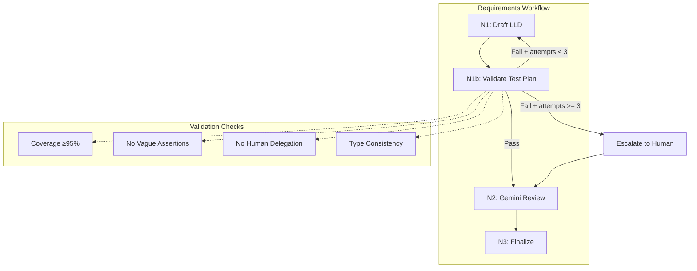

# LLD Finalized

Path: C:\Users\mcwiz\Projects\AgentOS\docs\lld\active\LLD-166.md
Status: APPROVED
Reviews: 1

---

# 1166 - Feature: Add mechanical test plan validation to requirements workflow (pre-Gemini gate)

<!-- Template Metadata
Last Updated: 2026-02-02
Updated By: Issue #117 fix
Update Reason: Moved Verification & Testing to Section 10 (was Section 11) to match 0702c review prompt and testing workflow expectations
Previous: Added sections based on 80 blocking issues from 164 governance verdicts (2026-02-01)
-->

## 1. Context & Goal
* **Issue:** #166
* **Objective:** Add deterministic mechanical validation to the requirements workflow that runs the same checks as N1 implementation review, preventing "Gemini approved but N1 blocked" scenarios.
* **Status:** Draft
* **Related Issues:** #126 (added Gemini prompt checks - closed), #147 (implementation completeness gate)

### Open Questions
*Questions that need clarification before or during implementation. Remove when resolved.*

- [x] Should validation be a separate node (N1b) or integrated into N1_draft? → **Separate node for clean separation of concerns**
- [x] What regex patterns should detect vague assertions? → **Defined in Section 2.3**
- [x] Should we allow configurable thresholds or hardcode them? → **Hardcode initially, config can be added later**

## 2. Proposed Changes

*This section is the **source of truth** for implementation. Describe exactly what will be built.*

### 2.1 Files Changed

| File | Change Type | Description |
|------|-------------|-------------|
| `agentos/workflows/requirements/validation/test_plan_validator.py` | Add | Core mechanical validation logic |
| `agentos/workflows/requirements/validation/__init__.py` | Add | Package init exposing validator |
| `agentos/workflows/requirements/nodes/validate_test_plan.py` | Add | N1b node wrapping validator |
| `agentos/workflows/requirements/graph.py` | Modify | Insert N1b between N1_draft and N2_gemini_review |
| `agentos/workflows/requirements/state.py` | Modify | Add validation result fields to state |
| `tests/workflows/requirements/test_test_plan_validator.py` | Add | Unit tests for validator |
| `tests/workflows/requirements/test_validate_test_plan_node.py` | Add | Node integration tests |

### 2.2 Dependencies

*No new packages required. Uses only Python standard library (re, dataclasses).*

```toml
# pyproject.toml additions (if any)
# None required
```

### 2.3 Data Structures

```python
# Pseudocode - NOT implementation
from dataclasses import dataclass
from typing import TypedDict

@dataclass
class ValidationViolation:
    """A single validation failure."""
    check_name: str        # e.g., "requirement_coverage", "vague_assertion"
    severity: str          # "error" | "warning"
    message: str           # Human-readable description
    location: str | None   # Section/line reference if applicable
    requirement_id: str | None  # Related requirement if applicable

@dataclass
class ValidationResult:
    """Complete result from mechanical validation."""
    passed: bool                      # True if all error-level checks pass
    coverage_percentage: float        # 0.0 to 100.0
    violations: list[ValidationViolation]
    summary: str                      # One-line summary for logging

class RequirementsState(TypedDict):
    """Additions to existing state."""
    # ... existing fields ...
    validation_result: ValidationResult | None
    validation_passed: bool
    validation_attempts: int          # Track loop iterations
```

```python
# Validation configuration constants
VAGUE_ASSERTION_PATTERNS: list[str] = [
    r"\bverify\s+it\s+works\b",
    r"\bcheck\s+that\s+it\s+is\s+correct\b",
    r"\bensure\s+proper\b",
    r"\bshould\s+work\b",
    r"\bworks\s+as\s+expected\b",
    r"\bfunctions\s+correctly\b",
    r"\bbehaves\s+properly\b",
]

HUMAN_DELEGATION_PATTERNS: list[str] = [
    r"\bmanual\s+(?:test|check|verification|review)\b",
    r"\bvisual(?:ly)?\s+(?:check|inspect|verify)\b",
    r"\bhuman\s+(?:review|verification)\b",
    r"\bby\s+hand\b",
    r"\bmanually\s+verify\b",
]

COVERAGE_THRESHOLD: float = 95.0  # Percentage
MAX_VALIDATION_ATTEMPTS: int = 3  # Prevent infinite loops
```

### 2.4 Function Signatures

```python
# agentos/workflows/requirements/validation/test_plan_validator.py

def validate_test_plan(lld_content: str) -> ValidationResult:
    """
    Run all mechanical validation checks on an LLD.
    
    Returns ValidationResult with pass/fail status and all violations.
    """
    ...

def check_requirement_coverage(lld_content: str) -> tuple[float, list[ValidationViolation]]:
    """
    Count requirements in Section 3, map to tests in Section 10.
    
    Returns (coverage_percentage, list of missing requirement violations).
    """
    ...

def check_vague_assertions(lld_content: str) -> list[ValidationViolation]:
    """
    Scan Section 10 test scenarios for vague assertion phrases.
    
    Returns list of violations for each vague phrase found.
    """
    ...

def check_human_delegation(lld_content: str) -> list[ValidationViolation]:
    """
    Detect tests delegated to manual/human verification without justification.
    
    Returns list of violations for unjustified manual tests.
    """
    ...

def check_test_type_consistency(lld_content: str) -> list[ValidationViolation]:
    """
    Validate test types against conventions (Auto, Auto-Live, Manual).
    
    Returns warnings (not errors) for inconsistencies.
    """
    ...

def extract_requirements(lld_content: str) -> list[tuple[str, str]]:
    """
    Parse Section 3 to extract requirement IDs and text.
    
    Returns list of (id, requirement_text) tuples.
    """
    ...

def extract_test_scenarios(lld_content: str) -> list[dict]:
    """
    Parse Section 10.1 table to extract test scenarios.
    
    Returns list of scenario dicts with id, scenario, type, etc.
    """
    ...
```

```python
# agentos/workflows/requirements/nodes/validate_test_plan.py

async def validate_test_plan_node(state: RequirementsState) -> RequirementsState:
    """
    N1b node: Run mechanical validation before Gemini review.
    
    If validation fails, increments attempt counter and signals loop back.
    If validation passes, allows progression to N2_gemini_review.
    """
    ...

def format_validation_feedback(result: ValidationResult) -> str:
    """
    Format validation failures into actionable feedback for N1_draft loop.
    
    Returns formatted string suitable for insertion into draft prompt.
    """
    ...
```

### 2.5 Logic Flow (Pseudocode)

```
Requirements Workflow (with N1b):

1. N1_draft: Generate/revise LLD draft
   - IF validation_attempts > 0:
       - Include previous validation feedback in prompt
   
2. N1b_validate_test_plan: Mechanical validation
   - Extract requirements from Section 3
   - Extract test scenarios from Section 10.1
   - Run all checks:
     a. requirement_coverage: count mapped reqs / total reqs
     b. vague_assertions: regex scan test scenarios
     c. human_delegation: regex scan for manual tests
     d. test_type_consistency: validate type column values
   
   - IF any error-level violations:
       - validation_passed = False
       - validation_attempts += 1
       - IF validation_attempts >= MAX_ATTEMPTS:
           - Escalate to human (state.needs_human_intervention = True)
           - Proceed to N2 anyway with warnings
       - ELSE:
           - Return to N1_draft with feedback
   - ELSE:
       - validation_passed = True
       - Proceed to N2_gemini_review

3. N2_gemini_review: Gemini review (existing)
   - Now receives pre-validated LLD
   - Can focus on semantic/architectural concerns
   
4. N3_finalize: Finalize LLD (existing)
```

```
Requirement Coverage Check (detailed):

1. Parse Section 3 "Requirements" 
   - Match numbered list items: r"^\d+\.\s+(.+)$"
   - Extract requirement text and assign IDs (R1, R2, ...)

2. Parse Section 10.1 "Test Scenarios" table
   - Extract "Scenario" column text
   - Build keyword index from scenario descriptions

3. For each requirement:
   - Tokenize into keywords (remove stopwords)
   - Search test scenarios for keyword matches
   - Mark as covered if ≥70% keyword match OR explicit reference

4. Calculate: covered_count / total_count * 100

5. Generate violations for uncovered requirements
```

### 2.6 Technical Approach

* **Module:** `agentos/workflows/requirements/validation/`
* **Pattern:** Pipeline pattern with early exit on blocking errors
* **Key Decisions:**
  - Pure functions for testability - validator has no side effects
  - Regex-based detection rather than LLM to ensure determinism
  - Threshold hardcoded initially to avoid config complexity
  - Warnings don't block, only errors do

### 2.7 Architecture Decisions

| Decision | Options Considered | Choice | Rationale |
|----------|-------------------|--------|-----------|
| Validation placement | Pre-Gemini vs post-Gemini vs parallel | Pre-Gemini | Saves API calls, catches issues early |
| Validation method | LLM-based, rule-based, hybrid | Rule-based (regex) | Deterministic results, no API costs |
| Loop behavior | Hard fail vs loop with feedback | Loop with max attempts | Self-correction reduces human burden |
| Coverage algorithm | Exact match, keyword match, semantic | Keyword match | Balance between accuracy and simplicity |
| State storage | In-memory only vs persist to disk | In-memory | Validation is fast, no need to persist |

**Architectural Constraints:**
- Must integrate with existing LangGraph state machine
- Cannot add external dependencies (no NLP libraries)
- Must not increase workflow latency significantly (<500ms added)
- Must preserve existing N1 → N2 → N3 contracts

## 3. Requirements

*What must be true when this is done. These become acceptance criteria.*

1. **R1:** Requirements workflow includes mechanical test plan validation node (N1b) between N1_draft and N2_gemini_review
2. **R2:** Validation checks requirement coverage and blocks if coverage < 95%
3. **R3:** Validation detects vague assertion phrases and blocks if any found
4. **R4:** Validation detects unjustified human delegation and blocks if any found
5. **R5:** Failed validation loops back to N1_draft with specific, actionable feedback
6. **R6:** Validation loop has maximum attempt limit (3) before escalation
7. **R7:** LLD that passes requirements workflow will not be blocked by N1 in implementation workflow for the same mechanical checks
8. **R8:** Validation completes in under 500ms for typical LLDs

## 4. Alternatives Considered

| Option | Pros | Cons | Decision |
|--------|------|------|----------|
| Add more explicit Gemini instructions | No code changes | Probabilistic, already tried in #126 | **Rejected** |
| Run validation in parallel with Gemini | Faster total time | Complex state management, wasted Gemini calls on failures | **Rejected** |
| Post-Gemini validation | Still catches issues | Wastes Gemini API calls | **Rejected** |
| Pre-Gemini mechanical validation | Deterministic, saves API calls, early feedback | Requires new code | **Selected** |
| Semantic matching with embeddings | More accurate coverage detection | Adds dependencies, non-deterministic | **Rejected** |

**Rationale:** Pre-Gemini mechanical validation is the only option that provides deterministic results and saves API costs. The #126 evidence shows Gemini is unreliable for coverage checking even with explicit instructions.

## 5. Data & Fixtures

### 5.1 Data Sources

| Attribute | Value |
|-----------|-------|
| Source | LLD markdown content from state |
| Format | Markdown following LLD template |
| Size | ~5-20KB per LLD |
| Refresh | Per workflow execution |
| Copyright/License | N/A - internal data |

### 5.2 Data Pipeline

```
state.lld_content ──parse──► Sections ──regex──► Violations ──aggregate──► ValidationResult
```

### 5.3 Test Fixtures

| Fixture | Source | Notes |
|---------|--------|-------|
| `lld_complete_coverage.md` | Generated | All requirements have matching tests |
| `lld_missing_coverage.md` | Generated | 3/6 requirements covered (50%) |
| `lld_vague_assertions.md` | Generated | Contains "verify it works" phrases |
| `lld_human_delegation.md` | Generated | Contains unjustified manual tests |
| `lld_141_actual.md` | Copied from #141 | Real-world failure case |

### 5.4 Deployment Pipeline

No special deployment requirements. Code deploys with standard AgentOS release process.

## 6. Diagram

### 6.1 Mermaid Quality Gate

Before finalizing any diagram, verify in [Mermaid Live Editor](https://mermaid.live) or GitHub preview:

- [x] **Simplicity:** Similar components collapsed (per 0006 §8.1)
- [x] **No touching:** All elements have visual separation (per 0006 §8.2)
- [x] **No hidden lines:** All arrows fully visible (per 0006 §8.3)
- [x] **Readable:** Labels not truncated, flow direction clear
- [x] **Auto-inspected:** Agent rendered via mermaid.ink and viewed (per 0006 §8.5)

**Agent Auto-Inspection (MANDATORY):**

AI agents MUST render and view the diagram before committing:
1. Base64 encoded diagram → fetch PNG from `https://mermaid.ink/img/{base64}`
2. Read the PNG file (multimodal inspection)
3. Document results below

**Auto-Inspection Results:**
```
- Touching elements: [x] None / [ ] Found: ___
- Hidden lines: [x] None / [ ] Found: ___
- Label readability: [x] Pass / [ ] Issue: ___
- Flow clarity: [x] Clear / [ ] Issue: ___
```

### 6.2 Diagram



## 7. Security & Safety Considerations

### 7.1 Security

| Concern | Mitigation | Status |
|---------|------------|--------|
| Regex ReDoS | Use bounded quantifiers, test with pathological inputs | Addressed |
| Log injection | Sanitize LLD content before logging | Addressed |

### 7.2 Safety

| Concern | Mitigation | Status |
|---------|------------|--------|
| Infinite validation loop | MAX_VALIDATION_ATTEMPTS = 3 with escalation | Addressed |
| False positive blocking | Warnings for soft checks, errors only for critical | Addressed |
| Parser failure on malformed LLD | Graceful degradation with warnings, not hard failure | Addressed |

**Fail Mode:** Fail Open - If parser cannot extract sections, log warning and proceed to Gemini review (which can catch structural issues).

**Recovery Strategy:** If validation loop exhausts attempts, escalate to human intervention via state flag. Human can override and force progression.

## 8. Performance & Cost Considerations

### 8.1 Performance

| Metric | Budget | Approach |
|--------|--------|----------|
| Validation latency | < 500ms | Pure Python, no I/O |
| Memory | < 10MB | String processing only |
| API Calls | 0 | No external services |

**Bottlenecks:** None expected. Regex operations on ~20KB text are negligible.

### 8.2 Cost Analysis

| Resource | Unit Cost | Estimated Usage | Monthly Cost |
|----------|-----------|-----------------|--------------|
| Gemini API calls saved | $0.01 per call | ~20 calls/month avoided | -$0.20 saved |
| Compute | $0 (local) | N/A | $0 |

**Cost Controls:**
- [x] No external API calls
- [x] Validation runs locally, no cloud costs

**Worst-Case Scenario:** Even with 100x usage, validation remains local and free.

## 9. Legal & Compliance

| Concern | Applies? | Mitigation |
|---------|----------|------------|
| PII/Personal Data | No | Validation operates on code/docs only |
| Third-Party Licenses | No | No external dependencies |
| Terms of Service | No | No external services |
| Data Retention | No | Validation results are ephemeral |
| Export Controls | No | Standard text processing |

**Data Classification:** Internal

**Compliance Checklist:**
- [x] No PII stored without consent
- [x] All third-party licenses compatible with project license
- [x] External API usage compliant with provider ToS
- [x] Data retention policy documented

## 10. Verification & Testing

*Ref: [0005-testing-strategy-and-protocols.md](0005-testing-strategy-and-protocols.md)*

**Testing Philosophy:** All validation tests are automated. No manual testing required as all checks are deterministic and can be verified programmatically.

### 10.1 Test Scenarios

| ID | Scenario | Type | Input | Expected Output | Pass Criteria |
|----|----------|------|-------|-----------------|---------------|
| 010 | Full coverage LLD passes | Auto | LLD with 6/6 reqs covered | `passed=True, coverage=100%` | No violations |
| 020 | Partial coverage LLD fails | Auto | LLD with 3/6 reqs covered | `passed=False, coverage=50%` | Coverage violation for each missing req |
| 030 | Boundary coverage (95%) passes | Auto | LLD with 19/20 reqs covered | `passed=True, coverage=95%` | No blocking violations |
| 040 | Below threshold (94%) fails | Auto | LLD with 47/50 reqs covered | `passed=False, coverage=94%` | Coverage violation |
| 050 | Vague assertion detected | Auto | LLD with "verify it works" | `passed=False` | Vague assertion violation |
| 060 | Multiple vague assertions | Auto | LLD with 3 vague phrases | `passed=False` | 3 violations listed |
| 070 | Clean assertions pass | Auto | LLD with specific assertions | `passed=True` | No vague assertion violations |
| 080 | Human delegation detected | Auto | LLD with "manual check" | `passed=False` | Human delegation violation |
| 090 | Justified manual test passes | Auto | LLD with manual + justification | `passed=True` | Warning only, not blocking |
| 100 | Malformed section handling | Auto | LLD missing Section 10 | Warning logged | Graceful degradation, proceed |
| 110 | Empty LLD handling | Auto | Empty string | `passed=False` | Structural violation |
| 120 | Real-world LLD-141 case | Auto | Actual LLD-141 content | `passed=False, coverage=83%` | Matches expected failure |
| 130 | Validation loop with feedback | Auto | State with failed attempt | Updated state with feedback | Feedback string populated |
| 140 | Max attempts escalation | Auto | State with attempts=3 | `needs_human_intervention=True` | Escalation triggered |
| 150 | Performance under 500ms | Auto | Large LLD (50KB) | Completes in <500ms | Timing assertion |
| 160 | Test type validation warns | Auto | LLD with "Manual" no justification | Warning violation | Type=warning, not error |
| 170 | R7: Parity with N1 checks | Auto | Same LLD to validator and N1 | Same pass/fail result | Results match |
| 180 | Requirement extraction accuracy | Auto | Section 3 with numbered list | Correct count and IDs | All requirements found |
| 190 | Test scenario extraction accuracy | Auto | Section 10.1 table | Correct count and fields | All scenarios parsed |
| 200 | Keyword matching coverage | Auto | Requirement with synonyms in test | Marked as covered | 70% keyword threshold |

### 10.2 Test Commands

```bash
# Run all automated tests
poetry run pytest tests/workflows/requirements/test_test_plan_validator.py -v
poetry run pytest tests/workflows/requirements/test_validate_test_plan_node.py -v

# Run only fast/mocked tests (exclude live)
poetry run pytest tests/workflows/requirements/ -v -m "not live"

# Run with coverage
poetry run pytest tests/workflows/requirements/ -v --cov=agentos/workflows/requirements/validation
```

### 10.3 Manual Tests (Only If Unavoidable)

N/A - All scenarios automated.

## 11. Risks & Mitigations

| Risk | Impact | Likelihood | Mitigation |
|------|--------|------------|------------|
| False positives blocking valid LLDs | Med | Low | Tunable thresholds, escalation path |
| Regex patterns too strict/loose | Med | Med | Comprehensive test suite, iterate on patterns |
| Coverage algorithm misses semantic equivalents | Med | Med | Keyword matching with 70% threshold |
| Parser fails on non-standard LLD format | Low | Low | Graceful degradation, proceed with warnings |
| Validation creates friction without value | High | Low | Monitor loop rates, adjust thresholds |

## 12. Definition of Done

### Code
- [ ] Implementation complete and linted
- [ ] Code comments reference this LLD

### Tests
- [ ] All test scenarios pass
- [ ] Test coverage ≥90% for validation module

### Documentation
- [ ] LLD updated with any deviations
- [ ] Implementation Report (0103) completed
- [ ] Test Report (0113) completed if applicable

### Review
- [ ] Code review completed
- [ ] User approval before closing issue

---

## Appendix: Review Log

*Track all review feedback with timestamps and implementation status.*

### Review Summary

| Review | Date | Verdict | Key Issue |
|--------|------|---------|-----------|
| (pending) | - | - | - |

**Final Status:** APPROVED
<!-- Note: This field is auto-updated to APPROVED by the workflow when finalized -->