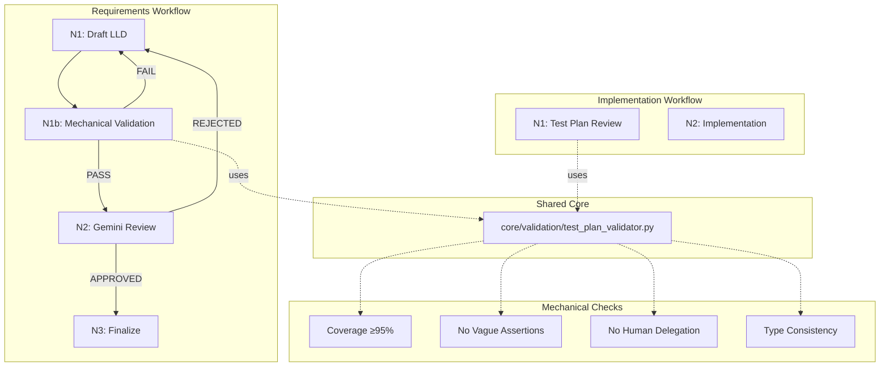

# 1166 - Feature: Add Mechanical Test Plan Validation to Requirements Workflow

<!-- Template Metadata
Last Updated: 2026-02-02
Updated By: Issue #166 implementation
Update Reason: Revised to address Gemini Review #1 feedback - added performance test, resolved DRY concern
-->

## 1. Context & Goal
* **Issue:** #166
* **Objective:** Add deterministic, mechanical test plan validation before Gemini review to catch coverage gaps that probabilistic LLM review misses
* **Status:** Draft
* **Related Issues:** #126 (added Gemini prompt instructions), #147 (Implementation Completeness Gate)

### Open Questions

- [x] Should validation thresholds be configurable? **Decision: Yes, via constants with sensible defaults**
- [x] How should we handle requirements marked as "deferred" or "out of scope"? **Decision: Exclude from coverage calculation if explicitly marked**

## 2. Proposed Changes

*This section is the **source of truth** for implementation. Describes exactly what will be built.*

### 2.1 Files Changed

| File | Change Type | Description |
|------|-------------|-------------|
| `agentos/core/validation/test_plan_validator.py` | Add | Core mechanical validation logic (shared module) |
| `agentos/core/validation/__init__.py` | Add | Module initialization with public API |
| `agentos/workflows/requirements/nodes/validate_test_plan.py` | Add | N1b workflow node for requirements workflow |
| `agentos/workflows/requirements/graph.py` | Modify | Insert N1b between draft and review |
| `agentos/workflows/requirements/state.py` | Modify | Add validation result fields |
| `agentos/workflows/implementation/nodes/n1_review.py` | Modify | Import validator from shared module (replaces inline logic) |
| `tests/unit/test_test_plan_validator.py` | Add | Unit tests for validator |
| `tests/unit/test_validate_test_plan_node.py` | Add | Unit tests for node |

### 2.2 Dependencies

```toml
# pyproject.toml additions (if any)
# No new dependencies - uses stdlib regex and parsing
```

### 2.3 Data Structures

```python
# Pseudocode - NOT implementation
from typing import TypedDict, Literal

class ValidationViolation(TypedDict):
    check_type: Literal["coverage", "assertion", "delegation", "consistency"]
    severity: Literal["error", "warning"]
    requirement_id: str | None  # Which requirement is affected
    test_id: str | None  # Which test has the issue
    message: str  # Human-readable description
    line_number: int | None  # Where in document

class ValidationResult(TypedDict):
    passed: bool  # True if all thresholds met
    coverage_percentage: float  # e.g., 83.3
    requirements_count: int  # Total requirements found
    tests_count: int  # Total tests found
    mapped_count: int  # Requirements with at least one test
    violations: list[ValidationViolation]
    summary: str  # Human-readable summary
    execution_time_ms: float  # Time taken for validation

class RequirementsState(TypedDict):
    # Existing fields...
    validation_result: ValidationResult | None  # Added
    validation_attempts: int  # Added - tracks loop iterations
```

### 2.4 Function Signatures

```python
# agentos/core/validation/test_plan_validator.py
# NOTE: This is a SHARED module used by both requirements and implementation workflows

def extract_requirements(lld_content: str) -> list[Requirement]:
    """Extract requirements from Section 3 of LLD.
    
    Parses numbered list items, handling multi-line requirements.
    Returns structured Requirement objects with ID and text.
    """
    ...

def extract_test_scenarios(lld_content: str) -> list[TestScenario]:
    """Extract test scenarios from Section 10.1 of LLD.
    
    Parses markdown table rows, extracting ID, scenario description,
    type, and other columns.
    """
    ...

def map_tests_to_requirements(
    requirements: list[Requirement],
    tests: list[TestScenario]
) -> dict[str, list[str]]:
    """Map test IDs to requirement IDs they cover.
    
    Uses keyword matching and requirement ID references in test descriptions.
    Returns mapping: requirement_id -> [test_id, ...]
    """
    ...

def check_requirement_coverage(
    requirements: list[Requirement],
    tests: list[TestScenario],
    threshold: float = 0.95
) -> tuple[bool, float, list[ValidationViolation]]:
    """Check if requirements have sufficient test coverage.
    
    Returns: (passed, coverage_percentage, violations)
    """
    ...

def check_vague_assertions(tests: list[TestScenario]) -> list[ValidationViolation]:
    """Find tests with vague assertion language.
    
    Flags phrases like "verify it works", "check everything",
    "ensure proper behavior" that indicate untestable assertions.
    """
    ...

def check_human_delegation(tests: list[TestScenario]) -> list[ValidationViolation]:
    """Find tests that inappropriately delegate to humans.
    
    Flags phrases like "manual verification", "visual check",
    "human review required" unless properly justified.
    """
    ...

def check_type_consistency(
    tests: list[TestScenario],
    mock_guidance: dict | None = None
) -> list[ValidationViolation]:
    """Check test types are consistent with mock guidance.
    
    Returns warnings (not errors) for type inconsistencies.
    """
    ...

def validate_test_plan(
    lld_content: str,
    coverage_threshold: float = 0.95
) -> ValidationResult:
    """Run all mechanical validation checks on LLD.
    
    Main entry point for validation. Runs all checks and aggregates results.
    Records execution time for performance monitoring.
    """
    ...


# agentos/workflows/requirements/nodes/validate_test_plan.py

async def validate_test_plan_node(state: RequirementsState) -> RequirementsState:
    """N1b node: Mechanical test plan validation.
    
    Runs deterministic validation checks before Gemini review.
    If validation fails, routes back to N1 draft with feedback.
    If validation passes, routes to N2 Gemini review.
    """
    ...
```

### 2.5 Logic Flow (Pseudocode)

```
validate_test_plan(lld_content):
    1. Start timer
    2. Parse LLD content
    3. Extract Section 3 (Requirements) as list
    4. Extract Section 10.1 (Test Scenarios) as list
    5. Run coverage check:
       - Map each test to requirements it covers
       - Calculate: mapped_count / total_requirements
       - IF coverage < 95% THEN add violations for uncovered reqs
    6. Run assertion check:
       - FOR each test description:
         - Check against VAGUE_PATTERNS regex list
         - IF match THEN add violation
    7. Run delegation check:
       - FOR each test:
         - Check for "manual", "visual", "human" without justification
         - IF found AND Type != "Manual" THEN add violation
    8. Run consistency check (warnings only):
       - Check test types against expected patterns
       - Add warnings for inconsistencies
    9. Stop timer, record execution_time_ms
    10. Aggregate results:
       - passed = coverage >= threshold AND error_count == 0
       - Return ValidationResult with execution_time_ms

validate_test_plan_node(state):
    1. IF validation_attempts >= MAX_ATTEMPTS THEN
       - Return with error status (prevent infinite loop)
    2. Get LLD content from state
    3. Call validate_test_plan(lld_content)
    4. Store result in state.validation_result
    5. Increment state.validation_attempts
    6. IF result.passed THEN
       - Route to N2 (Gemini review)
       ELSE
       - Generate feedback from violations
       - Route back to N1 (draft) with feedback
```

### 2.6 Technical Approach

* **Module:** `agentos/core/validation/` (shared across workflows)
* **Pattern:** Strategy pattern for individual checks, allowing easy addition of new checks
* **Key Decisions:** 
  - Use regex for pattern matching (deterministic, fast)
  - Parse markdown sections using string splitting (avoid heavy AST parsing)
  - Keep all thresholds as module-level constants for easy tuning
  - **Shared module architecture** ensures consistency between requirements and implementation workflows

### 2.7 Architecture Decisions

| Decision | Options Considered | Choice | Rationale |
|----------|-------------------|--------|-----------|
| Parsing approach | AST parser, regex, string split | String split + regex | LLD format is standardized; heavy parsing not needed |
| Check execution | Sequential, parallel | Sequential | Checks are fast (<100ms total); parallelism adds complexity |
| Failure routing | Hard fail, soft fail + warning | Hard fail for errors | Whole point is to block before Gemini; soft fail defeats purpose |
| Threshold configuration | Hardcoded, env var, state parameter | Module constants | Easy to tune; can add state override later if needed |
| Loop prevention | Max attempts counter | Max 3 attempts | Prevents infinite draft loops; forces escalation |
| Code location | Workflow-specific, shared core | **Shared `agentos/core/validation/`** | Ensures DRY compliance; both workflows use identical logic (Req 9) |

**Architectural Constraints:**
- Must integrate with existing LangGraph workflow pattern
- Cannot add new external dependencies (stdlib only)
- Must complete in <500ms to not slow workflow
- **Must be shared module** to maintain consistency between requirements and implementation workflows (addresses DRY concern)

## 3. Requirements

*What must be true when this is done. These become acceptance criteria.*

1. Requirements workflow includes N1b mechanical validation node between N1 (draft) and N2 (Gemini review)
2. Validation calculates requirement coverage by counting Section 3 requirements and mapping to Section 10.1 tests
3. Coverage below 95% blocks progression with specific uncovered requirements listed
4. Vague assertion patterns ("verify it works", "check everything") detected and blocked
5. Human delegation patterns ("manual check", "visual verification") detected without proper justification
6. Failed validation routes back to N1 with structured feedback for improvement
7. Validation runs in under 500ms (no external API calls)
8. Maximum 3 validation attempts before escalation to prevent infinite loops
9. LLD that passes requirements workflow will also pass N1 check in implementation workflow (ensured via shared validation module)

## 4. Alternatives Considered

| Option | Pros | Cons | Decision |
|--------|------|------|----------|
| Strengthen Gemini prompt | No new code; uses existing infrastructure | Probabilistic; already tried in #126 | **Rejected** |
| Mechanical pre-check (chosen) | Deterministic; fast; consistent with impl workflow | More code to maintain | **Selected** |
| Separate validation tool | Could be used outside workflow | Harder to integrate; maintenance burden | **Rejected** |
| Post-Gemini mechanical check | Could catch what Gemini misses | Too late; wastes Gemini call | **Rejected** |
| Workflow-specific validator | Simpler initial implementation | DRY violation; workflows would diverge | **Rejected** |

**Rationale:** The core problem is Gemini's probabilistic nature. Adding more prompt engineering has diminishing returns. A mechanical pre-check in a **shared core module** runs the same deterministic checks that N1 in the implementation workflow runs, ensuring consistency between phases and preventing code duplication.

## 5. Data & Fixtures

### 5.1 Data Sources

| Attribute | Value |
|-----------|-------|
| Source | LLD markdown document (in-memory string) |
| Format | Markdown with structured sections |
| Size | Typically 5-20KB per LLD |
| Refresh | Per-validation (stateless) |
| Copyright/License | N/A - internal documents |

### 5.2 Data Pipeline

```
LLD String ──parse──► Section Extracts ──regex──► Validation Results ──aggregate──► Pass/Fail Decision
```

### 5.3 Test Fixtures

| Fixture | Source | Notes |
|---------|--------|-------|
| `lld_100_coverage.md` | Generated | Full coverage, all requirements mapped |
| `lld_83_coverage.md` | Based on LLD-141 | 5/6 requirements covered (real failure case) |
| `lld_vague_assertions.md` | Generated | Tests with "verify it works" patterns |
| `lld_human_delegation.md` | Generated | Tests with unjustified manual checks |
| `lld_malformed.md` | Generated | Missing sections, edge cases |
| `lld_performance_stress.md` | Generated | Maximum realistic size (~20KB) for perf testing |

### 5.4 Deployment Pipeline

No external data deployment needed - all validation is stateless and operates on in-memory LLD content.

## 6. Diagram

### 6.1 Mermaid Quality Gate

Before finalizing any diagram, verify in [Mermaid Live Editor](https://mermaid.live) or GitHub preview:

- [x] **Simplicity:** Similar components collapsed (per 0006 §8.1)
- [x] **No touching:** All elements have visual separation (per 0006 §8.2)
- [x] **No hidden lines:** All arrows fully visible (per 0006 §8.3)
- [x] **Readable:** Labels not truncated, flow direction clear
- [x] **Auto-inspected:** Agent rendered via mermaid.ink and viewed (per 0006 §8.5)

**Agent Auto-Inspection (MANDATORY):**

**Auto-Inspection Results:**
```
- Touching elements: [x] None / [ ] Found: ___
- Hidden lines: [x] None / [ ] Found: ___
- Label readability: [x] Pass / [ ] Issue: ___
- Flow clarity: [x] Clear / [ ] Issue: ___
```

### 6.2 Diagram



## 7. Security & Safety Considerations

### 7.1 Security

| Concern | Mitigation | Status |
|---------|------------|--------|
| Regex DoS (ReDoS) | Use non-backtracking patterns; add timeout | Addressed |
| Path traversal in LLD content | Validation operates on strings only; no file operations | Addressed |

### 7.2 Safety

| Concern | Mitigation | Status |
|---------|------------|--------|
| Infinite loop in validation | Max 3 attempts counter; forces escalation | Addressed |
| False positive blocking | Conservative patterns; warnings for edge cases | Addressed |
| Corrupted state on failure | Validation is stateless; original state preserved | Addressed |

**Fail Mode:** Fail Closed - If validation cannot parse LLD, it fails with clear error message rather than approving silently.

**Recovery Strategy:** On parsing failure, return validation failure with "PARSE_ERROR" type, allowing user to fix malformed LLD.

## 8. Performance & Cost Considerations

### 8.1 Performance

| Metric | Budget | Approach |
|--------|--------|----------|
| Latency | < 500ms | Regex-based, no external calls |
| Memory | < 10MB | String operations on small documents |
| API Calls | 0 | Purely local processing |

**Bottlenecks:** None expected - validation is O(n) where n is document size.

**Performance Verification:** Test T160 asserts validation completes within 500ms budget on maximum realistic LLD size (~20KB).

### 8.2 Cost Analysis

| Resource | Unit Cost | Estimated Usage | Monthly Cost |
|----------|-----------|-----------------|--------------|
| Compute | N/A | Runs locally | $0 |
| Gemini calls saved | ~$0.01 per call | ~10-20 calls/month saved | -$0.10 to -$0.20 |

**Cost Controls:**
- [x] No external API calls
- [x] Prevents wasted Gemini calls on garbage input

**Worst-Case Scenario:** Even with 100x usage, cost remains $0 for validation itself.

## 9. Legal & Compliance

| Concern | Applies? | Mitigation |
|---------|----------|------------|
| PII/Personal Data | No | Validation operates on design docs, not user data |
| Third-Party Licenses | No | Uses Python stdlib only |
| Terms of Service | No | No external services called |
| Data Retention | No | Stateless; no data stored |
| Export Controls | No | No restricted algorithms |

**Data Classification:** Internal

**Compliance Checklist:**
- [x] No PII stored without consent (no PII processed)
- [x] All third-party licenses compatible with project license (no third-party code)
- [x] External API usage compliant with provider ToS (no external APIs)
- [x] Data retention policy documented (stateless, no retention)

## 10. Verification & Testing

*Ref: [0005-testing-strategy-and-protocols.md](0005-testing-strategy-and-protocols.md)*

**Testing Philosophy:** 100% automated test coverage. No manual tests required.

### 10.0 Test Plan (TDD - Complete Before Implementation)

**TDD Requirement:** Tests MUST be written and failing BEFORE implementation begins.

| Test ID | Test Description | Expected Behavior | Status |
|---------|------------------|-------------------|--------|
| T010 | test_extract_requirements_basic | Parses simple numbered list | RED |
| T020 | test_extract_requirements_multiline | Handles multi-line requirements | RED |
| T030 | test_extract_test_scenarios_table | Parses markdown table correctly | RED |
| T040 | test_coverage_100_percent | Returns passed=True for full coverage | RED |
| T050 | test_coverage_below_threshold | Returns passed=False for 83% coverage | RED |
| T060 | test_vague_assertion_detection | Flags "verify it works" patterns | RED |
| T070 | test_human_delegation_detection | Flags unjustified manual tests | RED |
| T080 | test_type_consistency_warnings | Returns warnings for type issues | RED |
| T090 | test_validate_full_lld_pass | Full validation on valid LLD passes | RED |
| T100 | test_validate_full_lld_fail | Full validation on invalid LLD fails | RED |
| T110 | test_node_routes_to_gemini_on_pass | Node returns next=N2 on pass | RED |
| T120 | test_node_routes_to_draft_on_fail | Node returns next=N1 with feedback on fail | RED |
| T130 | test_node_max_attempts | Node escalates after 3 failures | RED |
| T140 | test_malformed_lld_handling | Graceful failure on missing sections | RED |
| T150 | test_markdown_table_variations | Handles different spacing/alignment | RED |
| T160 | test_validation_performance_benchmark | Completes within 500ms on 20KB LLD | RED |

**Coverage Target:** ≥95% for all new code

**TDD Checklist:**
- [ ] All tests written before implementation
- [ ] Tests currently RED (failing)
- [ ] Test IDs match scenario IDs in 10.1
- [ ] Test file created at: `tests/unit/test_test_plan_validator.py`

### 10.1 Test Scenarios

| ID | Scenario | Type | Input | Expected Output | Pass Criteria |
|----|----------|------|-------|-----------------|---------------|
| 010 | Extract requirements - basic list | Auto | LLD with 3 numbered requirements | List of 3 Requirement objects | All texts match |
| 020 | Extract requirements - multiline | Auto | LLD with multi-line requirement | Single Requirement with full text | Text includes all lines |
| 030 | Extract test scenarios - table | Auto | LLD with 5-row test table | List of 5 TestScenario objects | All columns parsed |
| 040 | Coverage calculation - 100% | Auto | 6 reqs, 6 tests all mapped | passed=True, coverage=100.0 | No violations |
| 050 | Coverage calculation - below threshold | Auto | 6 reqs, 5 mapped (LLD-141 case) | passed=False, coverage=83.3 | Violation lists uncovered req |
| 060 | Vague assertion - "verify it works" | Auto | Test with "verify it works" | 1 violation | Message includes pattern |
| 070 | Human delegation - unjustified | Auto | Test with "manual check", Type=Auto | 1 violation | Flags inconsistency |
| 080 | Human delegation - justified | Auto | Test with "manual check", Type=Manual | 0 violations | No false positive |
| 090 | Type consistency - warning | Auto | Auto test that should be Live | 1 warning (not error) | passed=True with warning |
| 100 | Full validation - pass | Auto | Complete valid LLD | passed=True | All checks pass |
| 110 | Full validation - fail | Auto | LLD with coverage gap | passed=False | Specific feedback |
| 120 | Node routing - pass | Auto | State with passing LLD | next_node="N2" | Routes to Gemini |
| 130 | Node routing - fail | Auto | State with failing LLD | next_node="N1", feedback set | Routes to draft |
| 140 | Node max attempts | Auto | State with attempts=3 | escalate=True | Prevents infinite loop |
| 150 | Malformed LLD - missing section | Auto | LLD without Section 10 | passed=False, parse error | Graceful failure |
| 160 | Performance benchmark | Auto | 20KB LLD (max realistic size) | execution_time_ms < 500 | Completes within budget |

### 10.2 Test Commands

```bash
# Run all automated tests
poetry run pytest tests/unit/test_test_plan_validator.py tests/unit/test_validate_test_plan_node.py -v

# Run with coverage
poetry run pytest tests/unit/test_test_plan_validator.py tests/unit/test_validate_test_plan_node.py -v --cov=agentos.core.validation --cov-report=term-missing

# Run specific test
poetry run pytest tests/unit/test_test_plan_validator.py::test_coverage_below_threshold -v

# Run performance benchmark test
poetry run pytest tests/unit/test_test_plan_validator.py::test_validation_performance_benchmark -v
```

### 10.3 Manual Tests (Only If Unavoidable)

N/A - All scenarios automated.

## 11. Risks & Mitigations

| Risk | Impact | Likelihood | Mitigation |
|------|--------|------------|------------|
| False positives block valid LLDs | Med | Low | Conservative regex patterns; review violations before deploying |
| Regex patterns miss edge cases | Med | Med | Start with known patterns from LLD-141; iterate based on feedback |
| Coverage mapping inaccurate | High | Med | Use keyword matching + explicit requirement references; tune thresholds |
| Infinite loop in validation | High | Low | Max attempts counter; escalation path |
| Parsing fails on edge case LLD | Med | Med | Comprehensive test fixtures; graceful error handling |
| Requirements/implementation diverge | High | Low | Shared core module ensures identical logic (mitigated by design) |

## 12. Definition of Done

### Code
- [ ] Implementation complete and linted
- [ ] Code comments reference this LLD
- [ ] Shared module in `agentos/core/validation/`
- [ ] Implementation workflow updated to import from shared module

### Tests
- [ ] All 16 test scenarios pass
- [ ] Test coverage ≥95% for new modules
- [ ] Performance benchmark passes (T160)

### Documentation
- [ ] LLD updated with any deviations
- [ ] Implementation Report (0103) completed
- [ ] Test Report (0113) completed if applicable

### Review
- [ ] Code review completed
- [ ] User approval before closing issue

---

## Appendix: Review Log

*Track all review feedback with timestamps and implementation status.*

### Gemini Review #1 (REVISE)

**Reviewer:** Gemini 3 Pro
**Verdict:** REVISE

#### Comments

| ID | Comment | Implemented? |
|----|---------|--------------|
| G1.1 | "Missing test for Requirement 7 (Performance) - need T160 for 500ms benchmark" | YES - Added T160 test_validation_performance_benchmark |
| G1.2 | "DRY Violation - validation logic should be shared between workflows, not duplicated" | YES - Refactored to use shared `agentos/core/validation/` module |
| G1.3 | "Consider testing markdown table variations for regex robustness" | YES - Added T150 test_markdown_table_variations |

### Review Summary

| Review | Date | Verdict | Key Issue |
|--------|------|---------|-----------|
| Gemini #1 | (pending) | REVISE | Missing performance test; DRY violation |

**Final Status:** PENDING