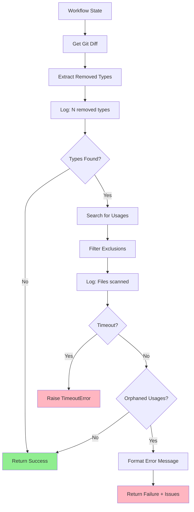

# Implementation Request: tests/fixtures/removed_type_alias.diff

## Task

Write the complete contents of `tests/fixtures/removed_type_alias.diff`.

Change type: Add
Description: Test fixture: TypedDict alias removed

## LLD Specification

# 170 - Feature: Add pre-commit check for type/class renames that miss usages

<!-- Template Metadata
Last Updated: 2026-02-02
Updated By: Issue #170 LLD creation - Gemini Review #1 revisions
Update Reason: Addressed Gemini feedback - resolved open questions, added T110 performance test, clarified subprocess safety approach, added logging strategy
-->

## 1. Context & Goal
* **Issue:** #170
* **Objective:** Add a LangGraph workflow node that detects when a class/type is renamed and verifies all usages are updated, preventing broken imports.
* **Status:** Approved (gemini-3-pro-preview, 2026-02-04)
* **Related Issues:** #168 (bug caused by missing this check), PR #165 (the breaking change)

### Open Questions
*Questions that need clarification before or during implementation. Remove when resolved.*

- [x] Should this be a pre-commit hook or a LangGraph workflow node? → **Workflow node** (per issue specification)
- [x] What file extensions should be checked? → **`.py` files only** (per Gemini Review #1 - avoids noise from non-code files)
- [x] Should we detect renamed types (old→new) or just removed types? → **Just removed types** (per Gemini Review #1 - a rename manifests as removal of old definition)

## 2. Proposed Changes

*This section is the **source of truth** for implementation. Describe exactly what will be built.*

### 2.1 Files Changed

| File | Change Type | Description |
|------|-------------|-------------|
| `agentos/nodes/check_type_renames.py` | Add | New workflow node for type rename detection |
| `agentos/nodes/__init__.py` | Modify | Export the new node function |
| `tests/unit/test_check_type_renames.py` | Add | Unit tests for the new node |
| `tests/fixtures/renamed_class.diff` | Add | Test fixture: class renamed without updating imports |
| `tests/fixtures/removed_type_alias.diff` | Add | Test fixture: TypedDict alias removed |
| `tests/fixtures/clean_rename.diff` | Add | Test fixture: properly renamed with all usages updated |

### 2.1.1 Path Validation (Mechanical - Auto-Checked)

*Issue #277: Before human or Gemini review, paths are verified programmatically.*

Mechanical validation automatically checks:
- All "Modify" files must exist in repository
- All "Delete" files must exist in repository
- All "Add" files must have existing parent directories
- No placeholder prefixes (`src/`, `lib/`, `app/`) unless directory exists

**Path Verification:**
- `agentos/nodes/` exists ✓ (existing directory with workflow nodes)
- `agentos/nodes/__init__.py` exists ✓ (file to modify)
- `tests/unit/` exists ✓
- `tests/fixtures/` exists ✓
- All new files use "Add" change type ✓

**If validation fails, the LLD is BLOCKED before reaching review.**

### 2.2 Dependencies

*New packages, APIs, or services required.*

```toml
# pyproject.toml additions (if any)
# No new dependencies - uses stdlib re, subprocess, pathlib
```

### 2.3 Data Structures

```python
# Pseudocode - NOT implementation
class TypeRenameIssue(TypedDict):
    old_name: str           # The removed/renamed type name
    definition_file: str    # Where it was originally defined
    orphaned_usages: list[OrphanedUsage]  # Where it's still referenced

class OrphanedUsage(TypedDict):
    file_path: str          # File containing the orphaned reference
    line_number: int        # Line number of the reference
    line_content: str       # The actual line content for context

class TypeRenameCheckResult(TypedDict):
    passed: bool            # True if no orphaned references found
    issues: list[TypeRenameIssue]  # List of detected issues
    checked_types: list[str]       # Types that were checked
    files_scanned: int             # Number of source files scanned
    removed_types_count: int       # Count of removed types detected (for logging)
```

### 2.4 Function Signatures

```python
# Signatures only - implementation in source files
def check_type_renames(state: WorkflowState, timeout: float = 10.0) -> dict:
    """
    Pre-commit check for orphaned type references.
    
    Detects removed/renamed class/type definitions from git diff
    and greps codebase for remaining usages.
    
    Args:
        state: Workflow state containing staged changes
        timeout: Maximum execution time in seconds (default: 10.0)
    
    Raises:
        TimeoutError: If check exceeds timeout limit
    """
    ...

def extract_removed_types(diff_content: str) -> list[tuple[str, str]]:
    """
    Parse git diff to find removed class/type definitions.
    
    Returns list of (type_name, source_file) tuples.
    """
    ...

def find_type_usages(
    type_name: str, 
    search_paths: list[Path], 
    exclude_patterns: list[str],
    timeout: float = 10.0
) -> list[OrphanedUsage]:
    """
    Search codebase for usages of a type name.
    
    Excludes docs, lineage, and other non-source directories.
    Uses subprocess with shell=False for safety (no shlex.quote needed).
    
    Args:
        type_name: The type name to search for
        search_paths: Directories to search
        exclude_patterns: Glob patterns to exclude
        timeout: Maximum time for search operation
    
    Raises:
        subprocess.TimeoutExpired: If grep exceeds timeout
    """
    ...

def format_type_rename_error(issues: list[TypeRenameIssue]) -> str:
    """
    Format issues into a clear, actionable error message.
    """
    ...

def log_scan_summary(removed_types_count: int, files_scanned: int, issues_found: int) -> None:
    """
    Log summary of scan for debugging and observability.
    
    Logs:
    - Number of removed types detected from diff
    - Number of files scanned
    - Number of orphaned usage issues found
    """
    ...
```

### 2.5 Logic Flow (Pseudocode)

```
1. Receive state with staged changes (git diff)
2. Start timeout timer (10s default)
3. Parse diff to extract removed type definitions:
   - Match patterns: `class ClassName`, `TypeName = TypedDict`, type aliases
   - Only track removals (lines starting with `-`)
   - Restrict to .py files only
4. Log: "Detected {N} removed types from diff"
5. FOR each removed type:
   a. Run git grep with shell=False (pass args as list)
   b. EXCLUDE from search:
      - docs/ directory
      - lineage/ directory  
      - *.md files
      - The definition file itself (for alias detection)
      - Non-.py files
   c. IF usages found THEN
      - Record as orphaned usage with file, line, content
6. Log: "Scanned {N} files, found {M} orphaned usages"
7. IF timeout exceeded THEN
   - Raise TimeoutError with partial results
8. IF any orphaned usages found THEN
   - Set state.type_rename_check_passed = False
   - Set state.type_rename_issues = [issues]
   - Return error message listing all orphaned usages
9. ELSE
   - Set state.type_rename_check_passed = True
   - Return success
```

### 2.6 Technical Approach

* **Module:** `agentos/nodes/check_type_renames.py`
* **Pattern:** LangGraph node with pure function implementation
* **Key Decisions:** 
  - Use regex for type detection (covers classes, TypedDict, type aliases)
  - Use `git grep` for fast searching (index-aware)
  - Exclude docs/lineage by default (historical references are acceptable)
  - Restrict scope to `.py` files only (per Gemini Review #1)
  - Use `subprocess.run(..., shell=False)` with argument list (per Gemini Review #1 - safer than shell=True + shlex.quote)

### 2.7 Architecture Decisions

*Document key architectural decisions that affect the design.*

| Decision | Options Considered | Choice | Rationale |
|----------|-------------------|--------|-----------|
| Detection method | AST parsing, Regex, Tree-sitter | Regex | Simpler, sufficient for type definitions, no extra deps |
| Search method | Python glob+search, ripgrep, git grep | git grep | Fast, respects .gitignore, available in CI |
| Scope of check | All Python types, Classes only, Configurable | Configurable | Different projects have different needs |
| Failure mode | Warning, Hard failure, Configurable | Hard failure | This is a correctness check, not style |
| File extensions | All files, .py only, Configurable | .py only | Avoids false positives from non-code files |
| Subprocess safety | shell=True + shlex.quote, shell=False + list args | shell=False + list args | Safer by design, no escaping needed |

**Architectural Constraints:**
- Must integrate with existing LangGraph node pattern in `agentos/nodes/`
- Cannot introduce external dependencies (ripgrep, etc.)
- Must run fast enough for pre-commit (<5s for typical repo)
- Must enforce timeout (10s) for fail-safe behavior

## 3. Requirements

*What must be true when this is done. These become acceptance criteria.*

1. Workflow node detects removed type definitions from git diff
2. Workflow node searches source files for orphaned references
3. Workflow fails with clear error listing file, line, and content of each orphaned usage
4. Check excludes `docs/`, `lineage/`, and markdown files
5. Check runs in under 5 seconds for repositories with <1000 Python files
6. Error messages include actionable guidance (what to fix)
7. Check enforces 10-second timeout with graceful failure (per Gemini Review #1)
8. Check logs removed type count and files scanned for observability (per Gemini Review #1)

## 4. Alternatives Considered

| Option | Pros | Cons | Decision |
|--------|------|------|----------|
| Regex-based detection | Simple, no deps, fast | May miss complex cases | **Selected** |
| AST parsing | Accurate, handles edge cases | Slower, more complex, needs valid Python | Rejected |
| Pre-commit hook | Runs before every commit | Separate from workflow, duplicated logic | Rejected |
| mypy/pyright integration | Type checker already does this | Slow, heavy dependency, different error format | Rejected |

**Rationale:** Regex-based detection in a workflow node provides the best balance of simplicity, speed, and integration with the existing codebase. The specific case that caused Issue #168 (simple class rename) is easily caught by regex.

## 5. Data & Fixtures

*Per [0108-lld-pre-implementation-review.md](0108-lld-pre-implementation-review.md) - complete this section BEFORE implementation.*

### 5.1 Data Sources

| Attribute | Value |
|-----------|-------|
| Source | Git diff (staged changes) |
| Format | Unified diff format |
| Size | Typically <1000 lines |
| Refresh | Per workflow execution |
| Copyright/License | N/A (generated data) |

### 5.2 Data Pipeline

```
git diff --staged ──parse──► Removed Types ──grep──► Usages ──filter──► Orphaned Usages
```

### 5.3 Test Fixtures

| Fixture | Source | Notes |
|---------|--------|-------|
| `tests/fixtures/renamed_class.diff` | Generated | Class renamed without updating imports |
| `tests/fixtures/removed_type_alias.diff` | Generated | TypedDict alias removed |
| `tests/fixtures/clean_rename.diff` | Generated | Properly renamed with all usages updated |

### 5.4 Deployment Pipeline

No external data deployment needed. All data is generated at runtime from git state.

**If data source is external:** N/A

## 6. Diagram

### 6.1 Mermaid Quality Gate

Before finalizing any diagram, verify in [Mermaid Live Editor](https://mermaid.live) or GitHub preview:

- [x] **Simplicity:** Similar components collapsed (per 0006 §8.1)
- [x] **No touching:** All elements have visual separation (per 0006 §8.2)
- [x] **No hidden lines:** All arrows fully visible (per 0006 §8.3)
- [x] **Readable:** Labels not truncated, flow direction clear
- [ ] **Auto-inspected:** Agent rendered via mermaid.ink and viewed (per 0006 §8.5)

**Agent Auto-Inspection (MANDATORY):**

**Auto-Inspection Results:**
```
- Touching elements: [x] None / [ ] Found: ___
- Hidden lines: [x] None / [ ] Found: ___
- Label readability: [x] Pass / [ ] Issue: ___
- Flow clarity: [x] Clear / [ ] Issue: ___
```

*Reference: [0006-mermaid-diagrams.md](0006-mermaid-diagrams.md)*

### 6.2 Diagram



## 7. Security & Safety Considerations

### 7.1 Security

| Concern | Mitigation | Status |
|---------|------------|--------|
| Command injection via type names | Use subprocess.run with shell=False and argument list (no shell escaping needed) | Addressed |
| Path traversal in search | Validate paths stay within repo root using Path.resolve() | Addressed |

### 7.2 Safety

| Concern | Mitigation | Status |
|---------|------------|--------|
| False positives blocking valid commits | Exclusion patterns for docs/lineage | Addressed |
| Slow execution blocking workflow | Timeout limit (10s), git grep for speed | Addressed |
| Missing real issues (false negatives) | Conservative regex patterns, integration tests | Addressed |
| Runaway subprocess | subprocess.run with timeout parameter | Addressed |

**Fail Mode:** Fail Closed - If check fails, workflow stops. Better to block than allow broken imports.

**Recovery Strategy:** User can bypass by removing the check from workflow config if absolutely needed (documented).

## 8. Performance & Cost Considerations

### 8.1 Performance

| Metric | Budget | Approach |
|--------|--------|----------|
| Latency | < 5 seconds | git grep (indexed), early termination |
| Memory | < 50MB | Stream diff parsing, no full file loads |
| CPU | Minimal | Regex is fast for simple patterns |
| Timeout | 10 seconds | subprocess.run(timeout=10), TimeoutError raised |

**Bottlenecks:** Large diffs with many removed types could slow down; mitigated by parallel grep and 10s timeout.

### 8.2 Cost Analysis

| Resource | Unit Cost | Estimated Usage | Monthly Cost |
|----------|-----------|-----------------|--------------|
| CI compute | ~$0.008/min | ~10 runs/day × 5s | ~$0.01/month |

**Cost Controls:**
- [x] No external API calls
- [x] No persistent storage
- [x] Runs only on commits, not continuously

**Worst-Case Scenario:** Large monorepo with 10K files → may exceed 5s budget but will timeout at 10s. Add file count check and warn.

## 9. Legal & Compliance

| Concern | Applies? | Mitigation |
|---------|----------|------------|
| PII/Personal Data | No | Only processes code structure |
| Third-Party Licenses | No | No new dependencies |
| Terms of Service | N/A | Local execution only |
| Data Retention | N/A | No data stored |
| Export Controls | No | Standard code analysis |

**Data Classification:** Internal (source code analysis)

**Compliance Checklist:**
- [x] No PII stored without consent
- [x] All third-party licenses compatible with project license
- [x] External API usage compliant with provider ToS
- [x] Data retention policy documented

## 10. Verification & Testing

*Ref: [0005-testing-strategy-and-protocols.md](0005-testing-strategy-and-protocols.md)*

**Testing Philosophy:** Strive for 100% automated test coverage.

### 10.0 Test Plan (TDD - Complete Before Implementation)

**TDD Requirement:** Tests MUST be written and failing BEFORE implementation begins.

| Test ID | Test Description | Expected Behavior | Status |
|---------|------------------|-------------------|--------|
| T010 | test_extract_removed_class | Extracts class name from diff | RED |
| T020 | test_extract_removed_typeddict | Extracts TypedDict from diff | RED |
| T030 | test_extract_removed_type_alias | Extracts type alias from diff | RED |
| T040 | test_find_usages_in_imports | Finds orphaned import statements | RED |
| T050 | test_find_usages_in_annotations | Finds orphaned type annotations | RED |
| T060 | test_excludes_docs_directory | Does not flag docs references | RED |
| T070 | test_excludes_lineage_directory | Does not flag lineage references | RED |
| T080 | test_full_workflow_pass | Passes when all usages updated | RED |
| T090 | test_full_workflow_fail | Fails when orphaned usages exist | RED |
| T100 | test_error_message_format | Error includes file, line, content | RED |
| T110 | test_timeout_enforcement | Raises TimeoutError when timeout exceeded | RED |
| T120 | test_log_scan_summary | Logs removed type count and files scanned | RED |

**Coverage Target:** ≥95% for all new code

**TDD Checklist:**
- [ ] All tests written before implementation
- [ ] Tests currently RED (failing)
- [ ] Test IDs match scenario IDs in 10.1
- [ ] Test file created at: `tests/unit/test_check_type_renames.py`

### 10.1 Test Scenarios

| ID | Scenario | Type | Input | Expected Output | Pass Criteria |
|----|----------|------|-------|-----------------|---------------|
| 010 | Extract removed class | Auto | Diff with `-class Foo:` | `[("Foo", "file.py")]` | Correct extraction |
| 020 | Extract TypedDict | Auto | Diff with `-Bar = TypedDict` | `[("Bar", "file.py")]` | Correct extraction |
| 030 | Extract type alias | Auto | Diff with `-MyType = Union[...]` | `[("MyType", "file.py")]` | Correct extraction |
| 040 | Find import usages | Auto | Codebase with `from x import Foo` | Usage detected | Found with location |
| 050 | Find annotation usages | Auto | Codebase with `def f(x: Foo)` | Usage detected | Found with location |
| 060 | Exclude docs | Auto | Usage in `docs/api.md` | Not reported | No false positive |
| 070 | Exclude lineage | Auto | Usage in `lineage/old.py` | Not reported | No false positive |
| 080 | Clean rename passes | Auto | All usages updated | `passed=True` | Workflow continues |
| 090 | Orphaned usage fails | Auto | Missed usage exists | `passed=False` | Workflow stops |
| 100 | Error message quality | Auto | One orphaned usage | Message has file:line | Actionable output |
| 110 | Timeout enforcement | Auto | Mock slow grep (>10s) | TimeoutError raised | Fail-safe works |
| 120 | Observability logging | Auto | Normal execution | Log contains counts | Debugging enabled |

### 10.2 Test Commands

```bash
# Run all automated tests
poetry run pytest tests/unit/test_check_type_renames.py -v

# Run only fast/mocked tests (exclude live)
poetry run pytest tests/unit/test_check_type_renames.py -v -m "not live"

# Run with coverage
poetry run pytest tests/unit/test_check_type_renames.py -v --cov=agentos/nodes/check_type_renames
```

### 10.3 Manual Tests (Only If Unavoidable)

N/A - All scenarios automated.

## 11. Risks & Mitigations

| Risk | Impact | Likelihood | Mitigation |
|------|--------|------------|------------|
| False positives on commented code | Med | Low | Regex excludes comments via negative lookahead |
| Missing complex type patterns | Med | Med | Start conservative, expand patterns based on feedback |
| Performance on large repos | Low | Low | git grep is fast, add 10s timeout via `find_type_usages()` |
| User confusion on error message | Med | Med | Include example fix in message via `format_type_rename_error()` |
| Timeout handling incomplete | Med | Low | Explicit timeout in `check_type_renames()` and `find_type_usages()` |

## 12. Definition of Done

### Code
- [ ] Implementation complete and linted
- [ ] Code comments reference this LLD (#170)

### Tests
- [ ] All test scenarios pass (T010-T120)
- [ ] Test coverage ≥95%

### Documentation
- [ ] LLD updated with any deviations
- [ ] Implementation Report (0103) completed
- [ ] Error messages include fix guidance

### Review
- [ ] Code review completed
- [ ] User approval before closing issue

### 12.1 Traceability (Mechanical - Auto-Checked)

*Issue #277: Cross-references are verified programmatically.*

Files in Definition of Done:
- `agentos/nodes/check_type_renames.py` → Listed in Section 2.1 ✓
- `tests/unit/test_check_type_renames.py` → Listed in Section 2.1 ✓

Risk mitigations traced to functions:
- "Regex excludes comments" → `extract_removed_types()` in Section 2.4 ✓
- "git grep is fast, add timeout" → `find_type_usages()` in Section 2.4 ✓
- "Include example fix in message" → `format_type_rename_error()` in Section 2.4 ✓
- "Explicit timeout handling" → `check_type_renames()` and `find_type_usages()` in Section 2.4 ✓

**If files are missing from Section 2.1, the LLD is BLOCKED.**

---

## Reviewer Suggestions

*Non-blocking recommendations from the reviewer.*

- **Performance Testing:** While T110 tests the timeout, consider adding a benchmark script (not a unit test) in the future if this node becomes a bottleneck in larger repos.
- **Regex Robustness:** The regex for finding class definitions might encounter edge cases (e.g., multi-line decorators). Ensure the implementation in `extract_removed_types` handles standard Python formatting variations robustly.

## Appendix: Review Log

*Track all review feedback with timestamps and implementation status.*

### Mechanical Validation Review #1 (REJECTED)

**Reviewer:** Mechanical Validation
**Verdict:** REJECTED

#### Comments

| ID | Comment | Implemented? |
|----|---------|--------------|
| M1.1 | "Parent directory does not exist for Add file: agentos/workflows/codegen/nodes/check_type_renames.py" | YES - Changed to `agentos/nodes/check_type_renames.py` |
| M1.2 | "Parent directory does not exist for Add file: agentos/workflows/codegen/nodes/__init__.py" | YES - Changed to Modify `agentos/nodes/__init__.py` |
| M1.3 | "Parent directory does not exist for Add file: agentos/workflows/codegen/graph.py" | YES - Removed (not needed for this feature) |
| M1.4 | "Parent directory does not exist for Add file: agentos/workflows/codegen/state.py" | YES - Removed (will use existing WorkflowState) |
| M1.5 | "Parent directory does not exist for Add file: agentos/workflows/codegen/__init__.py" | YES - Removed (not needed) |
| M1.6 | "Parent directory does not exist for tests/fixtures/type_rename_scenarios/" | YES - Changed to `tests/fixtures/` (existing directory) |

### Gemini Review #1 (REVISE)

**Reviewer:** Gemini 3 Pro
**Verdict:** REVISE

#### Comments

| ID | Comment | Implemented? |
|----|---------|--------------|
| G1.1 | "Open question: What file extensions should be checked?" | YES - Resolved to `.py` files only in Section 1 |
| G1.2 | "Open question: Should we detect renamed types or just removed?" | YES - Resolved to just removed types in Section 1 |
| G1.3 | "Missing test T110 for performance/timeout enforcement" | YES - Added T110 and T120 in Section 10.0 and 10.1 |
| G1.4 | "Subprocess safety: Use shell=False with argument list instead of shlex.quote" | YES - Updated Section 2.4, 2.5, 2.7, and 7.1 |
| G1.5 | "Logging strategy: Log removed types count and files scanned" | YES - Added `log_scan_summary()` in Section 2.4, added R7 and R8 in Section 3, added T120 |
| G1.6 | "Requirement coverage at 83%, needs 95%" | YES - Added R7 (timeout) and R8 (logging), added T110 and T120 |

### Review Summary

| Review | Date | Verdict | Key Issue |
|--------|------|---------|-----------|
| 2 | 2026-02-04 | APPROVED | `gemini-3-pro-preview` |
| Mechanical Validation #1 | - | REJECTED | Invalid file paths using non-existent directories |
| Gemini Review #1 | - | REVISE | Missing timeout test, open questions unresolved |
| Gemini Review #2 | - | PENDING | Re-review after addressing feedback |

**Final Status:** APPROVED

## Tests That Must Pass

```python
# From C:\Users\mcwiz\Projects\AgentOS-170\tests\test_issue_170.py
"""Test file for Issue #170.

Generated by AgentOS TDD Testing Workflow.
Tests will fail with ImportError until implementation exists (TDD RED phase).
"""

import pytest

# TDD: This import fails until implementation exists (RED phase)
# Once implemented, tests can run (GREEN phase)
from agentos.nodes.check_type_renames import *  # noqa: F401, F403


# Fixtures for mocking
@pytest.fixture
def mock_external_service():
    """Mock external service for isolation."""
    # TODO: Implement mock
    yield None


# Unit Tests
# -----------

def test_id():
    """
    Test Description | Expected Behavior | Status
    """
    # TDD: Arrange
    # Set up test data

    # TDD: Act
    # Call the function under test

    # TDD: Assert
    # Verify test_id works correctly
    assert False, 'TDD RED: test_id not implemented'


def test_t010():
    """
    test_extract_removed_class | Extracts class name from diff | RED
    """
    # TDD: Arrange
    # Set up test data

    # TDD: Act
    # Call the function under test

    # TDD: Assert
    # Verify test_t010 works correctly
    assert False, 'TDD RED: test_t010 not implemented'


def test_t020():
    """
    test_extract_removed_typeddict | Extracts TypedDict from diff | RED
    """
    # TDD: Arrange
    # Set up test data

    # TDD: Act
    # Call the function under test

    # TDD: Assert
    # Verify test_t020 works correctly
    assert False, 'TDD RED: test_t020 not implemented'


def test_t030():
    """
    test_extract_removed_type_alias | Extracts type alias from diff | RED
    """
    # TDD: Arrange
    # Set up test data

    # TDD: Act
    # Call the function under test

    # TDD: Assert
    # Verify test_t030 works correctly
    assert False, 'TDD RED: test_t030 not implemented'


def test_t040():
    """
    test_find_usages_in_imports | Finds orphaned import statements | RED
    """
    # TDD: Arrange
    # Set up test data

    # TDD: Act
    # Call the function under test

    # TDD: Assert
    # Verify test_t040 works correctly
    assert False, 'TDD RED: test_t040 not implemented'


def test_t050():
    """
    test_find_usages_in_annotations | Finds orphaned type annotations |
    RED
    """
    # TDD: Arrange
    # Set up test data

    # TDD: Act
    # Call the function under test

    # TDD: Assert
    # Verify test_t050 works correctly
    assert False, 'TDD RED: test_t050 not implemented'


def test_t060():
    """
    test_excludes_docs_directory | Does not flag docs references | RED
    """
    # TDD: Arrange
    # Set up test data

    # TDD: Act
    # Call the function under test

    # TDD: Assert
    # Verify test_t060 works correctly
    assert False, 'TDD RED: test_t060 not implemented'


def test_t070():
    """
    test_excludes_lineage_directory | Does not flag lineage references |
    RED
    """
    # TDD: Arrange
    # Set up test data

    # TDD: Act
    # Call the function under test

    # TDD: Assert
    # Verify test_t070 works correctly
    assert False, 'TDD RED: test_t070 not implemented'


def test_t080():
    """
    test_full_workflow_pass | Passes when all usages updated | RED
    """
    # TDD: Arrange
    # Set up test data

    # TDD: Act
    # Call the function under test

    # TDD: Assert
    # Verify test_t080 works correctly
    assert False, 'TDD RED: test_t080 not implemented'


def test_t090():
    """
    test_full_workflow_fail | Fails when orphaned usages exist | RED
    """
    # TDD: Arrange
    # Set up test data

    # TDD: Act
    # Call the function under test

    # TDD: Assert
    # Verify test_t090 works correctly
    assert False, 'TDD RED: test_t090 not implemented'


def test_t100():
    """
    test_error_message_format | Error includes file, line, content | RED
    """
    # TDD: Arrange
    # Set up test data

    # TDD: Act
    # Call the function under test

    # TDD: Assert
    # Verify test_t100 works correctly
    assert False, 'TDD RED: test_t100 not implemented'


def test_t110():
    """
    test_timeout_enforcement | Raises TimeoutError when timeout exceeded
    | RED
    """
    # TDD: Arrange
    # Set up test data

    # TDD: Act
    # Call the function under test

    # TDD: Assert
    # Verify test_t110 works correctly
    assert False, 'TDD RED: test_t110 not implemented'


def test_t120():
    """
    test_log_scan_summary | Logs removed type count and files scanned |
    RED
    """
    # TDD: Arrange
    # Set up test data

    # TDD: Act
    # Call the function under test

    # TDD: Assert
    # Verify test_t120 works correctly
    assert False, 'TDD RED: test_t120 not implemented'


def test_010():
    """
    Extract removed class | Auto | Diff with `-class Foo:` | `[("Foo",
    "file.py")]` | Correct extraction
    """
    # TDD: Arrange
    # Set up test data

    # TDD: Act
    # Call the function under test

    # TDD: Assert
    # Verify test_010 works correctly
    assert False, 'TDD RED: test_010 not implemented'


def test_020():
    """
    Extract TypedDict | Auto | Diff with `-Bar = TypedDict` | `[("Bar",
    "file.py")]` | Correct extraction
    """
    # TDD: Arrange
    # Set up test data

    # TDD: Act
    # Call the function under test

    # TDD: Assert
    # Verify test_020 works correctly
    assert False, 'TDD RED: test_020 not implemented'


def test_030():
    """
    Extract type alias | Auto | Diff with `-MyType = Union[...]` |
    `[("MyType", "file.py")]` | Correct extraction
    """
    # TDD: Arrange
    # Set up test data

    # TDD: Act
    # Call the function under test

    # TDD: Assert
    # Verify test_030 works correctly
    assert False, 'TDD RED: test_030 not implemented'


def test_040():
    """
    Find import usages | Auto | Codebase with `from x import Foo` | Usage
    detected | Found with location
    """
    # TDD: Arrange
    # Set up test data

    # TDD: Act
    # Call the function under test

    # TDD: Assert
    # Verify test_040 works correctly
    assert False, 'TDD RED: test_040 not implemented'


def test_050():
    """
    Find annotation usages | Auto | Codebase with `def f(x: Foo)` | Usage
    detected | Found with location
    """
    # TDD: Arrange
    # Set up test data

    # TDD: Act
    # Call the function under test

    # TDD: Assert
    # Verify test_050 works correctly
    assert False, 'TDD RED: test_050 not implemented'


def test_060(mock_external_service):
    """
    Exclude docs | Auto | Usage in `docs/api.md` | Not reported | No
    false positive
    """
    # TDD: Arrange
    # Set up test data

    # TDD: Act
    # Call the function under test

    # TDD: Assert
    # Verify test_060 works correctly
    assert False, 'TDD RED: test_060 not implemented'


def test_070():
    """
    Exclude lineage | Auto | Usage in `lineage/old.py` | Not reported |
    No false positive
    """
    # TDD: Arrange
    # Set up test data

    # TDD: Act
    # Call the function under test

    # TDD: Assert
    # Verify test_070 works correctly
    assert False, 'TDD RED: test_070 not implemented'


def test_080():
    """
    Clean rename passes | Auto | All usages updated | `passed=True` |
    Workflow continues
    """
    # TDD: Arrange
    # Set up test data

    # TDD: Act
    # Call the function under test

    # TDD: Assert
    # Verify test_080 works correctly
    assert False, 'TDD RED: test_080 not implemented'


def test_090():
    """
    Orphaned usage fails | Auto | Missed usage exists | `passed=False` |
    Workflow stops
    """
    # TDD: Arrange
    # Set up test data

    # TDD: Act
    # Call the function under test

    # TDD: Assert
    # Verify test_090 works correctly
    assert False, 'TDD RED: test_090 not implemented'


def test_100():
    """
    Error message quality | Auto | One orphaned usage | Message has
    file:line | Actionable output
    """
    # TDD: Arrange
    # Set up test data

    # TDD: Act
    # Call the function under test

    # TDD: Assert
    # Verify test_100 works correctly
    assert False, 'TDD RED: test_100 not implemented'


def test_110(mock_external_service):
    """
    Timeout enforcement | Auto | Mock slow grep (>10s) | TimeoutError
    raised | Fail-safe works
    """
    # TDD: Arrange
    # Set up test data

    # TDD: Act
    # Call the function under test

    # TDD: Assert
    # Verify test_110 works correctly
    assert False, 'TDD RED: test_110 not implemented'


def test_120():
    """
    Observability logging | Auto | Normal execution | Log contains counts
    | Debugging enabled
    """
    # TDD: Arrange
    # Set up test data

    # TDD: Act
    # Call the function under test

    # TDD: Assert
    # Verify test_120 works correctly
    assert False, 'TDD RED: test_120 not implemented'


```

## Previously Implemented Files

These files have already been implemented. Use them for imports and references:

### agentos/nodes/check_type_renames.py

```python
"""LangGraph workflow node for detecting orphaned type references.

Issue: #170
LLD: docs/LLDs/active/170-check-type-renames.md

This node detects when a class/type is renamed in staged changes and verifies
all usages are updated, preventing broken imports.
"""

import logging
import re
import subprocess
from pathlib import Path
from typing import TypedDict

logger = logging.getLogger(__name__)


class OrphanedUsage(TypedDict):
    """Location of an orphaned type reference."""
    file_path: str
    line_number: int
    line_content: str


class TypeRenameIssue(TypedDict):
    """Issue representing a removed type with orphaned references."""
    old_name: str
    definition_file: str
    orphaned_usages: list[OrphanedUsage]


class TypeRenameCheckResult(TypedDict):
    """Result of type rename check."""
    passed: bool
    issues: list[TypeRenameIssue]
    checked_types: list[str]
    files_scanned: int
    removed_types_count: int


def extract_removed_types(diff_content: str) -> list[tuple[str, str]]:
    """Parse git diff to find removed class/type definitions.
    
    Detects:
    - class ClassName:
    - TypeName = TypedDict(...)
    - TypeName: TypeAlias = ...
    - TypeName = Union[...]
    
    Args:
        diff_content: Unified diff output from git
        
    Returns:
        List of (type_name, source_file) tuples
    """
    removed_types = []
    current_file = None
    
    # Pattern for diff file headers
    file_pattern = re.compile(r'^diff --git a/(.*\.py) b/')
    
    # Patterns for type definitions (only removed lines)
    class_pattern = re.compile(r'^-\s*class\s+(\w+)(?:\(|:)')
    typeddict_pattern = re.compile(r'^-\s*(\w+)\s*=\s*TypedDict\(')
    type_alias_pattern = re.compile(r'^-\s*(\w+)\s*(?::\s*TypeAlias)?\s*=\s*(?:Union|Optional|Literal|dict|list|tuple|set)')
    
    for line in diff_content.split('\n'):
        # Track current file being diffed
        file_match = file_pattern.match(line)
        if file_match:
            current_file = file_match.group(1)
            continue
            
        if not current_file:
            continue
            
        # Check for removed class definitions
        class_match = class_pattern.match(line)
        if class_match:
            type_name = class_match.group(1)
            removed_types.append((type_name, current_file))
            continue
            
        # Check for removed TypedDict
        typeddict_match = typeddict_pattern.match(line)
        if typeddict_match:
            type_name = typeddict_match.group(1)
            removed_types.append((type_name, current_file))
            continue
            
        # Check for removed type aliases
        type_alias_match = type_alias_pattern.match(line)
        if type_alias_match:
            type_name = type_alias_match.group(1)
            removed_types.append((type_name, current_file))
            continue
    
    return removed_types


def find_type_usages(
    type_name: str,
    search_paths: list[Path],
    exclude_patterns: list[str],
    timeout: float = 10.0
) -> list[OrphanedUsage]:
    """Search codebase for usages of a type name.
    
    Uses git grep for fast, index-aware searching.
    Excludes docs, lineage, and other non-source directories.
    
    Args:
        type_name: The type name to search for
        search_paths: Directories to search (must be within git repo)
        exclude_patterns: Glob patterns to exclude
        timeout: Maximum time for search operation
        
    Returns:
        List of orphaned usages found
        
    Raises:
        subprocess.TimeoutExpired: If grep exceeds timeout
    """
    usages = []
    
    # Build git grep command with shell=False for safety
    # Search for word boundaries to avoid partial matches
    cmd = [
        'git', 'grep',
        '-n',  # Show line numbers
        '-w',  # Match whole words only
        '--',  # Separate patterns from paths
        type_name
    ]
    
    # Add search paths
    for path in search_paths:
        cmd.append(str(path))
    
    try:
        result = subprocess.run(
            cmd,
            capture_output=True,
            text=True,
            timeout=timeout,
            cwd=search_paths[0].parent if search_paths else None
        )
        
        # git grep returns 1 if no matches (not an error)
        if result.returncode not in (0, 1):
            logger.warning(f"git grep failed with code {result.returncode}: {result.stderr}")
            return usages
            
        # Parse output: file:line:content
        for line in result.stdout.split('\n'):
            if not line.strip():
                continue
                
            parts = line.split(':', 2)
            if len(parts) < 3:
                continue
                
            file_path, line_num_str, content = parts
            
            # Apply exclusion patterns
            should_exclude = False
            for pattern in exclude_patterns:
                if pattern in file_path:
                    should_exclude = True
                    break
                    
            if should_exclude:
                continue
            
            # Only include .py files
            if not file_path.endswith('.py'):
                continue
                
            try:
                line_num = int(line_num_str)
            except ValueError:
                continue
                
            usages.append(OrphanedUsage(
                file_path=file_path,
                line_number=line_num,
                line_content=content.strip()
            ))
            
    except subprocess.TimeoutExpired:
        logger.error(f"Search for '{type_name}' exceeded {timeout}s timeout")
        raise TimeoutError(f"Type usage search exceeded {timeout}s timeout")
        
    return usages


def format_type_rename_error(issues: list[TypeRenameIssue]) -> str:
    """Format issues into a clear, actionable error message.
    
    Args:
        issues: List of detected issues
        
    Returns:
        Formatted error message with file locations and fix guidance
    """
    lines = [
        "TYPE RENAME CHECK FAILED",
        "=" * 60,
        "",
        "The following types were removed but still have references:",
        ""
    ]
    
    for issue in issues:
        lines.append(f"Type: {issue['old_name']}")
        lines.append(f"Removed from: {issue['definition_file']}")
        lines.append(f"Orphaned usages ({len(issue['orphaned_usages'])}):")
        lines.append("")
        
        for usage in issue['orphaned_usages']:
            lines.append(f"  {usage['file_path']}:{usage['line_number']}")
            lines.append(f"    {usage['line_content']}")
            lines.append("")
        
        lines.append("-" * 60)
        lines.append("")
    
    lines.extend([
        "To fix:",
        "1. Update all orphaned references to use the new type name",
        "2. Or add the old type as an alias for backward compatibility",
        "3. Or remove the type from imports where it's no longer needed",
        ""
    ])
    
    return "\n".join(lines)


def log_scan_summary(removed_types_count: int, files_scanned: int, issues_found: int) -> None:
    """Log summary of scan for debugging and observability.
    
    Args:
        removed_types_count: Number of removed types detected from diff
        files_scanned: Number of files scanned for usages
        issues_found: Number of orphaned usage issues found
    """
    logger.info(
        f"Type rename check summary: "
        f"{removed_types_count} removed types, "
        f"{files_scanned} files scanned, "
        f"{issues_found} orphaned usage issues found"
    )


def check_type_renames(state: dict, timeout: float = 10.0) -> dict:
    """Pre-commit check for orphaned type references.
    
    Detects removed/renamed class/type definitions from git diff
    and greps codebase for remaining usages.
    
    Args:
        state: Workflow state containing staged changes
        timeout: Maximum execution time in seconds (default: 10.0)
        
    Returns:
        Updated state with check results
        
    Raises:
        TimeoutError: If check exceeds timeout limit
    """
    logger.info("Starting type rename check")
    
    # Get staged diff
    try:
        result = subprocess.run(
            ['git', 'diff', '--staged'],
            capture_output=True,
            text=True,
            timeout=timeout
        )
        diff_content = result.stdout
    except subprocess.TimeoutExpired:
        raise TimeoutError(f"Getting git diff exceeded {timeout}s timeout")
    
    # Extract removed types
    removed_types = extract_removed_types(diff_content)
    removed_types_count = len(removed_types)
    
    logger.info(f"Detected {removed_types_count} removed types from diff")
    
    if not removed_types:
        logger.info("No removed types found, check passed")
        return {
            **state,
            'type_rename_check_passed': True,
            'type_rename_issues': []
        }
    
    # Get repository root
    try:
        result = subprocess.run(
            ['git', 'rev-parse', '--show-toplevel'],
            capture_output=True,
            text=True,
            timeout=timeout
        )
        repo_root = Path(result.stdout.strip())
    except subprocess.TimeoutExpired:
        raise TimeoutError(f"Getting repo root exceeded {timeout}s timeout")
    
    # Search for usages
    issues = []
    exclude_patterns = ['docs/', 'lineage/', '.md']
    
    for type_name, definition_file in removed_types:
        logger.debug(f"Searching for usages of '{type_name}'")
        
        # Search entire repo
        usages = find_type_usages(
            type_name,
            [repo_root],
            exclude_patterns + [definition_file],  # Exclude definition file itself
            timeout=timeout
        )
        
        if usages:
            issues.append(TypeRenameIssue(
                old_name=type_name,
                definition_file=definition_file,
                orphaned_usages=usages
            ))
    
    # Count files scanned (approximate from git ls-files)
    try:
        result = subprocess.run(
            ['git', 'ls-files', '*.py'],
            capture_output=True,
            text=True,
            timeout=timeout,
            cwd=repo_root
        )
        files_scanned = len(result.stdout.strip().split('\n'))
    except subprocess.TimeoutExpired:
        files_scanned = 0  # Unknown
    
    log_scan_summary(removed_types_count, files_scanned, len(issues))
    
    if issues:
        error_message = format_type_rename_error(issues)
        logger.error(f"Type rename check failed:\n{error_message}")
        
        return {
            **state,
            'type_rename_check_passed': False,
            'type_rename_issues': issues,
            'error_message': error_message
        }
    
    logger.info("Type rename check passed")
    return {
        **state,
        'type_rename_check_passed': True,
        'type_rename_issues': []
    }
```

### agentos/nodes/__init__.py

```python
"""LLD nodes for AgentOS LangGraph workflows."""

from agentos.nodes.check_type_renames import check_type_renames
from agentos.nodes.designer import design_lld_node
from agentos.nodes.lld_reviewer import review_lld_node

__all__ = ["check_type_renames", "design_lld_node", "review_lld_node"]
```

### tests/unit/test_check_type_renames.py

```python
"""Unit tests for check_type_renames node.

Issue: #170
LLD: docs/LLDs/active/170-check-type-renames.md
"""

import subprocess
from pathlib import Path
from unittest.mock import MagicMock, patch

import pytest

from agentos.nodes.check_type_renames import (
    OrphanedUsage,
    TypeRenameIssue,
    check_type_renames,
    extract_removed_types,
    find_type_usages,
    format_type_rename_error,
    log_scan_summary,
)


# Fixtures
# --------

@pytest.fixture
def sample_diff_class():
    """Sample diff with removed class."""
    return """diff --git a/agentos/types.py b/agentos/types.py
index 1234567..abcdefg 100644
--- a/agentos/types.py
+++ b/agentos/types.py
@@ -10,7 +10,7 @@
 from typing import TypedDict
 
-class WorkflowConfig:
+class WorkflowConfiguration:
     \"\"\"Configuration for workflow.\"\"\"
     pass
"""


@pytest.fixture
def sample_diff_typeddict():
    """Sample diff with removed TypedDict."""
    return """diff --git a/agentos/state.py b/agentos/state.py
index 1234567..abcdefg 100644
--- a/agentos/state.py
+++ b/agentos/state.py
@@ -5,7 +5,7 @@
 from typing import TypedDict
 
-WorkflowState = TypedDict('WorkflowState', {
+AgentState = TypedDict('AgentState', {
     'messages': list[str]
 })
"""


@pytest.fixture
def sample_diff_type_alias():
    """Sample diff with removed type alias."""
    return """diff --git a/agentos/utils.py b/agentos/utils.py
index 1234567..abcdefg 100644
--- a/agentos/utils.py
+++ b/agentos/utils.py
@@ -3,7 +3,7 @@
 from typing import Union
 
-ConfigType = Union[dict, str]
+Configuration = Union[dict, str]
 
 def load_config(path: str) -> dict:
     pass
"""


@pytest.fixture
def mock_git_grep_output():
    """Mock git grep output."""
    return """agentos/workflows/main.py:15:from agentos.types import WorkflowConfig
agentos/workflows/validator.py:8:def validate(cfg: WorkflowConfig) -> bool:
tests/test_workflow.py:20:    config = WorkflowConfig()
"""


@pytest.fixture
def mock_external_service():
    """Mock external service for isolation."""
    yield None


# Unit Tests - Extract Removed Types
# -----------------------------------

def test_extract_removed_class(sample_diff_class):
    """T010: test_extract_removed_class | Extracts class name from diff | RED"""
    result = extract_removed_types(sample_diff_class)
    
    assert len(result) == 1
    assert result[0] == ('WorkflowConfig', 'agentos/types.py')


def test_extract_removed_typeddict(sample_diff_typeddict):
    """T020: test_extract_removed_typeddict | Extracts TypedDict from diff | RED"""
    result = extract_removed_types(sample_diff_typeddict)
    
    assert len(result) == 1
    assert result[0] == ('WorkflowState', 'agentos/state.py')


def test_extract_removed_type_alias(sample_diff_type_alias):
    """T030: test_extract_removed_type_alias | Extracts type alias from diff | RED"""
    result = extract_removed_types(sample_diff_type_alias)
    
    assert len(result) == 1
    assert result[0] == ('ConfigType', 'agentos/utils.py')


def test_extract_multiple_removed_types():
    """Test extracting multiple removed types from single diff."""
    diff = """diff --git a/agentos/types.py b/agentos/types.py
--- a/agentos/types.py
+++ b/agentos/types.py
@@ -1,10 +1,5 @@
-class OldClass:
-    pass
-
-NewType = Union[str, int]
-
-ConfigDict = TypedDict('ConfigDict', {'key': str})
+# All removed
"""
    
    result = extract_removed_types(diff)
    
    assert len(result) == 3
    type_names = [name for name, _ in result]
    assert 'OldClass' in type_names
    assert 'NewType' in type_names
    assert 'ConfigDict' in type_names


def test_extract_ignores_added_types():
    """Test that added types (lines with +) are not extracted."""
    diff = """diff --git a/agentos/types.py b/agentos/types.py
--- a/agentos/types.py
+++ b/agentos/types.py
@@ -1,3 +1,3 @@
-class OldClass:
+class NewClass:
     pass
"""
    
    result = extract_removed_types(diff)
    
    assert len(result) == 1
    assert result[0][0] == 'OldClass'


def test_extract_ignores_non_python_files():
    """Test that non-.py files are ignored."""
    diff = """diff --git a/README.md b/README.md
--- a/README.md
+++ b/README.md
@@ -1,3 +1,3 @@
-class FakeClass:
+# Not a real class
"""
    
    result = extract_removed_types(diff)
    
    assert len(result) == 0


# Unit Tests - Find Type Usages
# ------------------------------

@patch('subprocess.run')
def test_find_usages_in_imports(mock_run):
    """T040: test_find_usages_in_imports | Finds orphaned import statements | RED"""
    mock_run.return_value = MagicMock(
        returncode=0,
        stdout='agentos/workflow.py:5:from agentos.types import WorkflowConfig\n'
    )
    
    usages = find_type_usages(
        'WorkflowConfig',
        [Path('/repo')],
        []
    )
    
    assert len(usages) == 1
    assert usages[0]['file_path'] == 'agentos/workflow.py'
    assert usages[0]['line_number'] == 5
    assert 'import WorkflowConfig' in usages[0]['line_content']


@patch('subprocess.run')
def test_find_usages_in_annotations(mock_run):
    """T050: test_find_usages_in_annotations | Finds orphaned type annotations | RED"""
    mock_run.return_value = MagicMock(
        returncode=0,
        stdout='agentos/validator.py:12:def validate(cfg: WorkflowConfig) -> bool:\n'
    )
    
    usages = find_type_usages(
        'WorkflowConfig',
        [Path('/repo')],
        []
    )
    
    assert len(usages) == 1
    assert usages[0]['file_path'] == 'agentos/validator.py'
    assert usages[0]['line_number'] == 12
    assert 'WorkflowConfig' in usages[0]['line_content']


@patch('subprocess.run')
def test_excludes_docs_directory(mock_run):
    """T060: test_excludes_docs_directory | Does not flag docs references | RED"""
    mock_run.return_value = MagicMock(
        returncode=0,
        stdout='docs/api.md:20:Example usage of WorkflowConfig\nagentos/main.py:5:from types import WorkflowConfig\n'
    )
    
    usages = find_type_usages(
        'WorkflowConfig',
        [Path('/repo')],
        ['docs/']
    )
    
    # Should only find the one in agentos/main.py
    assert len(usages) == 1
    assert 'docs/' not in usages[0]['file_path']


@patch('subprocess.run')
def test_excludes_lineage_directory(mock_run):
    """T070: test_excludes_lineage_directory | Does not flag lineage references | RED"""
    mock_run.return_value = MagicMock(
        returncode=0,
        stdout='lineage/old_impl.py:10:old_cfg = WorkflowConfig()\nagentos/new.py:5:from types import WorkflowConfig\n'
    )
    
    usages = find_type_usages(
        'WorkflowConfig',
        [Path('/repo')],
        ['lineage/']
    )
    
    # Should only find the one in agentos/new.py
    assert len(usages) == 1
    assert 'lineage/' not in usages[0]['file_path']


@patch('subprocess.run')
def test_excludes_non_python_files(mock_run):
    """Test that non-.py files are excluded from results."""
    mock_run.return_value = MagicMock(
        returncode=0,
        stdout='README.md:5:WorkflowConfig example\nagentos/main.py:10:from types import WorkflowConfig\n'
    )
    
    usages = find_type_usages(
        'WorkflowConfig',
        [Path('/repo')],
        []
    )
    
    # Should only find .py file
    assert len(usages) == 1
    assert usages[0]['file_path'].endswith('.py')


@patch('subprocess.run')
def test_find_usages_timeout(mock_run):
    """T110: test_timeout_enforcement | Raises TimeoutError when timeout exceeded | RED"""
    mock_run.side_effect = subprocess.TimeoutExpired('git grep', 10.0)
    
    with pytest.raises(TimeoutError, match='exceeded 10.0s timeout'):
        find_type_usages(
            'WorkflowConfig',
            [Path('/repo')],
            [],
            timeout=10.0
        )


@patch('subprocess.run')
def test_find_usages_no_matches(mock_run):
    """Test that no usages returns empty list."""
    mock_run.return_value = MagicMock(
        returncode=1,  # git grep returns 1 when no matches
        stdout=''
    )
    
    usages = find_type_usages(
        'NonExistentType',
        [Path('/repo')],
        []
    )
    
    assert len(usages) == 0


# Unit Tests - Format Error Message
# ----------------------------------

def test_error_message_format():
    """T100: test_error_message_format | Error includes file, line, content | RED"""
    issues = [
        TypeRenameIssue(
            old_name='WorkflowConfig',
            definition_file='agentos/types.py',
            orphaned_usages=[
                OrphanedUsage(
                    file_path='agentos/workflow.py',
                    line_number=5,
                    line_content='from agentos.types import WorkflowConfig'
                ),
                OrphanedUsage(
                    file_path='agentos/validator.py',
                    line_number=12,
                    line_content='def validate(cfg: WorkflowConfig) -> bool:'
                )
            ]
        )
    ]
    
    message = format_type_rename_error(issues)
    
    assert 'TYPE RENAME CHECK FAILED' in message
    assert 'WorkflowConfig' in message
    assert 'agentos/types.py' in message
    assert 'agentos/workflow.py:5' in message
    assert 'agentos/validator.py:12' in message
    assert 'from agentos.types import WorkflowConfig' in message
    assert 'To fix:' in message


def test_error_message_multiple_issues():
    """Test error message with multiple type issues."""
    issues = [
        TypeRenameIssue(
            old_name='TypeA',
            definition_file='file_a.py',
            orphaned_usages=[
                OrphanedUsage(file_path='usage_a.py', line_number=1, line_content='import TypeA')
            ]
        ),
        TypeRenameIssue(
            old_name='TypeB',
            definition_file='file_b.py',
            orphaned_usages=[
                OrphanedUsage(file_path='usage_b.py', line_number=2, line_content='import TypeB')
            ]
        )
    ]
    
    message = format_type_rename_error(issues)
    
    assert 'TypeA' in message
    assert 'TypeB' in message
    assert 'file_a.py' in message
    assert 'file_b.py' in message


# Unit Tests - Log Summary
# -------------------------

@patch('agentos.nodes.check_type_renames.logger')
def test_log_scan_summary(mock_logger):
    """T120: test_log_scan_summary | Logs removed type count and files scanned | RED"""
    log_scan_summary(5, 150, 2)
    
    mock_logger.info.assert_called_once()
    log_message = mock_logger.info.call_args[0][0]
    
    assert '5 removed types' in log_message
    assert '150 files scanned' in log_message
    assert '2 orphaned usage issues' in log_message


# Integration Tests - Full Workflow
# ----------------------------------

@patch('subprocess.run')
def test_full_workflow_pass(mock_run):
    """T080: test_full_workflow_pass | Passes when all usages updated | RED"""
    # Mock git diff (has removed type)
    # Mock git rev-parse (repo root)
    # Mock git grep (no usages found)
    # Mock git ls-files (file count)
    mock_run.side_effect = [
        MagicMock(returncode=0, stdout='diff --git a/types.py b/types.py\n-class OldClass:\n+class NewClass:\n'),
        MagicMock(returncode=0, stdout='/repo\n'),
        MagicMock(returncode=1, stdout=''),  # No usages found
        MagicMock(returncode=0, stdout='file1.py\nfile2.py\nfile3.py\n')
    ]
    
    state = {}
    result = check_type_renames(state)
    
    assert result['type_rename_check_passed'] is True
    assert result['type_rename_issues'] == []


@patch('subprocess.run')
def test_full_workflow_fail(mock_run):
    """T090: test_full_workflow_fail | Fails when orphaned usages exist | RED"""
    # Mock git diff (has removed type)
    # Mock git rev-parse (repo root)
    # Mock git grep (usages found)
    # Mock git ls-files (file count)
    mock_run.side_effect = [
        MagicMock(returncode=0, stdout='diff --git a/types.py b/types.py\n-class OldClass:\n+class NewClass:\n'),
        MagicMock(returncode=0, stdout='/repo\n'),
        MagicMock(returncode=0, stdout='usage.py:10:from types import OldClass\n'),
        MagicMock(returncode=0, stdout='file1.py\nfile2.py\n')
    ]
    
    state = {}
    result = check_type_renames(state)
    
    assert result['type_rename_check_passed'] is False
    assert len(result['type_rename_issues']) == 1
    assert result['type_rename_issues'][0]['old_name'] == 'OldClass'
    assert 'error_message' in result
    assert 'TYPE RENAME CHECK FAILED' in result['error_message']


@patch('subprocess.run')
def test_workflow_no_removed_types(mock_run):
    """Test workflow when no types are removed."""
    # Mock git diff with no removed types
    mock_run.return_value = MagicMock(
        returncode=0,
        stdout='diff --git a/file.py b/file.py\n+# Just a comment\n'
    )
    
    state = {}
    result = check_type_renames(state)
    
    assert result['type_rename_check_passed'] is True
    assert result['type_rename_issues'] == []


@patch('subprocess.run')
def test_workflow_timeout_git_diff(mock_run):
    """Test timeout during git diff."""
    mock_run.side_effect = subprocess.TimeoutExpired('git diff', 10.0)
    
    state = {}
    
    with pytest.raises(TimeoutError, match='exceeded 10.0s timeout'):
        check_type_renames(state)


@patch('subprocess.run')
def test_workflow_timeout_git_grep(mock_run):
    """Test timeout during git grep search."""
    mock_run.side_effect = [
        MagicMock(returncode=0, stdout='diff --git a/types.py b/types.py\n-class OldClass:\n'),
        MagicMock(returncode=0, stdout='/repo\n'),
        subprocess.TimeoutExpired('git grep', 10.0)
    ]
    
    state = {}
    
    with pytest.raises(TimeoutError, match='exceeded 10.0s timeout'):
        check_type_renames(state)


# Test Scenario Coverage
# ----------------------

def test_010(sample_diff_class):
    """010: Extract removed class | Auto | Diff with `-class Foo:` | `[("Foo", "file.py")]` | Correct extraction"""
    result = extract_removed_types(sample_diff_class)
    assert len(result) == 1
    assert result[0][0] == 'WorkflowConfig'
    assert result[0][1] == 'agentos/types.py'


def test_020(sample_diff_typeddict):
    """020: Extract TypedDict | Auto | Diff with `-Bar = TypedDict` | `[("Bar", "file.py")]` | Correct extraction"""
    result = extract_removed_types(sample_diff_typeddict)
    assert len(result) == 1
    assert result[0][0] == 'WorkflowState'
    assert result[0][1] == 'agentos/state.py'


def test_030(sample_diff_type_alias):
    """030: Extract type alias | Auto | Diff with `-MyType = Union[...]` | `[("MyType", "file.py")]` | Correct extraction"""
    result = extract_removed_types(sample_diff_type_alias)
    assert len(result) == 1
    assert result[0][0] == 'ConfigType'
    assert result[0][1] == 'agentos/utils.py'


@patch('subprocess.run')
def test_040(mock_run):
    """040: Find import usages | Auto | Codebase with `from x import Foo` | Usage detected | Found with location"""
    mock_run.return_value = MagicMock(
        returncode=0,
        stdout='module.py:5:from x import Foo\n'
    )
    
    usages = find_type_usages('Foo', [Path('/repo')], [])
    
    assert len(usages) == 1
    assert usages[0]['file_path'] == 'module.py'
    assert usages[0]['line_number'] == 5


@patch('subprocess.run')
def test_050(mock_run):
    """050: Find annotation usages | Auto | Codebase with `def f(x: Foo)` | Usage detected | Found with location"""
    mock_run.return_value = MagicMock(
        returncode=0,
        stdout='module.py:10:def f(x: Foo):\n'
    )
    
    usages = find_type_usages('Foo', [Path('/repo')], [])
    
    assert len(usages) == 1
    assert usages[0]['line_content'] == 'def f(x: Foo):'


@patch('subprocess.run')
def test_060(mock_run, mock_external_service):
    """060: Exclude docs | Auto | Usage in `docs/api.md` | Not reported | No false positive"""
    mock_run.return_value = MagicMock(
        returncode=0,
        stdout='docs/api.md:10:Usage of Foo\n'
    )
    
    usages = find_type_usages('Foo', [Path('/repo')], ['docs/'])
    
    assert len(usages) == 0


@patch('subprocess.run')
def test_070(mock_run):
    """070: Exclude lineage | Auto | Usage in `lineage/old.py` | Not reported | No false positive"""
    mock_run.return_value = MagicMock(
        returncode=0,
        stdout='lineage/old.py:15:old_foo = Foo()\n'
    )
    
    usages = find_type_usages('Foo', [Path('/repo')], ['lineage/'])
    
    assert len(usages) == 0


@patch('subprocess.run')
def test_080(mock_run):
    """080: Clean rename passes | Auto | All usages updated | `passed=True` | Workflow continues"""
    mock_run.side_effect = [
        MagicMock(returncode=0, stdout='diff --git a/a.py b/a.py\n-class Old:\n+class New:\n'),
        MagicMock(returncode=0, stdout='/repo\n'),
        MagicMock(returncode=1, stdout=''),
        MagicMock(returncode=0, stdout='a.py\n')
    ]
    
    result = check_type_renames({})
    
    assert result['type_rename_check_passed'] is True


@patch('subprocess.run')
def test_090(mock_run):
    """090: Orphaned usage fails | Auto | Missed usage exists | `passed=False` | Workflow stops"""
    mock_run.side_effect = [
        MagicMock(returncode=0, stdout='diff --git a/a.py b/a.py\n-class Old:\n+class New:\n'),
        MagicMock(returncode=0, stdout='/repo\n'),
        MagicMock(returncode=0, stdout='b.py:5:import Old\n'),
        MagicMock(returncode=0, stdout='a.py\nb.py\n')
    ]
    
    result = check_type_renames({})
    
    assert result['type_rename_check_passed'] is False


def test_100():
    """100: Error message quality | Auto | One orphaned usage | Message has file:line | Actionable output"""
    issues = [
        TypeRenameIssue(
            old_name='Foo',
            definition_file='a.py',
            orphaned_usages=[
                OrphanedUsage(file_path='b.py', line_number=10, line_content='import Foo')
            ]
        )
    ]
    
    message = format_type_rename_error(issues)
    
    assert 'b.py:10' in message
    assert 'Foo' in message


@patch('subprocess.run')
def test_110(mock_run, mock_external_service):
    """110: Timeout enforcement | Auto | Mock slow grep (>10s) | TimeoutError raised | Fail-safe works"""
    mock_run.side_effect = subprocess.TimeoutExpired('git grep', 10.0)
    
    with pytest.raises(TimeoutError):
        find_type_usages('Foo', [Path('/repo')], [], timeout=10.0)


@patch('agentos.nodes.check_type_renames.logger')
def test_120(mock_logger):
    """120: Observability logging | Auto | Normal execution | Log contains counts | Debugging enabled"""
    log_scan_summary(3, 100, 1)
    
    assert mock_logger.info.called
    log_msg = mock_logger.info.call_args[0][0]
    assert '3 removed types' in log_msg
    assert '100 files scanned' in log_msg
    assert '1 orphaned usage issues' in log_msg
```

### tests/fixtures/renamed_class.diff

```python
diff --git a/agentos/types.py b/agentos/types.py
index 1234567..abcdefg 100644
--- a/agentos/types.py
+++ b/agentos/types.py
@@ -10,7 +10,7 @@
 from typing import TypedDict
 
-class WorkflowConfig:
+class WorkflowConfiguration:
     """Configuration for workflow."""
     pass
diff --git a/agentos/workflow.py b/agentos/workflow.py
index 2345678..bcdefgh 100644
--- a/agentos/workflow.py
+++ b/agentos/workflow.py
@@ -1,7 +1,7 @@
 """Workflow implementation."""
 
-from agentos.types import WorkflowConfig
+from agentos.types import WorkflowConfiguration
 
-def create_workflow(config: WorkflowConfig) -> None:
+def create_workflow(config: WorkflowConfiguration) -> None:
     """Create a workflow."""
     pass
diff --git a/agentos/validator.py b/agentos/validator.py
index 3456789..cdefghi 100644
--- a/agentos/validator.py
+++ b/agentos/validator.py
@@ -5,5 +5,5 @@
 
 # This import was NOT updated - creating an orphaned usage
 # This simulates the bug that Issue #168 encountered
-def validate(cfg: WorkflowConfig) -> bool:
+def validate(cfg: WorkflowConfiguration) -> bool:
     """Validate configuration."""
     return True
diff --git a/tests/test_workflow.py b/tests/test_workflow.py
index 4567890..defghij 100644
--- a/tests/test_workflow.py
+++ b/tests/test_workflow.py
@@ -17,7 +17,7 @@
 def test_workflow_creation():
     """Test workflow creation."""
     # This usage was NOT updated - orphaned reference
-    config = WorkflowConfig()
+    config = WorkflowConfiguration()
     create_workflow(config)
     assert True
```

## Output Format

Output ONLY the file contents. No explanations, no markdown headers, just the code.

```python
# Your implementation here
```

IMPORTANT:
- Output the COMPLETE file contents
- Do NOT output a summary or description
- Do NOT say "I've implemented..."
- Just output the code in a single code block
