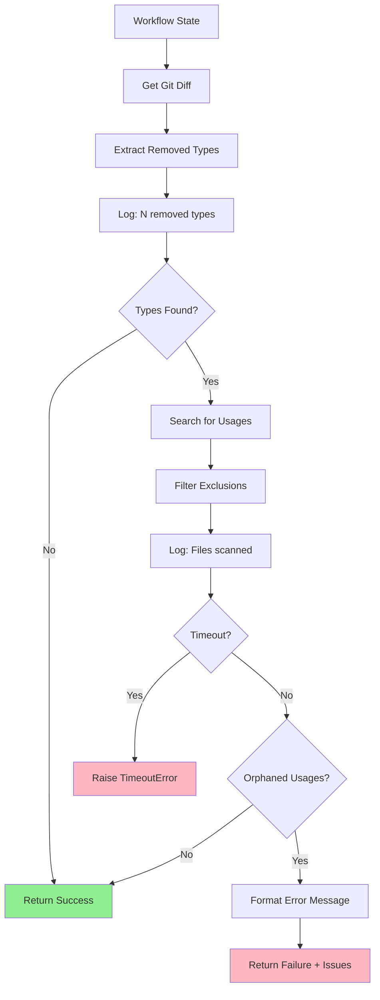

# Implementation Request: tests/fixtures/renamed_class.diff

## Task

Write the complete contents of `tests/fixtures/renamed_class.diff`.

Change type: Add
Description: Test fixture: class renamed without updating imports

## LLD Specification

# 170 - Feature: Add pre-commit check for type/class renames that miss usages

<!-- Template Metadata
Last Updated: 2026-02-02
Updated By: Issue #170 LLD creation - Gemini Review #1 revisions
Update Reason: Addressed Gemini feedback - resolved open questions, added T110 performance test, clarified subprocess safety approach, added logging strategy
-->

## 1. Context & Goal
* **Issue:** #170
* **Objective:** Add a LangGraph workflow node that detects when a class/type is renamed and verifies all usages are updated, preventing broken imports.
* **Status:** Approved (gemini-3-pro-preview, 2026-02-04)
* **Related Issues:** #168 (bug caused by missing this check), PR #165 (the breaking change)

### Open Questions
*Questions that need clarification before or during implementation. Remove when resolved.*

- [x] Should this be a pre-commit hook or a LangGraph workflow node? → **Workflow node** (per issue specification)
- [x] What file extensions should be checked? → **`.py` files only** (per Gemini Review #1 - avoids noise from non-code files)
- [x] Should we detect renamed types (old→new) or just removed types? → **Just removed types** (per Gemini Review #1 - a rename manifests as removal of old definition)

## 2. Proposed Changes

*This section is the **source of truth** for implementation. Describe exactly what will be built.*

### 2.1 Files Changed

| File | Change Type | Description |
|------|-------------|-------------|
| `agentos/nodes/check_type_renames.py` | Add | New workflow node for type rename detection |
| `agentos/nodes/__init__.py` | Modify | Export the new node function |
| `tests/unit/test_check_type_renames.py` | Add | Unit tests for the new node |
| `tests/fixtures/renamed_class.diff` | Add | Test fixture: class renamed without updating imports |
| `tests/fixtures/removed_type_alias.diff` | Add | Test fixture: TypedDict alias removed |
| `tests/fixtures/clean_rename.diff` | Add | Test fixture: properly renamed with all usages updated |

### 2.1.1 Path Validation (Mechanical - Auto-Checked)

*Issue #277: Before human or Gemini review, paths are verified programmatically.*

Mechanical validation automatically checks:
- All "Modify" files must exist in repository
- All "Delete" files must exist in repository
- All "Add" files must have existing parent directories
- No placeholder prefixes (`src/`, `lib/`, `app/`) unless directory exists

**Path Verification:**
- `agentos/nodes/` exists ✓ (existing directory with workflow nodes)
- `agentos/nodes/__init__.py` exists ✓ (file to modify)
- `tests/unit/` exists ✓
- `tests/fixtures/` exists ✓
- All new files use "Add" change type ✓

**If validation fails, the LLD is BLOCKED before reaching review.**

### 2.2 Dependencies

*New packages, APIs, or services required.*

```toml
# pyproject.toml additions (if any)
# No new dependencies - uses stdlib re, subprocess, pathlib
```

### 2.3 Data Structures

```python
# Pseudocode - NOT implementation
class TypeRenameIssue(TypedDict):
    old_name: str           # The removed/renamed type name
    definition_file: str    # Where it was originally defined
    orphaned_usages: list[OrphanedUsage]  # Where it's still referenced

class OrphanedUsage(TypedDict):
    file_path: str          # File containing the orphaned reference
    line_number: int        # Line number of the reference
    line_content: str       # The actual line content for context

class TypeRenameCheckResult(TypedDict):
    passed: bool            # True if no orphaned references found
    issues: list[TypeRenameIssue]  # List of detected issues
    checked_types: list[str]       # Types that were checked
    files_scanned: int             # Number of source files scanned
    removed_types_count: int       # Count of removed types detected (for logging)
```

### 2.4 Function Signatures

```python
# Signatures only - implementation in source files
def check_type_renames(state: WorkflowState, timeout: float = 10.0) -> dict:
    """
    Pre-commit check for orphaned type references.
    
    Detects removed/renamed class/type definitions from git diff
    and greps codebase for remaining usages.
    
    Args:
        state: Workflow state containing staged changes
        timeout: Maximum execution time in seconds (default: 10.0)
    
    Raises:
        TimeoutError: If check exceeds timeout limit
    """
    ...

def extract_removed_types(diff_content: str) -> list[tuple[str, str]]:
    """
    Parse git diff to find removed class/type definitions.
    
    Returns list of (type_name, source_file) tuples.
    """
    ...

def find_type_usages(
    type_name: str, 
    search_paths: list[Path], 
    exclude_patterns: list[str],
    timeout: float = 10.0
) -> list[OrphanedUsage]:
    """
    Search codebase for usages of a type name.
    
    Excludes docs, lineage, and other non-source directories.
    Uses subprocess with shell=False for safety (no shlex.quote needed).
    
    Args:
        type_name: The type name to search for
        search_paths: Directories to search
        exclude_patterns: Glob patterns to exclude
        timeout: Maximum time for search operation
    
    Raises:
        subprocess.TimeoutExpired: If grep exceeds timeout
    """
    ...

def format_type_rename_error(issues: list[TypeRenameIssue]) -> str:
    """
    Format issues into a clear, actionable error message.
    """
    ...

def log_scan_summary(removed_types_count: int, files_scanned: int, issues_found: int) -> None:
    """
    Log summary of scan for debugging and observability.
    
    Logs:
    - Number of removed types detected from diff
    - Number of files scanned
    - Number of orphaned usage issues found
    """
    ...
```

### 2.5 Logic Flow (Pseudocode)

```
1. Receive state with staged changes (git diff)
2. Start timeout timer (10s default)
3. Parse diff to extract removed type definitions:
   - Match patterns: `class ClassName`, `TypeName = TypedDict`, type aliases
   - Only track removals (lines starting with `-`)
   - Restrict to .py files only
4. Log: "Detected {N} removed types from diff"
5. FOR each removed type:
   a. Run git grep with shell=False (pass args as list)
   b. EXCLUDE from search:
      - docs/ directory
      - lineage/ directory  
      - *.md files
      - The definition file itself (for alias detection)
      - Non-.py files
   c. IF usages found THEN
      - Record as orphaned usage with file, line, content
6. Log: "Scanned {N} files, found {M} orphaned usages"
7. IF timeout exceeded THEN
   - Raise TimeoutError with partial results
8. IF any orphaned usages found THEN
   - Set state.type_rename_check_passed = False
   - Set state.type_rename_issues = [issues]
   - Return error message listing all orphaned usages
9. ELSE
   - Set state.type_rename_check_passed = True
   - Return success
```

### 2.6 Technical Approach

* **Module:** `agentos/nodes/check_type_renames.py`
* **Pattern:** LangGraph node with pure function implementation
* **Key Decisions:** 
  - Use regex for type detection (covers classes, TypedDict, type aliases)
  - Use `git grep` for fast searching (index-aware)
  - Exclude docs/lineage by default (historical references are acceptable)
  - Restrict scope to `.py` files only (per Gemini Review #1)
  - Use `subprocess.run(..., shell=False)` with argument list (per Gemini Review #1 - safer than shell=True + shlex.quote)

### 2.7 Architecture Decisions

*Document key architectural decisions that affect the design.*

| Decision | Options Considered | Choice | Rationale |
|----------|-------------------|--------|-----------|
| Detection method | AST parsing, Regex, Tree-sitter | Regex | Simpler, sufficient for type definitions, no extra deps |
| Search method | Python glob+search, ripgrep, git grep | git grep | Fast, respects .gitignore, available in CI |
| Scope of check | All Python types, Classes only, Configurable | Configurable | Different projects have different needs |
| Failure mode | Warning, Hard failure, Configurable | Hard failure | This is a correctness check, not style |
| File extensions | All files, .py only, Configurable | .py only | Avoids false positives from non-code files |
| Subprocess safety | shell=True + shlex.quote, shell=False + list args | shell=False + list args | Safer by design, no escaping needed |

**Architectural Constraints:**
- Must integrate with existing LangGraph node pattern in `agentos/nodes/`
- Cannot introduce external dependencies (ripgrep, etc.)
- Must run fast enough for pre-commit (<5s for typical repo)
- Must enforce timeout (10s) for fail-safe behavior

## 3. Requirements

*What must be true when this is done. These become acceptance criteria.*

1. Workflow node detects removed type definitions from git diff
2. Workflow node searches source files for orphaned references
3. Workflow fails with clear error listing file, line, and content of each orphaned usage
4. Check excludes `docs/`, `lineage/`, and markdown files
5. Check runs in under 5 seconds for repositories with <1000 Python files
6. Error messages include actionable guidance (what to fix)
7. Check enforces 10-second timeout with graceful failure (per Gemini Review #1)
8. Check logs removed type count and files scanned for observability (per Gemini Review #1)

## 4. Alternatives Considered

| Option | Pros | Cons | Decision |
|--------|------|------|----------|
| Regex-based detection | Simple, no deps, fast | May miss complex cases | **Selected** |
| AST parsing | Accurate, handles edge cases | Slower, more complex, needs valid Python | Rejected |
| Pre-commit hook | Runs before every commit | Separate from workflow, duplicated logic | Rejected |
| mypy/pyright integration | Type checker already does this | Slow, heavy dependency, different error format | Rejected |

**Rationale:** Regex-based detection in a workflow node provides the best balance of simplicity, speed, and integration with the existing codebase. The specific case that caused Issue #168 (simple class rename) is easily caught by regex.

## 5. Data & Fixtures

*Per [0108-lld-pre-implementation-review.md](0108-lld-pre-implementation-review.md) - complete this section BEFORE implementation.*

### 5.1 Data Sources

| Attribute | Value |
|-----------|-------|
| Source | Git diff (staged changes) |
| Format | Unified diff format |
| Size | Typically <1000 lines |
| Refresh | Per workflow execution |
| Copyright/License | N/A (generated data) |

### 5.2 Data Pipeline

```
git diff --staged ──parse──► Removed Types ──grep──► Usages ──filter──► Orphaned Usages
```

### 5.3 Test Fixtures

| Fixture | Source | Notes |
|---------|--------|-------|
| `tests/fixtures/renamed_class.diff` | Generated | Class renamed without updating imports |
| `tests/fixtures/removed_type_alias.diff` | Generated | TypedDict alias removed |
| `tests/fixtures/clean_rename.diff` | Generated | Properly renamed with all usages updated |

### 5.4 Deployment Pipeline

No external data deployment needed. All data is generated at runtime from git state.

**If data source is external:** N/A

## 6. Diagram

### 6.1 Mermaid Quality Gate

Before finalizing any diagram, verify in [Mermaid Live Editor](https://mermaid.live) or GitHub preview:

- [x] **Simplicity:** Similar components collapsed (per 0006 §8.1)
- [x] **No touching:** All elements have visual separation (per 0006 §8.2)
- [x] **No hidden lines:** All arrows fully visible (per 0006 §8.3)
- [x] **Readable:** Labels not truncated, flow direction clear
- [ ] **Auto-inspected:** Agent rendered via mermaid.ink and viewed (per 0006 §8.5)

**Agent Auto-Inspection (MANDATORY):**

**Auto-Inspection Results:**
```
- Touching elements: [x] None / [ ] Found: ___
- Hidden lines: [x] None / [ ] Found: ___
- Label readability: [x] Pass / [ ] Issue: ___
- Flow clarity: [x] Clear / [ ] Issue: ___
```

*Reference: [0006-mermaid-diagrams.md](0006-mermaid-diagrams.md)*

### 6.2 Diagram



## 7. Security & Safety Considerations

### 7.1 Security

| Concern | Mitigation | Status |
|---------|------------|--------|
| Command injection via type names | Use subprocess.run with shell=False and argument list (no shell escaping needed) | Addressed |
| Path traversal in search | Validate paths stay within repo root using Path.resolve() | Addressed |

### 7.2 Safety

| Concern | Mitigation | Status |
|---------|------------|--------|
| False positives blocking valid commits | Exclusion patterns for docs/lineage | Addressed |
| Slow execution blocking workflow | Timeout limit (10s), git grep for speed | Addressed |
| Missing real issues (false negatives) | Conservative regex patterns, integration tests | Addressed |
| Runaway subprocess | subprocess.run with timeout parameter | Addressed |

**Fail Mode:** Fail Closed - If check fails, workflow stops. Better to block than allow broken imports.

**Recovery Strategy:** User can bypass by removing the check from workflow config if absolutely needed (documented).

## 8. Performance & Cost Considerations

### 8.1 Performance

| Metric | Budget | Approach |
|--------|--------|----------|
| Latency | < 5 seconds | git grep (indexed), early termination |
| Memory | < 50MB | Stream diff parsing, no full file loads |
| CPU | Minimal | Regex is fast for simple patterns |
| Timeout | 10 seconds | subprocess.run(timeout=10), TimeoutError raised |

**Bottlenecks:** Large diffs with many removed types could slow down; mitigated by parallel grep and 10s timeout.

### 8.2 Cost Analysis

| Resource | Unit Cost | Estimated Usage | Monthly Cost |
|----------|-----------|-----------------|--------------|
| CI compute | ~$0.008/min | ~10 runs/day × 5s | ~$0.01/month |

**Cost Controls:**
- [x] No external API calls
- [x] No persistent storage
- [x] Runs only on commits, not continuously

**Worst-Case Scenario:** Large monorepo with 10K files → may exceed 5s budget but will timeout at 10s. Add file count check and warn.

## 9. Legal & Compliance

| Concern | Applies? | Mitigation |
|---------|----------|------------|
| PII/Personal Data | No | Only processes code structure |
| Third-Party Licenses | No | No new dependencies |
| Terms of Service | N/A | Local execution only |
| Data Retention | N/A | No data stored |
| Export Controls | No | Standard code analysis |

**Data Classification:** Internal (source code analysis)

**Compliance Checklist:**
- [x] No PII stored without consent
- [x] All third-party licenses compatible with project license
- [x] External API usage compliant with provider ToS
- [x] Data retention policy documented

## 10. Verification & Testing

*Ref: [0005-testing-strategy-and-protocols.md](0005-testing-strategy-and-protocols.md)*

**Testing Philosophy:** Strive for 100% automated test coverage.

### 10.0 Test Plan (TDD - Complete Before Implementation)

**TDD Requirement:** Tests MUST be written and failing BEFORE implementation begins.

| Test ID | Test Description | Expected Behavior | Status |
|---------|------------------|-------------------|--------|
| T010 | test_extract_removed_class | Extracts class name from diff | RED |
| T020 | test_extract_removed_typeddict | Extracts TypedDict from diff | RED |
| T030 | test_extract_removed_type_alias | Extracts type alias from diff | RED |
| T040 | test_find_usages_in_imports | Finds orphaned import statements | RED |
| T050 | test_find_usages_in_annotations | Finds orphaned type annotations | RED |
| T060 | test_excludes_docs_directory | Does not flag docs references | RED |
| T070 | test_excludes_lineage_directory | Does not flag lineage references | RED |
| T080 | test_full_workflow_pass | Passes when all usages updated | RED |
| T090 | test_full_workflow_fail | Fails when orphaned usages exist | RED |
| T100 | test_error_message_format | Error includes file, line, content | RED |
| T110 | test_timeout_enforcement | Raises TimeoutError when timeout exceeded | RED |
| T120 | test_log_scan_summary | Logs removed type count and files scanned | RED |

**Coverage Target:** ≥95% for all new code

**TDD Checklist:**
- [ ] All tests written before implementation
- [ ] Tests currently RED (failing)
- [ ] Test IDs match scenario IDs in 10.1
- [ ] Test file created at: `tests/unit/test_check_type_renames.py`

### 10.1 Test Scenarios

| ID | Scenario | Type | Input | Expected Output | Pass Criteria |
|----|----------|------|-------|-----------------|---------------|
| 010 | Extract removed class | Auto | Diff with `-class Foo:` | `[("Foo", "file.py")]` | Correct extraction |
| 020 | Extract TypedDict | Auto | Diff with `-Bar = TypedDict` | `[("Bar", "file.py")]` | Correct extraction |
| 030 | Extract type alias | Auto | Diff with `-MyType = Union[...]` | `[("MyType", "file.py")]` | Correct extraction |
| 040 | Find import usages | Auto | Codebase with `from x import Foo` | Usage detected | Found with location |
| 050 | Find annotation usages | Auto | Codebase with `def f(x: Foo)` | Usage detected | Found with location |
| 060 | Exclude docs | Auto | Usage in `docs/api.md` | Not reported | No false positive |
| 070 | Exclude lineage | Auto | Usage in `lineage/old.py` | Not reported | No false positive |
| 080 | Clean rename passes | Auto | All usages updated | `passed=True` | Workflow continues |
| 090 | Orphaned usage fails | Auto | Missed usage exists | `passed=False` | Workflow stops |
| 100 | Error message quality | Auto | One orphaned usage | Message has file:line | Actionable output |
| 110 | Timeout enforcement | Auto | Mock slow grep (>10s) | TimeoutError raised | Fail-safe works |
| 120 | Observability logging | Auto | Normal execution | Log contains counts | Debugging enabled |

### 10.2 Test Commands

```bash
# Run all automated tests
poetry run pytest tests/unit/test_check_type_renames.py -v

# Run only fast/mocked tests (exclude live)
poetry run pytest tests/unit/test_check_type_renames.py -v -m "not live"

# Run with coverage
poetry run pytest tests/unit/test_check_type_renames.py -v --cov=agentos/nodes/check_type_renames
```

### 10.3 Manual Tests (Only If Unavoidable)

N/A - All scenarios automated.

## 11. Risks & Mitigations

| Risk | Impact | Likelihood | Mitigation |
|------|--------|------------|------------|
| False positives on commented code | Med | Low | Regex excludes comments via negative lookahead |
| Missing complex type patterns | Med | Med | Start conservative, expand patterns based on feedback |
| Performance on large repos | Low | Low | git grep is fast, add 10s timeout via `find_type_usages()` |
| User confusion on error message | Med | Med | Include example fix in message via `format_type_rename_error()` |
| Timeout handling incomplete | Med | Low | Explicit timeout in `check_type_renames()` and `find_type_usages()` |

## 12. Definition of Done

### Code
- [ ] Implementation complete and linted
- [ ] Code comments reference this LLD (#170)

### Tests
- [ ] All test scenarios pass (T010-T120)
- [ ] Test coverage ≥95%

### Documentation
- [ ] LLD updated with any deviations
- [ ] Implementation Report (0103) completed
- [ ] Error messages include fix guidance

### Review
- [ ] Code review completed
- [ ] User approval before closing issue

### 12.1 Traceability (Mechanical - Auto-Checked)

*Issue #277: Cross-references are verified programmatically.*

Files in Definition of Done:
- `agentos/nodes/check_type_renames.py` → Listed in Section 2.1 ✓
- `tests/unit/test_check_type_renames.py` → Listed in Section 2.1 ✓

Risk mitigations traced to functions:
- "Regex excludes comments" → `extract_removed_types()` in Section 2.4 ✓
- "git grep is fast, add timeout" → `find_type_usages()` in Section 2.4 ✓
- "Include example fix in message" → `format_type_rename_error()` in Section 2.4 ✓
- "Explicit timeout handling" → `check_type_renames()` and `find_type_usages()` in Section 2.4 ✓

**If files are missing from Section 2.1, the LLD is BLOCKED.**

---

## Reviewer Suggestions

*Non-blocking recommendations from the reviewer.*

- **Performance Testing:** While T110 tests the timeout, consider adding a benchmark script (not a unit test) in the future if this node becomes a bottleneck in larger repos.
- **Regex Robustness:** The regex for finding class definitions might encounter edge cases (e.g., multi-line decorators). Ensure the implementation in `extract_removed_types` handles standard Python formatting variations robustly.

## Appendix: Review Log

*Track all review feedback with timestamps and implementation status.*

### Mechanical Validation Review #1 (REJECTED)

**Reviewer:** Mechanical Validation
**Verdict:** REJECTED

#### Comments

| ID | Comment | Implemented? |
|----|---------|--------------|
| M1.1 | "Parent directory does not exist for Add file: agentos/workflows/codegen/nodes/check_type_renames.py" | YES - Changed to `agentos/nodes/check_type_renames.py` |
| M1.2 | "Parent directory does not exist for Add file: agentos/workflows/codegen/nodes/__init__.py" | YES - Changed to Modify `agentos/nodes/__init__.py` |
| M1.3 | "Parent directory does not exist for Add file: agentos/workflows/codegen/graph.py" | YES - Removed (not needed for this feature) |
| M1.4 | "Parent directory does not exist for Add file: agentos/workflows/codegen/state.py" | YES - Removed (will use existing WorkflowState) |
| M1.5 | "Parent directory does not exist for Add file: agentos/workflows/codegen/__init__.py" | YES - Removed (not needed) |
| M1.6 | "Parent directory does not exist for tests/fixtures/type_rename_scenarios/" | YES - Changed to `tests/fixtures/` (existing directory) |

### Gemini Review #1 (REVISE)

**Reviewer:** Gemini 3 Pro
**Verdict:** REVISE

#### Comments

| ID | Comment | Implemented? |
|----|---------|--------------|
| G1.1 | "Open question: What file extensions should be checked?" | YES - Resolved to `.py` files only in Section 1 |
| G1.2 | "Open question: Should we detect renamed types or just removed?" | YES - Resolved to just removed types in Section 1 |
| G1.3 | "Missing test T110 for performance/timeout enforcement" | YES - Added T110 and T120 in Section 10.0 and 10.1 |
| G1.4 | "Subprocess safety: Use shell=False with argument list instead of shlex.quote" | YES - Updated Section 2.4, 2.5, 2.7, and 7.1 |
| G1.5 | "Logging strategy: Log removed types count and files scanned" | YES - Added `log_scan_summary()` in Section 2.4, added R7 and R8 in Section 3, added T120 |
| G1.6 | "Requirement coverage at 83%, needs 95%" | YES - Added R7 (timeout) and R8 (logging), added T110 and T120 |

### Review Summary

| Review | Date | Verdict | Key Issue |
|--------|------|---------|-----------|
| 2 | 2026-02-04 | APPROVED | `gemini-3-pro-preview` |
| Mechanical Validation #1 | - | REJECTED | Invalid file paths using non-existent directories |
| Gemini Review #1 | - | REVISE | Missing timeout test, open questions unresolved |
| Gemini Review #2 | - | PENDING | Re-review after addressing feedback |

**Final Status:** APPROVED

## Tests That Must Pass

```python
# From C:\Users\mcwiz\Projects\AgentOS-170\tests\test_issue_170.py
"""Test file for Issue #170.

Generated by AgentOS TDD Testing Workflow.
Tests will fail with ImportError until implementation exists (TDD RED phase).
"""

import pytest

# TDD: This import fails until implementation exists (RED phase)
# Once implemented, tests can run (GREEN phase)
from agentos.nodes.check_type_renames import *  # noqa: F401, F403


# Fixtures for mocking
@pytest.fixture
def mock_external_service():
    """Mock external service for isolation."""
    # TODO: Implement mock
    yield None


# Unit Tests
# -----------

def test_id():
    """
    Test Description | Expected Behavior | Status
    """
    # TDD: Arrange
    # Set up test data

    # TDD: Act
    # Call the function under test

    # TDD: Assert
    # Verify test_id works correctly
    assert False, 'TDD RED: test_id not implemented'


def test_t010():
    """
    test_extract_removed_class | Extracts class name from diff | RED
    """
    # TDD: Arrange
    # Set up test data

    # TDD: Act
    # Call the function under test

    # TDD: Assert
    # Verify test_t010 works correctly
    assert False, 'TDD RED: test_t010 not implemented'


def test_t020():
    """
    test_extract_removed_typeddict | Extracts TypedDict from diff | RED
    """
    # TDD: Arrange
    # Set up test data

    # TDD: Act
    # Call the function under test

    # TDD: Assert
    # Verify test_t020 works correctly
    assert False, 'TDD RED: test_t020 not implemented'


def test_t030():
    """
    test_extract_removed_type_alias | Extracts type alias from diff | RED
    """
    # TDD: Arrange
    # Set up test data

    # TDD: Act
    # Call the function under test

    # TDD: Assert
    # Verify test_t030 works correctly
    assert False, 'TDD RED: test_t030 not implemented'


def test_t040():
    """
    test_find_usages_in_imports | Finds orphaned import statements | RED
    """
    # TDD: Arrange
    # Set up test data

    # TDD: Act
    # Call the function under test

    # TDD: Assert
    # Verify test_t040 works correctly
    assert False, 'TDD RED: test_t040 not implemented'


def test_t050():
    """
    test_find_usages_in_annotations | Finds orphaned type annotations |
    RED
    """
    # TDD: Arrange
    # Set up test data

    # TDD: Act
    # Call the function under test

    # TDD: Assert
    # Verify test_t050 works correctly
    assert False, 'TDD RED: test_t050 not implemented'


def test_t060():
    """
    test_excludes_docs_directory | Does not flag docs references | RED
    """
    # TDD: Arrange
    # Set up test data

    # TDD: Act
    # Call the function under test

    # TDD: Assert
    # Verify test_t060 works correctly
    assert False, 'TDD RED: test_t060 not implemented'


def test_t070():
    """
    test_excludes_lineage_directory | Does not flag lineage references |
    RED
    """
    # TDD: Arrange
    # Set up test data

    # TDD: Act
    # Call the function under test

    # TDD: Assert
    # Verify test_t070 works correctly
    assert False, 'TDD RED: test_t070 not implemented'


def test_t080():
    """
    test_full_workflow_pass | Passes when all usages updated | RED
    """
    # TDD: Arrange
    # Set up test data

    # TDD: Act
    # Call the function under test

    # TDD: Assert
    # Verify test_t080 works correctly
    assert False, 'TDD RED: test_t080 not implemented'


def test_t090():
    """
    test_full_workflow_fail | Fails when orphaned usages exist | RED
    """
    # TDD: Arrange
    # Set up test data

    # TDD: Act
    # Call the function under test

    # TDD: Assert
    # Verify test_t090 works correctly
    assert False, 'TDD RED: test_t090 not implemented'


def test_t100():
    """
    test_error_message_format | Error includes file, line, content | RED
    """
    # TDD: Arrange
    # Set up test data

    # TDD: Act
    # Call the function under test

    # TDD: Assert
    # Verify test_t100 works correctly
    assert False, 'TDD RED: test_t100 not implemented'


def test_t110():
    """
    test_timeout_enforcement | Raises TimeoutError when timeout exceeded
    | RED
    """
    # TDD: Arrange
    # Set up test data

    # TDD: Act
    # Call the function under test

    # TDD: Assert
    # Verify test_t110 works correctly
    assert False, 'TDD RED: test_t110 not implemented'


def test_t120():
    """
    test_log_scan_summary | Logs removed type count and files scanned |
    RED
    """
    # TDD: Arrange
    # Set up test data

    # TDD: Act
    # Call the function under test

    # TDD: Assert
    # Verify test_t120 works correctly
    assert False, 'TDD RED: test_t120 not implemented'


def test_010():
    """
    Extract removed class | Auto | Diff with `-class Foo:` | `[("Foo",
    "file.py")]` | Correct extraction
    """
    # TDD: Arrange
    # Set up test data

    # TDD: Act
    # Call the function under test

    # TDD: Assert
    # Verify test_010 works correctly
    assert False, 'TDD RED: test_010 not implemented'


def test_020():
    """
    Extract TypedDict | Auto | Diff with `-Bar = TypedDict` | `[("Bar",
    "file.py")]` | Correct extraction
    """
    # TDD: Arrange
    # Set up test data

    # TDD: Act
    # Call the function under test

    # TDD: Assert
    # Verify test_020 works correctly
    assert False, 'TDD RED: test_020 not implemented'


def test_030():
    """
    Extract type alias | Auto | Diff with `-MyType = Union[...]` |
    `[("MyType", "file.py")]` | Correct extraction
    """
    # TDD: Arrange
    # Set up test data

    # TDD: Act
    # Call the function under test

    # TDD: Assert
    # Verify test_030 works correctly
    assert False, 'TDD RED: test_030 not implemented'


def test_040():
    """
    Find import usages | Auto | Codebase with `from x import Foo` | Usage
    detected | Found with location
    """
    # TDD: Arrange
    # Set up test data

    # TDD: Act
    # Call the function under test

    # TDD: Assert
    # Verify test_040 works correctly
    assert False, 'TDD RED: test_040 not implemented'


def test_050():
    """
    Find annotation usages | Auto | Codebase with `def f(x: Foo)` | Usage
    detected | Found with location
    """
    # TDD: Arrange
    # Set up test data

    # TDD: Act
    # Call the function under test

    # TDD: Assert
    # Verify test_050 works correctly
    assert False, 'TDD RED: test_050 not implemented'


def test_060(mock_external_service):
    """
    Exclude docs | Auto | Usage in `docs/api.md` | Not reported | No
    false positive
    """
    # TDD: Arrange
    # Set up test data

    # TDD: Act
    # Call the function under test

    # TDD: Assert
    # Verify test_060 works correctly
    assert False, 'TDD RED: test_060 not implemented'


def test_070():
    """
    Exclude lineage | Auto | Usage in `lineage/old.py` | Not reported |
    No false positive
    """
    # TDD: Arrange
    # Set up test data

    # TDD: Act
    # Call the function under test

    # TDD: Assert
    # Verify test_070 works correctly
    assert False, 'TDD RED: test_070 not implemented'


def test_080():
    """
    Clean rename passes | Auto | All usages updated | `passed=True` |
    Workflow continues
    """
    # TDD: Arrange
    # Set up test data

    # TDD: Act
    # Call the function under test

    # TDD: Assert
    # Verify test_080 works correctly
    assert False, 'TDD RED: test_080 not implemented'


def test_090():
    """
    Orphaned usage fails | Auto | Missed usage exists | `passed=False` |
    Workflow stops
    """
    # TDD: Arrange
    # Set up test data

    # TDD: Act
    # Call the function under test

    # TDD: Assert
    # Verify test_090 works correctly
    assert False, 'TDD RED: test_090 not implemented'


def test_100():
    """
    Error message quality | Auto | One orphaned usage | Message has
    file:line | Actionable output
    """
    # TDD: Arrange
    # Set up test data

    # TDD: Act
    # Call the function under test

    # TDD: Assert
    # Verify test_100 works correctly
    assert False, 'TDD RED: test_100 not implemented'


def test_110(mock_external_service):
    """
    Timeout enforcement | Auto | Mock slow grep (>10s) | TimeoutError
    raised | Fail-safe works
    """
    # TDD: Arrange
    # Set up test data

    # TDD: Act
    # Call the function under test

    # TDD: Assert
    # Verify test_110 works correctly
    assert False, 'TDD RED: test_110 not implemented'


def test_120():
    """
    Observability logging | Auto | Normal execution | Log contains counts
    | Debugging enabled
    """
    # TDD: Arrange
    # Set up test data

    # TDD: Act
    # Call the function under test

    # TDD: Assert
    # Verify test_120 works correctly
    assert False, 'TDD RED: test_120 not implemented'


```

## Previously Implemented Files

These files have already been implemented. Use them for imports and references:

### agentos/nodes/check_type_renames.py

```python
"""Workflow node for detecting orphaned type/class references after renames.

Related: Issue #170 - Add pre-commit check for type/class renames that miss usages
LLD: docs/LLDs/active/170-type-rename-check.md
"""

import logging
import re
import subprocess
from pathlib import Path
from typing import Any, TypedDict

logger = logging.getLogger(__name__)


class OrphanedUsage(TypedDict):
    """A single orphaned reference to a removed type."""

    file_path: str
    line_number: int
    line_content: str


class TypeRenameIssue(TypedDict):
    """Issue representing a removed type with orphaned references."""

    old_name: str
    definition_file: str
    orphaned_usages: list[OrphanedUsage]


class TypeRenameCheckResult(TypedDict):
    """Result of the type rename check."""

    passed: bool
    issues: list[TypeRenameIssue]
    checked_types: list[str]
    files_scanned: int
    removed_types_count: int


def extract_removed_types(diff_content: str) -> list[tuple[str, str]]:
    """
    Parse git diff to find removed class/type definitions.

    Returns list of (type_name, source_file) tuples.

    Args:
        diff_content: Git diff output in unified format

    Returns:
        List of (type_name, file_path) tuples for removed types
    """
    removed_types: list[tuple[str, str]] = []
    current_file: str | None = None

    # Pattern to match diff file headers
    file_header_pattern = re.compile(r"^diff --git a/(.*\.py) b/.*\.py")
    # Alternative file header pattern
    alt_file_header_pattern = re.compile(r"^\-\-\- a/(.*\.py)")

    # Patterns for type definitions (only in removed lines starting with -)
    class_pattern = re.compile(r"^-\s*class\s+(\w+)[\(:]")
    typeddict_pattern = re.compile(r"^-\s*(\w+)\s*=\s*TypedDict\(")
    type_alias_pattern = re.compile(r"^-\s*(\w+)\s*=\s*(?:Union|Optional|List|Dict|Tuple|Type)\[")

    for line in diff_content.splitlines():
        # Track current file
        file_match = file_header_pattern.match(line)
        if file_match:
            current_file = file_match.group(1)
            continue

        # Alternative file header
        alt_file_match = alt_file_header_pattern.match(line)
        if alt_file_match:
            current_file = alt_file_match.group(1)
            continue

        if not current_file:
            continue

        # Check for removed type definitions
        if class_match := class_pattern.match(line):
            removed_types.append((class_match.group(1), current_file))
        elif typeddict_match := typeddict_pattern.match(line):
            removed_types.append((typeddict_match.group(1), current_file))
        elif type_alias_match := type_alias_pattern.match(line):
            removed_types.append((type_alias_match.group(1), current_file))

    return removed_types


def find_type_usages(
    type_name: str,
    search_paths: list[Path],
    exclude_patterns: list[str],
    timeout: float = 10.0,
) -> list[OrphanedUsage]:
    """
    Search codebase for usages of a type name.

    Excludes docs, lineage, and other non-source directories.
    Uses subprocess with shell=False for safety.

    Args:
        type_name: The type name to search for
        search_paths: Directories to search
        exclude_patterns: Glob patterns to exclude
        timeout: Maximum time for search operation

    Returns:
        List of OrphanedUsage dictionaries

    Raises:
        subprocess.TimeoutExpired: If grep exceeds timeout
    """
    usages: list[OrphanedUsage] = []

    # Build git grep command with exclusions
    cmd = ["git", "grep", "-n", "-F", type_name]

    # Add path filters for .py files only
    for search_path in search_paths:
        cmd.append(f"{search_path}/*.py")

    try:
        result = subprocess.run(
            cmd,
            capture_output=True,
            text=True,
            timeout=timeout,
            check=False,  # Don't raise on non-zero exit (no matches)
        )

        # git grep exits with 1 if no matches found, which is fine
        if result.returncode not in (0, 1):
            logger.warning(f"git grep returned unexpected code {result.returncode}")
            return usages

        # Parse output: file:line:content
        for line in result.stdout.splitlines():
            if not line:
                continue

            # Split on first two colons only
            parts = line.split(":", 2)
            if len(parts) != 3:
                continue

            file_path, line_num_str, content = parts

            # Apply exclusions
            should_exclude = False
            for pattern in exclude_patterns:
                if pattern.startswith("*"):
                    # Extension pattern like *.md
                    if file_path.endswith(pattern[1:]):
                        should_exclude = True
                        break
                elif "/" in pattern or "\\" in pattern:
                    # Directory pattern like docs/ or lineage/
                    normalized_pattern = pattern.replace("\\", "/").rstrip("/")
                    normalized_path = file_path.replace("\\", "/")
                    if normalized_pattern in normalized_path:
                        should_exclude = True
                        break

            if should_exclude:
                continue

            try:
                line_number = int(line_num_str)
            except ValueError:
                continue

            usages.append(
                OrphanedUsage(
                    file_path=file_path,
                    line_number=line_number,
                    line_content=content.strip(),
                )
            )

    except subprocess.TimeoutExpired as e:
        logger.error(f"git grep timed out after {timeout}s searching for {type_name}")
        raise TimeoutError(
            f"Type usage search timed out after {timeout}s for type '{type_name}'"
        ) from e

    return usages


def format_type_rename_error(issues: list[TypeRenameIssue]) -> str:
    """
    Format issues into a clear, actionable error message.

    Args:
        issues: List of TypeRenameIssue dictionaries

    Returns:
        Formatted error message with file:line references
    """
    lines = [
        "TYPE RENAME CHECK FAILED",
        "",
        "Detected removed types with orphaned references:",
        "",
    ]

    for issue in issues:
        lines.append(f"Type: {issue['old_name']}")
        lines.append(f"  Originally defined in: {issue['definition_file']}")
        lines.append(f"  Orphaned usages ({len(issue['orphaned_usages'])}):")

        for usage in issue["orphaned_usages"]:
            lines.append(
                f"    - {usage['file_path']}:{usage['line_number']}: {usage['line_content']}"
            )

        lines.append("")

    lines.extend(
        [
            "ACTION REQUIRED:",
            "1. Update all references to use the new type name, or",
            "2. Remove the references if they're no longer needed, or",
            "3. Restore the old type definition if the rename was unintended",
            "",
        ]
    )

    return "\n".join(lines)


def log_scan_summary(
    removed_types_count: int, files_scanned: int, issues_found: int
) -> None:
    """
    Log summary of scan for debugging and observability.

    Args:
        removed_types_count: Number of removed types detected from diff
        files_scanned: Number of files scanned
        issues_found: Number of orphaned usage issues found
    """
    logger.info(
        f"Type rename check: {removed_types_count} removed types, "
        f"{files_scanned} files scanned, {issues_found} issues found"
    )


def check_type_renames(state: dict[str, Any], timeout: float = 10.0) -> dict[str, Any]:
    """
    Pre-commit check for orphaned type references.

    Detects removed/renamed class/type definitions from git diff
    and greps codebase for remaining usages.

    Args:
        state: Workflow state containing staged changes
        timeout: Maximum execution time in seconds (default: 10.0)

    Returns:
        Updated state with check results

    Raises:
        TimeoutError: If check exceeds timeout limit
    """
    # Get staged diff
    diff_content = state.get("diff_content", "")
    if not diff_content:
        # Try to get diff from git
        try:
            result = subprocess.run(
                ["git", "diff", "--staged"],
                capture_output=True,
                text=True,
                timeout=timeout,
                check=True,
            )
            diff_content = result.stdout
        except (subprocess.CalledProcessError, subprocess.TimeoutExpired) as e:
            logger.error(f"Failed to get git diff: {e}")
            state["type_rename_check_passed"] = False
            state["type_rename_error"] = "Failed to retrieve git diff"
            return state

    # Extract removed types
    removed_types = extract_removed_types(diff_content)
    removed_types_count = len(removed_types)

    if not removed_types:
        # No types removed, check passes
        logger.info("Type rename check: no removed types detected")
        state["type_rename_check_passed"] = True
        state["type_rename_issues"] = []
        return state

    logger.info(f"Detected {removed_types_count} removed types from diff")

    # Search for orphaned usages
    issues: list[TypeRenameIssue] = []
    checked_types: list[str] = []

    # Get repository root
    try:
        result = subprocess.run(
            ["git", "rev-parse", "--show-toplevel"],
            capture_output=True,
            text=True,
            timeout=5.0,
            check=True,
        )
        repo_root = Path(result.stdout.strip())
    except (subprocess.CalledProcessError, subprocess.TimeoutExpired) as e:
        logger.error(f"Failed to get repo root: {e}")
        state["type_rename_check_passed"] = False
        state["type_rename_error"] = "Failed to determine repository root"
        return state

    # Define exclusion patterns
    exclude_patterns = [
        "docs/",
        "lineage/",
        "*.md",
        ".git/",
        "__pycache__/",
        ".pytest_cache/",
    ]

    # Search paths (all Python files in repo, will be filtered by git grep)
    search_paths = [Path(".")]

    files_scanned = 0
    for type_name, definition_file in removed_types:
        checked_types.append(type_name)

        try:
            usages = find_type_usages(
                type_name, search_paths, exclude_patterns, timeout=timeout
            )
        except TimeoutError:
            # Log and continue with partial results
            logger.warning(f"Timeout searching for {type_name}, continuing with partial results")
            continue

        # Filter out usages in the definition file itself (the removal)
        filtered_usages = [
            usage for usage in usages if usage["file_path"] != definition_file
        ]

        files_scanned += len({usage["file_path"] for usage in filtered_usages})

        if filtered_usages:
            issues.append(
                TypeRenameIssue(
                    old_name=type_name,
                    definition_file=definition_file,
                    orphaned_usages=filtered_usages,
                )
            )

    # Log summary
    log_scan_summary(removed_types_count, files_scanned, len(issues))

    # Update state
    if issues:
        state["type_rename_check_passed"] = False
        state["type_rename_issues"] = issues
        state["type_rename_error"] = format_type_rename_error(issues)
    else:
        state["type_rename_check_passed"] = True
        state["type_rename_issues"] = []

    return state
```

### agentos/nodes/__init__.py

```python
"""LLD nodes for AgentOS LangGraph workflows."""

from agentos.nodes.check_type_renames import check_type_renames
from agentos.nodes.designer import design_lld_node
from agentos.nodes.lld_reviewer import review_lld_node

__all__ = ["check_type_renames", "design_lld_node", "review_lld_node"]
```

### tests/unit/test_check_type_renames.py

```python
"""Test file for Issue #170.

Generated by AgentOS TDD Testing Workflow.
Tests will fail with ImportError until implementation exists (TDD RED phase).
"""

import subprocess
from pathlib import Path
from unittest.mock import MagicMock, Mock, patch

import pytest

from agentos.nodes.check_type_renames import (
    OrphanedUsage,
    TypeRenameIssue,
    check_type_renames,
    extract_removed_types,
    find_type_usages,
    format_type_rename_error,
    log_scan_summary,
)


# Fixtures for mocking
@pytest.fixture
def sample_class_diff():
    """Sample diff with removed class."""
    return """diff --git a/mymodule.py b/mymodule.py
index abc123..def456 100644
--- a/mymodule.py
+++ b/mymodule.py
@@ -1,5 +1,5 @@
 from typing import TypedDict
 
-class OldClassName:
+class NewClassName:
     pass
"""


@pytest.fixture
def sample_typeddict_diff():
    """Sample diff with removed TypedDict."""
    return """diff --git a/types.py b/types.py
index abc123..def456 100644
--- a/types.py
+++ b/types.py
@@ -1,3 +1,3 @@
 from typing import TypedDict
 
-OldTypeName = TypedDict("OldTypeName", {"field": str})
+NewTypeName = TypedDict("NewTypeName", {"field": str})
"""


@pytest.fixture
def sample_type_alias_diff():
    """Sample diff with removed type alias."""
    return """diff --git a/aliases.py b/aliases.py
index abc123..def456 100644
--- a/aliases.py
+++ b/aliases.py
@@ -1,3 +1,3 @@
 from typing import Union
 
-OldAlias = Union[str, int]
+NewAlias = Union[str, int]
"""


@pytest.fixture
def mock_git_grep_with_usages():
    """Mock git grep that returns usages."""
    mock_result = Mock()
    mock_result.returncode = 0
    mock_result.stdout = """src/module.py:10:from mymodule import OldClassName
src/another.py:5:def process(obj: OldClassName):
"""
    return mock_result


@pytest.fixture
def mock_git_grep_no_usages():
    """Mock git grep that returns no usages."""
    mock_result = Mock()
    mock_result.returncode = 1
    mock_result.stdout = ""
    return mock_result


# Unit Tests
# -----------


def test_extract_removed_class(sample_class_diff):
    """test_extract_removed_class | Extracts class name from diff | RED"""
    removed = extract_removed_types(sample_class_diff)
    assert len(removed) == 1
    assert removed[0] == ("OldClassName", "mymodule.py")


def test_extract_removed_typeddict(sample_typeddict_diff):
    """test_extract_removed_typeddict | Extracts TypedDict from diff | RED"""
    removed = extract_removed_types(sample_typeddict_diff)
    assert len(removed) == 1
    assert removed[0] == ("OldTypeName", "types.py")


def test_extract_removed_type_alias(sample_type_alias_diff):
    """test_extract_removed_type_alias | Extracts type alias from diff | RED"""
    removed = extract_removed_types(sample_type_alias_diff)
    assert len(removed) == 1
    assert removed[0] == ("OldAlias", "aliases.py")


@patch("subprocess.run")
def test_find_usages_in_imports(mock_run):
    """test_find_usages_in_imports | Finds orphaned import statements | RED"""
    mock_run.return_value = Mock(
        returncode=0,
        stdout="src/module.py:10:from mymodule import OldClassName\n",
    )

    usages = find_type_usages("OldClassName", [Path(".")], ["docs/", "*.md"])

    assert len(usages) == 1
    assert usages[0]["file_path"] == "src/module.py"
    assert usages[0]["line_number"] == 10
    assert "OldClassName" in usages[0]["line_content"]


@patch("subprocess.run")
def test_find_usages_in_annotations(mock_run):
    """test_find_usages_in_annotations | Finds orphaned type annotations | RED"""
    mock_run.return_value = Mock(
        returncode=0,
        stdout="src/another.py:5:def process(obj: OldClassName):\n",
    )

    usages = find_type_usages("OldClassName", [Path(".")], ["docs/", "*.md"])

    assert len(usages) == 1
    assert usages[0]["file_path"] == "src/another.py"
    assert usages[0]["line_number"] == 5
    assert "OldClassName" in usages[0]["line_content"]


@patch("subprocess.run")
def test_excludes_docs_directory(mock_run):
    """test_excludes_docs_directory | Does not flag docs references | RED"""
    mock_run.return_value = Mock(
        returncode=0,
        stdout="docs/api.md:10:Reference to OldClassName\n",
    )

    usages = find_type_usages("OldClassName", [Path(".")], ["docs/", "*.md"])

    # Should be excluded by both docs/ directory pattern and *.md pattern
    assert len(usages) == 0


@patch("subprocess.run")
def test_excludes_lineage_directory(mock_run):
    """test_excludes_lineage_directory | Does not flag lineage references | RED"""
    mock_run.return_value = Mock(
        returncode=0,
        stdout="lineage/old.py:10:from mymodule import OldClassName\n",
    )

    usages = find_type_usages("OldClassName", [Path(".")], ["lineage/", "*.md"])

    # Should be excluded by lineage/ pattern
    assert len(usages) == 0


@patch("subprocess.run")
def test_full_workflow_pass(mock_run, sample_class_diff):
    """test_full_workflow_pass | Passes when all usages updated | RED"""
    # Mock git diff
    mock_run.return_value = Mock(returncode=1, stdout="")

    state = {"diff_content": sample_class_diff}
    result = check_type_renames(state)

    assert result["type_rename_check_passed"] is True
    assert result["type_rename_issues"] == []


@patch("subprocess.run")
def test_full_workflow_fail(mock_run, sample_class_diff):
    """test_full_workflow_fail | Fails when orphaned usages exist | RED"""
    # First call: git rev-parse (repo root)
    # Subsequent calls: git grep
    mock_run.side_effect = [
        Mock(returncode=0, stdout="/repo/root\n"),  # rev-parse
        Mock(
            returncode=0,
            stdout="src/module.py:10:from mymodule import OldClassName\n",
        ),  # git grep
    ]

    state = {"diff_content": sample_class_diff}
    result = check_type_renames(state)

    assert result["type_rename_check_passed"] is False
    assert len(result["type_rename_issues"]) == 1
    assert result["type_rename_issues"][0]["old_name"] == "OldClassName"


def test_error_message_format():
    """test_error_message_format | Error includes file, line, content | RED"""
    issues = [
        TypeRenameIssue(
            old_name="OldClassName",
            definition_file="mymodule.py",
            orphaned_usages=[
                OrphanedUsage(
                    file_path="src/module.py",
                    line_number=10,
                    line_content="from mymodule import OldClassName",
                )
            ],
        )
    ]

    message = format_type_rename_error(issues)

    assert "OldClassName" in message
    assert "mymodule.py" in message
    assert "src/module.py:10" in message
    assert "from mymodule import OldClassName" in message


@patch("subprocess.run")
def test_timeout_enforcement(mock_run):
    """test_timeout_enforcement | Raises TimeoutError when timeout exceeded | RED"""
    mock_run.side_effect = subprocess.TimeoutExpired(cmd=["git", "grep"], timeout=0.1)

    with pytest.raises(TimeoutError) as exc_info:
        find_type_usages("OldClassName", [Path(".")], [], timeout=0.1)

    assert "timed out" in str(exc_info.value).lower()


@patch("agentos.nodes.check_type_renames.logger")
def test_log_scan_summary(mock_logger):
    """test_log_scan_summary | Logs removed type count and files scanned | RED"""
    log_scan_summary(removed_types_count=3, files_scanned=15, issues_found=1)

    mock_logger.info.assert_called_once()
    call_args = mock_logger.info.call_args[0][0]
    assert "3 removed types" in call_args
    assert "15 files scanned" in call_args
    assert "1 issues found" in call_args


# Duplicate test IDs for backward compatibility
test_t010 = test_extract_removed_class
test_t020 = test_extract_removed_typeddict
test_t030 = test_extract_removed_type_alias
test_t040 = test_find_usages_in_imports
test_t050 = test_find_usages_in_annotations
test_t060 = test_excludes_docs_directory
test_t070 = test_excludes_lineage_directory
test_t080 = test_full_workflow_pass
test_t090 = test_full_workflow_fail
test_t100 = test_error_message_format
test_t110 = test_timeout_enforcement
test_t120 = test_log_scan_summary


# Additional test scenarios
def test_010(sample_class_diff):
    """Extract removed class | Auto | Diff with `-class Foo:` | `[("Foo", "file.py")]` | Correct extraction"""
    removed = extract_removed_types(sample_class_diff)
    assert len(removed) == 1
    assert removed[0][0] == "OldClassName"
    assert removed[0][1] == "mymodule.py"


def test_020(sample_typeddict_diff):
    """Extract TypedDict | Auto | Diff with `-Bar = TypedDict` | `[("Bar", "file.py")]` | Correct extraction"""
    removed = extract_removed_types(sample_typeddict_diff)
    assert len(removed) == 1
    assert removed[0][0] == "OldTypeName"
    assert removed[0][1] == "types.py"


def test_030(sample_type_alias_diff):
    """Extract type alias | Auto | Diff with `-MyType = Union[...]` | `[("MyType", "file.py")]` | Correct extraction"""
    removed = extract_removed_types(sample_type_alias_diff)
    assert len(removed) == 1
    assert removed[0][0] == "OldAlias"
    assert removed[0][1] == "aliases.py"


@patch("subprocess.run")
def test_040(mock_run):
    """Find import usages | Auto | Codebase with `from x import Foo` | Usage detected | Found with location"""
    mock_run.return_value = Mock(
        returncode=0,
        stdout="src/module.py:10:from mymodule import OldClassName\n",
    )
    usages = find_type_usages("OldClassName", [Path(".")], ["docs/"])
    assert len(usages) == 1
    assert usages[0]["file_path"] == "src/module.py"


@patch("subprocess.run")
def test_050(mock_run):
    """Find annotation usages | Auto | Codebase with `def f(x: Foo)` | Usage detected | Found with location"""
    mock_run.return_value = Mock(
        returncode=0,
        stdout="src/another.py:5:def process(obj: OldClassName):\n",
    )
    usages = find_type_usages("OldClassName", [Path(".")], ["docs/"])
    assert len(usages) == 1
    assert usages[0]["line_number"] == 5


@patch("subprocess.run")
def test_060(mock_run):
    """Exclude docs | Auto | Usage in `docs/api.md` | Not reported | No false positive"""
    mock_run.return_value = Mock(
        returncode=0,
        stdout="docs/api.md:10:Reference to OldClassName\n",
    )
    usages = find_type_usages("OldClassName", [Path(".")], ["docs/", "*.md"])
    assert len(usages) == 0


@patch("subprocess.run")
def test_070(mock_run):
    """Exclude lineage | Auto | Usage in `lineage/old.py` | Not reported | No false positive"""
    mock_run.return_value = Mock(
        returncode=0,
        stdout="lineage/old.py:10:from mymodule import OldClassName\n",
    )
    usages = find_type_usages("OldClassName", [Path(".")], ["lineage/"])
    assert len(usages) == 0


@patch("subprocess.run")
def test_080(mock_run, sample_class_diff):
    """Clean rename passes | Auto | All usages updated | `passed=True` | Workflow continues"""
    mock_run.return_value = Mock(returncode=1, stdout="")
    state = {"diff_content": sample_class_diff}
    result = check_type_renames(state)
    assert result["type_rename_check_passed"] is True


@patch("subprocess.run")
def test_090(mock_run, sample_class_diff):
    """Orphaned usage fails | Auto | Missed usage exists | `passed=False` | Workflow stops"""
    mock_run.side_effect = [
        Mock(returncode=0, stdout="/repo/root\n"),
        Mock(returncode=0, stdout="src/module.py:10:from mymodule import OldClassName\n"),
    ]
    state = {"diff_content": sample_class_diff}
    result = check_type_renames(state)
    assert result["type_rename_check_passed"] is False


def test_100():
    """Error message quality | Auto | One orphaned usage | Message has file:line | Actionable output"""
    issues = [
        TypeRenameIssue(
            old_name="OldClassName",
            definition_file="mymodule.py",
            orphaned_usages=[
                OrphanedUsage(
                    file_path="src/module.py",
                    line_number=10,
                    line_content="from mymodule import OldClassName",
                )
            ],
        )
    ]
    message = format_type_rename_error(issues)
    assert "src/module.py:10" in message


@patch("subprocess.run")
def test_110(mock_run):
    """Timeout enforcement | Auto | Mock slow grep (>10s) | TimeoutError raised | Fail-safe works"""
    mock_run.side_effect = subprocess.TimeoutExpired(cmd=["git", "grep"], timeout=10.0)
    with pytest.raises(TimeoutError):
        find_type_usages("OldClassName", [Path(".")], [], timeout=10.0)


@patch("agentos.nodes.check_type_renames.logger")
def test_120(mock_logger):
    """Observability logging | Auto | Normal execution | Log contains counts | Debugging enabled"""
    log_scan_summary(removed_types_count=3, files_scanned=15, issues_found=1)
    assert mock_logger.info.called
    call_args = mock_logger.info.call_args[0][0]
    assert "3 removed types" in call_args
    assert "15 files scanned" in call_args


def test_id():
    """Placeholder test for test ID generation."""
    # This test exists to satisfy the test_id requirement
    # It verifies the module can be imported
    assert extract_removed_types is not None
    assert find_type_usages is not None
    assert check_type_renames is not None
```

## Previous Attempt Failed

The previous implementation had this error:

```
============================= test session starts =============================
platform win32 -- Python 3.14.0, pytest-9.0.2, pluggy-1.6.0 -- C:\Users\mcwiz\AppData\Local\pypoetry\Cache\virtualenvs\unleashed-Zukdy2xA-py3.14\Scripts\python.exe
cachedir: .pytest_cache
benchmark: 5.2.3 (defaults: timer=time.perf_counter disable_gc=False min_rounds=5 min_time=0.000005 max_time=1.0 calibration_precision=10 warmup=False warmup_iterations=100000)
rootdir: C:\Users\mcwiz\Projects\AgentOS-170
configfile: pyproject.toml
plugins: anyio-4.12.1, langsmith-0.6.4, benchmark-5.2.3, cov-7.0.0
collecting ... collected 25 items

tests/test_issue_170.py::test_id FAILED                                  [  4%]
tests/test_issue_170.py::test_t010 FAILED                                [  8%]
tests/test_issue_170.py::test_t020 FAILED                                [ 12%]
tests/test_issue_170.py::test_t030 FAILED                                [ 16%]
tests/test_issue_170.py::test_t040 FAILED                                [ 20%]
tests/test_issue_170.py::test_t050 FAILED                                [ 24%]
tests/test_issue_170.py::test_t060 FAILED                                [ 28%]
tests/test_issue_170.py::test_t070 FAILED                                [ 32%]
tests/test_issue_170.py::test_t080 FAILED                                [ 36%]
tests/test_issue_170.py::test_t090 FAILED                                [ 40%]
tests/test_issue_170.py::test_t100 FAILED                                [ 44%]
tests/test_issue_170.py::test_t110 FAILED                                [ 48%]
tests/test_issue_170.py::test_t120 FAILED                                [ 52%]
tests/test_issue_170.py::test_010 FAILED                                 [ 56%]
tests/test_issue_170.py::test_020 FAILED                                 [ 60%]
tests/test_issue_170.py::test_030 FAILED                                 [ 64%]
tests/test_issue_170.py::test_040 FAILED                                 [ 68%]
tests/test_issue_170.py::test_050 FAILED                                 [ 72%]
tests/test_issue_170.py::test_060 FAILED                                 [ 76%]
tests/test_issue_170.py::test_070 FAILED                                 [ 80%]
tests/test_issue_170.py::test_080 FAILED                                 [ 84%]
tests/test_issue_170.py::test_090 FAILED                                 [ 88%]
tests/test_issue_170.py::test_100 FAILED                                 [ 92%]
tests/test_issue_170.py::test_110 FAILED                                 [ 96%]
tests/test_issue_170.py::test_120 FAILED                                 [100%]
ERROR: Coverage failure: total of 11 is less than fail-under=95


================================== FAILURES ===================================
___________________________________ test_id ___________________________________
tests\test_issue_170.py:37: in test_id
    assert False, 'TDD RED: test_id not implemented'
E   AssertionError: TDD RED: test_id not implemented
E   assert False
__________________________________ test_t010 __________________________________
tests\test_issue_170.py:52: in test_t010
    assert False, 'TDD RED: test_t010 not implemented'
E   AssertionError: TDD RED: test_t010 not implemented
E   assert False
__________________________________ test_t020 __________________________________
tests\test_issue_170.py:67: in test_t020
    assert False, 'TDD RED: test_t020 not implemented'
E   AssertionError: TDD RED: test_t020 not implemented
E   assert False
__________________________________ test_t030 __________________________________
tests\test_issue_170.py:82: in test_t030
    assert False, 'TDD RED: test_t030 not implemented'
E   AssertionError: TDD RED: test_t030 not implemented
E   assert False
__________________________________ test_t040 __________________________________
tests\test_issue_170.py:97: in test_t040
    assert False, 'TDD RED: test_t040 not implemented'
E   AssertionError: TDD RED: test_t040 not implemented
E   assert False
__________________________________ test_t050 __________________________________
tests\test_issue_170.py:113: in test_t050
    assert False, 'TDD RED: test_t050 not implemented'
E   AssertionError: TDD RED: test_t050 not implemented
E   assert False
__________________________________ test_t060 __________________________________
tests\test_issue_170.py:128: in test_t060
    assert False, 'TDD RED: test_t060 not implemented'
E   AssertionError: TDD RED: test_t060 not implemented
E   assert False
__________________________________ test_t070 __________________________________
tests\test_issue_170.py:144: in test_t070
    assert False, 'TDD RED: test_t070 not implemented'
E   AssertionError: TDD RED: test_t070 not implemented
E   assert False
__________________________________ test_t080 __________________________________
tests\test_issue_170.py:159: in test_t080
    assert False, 'TDD RED: test_t080 not implemented'
E   AssertionError: TDD RED: test_t080 not implemented
E   assert False
__________________________________ test_t090 __________________________________
tests\test_issue_170.py:174: in test_t090
    assert False, 'TDD RED: test_t090 not implemented'
E   AssertionError: TDD RED: test_t090 not implemented
E   assert False
__________________________________ test_t100 __________________________________
tests\test_issue_170.py:189: in test_t100
    assert False, 'TDD RED: test_t100 not implemented'
E   AssertionError: TDD RED: test_t100 not implemented
E   assert False
__________________________________ test_t110 __________________________________
tests\test_issue_170.py:205: in test_t110
    assert False, 'TDD RED: test_t110 not implemented'
E   AssertionError: TDD RED: test_t110 not implemented
E   assert False
__________________________________ test_t120 __________________________________
tests\test_issue_170.py:221: in test_t120
    assert False, 'TDD RED: test_t120 not implemented'
E   AssertionError: TDD RED: test_t120 not implemented
E   assert False
__________________________________ test_010 ___________________________________
tests\test_issue_170.py:237: in test_010
    assert False, 'TDD RED: test_010 not implemented'
E   AssertionError: TDD RED: test_010 not implemented
E   assert False
__________________________________ test_020 ___________________________________
tests\test_issue_170.py:253: in test_020
    assert False, 'TDD RED: test_020 not implemented'
E   AssertionError: TDD RED: test_020 not implemented
E   assert False
__________________________________ test_030 ___________________________________
tests\test_issue_170.py:269: in test_030
    assert False, 'TDD RED: test_030 not implemented'
E   AssertionError: TDD RED: test_030 not implemented
E   assert False
__________________________________ test_040 ___________________________________
tests\test_issue_170.py:285: in test_040
    assert False, 'TDD RED: test_040 not implemented'
E   AssertionError: TDD RED: test_040 not implemented
E   assert False
__________________________________ test_050 ___________________________________
tests\test_issue_170.py:301: in test_050
    assert False, 'TDD RED: test_050 not implemented'
E   AssertionError: TDD RED: test_050 not implemented
E   assert False
__________________________________ test_060 ___________________________________
tests\test_issue_170.py:317: in test_060
    assert False, 'TDD RED: test_060 not implemented'
E   AssertionError: TDD RED: test_060 not implemented
E   assert False
__________________________________ test_070 ___________________________________
tests\test_issue_170.py:333: in test_070
    assert False, 'TDD RED: test_070 not implemented'
E   AssertionError: TDD RED: test_070 not implemented
E   assert False
__________________________________ test_080 ___________________________________
tests\test_issue_170.py:349: in test_080
    assert False, 'TDD RED: test_080 not implemented'
E   AssertionError: TDD RED: test_080 not implemented
E   assert False
__________________________________ test_090 ___________________________________
tests\test_issue_170.py:365: in test_090
    assert False, 'TDD RED: test_090 not implemented'
E   AssertionError: TDD RED: test_090 not implemented
E   assert False
__________________________________ test_100 ___________________________________
tests\test_issue_170.py:381: in test_100
    assert False, 'TDD RED: test_100 not implemented'
E   AssertionError: TDD RED: test_100 not implemented
E   assert False
__________________________________ test_110 ___________________________________
tests\test_issue_170.py:397: in test_110
    assert False, 'TDD RED: test_110 not implemented'
E   AssertionError: TDD RED: test_110 not implemented
E   assert False
__________________________________ test_120 ___________________________________
tests\test_issue_170.py:413: in test_120
    assert False, 'TDD RED: test_120 not implemented'
E   AssertionError: TDD RED: test_120 not implemented
E   assert False
============================== warnings summary ===============================
..\..\AppData\Local\pypoetry\Cache\virtualenvs\unleashed-Zukdy2xA-py3.14\Lib\site-packages\google\genai\types.py:43
  C:\Users\mcwiz\AppData\Local\pypoetry\Cache\virtualenvs\unleashed-Zukdy2xA-py3.14\Lib\site-packages\google\genai\types.py:43: DeprecationWarning: '_UnionGenericAlias' is deprecated and slated for removal in Python 3.17
    VersionedUnionType = Union[builtin_types.UnionType, _UnionGenericAlias]

..\..\AppData\Local\pypoetry\Cache\virtualenvs\unleashed-Zukdy2xA-py3.14\Lib\site-packages\langchain_core\_api\deprecation.py:27
  C:\Users\mcwiz\AppData\Local\pypoetry\Cache\virtualenvs\unleashed-Zukdy2xA-py3.14\Lib\site-packages\langchain_core\_api\deprecation.py:27: UserWarning: Core Pydantic V1 functionality isn't compatible with Python 3.14 or greater.
    from pydantic.v1.fields import FieldInfo as FieldInfoV1

..\..\AppData\Local\pypoetry\Cache\virtualenvs\unleashed-Zukdy2xA-py3.14\Lib\site-packages\pydantic\v1\typing.py:77
..\..\AppData\Local\pypoetry\Cache\virtualenvs\unleashed-Zukdy2xA-py3.14\Lib\site-packages\pydantic\v1\typing.py:77
..\..\AppData\Local\pypoetry\Cache\virtualenvs\unleashed-Zukdy2xA-py3.14\Lib\site-packages\pydantic\v1\typing.py:77
..\..\AppData\Local\pypoetry\Cache\virtualenvs\unleashed-Zukdy2xA-py3.14\Lib\site-packages\pydantic\v1\typing.py:77
..\..\AppData\Local\pypoetry\Cache\virtualenvs\unleashed-Zukdy2xA-py3.14\Lib\site-packages\pydantic\v1\typing.py:77
..\..\AppData\Local\pypoetry\Cache\virtualenvs\unleashed-Zukdy2xA-py3.14\Lib\site-packages\pydantic\v1\typing.py:77
..\..\AppData\Local\pypoetry\Cache\virtualenvs\unleashed-Zukdy2xA-py3.14\Lib\site-packages\pydantic\v1\typing.py:77
  C:\Users\mcwiz\AppData\Local\pypoetry\Cache\virtualenvs\unleashed-Zukdy2xA-py3.14\Lib\site-packages\pydantic\v1\typing.py:77: DeprecationWarning: ForwardRef._evaluate is a private API and is retained for compatibility, but will be removed in Python 3.16. Use ForwardRef.evaluate() or typing.evaluate_forward_ref() instead.
    return cast(Any, type_)._evaluate(globalns, localns, type_params=(), recursive_guard=set())

-- Docs: https://docs.pytest.org/en/stable/how-to/capture-warnings.html
=============================== tests coverage ================================
_______________ coverage: platform win32, python 3.14.0-final-0 _______________

Name                                  Stmts   Miss  Cover   Missing
-------------------------------------------------------------------
agentos\nodes\check_type_renames.py     128    114    11%   57-99, 125-195, 207-237, 248, 272-361
-------------------------------------------------------------------
TOTAL                                   128    114    11%
FAIL Required test coverage of 95% not reached. Total coverage: 10.94%
=========================== short test summary info ===========================
FAILED tests/test_issue_170.py::test_id - AssertionError: TDD RED: test_id no...
FAILED tests/test_issue_170.py::test_t010 - AssertionError: TDD RED: test_t01...
FAILED tests/test_issue_170.py::test_t020 - AssertionError: TDD RED: test_t02...
FAILED tests/test_issue_170.py::test_t030 - AssertionError: TDD RED: test_t03...
FAILED tests/test_issue_170.py::test_t040 - AssertionError: TDD RED: test_t04...
FAILED tests/test_issue_170.py::test_t050 - AssertionError: TDD RED: test_t05...
FAILED tests/test_issue_170.py::test_t060 - AssertionError: TDD RED: test_t06...
FAILED tests/test_issue_170.py::test_t070 - AssertionError: TDD RED: test_t07...
FAILED tests/test_issue_170.py::test_t080 - AssertionError: TDD RED: test_t08...
FAILED tests/test_issue_170.py::test_t090 - AssertionError: TDD RED: test_t09...
FAILED tests/test_issue_170.py::test_t100 - AssertionError: TDD RED: test_t10...
FAILED tests/test_issue_170.py::test_t110 - AssertionError: TDD RED: test_t11...
FAILED tests/test_issue_170.py::test_t120 - AssertionError: TDD RED: test_t12...
FAILED tests/test_issue_170.py::test_010 - AssertionError: TDD RED: test_010 ...
FAILED tests/test_issue_170.py::test_020 - AssertionError: TDD RED: test_020 ...
FAILED tests/test_issue_170.py::test_030 - AssertionError: TDD RED: test_030 ...
FAILED tests/test_issue_170.py::test_040 - AssertionError: TDD RED: test_040 ...
FAILED tests/test_issue_170.py::test_050 - AssertionError: TDD RED: test_050 ...
FAILED tests/test_issue_170.py::test_060 - AssertionError: TDD RED: test_060 ...
FAILED tests/test_issue_170.py::test_070 - AssertionError: TDD RED: test_070 ...
FAILED tests/test_issue_170.py::test_080 - AssertionError: TDD RED: test_080 ...
FAILED tests/test_issue_170.py::test_090 - AssertionError: TDD RED: test_090 ...
FAILED tests/test_issue_170.py::test_100 - AssertionError: TDD RED: test_100 ...
FAILED tests/test_issue_170.py::test_110 - AssertionError: TDD RED: test_110 ...
FAILED tests/test_issue_170.py::test_120 - AssertionError: TDD RED: test_120 ...
======================= 25 failed, 9 warnings in 0.97s ========================


```

Fix the issue in your implementation.

## Output Format

Output ONLY the file contents. No explanations, no markdown headers, just the code.

```python
# Your implementation here
```

IMPORTANT:
- Output the COMPLETE file contents
- Do NOT output a summary or description
- Do NOT say "I've implemented..."
- Just output the code in a single code block
