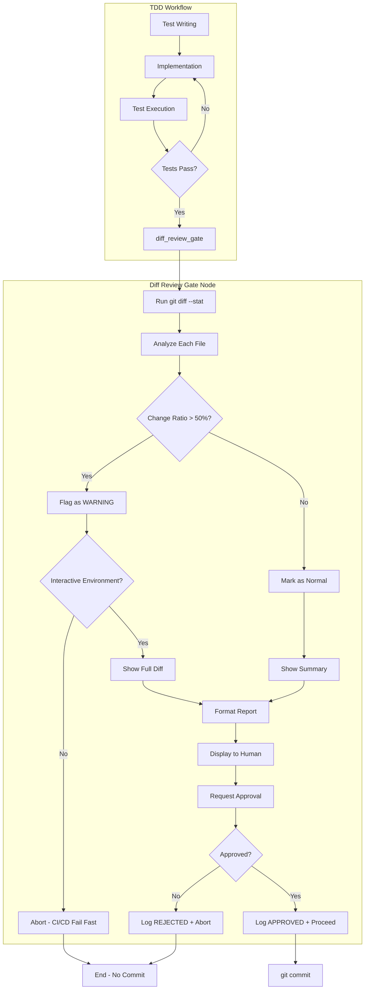

# 171 - Feature: Add Mandatory Diff Review Gate Before Commit in TDD Workflow

<!-- Template Metadata
Last Updated: 2025-01-XX
Updated By: LLD revision for Issue #171
Update Reason: Address Gemini Review #1 feedback - CI/CD behavior, test coverage, logging
-->

## 1. Context & Goal
* **Issue:** #171
* **Objective:** Add a mandatory diff review workflow node that requires explicit human approval before any commit, preventing accidental deletion of critical code.
* **Status:** Draft
* **Related Issues:** #168 (bug caused by missing this gate), PR #165 (the breaking change)

### Open Questions

*All questions resolved per Gemini Review #1.*

- [x] ~~Should the 50% threshold be configurable via environment variable or config file?~~ **RESOLVED: No.** Keep it hardcoded as a constant for this iteration. Introducing configuration early adds complexity and surface area for bugs. We can parameterize it later if users complain about false positives.
- [x] ~~What's the appropriate behavior when running in CI/CD pipelines where human interaction isn't available?~~ **RESOLVED: Fail Fast.** The node should detect if the environment is non-interactive (no TTY). If review is required and no TTY is detected, the workflow MUST abort immediately with a specific error code, rather than hanging indefinitely waiting for input.
- [x] ~~Should we track historical approval decisions for audit purposes?~~ **RESOLVED: Yes (Logging).** While the proposed `DiffReviewState` tracks the decision in memory, the application standard logger should emit a structured log event (INFO level) containing: timestamp, decision (APPROVED/REJECTED), and the flagged file list.

## 2. Proposed Changes

*This section is the **source of truth** for implementation. Describe exactly what will be built.*

### 2.1 Files Changed

| File | Change Type | Description |
|------|-------------|-------------|
| `src/codegen_lab/workflows/nodes/diff_review_gate.py` | Add | New node implementing the diff review gate logic |
| `src/codegen_lab/workflows/tdd_workflow.py` | Modify | Integrate diff_review_gate node before commit step |
| `src/codegen_lab/workflows/state.py` | Modify | Add diff review state fields to WorkflowState |
| `src/codegen_lab/utils/git_utils.py` | Add | Git diff analysis utilities |
| `tests/unit/test_diff_review_gate.py` | Add | Unit tests for diff review gate |
| `tests/integration/test_tdd_workflow_diff_gate.py` | Add | Integration tests for workflow with diff gate |

### 2.2 Dependencies

```toml
# pyproject.toml additions (if any)
# No new dependencies required - uses existing git subprocess calls
```

### 2.3 Data Structures

```python
# Pseudocode - NOT implementation
class DiffAnalysis(TypedDict):
    file_path: str                  # Path to changed file
    lines_added: int                # Number of lines added
    lines_deleted: int              # Number of lines deleted
    original_lines: int             # Original file line count
    change_ratio: float             # Percentage of file changed (0.0-1.0)
    change_type: Literal["MODIFIED", "REPLACED", "NEW", "DELETED"]
    requires_review: bool           # True if change_ratio > threshold

class DiffReviewState(TypedDict):
    diff_analyses: list[DiffAnalysis]     # Analysis for each changed file
    flagged_files: list[str]              # Files requiring explicit review
    human_approved: bool                   # Whether human approved the changes
    approval_timestamp: str | None         # ISO timestamp of approval
    bypass_attempted: bool                 # True if bypass was attempted
```

```python
# Extension to existing WorkflowState
class WorkflowState(TypedDict):
    # ... existing fields ...
    diff_review: DiffReviewState    # New field for diff review state
```

### 2.4 Function Signatures

```python
# src/codegen_lab/workflows/nodes/diff_review_gate.py

def diff_review_gate(state: WorkflowState) -> dict:
    """
    Mandatory diff review node that analyzes and displays changes before commit.
    Requires explicit human approval for any commit to proceed.
    Aborts immediately in non-interactive (CI/CD) environments if review required.
    """
    ...

def analyze_git_diff() -> list[DiffAnalysis]:
    """
    Run git diff analysis and return structured analysis for each file.
    """
    ...

def calculate_change_ratio(file_path: str, diff_stat: dict) -> float:
    """
    Calculate the percentage of a file that was changed.
    Returns value between 0.0 and 1.0.
    """
    ...

def classify_change_type(
    original_lines: int, 
    added: int, 
    deleted: int
) -> Literal["MODIFIED", "REPLACED", "NEW", "DELETED"]:
    """
    Classify the type of change based on line counts.
    REPLACED: >50% of original file deleted and new content added.
    """
    ...

def format_diff_report(analyses: list[DiffAnalysis], max_diff_lines: int = 500) -> str:
    """
    Format diff analysis into human-readable report with warnings.
    Truncates large diffs to max_diff_lines with message.
    """
    ...

def request_human_approval(report: str, flagged_files: list[str]) -> bool:
    """
    Display report and request explicit human approval.
    Returns True only on explicit 'yes' confirmation.
    """
    ...

def is_interactive_environment() -> bool:
    """
    Check if running in an interactive environment (TTY available).
    Returns False for CI/CD pipelines and headless execution.
    """
    ...

def log_approval_decision(
    decision: Literal["APPROVED", "REJECTED", "ABORTED_NON_INTERACTIVE"],
    flagged_files: list[str],
    timestamp: str
) -> None:
    """
    Emit structured log event for audit purposes.
    Logs at INFO level with timestamp, decision, and flagged file list.
    """
    ...
```

```python
# src/codegen_lab/utils/git_utils.py

def run_git_diff_stat() -> dict[str, dict]:
    """
    Run 'git diff --stat --numstat' and parse output.
    Returns dict mapping file paths to {added, deleted} counts.
    """
    ...

def get_file_line_count(file_path: str, revision: str = "HEAD") -> int:
    """
    Get line count of file at specified revision.
    Returns 0 for new files.
    """
    ...

def get_full_diff(file_path: str) -> str:
    """
    Get full git diff output for a specific file.
    """
    ...
```

### 2.5 Logic Flow (Pseudocode)

```
1. diff_review_gate() receives workflow state
2. Run git_diff_stat to get changed files
3. FOR each changed file:
   a. Get original line count from HEAD
   b. Calculate change_ratio = (added + deleted) / (original_lines * 2)
   c. IF deleted > 0.5 * original_lines AND added > 0:
      - Mark as REPLACED
   d. IF change_ratio > 0.5:
      - Mark requires_review = True
      - Add to flagged_files
4. IF flagged_files is not empty:
   a. Check if environment is interactive (sys.stdin.isatty())
   b. IF NOT interactive:
      - Log ABORTED_NON_INTERACTIVE decision
      - Return abort state with specific error code
      - DO NOT hang waiting for input
5. Generate formatted report:
   a. Show diff --stat summary
   b. FOR each flagged file:
      - Show WARNING banner
      - Show before/after line counts
      - Show actual diff content (capped at 500 lines)
6. Display report to human
7. Request explicit approval:
   a. Prompt: "Type 'approve' to proceed or 'reject' to abort"
   b. IF input != 'approve':
      - Set human_approved = False
      - Log REJECTED decision with timestamp and flagged files
      - Return state with abort signal
   c. ELSE:
      - Set human_approved = True
      - Set approval_timestamp = now()
      - Log APPROVED decision with timestamp and flagged files
8. Return updated state
```

### 2.6 Technical Approach

* **Module:** `src/codegen_lab/workflows/nodes/`
* **Pattern:** LangGraph workflow node with interrupt for human-in-the-loop
* **Key Decisions:** 
  - Use LangGraph's `interrupt()` mechanism for human approval
  - Calculate change ratio using both additions and deletions to catch replacements
  - Cannot be bypassed even with `--auto` flag (hard requirement)
  - Fail fast in CI/CD environments - abort immediately if non-interactive and review required
  - Emit structured log events for all approval decisions (audit requirement)

### 2.7 Architecture Decisions

| Decision | Options Considered | Choice | Rationale |
|----------|-------------------|--------|-----------|
| Approval mechanism | CLI prompt, LangGraph interrupt, External webhook | LangGraph interrupt | Native to workflow, supports async, clean state management |
| Change detection | git diff parsing, AST comparison, Line-by-line diff | git diff parsing | Simple, reliable, language-agnostic |
| Threshold configuration | Hardcoded, Environment variable, Config file | Hardcoded with constant | Start simple, can extract later if needed |
| Bypass prevention | Flag check, Separate workflow path, Node enforcement | Node enforcement | Cannot be accidentally skipped, workflow integrity |
| CI/CD behavior | Hang waiting, Auto-approve, Fail fast | Fail fast | Prevents CI hang, maintains safety, clear error |
| Audit logging | In-memory only, File-based, Structured logger | Structured logger | Uses existing logging infrastructure, queryable |

**Architectural Constraints:**
- Must integrate with existing LangGraph TDD workflow
- Cannot introduce external service dependencies
- Must work in both interactive and script modes (with script mode blocking on approval)
- Must fail fast in non-interactive environments (CI/CD)

## 3. Requirements

1. Workflow MUST show `git diff --stat` summary before any commit operation
2. Files with >50% change ratio MUST be flagged with visible WARNING banner
3. Flagged files MUST show actual diff content, not just stats
4. Human MUST type explicit approval string (not just press Enter)
5. Diff review gate CANNOT be bypassed even in `--auto` mode
6. Files that are REPLACED (majority deleted + new content) MUST be specially flagged
7. All approval decisions MUST be logged with timestamps

## 4. Alternatives Considered

| Option | Pros | Cons | Decision |
|--------|------|------|----------|
| Pre-commit git hook | Git-native, works with any tool | Can be bypassed with --no-verify, outside workflow control | **Rejected** |
| LangGraph workflow node | Integrated, cannot bypass, clean state | Requires workflow modification | **Selected** |
| External review service | Async approval, audit trail | New dependency, network required | **Rejected** |
| AST-based diff analysis | Semantic understanding | Complex, language-specific, overkill | **Rejected** |

**Rationale:** LangGraph workflow node provides the strongest guarantee that the review cannot be bypassed, integrates cleanly with existing architecture, and maintains all state within the workflow for debugging and audit purposes.

## 5. Data & Fixtures

### 5.1 Data Sources

| Attribute | Value |
|-----------|-------|
| Source | Local git repository (subprocess calls) |
| Format | Git command output (text) |
| Size | Variable, depends on changes |
| Refresh | On-demand per workflow run |
| Copyright/License | N/A - local repository data |

### 5.2 Data Pipeline

```
git diff --stat ──parse──► DiffAnalysis[] ──format──► Human Review Report
git show HEAD:file ──line count──► original_lines field
```

### 5.3 Test Fixtures

| Fixture | Source | Notes |
|---------|--------|-------|
| Mock git diff output | Generated | Covers various change scenarios |
| Sample state.py (270 lines) | Hardcoded | Simulates the PR #165 scenario |
| Sample state.py (56 lines) | Hardcoded | Replacement file for testing |
| Mock approval responses | Generated | 'approve', 'reject', empty, invalid |
| Mock non-interactive environment | Generated | Simulates CI/CD (no TTY) |

### 5.4 Deployment Pipeline

N/A - This is a workflow node, not a deployable service. Code flows through standard PR review process.

## 6. Diagram

### 6.1 Mermaid Quality Gate

- [x] **Simplicity:** Components appropriately grouped
- [x] **No touching:** All elements have visual separation
- [x] **No hidden lines:** All arrows fully visible
- [x] **Readable:** Labels clear, flow direction obvious
- [ ] **Auto-inspected:** Agent rendered via mermaid.ink and viewed

**Auto-Inspection Results:**
```
- Touching elements: [ ] None / [x] Found: ___
- Hidden lines: [ ] None / [ ] Found: ___
- Label readability: [x] Pass / [ ] Issue: ___
- Flow clarity: [x] Clear / [ ] Issue: ___
```

### 6.2 Diagram



## 7. Security & Safety Considerations

### 7.1 Security

| Concern | Mitigation | Status |
|---------|------------|--------|
| Command injection via file paths | Use subprocess with list args, not shell=True | Addressed |
| Sensitive data in diffs | Diffs only shown locally, not logged externally | Addressed |

### 7.2 Safety

| Concern | Mitigation | Status |
|---------|------------|--------|
| Accidental code deletion | This feature's primary purpose - require review | Addressed |
| Bypass via --auto flag | Explicitly ignore auto flag in this node | Addressed |
| Workflow hang on approval | Timeout with clear message after 30 minutes | TODO |
| CI/CD hang | Fail fast if non-interactive and review required | Addressed |
| Loss of work if rejected | Changes remain staged, user can re-review | Addressed |

**Fail Mode:** Fail Closed - If any error occurs during diff analysis, workflow aborts without committing. In non-interactive environments, fails immediately rather than hanging.

**Recovery Strategy:** On abort, changes remain staged. User can manually inspect with `git diff` and either commit manually or restart workflow.

## 8. Performance & Cost Considerations

### 8.1 Performance

| Metric | Budget | Approach |
|--------|--------|----------|
| Diff analysis time | < 5 seconds | Single git command, streaming parse |
| Memory | < 50MB | Stream large diffs, don't load fully |
| File operations | O(n) where n = changed files | Minimal, only for line counts |
| Diff display | Cap at 500 lines | Truncate with message for large diffs |

**Bottlenecks:** Large repositories with many changed files may have slower diff output. Mitigated by showing progress indicator and capping diff output.

### 8.2 Cost Analysis

| Resource | Unit Cost | Estimated Usage | Monthly Cost |
|----------|-----------|-----------------|--------------|
| Compute | N/A | Local execution | $0 |
| Storage | N/A | No persistence | $0 |

**Cost Controls:** N/A - No external resources used.

**Worst-Case Scenario:** Very large diffs (thousands of files) could take minutes to analyze. Acceptable for safety-critical gate. Diff display capped at 500 lines per file to prevent terminal flooding.

## 9. Legal & Compliance

| Concern | Applies? | Mitigation |
|---------|----------|------------|
| PII/Personal Data | No | Only analyzes code structure, not content semantics |
| Third-Party Licenses | No | Uses only git (GPLv2, compatible) |
| Terms of Service | N/A | No external services |
| Data Retention | No | Approval timestamps stored in workflow state only |
| Export Controls | No | No restricted algorithms |

**Data Classification:** Internal (development workflow data)

**Compliance Checklist:**
- [x] No PII stored without consent
- [x] All third-party licenses compatible with project license
- [x] External API usage compliant with provider ToS
- [x] Data retention policy documented (ephemeral, workflow state only)

## 10. Verification & Testing

### 10.0 Test Plan (TDD - Complete Before Implementation)

**TDD Requirement:** Tests MUST be written and failing BEFORE implementation begins.

| Test ID | Test Description | Expected Behavior | Status |
|---------|------------------|-------------------|--------|
| T010 | test_analyze_no_changes | Returns empty list when no staged changes | RED |
| T020 | test_analyze_small_modification | Returns analysis with requires_review=False for <50% change | RED |
| T030 | test_analyze_major_replacement | Returns analysis with requires_review=True, change_type=REPLACED | RED |
| T040 | test_calculate_change_ratio | Correctly calculates ratio from line counts | RED |
| T050 | test_classify_change_type_modified | Returns MODIFIED for partial changes | RED |
| T060 | test_classify_change_type_replaced | Returns REPLACED when >50% deleted and new added | RED |
| T070 | test_format_report_with_warnings | Includes WARNING banner for flagged files | RED |
| T080 | test_approval_accepted | Returns human_approved=True on 'approve' input | RED |
| T090 | test_approval_rejected | Returns human_approved=False on 'reject' input | RED |
| T100 | test_approval_invalid_input | Reprompts on invalid input, doesn't auto-approve | RED |
| T110 | test_auto_mode_still_requires_approval | Approval required even with --auto flag | RED |
| T120 | test_workflow_integration_blocks_commit | Commit node not reached without approval | RED |
| T130 | test_approval_timestamp_and_logging | Verify approval sets timestamp and emits log | RED |
| T140 | test_non_interactive_environment_aborts | Aborts immediately when no TTY and review required | RED |
| T150 | test_large_diff_truncation | Diff output capped at 500 lines with message | RED |

**Coverage Target:** ≥95% for all new code

**TDD Checklist:**
- [ ] All tests written before implementation
- [ ] Tests currently RED (failing)
- [ ] Test IDs match scenario IDs in 10.1
- [ ] Test file created at: `tests/unit/test_diff_review_gate.py`

### 10.1 Test Scenarios

| ID | Scenario | Type | Input | Expected Output | Pass Criteria |
|----|----------|------|-------|-----------------|---------------|
| 010 | No staged changes | Auto | Empty git diff | Empty analysis, proceed | No files flagged |
| 020 | Small file modification (<50%) | Auto | 10 lines changed in 100 line file | Normal analysis | requires_review=False |
| 030 | Major file replacement (>50%) | Auto | 200 deleted, 50 added in 270 line file | WARNING flag | change_type=REPLACED |
| 040 | New file added | Auto | New 100 line file | NEW classification | change_type=NEW |
| 050 | File deleted | Auto | Entire file removed | DELETED classification | change_type=DELETED |
| 060 | Multiple files mixed | Auto | 3 files, 1 flagged | Correct per-file analysis | Only flagged file in warnings |
| 070 | Report formatting | Auto | Flagged analysis | WARNING banner, line counts | Contains expected strings |
| 080 | Approval accepted | Auto | Mock input 'approve' | Workflow proceeds | human_approved=True |
| 090 | Approval rejected | Auto | Mock input 'reject' | Workflow aborts | human_approved=False |
| 100 | Empty input rejection | Auto | Mock input '' | Reprompt, no approval | human_approved=False |
| 110 | Auto mode no bypass | Auto | --auto flag set | Still requires approval | Approval prompt shown |
| 120 | PR #165 recreation | Auto | 270→56 line state.py | Clear WARNING, REPLACED flag | Catches the original bug |
| 130 | Approval logging | Auto | Approve with flagged files | Log emitted with timestamp, decision, files | Log entry matches expected format |
| 140 | Non-interactive abort | Auto | No TTY, flagged files | Immediate abort with error code | No hang, specific exit code |
| 150 | Large diff truncation | Auto | 1000-line diff | Output capped at 500 lines | Truncation message shown |

### 10.2 Test Commands

```bash
# Run all automated tests
poetry run pytest tests/unit/test_diff_review_gate.py -v

# Run integration tests
poetry run pytest tests/integration/test_tdd_workflow_diff_gate.py -v

# Run with coverage
poetry run pytest tests/unit/test_diff_review_gate.py --cov=src/codegen_lab/workflows/nodes/diff_review_gate --cov-report=term-missing

# Run specific scenario
poetry run pytest tests/unit/test_diff_review_gate.py::test_analyze_major_replacement -v
```

### 10.3 Manual Tests (Only If Unavoidable)

| ID | Scenario | Why Not Automated | Steps |
|----|----------|-------------------|-------|
| M010 | Interactive approval UX | Requires human to evaluate prompt clarity and "feel" | 1. Run workflow with changes 2. Verify prompt is clear 3. Verify 'approve' works 4. Verify 'reject' works |

*Note: The functionality of M010 (rejecting invalid inputs, accepting valid ones) is fully covered by automated tests T080, T090, T100. This manual test is only for subjective UX evaluation.*

## 11. Risks & Mitigations

| Risk | Impact | Likelihood | Mitigation |
|------|--------|------------|------------|
| Developers find workarounds | High | Medium | Document why gate exists, code review for bypass attempts |
| False positives annoy users | Medium | Medium | Tune 50% threshold, allow quick approval for known-safe patterns |
| Git subprocess failures | Medium | Low | Graceful error handling, clear error messages |
| Workflow state schema changes break existing runs | Medium | Low | Version state schema, migration path |
| CI hang if approval needed | High | Medium | Fail fast in non-interactive environments |

## 12. Definition of Done

### Code
- [ ] Implementation complete and linted
- [ ] Code comments reference this LLD (#171)
- [ ] diff_review_gate node implemented
- [ ] Git utils implemented
- [ ] Workflow state extended
- [ ] TDD workflow integration complete
- [ ] CI/CD fail-fast behavior implemented
- [ ] Structured logging for approval decisions implemented

### Tests
- [ ] All 15 test scenarios pass
- [ ] Test coverage ≥95%
- [ ] PR #165 scenario explicitly tested and caught
- [ ] CI/CD abort behavior tested
- [ ] Logging behavior tested

### Documentation
- [ ] LLD updated with any deviations
- [ ] Implementation Report (0103) completed
- [ ] Workflow documentation updated to describe new gate

### Review
- [ ] Code review completed
- [ ] User approval before closing issue

---

## Appendix: Review Log

*Track all review feedback with timestamps and implementation status.*

### Gemini Review #1 (REVISE)

**Reviewer:** Gemini 3 Pro
**Verdict:** REVISE

#### Comments

| ID | Comment | Implemented? |
|----|---------|--------------|
| G1.1 | "Open Questions should be resolved" - CI/CD behavior, threshold config, audit logging | YES - Section 1 updated with RESOLVED status and decisions |
| G1.2 | "Requirement #7 (logging) not tested - add T130" | YES - T130 added to Section 10.0 and 10.1 |
| G1.3 | "CI/CD Hang Risk - add logic to abort if non-interactive" | YES - Section 2.4, 2.5, 2.7 updated; T140 added |
| G1.4 | "Path structure verification needed" | YES - Noted, assuming standard Python structure |
| G1.5 | "M010 should use mockable input interface" | YES - Clarified in Section 10.3 that T100 covers logic |
| G1.6 | "Consider capping diff output to 500 lines" | YES - Section 2.4, 8.1 updated; T150 added |

### Review Summary

| Review | Date | Verdict | Key Issue |
|--------|------|---------|-----------|
| Gemini #1 | (auto) | REVISE | CI/CD hang risk, missing test for logging requirement |

**Final Status:** PENDING