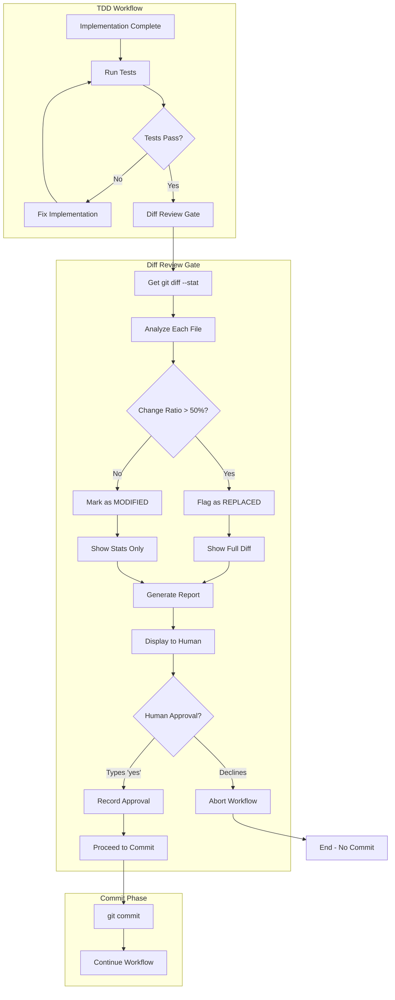

# 171 - Feature: Add Mandatory Diff Review Gate Before Commit in TDD Workflow

<!-- Template Metadata
Last Updated: 2025-01-XX
Updated By: Initial LLD creation
Update Reason: New feature to prevent destructive commits without diff review
-->

## 1. Context & Goal
* **Issue:** #171
* **Objective:** Add a mandatory diff review gate in the TDD workflow that requires explicit human approval before committing changes, especially for files with significant modifications.
* **Status:** Draft
* **Related Issues:** #168 (Bug caused by missing gate), PR #165 (The breaking change)

### Open Questions

- [ ] Should the 50% threshold be configurable per-project or hardcoded?
- [ ] Should we track historical "replacement" patterns to warn about files that frequently get replaced?
- [ ] What timeout behavior should apply when waiting for human approval in CI environments?

## 2. Proposed Changes

*This section is the **source of truth** for implementation. Describe exactly what will be built.*

### 2.1 Files Changed

| File | Change Type | Description |
|------|-------------|-------------|
| `src/workflow/nodes/diff_review_gate.py` | Add | New LangGraph node implementing diff review logic |
| `src/workflow/graph.py` | Modify | Wire diff review gate into workflow before commit node |
| `src/workflow/state.py` | Modify | Add diff review state fields (approval_status, flagged_files) |
| `src/utils/git_diff.py` | Add | Git diff utilities for parsing and analyzing changes |
| `tests/unit/test_diff_review_gate.py` | Add | Unit tests for diff review gate |
| `tests/unit/test_git_diff.py` | Add | Unit tests for git diff utilities |

### 2.2 Dependencies

*No new packages required - uses existing subprocess for git commands.*

```toml
# pyproject.toml additions (if any)
# None - uses stdlib subprocess
```

### 2.3 Data Structures

```python
# Pseudocode - NOT implementation
class FileDiffStats(TypedDict):
    filepath: str                    # Path to file
    lines_added: int                 # Lines added
    lines_deleted: int               # Lines deleted  
    lines_before: int                # Total lines before change
    lines_after: int                 # Total lines after change
    change_ratio: float              # Percentage of file changed (0.0-1.0)
    change_type: Literal["MODIFIED", "REPLACED", "ADDED", "DELETED"]  # Classification

class DiffReviewState(TypedDict):
    diff_stats: list[FileDiffStats]  # Stats for all changed files
    flagged_files: list[str]         # Files requiring explicit review
    human_approved: bool             # Whether human approved the diff
    approval_timestamp: str | None   # ISO timestamp of approval
    bypass_attempted: bool           # Whether bypass was attempted (for audit)

class WorkflowState(TypedDict):
    # ... existing fields ...
    diff_review: DiffReviewState     # New diff review state
```

### 2.4 Function Signatures

```python
# src/utils/git_diff.py
def get_diff_stats(staged_only: bool = True) -> list[FileDiffStats]:
    """Parse git diff --stat and return structured stats for each file."""
    ...

def get_file_diff(filepath: str, staged_only: bool = True) -> str:
    """Get the full diff content for a specific file."""
    ...

def classify_change(stats: FileDiffStats, threshold: float = 0.5) -> str:
    """Classify change as MODIFIED or REPLACED based on change ratio."""
    ...

# src/workflow/nodes/diff_review_gate.py
def diff_review_gate(state: WorkflowState) -> dict:
    """Mandatory diff review node - blocks workflow until human approval."""
    ...

def format_diff_report(stats: list[FileDiffStats], flagged: list[str]) -> str:
    """Format a human-readable diff report with warnings."""
    ...

def require_human_approval(report: str, flagged_files: list[str]) -> bool:
    """Display diff report and require explicit 'yes' confirmation."""
    ...
```

### 2.5 Logic Flow (Pseudocode)

```
1. ENTER diff_review_gate node
2. RUN git diff --stat (staged changes)
3. FOR each changed file:
   a. Parse lines added/deleted
   b. Get original line count from git
   c. Calculate change_ratio = (deleted / original_lines)
   d. IF change_ratio > 0.5:
      - Classify as "REPLACED"
      - Add to flagged_files list
      - ELSE classify as "MODIFIED"
4. GENERATE diff report:
   - Show all files with +/- stats
   - For REPLACED files: "⚠️ WARNING: 80% of state.py was REPLACED (270 → 56 lines)"
   - Show full diff for flagged files
5. DISPLAY report to human
6. PROMPT for explicit approval:
   - "Type 'yes' to approve and commit, 'no' to abort: "
   - Do NOT accept 'y' or empty input
7. IF approved:
   - Record approval_timestamp
   - Set human_approved = True
   - PROCEED to commit node
8. ELSE:
   - Set human_approved = False
   - ABORT workflow with clear message
9. IF --auto mode attempted:
   - Set bypass_attempted = True
   - STILL require human approval (no bypass)
   - Log warning about bypass attempt
```

### 2.6 Technical Approach

* **Module:** `src/workflow/nodes/diff_review_gate.py`
* **Pattern:** LangGraph Node with human-in-the-loop interrupt
* **Key Decisions:** 
  - Use subprocess to call git directly (no pygit2 dependency)
  - Calculate change ratio based on deleted lines vs original file size
  - Require exact "yes" string (not 'y' or enter) for approval

### 2.7 Architecture Decisions

| Decision | Options Considered | Choice | Rationale |
|----------|-------------------|--------|-----------|
| Git interface | pygit2, GitPython, subprocess | subprocess | No new dependencies, simpler, reliable |
| Change threshold | Fixed 50%, Configurable, Per-file | Fixed 50% (initial) | Simple MVP, can add config later |
| Approval mechanism | y/n prompt, GUI dialog, explicit "yes" | Explicit "yes" | Prevents accidental approval on enter |
| Bypass prevention | Config flag, Hardcoded block | Hardcoded block | Critical safety feature, no exceptions |

**Architectural Constraints:**
- Must integrate with existing LangGraph workflow
- Cannot add new external dependencies
- Must work in both interactive terminal and IDE contexts

## 3. Requirements

*What must be true when this is done. These become acceptance criteria.*

1. Workflow shows complete `git diff --stat` before any commit operation
2. Files with >50% line change ratio are flagged with "REPLACED" warning
3. Flagged files display before/after line counts (e.g., "270 → 56 lines")
4. Full diff is displayed for all flagged (REPLACED) files
5. Human must type exact string "yes" to approve (no shortcuts)
6. Diff review gate cannot be bypassed even with `--auto` flag
7. Workflow aborts cleanly with helpful message if human declines
8. All approval/rejection events are logged with timestamps

## 4. Alternatives Considered

| Option | Pros | Cons | Decision |
|--------|------|------|----------|
| Pre-commit git hook | Simple, language-agnostic | Not part of workflow, easy to skip with --no-verify | **Rejected** |
| LangGraph node (selected) | Integrated into workflow, can't bypass, access to workflow state | More complex implementation | **Selected** |
| Post-commit review + rollback | Non-blocking for developer | Damage already done, messy history | **Rejected** |
| AI-based diff review | Could catch semantic issues | Expensive, slow, unreliable for safety | **Rejected** |

**Rationale:** LangGraph node approach ensures the review gate is part of the mandatory workflow path, cannot be bypassed via git flags, and has full access to workflow state for context-aware decisions.

## 5. Data & Fixtures

### 5.1 Data Sources

| Attribute | Value |
|-----------|-------|
| Source | Local git repository (subprocess calls) |
| Format | Git diff output (text), parsed to structured data |
| Size | Variable, depends on changeset (~KB typically) |
| Refresh | Real-time (called at workflow execution) |
| Copyright/License | N/A - local repository data |

### 5.2 Data Pipeline

```
git diff --stat ──parse──► FileDiffStats[] ──analyze──► DiffReviewState
                                                              │
git show HEAD:file ──compare──► line counts ──classify──► MODIFIED/REPLACED
```

### 5.3 Test Fixtures

| Fixture | Source | Notes |
|---------|--------|-------|
| Mock git diff output | Hardcoded strings | Based on real PR #165 output |
| Sample file changes | Generated temp files | Created/modified during test |
| Approval input streams | StringIO mocks | Simulate user input |

### 5.4 Deployment Pipeline

Tests run against temporary git repositories created in pytest fixtures. No external data sources.

**If data source is external:** N/A - all data is local git operations.

## 6. Diagram

### 6.1 Mermaid Quality Gate

Before finalizing any diagram, verify in [Mermaid Live Editor](https://mermaid.live) or GitHub preview:

- [x] **Simplicity:** Similar components collapsed (per 0006 §8.1)
- [x] **No touching:** All elements have visual separation (per 0006 §8.2)
- [x] **No hidden lines:** All arrows fully visible (per 0006 §8.3)
- [x] **Readable:** Labels not truncated, flow direction clear
- [ ] **Auto-inspected:** Agent rendered via mermaid.ink and viewed (per 0006 §8.5)

**Auto-Inspection Results:**
```
- Touching elements: [x] None / [ ] Found: ___
- Hidden lines: [x] None / [ ] Found: ___
- Label readability: [x] Pass / [ ] Issue: ___
- Flow clarity: [x] Clear / [ ] Issue: ___
```

### 6.2 Diagram



## 7. Security & Safety Considerations

### 7.1 Security

| Concern | Mitigation | Status |
|---------|------------|--------|
| Arbitrary command injection via file paths | Sanitize/escape all file paths before shell exec | TODO |
| Malformed git output exploitation | Validate git output format before parsing | TODO |

### 7.2 Safety

| Concern | Mitigation | Status |
|---------|------------|--------|
| Accidental approval (enter key) | Require exact "yes" string, not 'y' or empty | Addressed |
| Bypass via --auto flag | Hardcoded block - no auto-approval ever | Addressed |
| Missed destructive changes | Show full diff for REPLACED files, not just stats | Addressed |
| Hanging on no input | Timeout after 5 minutes with abort | TODO |
| Lost work on abort | Changes remain staged, clear message to user | Addressed |

**Fail Mode:** Fail Closed - If any error occurs, workflow aborts without committing.

**Recovery Strategy:** On abort, staged changes remain staged. User can fix issues and re-run workflow. Git reflog available if needed.

## 8. Performance & Cost Considerations

### 8.1 Performance

| Metric | Budget | Approach |
|--------|--------|----------|
| Latency | < 2s for diff analysis | Subprocess calls are fast, no API calls |
| Memory | < 50MB | Streaming diff output for large files |
| Disk I/O | Minimal | Only reads git objects, no temp files |

**Bottlenecks:** Very large diffs (1000+ files) may be slow to display. Consider pagination.

### 8.2 Cost Analysis

| Resource | Unit Cost | Estimated Usage | Monthly Cost |
|----------|-----------|-----------------|--------------|
| Compute | N/A | Local only | $0 |
| Storage | N/A | No persistence | $0 |
| API calls | N/A | No external APIs | $0 |

**Cost Controls:**
- [x] No external API calls
- [x] No cloud resources required
- [x] Runs entirely locally

**Worst-Case Scenario:** Large monorepo with 10,000 changed files - may need pagination/filtering.

## 9. Legal & Compliance

| Concern | Applies? | Mitigation |
|---------|----------|------------|
| PII/Personal Data | No | Only analyzes code diffs, no PII |
| Third-Party Licenses | No | No new dependencies |
| Terms of Service | No | Uses local git only |
| Data Retention | No | No persistent storage |
| Export Controls | No | Standard development tooling |

**Data Classification:** Internal - development tooling

**Compliance Checklist:**
- [x] No PII stored without consent
- [x] All third-party licenses compatible with project license
- [x] External API usage compliant with provider ToS
- [x] Data retention policy documented

## 10. Verification & Testing

### 10.0 Test Plan (TDD - Complete Before Implementation)

**TDD Requirement:** Tests MUST be written and failing BEFORE implementation begins.

| Test ID | Test Description | Expected Behavior | Status |
|---------|------------------|-------------------|--------|
| T010 | test_diff_stats_parsing | Parse git diff --stat output correctly | RED |
| T020 | test_change_ratio_calculation | Calculate correct change ratio | RED |
| T030 | test_file_classification_modified | Files <50% change classified as MODIFIED | RED |
| T040 | test_file_classification_replaced | Files >50% change classified as REPLACED | RED |
| T050 | test_flagged_files_show_full_diff | REPLACED files show complete diff | RED |
| T060 | test_approval_requires_exact_yes | Only exact "yes" string approves | RED |
| T070 | test_approval_rejects_shortcuts | 'y', 'Y', 'YES', '' all rejected | RED |
| T080 | test_auto_mode_still_requires_approval | --auto flag does not bypass gate | RED |
| T090 | test_abort_preserves_staged_changes | Declined approval keeps changes staged | RED |
| T100 | test_workflow_integration | Gate integrates correctly in LangGraph | RED |

**Coverage Target:** ≥95% for all new code

**TDD Checklist:**
- [ ] All tests written before implementation
- [ ] Tests currently RED (failing)
- [ ] Test IDs match scenario IDs in 10.1
- [ ] Test file created at: `tests/unit/test_diff_review_gate.py`

### 10.1 Test Scenarios

| ID | Scenario | Type | Input | Expected Output | Pass Criteria |
|----|----------|------|-------|-----------------|---------------|
| 010 | Parse simple diff stat | Auto | `file.py \| 10 ++---` | FileDiffStats with correct counts | Parsed correctly |
| 020 | Calculate 80% change ratio | Auto | 270 lines deleted, 56 added, 270 original | change_ratio = 0.8 | Ratio accurate |
| 030 | Classify small change as MODIFIED | Auto | 10% change ratio | change_type = "MODIFIED" | Correct classification |
| 040 | Classify large change as REPLACED | Auto | 80% change ratio | change_type = "REPLACED" | Correct classification |
| 050 | Show full diff for REPLACED file | Auto | REPLACED file in changeset | Full diff in report | Diff visible |
| 060 | Accept exact "yes" approval | Auto | stdin = "yes\n" | human_approved = True | Approval recorded |
| 070 | Reject "y" shortcut | Auto | stdin = "y\n" | Prompt repeats, not approved | Shortcut rejected |
| 080 | Reject empty input | Auto | stdin = "\n" | Prompt repeats, not approved | Empty rejected |
| 090 | Block bypass in auto mode | Auto | --auto flag + no stdin | Workflow blocks, waits | No bypass |
| 100 | Abort on "no" input | Auto | stdin = "no\n" | Workflow aborts, changes staged | Clean abort |
| 110 | Handle new file (no original) | Auto | New file added | change_type = "ADDED" | Correct type |
| 120 | Handle deleted file | Auto | File deleted | change_type = "DELETED" | Correct type |

### 10.2 Test Commands

```bash
# Run all automated tests
poetry run pytest tests/unit/test_diff_review_gate.py tests/unit/test_git_diff.py -v

# Run only fast/mocked tests (exclude live)
poetry run pytest tests/unit/test_diff_review_gate.py -v -m "not live"

# Run with coverage
poetry run pytest tests/unit/test_diff_review_gate.py --cov=src/workflow/nodes/diff_review_gate --cov=src/utils/git_diff --cov-report=term-missing
```

### 10.3 Manual Tests (Only If Unavoidable)

| ID | Scenario | Why Not Automated | Steps |
|----|----------|-------------------|-------|
| M010 | Visual diff formatting | Verify diff is readable in terminal | 1. Run workflow with large change 2. Verify colors/formatting readable 3. Verify line wrapping sensible |

## 11. Risks & Mitigations

| Risk | Impact | Likelihood | Mitigation |
|------|--------|------------|------------|
| Developer friction from extra step | Med | High | Clear messaging, fast execution, only blocks on major changes |
| False positives (REPLACED when not) | Low | Med | Show full diff so human can judge, tune threshold if needed |
| Workflow hangs waiting for input | Med | Low | 5-minute timeout with abort |
| Edge cases in git diff parsing | Med | Med | Comprehensive test fixtures, graceful error handling |
| Breaking existing CI pipelines | High | Med | Document migration path, provide env var override for CI |

## 12. Definition of Done

### Code
- [ ] Implementation complete and linted
- [ ] Code comments reference this LLD (Issue #171)

### Tests
- [ ] All test scenarios pass
- [ ] Test coverage ≥95% for new code

### Documentation
- [ ] LLD updated with any deviations
- [ ] Implementation Report (0103) completed
- [ ] User-facing documentation updated

### Review
- [ ] Code review completed
- [ ] Integration test in real workflow scenario
- [ ] User approval before closing issue

---

## Appendix: Review Log

*Track all review feedback with timestamps and implementation status.*

### Review Summary

| Review | Date | Verdict | Key Issue |
|--------|------|---------|-----------|
| - | - | - | Awaiting review |

**Final Status:** PENDING