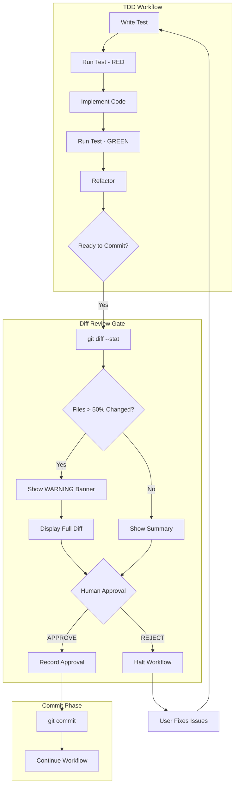
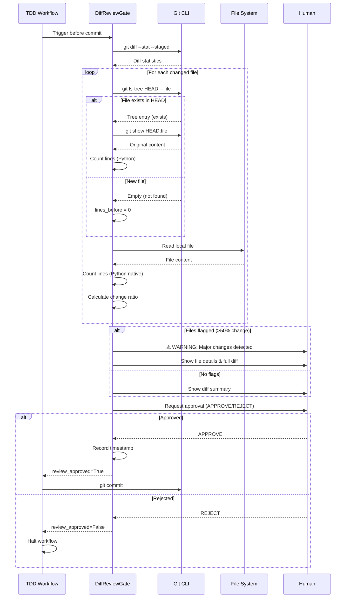

# 171 - Feature: Add mandatory diff review gate before commit in TDD workflow

<!-- Template Metadata
Last Updated: 2025-01-XX
Updated By: Revision addressing Gemini Review #2 feedback
Update Reason: Fixed new file handling logic, replaced shell-based line counting with Python native
-->

## 1. Context & Goal
* **Issue:** #171
* **Objective:** Add a mandatory diff review gate that prevents commits without explicit human approval, especially for files with significant changes
* **Status:** Approved (gemini-3-pro-preview, 2026-02-03)
* **Related Issues:** #168 (bug caused by missing gate), PR #165 (the breaking change)

### Open Questions
*All questions resolved during review.*

## 2. Proposed Changes

*This section is the **source of truth** for implementation. Describe exactly what will be built.*

### 2.1 Files Changed

| File | Change Type | Description |
|------|-------------|-------------|
| `src/workflows/tdd/nodes/diff_review_gate.py` | Add | New node implementing the diff review gate |
| `src/workflows/tdd/graph.py` | Modify | Add diff_review_gate node before commit node |
| `src/workflows/tdd/state.py` | Modify | Add diff review state fields |
| `src/workflows/tdd/models.py` | Modify | Add DiffAnalysis and FileChangeReport models |
| `tests/unit/test_diff_review_gate.py` | Add | Unit tests for diff review gate |
| `tests/integration/test_tdd_workflow_diff_gate.py` | Add | Integration tests for workflow with gate |

### 2.2 Dependencies

*New packages, APIs, or services required.*

```toml
# pyproject.toml additions (if any)
# No new dependencies - uses stdlib subprocess for git commands
```

### 2.3 Data Structures

```python
# Pseudocode - NOT implementation
class FileChangeReport(TypedDict):
    filepath: str               # Relative path to changed file
    lines_before: int           # Line count before change (0 for new files)
    lines_after: int            # Line count after change
    lines_added: int            # Lines added
    lines_deleted: int          # Lines deleted
    change_ratio: float         # Percentage of file changed (0.0-1.0)
    is_new_file: bool           # True if file does not exist in HEAD
    is_replacement: bool        # True if >80% content replaced
    requires_review: bool       # True if change_ratio > threshold

class DiffReviewState(TypedDict):
    diff_stat: str                          # Raw git diff --stat output
    file_reports: list[FileChangeReport]    # Analysis per file
    flagged_files: list[str]                # Files requiring explicit review
    review_approved: bool                   # Human approval status
    approval_timestamp: str | None          # When approval was given
    approval_message: str | None            # Optional approval comment
```

### 2.4 Function Signatures

```python
# Signatures only - implementation in source files
def diff_review_gate(state: WorkflowState) -> dict:
    """Mandatory diff review node - blocks commit until approved."""
    ...

def analyze_git_diff() -> tuple[str, list[FileChangeReport]]:
    """Run git diff --stat and analyze changes per file."""
    ...

def calculate_change_ratio(filepath: str) -> FileChangeReport:
    """Calculate the change ratio for a single file."""
    ...

def format_diff_report(reports: list[FileChangeReport]) -> str:
    """Format diff analysis for human-readable display."""
    ...

def detect_file_replacement(filepath: str, lines_before: int, lines_after: int) -> bool:
    """Detect if file was replaced rather than modified."""
    ...

def is_new_file(filepath: str) -> bool:
    """Check if file exists in HEAD (returns False for new files).
    
    Uses git ls-tree to check if file exists in HEAD without risking
    subprocess failure on new files.
    """
    ...

def count_file_lines(filepath: str) -> int:
    """Count lines in a local file using Python native file handling.
    
    Uses len(open(filepath).readlines()) for cross-platform safety.
    Returns 0 if file does not exist.
    """
    ...

def get_head_file_line_count(filepath: str) -> int:
    """Get line count of file at HEAD revision.
    
    Returns 0 for new files (not in HEAD).
    Uses git show HEAD:filepath piped through Python line counting.
    """
    ...

async def request_human_approval(
    flagged_files: list[FileChangeReport],
    diff_stat: str
) -> tuple[bool, str]:
    """Display diff and request explicit human approval."""
    ...

def run_git_command(args: list[str]) -> subprocess.CompletedProcess:
    """Execute git command safely using list-based subprocess call.
    
    SECURITY: Always uses shell=False and list arguments to prevent injection.
    """
    ...

def is_binary_file(filepath: str) -> bool:
    """Check if file is binary to skip line-based analysis."""
    ...
```

### 2.5 Logic Flow (Pseudocode)

```
1. diff_review_gate node triggered before commit
2. Run `git diff --stat --staged` to get overview (via run_git_command with list args)
3. FOR each changed file:
   a. Check if file is binary (skip line analysis if so)
   b. Check if file is new: run `git ls-tree HEAD -- <filepath>` via run_git_command
      - If exit code != 0 or empty output: file is NEW, lines_before = 0
      - If file exists in HEAD: get lines_before via get_head_file_line_count()
   c. Get line count after using Python native: count_file_lines(filepath)
      - Uses len(open(filepath).readlines()) - no shell required
   d. Calculate change_ratio = (added + deleted) / max(lines_before, 1)
   e. Detect replacement: ratio > 0.8 AND lines_after < lines_before * 0.5
   f. Flag if change_ratio > 0.5 (hardcoded threshold: CHANGE_RATIO_THRESHOLD = 0.5)
   g. For new files: flag if lines_after > 100 (large new file warrants review)
4. IF any flagged files:
   a. Display WARNING banner with file list
   b. For each flagged file, show:
      - "NEW FILE: {file}" for new files
      - "WARNING: 80% of {file} was replaced" (or "REPLACED" for replacement detection)
      - Before/after line counts
      - Full diff for that file
   c. Require explicit approval: "Type APPROVE to continue or REJECT to abort"
5. ELSE (no flagged files):
   a. Display diff stat summary
   b. Still require approval but with softer prompt
6. IF approved:
   a. Record approval timestamp and message
   b. Return state with review_approved=True
   c. Proceed to commit node
7. ELSE:
   a. Return state with review_approved=False
   b. Workflow halts - user must fix and retry
8. CRITICAL: Cannot be bypassed even in --auto mode
   - If --auto flag detected, FAIL with error message
   - "Diff review gate cannot be bypassed. Manual approval required."
```

### 2.6 Technical Approach

* **Module:** `src/workflows/tdd/nodes/`
* **Pattern:** LangGraph interrupt pattern for human-in-the-loop
* **Key Decisions:** 
  - Uses git subprocess calls rather than python git libraries for simplicity
  - **SECURITY:** All subprocess calls use `shell=False` with list-based arguments to prevent command injection
  - **NEW FILE HANDLING:** Explicitly checks if file exists in HEAD before attempting git show
  - **LINE COUNTING:** Uses Python native `len(open(filepath).readlines())` instead of shell `wc -l` for cross-platform safety and `shell=False` compliance
  - **BINARY FILES:** Skips line-based analysis for binary files to avoid errors
  - Implements as a blocking node that cannot be auto-approved
  - Calculates change ratio based on line counts, not semantic diff

### 2.7 Architecture Decisions

*Document key architectural decisions that affect the design.*

| Decision | Options Considered | Choice | Rationale |
|----------|-------------------|--------|-----------|
| Approval mechanism | Auto-approve below threshold, Always require approval | Always require approval | PR #165 showed even "small" changes can be destructive |
| Change detection | Semantic diff, Line-based diff, File hash comparison | Line-based diff | Simple, fast, sufficient for detecting major changes |
| Bypass behavior | Allow bypass with flag, No bypass possible | No bypass possible | Gate exists specifically to prevent auto-commits |
| Threshold configuration | Hardcoded, Config file, CLI flag | Hardcoded constant (0.5) | Start simple; can add config in future issue |
| Subprocess execution | shell=True with string, shell=False with list | shell=False with list | Eliminates command injection risk by design |
| Line counting method | Shell `wc -l`, Python native file read | Python native | Cross-platform, avoids shell=False incompatibility with `<` redirection |
| New file detection | Try/catch on git show, Explicit check with git ls-tree | Explicit check | Prevents subprocess failures on new files (common in TDD Red phase) |

**Architectural Constraints:**
- Must integrate with existing LangGraph workflow structure
- Cannot add external dependencies (use stdlib only)
- Must work with both staged and unstaged changes
- All subprocess calls MUST use `shell=False` with list arguments
- Must handle new files gracefully (TDD Red phase creates new test files)

## 3. Requirements

*What must be true when this is done. These become acceptance criteria.*

1. Workflow MUST show `git diff --stat` before any commit
2. Files with >50% change ratio MUST be flagged with WARNING banner
3. Human MUST explicitly type "APPROVE" (not auto-skip)
4. Diff review gate MUST NOT be bypassable in --auto mode
5. Files that are REPLACED (>80% change, reduced line count) MUST be specially flagged
6. Gate MUST block workflow until approval or rejection received
7. Rejection MUST halt workflow without committing

## 4. Alternatives Considered

| Option | Pros | Cons | Decision |
|--------|------|------|----------|
| Pre-commit hook | Standard git pattern, language agnostic | Can be bypassed with --no-verify, not integrated with workflow state | **Rejected** |
| LangGraph interrupt node | Integrated with workflow, cannot bypass, maintains state | Requires workflow modification | **Selected** |
| Separate review step after commit | Doesn't block bad commits | Defeats the purpose - damage already done | **Rejected** |
| AI-powered semantic diff | Could catch logical errors, not just line changes | Complex, slow, may miss obvious issues | **Rejected** |

**Rationale:** LangGraph interrupt node is selected because it's the only option that truly cannot be bypassed and maintains full workflow state. Pre-commit hooks are too easily bypassed, and post-commit review defeats the purpose.

## 5. Data & Fixtures

*Per [0108-lld-pre-implementation-review.md](0108-lld-pre-implementation-review.md) - complete this section BEFORE implementation.*

### 5.1 Data Sources

| Attribute | Value |
|-----------|-------|
| Source | Local git repository (subprocess calls) |
| Format | Git diff output (text), line counts (integers) |
| Size | Varies by changeset, typically <1MB |
| Refresh | Real-time per workflow run |
| Copyright/License | N/A - local repository data |

### 5.2 Data Pipeline

```
git diff --stat ──subprocess──► Parse stats ──python──► FileChangeReport objects
git ls-tree HEAD ──subprocess──► Check if file exists in HEAD
git show HEAD:file ──subprocess──► Content (for files in HEAD)
Python file read ──native──► Line count (after)
FileChangeReports ──analysis──► Flagged files list ──display──► Human review
```

### 5.3 Test Fixtures

| Fixture | Source | Notes |
|---------|--------|-------|
| Mock git diff output | Generated | Various scenarios: small change, large change, replacement |
| Sample file states | Generated | Before/after versions of test files |
| New file scenarios | Generated | Files not in HEAD (TDD Red phase) |
| Approval responses | Hardcoded | "APPROVE", "REJECT", invalid inputs |
| Malicious filenames | Generated | Files with shell metacharacters for injection testing |
| Binary file samples | Generated | To test skip-analysis logic |

### 5.4 Deployment Pipeline

Test fixtures are self-contained - no external data deployment needed.

**If data source is external:** N/A - all data is local git repository state.

## 6. Diagram

### 6.1 Mermaid Quality Gate

Before finalizing any diagram, verify in [Mermaid Live Editor](https://mermaid.live) or GitHub preview:

- [x] **Simplicity:** Similar components collapsed (per 0006 §8.1)
- [x] **No touching:** All elements have visual separation (per 0006 §8.2)
- [x] **No hidden lines:** All arrows fully visible (per 0006 §8.3)
- [x] **Readable:** Labels not truncated, flow direction clear
- [ ] **Auto-inspected:** Agent rendered via mermaid.ink and viewed (per 0006 §8.5)

**Agent Auto-Inspection (MANDATORY):**

**Auto-Inspection Results:**
```
- Touching elements: [ ] None / [ ] Found: ___
- Hidden lines: [ ] None / [ ] Found: ___
- Label readability: [ ] Pass / [ ] Issue: ___
- Flow clarity: [ ] Clear / [ ] Issue: ___
```

*Reference: [0006-mermaid-diagrams.md](0006-mermaid-diagrams.md)*

### 6.2 Diagram





## 7. Security & Safety Considerations

### 7.1 Security

| Concern | Mitigation | Status |
|---------|------------|--------|
| Command injection via filenames | All subprocess calls use `shell=False` with list-based arguments; no shell interpolation possible | Addressed by design |
| Unauthorized approval | Approval requires interactive terminal session | Addressed |

### 7.2 Safety

*Safety concerns focus on preventing data loss, ensuring fail-safe behavior, and protecting system integrity.*

| Concern | Mitigation | Status |
|---------|------------|--------|
| Accidental data loss (PR #165 scenario) | Mandatory review of all changes before commit | Addressed |
| Auto-mode bypass | Explicit check and fail if --auto detected | Addressed |
| False negative (missing dangerous change) | Show full diff for any flagged file, not just stats | Addressed |
| Workflow state corruption | Atomic state updates, clear approval status on error | Addressed |
| New file handling crash | Explicit check for file existence in HEAD before git show | Addressed |

**Fail Mode:** Fail Closed - If any error occurs during diff analysis, workflow halts rather than allowing commit

**Recovery Strategy:** On failure, workflow state is preserved. User can fix issues and re-run. No partial commits possible.

## 8. Performance & Cost Considerations

### 8.1 Performance

| Metric | Budget | Approach |
|--------|--------|----------|
| Latency | < 5s for typical changeset | Use git subprocess, cache repeated calls |
| Memory | < 50MB | Stream large diffs, don't load entirely into memory |
| Git Calls | 2 + 2N (N = changed files) | Batch where possible; ls-tree + show per file |

**Bottlenecks:** Large files or many changed files may slow analysis. Consider streaming for files > 1MB.

### 8.2 Cost Analysis

| Resource | Unit Cost | Estimated Usage | Monthly Cost |
|----------|-----------|-----------------|--------------|
| Compute | Local | N/A | $0 |
| Storage | Local | N/A | $0 |

**Cost Controls:**
- N/A - All operations are local

**Worst-Case Scenario:** Very large changeset (1000+ files) may take 30+ seconds to analyze. Acceptable for safety-critical gate.

## 9. Legal & Compliance

| Concern | Applies? | Mitigation |
|---------|----------|------------|
| PII/Personal Data | No | Gate only processes code diffs |
| Third-Party Licenses | No | No new dependencies |
| Terms of Service | N/A | Local git operations only |
| Data Retention | No | No persistent storage of diffs |
| Export Controls | No | Standard development tooling |

**Data Classification:** Internal (code under development)

**Compliance Checklist:**
- [x] No PII stored without consent
- [x] All third-party licenses compatible with project license
- [x] External API usage compliant with provider ToS
- [x] Data retention policy documented

## 10. Verification & Testing

*Ref: [0005-testing-strategy-and-protocols.md](0005-testing-strategy-and-protocols.md)*

**Testing Philosophy:** Strive for 100% automated test coverage.

### 10.0 Test Plan (TDD - Complete Before Implementation)

**TDD Requirement:** Tests MUST be written and failing BEFORE implementation begins.

| Test ID | Test Description | Expected Behavior | Status |
|---------|------------------|-------------------|--------|
| T010 | test_diff_stat_parsing | Correctly parse git diff --stat output | RED |
| T015 | test_malicious_filename_handling | Safely handle files with shell metacharacters | RED |
| T016 | test_new_file_detection | Correctly identify files not in HEAD | RED |
| T017 | test_new_file_line_count | lines_before=0 for new files, lines_after counted | RED |
| T018 | test_binary_file_skip | Skip line analysis for binary files | RED |
| T020 | test_change_ratio_calculation | Calculate accurate change ratios | RED |
| T030 | test_replacement_detection | Detect replaced vs modified files | RED |
| T040 | test_flagging_threshold | Flag files > 50% changed | RED |
| T050 | test_approval_flow_approve | Approval allows workflow to continue | RED |
| T060 | test_approval_flow_reject | Rejection halts workflow | RED |
| T070 | test_auto_mode_blocked | --auto mode cannot bypass gate | RED |
| T080 | test_no_changes_scenario | Handle no staged changes gracefully | RED |
| T090 | test_report_formatting | Human-readable report format | RED |
| T100 | test_integration_workflow | Full workflow with gate | RED |

**Coverage Target:** ≥95% for all new code

**TDD Checklist:**
- [ ] All tests written before implementation
- [ ] Tests currently RED (failing)
- [ ] Test IDs match scenario IDs in 10.1
- [ ] Test file created at: `tests/unit/test_diff_review_gate.py`

### 10.1 Test Scenarios

| ID | Scenario | Type | Input | Expected Output | Pass Criteria |
|----|----------|------|-------|-----------------|---------------|
| 010 | Parse simple diff stat | Auto | "file.py \| 10 ++--" | Parsed FileChangeReport | Lines parsed correctly |
| 015 | Handle malicious filename | Auto | File named `test; rm -rf.py` or `$(whoami).txt` | Safe execution, no injection | Command executes safely, file processed normally |
| 016 | Detect new file | Auto | File not in git ls-tree HEAD output | is_new_file=True, lines_before=0 | New file correctly identified |
| 017 | New file line counting | Auto | New file with 50 lines | lines_before=0, lines_after=50 | No subprocess error, counts correct |
| 018 | Binary file handling | Auto | PNG image file | Skip line analysis, no error | No crash, file skipped gracefully |
| 020 | Calculate 50% change ratio | Auto | File: 100→50 lines, 50 deleted | change_ratio=0.5 | Ratio within 0.01 |
| 030 | Detect file replacement | Auto | File: 270→56 lines, 80% deleted | is_replacement=True | Flag set correctly |
| 040 | Flag file over threshold | Auto | change_ratio=0.6 | requires_review=True | Flag set when >0.5 |
| 050 | Approval continues workflow | Auto | Mocked input returning "APPROVE" | review_approved=True | State updated, no error |
| 060 | Rejection halts workflow | Auto | Mocked input returning "REJECT" | review_approved=False | Workflow halted cleanly |
| 070 | Auto mode raises error | Auto | --auto flag + gate | RuntimeError raised | Error message mentions bypass |
| 080 | No staged changes | Auto | Empty git diff | Empty report, soft prompt | No error, allow proceed |
| 090 | Format multi-file report | Auto | 3 FileChangeReports | Formatted string | Contains all files, warnings |
| 100 | Integration: PR #165 scenario | Auto | 270→56 line state.py | WARNING shown, approval required | Cannot commit without APPROVE |

**Note on Input Mocking (T050/T060):** User input is mocked via `unittest.mock.patch` on the `input()` function or LangGraph interrupt payload mechanism. Tests are fully automated and do not require manual interaction.

### 10.2 Test Commands

```bash
# Run all automated tests
poetry run pytest tests/unit/test_diff_review_gate.py -v

# Run only fast/mocked tests (exclude live)
poetry run pytest tests/unit/test_diff_review_gate.py -v -m "not live"

# Run integration tests
poetry run pytest tests/integration/test_tdd_workflow_diff_gate.py -v

# Run with coverage
poetry run pytest tests/ -v --cov=src/workflows/tdd/nodes/diff_review_gate --cov-report=term-missing
```

### 10.3 Manual Tests (Only If Unavoidable)

**N/A - All scenarios automated.**

## 11. Risks & Mitigations

| Risk | Impact | Likelihood | Mitigation |
|------|--------|------------|------------|
| Developer friction from mandatory review | Med | Med | Clear messaging explaining why gate exists; fast path for small changes |
| False positives flagging legitimate refactors | Low | Med | Show full diff so human can make informed decision |
| Git subprocess failures | High | Low | Graceful error handling, clear error messages |
| Change ratio calculation edge cases | Med | Med | Comprehensive test coverage, handle division by zero |
| Approval token collision | Low | Low | Use unique token "APPROVE" not likely in normal text |
| New file crash (TDD Red phase) | High | High | Explicit is_new_file check before git show |
| Binary file errors | Med | Med | is_binary_file check before line counting |

## 12. Definition of Done

### Code
- [ ] Implementation complete and linted
- [ ] Code comments reference this LLD (#171)

### Tests
- [ ] All test scenarios pass (T010-T100)
- [ ] Test coverage ≥95% for new code

### Documentation
- [ ] LLD updated with any deviations
- [ ] Implementation Report (0103) completed
- [ ] Test Report (0113) completed if applicable

### Review
- [ ] Code review completed
- [ ] User approval before closing issue

---

## Appendix: Review Log

*Track all review feedback with timestamps and implementation status.*

### Gemini Review #1 (REVISE)

**Reviewer:** Gemini 3 Pro
**Verdict:** REVISE

#### Comments

| ID | Comment | Implemented? |
|----|---------|--------------|
| G1.1 | "Unaddressed Command Injection Risk: Section 7.1 lists 'Command injection via filenames' mitigation as 'TODO'. Must mandate shell=False and list-based arguments or add test case T015." | YES - Added T015 test scenario in 10.0/10.1, updated 7.1 Security status to "Addressed by design", added architectural decision in 2.7, added run_git_command signature in 2.4, updated 2.6 Technical Approach |
| G1.2 | "Test Assertion Specificity (T050/T060): Ensure test plan explicitly mocks input() function rather than relying on manual interaction." | YES - Added clarification note in Section 10.1 after the test scenarios table |
| G1.3 | "Open questions should be resolved" | YES - Resolved all three open questions, removed question markers |

### Gemini Review #2 (REVISE)

**Reviewer:** Gemini 3 Pro
**Verdict:** REVISE

#### Comments

| ID | Comment | Implemented? |
|----|---------|--------------|
| G2.1 | "Logic Flaw (New Files): The pseudocode logic in Section 2.5, step 3a (`git show HEAD:file`) will fail for new files because they do not exist in HEAD. This will cause the subprocess call to return a non-zero exit code and likely crash the workflow." | YES - Added is_new_file() function in 2.4, updated logic flow in 2.5 step 3b to check with git ls-tree first, added is_new_file field to data structure in 2.3, added T016/T017 test scenarios, added risk mitigation in Section 11 |
| G2.2 | "Implementation Detail (`wc -l` syntax): Section 2.5 uses `wc -l < file`. The `<` redirection is a shell feature. Since shell=False is mandated, this command will fail." | YES - Added count_file_lines() function in 2.4 using Python native file handling, updated logic flow in 2.5 step 3c, added architectural decision in 2.7, updated data pipeline in 5.2 |
| G2.3 | "Binary Files: Consider how `git diff --stat` and line counting behave with binary files." | YES - Added is_binary_file() function in 2.4, added binary file skip logic in 2.5 step 3a, added T018 test scenario, added test fixture for binary files in 5.3, added risk mitigation in Section 11 |

### Review Summary

| Review | Date | Verdict | Key Issue |
|--------|------|---------|-----------|
| 3 | 2026-02-03 | APPROVED | `gemini-3-pro-preview` |
| Gemini #1 | (auto) | REVISE | Command injection risk unaddressed |
| Gemini #2 | (auto) | REVISE | New file handling crash, shell syntax incompatibility |

**Final Status:** APPROVED

## Original GitHub Issue #171
# Issue #171: feat: Add mandatory diff review gate before commit in TDD workflow

## Problem

PR #165 committed auto-generated code without reviewing the diff. The TDD workflow replaced a 270-line `state.py` with a 56-line version, deleting critical enums and fields.

**Root cause:** No mandatory diff review gate before committing.

## Proposed Solution

Add a LangGraph workflow node that:

1. Shows the full `git diff --stat` before commit
2. For files with significant changes (>50% lines changed), shows the actual diff
3. Requires explicit human approval before proceeding
4. Flags files that were REPLACED vs MODIFIED

### Implementation Approach

```python
def diff_review_gate(state: WorkflowState) -> dict:
    """Mandatory diff review before commit."""
    diff_stat = run_git_diff_stat()
    
    for file in files_with_major_changes:
        # Flag: "WARNING: 80% of state.py was replaced"
        # Show before/after line counts
        # Require explicit approval
    pass
```

## Acceptance Criteria

- [ ] Workflow shows diff stats before any commit
- [ ] Files with >50% change ratio are flagged with WARNING
- [ ] Human must explicitly approve (not auto-skip)
- [ ] Diff review cannot be bypassed even in --auto mode

## Related

- Issue #168: Bug caused by missing this gate
- PR #165: The breaking change

**CRITICAL: This LLD is for GitHub Issue #171. Use this exact issue number in all references.**