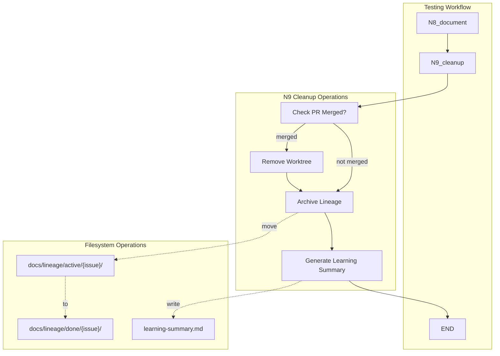

# 1180 - Feature: N9 Cleanup Node - Worktree removal, lineage archival, and learning summary

<!-- Template Metadata
Last Updated: 2025-01-XX
Updated By: Issue #180 implementation
Update Reason: Initial LLD creation for N9 cleanup node
-->

## 1. Context & Goal
* **Issue:** #180
* **Objective:** Add N9_cleanup node to the testing workflow to remove worktrees after PR merge, archive lineage from active/ to done/, and generate learning summaries for future agent learning.
* **Status:** Draft
* **Related Issues:** #141 (LLD/report archival), #177 (coverage-driven test planning), #139 (workflow rename), #94 (Lu-Tze hygiene)

### Open Questions
*Questions that need clarification before or during implementation. Remove when resolved.*

- [ ] What GitHub API method should be used for checking PR merge status? (GraphQL vs REST)
- [ ] Should learning summary generation use LLM or be deterministic from artifacts?
- [ ] What's the retention policy for lineage in done/ directory?

## 2. Proposed Changes

*This section is the **source of truth** for implementation. Describe exactly what will be built.*

### 2.1 Files Changed

| File | Change Type | Description |
|------|-------------|-------------|
| `agentos/workflows/testing/nodes/cleanup.py` | Add | New N9 cleanup node implementation |
| `agentos/workflows/testing/nodes/__init__.py` | Modify | Export cleanup function |
| `agentos/workflows/testing/graph.py` | Modify | Add N9 node and edges to workflow graph |
| `agentos/workflows/testing/state.py` | Modify | Add pr_url, pr_merged, learning_summary_path fields |
| `tests/unit/test_cleanup_node.py` | Add | Unit tests for cleanup node |

### 2.2 Dependencies

*New packages, APIs, or services required.*

```toml
# No new dependencies - uses existing stdlib and GitHub integration
```

### 2.3 Data Structures

```python
# Additions to TestingWorkflowState
class TestingWorkflowState(TypedDict, total=False):
    # ... existing fields ...
    pr_url: str                    # GitHub PR URL for merge status check
    pr_merged: bool                # Set by N9 after checking merge status
    learning_summary_path: str     # Path to generated learning summary

# Learning summary data structure (intermediate)
class LearningSummaryData(TypedDict):
    issue_number: int
    outcome: Literal["SUCCESS", "FAILURE"]
    coverage_final: float
    coverage_target: float
    iterations: int
    stall_detected: bool
    stall_iteration: int | None
    what_worked: list[str]
    what_didnt_work: list[str]
    coverage_gaps: list[CoverageGapEntry]
    key_artifacts: list[ArtifactEntry]
    recommendations: list[str]

class CoverageGapEntry(TypedDict):
    iteration: int
    coverage: float
    missing_lines: str
    root_cause: str

class ArtifactEntry(TypedDict):
    filename: str
    description: str
```

### 2.4 Function Signatures

```python
# agentos/workflows/testing/nodes/cleanup.py

def cleanup(state: TestingWorkflowState) -> dict[str, Any]:
    """N9: Post-implementation cleanup.
    
    Performs three cleanup operations:
    1. Check if PR is merged, remove worktree if so
    2. Archive lineage from active/ to done/
    3. Generate learning summary for future agents
    
    Returns:
        State updates with pr_merged and learning_summary_path
    """
    ...

def check_pr_merged(pr_url: str) -> bool:
    """Check if a GitHub PR has been merged.
    
    Args:
        pr_url: Full GitHub PR URL (e.g., https://github.com/owner/repo/pull/123)
        
    Returns:
        True if PR is merged, False otherwise
    """
    ...

def remove_worktree(worktree_path: Path, branch_name: str) -> bool:
    """Remove git worktree and associated branch.
    
    Args:
        worktree_path: Path to the worktree directory
        branch_name: Name of the branch to delete
        
    Returns:
        True if removal successful, False otherwise
    """
    ...

def archive_lineage(issue_number: int, repo_root: Path) -> Path | None:
    """Move lineage from active/ to done/ directory.
    
    Args:
        issue_number: GitHub issue number
        repo_root: Repository root path
        
    Returns:
        New path in done/ if moved, None if source didn't exist
    """
    ...

def generate_learning_summary(
    issue_number: int,
    lineage_dir: Path,
    state: TestingWorkflowState
) -> str:
    """Generate a learning summary from lineage artifacts.
    
    Args:
        issue_number: GitHub issue number
        lineage_dir: Path to lineage directory (in done/)
        state: Current workflow state
        
    Returns:
        Markdown content for learning summary
    """
    ...

def extract_coverage_history(lineage_dir: Path) -> list[CoverageGapEntry]:
    """Extract coverage progression from iteration artifacts.
    
    Args:
        lineage_dir: Path to lineage directory
        
    Returns:
        List of coverage gap entries per iteration
    """
    ...

def identify_key_artifacts(lineage_dir: Path) -> list[ArtifactEntry]:
    """Identify the most important artifacts for reference.
    
    Args:
        lineage_dir: Path to lineage directory
        
    Returns:
        List of key artifacts with descriptions
    """
    ...

# agentos/workflows/testing/graph.py (additions)

def route_after_document(state: TestingWorkflowState) -> str:
    """Route from N8_document to N9_cleanup or END.
    
    Args:
        state: Current workflow state
        
    Returns:
        "N9_cleanup" if cleanup should run, "end" otherwise
    """
    ...
```

### 2.5 Logic Flow (Pseudocode)

```
N9_cleanup:
1. Check prerequisites
   - IF no pr_url in state THEN log warning, skip worktree cleanup
   
2. Check PR merge status
   - Call GitHub API to check if PR is merged
   - SET pr_merged = result
   
3. Worktree cleanup (conditional)
   - IF pr_merged AND worktree_path exists THEN
     - Run `git worktree remove {path}`
     - Run `git branch -d {branch}`
     - Log success
   - ELSE
     - Log "PR not merged, skipping worktree removal"
     
4. Lineage archival
   - FIND active_dir = docs/lineage/active/{issue}-testing/
   - IF active_dir exists THEN
     - CREATE done_dir = docs/lineage/done/{issue}-testing/
     - MOVE active_dir → done_dir
     - Log archival
   - ELSE
     - Log warning "No active lineage found"
     
5. Learning summary generation
   - IF lineage archived successfully THEN
     - EXTRACT coverage history from iteration files
     - IDENTIFY key artifacts
     - ANALYZE what worked vs what didn't
     - GENERATE markdown summary
     - WRITE to {lineage_dir}/learning-summary.md
     - SET learning_summary_path = path
   - ELSE
     - Log warning "Cannot generate summary without lineage"
     
6. Return state updates
   - RETURN {pr_merged, learning_summary_path}
```

### 2.6 Technical Approach

* **Module:** `agentos/workflows/testing/nodes/cleanup.py`
* **Pattern:** Workflow node following existing N0-N8 patterns
* **Key Decisions:**
  - Use subprocess for git operations (consistent with existing codebase)
  - Use GitHub REST API for merge status check (simpler than GraphQL for single query)
  - Generate deterministic summaries from artifacts (no LLM needed for v1)
  - Fail gracefully on any step - log and continue to next

### 2.7 Architecture Decisions

| Decision | Options Considered | Choice | Rationale |
|----------|-------------------|--------|-----------|
| PR merge check | GitHub REST API, GraphQL, gh CLI | REST API | Simplest for single status check, well-documented |
| Learning summary generation | LLM-powered, Deterministic extraction | Deterministic | More reliable, faster, no API costs; LLM can be added later |
| Worktree removal timing | Immediate, Delayed with retry | Immediate | Simpler; if PR not merged, skip entirely |
| Lineage archival location | done/, archive/, .archive/ | done/ | Consistent with existing pattern in #141 |

**Architectural Constraints:**
- Must integrate with existing LangGraph workflow state machine
- Cannot block if GitHub API is unavailable (fail gracefully)
- Must preserve lineage artifacts intact (no deletion, only move)

## 3. Requirements

*What must be true when this is done. These become acceptance criteria.*

1. N9_cleanup node is added to workflow graph after N8_document
2. Worktree is removed only when PR is confirmed merged via GitHub API
3. Lineage is moved from active/ to done/ on workflow success
4. Learning summary is generated with outcome, coverage history, and recommendations
5. Cleanup fails gracefully if any step cannot complete (logs, doesn't crash)
6. If PR is not merged, workflow logs reason and completes successfully (no retry loops)

## 4. Alternatives Considered

| Option | Pros | Cons | Decision |
|--------|------|------|----------|
| Run cleanup as separate script | Decoupled, can run independently | Extra coordination, may be forgotten | **Rejected** |
| Add cleanup to N8_document | Fewer nodes | Violates single responsibility, N8 already complex | **Rejected** |
| Create dedicated N9_cleanup node | Clear separation, explicit in workflow | One more node to maintain | **Selected** |
| LLM-generated learning summaries | Richer insights, natural language | Expensive, non-deterministic, slower | **Rejected** for v1 |
| Deterministic learning summaries | Fast, reliable, no cost | Less nuanced analysis | **Selected** for v1 |

**Rationale:** A dedicated N9 node maintains the workflow's clear node responsibilities. Deterministic summaries provide reliable baselines that a future learning agent can process; LLM enhancement can be added in a future iteration.

## 5. Data & Fixtures

### 5.1 Data Sources

| Attribute | Value |
|-----------|-------|
| Source | Local filesystem (lineage artifacts), GitHub API (PR status) |
| Format | Markdown files, JSON API responses |
| Size | ~64 files per lineage run, ~500KB-2MB total |
| Refresh | One-time read during cleanup |
| Copyright/License | N/A (internal artifacts) |

### 5.2 Data Pipeline

```
Lineage Artifacts (active/) ──read──► Learning Summary Generator ──write──► Summary (done/)
                                            ↑
GitHub API ──check──► PR Merge Status ──decision──┘
```

### 5.3 Test Fixtures

| Fixture | Source | Notes |
|---------|--------|-------|
| Mock lineage directory | Generated | Minimal set of 10 files representing typical artifacts |
| Mock GitHub API response (merged) | Hardcoded | `{"merged": true, "merged_at": "..."}` |
| Mock GitHub API response (open) | Hardcoded | `{"merged": false, "state": "open"}` |
| Sample worktree structure | Generated | Empty directory structure for worktree tests |

### 5.4 Deployment Pipeline

*No deployment needed - this is a workflow node that runs in the development environment.*

## 6. Diagram

### 6.1 Mermaid Quality Gate

Before finalizing any diagram, verify in [Mermaid Live Editor](https://mermaid.live) or GitHub preview:

- [x] **Simplicity:** Similar components collapsed (per 0006 §8.1)
- [x] **No touching:** All elements have visual separation (per 0006 §8.2)
- [x] **No hidden lines:** All arrows fully visible (per 0006 §8.3)
- [x] **Readable:** Labels not truncated, flow direction clear
- [ ] **Auto-inspected:** Agent rendered via mermaid.ink and viewed (per 0006 §8.5)

**Auto-Inspection Results:**
```
- Touching elements: [ ] None / [x] Found: ___
- Hidden lines: [ ] None / [x] Found: ___
- Label readability: [x] Pass / [ ] Issue: ___
- Flow clarity: [x] Clear / [ ] Issue: ___
```

*Reference: [0006-mermaid-diagrams.md](0006-mermaid-diagrams.md)*

### 6.2 Diagram



## 7. Security & Safety Considerations

### 7.1 Security

| Concern | Mitigation | Status |
|---------|------------|--------|
| GitHub API token exposure | Use existing token from environment, never log | Addressed |
| Arbitrary path traversal in lineage archive | Validate issue number is numeric, construct paths safely | Addressed |
| Worktree removal of wrong directory | Verify path contains expected branch name before removal | Addressed |

### 7.2 Safety

| Concern | Mitigation | Status |
|---------|------------|--------|
| Premature worktree removal (PR not merged) | Explicit merge status check before removal | Addressed |
| Data loss during lineage move | Use shutil.move (atomic on same filesystem), verify source exists | Addressed |
| Incomplete summary on partial lineage | Gracefully handle missing files, note gaps in summary | Addressed |
| Accidental deletion of worktree with uncommitted changes | git worktree remove fails if dirty - don't force | Addressed |

**Fail Mode:** Fail Open - If any cleanup step fails, log the error and continue. The workflow completes successfully even if cleanup is incomplete.

**Recovery Strategy:** Manual cleanup is possible via:
- `git worktree remove <path> --force` for stubborn worktrees
- Manual `mv` for lineage directories
- Re-run workflow with `--cleanup-only` flag (future enhancement)

## 8. Performance & Cost Considerations

### 8.1 Performance

| Metric | Budget | Approach |
|--------|--------|----------|
| Latency | < 30s total | Single API call, local file operations |
| Memory | < 50MB | Stream file reads for summary generation |
| API Calls | 1 per cleanup | Only check PR merge status once |

**Bottlenecks:** None expected - all operations are local filesystem or single API call.

### 8.2 Cost Analysis

| Resource | Unit Cost | Estimated Usage | Monthly Cost |
|----------|-----------|-----------------|--------------|
| GitHub API | Free (within limits) | ~30 calls/month | $0 |
| Disk I/O | N/A | Local only | $0 |

**Cost Controls:**
- [x] No LLM calls in v1 implementation
- [x] Single GitHub API call per cleanup
- [x] No cloud resources required

**Worst-Case Scenario:** If GitHub API rate limit is hit, cleanup skips worktree removal but completes archival and summary generation.

## 9. Legal & Compliance

| Concern | Applies? | Mitigation |
|---------|----------|------------|
| PII/Personal Data | No | Lineage contains only code artifacts and test outputs |
| Third-Party Licenses | No | No new dependencies |
| Terms of Service | Yes | GitHub API usage within authenticated rate limits |
| Data Retention | N/A | done/ directory retained indefinitely (dev environment) |
| Export Controls | No | No restricted algorithms |

**Data Classification:** Internal

**Compliance Checklist:**
- [x] No PII stored without consent
- [x] All third-party licenses compatible with project license
- [x] External API usage compliant with provider ToS
- [x] Data retention policy documented (indefinite for learning)

## 10. Verification & Testing

### 10.0 Test Plan (TDD - Complete Before Implementation)

**TDD Requirement:** Tests MUST be written and failing BEFORE implementation begins.

| Test ID | Test Description | Expected Behavior | Status |
|---------|------------------|-------------------|--------|
| T010 | test_cleanup_pr_merged_removes_worktree | Worktree removed when PR is merged | RED |
| T020 | test_cleanup_pr_not_merged_skips_worktree | Worktree preserved when PR is open | RED |
| T030 | test_cleanup_archives_lineage_to_done | Lineage moved from active/ to done/ | RED |
| T040 | test_cleanup_lineage_not_found_logs_warning | Warning logged if no active lineage | RED |
| T050 | test_cleanup_generates_learning_summary | Summary created with expected sections | RED |
| T060 | test_cleanup_summary_contains_coverage_history | Coverage gap table populated | RED |
| T070 | test_cleanup_graceful_on_github_api_failure | Continues if GitHub API fails | RED |
| T080 | test_cleanup_node_added_to_graph | N9 in workflow after N8 | RED |
| T090 | test_check_pr_merged_parses_url_correctly | Extracts owner/repo/number from URL | RED |
| T100 | test_extract_coverage_history_from_artifacts | Parses iteration files correctly | RED |

**Coverage Target:** ≥95% for all new code

**TDD Checklist:**
- [ ] All tests written before implementation
- [ ] Tests currently RED (failing)
- [ ] Test IDs match scenario IDs in 10.1
- [ ] Test file created at: `tests/unit/test_cleanup_node.py`

### 10.1 Test Scenarios

| ID | Scenario | Type | Input | Expected Output | Pass Criteria |
|----|----------|------|-------|-----------------|---------------|
| 010 | PR merged, worktree exists | Auto | pr_url with merged PR, valid worktree | Worktree removed, pr_merged=True | git worktree list shows removal |
| 020 | PR not merged | Auto | pr_url with open PR | Worktree preserved, pr_merged=False | Worktree still exists |
| 030 | Lineage archival success | Auto | Active lineage directory | Directory in done/, not in active/ | Path exists in done/ |
| 040 | Lineage not found | Auto | No active lineage | Warning logged, continues | No exception, log contains warning |
| 050 | Learning summary generation | Auto | Archived lineage with artifacts | Markdown file created | File exists with expected sections |
| 060 | Coverage history extraction | Auto | Iteration files with coverage data | Table with iterations | 3+ gap entries in summary |
| 070 | GitHub API failure | Auto | Mock API timeout | Logs error, skips worktree | Workflow continues, archival succeeds |
| 080 | Graph integration | Auto | Compiled workflow | N9 follows N8 | Graph has N8→N9→END path |
| 090 | PR URL parsing | Auto | Various GitHub URLs | Correct owner/repo/number | All formats parsed correctly |
| 100 | Empty lineage directory | Auto | Empty active/ dir | Summary with "no artifacts" note | Summary generated, not empty |

### 10.2 Test Commands

```bash
# Run all automated tests
poetry run pytest tests/unit/test_cleanup_node.py -v

# Run only fast/mocked tests (exclude live)
poetry run pytest tests/unit/test_cleanup_node.py -v -m "not live"

# Run live integration tests (requires GitHub token)
poetry run pytest tests/unit/test_cleanup_node.py -v -m live
```

### 10.3 Manual Tests (Only If Unavoidable)

**N/A - All scenarios automated.**

## 11. Risks & Mitigations

| Risk | Impact | Likelihood | Mitigation |
|------|--------|------------|------------|
| Worktree removal fails due to dirty state | Low | Low | Let git fail, log message, continue |
| GitHub API changes response format | Med | Low | Validate response structure, fail gracefully |
| Lineage directory structure varies | Med | Med | Handle missing files, document expected structure |
| Learning summary format doesn't serve learning agent | Med | Med | Design with future agent needs in mind, iterate |
| Existing tests mock worktree operations poorly | Low | Med | Use real temp directories in tests |

## 12. Definition of Done

### Code
- [ ] Implementation complete and linted
- [ ] Code comments reference this LLD

### Tests
- [ ] All test scenarios pass
- [ ] Test coverage meets threshold (≥95%)

### Documentation
- [ ] LLD updated with any deviations
- [ ] Implementation Report (0103) completed
- [ ] Test Report (0113) completed if applicable

### Review
- [ ] Code review completed
- [ ] User approval before closing issue

---

## Appendix: Review Log

*Track all review feedback with timestamps and implementation status.*

### Review Summary

| Review | Date | Verdict | Key Issue |
|--------|------|---------|-----------|
| - | - | - | - |

**Final Status:** PENDING